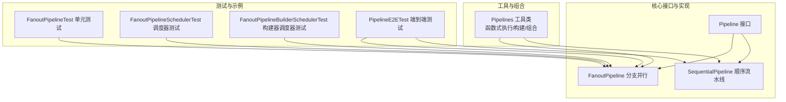
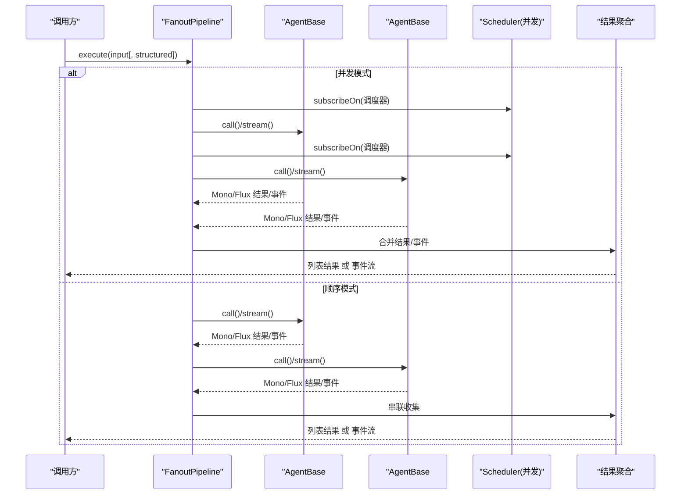
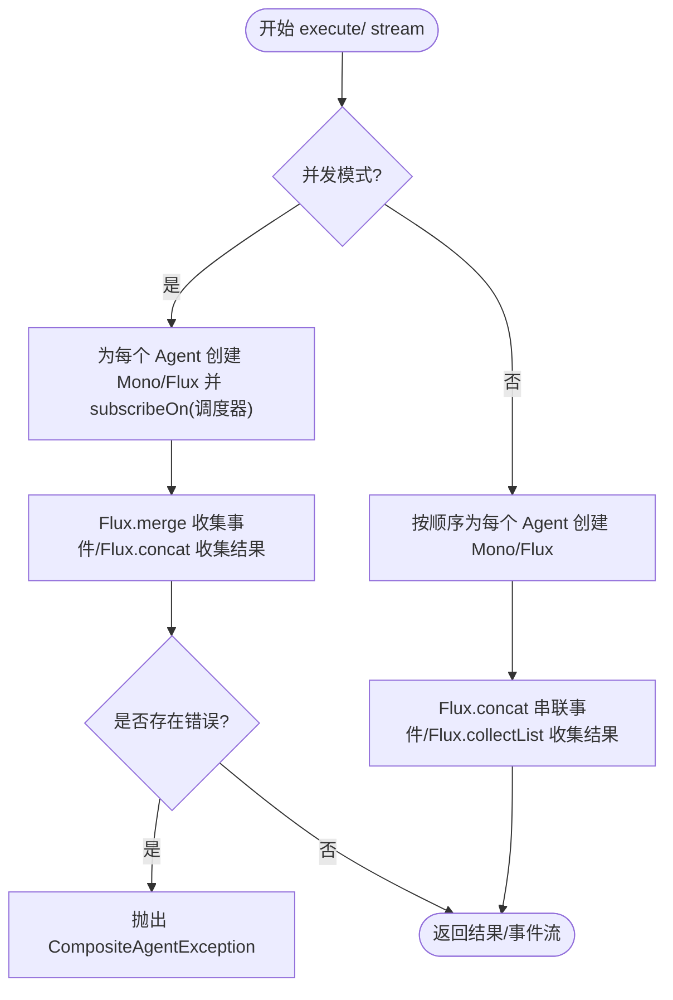
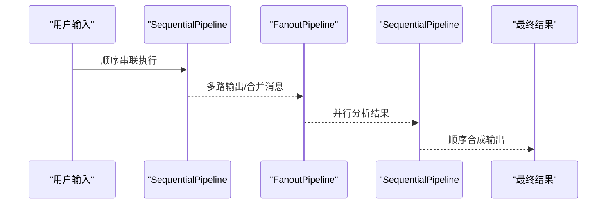
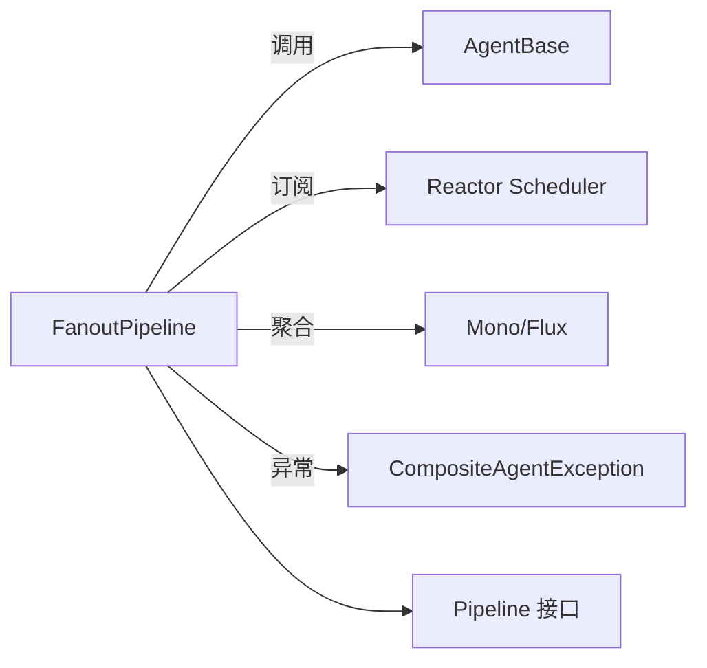

# 分支管道

<cite>
**本文引用的文件**
- [FanoutPipeline.java](file://agentscope-core/src/main/java/io/agentscope/core/pipeline/FanoutPipeline.java)
- [Pipeline.java](file://agentscope-core/src/main/java/io/agentscope/core/pipeline/Pipeline.java)
- [SequentialPipeline.java](file://agentscope-core/src/main/java/io/agentscope/core/pipeline/SequentialPipeline.java)
- [Pipelines.java](file://agentscope-core/src/main/java/io/agentscope/core/pipeline/Pipelines.java)
- [FanoutPipelineTest.java](file://agentscope-core/src/test/java/io/agentscope/core/pipeline/FanoutPipelineTest.java)
- [FanoutPipelineSchedulerTest.java](file://agentscope-core/src/test/java/io/agentscope/core/pipeline/FanoutPipelineSchedulerTest.java)
- [FanoutPipelineBuilderSchedulerTest.java](file://agentscope-core/src/test/java/io/agentscope/core/pipeline/FanoutPipelineBuilderSchedulerTest.java)
- [PipelineE2ETest.java](file://agentscope-core/src/test/java/io/agentscope/core/e2e/PipelineE2ETest.java)
- [ReActAgent.java](file://agentscope-core/src/main/java/io/agentscope/core/ReActAgent.java)
- [CompositeAgentException.java](file://agentscope-core/src/main/java/io/agentscope/core/exception/CompositeAgentException.java)
- [Msg.java](file://agentscope-core/src/main/java/io/agentscope/core/message/Msg.java)
- [Event.java](file://agentscope-core/src/main/java/io/agentscope/core/agent/Event.java)
- [StreamOptions.java](file://agentscope-core/src/main/java/io/agentscope/core/agent/StreamOptions.java)
- [Toolkit.java](file://agentscope-core/src/main/java/io/agentscope/core/tool/Toolkit.java)
- [InMemoryMemory.java](file://agentscope-core/src/main/java/io/agentscope/core/memory/InMemoryMemory.java)
- [MockModel.java](file://agentscope-core/src/test/java/io/agentscope/core/agent/test/MockModel.java)
- [TestUtils.java](file://agentscope-core/src/test/java/io/agentscope/core/agent/test/TestUtils.java)
</cite>

## 目录
1. [简介](#简介)
2. [项目结构](#项目结构)
3. [核心组件](#核心组件)
4. [架构总览](#架构总览)
5. [详细组件分析](#详细组件分析)
6. [依赖分析](#依赖分析)
7. [性能考虑](#性能考虑)
8. [故障排查指南](#故障排查指南)
9. [结论](#结论)
10. [附录](#附录)

## 简介
本文件面向 AgentScope Java 分支的“分支管道”（FanoutPipeline）技术文档，系统性阐述其并行执行模型、任务分割与并发控制、结果聚合机制、调度算法与资源优化、配置选项（并发度、超时、错误处理）、典型用法与复杂混合工作流、性能特征与扩展性、监控指标以及故障恢复与优雅降级策略。文档同时提供可追溯的源码路径，便于读者定位实现细节。

## 项目结构
分支管道位于 agentscope-core 模块的 pipeline 包中，核心接口与实现如下：
- 接口：Pipeline<T> 定义统一的执行契约
- 实现：SequentialPipeline（顺序流水线）、FanoutPipeline（分支并行）
- 工具类：Pipelines 提供函数式便捷方法与组合能力
- 测试与示例：单元测试覆盖并发/顺序、事件流、调度器、空管道等场景；端到端测试验证真实模型提供商下的多代理并行与串联组合

图表来源
- [Pipeline.java:29-75](file://agentscope-core/src/main/java/io/agentscope/core/pipeline/Pipeline.java#L29-L75)
- [SequentialPipeline.java:39-185](file://agentscope-core/src/main/java/io/agentscope/core/pipeline/SequentialPipeline.java#L39-L185)
- [FanoutPipeline.java:49-457](file://agentscope-core/src/main/java/io/agentscope/core/pipeline/FanoutPipeline.java#L49-L457)
- [Pipelines.java:32-252](file://agentscope-core/src/main/java/io/agentscope/core/pipeline/Pipelines.java#L32-L252)
- [FanoutPipelineTest.java:51-437](file://agentscope-core/src/test/java/io/agentscope/core/pipeline/FanoutPipelineTest.java#L51-L437)
- [FanoutPipelineSchedulerTest.java:53-202](file://agentscope-core/src/test/java/io/agentscope/core/pipeline/FanoutPipelineSchedulerTest.java#L53-L202)
- [FanoutPipelineBuilderSchedulerTest.java:52-307](file://agentscope-core/src/test/java/io/agentscope/core/pipeline/FanoutPipelineBuilderSchedulerTest.java#L52-L307)
- [PipelineE2ETest.java:53-407](file://agentscope-core/src/test/java/io/agentscope/core/e2e/PipelineE2ETest.java#L53-L407)

章节来源
- [Pipeline.java:29-75](file://agentscope-core/src/main/java/io/agentscope/core/pipeline/Pipeline.java#L29-L75)
- [SequentialPipeline.java:39-185](file://agentscope-core/src/main/java/io/agentscope/core/pipeline/SequentialPipeline.java#L39-L185)
- [FanoutPipeline.java:49-457](file://agentscope-core/src/main/java/io/agentscope/core/pipeline/FanoutPipeline.java#L49-L457)
- [Pipelines.java:32-252](file://agentscope-core/src/main/java/io/agentscope/core/pipeline/Pipelines.java#L32-L252)

## 核心组件
- Pipeline<T>：定义 execute(Msg)、execute(Msg, Class<?>)、execute() 等统一执行入口，并提供默认描述信息
- SequentialPipeline：按序串联多个 Agent，前一 Agent 输出作为下一 Agent 输入；支持结构化输出仅在最后一个 Agent 生效
- FanoutPipeline：将同一输入广播给多个 Agent 并行或串行执行，收集所有结果；并发模式下使用 Reactor 调度器隔离线程，保证 I/O 密集型并行；错误聚合为 CompositeAgentException
- Pipelines：提供函数式便捷方法（sequential/fanout/fanoutSequential/create...），以及顺序流水线组合器

章节来源
- [Pipeline.java:29-75](file://agentscope-core/src/main/java/io/agentscope/core/pipeline/Pipeline.java#L29-L75)
- [SequentialPipeline.java:39-185](file://agentscope-core/src/main/java/io/agentscope/core/pipeline/SequentialPipeline.java#L39-L185)
- [FanoutPipeline.java:49-457](file://agentscope-core/src/main/java/io/agentscope/core/pipeline/FanoutPipeline.java#L49-L457)
- [Pipelines.java:32-252](file://agentscope-core/src/main/java/io/agentscope/core/pipeline/Pipelines.java#L32-L252)

## 架构总览
分支管道在 FanoutPipeline 中通过 Reactor 的 Mono/Flux 实现非阻塞并行与事件流合并。并发模式下，每个 Agent 的调用订阅到独立线程池（默认 boundedElastic），失败被记录但不影响其他 Agent 执行；最终将所有成功结果聚合为列表，若存在错误则抛出复合异常。顺序模式下，各 Agent 独立输入、依次执行，保持插入顺序的结果序列。

图表来源
- [FanoutPipeline.java:104-189](file://agentscope-core/src/main/java/io/agentscope/core/pipeline/FanoutPipeline.java#L104-L189)
- [FanoutPipeline.java:243-355](file://agentscope-core/src/main/java/io/agentscope/core/pipeline/FanoutPipeline.java#L243-L355)

## 详细组件分析

### FanoutPipeline 并行执行模型
- 任务分割策略
  - 将单一输入复制给每个 Agent，形成独立调用链；并发模式下每个调用独立订阅到调度器线程
  - 支持结构化输出：当传入 structuredOutputClass 时，对应 Agent 的 call/stream 使用该类型参数
- 并发控制
  - 默认使用 Schedulers.boundedElastic()，适合 I/O 密集型并行；可通过构造函数或 Builder 注入自定义 Scheduler
  - 并发模式下，subscribeOn(scheduler) 将订阅切换到指定线程池，避免阻塞主线程
- 结果聚合机制
  - 并发：Flux.merge 收集所有 Mono/Flux，最终 collectList 返回列表；错误收集到同步列表，完成后统一抛出 CompositeAgentException
  - 顺序：Flux.concat 串联事件或结果，保证顺序一致性
- 错误处理
  - 每个 Agent 的 onError 会被捕获并记录 Agent 异常信息，不影响其他 Agent 继续执行
  - 事件流模式在 onComplete 阶段检查错误集合，若存在则抛出复合异常

图表来源
- [FanoutPipeline.java:127-189](file://agentscope-core/src/main/java/io/agentscope/core/pipeline/FanoutPipeline.java#L127-L189)
- [FanoutPipeline.java:295-355](file://agentscope-core/src/main/java/io/agentscope/core/pipeline/FanoutPipeline.java#L295-L355)

章节来源
- [FanoutPipeline.java:104-189](file://agentscope-core/src/main/java/io/agentscope/core/pipeline/FanoutPipeline.java#L104-L189)
- [FanoutPipeline.java:243-355](file://agentscope-core/src/main/java/io/agentscope/core/pipeline/FanoutPipeline.java#L243-L355)
- [CompositeAgentException.java](file://agentscope-core/src/main/java/io/agentscope/core/exception/CompositeAgentException.java)

### 调度算法与资源优化
- 负载均衡
  - 并发模式下，每个 Agent 的调用独立提交到调度器，天然实现任务级并行；调度器根据线程池容量动态分配
- 任务分配
  - FanoutPipeline 不进行细粒度的任务切分，而是将“相同输入”广播给所有 Agent；顺序模式下按插入顺序依次执行
- 资源优化
  - 默认 boundedElastic 适合 I/O 密集型；可注入自定义 Scheduler 控制线程数与队列行为
  - 事件流模式下，使用 Flux.merge/concat 控制背压与事件合并，避免内存峰值过高

章节来源
- [FanoutPipeline.java:127-189](file://agentscope-core/src/main/java/io/agentscope/core/pipeline/FanoutPipeline.java#L127-L189)
- [FanoutPipeline.java:295-355](file://agentscope-core/src/main/java/io/agentscope/core/pipeline/FanoutPipeline.java#L295-L355)
- [FanoutPipelineSchedulerTest.java:68-149](file://agentscope-core/src/test/java/io/agentscope/core/pipeline/FanoutPipelineSchedulerTest.java#L68-L149)
- [FanoutPipelineBuilderSchedulerTest.java:67-234](file://agentscope-core/src/test/java/io/agentscope/core/pipeline/FanoutPipelineBuilderSchedulerTest.java#L67-L234)

### 配置选项与使用示例
- 并发度设置
  - 构造函数与 Builder 均支持并发开关与自定义 Scheduler；默认并发开启
- 超时控制
  - 通过 Mono.block(Duration) 或 StepVerifier 等测试工具控制等待时间；生产环境建议结合超时策略与背压控制
- 错误处理策略
  - 并发/顺序均对单个 Agent 失败进行隔离；最终聚合阶段抛出 CompositeAgentException，包含所有失败详情
- 典型用法
  - 构造与执行：参考单元测试中的并发/顺序执行、事件流、结构化输出等用例
  - 函数式便捷方法：Pipelines.fanout/sequential/fanoutSequential 提供一次性执行
  - 端到端示例：E2E 测试展示了真实模型提供商下的并行分析与串联合成流程

章节来源
- [FanoutPipeline.java:63-97](file://agentscope-core/src/main/java/io/agentscope/core/pipeline/FanoutPipeline.java#L63-L97)
- [FanoutPipeline.java:378-456](file://agentscope-core/src/main/java/io/agentscope/core/pipeline/FanoutPipeline.java#L378-L456)
- [Pipelines.java:94-210](file://agentscope-core/src/main/java/io/agentscope/core/pipeline/Pipelines.java#L94-L210)
- [FanoutPipelineTest.java:68-208](file://agentscope-core/src/test/java/io/agentscope/core/pipeline/FanoutPipelineTest.java#L68-L208)
- [PipelineE2ETest.java:144-225](file://agentscope-core/src/test/java/io/agentscope/core/e2e/PipelineE2ETest.java#L144-L225)

### 复杂混合工作流
- 顺序+分支组合：先顺序串联若干 Agent，再对输出进行 Fanout 并行分析，最后再顺序合成
- 端到端示例：E2E 测试演示了“并行分析（Fanout）+ 顺序合成（Sequential）”的混合流程

图表来源
- [SequentialPipeline.java:59-94](file://agentscope-core/src/main/java/io/agentscope/core/pipeline/SequentialPipeline.java#L59-L94)
- [FanoutPipeline.java:104-112](file://agentscope-core/src/main/java/io/agentscope/core/pipeline/FanoutPipeline.java#L104-L112)
- [PipelineE2ETest.java:352-406](file://agentscope-core/src/test/java/io/agentscope/core/e2e/PipelineE2ETest.java#L352-L406)

## 依赖分析
- FanoutPipeline 依赖 Reactor 的 Mono/Flux 与 Scheduler，用于并发订阅与事件合并
- 与 AgentBase 的交互通过 call()/stream()，支持结构化输出与事件流
- 与 Pipeline 接口保持一致的执行契约，便于与其他流水线组合

图表来源
- [FanoutPipeline.java:133-168](file://agentscope-core/src/main/java/io/agentscope/core/pipeline/FanoutPipeline.java#L133-L168)
- [Pipeline.java:29-75](file://agentscope-core/src/main/java/io/agentscope/core/pipeline/Pipeline.java#L29-L75)
- [CompositeAgentException.java](file://agentscope-core/src/main/java/io/agentscope/core/exception/CompositeAgentException.java)

章节来源
- [FanoutPipeline.java:127-189](file://agentscope-core/src/main/java/io/agentscope/core/pipeline/FanoutPipeline.java#L127-L189)
- [Pipeline.java:29-75](file://agentscope-core/src/main/java/io/agentscope/core/pipeline/Pipeline.java#L29-L75)

## 性能考虑
- 并发度与线程池
  - 默认 boundedElastic 适合 I/O 密集型；可根据业务特征调整线程池大小与队列长度
- 背压与内存
  - 事件流采用 Flux.merge/concat，注意上游背压策略与下游消费速率匹配，避免内存峰值
- 结果聚合
  - 并发模式下 collectList 会累积所有结果；大规模并行时建议限制并发度或分批执行
- 超时与取消
  - 建议在上层引入超时与取消机制，防止长时间阻塞；结合 Reactor 的 timeout 与 cancelOnDispose

## 故障排查指南
- 并发失败聚合
  - 若出现 CompositeAgentException，检查异常列表中的 Agent 名称与错误原因，定位具体失败 Agent
- 事件流中断
  - 事件流在 onComplete 阶段检查错误集合，若存在错误会抛出异常；确认各 Agent 的 onErrorResume 配置
- 调度器问题
  - 自定义调度器未正确释放会导致资源泄漏；确保在使用后 dispose() 或由容器管理生命周期
- 空管道
  - 空 Agent 列表将返回空结果；确认构建器或构造函数是否正确添加 Agent

章节来源
- [FanoutPipelineTest.java:125-176](file://agentscope-core/src/test/java/io/agentscope/core/pipeline/FanoutPipelineTest.java#L125-L176)
- [FanoutPipelineTest.java:421-436](file://agentscope-core/src/test/java/io/agentscope/core/pipeline/FanoutPipelineTest.java#L421-L436)
- [FanoutPipelineSchedulerTest.java:68-149](file://agentscope-core/src/test/java/io/agentscope/core/pipeline/FanoutPipelineSchedulerTest.java#L68-L149)
- [FanoutPipelineBuilderSchedulerTest.java:67-234](file://agentscope-core/src/test/java/io/agentscope/core/pipeline/FanoutPipelineBuilderSchedulerTest.java#L67-L234)

## 结论
FanoutPipeline 提供了简洁而强大的分支并行执行能力，通过 Reactor 的响应式模型实现高吞吐与低阻塞；其并发控制、结果聚合与错误处理策略兼顾了可用性与可观测性。配合 Pipelines 工具类与端到端示例，可在真实场景中快速搭建从并行分析到顺序合成的混合工作流。

## 附录
- 快速上手示例
  - 并行分析：参考端到端测试中的 fanout 并行分析与顺序合成流程
  - 事件流：参考单元测试中 stream() 的事件类型过滤与顺序验证
- 关键实现路径
  - 并发执行与事件合并：[FanoutPipeline.java:127-189](file://agentscope-core/src/main/java/io/agentscope/core/pipeline/FanoutPipeline.java#L127-L189)
  - 顺序执行与事件串联：[FanoutPipeline.java:178-189](file://agentscope-core/src/main/java/io/agentscope/core/pipeline/FanoutPipeline.java#L178-L189)
  - 事件流并发/顺序：[FanoutPipeline.java:295-355](file://agentscope-core/src/main/java/io/agentscope/core/pipeline/FanoutPipeline.java#L295-L355)
  - 函数式便捷方法：[Pipelines.java:94-210](file://agentscope-core/src/main/java/io/agentscope/core/pipeline/Pipelines.java#L94-L210)
  - 端到端示例：[PipelineE2ETest.java:144-225](file://agentscope-core/src/test/java/io/agentscope/core/e2e/PipelineE2ETest.java#L144-L225)