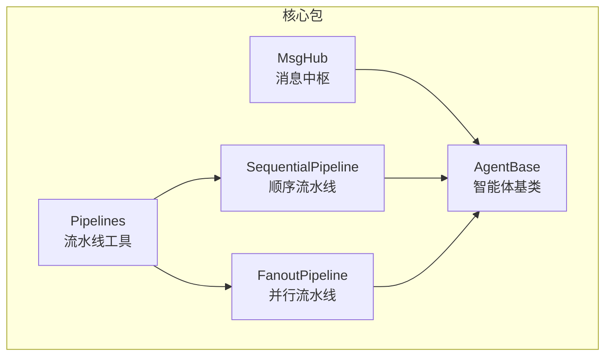
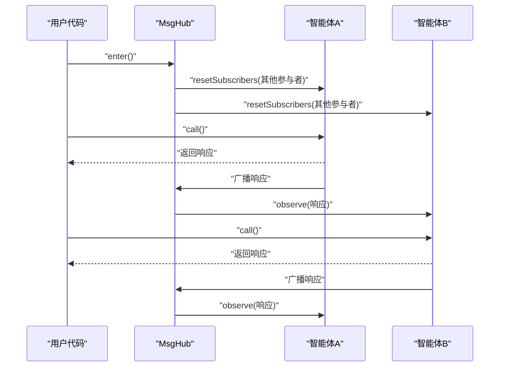
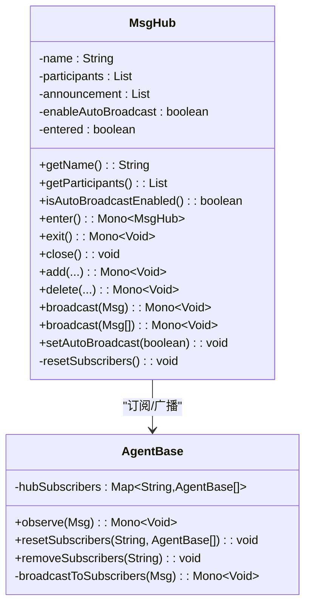
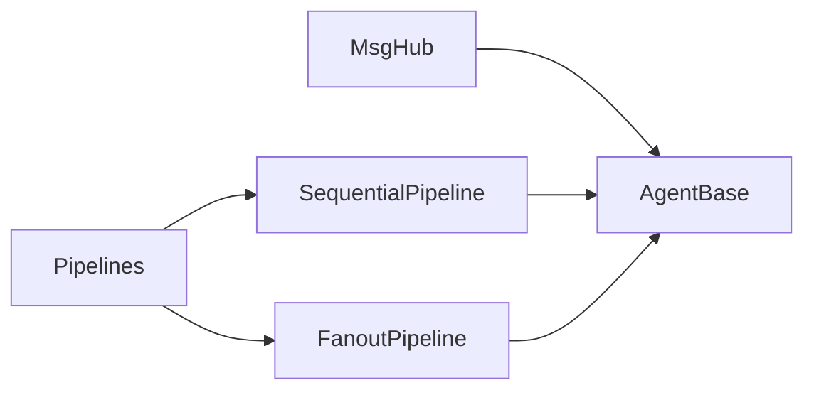

# 消息中枢

<cite>
**本文引用的文件**   
- [MsgHub.java](file://agentscope-core/src/main/java/io/agentscope/core/pipeline/MsgHub.java)
- [AgentBase.java](file://agentscope-core/src/main/java/io/agentscope/core/agent/AgentBase.java)
- [MsgHubTest.java](file://agentscope-core/src/test/java/io/agentscope/core/pipeline/MsgHubTest.java)
- [msghub.md](file://docs/en/task/msghub.md)
- [Pipelines.java](file://agentscope-core/src/main/java/io/agentscope/core/pipeline/Pipelines.java)
- [SequentialPipeline.java](file://agentscope-core/src/main/java/io/agentscope/core/pipeline/SequentialPipeline.java)
- [FanoutPipeline.java](file://agentscope-core/src/main/java/io/agentscope/core/pipeline/FanoutPipeline.java)
- [PipelineE2ETest.java](file://agentscope-core/src/test/java/io/agentscope/core/e2e/PipelineE2ETest.java)
- [MultiAgentE2ETest.java](file://agentscope-core/src/test/java/io/agentscope/core/e2e/MultiAgentE2ETest.java)
</cite>

## 目录
1. [简介](#简介)
2. [项目结构](#项目结构)
3. [核心组件](#核心组件)
4. [架构总览](#架构总览)
5. [详细组件分析](#详细组件分析)
6. [依赖分析](#依赖分析)
7. [性能考虑](#性能考虑)
8. [故障排查指南](#故障排查指南)
9. [结论](#结论)
10. [附录](#附录)

## 简介
本文件围绕 AgentScope Java 的消息中枢（MsgHub）进行系统化技术说明，重点阐释其作为多智能体消息路由中心的设计理念与实现方式，包括自动广播、订阅管理、动态参与者、生命周期管理等能力；并结合测试用例与官方文档示例，给出可直接参考的使用路径与最佳实践。

## 项目结构
与 MsgHub 直接相关的核心模块位于 agentscope-core 的 pipeline 包中，并通过 AgentBase 提供订阅与观察接口支持。配套的测试覆盖了广播、动态增删参与者、自动广播开关、生命周期清理等关键行为。

**图表来源**
- [MsgHub.java:100-434](file://agentscope-core/src/main/java/io/agentscope/core/pipeline/MsgHub.java#L100-L434)
- [AgentBase.java:93-200](file://agentscope-core/src/main/java/io/agentscope/core/agent/AgentBase.java#L93-L200)
- [SequentialPipeline.java:39-185](file://agentscope-core/src/main/java/io/agentscope/core/pipeline/SequentialPipeline.java#L39-L185)
- [FanoutPipeline.java:49-458](file://agentscope-core/src/main/java/io/agentscope/core/pipeline/FanoutPipeline.java#L49-L458)
- [Pipelines.java:34-252](file://agentscope-core/src/main/java/io/agentscope/core/pipeline/Pipelines.java#L34-L252)

**章节来源**
- [MsgHub.java:100-434](file://agentscope-core/src/main/java/io/agentscope/core/pipeline/MsgHub.java#L100-L434)
- [AgentBase.java:93-200](file://agentscope-core/src/main/java/io/agentscope/core/agent/AgentBase.java#L93-L200)
- [Pipelines.java:34-252](file://agentscope-core/src/main/java/io/agentscope/core/pipeline/Pipelines.java#L34-L252)

## 核心组件
- 消息中枢（MsgHub）
  - 职责：在一组智能体之间共享消息，提供自动广播、手动广播、动态参与者管理、生命周期管理（enter/exit/close）。
  - 关键方法：enter()、exit()、add()、delete()、broadcast()、setAutoBroadcast()、getParticipants()、isAutoBroadcastEnabled()。
  - 设计要点：基于 CopyOnWriteArrayList 管理参与者，保证并发安全；通过 resetSubscribers/removeSubscribers 维护订阅关系；默认启用自动广播。
- 智能体基类（AgentBase）
  - 职责：提供 observe() 接口接收消息；维护 hubSubscribers 映射；在每次 call() 后自动广播到各 Hub 订阅者（若启用自动广播）。
  - 关键方法：observe()、resetSubscribers()、removeSubscribers()、broadcastToSubscribers()。
- 流水线（Pipelines/SequentialPipeline/FanoutPipeline）
  - 职责：提供顺序或并行执行智能体的编排能力，与 MsgHub 协同用于复杂工作流。
  - 关键点：并行时使用 boundedElastic 调度器；错误聚合为 CompositeAgentException；支持结构化输出。

**章节来源**
- [MsgHub.java:100-434](file://agentscope-core/src/main/java/io/agentscope/core/pipeline/MsgHub.java#L100-L434)
- [AgentBase.java:788-826](file://agentscope-core/src/main/java/io/agentscope/core/agent/AgentBase.java#L788-L826)
- [SequentialPipeline.java:39-185](file://agentscope-core/src/main/java/io/agentscope/core/pipeline/SequentialPipeline.java#L39-L185)
- [FanoutPipeline.java:49-458](file://agentscope-core/src/main/java/io/agentscope/core/pipeline/FanoutPipeline.java#L49-L458)
- [Pipelines.java:34-252](file://agentscope-core/src/main/java/io/agentscope/core/pipeline/Pipelines.java#L34-L252)

## 架构总览
MsgHub 采用“中介者”模式，将多智能体之间的消息传递抽象为统一入口。当进入 Hub 上下文时，MsgHub 会为每个参与者建立订阅关系；当启用自动广播时，每个智能体的响应会被自动广播给其他参与者；同时支持手动广播与动态参与者变更。

**图表来源**
- [MsgHub.java:158-171](file://agentscope-core/src/main/java/io/agentscope/core/pipeline/MsgHub.java#L158-L171)
- [MsgHub.java:282-284](file://agentscope-core/src/main/java/io/agentscope/core/pipeline/MsgHub.java#L282-L284)
- [AgentBase.java:806-814](file://agentscope-core/src/main/java/io/agentscope/core/agent/AgentBase.java#L806-L814)

## 详细组件分析

### 消息中枢（MsgHub）设计与实现
- 自动广播与订阅管理
  - 进入上下文时，对所有参与者调用 resetSubscribers，使每个参与者订阅其他所有参与者。
  - 退出上下文时，移除订阅关系，避免内存泄漏与误触发。
- 动态参与者
  - 支持在运行时 add/delete 参与者，若已进入上下文则自动重置订阅关系。
- 广播策略
  - 手动广播：broadcast(Msg) 或 broadcast(List<Msg>)，对所有参与者执行 observe。
  - 自动广播：由 AgentBase 在每次 call() 后自动触发广播至订阅者。
- 生命周期
  - 支持 try-with-resources，close() 内部调用 exit() 完成清理。
- 配置项
  - name：Hub 名称，默认随机 UUID。
  - participants：必填，至少一个。
  - announcement：进入时广播的消息列表。
  - enableAutoBroadcast：是否启用自动广播，默认开启。

**图表来源**
- [MsgHub.java:100-434](file://agentscope-core/src/main/java/io/agentscope/core/pipeline/MsgHub.java#L100-L434)
- [AgentBase.java:93-200](file://agentscope-core/src/main/java/io/agentscope/core/agent/AgentBase.java#L93-L200)
- [AgentBase.java:788-826](file://agentscope-core/src/main/java/io/agentscope/core/agent/AgentBase.java#L788-L826)

**章节来源**
- [MsgHub.java:100-434](file://agentscope-core/src/main/java/io/agentscope/core/pipeline/MsgHub.java#L100-L434)
- [AgentBase.java:788-826](file://agentscope-core/src/main/java/io/agentscope/core/agent/AgentBase.java#L788-L826)

### 订阅模式与消息过滤
- 订阅模式
  - 每个智能体维护 hubSubscribers 映射，键为 Hub 名称，值为订阅该 Hub 的智能体列表。
  - resetSubscribers(name, others) 将当前智能体订阅 others 中的所有智能体；removeSubscribers(name) 清理订阅。
- 消息过滤与优先级
  - 当前实现未提供基于主题/角色/内容的消息过滤与优先级排序逻辑；消息在 Hub 内部以“全量广播”方式传递。
  - 若需过滤/优先级，可在智能体内部自行实现 observe() 逻辑，或通过自定义 Hub 行为扩展。

**章节来源**
- [AgentBase.java:93-200](file://agentscope-core/src/main/java/io/agentscope/core/agent/AgentBase.java#L93-L200)
- [AgentBase.java:788-826](file://agentscope-core/src/main/java/io/agentscope/core/agent/AgentBase.java#L788-L826)

### 负载均衡与并发策略
- 并发执行
  - FanoutPipeline 默认使用 boundedElastic 调度器进行并发执行，适合 I/O 密集型场景。
  - SequentialPipeline 串行执行，确保状态与顺序一致性。
- 广播并发
  - MsgHub 的 broadcast() 使用 Reactor 的 Flux/flatMap 并行分发消息，提升吞吐。
- 注意事项
  - 单个智能体实例不应并发调用（如 call/stream），否则可能引发竞态与状态不一致。

**章节来源**
- [FanoutPipeline.java:63-88](file://agentscope-core/src/main/java/io/agentscope/core/pipeline/FanoutPipeline.java#L63-L88)
- [FanoutPipeline.java:127-169](file://agentscope-core/src/main/java/io/agentscope/core/pipeline/FanoutPipeline.java#L127-L169)
- [SequentialPipeline.java:39-185](file://agentscope-core/src/main/java/io/agentscope/core/pipeline/SequentialPipeline.java#L39-L185)
- [MsgHub.java:282-284](file://agentscope-core/src/main/java/io/agentscope/core/pipeline/MsgHub.java#L282-L284)

### 配置选项与性能调优
- 基础配置
  - name：Hub 名称（可选，未提供时生成随机 UUID）。
  - participants：必填，至少一个智能体。
  - announcement：进入时广播的消息列表（可选）。
  - enableAutoBroadcast：是否启用自动广播（默认开启）。
- 性能调优建议
  - 并发广播：在高吞吐场景下保持 enableAutoBroadcast=true，配合智能体 observe() 实现异步处理。
  - 并行流水线：使用 FanoutPipeline 并设置合适的调度器（默认 boundedElastic）。
  - 动态参与者：在对话早期固定参与者更有利于订阅关系稳定；频繁增删可能导致订阅重置开销。
  - 错误处理：FanoutPipeline 会聚合多个智能体失败为 CompositeAgentException，便于定位问题。

**章节来源**
- [MsgHub.java:347-433](file://agentscope-core/src/main/java/io/agentscope/core/pipeline/MsgHub.java#L347-L433)
- [FanoutPipeline.java:63-88](file://agentscope-core/src/main/java/io/agentscope/core/pipeline/FanoutPipeline.java#L63-L88)
- [Pipelines.java:192-210](file://agentscope-core/src/main/java/io/agentscope/core/pipeline/Pipelines.java#L192-L210)

### 使用示例与场景
- 基本用法与自动广播
  - 创建模型与智能体，构建 MsgHub，enter() 后调用智能体的 call()，响应将被自动广播给其他参与者。
  - 参考路径：[msghub.md:42-117](file://docs/en/task/msghub.md#L42-L117)
- 全响应式风格
  - 使用 enter().then(...) 的链式调用，仅在最后 block()，减少阻塞次数。
  - 参考路径：[msghub.md:253-273](file://docs/en/task/msghub.md#L253-L273)
- 动态参与者
  - 在对话过程中 add()/delete() 参与者，Hub 会在进入后自动重置订阅关系。
  - 参考路径：[PipelineE2ETest.java:315-348](file://agentscope-core/src/test/java/io/agentscope/core/e2e/PipelineE2ETest.java#L315-L348)
- 多轮对话与新增观察者
  - 新加入的智能体也能收到历史广播消息（取决于其内存与订阅状态）。
  - 参考路径：[MultiAgentE2ETest.java:446-473](file://agentscope-core/src/test/java/io/agentscope/core/e2e/MultiAgentE2ETest.java#L446-L473)

**章节来源**
- [msghub.md:42-117](file://docs/en/task/msghub.md#L42-L117)
- [msghub.md:253-273](file://docs/en/task/msghub.md#L253-L273)
- [PipelineE2ETest.java:315-348](file://agentscope-core/src/test/java/io/agentscope/core/e2e/PipelineE2ETest.java#L315-L348)
- [MultiAgentE2ETest.java:446-473](file://agentscope-core/src/test/java/io/agentscope/core/e2e/MultiAgentE2ETest.java#L446-L473)

### 复杂管道中的作用与系统解耦
- 与流水线协作
  - MsgHub 负责“广播/订阅”，SequentialPipeline/FanoutPipeline 负责“编排/并发”，二者组合实现事件驱动与解耦通信。
- 中介者模式优势
  - 智能体无需互相感知彼此，只需关注自身业务逻辑；消息路由集中在 MsgHub，降低耦合度。
- 动态路由
  - 通过动态 add()/delete() 与 setAutoBroadcast()，可在运行时调整路由拓扑，满足灵活的业务需求。

**章节来源**
- [Pipelines.java:34-252](file://agentscope-core/src/main/java/io/agentscope/core/pipeline/Pipelines.java#L34-L252)
- [SequentialPipeline.java:39-185](file://agentscope-core/src/main/java/io/agentscope/core/pipeline/SequentialPipeline.java#L39-L185)
- [FanoutPipeline.java:49-458](file://agentscope-core/src/main/java/io/agentscope/core/pipeline/FanoutPipeline.java#L49-L458)

## 依赖分析
- MsgHub 依赖 AgentBase 的订阅/观察接口，通过 resetSubscribers/removeSubscribers 管理订阅关系。
- 流水线组件（SequentialPipeline/FanoutPipeline）与 MsgHub 解耦，可通过 Pipelines 工具类组合使用。
- 测试用例覆盖 MsgHub 的核心行为：广播、动态参与者、自动广播开关、生命周期清理等。

**图表来源**
- [MsgHub.java:100-434](file://agentscope-core/src/main/java/io/agentscope/core/pipeline/MsgHub.java#L100-L434)
- [AgentBase.java:93-200](file://agentscope-core/src/main/java/io/agentscope/core/agent/AgentBase.java#L93-L200)
- [Pipelines.java:34-252](file://agentscope-core/src/main/java/io/agentscope/core/pipeline/Pipelines.java#L34-L252)

**章节来源**
- [MsgHubTest.java:73-111](file://agentscope-core/src/test/java/io/agentscope/core/pipeline/MsgHubTest.java#L73-L111)
- [MsgHubTest.java:187-258](file://agentscope-core/src/test/java/io/agentscope/core/pipeline/MsgHubTest.java#L187-L258)

## 性能考虑
- 广播并发：使用 Reactor 并行分发消息，适合高并发场景；注意智能体内部不要并发调用自身方法。
- 并行流水线：默认 boundedElastic 调度器，适合 I/O 密集；CPU 密集任务建议自定义调度器。
- 订阅重置成本：动态增删参与者会触发 resetSubscribers，应避免过于频繁的变更。
- 错误聚合：并行执行时异常会被收集并统一抛出，便于快速定位问题。

[本节为通用指导，无需特定文件引用]

## 故障排查指南
- 报错：构建时未提供参与者
  - 现象：IllegalArgumentException，提示必须至少有一个参与者。
  - 处理：确保 participants 列表非空。
  - 参考路径：[MsgHub.java:427-430](file://agentscope-core/src/main/java/io/agentscope/core/pipeline/MsgHub.java#L427-L430)
- 自动广播未生效
  - 现象：智能体间未互相收到消息。
  - 排查：确认 enableAutoBroadcast=true 且已调用 enter()；检查智能体 observe() 是否正确实现。
  - 参考路径：[MsgHubTest.java:114-145](file://agentscope-core/src/test/java/io/agentscope/core/pipeline/MsgHubTest.java#L114-L145)
- 动态增删参与者无效
  - 现象：add()/delete() 后订阅关系未更新。
  - 排查：确保在 enter() 之后再进行增删；若在进入前添加，进入后再调用 resetSubscribers。
  - 参考路径：[MsgHubTest.java:328-347](file://agentscope-core/src/test/java/io/agentscope/core/pipeline/MsgHubTest.java#L328-L347)
- 生命周期未清理
  - 现象：退出后订阅仍存在，导致后续异常。
  - 处理：使用 try-with-resources 或显式调用 close()/exit()。
  - 参考路径：[MsgHubTest.java:166-185](file://agentscope-core/src/test/java/io/agentscope/core/pipeline/MsgHubTest.java#L166-L185)

**章节来源**
- [MsgHub.java:427-430](file://agentscope-core/src/main/java/io/agentscope/core/pipeline/MsgHub.java#L427-L430)
- [MsgHubTest.java:114-145](file://agentscope-core/src/test/java/io/agentscope/core/pipeline/MsgHubTest.java#L114-L145)
- [MsgHubTest.java:328-347](file://agentscope-core/src/test/java/io/agentscope/core/pipeline/MsgHubTest.java#L328-L347)
- [MsgHubTest.java:166-185](file://agentscope-core/src/test/java/io/agentscope/core/pipeline/MsgHubTest.java#L166-L185)

## 结论
MsgHub 通过“中介者”模式实现了多智能体间的解耦消息路由，具备自动广播、手动广播、动态参与者与生命周期管理等能力。结合流水线组件，可灵活构建事件驱动与并行处理的复杂工作流。在实际使用中，建议合理配置自动广播、谨慎进行动态参与者变更，并利用测试用例验证预期行为。

[本节为总结性内容，无需特定文件引用]

## 附录
- API 参考（来自官方文档）
  - 构建器方法：name、participants、announcement、enableAutoBroadcast。
  - 实例方法：enter、exit、close、add、delete、broadcast、setAutoBroadcast、getName、getParticipants、isAutoBroadcastEnabled。
  - 参考路径：[msghub.md:275-309](file://docs/en/task/msghub.md#L275-L309)

**章节来源**
- [msghub.md:275-309](file://docs/en/task/msghub.md#L275-L309)