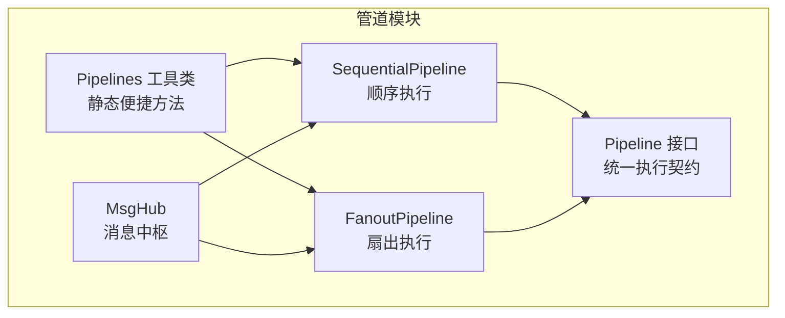
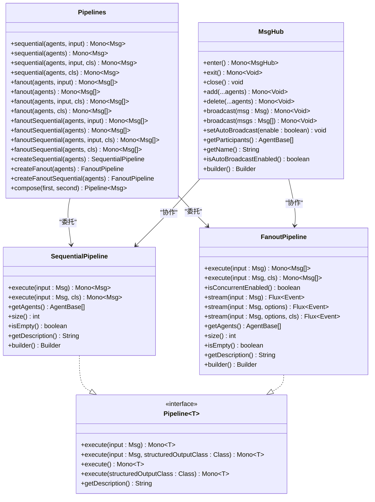
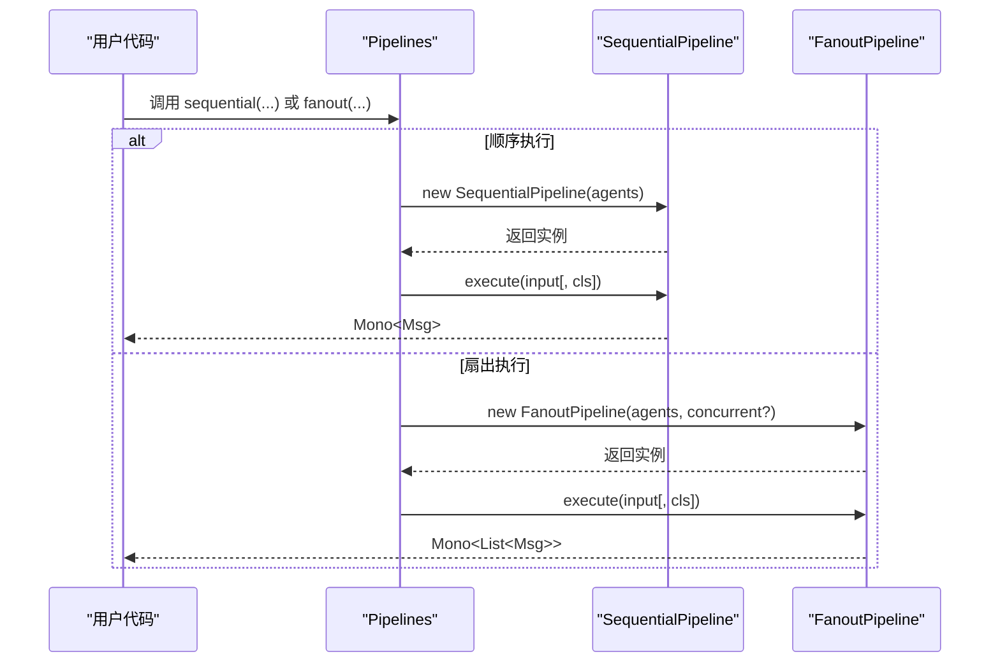
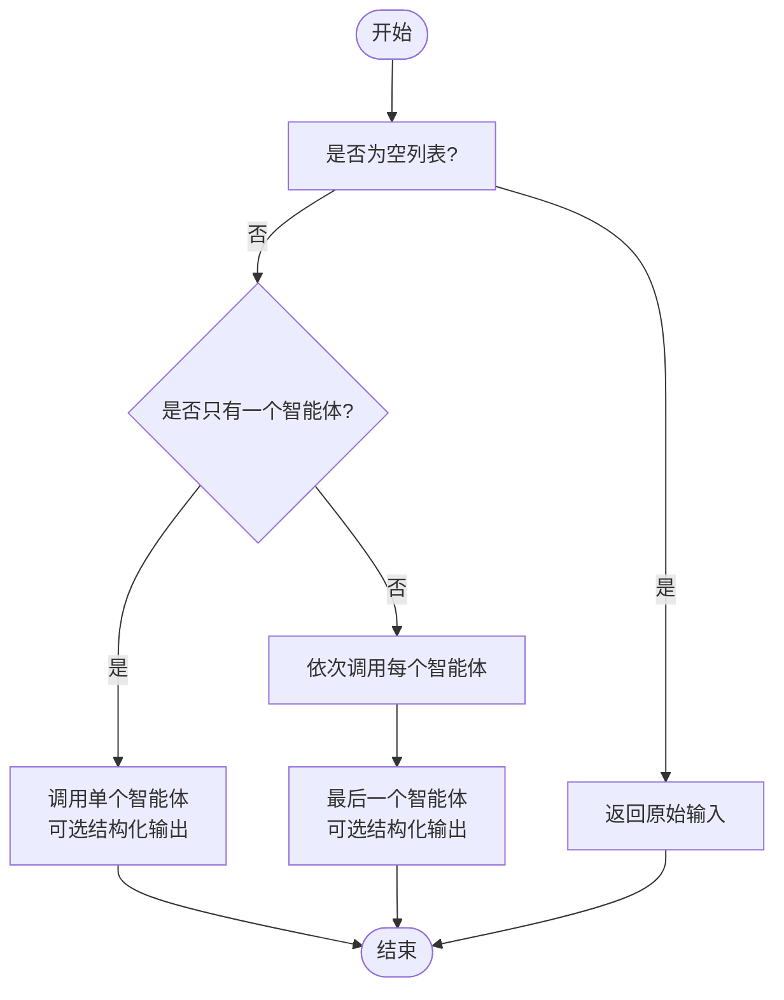
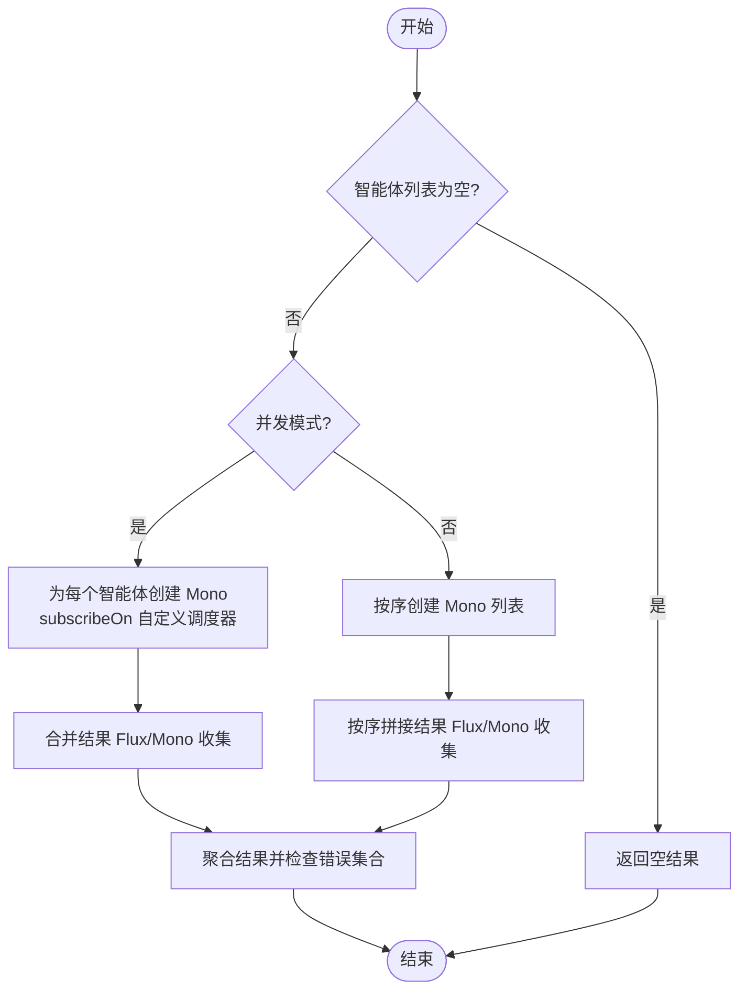
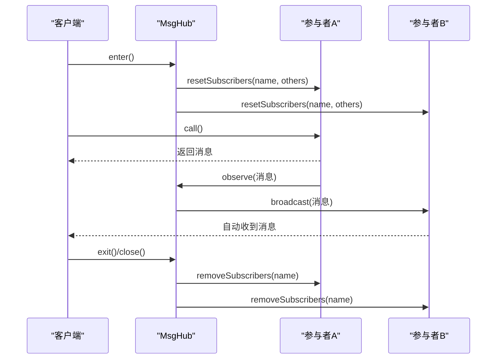
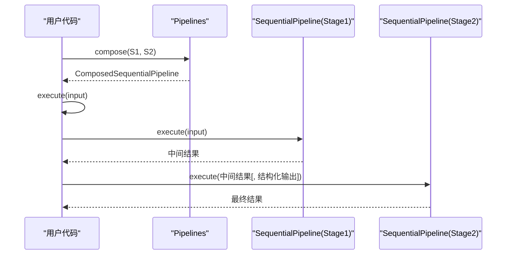
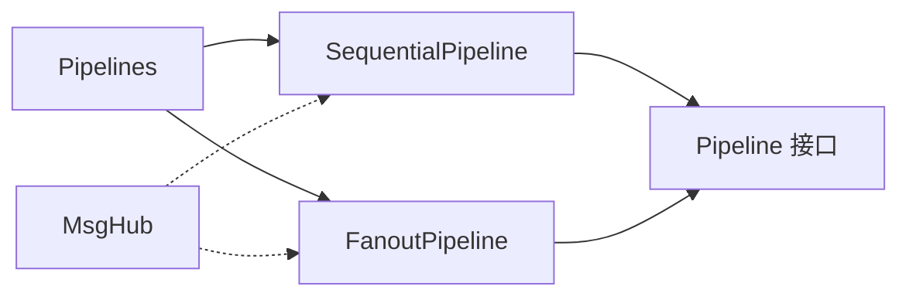

# 管道工具类

<cite>
**本文档引用的文件**
- [Pipelines.java](file://agentscope-core/src/main/java/io/agentscope/core/pipeline/Pipelines.java)
- [Pipeline.java](file://agentscope-core/src/main/java/io/agentscope/core/pipeline/Pipeline.java)
- [SequentialPipeline.java](file://agentscope-core/src/main/java/io/agentscope/core/pipeline/SequentialPipeline.java)
- [FanoutPipeline.java](file://agentscope-core/src/main/java/io/agentscope/core/pipeline/FanoutPipeline.java)
- [MsgHub.java](file://agentscope-core/src/main/java/io/agentscope/core/pipeline/MsgHub.java)
- [SequentialPipelineTest.java](file://agentscope-core/src/test/java/io/agentscope/core/pipeline/SequentialPipelineTest.java)
- [FanoutPipelineTest.java](file://agentscope-core/src/test/java/io/agentscope/core/pipeline/FanoutPipelineTest.java)
- [PipelineIntegrationTest.java](file://agentscope-core/src/test/java/io/agentscope/core/pipeline/PipelineIntegrationTest.java)
- [MsgHubIntegrationTest.java](file://agentscope-core/src/test/java/io/agentscope/core/pipeline/MsgHubIntegrationTest.java)
- [SequentialPipelineExample.java](file://agentscope-examples/quickstart/src/main/java/io/agentscope/examples/quickstart/SequentialPipelineExample.java)
- [FanoutPipelineExample.java](file://agentscope-examples/quickstart/src/main/java/io/agentscope/examples/quickstart/FanoutPipelineExample.java)
</cite>

## 目录
1. [简介](#简介)
2. [项目结构](#项目结构)
3. [核心组件](#核心组件)
4. [架构总览](#架构总览)
5. [详细组件分析](#详细组件分析)
6. [依赖关系分析](#依赖关系分析)
7. [性能考虑](#性能考虑)
8. [故障排查指南](#故障排查指南)
9. [结论](#结论)
10. [附录](#附录)

## 简介
本文件面向 AgentScope Java 的管道工具类（Pipelines），系统性地介绍其提供的静态方法与便捷功能，覆盖常见管道模式的快速创建与配置，深入解析流水线编排、条件分支与循环处理等组合模式，并阐述工具类的设计目的、使用场景、与核心管道接口的关系以及扩展机制。同时给出丰富的示例路径与最佳实践，帮助开发者在保证可读性的同时，高效构建复杂多样的管道组合。

## 项目结构
AgentScope 的管道体系由以下关键文件构成：
- 工具类：提供静态便捷方法，适合一次性、函数式风格的管道执行
- 接口：定义统一的管道执行契约
- 实现类：顺序与扇出（并发/串行）两种核心执行模式
- 消息中枢：用于多智能体之间的消息广播与订阅管理

**图表来源**
- [Pipelines.java:32-252](file://agentscope-core/src/main/java/io/agentscope/core/pipeline/Pipelines.java#L32-L252)
- [Pipeline.java:29-75](file://agentscope-core/src/main/java/io/agentscope/core/pipeline/Pipeline.java#L29-L75)
- [SequentialPipeline.java:39-185](file://agentscope-core/src/main/java/io/agentscope/core/pipeline/SequentialPipeline.java#L39-L185)
- [FanoutPipeline.java:49-457](file://agentscope-core/src/main/java/io/agentscope/core/pipeline/FanoutPipeline.java#L49-L457)
- [MsgHub.java:100-434](file://agentscope-core/src/main/java/io/agentscope/core/pipeline/MsgHub.java#L100-L434)

**章节来源**
- [Pipelines.java:32-252](file://agentscope-core/src/main/java/io/agentscope/core/pipeline/Pipelines.java#L32-L252)
- [Pipeline.java:29-75](file://agentscope-core/src/main/java/io/agentscope/core/pipeline/Pipeline.java#L29-L75)
- [SequentialPipeline.java:39-185](file://agentscope-core/src/main/java/io/agentscope/core/pipeline/SequentialPipeline.java#L39-L185)
- [FanoutPipeline.java:49-457](file://agentscope-core/src/main/java/io/agentscope/core/pipeline/FanoutPipeline.java#L49-L457)
- [MsgHub.java:100-434](file://agentscope-core/src/main/java/io/agentscope/core/pipeline/MsgHub.java#L100-L434)

## 核心组件
- Pipelines 工具类：提供静态方法，支持顺序、扇出（并发/串行）及结构化输出的便捷调用；同时提供可复用的管道创建与组合能力。
- Pipeline 接口：定义统一的执行入口（带/不带输入）、结构化输出支持、描述信息等。
- SequentialPipeline：顺序执行多个智能体，前一智能体输出作为下一智能体输入；支持单个/空列表边界情况与结构化输出。
- FanoutPipeline：对同一输入并行或串行分发给多个智能体，聚合结果；内置错误收集与恢复策略，支持事件流式输出。
- MsgHub：多智能体消息中枢，自动广播与订阅管理，支持动态参与者增删与生命周期管理。

**章节来源**
- [Pipelines.java:38-210](file://agentscope-core/src/main/java/io/agentscope/core/pipeline/Pipelines.java#L38-L210)
- [Pipeline.java:31-74](file://agentscope-core/src/main/java/io/agentscope/core/pipeline/Pipeline.java#L31-L74)
- [SequentialPipeline.java:54-94](file://agentscope-core/src/main/java/io/agentscope/core/pipeline/SequentialPipeline.java#L54-L94)
- [FanoutPipeline.java:104-189](file://agentscope-core/src/main/java/io/agentscope/core/pipeline/FanoutPipeline.java#L104-L189)
- [MsgHub.java:158-202](file://agentscope-core/src/main/java/io/agentscope/core/pipeline/MsgHub.java#L158-L202)

## 架构总览
Pipelines 作为“函数式便捷层”，内部委托到具体实现类完成执行；实现类遵循 Pipeline 接口契约，确保一致的 API 行为。MsgHub 则独立于 Pipelines，但可与顺序/扇出管道配合，实现多智能体协作与消息传播。

**图表来源**
- [Pipelines.java:38-251](file://agentscope-core/src/main/java/io/agentscope/core/pipeline/Pipelines.java#L38-L251)
- [Pipeline.java:29-75](file://agentscope-core/src/main/java/io/agentscope/core/pipeline/Pipeline.java#L29-L75)
- [SequentialPipeline.java:39-185](file://agentscope-core/src/main/java/io/agentscope/core/pipeline/SequentialPipeline.java#L39-L185)
- [FanoutPipeline.java:49-457](file://agentscope-core/src/main/java/io/agentscope/core/pipeline/FanoutPipeline.java#L49-L457)
- [MsgHub.java:100-434](file://agentscope-core/src/main/java/io/agentscope/core/pipeline/MsgHub.java#L100-L434)

## 详细组件分析

### Pipelines 工具类
- 设计目标：提供“一次性的、函数式风格”的管道执行入口，避免显式构造对象的样板代码；同时保留可复用的创建与组合方法。
- 关键能力：
  - 顺序执行：支持带/不带初始输入、带/不带结构化输出
  - 扇出执行：并发与串行两种模式，均支持结构化输出
  - 可复用创建：返回具体实现实例，便于进一步配置或组合
  - 组合能力：将两个顺序管道组合为一个新管道，仅第二阶段使用结构化输出
- 使用场景：快速原型、脚本化任务、一次性批处理、示例演示等

**图表来源**
- [Pipelines.java:47-210](file://agentscope-core/src/main/java/io/agentscope/core/pipeline/Pipelines.java#L47-L210)
- [SequentialPipeline.java:54-94](file://agentscope-core/src/main/java/io/agentscope/core/pipeline/SequentialPipeline.java#L54-L94)
- [FanoutPipeline.java:104-189](file://agentscope-core/src/main/java/io/agentscope/core/pipeline/FanoutPipeline.java#L104-L189)

**章节来源**
- [Pipelines.java:38-210](file://agentscope-core/src/main/java/io/agentscope/core/pipeline/Pipelines.java#L38-L210)

### Pipeline 接口
- 统一契约：定义 execute 的多种重载形式，支持无输入、结构化输出、描述信息等。
- 设计要点：默认实现通过 null 输入适配不同场景；描述信息便于调试与日志。

**章节来源**
- [Pipeline.java:31-74](file://agentscope-core/src/main/java/io/agentscope/core/pipeline/Pipeline.java#L31-L74)

### SequentialPipeline（顺序管道）
- 执行模型：链式调用，前一智能体输出作为下一智能体输入；最后一个智能体可选择结构化输出。
- 边界处理：空列表直接返回输入；单个智能体时可直接应用结构化输出。
- 构建器：支持动态添加智能体，便于组装复杂流程。

**图表来源**
- [SequentialPipeline.java:60-94](file://agentscope-core/src/main/java/io/agentscope/core/pipeline/SequentialPipeline.java#L60-L94)

**章节来源**
- [SequentialPipeline.java:54-133](file://agentscope-core/src/main/java/io/agentscope/core/pipeline/SequentialPipeline.java#L54-L133)
- [SequentialPipelineTest.java:62-126](file://agentscope-core/src/test/java/io/agentscope/core/pipeline/SequentialPipelineTest.java#L62-L126)

### FanoutPipeline（扇出管道）
- 并发/串行：默认并发，使用有界弹性调度器；也可配置为串行，保持输入隔离与顺序一致性。
- 错误处理：捕获各智能体异常并汇总为复合异常，保证其他成功智能体的结果仍可返回。
- 流式事件：支持事件合并（并发）或拼接（串行），便于实时监控与可观测性。
- 构建器：支持并发/串行切换与自定义调度器。

**图表来源**
- [FanoutPipeline.java:104-189](file://agentscope-core/src/main/java/io/agentscope/core/pipeline/FanoutPipeline.java#L104-L189)

**章节来源**
- [FanoutPipeline.java:104-189](file://agentscope-core/src/main/java/io/agentscope/core/pipeline/FanoutPipeline.java#L104-L189)
- [FanoutPipelineTest.java:68-123](file://agentscope-core/src/test/java/io/agentscope/core/pipeline/FanoutPipelineTest.java#L68-L123)

### MsgHub（消息中枢）
- 自动广播：启用后，任一参与者的消息会自动广播给其他所有参与者。
- 动态管理：运行中可增删参与者，自动更新订阅关系。
- 生命周期：支持 enter/exit/close，确保资源清理与订阅解除。
- 使用建议：与顺序/扇出管道结合，实现多智能体对话与状态同步。

**图表来源**
- [MsgHub.java:158-202](file://agentscope-core/src/main/java/io/agentscope/core/pipeline/MsgHub.java#L158-L202)

**章节来源**
- [MsgHub.java:158-202](file://agentscope-core/src/main/java/io/agentscope/core/pipeline/MsgHub.java#L158-L202)
- [MsgHubIntegrationTest.java:60-176](file://agentscope-examples/multiagent-patterns/pipeline/src/test/java/io/agentscope/core/pipeline/MsgHubIntegrationTest.java#L60-L176)

### 管道组合与嵌套
- 组合顺序管道：Pipelines 提供 compose 方法，将两个顺序管道串联，仅第二阶段使用结构化输出。
- 嵌套结构：可在外部顺序管道中执行内部顺序/扇出子管道，形成层次化流程。
- 集成验证：通过集成测试验证复杂工作流、嵌套管道与阶段间数据传递。

**图表来源**
- [Pipelines.java:219-251](file://agentscope-core/src/main/java/io/agentscope/core/pipeline/Pipelines.java#L219-L251)
- [PipelineIntegrationTest.java:163-212](file://agentscope-core/src/test/java/io/agentscope/core/pipeline/PipelineIntegrationTest.java#L163-L212)

**章节来源**
- [Pipelines.java:219-251](file://agentscope-core/src/main/java/io/agentscope/core/pipeline/Pipelines.java#L219-L251)
- [PipelineIntegrationTest.java:111-161](file://agentscope-core/src/test/java/io/agentscope/core/pipeline/PipelineIntegrationTest.java#L111-L161)

## 依赖关系分析
- 耦合与内聚：Pipelines 低耦合地委托到具体实现，保持高内聚的职责划分。
- 外部依赖：基于 Reactor 的 Mono/Flux 进行响应式编程；默认并发使用有界弹性调度器。
- 循环依赖：未发现循环依赖；MsgHub 独立存在，不依赖 Pipelines。
- 接口契约：所有实现严格遵循 Pipeline 接口，确保行为一致性。

**图表来源**
- [Pipelines.java:47-210](file://agentscope-core/src/main/java/io/agentscope/core/pipeline/Pipelines.java#L47-L210)
- [SequentialPipeline.java:39-185](file://agentscope-core/src/main/java/io/agentscope/core/pipeline/SequentialPipeline.java#L39-L185)
- [FanoutPipeline.java:49-457](file://agentscope-core/src/main/java/io/agentscope/core/pipeline/FanoutPipeline.java#L49-L457)
- [Pipeline.java:29-75](file://agentscope-core/src/main/java/io/agentscope/core/pipeline/Pipeline.java#L29-L75)
- [MsgHub.java:100-434](file://agentscope-core/src/main/java/io/agentscope/core/pipeline/MsgHub.java#L100-L434)

**章节来源**
- [Pipelines.java:38-210](file://agentscope-core/src/main/java/io/agentscope/core/pipeline/Pipelines.java#L38-L210)
- [SequentialPipeline.java:39-185](file://agentscope-core/src/main/java/io/agentscope/core/pipeline/SequentialPipeline.java#L39-L185)
- [FanoutPipeline.java:49-457](file://agentscope-core/src/main/java/io/agentscope/core/pipeline/FanoutPipeline.java#L49-L457)
- [Pipeline.java:29-75](file://agentscope-core/src/main/java/io/agentscope/core/pipeline/Pipeline.java#L29-L75)
- [MsgHub.java:100-434](file://agentscope-core/src/main/java/io/agentscope/core/pipeline/MsgHub.java#L100-L434)

## 性能考虑
- 并发执行：FanoutPipeline 默认并发模式利用有界弹性调度器，适合 I/O 密集型（如大模型 API 调用），可显著降低总延迟。
- 串行执行：当需要严格顺序或共享资源保护时，选择串行模式以避免竞态。
- 结构化输出：仅在必要阶段（通常是最后一步）启用，减少不必要的格式化开销。
- 内存管理：顺序/扇出管道均采用响应式链路，避免中间结果堆积；注意及时取消订阅与释放资源。
- 调度器选择：可通过构建器注入自定义调度器，针对特定场景（CPU 密集/IO 密集）进行优化。

[本节为通用指导，无需列出具体文件来源]

## 故障排查指南
- 全部失败：并发扇出模式下，若所有智能体均失败，将抛出包含多个原因的复合异常；检查网络、鉴权与模型可用性。
- 部分失败：并发模式下，即使部分智能体失败，也会返回成功结果并记录错误；根据复合异常中的信息定位问题。
- 空列表：顺序/扇出空列表将分别返回输入或空结果；确认智能体集合是否正确初始化。
- 订阅异常：使用 MsgHub 时，若自动广播开启，需确保智能体实例未被重复并发调用；必要时关闭自动广播改为手动广播。

**章节来源**
- [FanoutPipelineTest.java:125-176](file://agentscope-core/src/test/java/io/agentscope/core/pipeline/FanoutPipelineTest.java#L125-L176)
- [SequentialPipelineTest.java:81-98](file://agentscope-core/src/test/java/io/agentscope/core/pipeline/SequentialPipelineTest.java#L81-L98)
- [MsgHubIntegrationTest.java:178-255](file://agentscope-examples/multiagent-patterns/pipeline/src/test/java/io/agentscope/core/pipeline/MsgHubIntegrationTest.java#L178-L255)

## 结论
Pipelines 工具类通过简洁的静态方法与强大的实现类组合，为 AgentScope 提供了即插即用的管道执行能力。借助顺序与扇出两种核心模式、结构化输出支持、事件流式输出与消息中枢，开发者可以快速搭建从简单到复杂的多智能体工作流。建议在原型与示例中优先使用 Pipelines 的便捷方法，在生产环境中结合具体需求选择可复用的实现类与构建器，以获得更好的可维护性与性能表现。

[本节为总结性内容，无需列出具体文件来源]

## 附录

### 常见使用场景与示例路径
- 顺序流水线：内容翻译 → 摘要生成 → 情感分析
  - 示例路径：[SequentialPipelineExample.java:67-127](file://agentscope-examples/quickstart/src/main/java/io/agentscope/examples/quickstart/SequentialPipelineExample.java#L67-L127)
- 扇出流水线：并行专家评审（技术/UX/商业）
  - 示例路径：[FanoutPipelineExample.java:64-125](file://agentscope-examples/quickstart/src/main/java/io/agentscope/examples/quickstart/FanoutPipelineExample.java#L64-L125)
- 多智能体对话：MsgHub 自动广播与动态参与者管理
  - 示例路径：[MsgHubIntegrationTest.java:60-176](file://agentscope-examples/multiagent-patterns/pipeline/src/test/java/io/agentscope/core/pipeline/MsgHubIntegrationTest.java#L60-L176)

### 单元与集成测试参考
- 顺序管道单元测试：边界情况、错误传播、构建器
  - 测试路径：[SequentialPipelineTest.java:62-174](file://agentscope-core/src/test/java/io/agentscope/core/pipeline/SequentialPipelineTest.java#L62-L174)
- 扇出管道单元测试：并发/串行、事件流、错误聚合
  - 测试路径：[FanoutPipelineTest.java:68-437](file://agentscope-core/src/test/java/io/agentscope/core/pipeline/FanoutPipelineTest.java#L68-L437)
- 管道集成测试：复杂工作流、嵌套与组合
  - 测试路径：[PipelineIntegrationTest.java:60-212](file://agentscope-core/src/test/java/io/agentscope/core/pipeline/PipelineIntegrationTest.java#L60-L212)