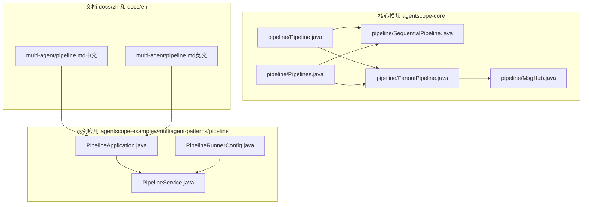
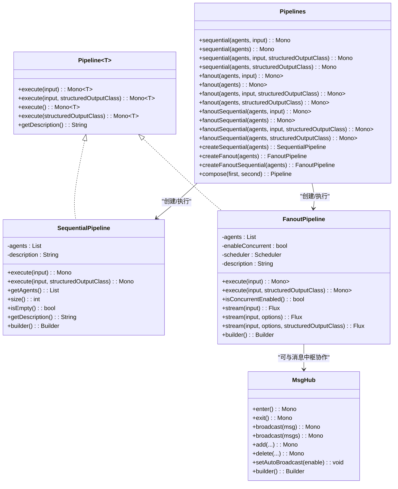
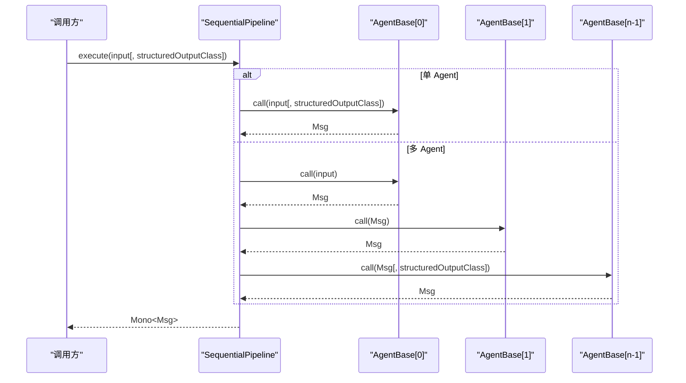
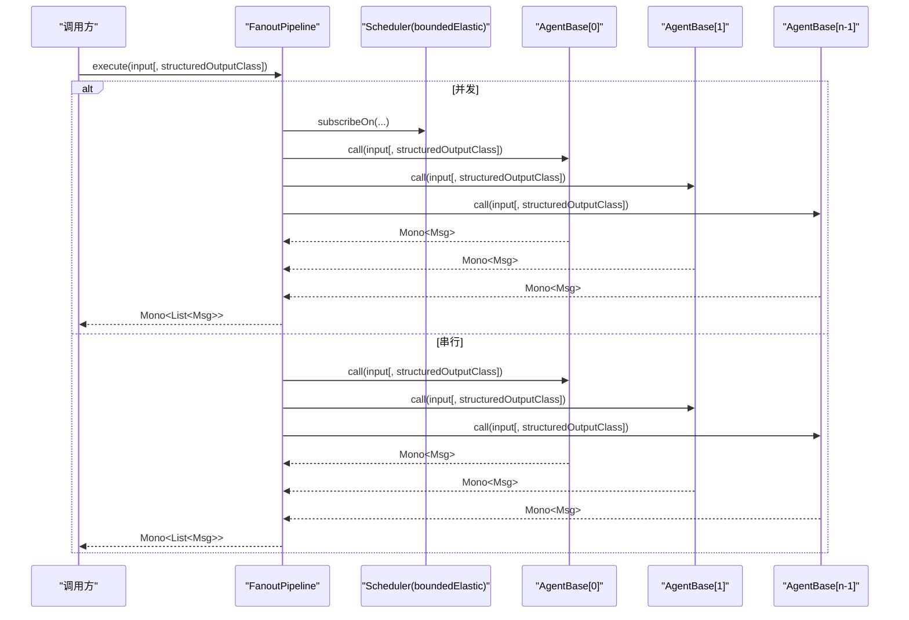
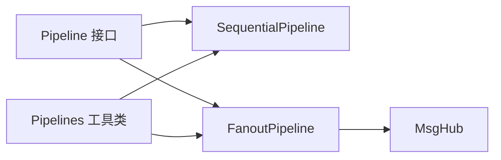

# 管道系统

<cite>
**本文引用的文件**
- [Pipeline.java](file://agentscope-core/src/main/java/io/agentscope/core/pipeline/Pipeline.java)
- [SequentialPipeline.java](file://agentscope-core/src/main/java/io/agentscope/core/pipeline/SequentialPipeline.java)
- [FanoutPipeline.java](file://agentscope-core/src/main/java/io/agentscope/core/pipeline/FanoutPipeline.java)
- [Pipelines.java](file://agentscope-core/src/main/java/io/agentscope/core/pipeline/Pipelines.java)
- [MsgHub.java](file://agentscope-core/src/main/java/io/agentscope/core/pipeline/MsgHub.java)
- [SequentialPipelineTest.java](file://agentscope-core/src/test/java/io/agentscope/core/pipeline/SequentialPipelineTest.java)
- [FanoutPipelineTest.java](file://agentscope-core/src/test/java/io/agentscope/core/pipeline/FanoutPipelineTest.java)
- [PipelineApplication.java](file://agentscope-examples/multiagent-patterns/pipeline/src/main/java/com/alibaba/cloud/ai/examples/multiagents/pipeline/PipelineApplication.java)
- [PipelineService.java](file://agentscope-examples/multiagent-patterns/pipeline/src/main/java/com/alibaba/cloud/ai/examples/multiagents/pipeline/PipelineService.java)
- [PipelineRunnerConfig.java](file://agentscope-examples/multiagent-patterns/pipeline/src/main/java/com/alibaba/cloud/ai/examples/multiagents/pipeline/PipelineRunnerConfig.java)
- [pipeline.md（中文）](file://docs/zh/multi-agent/pipeline.md)
- [pipeline.md（英文）](file://docs/en/multi-agent/pipeline.md)
</cite>

## 目录
1. [引言](#引言)
2. [项目结构](#项目结构)
3. [核心组件](#核心组件)
4. [架构总览](#架构总览)
5. [详细组件分析](#详细组件分析)
6. [依赖关系分析](#依赖关系分析)
7. [性能考量](#性能考量)
8. [故障排查指南](#故障排查指南)
9. [结论](#结论)
10. [附录](#附录)

## 引言
本文件面向 AgentScope Java 管道系统，围绕 Pipeline 接口、顺序管道（SequentialPipeline）、分支管道（FanoutPipeline）以及消息中枢（MsgHub）进行系统化技术文档编写。重点覆盖以下方面：
- Pipeline 接口设计理念与核心方法（execute 的重载与结构化输出支持）
- 顺序管道的消息传递机制、错误传播与状态管理
- 分支管道的并行执行模型、任务分割、结果聚合与负载均衡策略
- 管道配置最佳实践（性能调优、资源管理、监控指标）
- 完整示例路径（含组合与自定义实现思路）
- 生命周期管理、异常处理与优雅降级机制

## 项目结构
AgentScope 的管道能力主要位于 agentscope-core 模块的 pipeline 包中，配套有单元测试与示例应用，便于理解与验证。

图表来源
- [Pipeline.java:29-75](file://agentscope-core/src/main/java/io/agentscope/core/pipeline/Pipeline.java#L29-L75)
- [SequentialPipeline.java:39-185](file://agentscope-core/src/main/java/io/agentscope/core/pipeline/SequentialPipeline.java#L39-L185)
- [FanoutPipeline.java:49-457](file://agentscope-core/src/main/java/io/agentscope/core/pipeline/FanoutPipeline.java#L49-L457)
- [Pipelines.java:32-252](file://agentscope-core/src/main/java/io/agentscope/core/pipeline/Pipelines.java#L32-L252)
- [MsgHub.java:100-434](file://agentscope-core/src/main/java/io/agentscope/core/pipeline/MsgHub.java#L100-L434)
- [PipelineApplication.java:36-53](file://agentscope-examples/multiagent-patterns/pipeline/src/main/java/com/alibaba/cloud/ai/examples/multiagents/pipeline/PipelineApplication.java#L36-L53)
- [PipelineService.java:30-107](file://agentscope-examples/multiagent-patterns/pipeline/src/main/java/com/alibaba/cloud/ai/examples/multiagents/pipeline/PipelineService.java#L30-L107)
- [PipelineRunnerConfig.java:28-37](file://agentscope-examples/multiagent-patterns/pipeline/src/main/java/com/alibaba/cloud/ai/examples/multiagents/pipeline/PipelineRunnerConfig.java#L28-L37)
- [pipeline.md（中文）:1-375](file://docs/zh/multi-agent/pipeline.md#L1-L375)
- [pipeline.md（英文）:1-377](file://docs/en/multi-agent/pipeline.md#L1-L377)

章节来源
- [Pipeline.java:29-75](file://agentscope-core/src/main/java/io/agentscope/core/pipeline/Pipeline.java#L29-L75)
- [SequentialPipeline.java:39-185](file://agentscope-core/src/main/java/io/agentscope/core/pipeline/SequentialPipeline.java#L39-L185)
- [FanoutPipeline.java:49-457](file://agentscope-core/src/main/java/io/agentscope/core/pipeline/FanoutPipeline.java#L49-L457)
- [Pipelines.java:32-252](file://agentscope-core/src/main/java/io/agentscope/core/pipeline/Pipelines.java#L32-L252)
- [MsgHub.java:100-434](file://agentscope-core/src/main/java/io/agentscope/core/pipeline/MsgHub.java#L100-L434)
- [PipelineApplication.java:36-53](file://agentscope-examples/multiagent-patterns/pipeline/src/main/java/com/alibaba/cloud/ai/examples/multiagents/pipeline/PipelineApplication.java#L36-L53)
- [PipelineService.java:30-107](file://agentscope-examples/multiagent-patterns/pipeline/src/main/java/com/alibaba/cloud/ai/examples/multiagents/pipeline/PipelineService.java#L30-L107)
- [PipelineRunnerConfig.java:28-37](file://agentscope-examples/multiagent-patterns/pipeline/src/main/java/com/alibaba/cloud/ai/examples/multiagents/pipeline/PipelineRunnerConfig.java#L28-L37)
- [pipeline.md（中文）:1-375](file://docs/zh/multi-agent/pipeline.md#L1-L375)
- [pipeline.md（英文）:1-377](file://docs/en/multi-agent/pipeline.md#L1-L377)

## 核心组件
- Pipeline 接口：定义统一的管道执行契约，支持三种 execute 重载（带输入、带结构化输出、无参），并提供默认描述信息。
- SequentialPipeline：顺序执行多个 Agent，前一 Agent 输出作为后一 Agent 输入；支持单 Agent 与多 Agent 场景，末尾 Agent 可使用结构化输出。
- FanoutPipeline：并行/串行分发同一输入给多个 Agent，收集结果；并发模式下使用 boundedElastic 调度器，保证 I/O 密集场景下的吞吐；提供事件流式输出（stream）。
- Pipelines 工具类：提供函数式风格的一次性执行入口与可复用管道创建，以及顺序管道组合（compose）。
- MsgHub：多智能体消息中枢，自动广播与订阅管理，简化多 Agent 对话与协作。

章节来源
- [Pipeline.java:29-75](file://agentscope-core/src/main/java/io/agentscope/core/pipeline/Pipeline.java#L29-L75)
- [SequentialPipeline.java:39-185](file://agentscope-core/src/main/java/io/agentscope/core/pipeline/SequentialPipeline.java#L39-L185)
- [FanoutPipeline.java:49-457](file://agentscope-core/src/main/java/io/agentscope/core/pipeline/FanoutPipeline.java#L49-L457)
- [Pipelines.java:32-252](file://agentscope-core/src/main/java/io/agentscope/core/pipeline/Pipelines.java#L32-L252)
- [MsgHub.java:100-434](file://agentscope-core/src/main/java/io/agentscope/core/pipeline/MsgHub.java#L100-L434)

## 架构总览
AgentScope 管道系统采用“接口 + 具体实现 + 工具类 + 消息中枢”的分层设计：
- 接口层：Pipeline 提供统一执行契约
- 执行层：SequentialPipeline、FanoutPipeline 实现不同编排模式
- 工具层：Pipelines 提供便捷 API 与组合
- 协作层：MsgHub 支持多 Agent 自动广播与订阅

图表来源
- [Pipeline.java:29-75](file://agentscope-core/src/main/java/io/agentscope/core/pipeline/Pipeline.java#L29-L75)
- [SequentialPipeline.java:39-185](file://agentscope-core/src/main/java/io/agentscope/core/pipeline/SequentialPipeline.java#L39-L185)
- [FanoutPipeline.java:49-457](file://agentscope-core/src/main/java/io/agentscope/core/pipeline/FanoutPipeline.java#L49-L457)
- [Pipelines.java:32-252](file://agentscope-core/src/main/java/io/agentscope/core/pipeline/Pipelines.java#L32-L252)
- [MsgHub.java:100-434](file://agentscope-core/src/main/java/io/agentscope/core/pipeline/MsgHub.java#L100-L434)

## 详细组件分析

### Pipeline 接口与结构化输出
- 设计理念：统一的管道执行契约，屏蔽具体编排细节，支持多种输入与输出形态。
- 核心方法：
  - execute(Msg)：标准执行入口
  - execute(Msg, Class<?>)：结构化输出支持（仅末尾 Agent 生效）
  - execute() 与 execute(Class<?>)：无输入场景
- 默认描述：getDescription 返回简单类名，便于调试与日志识别。

章节来源
- [Pipeline.java:29-75](file://agentscope-core/src/main/java/io/agentscope/core/pipeline/Pipeline.java#L29-L75)

### 顺序管道（SequentialPipeline）
- 执行模型：链式调用，前一 Agent 输出作为后一 Agent 输入；空列表直接返回输入；单 Agent 时可选择结构化输出；多 Agent 时仅最后一个使用结构化输出。
- 错误传播：任一 Agent 抛错即中断并向上抛出，遵循 Reactor 的错误传播语义。
- 状态管理：通过 Msg 对象在 Agent 之间传递状态与上下文。
- 构建器：Builder 支持动态添加 Agent，便于组合与复用。

图表来源
- [SequentialPipeline.java:54-94](file://agentscope-core/src/main/java/io/agentscope/core/pipeline/SequentialPipeline.java#L54-L94)

章节来源
- [SequentialPipeline.java:39-185](file://agentscope-core/src/main/java/io/agentscope/core/pipeline/SequentialPipeline.java#L39-L185)
- [SequentialPipelineTest.java:62-174](file://agentscope-core/src/test/java/io/agentscope/core/pipeline/SequentialPipelineTest.java#L62-L174)

### 分支管道（FanoutPipeline）
- 并行模型：并发模式使用 boundedElastic 调度器，确保 I/O 密集场景下的高吞吐；串行模式按注册顺序依次执行。
- 任务分割与结果聚合：将同一输入复制给每个 Agent，收集结果为列表；并发模式下即使部分失败也尽量完成其余执行，并通过 CompositeAgentException 汇总错误信息。
- 流式事件：提供 stream(...) 方法，支持事件合并（并发）或拼接（串行），并可指定 StreamOptions 与结构化输出类。
- 负载均衡策略：默认并发模式天然具备负载均衡效果；可通过自定义 Scheduler 控制线程池行为。

图表来源
- [FanoutPipeline.java:104-189](file://agentscope-core/src/main/java/io/agentscope/core/pipeline/FanoutPipeline.java#L104-L189)

章节来源
- [FanoutPipeline.java:49-457](file://agentscope-core/src/main/java/io/agentscope/core/pipeline/FanoutPipeline.java#L49-L457)
- [FanoutPipelineTest.java:68-208](file://agentscope-core/src/test/java/io/agentscope/core/pipeline/FanoutPipelineTest.java#L68-L208)

### 管道工具类（Pipelines）
- 函数式入口：提供一次性执行的静态方法，适合简单场景；同时提供 create* 系列方法用于复用配置。
- 组合能力：compose(SequentialPipeline, SequentialPipeline) 将两个顺序管道串联，仅末尾管道使用结构化输出。

章节来源
- [Pipelines.java:32-252](file://agentscope-core/src/main/java/io/agentscope/core/pipeline/Pipelines.java#L32-L252)

### 消息中枢（MsgHub）
- 自动广播：加入 MsgHub 的 Agent 会自动互相观察彼此的消息，无需手动传递。
- 动态参与者：运行时可增删 Agent，自动更新订阅关系。
- 生命周期：enter()/exit() 与 AutoCloseable 支持 try-with-resources 管理。
- 与管道协作：可与 FanoutPipeline 配合，实现多 Agent 广播式对话。

章节来源
- [MsgHub.java:100-434](file://agentscope-core/src/main/java/io/agentscope/core/pipeline/MsgHub.java#L100-L434)

### 示例应用与最佳实践
- 示例应用：Spring Boot 应用启动后，通过 PipelineService 调用顺序、并行与循环三种管道，演示从自然语言到 SQL 再到评分的顺序流程、多角度并行研究与循环优化。
- 最佳实践要点：
  - 并发优先：I/O 密集场景优先使用 FanoutPipeline 并发模式
  - 线程池隔离：必要时为不同管道配置独立 Scheduler，避免相互影响
  - 结构化输出：仅在需要的末端节点启用，减少序列化开销
  - 错误聚合：利用 CompositeAgentException 获取详细失败信息
  - 监控指标：结合事件流（stream）统计事件数量、类型分布与耗时

章节来源
- [PipelineApplication.java:36-53](file://agentscope-examples/multiagent-patterns/pipeline/src/main/java/com/alibaba/cloud/ai/examples/multiagents/pipeline/PipelineApplication.java#L36-L53)
- [PipelineService.java:30-107](file://agentscope-examples/multiagent-patterns/pipeline/src/main/java/com/alibaba/cloud/ai/examples/multiagents/pipeline/PipelineService.java#L30-L107)
- [PipelineRunnerConfig.java:28-37](file://agentscope-examples/multiagent-patterns/pipeline/src/main/java/com/alibaba/cloud/ai/examples/multiagents/pipeline/PipelineRunnerConfig.java#L28-L37)
- [pipeline.md（中文）:1-375](file://docs/zh/multi-agent/pipeline.md#L1-L375)
- [pipeline.md（英文）:1-377](file://docs/en/multi-agent/pipeline.md#L1-L377)

## 依赖关系分析
- 耦合与内聚：Pipeline 接口与具体实现解耦；SequentialPipeline/FanoutPipeline 与 AgentBase 解耦，通过接口交互；Pipelines 作为工具层进一步降低使用复杂度。
- 外部依赖：Reactor（Mono/Flux/Scheduler）用于响应式执行；Schedulers.boundedElastic 用于并发调度。
- 潜在风险：并发模式下需注意共享资源的线程安全；错误处理应区分“部分失败”与“全部失败”。

图表来源
- [Pipeline.java:29-75](file://agentscope-core/src/main/java/io/agentscope/core/pipeline/Pipeline.java#L29-L75)
- [SequentialPipeline.java:39-185](file://agentscope-core/src/main/java/io/agentscope/core/pipeline/SequentialPipeline.java#L39-L185)
- [FanoutPipeline.java:49-457](file://agentscope-core/src/main/java/io/agentscope/core/pipeline/FanoutPipeline.java#L49-L457)
- [Pipelines.java:32-252](file://agentscope-core/src/main/java/io/agentscope/core/pipeline/Pipelines.java#L32-L252)
- [MsgHub.java:100-434](file://agentscope-core/src/main/java/io/agentscope/core/pipeline/MsgHub.java#L100-L434)

章节来源
- [SequentialPipeline.java:39-185](file://agentscope-core/src/main/java/io/agentscope/core/pipeline/SequentialPipeline.java#L39-L185)
- [FanoutPipeline.java:49-457](file://agentscope-core/src/main/java/io/agentscope/core/pipeline/FanoutPipeline.java#L49-L457)
- [Pipelines.java:32-252](file://agentscope-core/src/main/java/io/agentscope/core/pipeline/Pipelines.java#L32-L252)
- [MsgHub.java:100-434](file://agentscope-core/src/main/java/io/agentscope/core/pipeline/MsgHub.java#L100-L434)

## 性能考量
- 并发调度：FanoutPipeline 默认使用 Schedulers.boundedElastic，适合 I/O 密集型请求；若存在 CPU 密集型 Agent，建议自定义 Scheduler 并限制并发度。
- 结果聚合：并发模式下优先使用 Flux.merge 收集结果，串行模式使用 Flux.concat 保持顺序一致性。
- 结构化输出：仅在必要节点启用，避免不必要的序列化与反序列化成本。
- 资源管理：合理设置线程池大小与队列长度，避免背压导致的延迟放大；对长耗时操作使用 subscribeOn 切换调度器。
- 监控指标：通过 stream(...) 事件流统计事件总数、事件类型分布、平均耗时与错误率，辅助定位瓶颈。

## 故障排查指南
- 错误传播：顺序管道任一 Agent 失败即中断；分支管道并发模式下可能部分成功，需检查 CompositeAgentException 的 causes 列表。
- 空管道处理：顺序/分支管道均对空列表/空列表做了特殊处理，确保不会抛出异常。
- 事件流异常：分支管道在并发流式场景下，complete 时可能抛出 CompositeAgentException，需在收集阶段捕获并处理。
- 线程安全：确保 Agent 内部状态不被并发访问；如需共享资源，使用不可变对象或线程安全容器。

章节来源
- [SequentialPipelineTest.java:81-98](file://agentscope-core/src/test/java/io/agentscope/core/pipeline/SequentialPipelineTest.java#L81-L98)
- [FanoutPipelineTest.java:125-176](file://agentscope-core/src/test/java/io/agentscope/core/pipeline/FanoutPipelineTest.java#L125-L176)
- [FanoutPipelineTest.java:422-436](file://agentscope-core/src/test/java/io/agentscope/core/pipeline/FanoutPipelineTest.java#L422-L436)

## 结论
AgentScope 管道系统以 Pipeline 接口为核心，提供了顺序与分支两种主流编排模式，并辅以工具类与消息中枢，满足从简单到复杂的多 Agent 协作需求。通过合理的并发调度、结构化输出与事件流监控，可在保证吞吐的同时提升可观测性与可维护性。建议在生产环境中结合业务特征选择合适的执行模式与调度策略，并建立完善的异常处理与降级机制。

## 附录
- 示例应用入口与服务封装：参考 [PipelineApplication.java:36-53](file://agentscope-examples/multiagent-patterns/pipeline/src/main/java/com/alibaba/cloud/ai/examples/multiagents/pipeline/PipelineApplication.java#L36-L53)、[PipelineService.java:30-107](file://agentscope-examples/multiagent-patterns/pipeline/src/main/java/com/alibaba/cloud/ai/examples/multiagents/pipeline/PipelineService.java#L30-L107)、[PipelineRunnerConfig.java:28-37](file://agentscope-examples/multiagent-patterns/pipeline/src/main/java/com/alibaba/cloud/ai/examples/multiagents/pipeline/PipelineRunnerConfig.java#L28-L37)
- 中文与英文文档：参考 [pipeline.md（中文）:1-375](file://docs/zh/multi-agent/pipeline.md#L1-L375)、[pipeline.md（英文）:1-377](file://docs/en/multi-agent/pipeline.md#L1-L377)