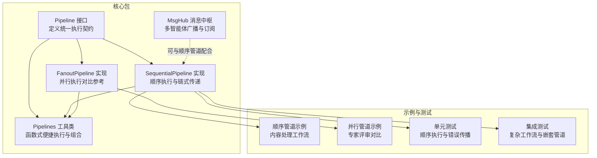
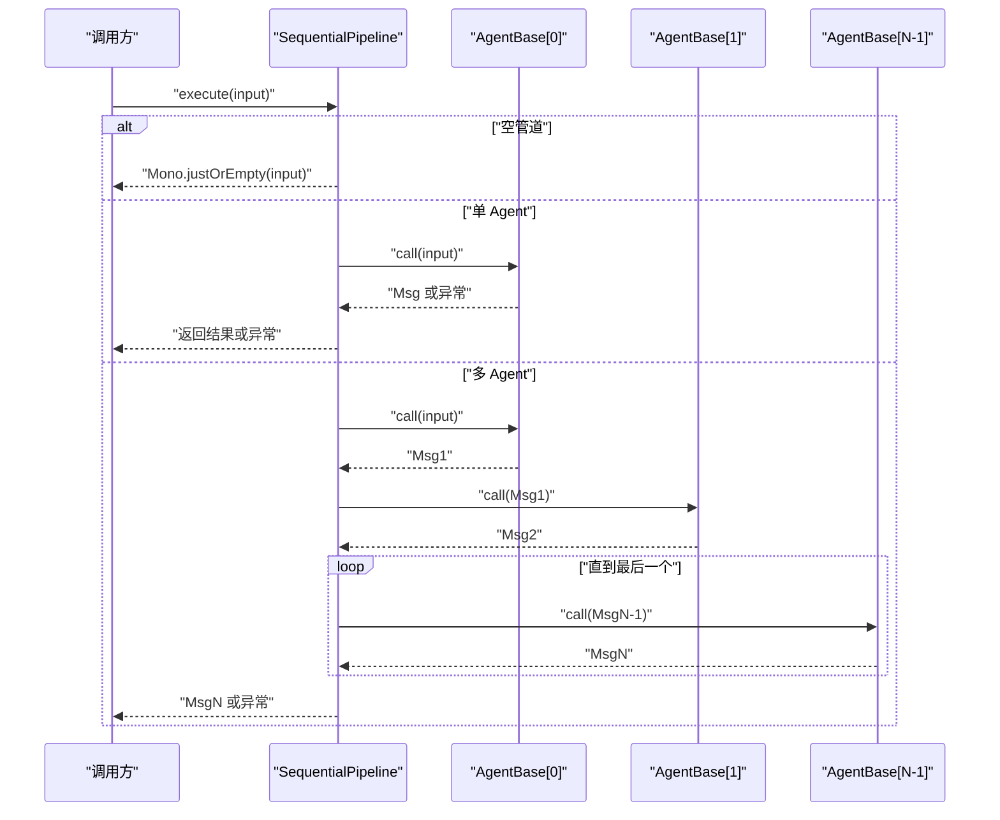
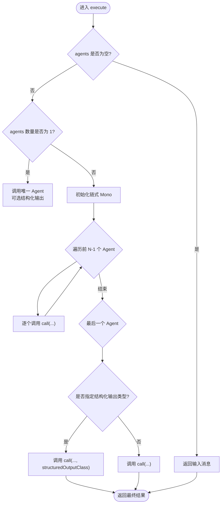
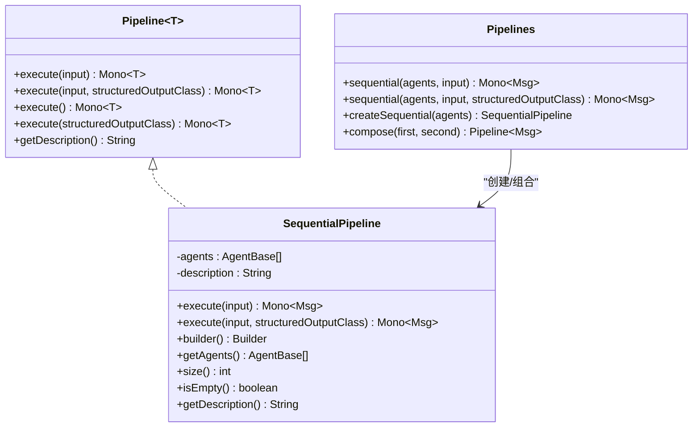
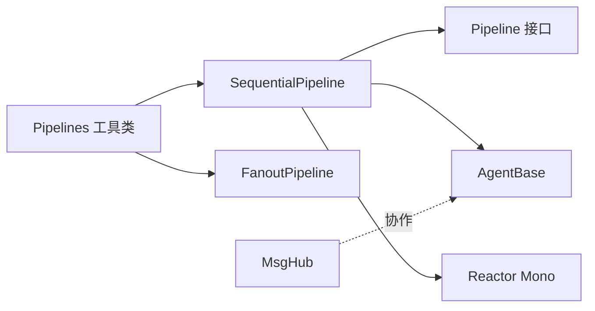

# 顺序管道

<cite>
**本文引用的文件**
- [SequentialPipeline.java](file://agentscope-core/src/main/java/io/agentscope/core/pipeline/SequentialPipeline.java)
- [Pipeline.java](file://agentscope-core/src/main/java/io/agentscope/core/pipeline/Pipeline.java)
- [Pipelines.java](file://agentscope-core/src/main/java/io/agentscope/core/pipeline/Pipelines.java)
- [FanoutPipeline.java](file://agentscope-core/src/main/java/io/agentscope/core/pipeline/FanoutPipeline.java)
- [MsgHub.java](file://agentscope-core/src/main/java/io/agentscope/core/pipeline/MsgHub.java)
- [SequentialPipelineTest.java](file://agentscope-core/src/test/java/io/agentscope/core/pipeline/SequentialPipelineTest.java)
- [PipelineIntegrationTest.java](file://agentscope-core/src/test/java/io/agentscope/core/pipeline/PipelineIntegrationTest.java)
- [SequentialPipelineExample.java](file://agentscope-examples/quickstart/src/main/java/io/agentscope/examples/quickstart/SequentialPipelineExample.java)
- [FanoutPipelineExample.java](file://agentscope-examples/quickstart/src/main/java/io/agentscope/examples/quickstart/FanoutPipelineExample.java)
</cite>

## 目录
1. [简介](#简介)
2. [项目结构](#项目结构)
3. [核心组件](#核心组件)
4. [架构总览](#架构总览)
5. [详细组件分析](#详细组件分析)
6. [依赖分析](#依赖分析)
7. [性能考虑](#性能考虑)
8. [故障排查指南](#故障排查指南)
9. [结论](#结论)
10. [附录](#附录)

## 简介
本文件面向 AgentScope Java 的顺序管道（SequentialPipeline），系统化阐述其设计与实现：消息在线性链路中的传递机制、阶段间依赖关系与状态传播、执行流程与错误传播策略、配置选项与参数传递、返回值处理、性能特征与适用场景，并提供基于仓库内示例与测试的实操指引。读者可据此快速掌握如何构建与使用顺序管道，完成从简单链式调用到复杂多阶段处理的多种任务。

## 项目结构
围绕顺序管道的相关模块主要位于 agentscope-core 的 pipeline 包中，同时包含通用的 Pipeline 接口、工具类 Pipelines、并行管道 FanoutPipeline 以及消息中枢 MsgHub。示例与测试分别位于 agentscope-examples 与 agentscope-core 测试目录下。

图表来源
- [Pipeline.java:29-75](file://agentscope-core/src/main/java/io/agentscope/core/pipeline/Pipeline.java#L29-L75)
- [SequentialPipeline.java:39-185](file://agentscope-core/src/main/java/io/agentscope/core/pipeline/SequentialPipeline.java#L39-L185)
- [Pipelines.java:32-252](file://agentscope-core/src/main/java/io/agentscope/core/pipeline/Pipelines.java#L32-L252)
- [FanoutPipeline.java:49-457](file://agentscope-core/src/main/java/io/agentscope/core/pipeline/FanoutPipeline.java#L49-L457)
- [MsgHub.java:100-434](file://agentscope-core/src/main/java/io/agentscope/core/pipeline/MsgHub.java#L100-L434)
- [SequentialPipelineExample.java:33-194](file://agentscope-examples/quickstart/src/main/java/io/agentscope/examples/quickstart/SequentialPipelineExample.java#L33-L194)
- [FanoutPipelineExample.java:34-287](file://agentscope-examples/quickstart/src/main/java/io/agentscope/examples/quickstart/FanoutPipelineExample.java#L34-L287)
- [SequentialPipelineTest.java:43-185](file://agentscope-core/src/test/java/io/agentscope/core/pipeline/SequentialPipelineTest.java#L43-L185)
- [PipelineIntegrationTest.java:43-213](file://agentscope-core/src/test/java/io/agentscope/core/pipeline/PipelineIntegrationTest.java#L43-L213)

章节来源
- [SequentialPipeline.java:39-185](file://agentscope-core/src/main/java/io/agentscope/core/pipeline/SequentialPipeline.java#L39-L185)
- [Pipeline.java:29-75](file://agentscope-core/src/main/java/io/agentscope/core/pipeline/Pipeline.java#L29-L75)
- [Pipelines.java:32-252](file://agentscope-core/src/main/java/io/agentscope/core/pipeline/Pipelines.java#L32-L252)
- [FanoutPipeline.java:49-457](file://agentscope-core/src/main/java/io/agentscope/core/pipeline/FanoutPipeline.java#L49-L457)
- [MsgHub.java:100-434](file://agentscope-core/src/main/java/io/agentscope/core/pipeline/MsgHub.java#L100-L434)

## 核心组件
- Pipeline 接口：定义统一的执行契约，支持带/不带输入的消息处理，以及带结构化输出的执行变体。
- SequentialPipeline：顺序管道实现，将多个 AgentBase 串联，前一 Agent 的输出作为后一 Agent 的输入；支持空列表、单个 Agent、多个 Agent 的差异化处理路径；支持通过 Builder 构建。
- Pipelines 工具类：提供函数式便捷方法，直接对 Agent 列表进行顺序/并行执行，或创建可复用的管道实例；还包含顺序管道组合器。
- FanoutPipeline：并行管道实现，用于同一输入分发给多个 Agent 并行处理，便于与顺序管道形成混合工作流。
- MsgHub：消息中枢，用于多 Agent 之间的自动广播与订阅，可与顺序管道配合实现更复杂的协作场景。

章节来源
- [Pipeline.java:29-75](file://agentscope-core/src/main/java/io/agentscope/core/pipeline/Pipeline.java#L29-L75)
- [SequentialPipeline.java:39-185](file://agentscope-core/src/main/java/io/agentscope/core/pipeline/SequentialPipeline.java#L39-L185)
- [Pipelines.java:32-252](file://agentscope-core/src/main/java/io/agentscope/core/pipeline/Pipelines.java#L32-L252)
- [FanoutPipeline.java:49-457](file://agentscope-core/src/main/java/io/agentscope/core/pipeline/FanoutPipeline.java#L49-L457)
- [MsgHub.java:100-434](file://agentscope-core/src/main/java/io/agentscope/core/pipeline/MsgHub.java#L100-L434)

## 架构总览
顺序管道在 AgentScope 中属于“编排层”的一部分，负责将多个智能体按线性顺序组织起来，形成端到端的数据处理流水线。其核心特性包括：
- 线性链式传递：消息自上游到下游逐级流转。
- 结构化输出支持：仅在最后一个阶段应用结构化输出类型，确保最终结果的强类型化。
- 错误传播：任一阶段失败即向下游传播异常，中断后续阶段执行。
- 空管道与单阶段优化：空列表直接返回输入；单个 Agent 时避免不必要的链式开销。

图表来源
- [SequentialPipeline.java:54-94](file://agentscope-core/src/main/java/io/agentscope/core/pipeline/SequentialPipeline.java#L54-L94)
- [Pipeline.java:31-46](file://agentscope-core/src/main/java/io/agentscope/core/pipeline/Pipeline.java#L31-L46)

## 详细组件分析

### SequentialPipeline 类与执行流程
- 执行入口
  - execute(Msg)：默认不启用结构化输出。
  - execute(Msg, Class<?>)：在需要强类型返回时，仅对最后一个 Agent 应用结构化输出。
- 空管道处理：当 agents 为空时，直接返回输入消息。
- 单 Agent 优化：若仅有一个 Agent，则根据是否指定结构化输出类型选择不同的调用路径。
- 多 Agent 链式：前 N-1 个 Agent 使用普通 call，最后一个 Agent 在存在结构化输出类型时应用结构化输出。
- Builder 支持：通过 Builder.addAgent/addAgents/build 构建可读性强的管道配置。
- 元数据与描述：提供 size、isEmpty、getDescription、toString 等辅助能力。

图表来源
- [SequentialPipeline.java:54-94](file://agentscope-core/src/main/java/io/agentscope/core/pipeline/SequentialPipeline.java#L54-L94)

章节来源
- [SequentialPipeline.java:39-185](file://agentscope-core/src/main/java/io/agentscope/core/pipeline/SequentialPipeline.java#L39-L185)

### Pipeline 接口与扩展
- 统一契约：execute(Msg)、execute(Msg, Class<?>)、execute()、execute(Class<?>)、getDescription()。
- 与顺序/并行管道的关系：顺序与并行实现均遵循该接口，保证上层调用的一致性。
- 结构化输出语义：仅在最终阶段生效，避免中间阶段被强制约束为特定类型。

章节来源
- [Pipeline.java:29-75](file://agentscope-core/src/main/java/io/agentscope/core/pipeline/Pipeline.java#L29-L75)

### Pipelines 工具类与组合
- 函数式便捷执行：sequential(...)、fanout(...) 等静态方法，适合一次性、无状态的执行。
- 可复用管道创建：createSequential(...)、createFanout(...)、createFanoutSequential(...)。
- 管道组合：compose(SequentialPipeline, SequentialPipeline) 将两个顺序管道连接为一个复合管道，仅第二段应用结构化输出。

图表来源
- [Pipeline.java:29-75](file://agentscope-core/src/main/java/io/agentscope/core/pipeline/Pipeline.java#L29-L75)
- [SequentialPipeline.java:39-185](file://agentscope-core/src/main/java/io/agentscope/core/pipeline/SequentialPipeline.java#L39-L185)
- [Pipelines.java:32-252](file://agentscope-core/src/main/java/io/agentscope/core/pipeline/Pipelines.java#L32-L252)

章节来源
- [Pipelines.java:32-252](file://agentscope-core/src/main/java/io/agentscope/core/pipeline/Pipelines.java#L32-L252)

### 与并行管道的对比与协同
- 并行管道（FanoutPipeline）在同一输入上并行执行多个 Agent，适合独立评估、评审等场景。
- 顺序与并行可组合：先并行收集信息，再顺序决策或整合。
- 并行模式差异：并发与串行两种执行策略，均支持结构化输出与事件流。

章节来源
- [FanoutPipeline.java:49-457](file://agentscope-core/src/main/java/io/agentscope/core/pipeline/FanoutPipeline.java#L49-L457)

### 与消息中枢（MsgHub）的协作
- MsgHub 提供多 Agent 之间的自动广播与订阅，减少显式消息传递。
- 与顺序管道结合：可在顺序阶段之前或之后引入 MsgHub，实现多 Agent 协作与状态共享。

章节来源
- [MsgHub.java:100-434](file://agentscope-core/src/main/java/io/agentscope/core/pipeline/MsgHub.java#L100-L434)

## 依赖分析
- 内聚性：SequentialPipeline 聚焦于顺序执行与链式传递，职责清晰。
- 耦合度：与 AgentBase 的耦合为运行时调用关系，通过 Reactive Mono 链接，避免强耦合。
- 外部依赖：使用 Reactor Mono 进行异步链式处理；Pipelines 作为工具层提供便捷 API。
- 循环依赖：未发现循环依赖迹象。

图表来源
- [SequentialPipeline.java:39-185](file://agentscope-core/src/main/java/io/agentscope/core/pipeline/SequentialPipeline.java#L39-L185)
- [Pipeline.java:29-75](file://agentscope-core/src/main/java/io/agentscope/core/pipeline/Pipeline.java#L29-L75)
- [Pipelines.java:32-252](file://agentscope-core/src/main/java/io/agentscope/core/pipeline/Pipelines.java#L32-L252)
- [FanoutPipeline.java:49-457](file://agentscope-core/src/main/java/io/agentscope/core/pipeline/FanoutPipeline.java#L49-L457)
- [MsgHub.java:100-434](file://agentscope-core/src/main/java/io/agentscope/core/pipeline/MsgHub.java#L100-L434)

## 性能考虑
- 时间复杂度
  - 顺序执行：O(N)，N 为 Agent 数量，每个 Agent 的调用为一次异步操作。
  - 空管道：O(1)，直接返回输入。
  - 单 Agent：O(1)，避免链式开销。
- 并发与串行
  - 顺序管道本身为串行链式，不涉及并发调度；如需并行，可参考 FanoutPipeline 或在上层自行组合。
- 资源管理
  - 建议在长时间运行的顺序流程中，合理设置超时与重试策略，避免阻塞。
  - 对外部模型调用建议开启流式响应与合理的超时配置，提升用户体验。
- 适用场景
  - 数据清洗-转换-聚合-评分等线性处理流水线。
  - 多阶段推理与决策：先分析、再生成、最后校验。
  - 与并行管道组合：先并行收集信息，再顺序整合。

[本节为通用性能讨论，不直接分析具体文件]

## 故障排查指南
- 错误传播
  - 任一 Agent 抛出异常会中断后续阶段，上游调用方应捕获并处理。
  - 单元测试验证了错误会从失败 Agent 向上抛出，且失败 Agent 仍会被调用一次。
- 边界情况
  - 空管道：直接返回原始输入，适用于条件分支或可选阶段。
  - 单 Agent：确保结构化输出类型仅在需要时传入，避免不必要的类型约束。
- 调试建议
  - 使用日志记录每个阶段的输入/输出摘要。
  - 在复杂工作流中，将长链拆分为多个顺序管道，便于定位问题阶段。
  - 结合 Pipelines.compose 进行模块化组合，降低耦合度。

章节来源
- [SequentialPipelineTest.java:82-98](file://agentscope-core/src/test/java/io/agentscope/core/pipeline/SequentialPipelineTest.java#L82-L98)
- [SequentialPipelineTest.java:101-109](file://agentscope-core/src/test/java/io/agentscope/core/pipeline/SequentialPipelineTest.java#L101-L109)

## 结论
SequentialPipeline 以简洁的链式模型实现了多 Agent 的线性编排，具备良好的可读性与可维护性。通过 Pipeline 接口与 Pipelines 工具类，用户既可进行一次性执行，也可构建可复用的顺序管道。结合 FanoutPipeline 与 MsgHub，可覆盖从线性处理到并行评估再到多 Agent 协作的广泛场景。建议在生产环境中配合超时控制、异常处理与可观测性策略，确保稳定性与可诊断性。

[本节为总结性内容，不直接分析具体文件]

## 附录

### 配置选项与参数传递
- 阶段定义
  - 通过构造函数或 Builder.addAgent/addAgents 添加 Agent。
  - 支持动态增删 Agent（Builder 提供 addAgents，但构建后列表不可变）。
- 参数传递
  - execute(Msg)：标准链式传递。
  - execute(Msg, Class<?>)：仅对最后一个 Agent 应用结构化输出类型。
- 返回值处理
  - 返回 Mono<Msg>，最终结果为最后一个 Agent 的输出。
  - 空管道直接返回输入；单 Agent 时可选择结构化输出。

章节来源
- [SequentialPipeline.java:49-94](file://agentscope-core/src/main/java/io/agentscope/core/pipeline/SequentialPipeline.java#L49-L94)
- [Pipelines.java:69-83](file://agentscope-core/src/main/java/io/agentscope/core/pipeline/Pipelines.java#L69-L83)

### 使用示例与最佳实践
- 示例一：顺序管道示例（内容处理工作流）
  - 步骤：翻译 → 摘要 → 情感分析，展示链式传递与 Builder 构建。
  - 关键点：使用 execute(Msg) 执行，注意超时设置。
  - 参考路径：[SequentialPipelineExample.java:67-98](file://agentscope-examples/quickstart/src/main/java/io/agentscope/examples/quickstart/SequentialPipelineExample.java#L67-L98)
- 示例二：并行管道示例（专家评审对比）
  - 对比并发与串行执行，展示 FanoutPipeline 的性能优势。
  - 参考路径：[FanoutPipelineExample.java:64-122](file://agentscope-examples/quickstart/src/main/java/io/agentscope/examples/quickstart/FanoutPipelineExample.java#L64-L122)
- 最佳实践
  - 将长链拆分为多个顺序管道，便于测试与演进。
  - 在顺序管道前后结合 MsgHub 实现多 Agent 协作。
  - 对外部服务调用设置合理的超时与重试策略。
  - 使用 Pipelines.createSequential 创建可复用管道，避免重复构建。

章节来源
- [SequentialPipelineExample.java:33-194](file://agentscope-examples/quickstart/src/main/java/io/agentscope/examples/quickstart/SequentialPipelineExample.java#L33-L194)
- [FanoutPipelineExample.java:34-287](file://agentscope-examples/quickstart/src/main/java/io/agentscope/examples/quickstart/FanoutPipelineExample.java#L34-L287)
- [SequentialPipelineTest.java:151-174](file://agentscope-core/src/test/java/io/agentscope/core/pipeline/SequentialPipelineTest.java#L151-L174)
- [PipelineIntegrationTest.java:60-161](file://agentscope-core/src/test/java/io/agentscope/core/pipeline/PipelineIntegrationTest.java#L60-L161)