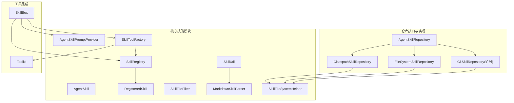
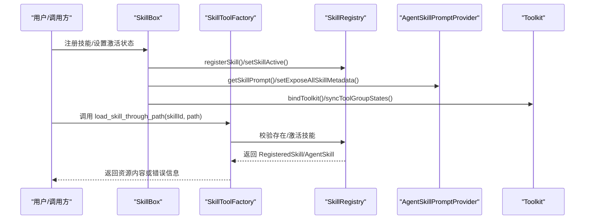
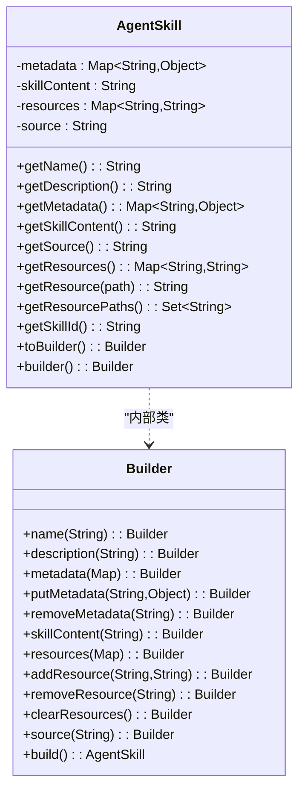
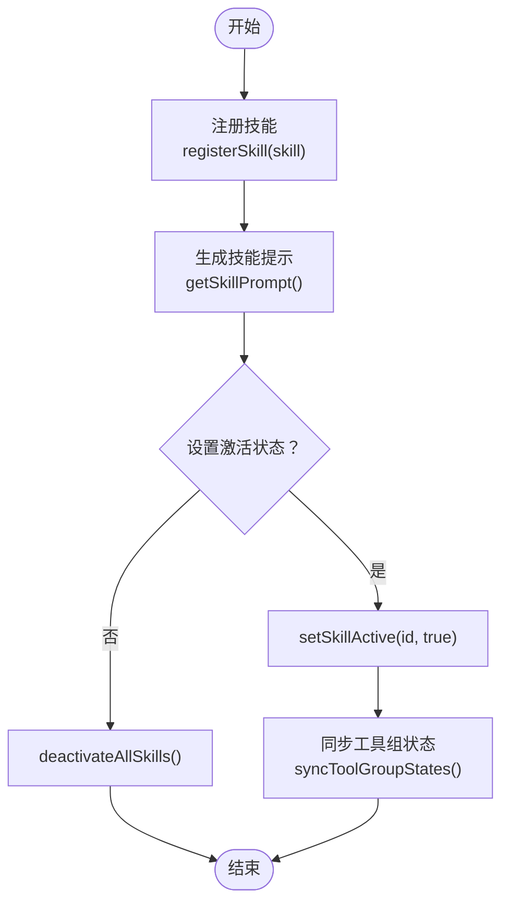
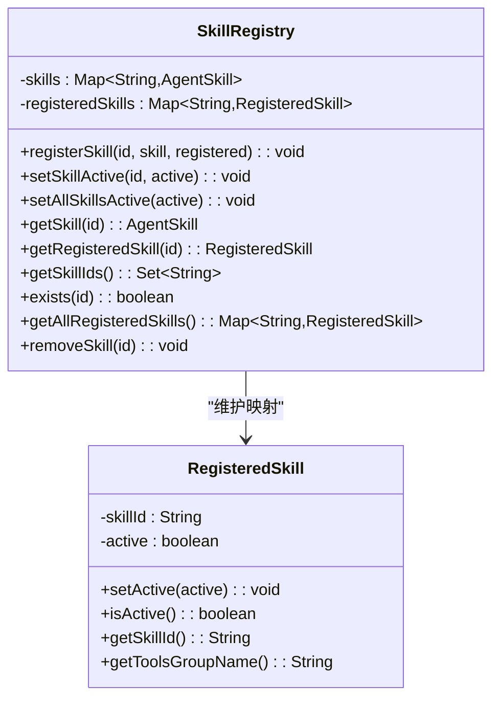
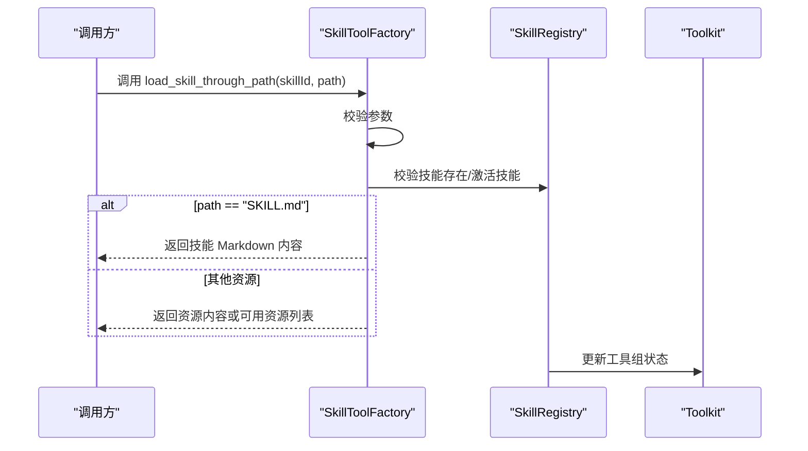
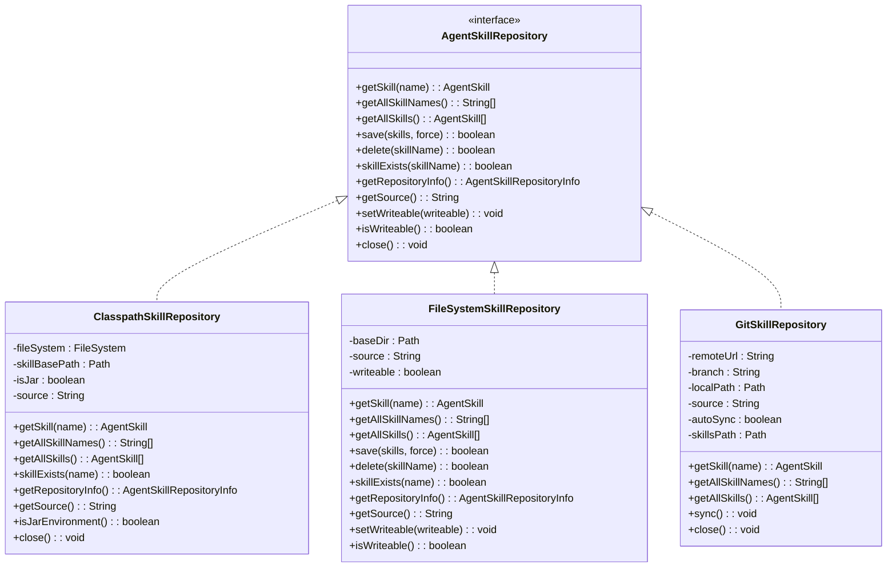
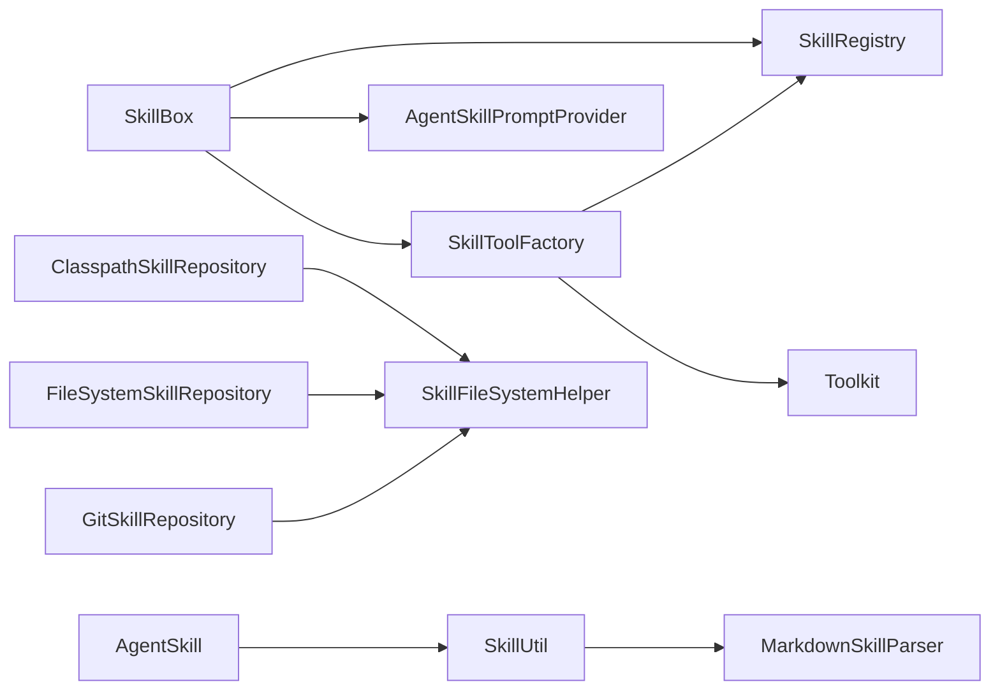

# 技能系统

<cite>
**本文引用的文件**
- [AgentSkill.java](file://agentscope-core/src/main/java/io/agentscope/core/skill/AgentSkill.java)
- [SkillBox.java](file://agentscope-core/src/main/java/io/agentscope/core/skill/SkillBox.java)
- [SkillRegistry.java](file://agentscope-core/src/main/java/io/agentscope/core/skill/SkillRegistry.java)
- [RegisteredSkill.java](file://agentscope-core/src/main/java/io/agentscope/core/skill/RegisteredSkill.java)
- [AgentSkillPromptProvider.java](file://agentscope-core/src/main/java/io/agentscope/core/skill/AgentSkillPromptProvider.java)
- [SkillToolFactory.java](file://agentscope-core/src/main/java/io/agentscope/core/skill/SkillToolFactory.java)
- [SkillFileFilter.java](file://agentscope-core/src/main/java/io/agentscope/core/skill/SkillFileFilter.java)
- [SkillUtil.java](file://agentscope-core/src/main/java/io/agentscope/core/skill/util/SkillUtil.java)
- [MarkdownSkillParser.java](file://agentscope-core/src/main/java/io/agentscope/core/skill/util/MarkdownSkillParser.java)
- [AgentSkillRepository.java](file://agentscope-core/src/main/java/io/agentscope/core/skill/repository/AgentSkillRepository.java)
- [ClasspathSkillRepository.java](file://agentscope-core/src/main/java/io/agentscope/core/skill/repository/ClasspathSkillRepository.java)
- [FileSystemSkillRepository.java](file://agentscope-core/src/main/java/io/agentscope/core/skill/repository/FileSystemSkillRepository.java)
- [GitSkillRepository.java](file://agentscope-extensions/agentscope-extensions-skill-git-repository/src/main/java/io/agentscope/core/skill/repository/GitSkillRepository.java)
- [SkillFileSystemHelper.java](file://agentscope-core/src/main/java/io/agentscope/core/skill/util/SkillFileSystemHelper.java)
- [Toolkit.java](file://agentscope-core/src/main/java/io/agentscope/core/tool/Toolkit.java)
</cite>

## 目录
1. [简介](#简介)
2. [项目结构](#项目结构)
3. [核心组件](#核心组件)
4. [架构总览](#架构总览)
5. [详细组件分析](#详细组件分析)
6. [依赖关系分析](#依赖关系分析)
7. [性能考量](#性能考量)
8. [故障排查指南](#故障排查指南)
9. [结论](#结论)
10. [附录：API 参考与使用示例](#附录api-参考与使用示例)

## 简介
本文件面向 AgentScope Java 技能系统，系统性阐述技能的定义、注册、执行与管理机制，覆盖以下主题：
- 技能模型与元数据：AgentSkill 的字段、来源与资源管理
- 技能注册与状态：SkillRegistry 与 RegisteredSkill 的激活/停用策略
- 技能加载与提示：SkillBox、AgentSkillPromptProvider、SkillToolFactory 的协作
- 技能仓库：类路径、文件系统与 Git 仓库的实现与适用场景
- 工具集成：与 Toolkit 的绑定与动态工具组控制
- 最佳实践：模板、参数校验与错误处理
- 完整 API 参考与端到端使用示例

## 项目结构
技能系统位于 agentscope-core 模块的 skill 包及其子包中，并通过扩展模块提供 Git 技能仓库能力。核心文件组织如下：
- 核心模型与工具：AgentSkill、SkillBox、SkillRegistry、RegisteredSkill、AgentSkillPromptProvider、SkillToolFactory、SkillFileFilter、SkillUtil、MarkdownSkillParser、SkillFileSystemHelper
- 仓库接口与实现：AgentSkillRepository、ClasspathSkillRepository、FileSystemSkillRepository、GitSkillRepository（扩展模块）

图表来源
- [SkillBox.java:45-74](file://agentscope-core/src/main/java/io/agentscope/core/skill/SkillBox.java#L45-L74)
- [SkillRegistry.java:39-57](file://agentscope-core/src/main/java/io/agentscope/core/skill/SkillRegistry.java#L39-L57)
- [AgentSkillPromptProvider.java:36-46](file://agentscope-core/src/main/java/io/agentscope/core/skill/AgentSkillPromptProvider.java#L36-L46)
- [SkillToolFactory.java:32-42](file://agentscope-core/src/main/java/io/agentscope/core/skill/SkillToolFactory.java#L32-L42)
- [SkillUtil.java:52-61](file://agentscope-core/src/main/java/io/agentscope/core/skill/util/SkillUtil.java#L52-L61)
- [MarkdownSkillParser.java:67-84](file://agentscope-core/src/main/java/io/agentscope/core/skill/util/MarkdownSkillParser.java#L67-L84)
- [ClasspathSkillRepository.java:74-83](file://agentscope-core/src/main/java/io/agentscope/core/skill/repository/ClasspathSkillRepository.java#L74-L83)
- [FileSystemSkillRepository.java:51-56](file://agentscope-core/src/main/java/io/agentscope/core/skill/repository/FileSystemSkillRepository.java#L51-L56)
- [GitSkillRepository.java:101-113](file://agentscope-extensions/agentscope-extensions-skill-git-repository/src/main/java/io/agentscope/core/skill/repository/GitSkillRepository.java#L101-L113)
- [SkillFileSystemHelper.java](file://agentscope-core/src/main/java/io/agentscope/core/skill/util/SkillFileSystemHelper.java)

章节来源
- [SkillBox.java:45-122](file://agentscope-core/src/main/java/io/agentscope/core/skill/SkillBox.java#L45-L122)
- [AgentSkillRepository.java:34-97](file://agentscope-core/src/main/java/io/agentscope/core/skill/repository/AgentSkillRepository.java#L34-L97)

## 核心组件
- AgentSkill：技能实体，包含元数据、内容、资源与来源标识；支持从 Markdown/YAML 前言与 ZIP 打包创建
- SkillRegistry：技能注册表，维护技能对象与激活状态映射
- RegisteredSkill：技能注册包装器，记录激活状态与工具组名
- AgentSkillPromptProvider：生成技能系统提示，支持按需暴露元数据与代码执行指引
- SkillToolFactory：创建“按路径加载技能”等访问工具，负责参数校验与资源返回
- SkillBox：技能中枢，负责注册、激活/停用、提示生成、工具组同步、代码执行目录与上传
- 仓库接口与实现：AgentSkillRepository 及其 Classpath/FileSystem/Git 实现，统一技能持久化与检索

章节来源
- [AgentSkill.java:65-141](file://agentscope-core/src/main/java/io/agentscope/core/skill/AgentSkill.java#L65-L141)
- [SkillRegistry.java:39-144](file://agentscope-core/src/main/java/io/agentscope/core/skill/SkillRegistry.java#L39-L144)
- [RegisteredSkill.java:24-73](file://agentscope-core/src/main/java/io/agentscope/core/skill/RegisteredSkill.java#L24-L73)
- [AgentSkillPromptProvider.java:36-131](file://agentscope-core/src/main/java/io/agentscope/core/skill/AgentSkillPromptProvider.java#L36-L131)
- [SkillToolFactory.java:32-58](file://agentscope-core/src/main/java/io/agentscope/core/skill/SkillToolFactory.java#L32-L58)
- [SkillBox.java:45-74](file://agentscope-core/src/main/java/io/agentscope/core/skill/SkillBox.java#L45-L74)

## 架构总览
技能系统围绕 SkillBox 展开，通过 SkillToolFactory 注入“按路径加载技能”的工具，借助 SkillRegistry 维护技能状态，通过 AgentSkillPromptProvider 生成系统提示，结合 Toolkit 的工具组实现动态启用/禁用。

图表来源
- [SkillBox.java:120-177](file://agentscope-core/src/main/java/io/agentscope/core/skill/SkillBox.java#L120-L177)
- [SkillToolFactory.java:69-152](file://agentscope-core/src/main/java/io/agentscope/core/skill/SkillToolFactory.java#L69-L152)
- [SkillRegistry.java:54-81](file://agentscope-core/src/main/java/io/agentscope/core/skill/SkillRegistry.java#L54-L81)
- [AgentSkillPromptProvider.java:140-164](file://agentscope-core/src/main/java/io/agentscope/core/skill/AgentSkillPromptProvider.java#L140-L164)
- [Toolkit.java:66-117](file://agentscope-core/src/main/java/io/agentscope/core/tool/Toolkit.java#L66-L117)

## 详细组件分析

### AgentSkill：技能定义与构建
- 字段与来源：名称、描述、内容、资源映射、来源标识；来源默认值与不可变元数据
- 构建方式：直接构造、从元数据构造、Builder 模式；支持链式修改
- 资源管理：资源路径集合、按路径获取资源、唯一技能 ID（name_source）
- 工具：SkillUtil 与 MarkdownSkillParser 支持从 Markdown/YAML 前言与 ZIP 包创建技能

图表来源
- [AgentSkill.java:65-456](file://agentscope-core/src/main/java/io/agentscope/core/skill/AgentSkill.java#L65-L456)

章节来源
- [AgentSkill.java:65-273](file://agentscope-core/src/main/java/io/agentscope/core/skill/AgentSkill.java#L65-L273)
- [SkillUtil.java:52-112](file://agentscope-core/src/main/java/io/agentscope/core/skill/util/SkillUtil.java#L52-L112)
- [MarkdownSkillParser.java:67-143](file://agentscope-core/src/main/java/io/agentscope/core/skill/util/MarkdownSkillParser.java#L67-L143)

### SkillBox：技能中枢与执行策略
- 提示生成：基于 AgentSkillPromptProvider 输出系统提示，可选择暴露全部元数据
- 注册与管理：注册技能、查询技能、移除技能、检查存在、设置激活状态、批量停用
- 工具组同步：根据技能激活状态更新 Toolkit 中对应工具组的启用/禁用
- 代码执行：工作目录与上传目录管理、文件过滤、自动上传开关
- 访问工具：注册“按路径加载技能”的内置工具，支持加载 SKILL.md 或其他资源

图表来源
- [SkillBox.java:219-340](file://agentscope-core/src/main/java/io/agentscope/core/skill/SkillBox.java#L219-L340)

章节来源
- [SkillBox.java:45-177](file://agentscope-core/src/main/java/io/agentscope/core/skill/SkillBox.java#L45-L177)

### SkillRegistry 与 RegisteredSkill：注册与激活状态
- SkillRegistry：并发安全地存储 AgentSkill 与 RegisteredSkill 映射，提供查询、存在性判断与删除
- RegisteredSkill：封装激活状态与工具组名（skillId_skill_tools），用于与 Toolkit 工具组联动

图表来源
- [SkillRegistry.java:39-144](file://agentscope-core/src/main/java/io/agentscope/core/skill/SkillRegistry.java#L39-L144)
- [RegisteredSkill.java:24-73](file://agentscope-core/src/main/java/io/agentscope/core/skill/RegisteredSkill.java#L24-L73)

章节来源
- [SkillRegistry.java:39-144](file://agentscope-core/src/main/java/io/agentscope/core/skill/SkillRegistry.java#L39-L144)
- [RegisteredSkill.java:24-73](file://agentscope-core/src/main/java/io/agentscope/core/skill/RegisteredSkill.java#L24-L73)

### AgentSkillPromptProvider：提示生成与渲染
- 默认指令与代码执行说明模板
- 将已注册技能元数据渲染为 XML 结构，支持仅暴露核心字段或全部元数据
- 可注入上传目录以在提示中提供代码执行路径

章节来源
- [AgentSkillPromptProvider.java:36-212](file://agentscope-core/src/main/java/io/agentscope/core/skill/AgentSkillPromptProvider.java#L36-L212)

### SkillToolFactory：技能访问工具与参数校验
- 创建“按路径加载技能”的 AgentTool，参数 schema 动态包含所有已注册技能 ID
- 校验 skillId 与 path 必填；当 path=SKILL.md 时返回技能 Markdown 内容并激活技能
- 当资源不存在时，返回可用资源列表（含 SKILL.md）

图表来源
- [SkillToolFactory.java:69-152](file://agentscope-core/src/main/java/io/agentscope/core/skill/SkillToolFactory.java#L69-L152)
- [SkillToolFactory.java:162-293](file://agentscope-core/src/main/java/io/agentscope/core/skill/SkillToolFactory.java#L162-L293)

章节来源
- [SkillToolFactory.java:69-294](file://agentscope-core/src/main/java/io/agentscope/core/skill/SkillToolFactory.java#L69-L294)

### 技能仓库：类路径/文件系统/Git
- AgentSkillRepository 接口：统一技能的增删改查、存在性判断、仓库信息与写入权限
- ClasspathSkillRepository：从资源目录或 JAR 中加载技能，只读
- FileSystemSkillRepository：从本地目录加载/保存/删除技能，支持写入开关
- GitSkillRepository：克隆/拉取远程仓库，按需同步，只读；支持 HTTPS/SSH、分支与进度日志

图表来源
- [AgentSkillRepository.java:34-132](file://agentscope-core/src/main/java/io/agentscope/core/skill/repository/AgentSkillRepository.java#L34-L132)
- [ClasspathSkillRepository.java:74-293](file://agentscope-core/src/main/java/io/agentscope/core/skill/repository/ClasspathSkillRepository.java#L74-L293)
- [FileSystemSkillRepository.java:51-185](file://agentscope-core/src/main/java/io/agentscope/core/skill/repository/FileSystemSkillRepository.java#L51-L185)
- [GitSkillRepository.java:101-725](file://agentscope-extensions/agentscope-extensions-skill-git-repository/src/main/java/io/agentscope/core/skill/repository/GitSkillRepository.java#L101-L725)

章节来源
- [AgentSkillRepository.java:34-132](file://agentscope-core/src/main/java/io/agentscope/core/skill/repository/AgentSkillRepository.java#L34-L132)
- [ClasspathSkillRepository.java:74-293](file://agentscope-core/src/main/java/io/agentscope/core/skill/repository/ClasspathSkillRepository.java#L74-L293)
- [FileSystemSkillRepository.java:51-185](file://agentscope-core/src/main/java/io/agentscope/core/skill/repository/FileSystemSkillRepository.java#L51-L185)
- [GitSkillRepository.java:101-725](file://agentscope-extensions/agentscope-extensions-skill-git-repository/src/main/java/io/agentscope/core/skill/repository/GitSkillRepository.java#L101-L725)

## 依赖关系分析
- SkillBox 依赖 SkillRegistry、AgentSkillPromptProvider、SkillToolFactory 与 Toolkit
- SkillToolFactory 依赖 SkillRegistry 与 Toolkit，用于激活技能后更新工具组
- 仓库实现依赖 SkillFileSystemHelper 进行文件系统操作
- AgentSkill 通过 SkillUtil 与 MarkdownSkillParser 解析与生成技能内容

图表来源
- [SkillBox.java:45-74](file://agentscope-core/src/main/java/io/agentscope/core/skill/SkillBox.java#L45-L74)
- [SkillToolFactory.java:32-42](file://agentscope-core/src/main/java/io/agentscope/core/skill/SkillToolFactory.java#L32-L42)
- [ClasspathSkillRepository.java:18-20](file://agentscope-core/src/main/java/io/agentscope/core/skill/repository/ClasspathSkillRepository.java#L18-L20)
- [FileSystemSkillRepository.java:18-19](file://agentscope-core/src/main/java/io/agentscope/core/skill/repository/FileSystemSkillRepository.java#L18-L19)
- [GitSkillRepository.java:18-19](file://agentscope-extensions/agentscope-extensions-skill-git-repository/src/main/java/io/agentscope/core/skill/repository/GitSkillRepository.java#L18-L19)
- [SkillUtil.java:19-20](file://agentscope-core/src/main/java/io/agentscope/core/skill/util/SkillUtil.java#L19-L20)
- [MarkdownSkillParser.java:19-27](file://agentscope-core/src/main/java/io/agentscope/core/skill/util/MarkdownSkillParser.java#L19-L27)

章节来源
- [SkillBox.java:45-177](file://agentscope-core/src/main/java/io/agentscope/core/skill/SkillBox.java#L45-L177)
- [SkillToolFactory.java:32-58](file://agentscope-core/src/main/java/io/agentscope/core/skill/SkillToolFactory.java#L32-L58)
- [ClasspathSkillRepository.java:18-20](file://agentscope-core/src/main/java/io/agentscope/core/skill/repository/ClasspathSkillRepository.java#L18-L20)
- [FileSystemSkillRepository.java:18-19](file://agentscope-core/src/main/java/io/agentscope/core/skill/repository/FileSystemSkillRepository.java#L18-L19)
- [GitSkillRepository.java:18-19](file://agentscope-extensions/agentscope-extensions-skill-git-repository/src/main/java/io/agentscope/core/skill/repository/GitSkillRepository.java#L18-L19)
- [SkillUtil.java:19-20](file://agentscope-core/src/main/java/io/agentscope/core/skill/util/SkillUtil.java#L19-L20)
- [MarkdownSkillParser.java:19-27](file://agentscope-core/src/main/java/io/agentscope/core/skill/util/MarkdownSkillParser.java#L19-L27)

## 性能考量
- 并发与线程安全：SkillRegistry 使用并发映射，适合多线程注册与查询
- 工具组同步：SkillBox 在激活/停用技能后同步 Toolkit 工具组，避免不必要的工具暴露
- Git 同步策略：GitSkillRepository 采用轻量远程引用检查与按需拉取，减少网络开销
- 文件系统操作：SkillFileSystemHelper 提供统一的加载/保存/删除逻辑，避免重复 IO

## 故障排查指南
- 参数缺失：SkillToolFactory 对必填参数进行校验，若缺失会返回错误消息
- 资源不存在：当请求的资源不在技能资源集中，返回可用资源列表（含 SKILL.md）
- 仓库异常：GitSkillRepository 在认证失败、URL 错误、分支不存在等场景抛出带上下文的异常
- 关闭与清理：ClasspathSkillRepository 与 GitSkillRepository 支持关闭与临时目录清理

章节来源
- [SkillToolFactory.java:123-150](file://agentscope-core/src/main/java/io/agentscope/core/skill/SkillToolFactory.java#L123-L150)
- [SkillToolFactory.java:231-254](file://agentscope-core/src/main/java/io/agentscope/core/skill/SkillToolFactory.java#L231-L254)
- [GitSkillRepository.java:511-581](file://agentscope-extensions/agentscope-extensions-skill-git-repository/src/main/java/io/agentscope/core/skill/repository/GitSkillRepository.java#L511-L581)
- [ClasspathSkillRepository.java:280-292](file://agentscope-core/src/main/java/io/agentscope/core/skill/repository/ClasspathSkillRepository.java#L280-L292)
- [GitSkillRepository.java:306-324](file://agentscope-extensions/agentscope-extensions-skill-git-repository/src/main/java/io/agentscope/core/skill/repository/GitSkillRepository.java#L306-L324)

## 结论
AgentScope Java 技能系统通过清晰的职责分离与可插拔的仓库实现，提供了从技能定义、注册、提示生成到执行与管理的完整能力。SkillBox 作为中枢协调各组件，结合 Toolkit 的工具组机制，实现了按需启用与安全隔离。仓库层支持类路径、文件系统与 Git，满足不同部署与分发场景。建议在生产环境优先采用 Git 仓库进行版本化与团队协作，并配合严格的参数校验与错误处理策略。

## 附录：API 参考与使用示例

### API 参考

- AgentSkill
  - 构造与 Builder：[AgentSkill.java:83-141](file://agentscope-core/src/main/java/io/agentscope/core/skill/AgentSkill.java#L83-L141)、[AgentSkill.java:298-456](file://agentscope-core/src/main/java/io/agentscope/core/skill/AgentSkill.java#L298-L456)
  - 资源与元数据：[AgentSkill.java:148-226](file://agentscope-core/src/main/java/io/agentscope/core/skill/AgentSkill.java#L148-L226)
- SkillBox
  - 注册与管理：[SkillBox.java:219-283](file://agentscope-core/src/main/java/io/agentscope/core/skill/SkillBox.java#L219-L283)
  - 提示生成与元数据暴露：[SkillBox.java:84-99](file://agentscope-core/src/main/java/io/agentscope/core/skill/SkillBox.java#L84-L99)
  - 工具组同步：[SkillBox.java:153-177](file://agentscope-core/src/main/java/io/agentscope/core/skill/SkillBox.java#L153-L177)
  - 代码执行与上传：[SkillBox.java:662-757](file://agentscope-core/src/main/java/io/agentscope/core/skill/SkillBox.java#L662-L757)
- SkillToolFactory
  - 访问工具与参数校验：[SkillToolFactory.java:69-152](file://agentscope-core/src/main/java/io/agentscope/core/skill/SkillToolFactory.java#L69-L152)
  - 激活与响应构建：[SkillToolFactory.java:162-293](file://agentscope-core/src/main/java/io/agentscope/core/skill/SkillToolFactory.java#L162-L293)
- AgentSkillPromptProvider
  - 系统提示生成：[AgentSkillPromptProvider.java:140-164](file://agentscope-core/src/main/java/io/agentscope/core/skill/AgentSkillPromptProvider.java#L140-L164)
  - 元数据渲染与 XML 序列化：[AgentSkillPromptProvider.java:214-291](file://agentscope-core/src/main/java/io/agentscope/core/skill/AgentSkillPromptProvider.java#L214-L291)
- 仓库接口与实现
  - 接口方法：[AgentSkillRepository.java:34-132](file://agentscope-core/src/main/java/io/agentscope/core/skill/repository/AgentSkillRepository.java#L34-L132)
  - 类路径仓库：[ClasspathSkillRepository.java:74-293](file://agentscope-core/src/main/java/io/agentscope/core/skill/repository/ClasspathSkillRepository.java#L74-L293)
  - 文件系统仓库：[FileSystemSkillRepository.java:51-185](file://agentscope-core/src/main/java/io/agentscope/core/skill/repository/FileSystemSkillRepository.java#L51-L185)
  - Git 仓库：[GitSkillRepository.java:101-725](file://agentscope-extensions/agentscope-extensions-skill-git-repository/src/main/java/io/agentscope/core/skill/repository/GitSkillRepository.java#L101-L725)
- 工具集成
  - Toolkit 初始化与配置：[Toolkit.java:66-117](file://agentscope-core/src/main/java/io/agentscope/core/tool/Toolkit.java#L66-L117)

### 使用示例（步骤说明）

- 创建技能
  - 从 Markdown/YAML 前言与资源创建：[SkillUtil.java:73-112](file://agentscope-core/src/main/java/io/agentscope/core/skill/util/SkillUtil.java#L73-L112)
  - 从 ZIP 包创建：[SkillUtil.java:289-354](file://agentscope-core/src/main/java/io/agentscope/core/skill/util/SkillUtil.java#L289-L354)
- 注册技能
  - 注册到 SkillBox：[SkillBox.java:219-233](file://agentscope-core/src/main/java/io/agentscope/core/skill/SkillBox.java#L219-L233)
  - 设置激活状态：[SkillBox.java:305-326](file://agentscope-core/src/main/java/io/agentscope/core/skill/SkillBox.java#L305-L326)
- 加载与使用
  - 通过内置工具按路径加载：[SkillToolFactory.java:69-152](file://agentscope-core/src/main/java/io/agentscope/core/skill/SkillToolFactory.java#L69-L152)
  - 获取系统提示：[SkillBox.java:84-86](file://agentscope-core/src/main/java/io/agentscope/core/skill/SkillBox.java#L84-L86)
- 仓库使用
  - 类路径加载：[ClasspathSkillRepository.java:167-171](file://agentscope-core/src/main/java/io/agentscope/core/skill/repository/ClasspathSkillRepository.java#L167-L171)
  - 文件系统加载/保存：[FileSystemSkillRepository.java:107-134](file://agentscope-core/src/main/java/io/agentscope/core/skill/repository/FileSystemSkillRepository.java#L107-L134)
  - Git 仓库同步与读取：[GitSkillRepository.java:246-262](file://agentscope-extensions/agentscope-extensions-skill-git-repository/src/main/java/io/agentscope/core/skill/repository/GitSkillRepository.java#L246-L262)