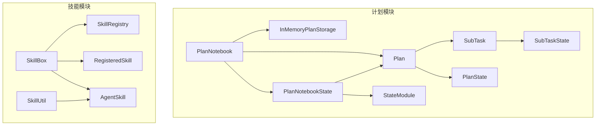
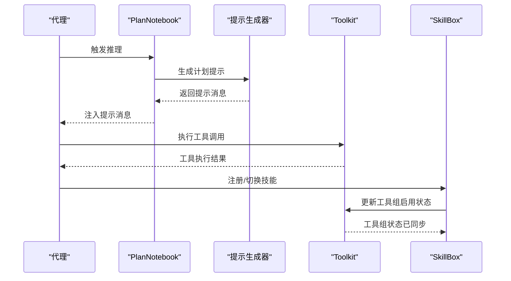
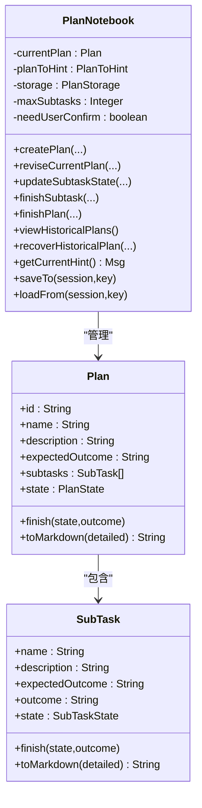
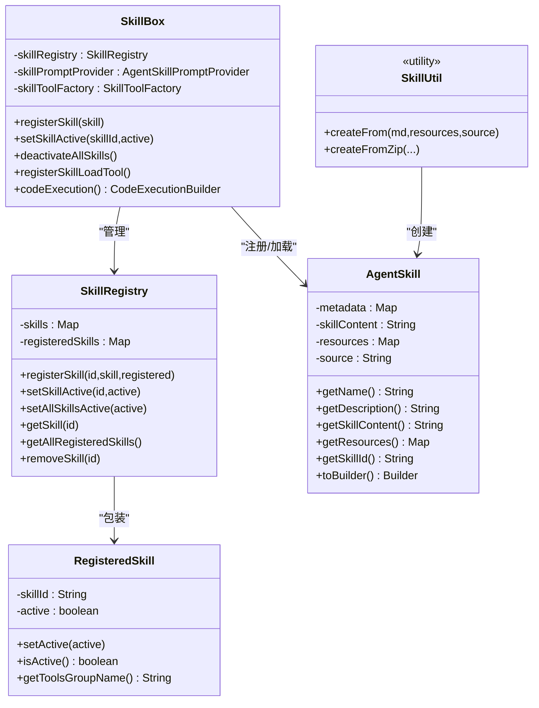
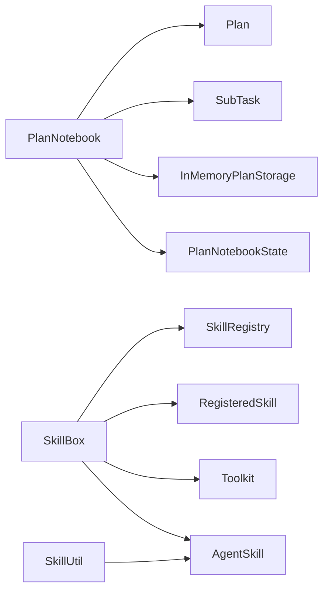

# 计划与技能系统

<cite>
**本文引用的文件**
- [PlanNotebook.java](file://agentscope-core/src/main/java/io/agentscope/core/plan/PlanNotebook.java)
- [Plan.java](file://agentscope-core/src/main/java/io/agentscope/core/plan/model/Plan.java)
- [SubTask.java](file://agentscope-core/src/main/java/io/agentscope/core/plan/model/SubTask.java)
- [PlanState.java](file://agentscope-core/src/main/java/io/agentscope/core/plan/model/PlanState.java)
- [SubTaskState.java](file://agentscope-core/src/main/java/io/agentscope/core/plan/model/SubTaskState.java)
- [InMemoryPlanStorage.java](file://agentscope-core/src/main/java/io/agentscope/core/plan/storage/InMemoryPlanStorage.java)
- [PlanNotebookState.java](file://agentscope-core/src/main/java/io/agentscope/core/state/PlanNotebookState.java)
- [StateModule.java](file://agentscope-core/src/main/java/io/agentscope/core/state/StateModule.java)
- [Toolkit.java](file://agentscope-core/src/main/java/io/agentscope/core/tool/Toolkit.java)
- [AgentSkill.java](file://agentscope-core/src/main/java/io/agentscope/core/skill/AgentSkill.java)
- [SkillBox.java](file://agentscope-core/src/main/java/io/agentscope/core/skill/SkillBox.java)
- [SkillRegistry.java](file://agentscope-core/src/main/java/io/agentscope/core/skill/SkillRegistry.java)
- [RegisteredSkill.java](file://agentscope-core/src/main/java/io/agentscope/core/skill/RegisteredSkill.java)
- [SkillUtil.java](file://agentscope-core/src/main/java/io/agentscope/core/skill/util/SkillUtil.java)
</cite>

## 目录
1. [引言](#引言)
2. [项目结构](#项目结构)
3. [核心组件](#核心组件)
4. [架构总览](#架构总览)
5. [详细组件分析](#详细组件分析)
6. [依赖关系分析](#依赖关系分析)
7. [性能考量](#性能考量)
8. [故障排查指南](#故障排查指南)
9. [结论](#结论)
10. [附录：API 参考与最佳实践](#附录api-参考与最佳实践)

## 引言
本文件面向 AgentScope Java 的“计划与技能系统”，系统性阐述以下主题：
- 计划笔记本（PlanNotebook）的设计理念、任务分解与状态管理
- 技能系统的架构：技能注册、技能执行与技能仓库管理
- AgentSkill 的定义方式、参数传递与结果处理
- 技能盒子（SkillBox）的作用、技能组合与执行策略
- 计划制定与技能使用的最佳实践：任务规划、进度跟踪与异常处理
- 完整 API 参考与使用示例
- 复杂工作流的设计模式与自动化执行策略

## 项目结构
围绕计划与技能系统的关键模块分布如下：
- 计划体系：PlanNotebook 负责计划生命周期与提示注入；Plan/SubTask 提供结构化任务模型；InMemoryPlanStorage 提供内存持久化；PlanNotebookState 实现状态模块化持久化。
- 技能体系：AgentSkill 表达技能元数据与资源；SkillBox 管理技能注册、工具组同步与加载工具；SkillRegistry/RegisteredSkill 维护技能版本与激活状态；SkillUtil 提供从 Markdown/ZIP 创建技能的能力。

图示来源
- [PlanNotebook.java:104-135](file://agentscope-core/src/main/java/io/agentscope/core/plan/PlanNotebook.java#L104-L135)
- [Plan.java:45-84](file://agentscope-core/src/main/java/io/agentscope/core/plan/model/Plan.java#L45-L84)
- [SubTask.java:44-79](file://agentscope-core/src/main/java/io/agentscope/core/plan/model/SubTask.java#L44-L79)
- [PlanState.java:23-34](file://agentscope-core/src/main/java/io/agentscope/core/plan/model/PlanState.java#L23-L34)
- [SubTaskState.java:23-34](file://agentscope-core/src/main/java/io/agentscope/core/plan/model/SubTaskState.java#L23-L34)
- [InMemoryPlanStorage.java:32-68](file://agentscope-core/src/main/java/io/agentscope/core/plan/storage/InMemoryPlanStorage.java#L32-L68)
- [PlanNotebookState.java](file://agentscope-core/src/main/java/io/agentscope/core/state/PlanNotebookState.java#L44)
- [StateModule.java:45-93](file://agentscope-core/src/main/java/io/agentscope/core/state/StateModule.java#L45-L93)
- [AgentSkill.java:65-141](file://agentscope-core/src/main/java/io/agentscope/core/skill/AgentSkill.java#L65-L141)
- [SkillBox.java:45-74](file://agentscope-core/src/main/java/io/agentscope/core/skill/SkillBox.java#L45-L74)
- [SkillRegistry.java:39-57](file://agentscope-core/src/main/java/io/agentscope/core/skill/SkillRegistry.java#L39-L57)
- [RegisteredSkill.java:24-36](file://agentscope-core/src/main/java/io/agentscope/core/skill/RegisteredSkill.java#L24-L36)
- [SkillUtil.java:52-112](file://agentscope-core/src/main/java/io/agentscope/core/skill/util/SkillUtil.java#L52-L112)

章节来源
- [PlanNotebook.java:104-135](file://agentscope-core/src/main/java/io/agentscope/core/plan/PlanNotebook.java#L104-L135)
- [SkillBox.java:45-74](file://agentscope-core/src/main/java/io/agentscope/core/skill/SkillBox.java#L45-L74)

## 核心组件
- 计划笔记本（PlanNotebook）
  - 提供计划创建、修订、子任务状态更新、完成、历史查看与恢复等工具函数
  - 通过钩子机制在推理前注入上下文提示，支持用户确认规则
  - 支持最大子任务数量限制与变更钩子扩展
- 计划模型（Plan/SubTask）
  - Plan 包含名称、描述、期望产出、子任务列表与整体状态
  - SubTask 包含名称、描述、期望产出、实际结果与状态
  - PlanState/SubTaskState 枚举统一状态语义
- 技能系统（AgentSkill/SkillBox/SkillRegistry/RegisteredSkill）
  - AgentSkill 封装技能元数据、内容与资源，并提供 Builder 与 from-markdown 工厂
  - SkillBox 负责技能注册、工具组同步、加载工具注册与代码执行配置
  - SkillRegistry/RegisteredSkill 维护技能版本与激活状态
  - SkillUtil 提供从 Markdown/ZIP 快速构建技能的能力

章节来源
- [PlanNotebook.java:259-331](file://agentscope-core/src/main/java/io/agentscope/core/plan/PlanNotebook.java#L259-L331)
- [Plan.java:45-84](file://agentscope-core/src/main/java/io/agentscope/core/plan/model/Plan.java#L45-L84)
- [SubTask.java:44-79](file://agentscope-core/src/main/java/io/agentscope/core/plan/model/SubTask.java#L44-L79)
- [AgentSkill.java:65-141](file://agentscope-core/src/main/java/io/agentscope/core/skill/AgentSkill.java#L65-L141)
- [SkillBox.java:194-233](file://agentscope-core/src/main/java/io/agentscope/core/skill/SkillBox.java#L194-L233)
- [SkillRegistry.java:39-57](file://agentscope-core/src/main/java/io/agentscope/core/skill/SkillRegistry.java#L39-L57)
- [RegisteredSkill.java:24-36](file://agentscope-core/src/main/java/io/agentscope/core/skill/RegisteredSkill.java#L24-L36)
- [SkillUtil.java:52-112](file://agentscope-core/src/main/java/io/agentscope/core/skill/util/SkillUtil.java#L52-L112)

## 架构总览
计划与技能系统通过“状态模块化 + 工具组动态控制”的方式实现解耦与可扩展：
- PlanNotebook 实现 StateModule，将当前 Plan 持久化到会话中，支持跨调用恢复
- SkillBox 与 Toolkit 协作：SkillBox 注册技能工具到 Toolkit 的工具组，SkillBox 同步技能激活状态到工具组启用/禁用
- 计划提示注入：PlanNotebook 在每次推理前生成提示消息，注入到消息流中

图示来源
- [PlanNotebook.java:975-986](file://agentscope-core/src/main/java/io/agentscope/core/plan/PlanNotebook.java#L975-L986)
- [SkillBox.java:153-177](file://agentscope-core/src/main/java/io/agentscope/core/skill/SkillBox.java#L153-L177)
- [Toolkit.java:586-594](file://agentscope-core/src/main/java/io/agentscope/core/tool/Toolkit.java#L586-L594)

## 详细组件分析

### 计划笔记本（PlanNotebook）设计与状态管理
- 设计理念
  - 结构化计划：以 Plan 为核心，子任务以 SubTask 列表组织，明确“期望产出”与“实际结果”
  - 钩子驱动的提示注入：在每次推理前根据当前 Plan 生成提示，辅助 Agent 做出下一步决策
  - 状态驱动的流程控制：通过 PlanState/SubTaskState 严格约束状态转换，避免并发与顺序错误
- 关键能力
  - 计划创建/修订/完成：支持名称、描述、期望产出更新；支持子任务增删改
  - 子任务状态校验：强制按序推进，同一时刻仅允许一个子任务处于进行中
  - 历史计划管理：持久化与恢复，支持替换当前计划
  - 用户确认规则：可选的“等待用户确认”规则，增强安全性
- 状态模块化
  - 实现 StateModule 接口，保存 PlanNotebookState（封装当前 Plan），支持跨会话恢复

图示来源
- [PlanNotebook.java:104-135](file://agentscope-core/src/main/java/io/agentscope/core/plan/PlanNotebook.java#L104-L135)
- [Plan.java:45-84](file://agentscope-core/src/main/java/io/agentscope/core/plan/model/Plan.java#L45-L84)
- [SubTask.java:44-79](file://agentscope-core/src/main/java/io/agentscope/core/plan/model/SubTask.java#L44-L79)

章节来源
- [PlanNotebook.java:259-331](file://agentscope-core/src/main/java/io/agentscope/core/plan/PlanNotebook.java#L259-L331)
- [PlanNotebook.java:569-736](file://agentscope-core/src/main/java/io/agentscope/core/plan/PlanNotebook.java#L569-L736)
- [PlanNotebook.java:817-868](file://agentscope-core/src/main/java/io/agentscope/core/plan/PlanNotebook.java#L817-L868)
- [PlanNotebook.java:870-962](file://agentscope-core/src/main/java/io/agentscope/core/plan/PlanNotebook.java#L870-L962)
- [PlanNotebook.java:975-986](file://agentscope-core/src/main/java/io/agentscope/core/plan/PlanNotebook.java#L975-L986)
- [PlanNotebookState.java](file://agentscope-core/src/main/java/io/agentscope/core/state/PlanNotebookState.java#L44)
- [StateModule.java:45-93](file://agentscope-core/src/main/java/io/agentscope/core/state/StateModule.java#L45-L93)

### 技能系统架构：注册、执行与仓库管理
- AgentSkill
  - 元数据：name、description 等（由构造或 YAML frontmatter 解析）
  - 内容：技能指令或实现文本
  - 资源：与技能关联的文件映射
  - 版本与来源：通过“技能名+来源”形成唯一标识
- SkillBox
  - 注册：将 AgentSkill 注册到 SkillRegistry，并为其创建专属工具组
  - 工具组同步：根据技能激活状态更新 Toolkit 中对应工具组的启用/禁用
  - 加载工具：注册内置“按路径加载技能资源”的工具，便于动态访问
  - 代码执行：提供 CodeExecutionBuilder，可选择性启用读写/Shell 等工具
- SkillRegistry/RegisteredSkill
  - 维护技能对象与激活状态；支持查询、删除、批量设置激活状态
- SkillUtil
  - 从 Markdown（含 YAML frontmatter）或 ZIP 包快速创建 AgentSkill

图示来源
- [AgentSkill.java:65-141](file://agentscope-core/src/main/java/io/agentscope/core/skill/AgentSkill.java#L65-L141)
- [SkillBox.java:194-233](file://agentscope-core/src/main/java/io/agentscope/core/skill/SkillBox.java#L194-L233)
- [SkillRegistry.java:39-57](file://agentscope-core/src/main/java/io/agentscope/core/skill/SkillRegistry.java#L39-L57)
- [RegisteredSkill.java:24-36](file://agentscope-core/src/main/java/io/agentscope/core/skill/RegisteredSkill.java#L24-L36)
- [SkillUtil.java:52-112](file://agentscope-core/src/main/java/io/agentscope/core/skill/util/SkillUtil.java#L52-L112)

章节来源
- [AgentSkill.java:65-141](file://agentscope-core/src/main/java/io/agentscope/core/skill/AgentSkill.java#L65-L141)
- [SkillBox.java:194-233](file://agentscope-core/src/main/java/io/agentscope/core/skill/SkillBox.java#L194-L233)
- [SkillBox.java:285-326](file://agentscope-core/src/main/java/io/agentscope/core/skill/SkillBox.java#L285-L326)
- [SkillBox.java:590-620](file://agentscope-core/src/main/java/io/agentscope/core/skill/SkillBox.java#L590-L620)
- [SkillBox.java:662-664](file://agentscope-core/src/main/java/io/agentscope/core/skill/SkillBox.java#L662-L664)
- [SkillRegistry.java:39-57](file://agentscope-core/src/main/java/io/agentscope/core/skill/SkillRegistry.java#L39-L57)
- [RegisteredSkill.java:24-36](file://agentscope-core/src/main/java/io/agentscope/core/skill/RegisteredSkill.java#L24-L36)
- [SkillUtil.java:52-112](file://agentscope-core/src/main/java/io/agentscope/core/skill/util/SkillUtil.java#L52-L112)

### 计划制定与技能使用的最佳实践
- 计划制定
  - 明确“期望产出”：每个子任务应有具体、可验证的结果
  - 控制子任务粒度：避免过多子任务，必要时使用 maxSubtasks 限制
  - 顺序约束：确保子任务按序推进，避免并发冲突
- 进度跟踪
  - 使用 finishSubtask 自动激活下一个子任务
  - 定期调用 viewSubtasks/getSubtaskCount 获取统计信息
- 异常处理
  - 子任务状态非法转换会返回错误信息，需按提示修正
  - 历史计划恢复会自动处理当前未完成计划的状态
- 技能使用
  - 通过 SkillBox 注册技能后，使用 setSkillActive 控制是否启用
  - 使用 registerSkillLoadTool 动态加载技能资源
  - 代码执行场景下，合理配置工作目录与上传目录，避免路径穿越

章节来源
- [PlanNotebook.java:569-736](file://agentscope-core/src/main/java/io/agentscope/core/plan/PlanNotebook.java#L569-L736)
- [PlanNotebook.java:776-815](file://agentscope-core/src/main/java/io/agentscope/core/plan/PlanNotebook.java#L776-L815)
- [PlanNotebook.java:896-962](file://agentscope-core/src/main/java/io/agentscope/core/plan/PlanNotebook.java#L896-L962)
- [SkillBox.java:285-326](file://agentscope-core/src/main/java/io/agentscope/core/skill/SkillBox.java#L285-L326)
- [SkillBox.java:603-620](file://agentscope-core/src/main/java/io/agentscope/core/skill/SkillBox.java#L603-L620)
- [SkillBox.java:771-800](file://agentscope-core/src/main/java/io/agentscope/core/skill/SkillBox.java#L771-L800)

## 依赖关系分析
- PlanNotebook 依赖
  - Plan/SubTask/PlanState/SubTaskState：计划模型
  - InMemoryPlanStorage：历史计划持久化
  - PlanNotebookState/StateModule：状态模块化
- SkillBox 依赖
  - SkillRegistry/RegisteredSkill：技能注册与激活
  - Toolkit：工具组启用/禁用同步
  - SkillUtil：技能创建工厂

图示来源
- [PlanNotebook.java:104-135](file://agentscope-core/src/main/java/io/agentscope/core/plan/PlanNotebook.java#L104-L135)
- [InMemoryPlanStorage.java:32-68](file://agentscope-core/src/main/java/io/agentscope/core/plan/storage/InMemoryPlanStorage.java#L32-L68)
- [PlanNotebookState.java](file://agentscope-core/src/main/java/io/agentscope/core/state/PlanNotebookState.java#L44)
- [SkillBox.java:45-74](file://agentscope-core/src/main/java/io/agentscope/core/skill/SkillBox.java#L45-L74)
- [SkillRegistry.java:39-57](file://agentscope-core/src/main/java/io/agentscope/core/skill/SkillRegistry.java#L39-L57)
- [RegisteredSkill.java:24-36](file://agentscope-core/src/main/java/io/agentscope/core/skill/RegisteredSkill.java#L24-L36)
- [Toolkit.java:586-594](file://agentscope-core/src/main/java/io/agentscope/core/tool/Toolkit.java#L586-L594)
- [AgentSkill.java:65-141](file://agentscope-core/src/main/java/io/agentscope/core/skill/AgentSkill.java#L65-L141)
- [SkillUtil.java:52-112](file://agentscope-core/src/main/java/io/agentscope/core/skill/util/SkillUtil.java#L52-L112)

章节来源
- [PlanNotebook.java:104-135](file://agentscope-core/src/main/java/io/agentscope/core/plan/PlanNotebook.java#L104-L135)
- [SkillBox.java:45-74](file://agentscope-core/src/main/java/io/agentscope/core/skill/SkillBox.java#L45-L74)
- [Toolkit.java:586-594](file://agentscope-core/src/main/java/io/agentscope/core/tool/Toolkit.java#L586-L594)

## 性能考量
- 并发安全
  - PlanNotebook 使用并发容器存储状态，适合多线程环境
  - SkillRegistry/RegisteredSkill 使用并发映射，保证技能注册与查询的线程安全
- I/O 与持久化
  - InMemoryPlanStorage 适用于开发测试；生产建议自定义持久化实现
  - SkillBox 的上传目录与临时目录创建具备幂等与清理机制
- 工具执行
  - Toolkit 支持并行/串行执行配置，结合超时与重试策略提升鲁棒性

## 故障排查指南
- 计划相关
  - 子任务状态非法：检查状态枚举与前置条件，确保按序推进且同一时刻仅有一个进行中的子任务
  - 子任务数量超限：调整 maxSubtasks 或减少子任务
  - 历史计划恢复：注意当前未完成计划会被标记为放弃并持久化
- 技能相关
  - 注册技能为空：确认 AgentSkill 不为 null，且技能 ID 唯一
  - 工具组未生效：确认 setSkillActive 已调用，且 SkillBox 已绑定正确 Toolkit
  - ZIP 包解析失败：检查根目录、SKILL.md 位置与条目命名规范
- 状态恢复
  - 确保 PlanNotebook 实现 StateModule 并正确保存/加载 PlanNotebookState

章节来源
- [PlanNotebook.java:569-736](file://agentscope-core/src/main/java/io/agentscope/core/plan/PlanNotebook.java#L569-L736)
- [PlanNotebook.java:896-962](file://agentscope-core/src/main/java/io/agentscope/core/plan/PlanNotebook.java#L896-L962)
- [SkillBox.java:285-326](file://agentscope-core/src/main/java/io/agentscope/core/skill/SkillBox.java#L285-L326)
- [SkillBox.java:771-800](file://agentscope-core/src/main/java/io/agentscope/core/skill/SkillBox.java#L771-L800)
- [SkillUtil.java:246-354](file://agentscope-core/src/main/java/io/agentscope/core/skill/util/SkillUtil.java#L246-L354)
- [PlanNotebookState.java](file://agentscope-core/src/main/java/io/agentscope/core/state/PlanNotebookState.java#L44)

## 结论
AgentScope Java 的计划与技能系统通过“结构化计划 + 动态技能工具组”的设计，实现了复杂任务的可规划、可追踪与可扩展执行。PlanNotebook 提供严谨的状态机与提示注入机制；SkillBox 将技能无缝接入 Toolkit 的工具组体系，支持灵活的组合与执行策略。配合状态模块化与工具组动态控制，系统在安全性、可观测性与可维护性方面均具备良好表现。

## 附录：API 参考与最佳实践

### 计划笔记本（PlanNotebook）API 参考
- 工具函数
  - createPlan：创建计划（名称、描述、期望产出、子任务列表）
  - updatePlanInfo：更新计划信息（名称/描述/期望产出）
  - reviseCurrentPlan：增删改子任务（索引、动作、子任务）
  - updateSubtaskState：更新子任务状态（todo/in_progress/abandoned）
  - finishSubtask：完成子任务（索引、结果）
  - viewSubtasks/getSubtaskCount：查看子任务详情与统计
  - finishPlan：完成或放弃计划（状态、结果/原因）
  - viewHistoricalPlans/recoverHistoricalPlan：查看与恢复历史计划
- 辅助方法
  - getCurrentHint：生成提示消息
  - isNeedUserConfirm/getMaxSubtasks：配置查询
  - addChangeHook/removeChangeHook：变更钩子注册

章节来源
- [PlanNotebook.java:259-331](file://agentscope-core/src/main/java/io/agentscope/core/plan/PlanNotebook.java#L259-L331)
- [PlanNotebook.java:333-402](file://agentscope-core/src/main/java/io/agentscope/core/plan/PlanNotebook.java#L333-L402)
- [PlanNotebook.java:467-567](file://agentscope-core/src/main/java/io/agentscope/core/plan/PlanNotebook.java#L467-L567)
- [PlanNotebook.java:579-653](file://agentscope-core/src/main/java/io/agentscope/core/plan/PlanNotebook.java#L579-L653)
- [PlanNotebook.java:662-736](file://agentscope-core/src/main/java/io/agentscope/core/plan/PlanNotebook.java#L662-L736)
- [PlanNotebook.java:744-774](file://agentscope-core/src/main/java/io/agentscope/core/plan/PlanNotebook.java#L744-L774)
- [PlanNotebook.java:781-815](file://agentscope-core/src/main/java/io/agentscope/core/plan/PlanNotebook.java#L781-L815)
- [PlanNotebook.java:824-868](file://agentscope-core/src/main/java/io/agentscope/core/plan/PlanNotebook.java#L824-L868)
- [PlanNotebook.java:870-962](file://agentscope-core/src/main/java/io/agentscope/core/plan/PlanNotebook.java#L870-L962)
- [PlanNotebook.java:975-986](file://agentscope-core/src/main/java/io/agentscope/core/plan/PlanNotebook.java#L975-L986)
- [PlanNotebook.java:1015-1041](file://agentscope-core/src/main/java/io/agentscope/core/plan/PlanNotebook.java#L1015-L1041)

### 技能系统（AgentSkill/SkillBox/SkillUtil）API 参考
- AgentSkill
  - 构造：直接传参或使用 Builder
  - 工厂：SkillUtil.createFrom/fromZip
  - 资源：getResourcePaths/addResource/removeResource
- SkillBox
  - registerSkill：注册技能
  - setSkillActive/deactivateAllSkills：控制技能激活状态
  - registerSkillLoadTool：注册加载工具
  - codeExecution：配置代码执行能力
- SkillRegistry/RegisteredSkill
  - getSkill/setSkillActive/removeSkill：查询与管理
  - getAllRegisteredSkills：遍历技能

章节来源
- [AgentSkill.java:65-141](file://agentscope-core/src/main/java/io/agentscope/core/skill/AgentSkill.java#L65-L141)
- [AgentSkill.java:246-273](file://agentscope-core/src/main/java/io/agentscope/core/skill/AgentSkill.java#L246-L273)
- [AgentSkill.java:298-456](file://agentscope-core/src/main/java/io/agentscope/core/skill/AgentSkill.java#L298-L456)
- [SkillUtil.java:52-112](file://agentscope-core/src/main/java/io/agentscope/core/skill/util/SkillUtil.java#L52-L112)
- [SkillUtil.java:125-212](file://agentscope-core/src/main/java/io/agentscope/core/skill/util/SkillUtil.java#L125-L212)
- [SkillUtil.java:246-354](file://agentscope-core/src/main/java/io/agentscope/core/skill/util/SkillUtil.java#L246-L354)
- [SkillBox.java:194-233](file://agentscope-core/src/main/java/io/agentscope/core/skill/SkillBox.java#L194-L233)
- [SkillBox.java:285-326](file://agentscope-core/src/main/java/io/agentscope/core/skill/SkillBox.java#L285-L326)
- [SkillBox.java:590-620](file://agentscope-core/src/main/java/io/agentscope/core/skill/SkillBox.java#L590-L620)
- [SkillBox.java:662-664](file://agentscope-core/src/main/java/io/agentscope/core/skill/SkillBox.java#L662-L664)
- [SkillRegistry.java:39-57](file://agentscope-core/src/main/java/io/agentscope/core/skill/SkillRegistry.java#L39-L57)
- [RegisteredSkill.java:24-36](file://agentscope-core/src/main/java/io/agentscope/core/skill/RegisteredSkill.java#L24-L36)

### 最佳实践与使用示例（步骤化）
- 计划制定
  - 步骤1：准备子任务列表（名称、描述、期望产出）
  - 步骤2：调用 createPlan 创建计划
  - 步骤3：逐步调用 updateSubtaskState/finishSubtask 推进执行
  - 步骤4：完成后调用 finishPlan
- 技能使用
  - 步骤1：使用 SkillUtil 从 Markdown/ZIP 创建 AgentSkill
  - 步骤2：通过 SkillBox.registerSkill 注册技能
  - 步骤3：使用 setSkillActive 激活技能对应的工具组
  - 步骤4：在工具组内调用技能暴露的工具
- 状态持久化
  - 步骤1：实现 StateModule.saveTo/loadFrom
  - 步骤2：在会话中保存/恢复 PlanNotebookState

章节来源
- [PlanNotebook.java:259-331](file://agentscope-core/src/main/java/io/agentscope/core/plan/PlanNotebook.java#L259-L331)
- [PlanNotebook.java:569-736](file://agentscope-core/src/main/java/io/agentscope/core/plan/PlanNotebook.java#L569-L736)
- [PlanNotebook.java:824-868](file://agentscope-core/src/main/java/io/agentscope/core/plan/PlanNotebook.java#L824-L868)
- [SkillUtil.java:52-112](file://agentscope-core/src/main/java/io/agentscope/core/skill/util/SkillUtil.java#L52-L112)
- [SkillBox.java:194-233](file://agentscope-core/src/main/java/io/agentscope/core/skill/SkillBox.java#L194-L233)
- [SkillBox.java:285-326](file://agentscope-core/src/main/java/io/agentscope/core/skill/SkillBox.java#L285-L326)
- [PlanNotebookState.java](file://agentscope-core/src/main/java/io/agentscope/core/state/PlanNotebookState.java#L44)