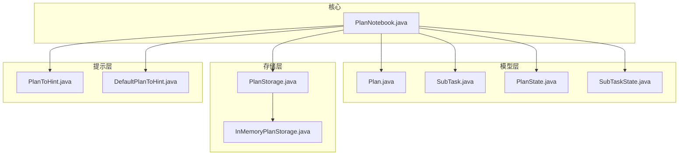
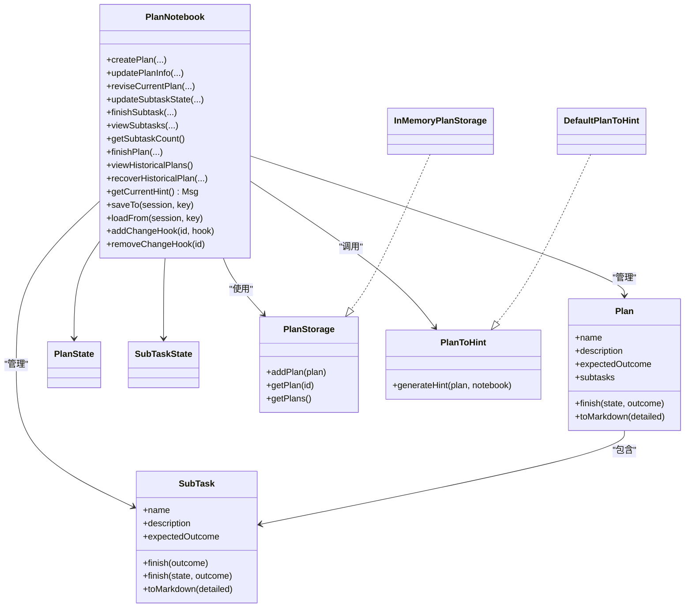
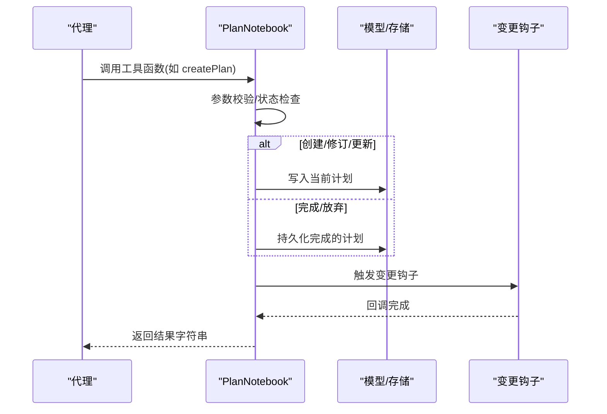
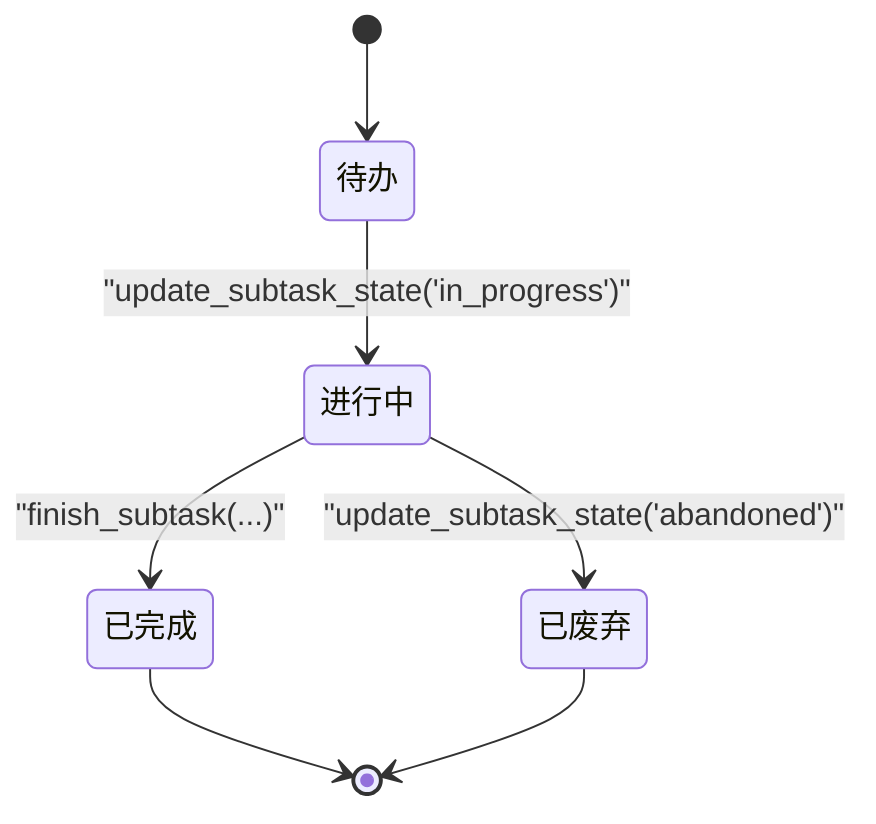
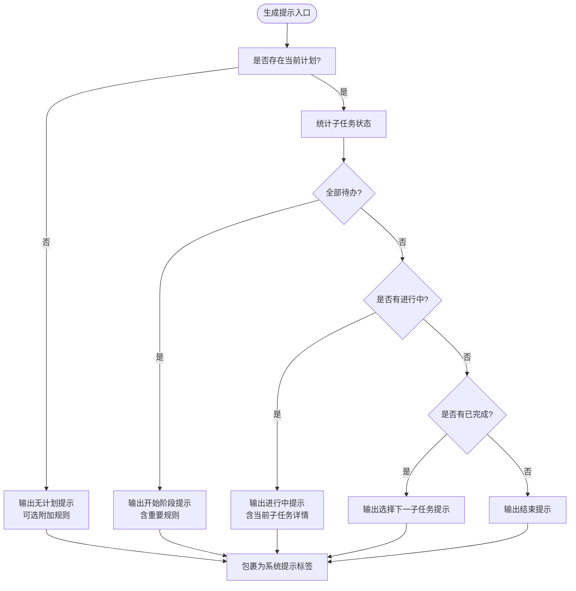
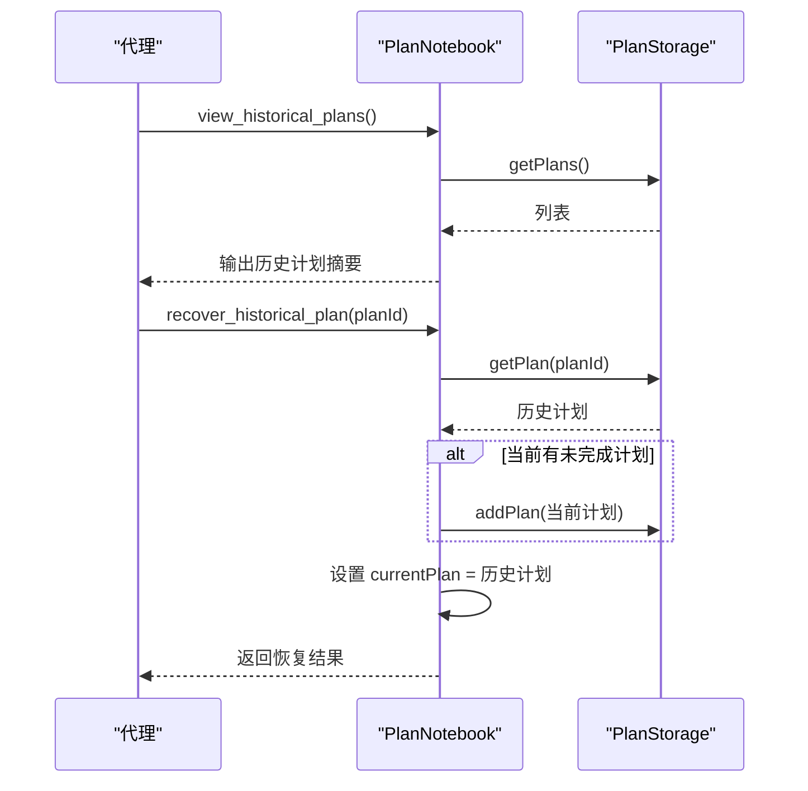
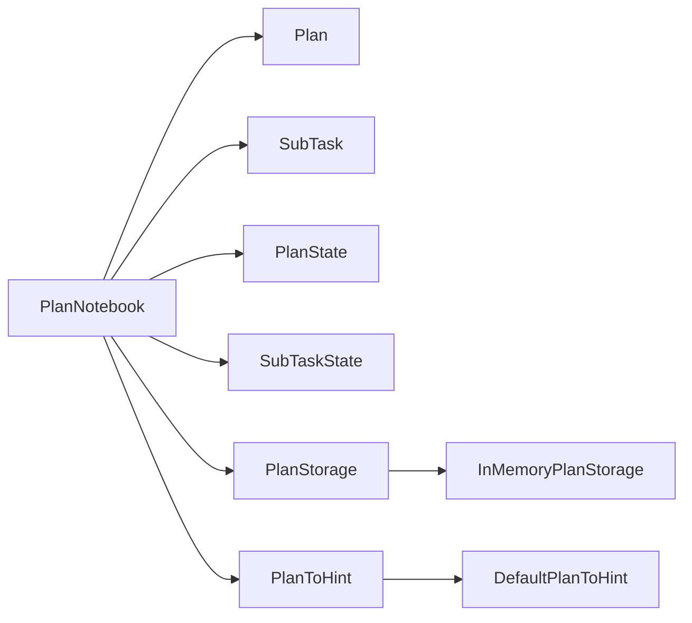

# 计划笔记本

<cite>
**本文引用的文件**   
- [PlanNotebook.java](file://agentscope-core/src/main/java/io/agentscope/core/plan/PlanNotebook.java)
- [Plan.java](file://agentscope-core/src/main/java/io/agentscope/core/plan/model/Plan.java)
- [SubTask.java](file://agentscope-core/src/main/java/io/agentscope/core/plan/model/SubTask.java)
- [PlanState.java](file://agentscope-core/src/main/java/io/agentscope/core/plan/model/PlanState.java)
- [SubTaskState.java](file://agentscope-core/src/main/java/io/agentscope/core/plan/model/SubTaskState.java)
- [PlanToHint.java](file://agentscope-core/src/main/java/io/agentscope/core/plan/hint/PlanToHint.java)
- [DefaultPlanToHint.java](file://agentscope-core/src/main/java/io/agentscope/core/plan/hint/DefaultPlanToHint.java)
- [PlanStorage.java](file://agentscope-core/src/main/java/io/agentscope/core/plan/storage/PlanStorage.java)
- [InMemoryPlanStorage.java](file://agentscope-core/src/main/java/io/agentscope/core/plan/storage/InMemoryPlanStorage.java)
</cite>

## 目录
1. [简介](#简介)
2. [项目结构](#项目结构)
3. [核心组件](#核心组件)
4. [架构总览](#架构总览)
5. [详细组件分析](#详细组件分析)
6. [依赖关系分析](#依赖关系分析)
7. [性能与可扩展性](#性能与可扩展性)
8. [故障排查指南](#故障排查指南)
9. [结论](#结论)
10. [附录：使用示例与最佳实践](#附录使用示例与最佳实践)

## 简介
本文件面向 AgentScope Java 的“计划笔记本”（PlanNotebook），系统化阐述其架构设计、工具函数体系、状态管理与提示转换机制，并提供配置项说明、使用示例与最佳实践。PlanNotebook 提供对复杂任务的结构化规划与执行跟踪能力，支持自动注入上下文提示、子任务状态约束与自动激活、历史计划存取等特性。

## 项目结构
围绕计划笔记本的相关代码位于 agentscope-core 模块的 plan 包下，主要由以下层次构成：
- 模型层：Plan、SubTask 及其状态枚举（PlanState、SubTaskState）
- 存储层：PlanStorage 接口及 InMemoryPlanStorage 实现
- 提示层：PlanToHint 接口及默认实现 DefaultPlanToHint
- 核心：PlanNotebook（工具函数、状态持久化、钩子触发、提示生成）

图表来源
- [PlanNotebook.java:104-135](file://agentscope-core/src/main/java/io/agentscope/core/plan/PlanNotebook.java#L104-L135)
- [Plan.java:45-84](file://agentscope-core/src/main/java/io/agentscope/core/plan/model/Plan.java#L45-L84)
- [SubTask.java:44-79](file://agentscope-core/src/main/java/io/agentscope/core/plan/model/SubTask.java#L44-L79)
- [PlanStorage.java:27-51](file://agentscope-core/src/main/java/io/agentscope/core/plan/storage/PlanStorage.java#L27-L51)
- [InMemoryPlanStorage.java:32-68](file://agentscope-core/src/main/java/io/agentscope/core/plan/storage/InMemoryPlanStorage.java#L32-L68)
- [PlanToHint.java:27-47](file://agentscope-core/src/main/java/io/agentscope/core/plan/hint/PlanToHint.java#L27-L47)
- [DefaultPlanToHint.java:38-255](file://agentscope-core/src/main/java/io/agentscope/core/plan/hint/DefaultPlanToHint.java#L38-L255)

章节来源
- [PlanNotebook.java:104-135](file://agentscope-core/src/main/java/io/agentscope/core/plan/PlanNotebook.java#L104-L135)

## 核心组件
- 计划笔记本（PlanNotebook）
  - 工具函数：创建计划、更新计划信息、修订当前计划、更新子任务状态、完成子任务、查看子任务、统计子任务、完成/放弃计划、查看历史计划、恢复历史计划
  - 状态模块：实现 StateModule，支持会话级保存/加载
  - 提示注入：通过 getCurrentHint 生成系统提示消息，注入到推理流程前
  - 钩子机制：变更钩子在计划变化时触发
  - 配置：构建器支持设置提示转换器、存储后端、最大子任务数、是否需要用户确认、键前缀
- 计划与子任务（Plan、SubTask）
  - 结构化描述与状态机：支持 TODO、IN_PROGRESS、DONE、ABANDONED
  - Markdown 导出：便于展示与审计
- 存储接口（PlanStorage、InMemoryPlanStorage）
  - 统一的增删查接口；内存实现适合开发测试
- 提示转换器（PlanToHint、DefaultPlanToHint）
  - 将当前计划状态转换为系统提示文本，内置五类场景提示模板

章节来源
- [PlanNotebook.java:268-1079](file://agentscope-core/src/main/java/io/agentscope/core/plan/PlanNotebook.java#L268-L1079)
- [Plan.java:45-284](file://agentscope-core/src/main/java/io/agentscope/core/plan/model/Plan.java#L45-L284)
- [SubTask.java:44-287](file://agentscope-core/src/main/java/io/agentscope/core/plan/model/SubTask.java#L44-L287)
- [PlanStorage.java:27-51](file://agentscope-core/src/main/java/io/agentscope/core/plan/storage/PlanStorage.java#L27-L51)
- [InMemoryPlanStorage.java:32-68](file://agentscope-core/src/main/java/io/agentscope/core/plan/storage/InMemoryPlanStorage.java#L32-L68)
- [PlanToHint.java:27-47](file://agentscope-core/src/main/java/io/agentscope/core/plan/hint/PlanToHint.java#L27-L47)
- [DefaultPlanToHint.java:38-255](file://agentscope-core/src/main/java/io/agentscope/core/plan/hint/DefaultPlanToHint.java#L38-L255)

## 架构总览
PlanNotebook 作为核心协调者，聚合模型、存储与提示转换器，向外暴露工具函数，并通过钩子与会话状态集成。提示转换器根据当前计划状态生成系统提示，指导代理按序推进子任务。

图表来源
- [PlanNotebook.java:104-135](file://agentscope-core/src/main/java/io/agentscope/core/plan/PlanNotebook.java#L104-L135)
- [Plan.java:45-284](file://agentscope-core/src/main/java/io/agentscope/core/plan/model/Plan.java#L45-L284)
- [SubTask.java:44-287](file://agentscope-core/src/main/java/io/agentscope/core/plan/model/SubTask.java#L44-L287)
- [PlanStorage.java:27-51](file://agentscope-core/src/main/java/io/agentscope/core/plan/storage/PlanStorage.java#L27-L51)
- [InMemoryPlanStorage.java:32-68](file://agentscope-core/src/main/java/io/agentscope/core/plan/storage/InMemoryPlanStorage.java#L32-L68)
- [PlanToHint.java:27-47](file://agentscope-core/src/main/java/io/agentscope/core/plan/hint/PlanToHint.java#L27-L47)
- [DefaultPlanToHint.java:38-255](file://agentscope-core/src/main/java/io/agentscope/core/plan/hint/DefaultPlanToHint.java#L38-L255)

## 详细组件分析

### 工具函数体系与控制流
PlanNotebook 对外暴露 10 个工具函数，均以注解方式声明，供代理调用。典型调用链如下：

图表来源
- [PlanNotebook.java:268-1079](file://agentscope-core/src/main/java/io/agentscope/core/plan/PlanNotebook.java#L268-L1079)

章节来源
- [PlanNotebook.java:268-1079](file://agentscope-core/src/main/java/io/agentscope/core/plan/PlanNotebook.java#L268-L1079)

### 计划与子任务状态机
- 计划状态：TODO → IN_PROGRESS → DONE 或 ABANDONED
- 子任务状态：TODO → IN_PROGRESS → DONE 或 ABANDONED
- 约束规则：
  - 更新子任务状态为 IN_PROGRESS 前，必须确保此前所有子任务已完成或已废弃
  - 同一时刻仅允许一个子任务处于 IN_PROGRESS
  - 完成子任务后，若存在后续子任务，将自动激活下一个子任务

图表来源
- [SubTaskState.java:23-49](file://agentscope-core/src/main/java/io/agentscope/core/plan/model/SubTaskState.java#L23-L49)
- [PlanNotebook.java:619-645](file://agentscope-core/src/main/java/io/agentscope/core/plan/PlanNotebook.java#L619-L645)
- [PlanNotebook.java:715-735](file://agentscope-core/src/main/java/io/agentscope/core/plan/PlanNotebook.java#L715-L735)

章节来源
- [PlanState.java:23-49](file://agentscope-core/src/main/java/io/agentscope/core/plan/model/PlanState.java#L23-L49)
- [SubTaskState.java:23-49](file://agentscope-core/src/main/java/io/agentscope/core/plan/model/SubTaskState.java#L23-L49)
- [PlanNotebook.java:619-645](file://agentscope-core/src/main/java/io/agentscope/core/plan/PlanNotebook.java#L619-L645)
- [PlanNotebook.java:715-735](file://agentscope-core/src/main/java/io/agentscope/core/plan/PlanNotebook.java#L715-L735)

### 提示转换器（PlanToHint）与默认策略
- 接口职责：根据当前计划与 Notebook 配置生成系统提示
- 默认实现策略：
  - 无计划：引导创建计划
  - 全部子任务待办：引导启动首个子任务，并附加重要规则
  - 有子任务进行中：提供当前子任务详情与操作选项
  - 无子任务进行中但已有完成：引导选择下一个子任务
  - 全部完成：引导结束计划并总结
- 用户确认与限制规则：
  - 可选的“等待用户确认”规则
  - 可选的最大子任务数限制规则
  - 通用规则：每次处理前先查询最新状态、尊重用户直接修改计划的行为、保持语言一致等

图表来源
- [DefaultPlanToHint.java:165-254](file://agentscope-core/src/main/java/io/agentscope/core/plan/hint/DefaultPlanToHint.java#L165-L254)
- [PlanToHint.java:35-46](file://agentscope-core/src/main/java/io/agentscope/core/plan/hint/PlanToHint.java#L35-L46)

章节来源
- [PlanToHint.java:27-47](file://agentscope-core/src/main/java/io/agentscope/core/plan/hint/PlanToHint.java#L27-L47)
- [DefaultPlanToHint.java:38-255](file://agentscope-core/src/main/java/io/agentscope/core/plan/hint/DefaultPlanToHint.java#L38-L255)

### 存储与历史计划
- 统一接口 PlanStorage 提供新增、按 ID 查询、列出全部的能力
- InMemoryPlanStorage 使用并发安全的内存映射，适合开发测试
- 历史计划查看与恢复：
  - 查看历史计划列表
  - 按 ID 恢复历史计划，必要时将当前未完成计划标记为废弃并持久化

图表来源
- [PlanNotebook.java:870-962](file://agentscope-core/src/main/java/io/agentscope/core/plan/PlanNotebook.java#L870-L962)
- [PlanStorage.java:27-51](file://agentscope-core/src/main/java/io/agentscope/core/plan/storage/PlanStorage.java#L27-L51)
- [InMemoryPlanStorage.java:32-68](file://agentscope-core/src/main/java/io/agentscope/core/plan/storage/InMemoryPlanStorage.java#L32-L68)

章节来源
- [PlanNotebook.java:870-962](file://agentscope-core/src/main/java/io/agentscope/core/plan/PlanNotebook.java#L870-L962)
- [PlanStorage.java:27-51](file://agentscope-core/src/main/java/io/agentscope/core/plan/storage/PlanStorage.java#L27-L51)
- [InMemoryPlanStorage.java:32-68](file://agentscope-core/src/main/java/io/agentscope/core/plan/storage/InMemoryPlanStorage.java#L32-L68)

## 依赖关系分析
- 组件耦合
  - PlanNotebook 依赖 Plan、SubTask、PlanState、SubTaskState、PlanStorage、PlanToHint
  - 提示转换器与 Notebook 配置强关联（是否需要用户确认、最大子任务数）
  - 存储实现可替换，便于扩展至数据库
- 外部依赖
  - Reactor（Mono/Flux）用于异步存储与钩子触发
  - 会话状态（Session、SessionKey、StateModule）用于持久化 Notebook 状态

图表来源
- [PlanNotebook.java:104-135](file://agentscope-core/src/main/java/io/agentscope/core/plan/PlanNotebook.java#L104-L135)
- [PlanToHint.java:27-47](file://agentscope-core/src/main/java/io/agentscope/core/plan/hint/PlanToHint.java#L27-L47)
- [DefaultPlanToHint.java:38-255](file://agentscope-core/src/main/java/io/agentscope/core/plan/hint/DefaultPlanToHint.java#L38-L255)
- [PlanStorage.java:27-51](file://agentscope-core/src/main/java/io/agentscope/core/plan/storage/PlanStorage.java#L27-L51)
- [InMemoryPlanStorage.java:32-68](file://agentscope-core/src/main/java/io/agentscope/core/plan/storage/InMemoryPlanStorage.java#L32-L68)

章节来源
- [PlanNotebook.java:104-135](file://agentscope-core/src/main/java/io/agentscope/core/plan/PlanNotebook.java#L104-L135)

## 性能与可扩展性
- 异步与响应式
  - 所有存储与钩子均采用 Reactor 异步模型，避免阻塞
- 并发安全
  - 存储实现使用并发容器，适合多线程访问
- 可扩展点
  - 自定义 PlanStorage：实现数据库/分布式存储
  - 自定义 PlanToHint：针对不同领域定制提示模板
  - 多实例隔离：通过 keyPrefix 支持同一会话内多个 PlanNotebook 实例

[本节为通用建议，不直接分析具体文件]

## 故障排查指南
- 常见错误与定位
  - 当前无计划：工具函数在执行前会校验当前计划是否存在，不存在时抛出异常
  - 子任务索引越界：更新状态或完成子任务时需确保索引合法
  - 状态转换非法：尝试将子任务标记为 DONE 时应使用完成接口，而非普通状态更新
  - 并发冲突：IN_PROGRESS 约束要求同一时刻仅有一个子任务进行中
- 建议排查步骤
  - 使用“查看子任务”与“统计子任务”确认当前状态
  - 在提示中关注“等待用户确认”与“子任务上限”等规则
  - 若出现异常，优先检查上一步操作是否违反状态机约束

章节来源
- [PlanNotebook.java:1071-1079](file://agentscope-core/src/main/java/io/agentscope/core/plan/PlanNotebook.java#L1071-L1079)
- [PlanNotebook.java:594-617](file://agentscope-core/src/main/java/io/agentscope/core/plan/PlanNotebook.java#L594-L617)
- [PlanNotebook.java:689-710](file://agentscope-core/src/main/java/io/agentscope/core/plan/PlanNotebook.java#L689-L710)

## 结论
PlanNotebook 通过清晰的状态机、严格的子任务执行约束与可插拔的提示转换器，为复杂任务提供了稳健的规划与执行框架。其异步存储与钩子机制便于扩展与集成，适合在多代理协作与长流程任务中使用。

[本节为总结，不直接分析具体文件]

## 附录：使用示例与最佳实践

### 配置选项说明
- 提示转换器（planToHint）
  - 默认：DefaultPlanToHint
  - 自定义：实现 PlanToHint 接口
- 存储后端（storage）
  - 默认：InMemoryPlanStorage（开发/测试）
  - 生产：实现 PlanStorage 并接入数据库
- 最大子任务数量（maxSubtasks）
  - 限制创建与添加子任务时的数量
- 是否需要用户确认（needUserConfirm）
  - 控制是否在提示中加入“等待用户确认”规则
- 键前缀（keyPrefix）
  - 多实例共存时区分状态键

章节来源
- [PlanNotebook.java:178-255](file://agentscope-core/src/main/java/io/agentscope/core/plan/PlanNotebook.java#L178-L255)

### 工具函数速览与调用要点
- 创建计划：传入名称、描述、预期结果与子任务列表；受最大子任务数限制
- 更新计划信息：可选字段更新，变更后触发提示更新
- 修订当前计划：支持新增、修订、删除子任务，新增/修订需提供子任务对象
- 更新子任务状态：仅允许更新为 TODO、IN_PROGRESS、ABANDONED；IN_PROGRESS 前置条件严格
- 完成子任务：完成后自动激活下一个子任务（若存在）
- 查看子任务/统计子任务：辅助决策与审计
- 完成/放弃计划：完成后持久化并清空当前计划
- 查看/恢复历史计划：支持跨任务回溯与切换

章节来源
- [PlanNotebook.java:268-1079](file://agentscope-core/src/main/java/io/agentscope/core/plan/PlanNotebook.java#L268-L1079)

### 最佳实践
- 任务拆分
  - 子任务粒度适中，明确“期望结果”，避免过多或过少
  - 使用最大子任务数限制防止计划膨胀
- 执行约束
  - 严格遵循 IN_PROGRESS 前置条件与互斥约束
  - 完成子任务后立即调用完成接口，避免状态漂移
- 提示与确认
  - 开启“等待用户确认”以增强可控性
  - 在提示中强调“以最新查询为准”，减少对初始请求的依赖
- 历史与回溯
  - 定期完成并持久化已完成计划
  - 使用历史恢复快速回到之前的执行路径

[本节为通用建议，不直接分析具体文件]