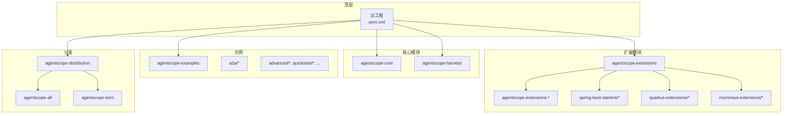
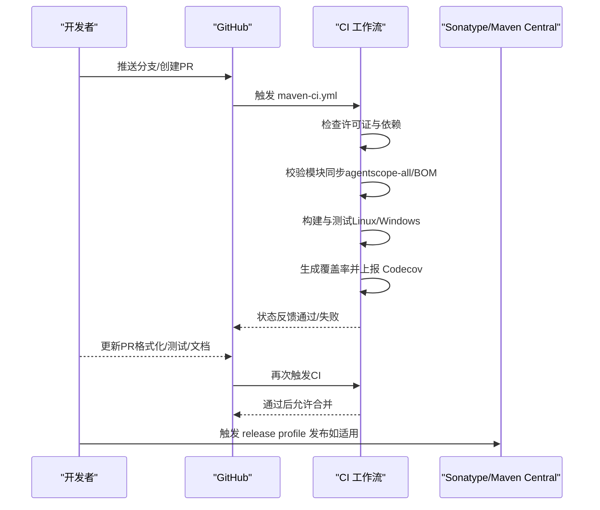
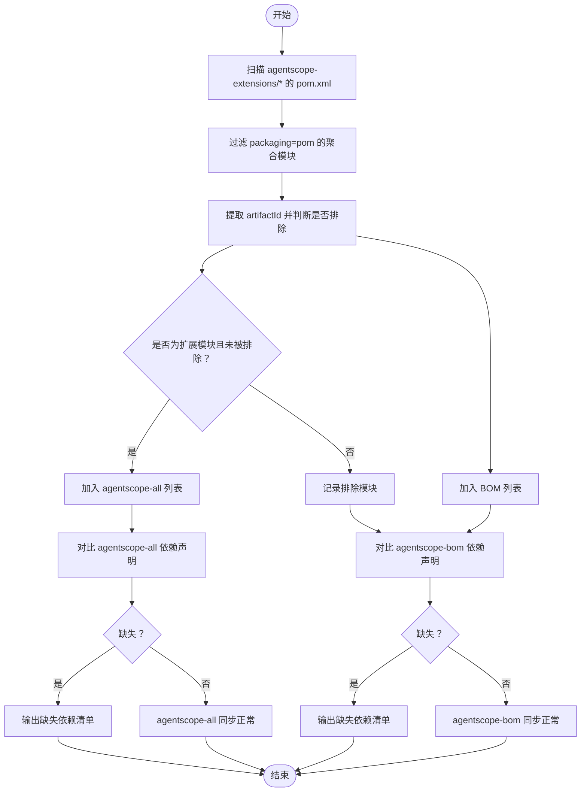

# 贡献与开发

<cite>
**本文引用的文件**   
- [CONTRIBUTING.md](file://CONTRIBUTING.md)
- [CONTRIBUTING_zh.md](file://CONTRIBUTING_zh.md)
- [README.md](file://README.md)
- [pom.xml](file://pom.xml)
- [.github/PULL_REQUEST_TEMPLATE.md](file://.github/PULL_REQUEST_TEMPLATE.md)
- [.github/workflows/maven-ci.yml](file://.github/workflows/maven-ci.yml)
- [.github/workflows/close-stale-prs.yml](file://.github/workflows/close-stale-prs.yml)
- [.github/workflows/website.yml](file://.github/workflows/website.yml)
- [.github/dependabot.yaml](file://.github/dependabot.yaml)
- [.github/scripts/check-shade-and-bom-sync.sh](file://.github/scripts/check-shade-and-bom-sync.sh)
- [.licenserc.yaml](file://.licenserc.yaml)
- [codecov.yml](file://codecov.yml)
</cite>

## 目录
1. [简介](#简介)
2. [项目结构](#项目结构)
3. [核心组件](#核心组件)
4. [架构总览](#架构总览)
5. [详细组件分析](#详细组件分析)
6. [依赖分析](#依赖分析)
7. [性能考虑](#性能考虑)
8. [故障排查指南](#故障排查指南)
9. [结论](#结论)
10. [附录](#附录)

## 简介
本指南面向 AgentScope Java 的贡献者与开发者，覆盖从开发环境搭建、IDE 配置、依赖安装，到代码规范、提交规范、分支管理、Pull Request 流程、代码审查标准、测试与覆盖率、文档更新、发布流程、Issue 分类与处理、以及 CI/CD 工具链与常见问题等全链路实践。目标是帮助新贡献者快速上手，同时为长期贡献者提供清晰、可执行的操作手册。

## 项目结构
仓库采用多模块 Maven 结构，顶层父工程统一版本与插件配置，核心模块包括：
- agentscope-core：框架核心能力（代理、消息、模型、工具、记忆、流水线、RAG、会话、可观测性等）
- agentscope-extensions：扩展模块集合（Spring Boot Starter、Quarkus/Micronaut 扩展、各类外部系统集成等）
- agentscope-examples：示例与演示应用（含端到端示例、多代理协作、RAG、会话存储、沙箱等）
- agentscope-harness：测试夹具与集成测试支撑
- agentscope-dependencies-bom：依赖版本管理
- agentscope-distribution：打包分发（agentscope-all、agentscope-bom）

图表来源
- [pom.xml](file://pom.xml)
- [agentscope-examples/pom.xml](file://agentscope-examples/pom.xml)
- [agentscope-extensions/pom.xml](file://agentscope-extensions/pom.xml)
- [agentscope-distribution/pom.xml](file://agentscope-distribution/pom.xml)

章节来源
- [pom.xml](file://pom.xml)

## 核心组件
- 版本与构建：统一使用 Maven，JDK 17+，通过父工程集中管理插件与属性；支持 release profile 发布至 Sonatype。
- 代码风格：Spotless + Google Java Format（AOSP 风格），支持检查与自动修复。
- 测试与覆盖率：JUnit 5 + Mockito + Surefire；Jacoco 生成覆盖率报告；Codecov 上报。
- 文档与许可证：Javadoc 生成 API 文档；Apache 2.0 许可证头校验；网站部署工作流。
- 依赖同步：模块变更需同步至 agentscope-all（聚合到 Uber Jar）与 agentscope-bom（版本管理）。

章节来源
- [pom.xml](file://pom.xml)
- [.github/workflows/maven-ci.yml](file://.github/workflows/maven-ci.yml)
- [.licenserc.yaml](file://.licenserc.yaml)
- [.github/scripts/check-shade-and-bom-sync.sh](file://.github/scripts/check-shade-and-bom-sync.sh)

## 架构总览
下图展示从本地开发到 CI/CD 的典型流程：本地提交规范化的变更 → 推送 PR → 自动化检查（许可证、模块同步、构建测试、覆盖率）→ 合并与发布。

图表来源
- [.github/workflows/maven-ci.yml](file://.github/workflows/maven-ci.yml)
- [.github/scripts/check-shade-and-bom-sync.sh](file://.github/scripts/check-shade-and-bom-sync.sh)
- [pom.xml](file://pom.xml)

## 详细组件分析

### 开发环境与 IDE 配置
- JDK 与 Maven
  - 要求 JDK 17+，推荐使用 Maven Wrapper 或 mvnd 加速构建。
  - 建议在 IDE 中启用“编译参数”记录（-parameters），便于调试与反射使用。
- 代码风格
  - 使用 Spotless + Google Java Format（AOSP），建议 IDE 配置保存时自动格式化。
  - 常用命令：
    - 检查：mvn spotless:check
    - 应用修复：mvn spotless:apply
- 测试
  - 运行全部测试：mvn test
  - 运行指定类：mvn test -Dtest=YourTestClassName
  - 生成覆盖率报告：mvn verify
- 文档
  - 生成 Javadoc：mvn javadoc:javadoc 或 javadoc:jar（在 package 阶段）
- 许可证头
  - 通过 skywalking-eyes 校验源码许可证头，忽略示例与配置文件路径。

章节来源
- [pom.xml](file://pom.xml)
- [.licenserc.yaml](file://.licenserc.yaml)
- [.github/workflows/maven-ci.yml](file://.github/workflows/maven-ci.yml)

### 代码规范与提交规范
- 提交信息
  - 遵循 Conventional Commits，包含 type(scope): subject，支持自动生成变更日志。
  - 类型涵盖 feat、fix、docs、style、refactor、perf、ci、chore 等。
- 代码格式
  - Spotless 检查与自动修复；IDE 建议配置保存时格式化。
- 单元测试
  - 新功能必须配套测试；提交前确保现有测试通过；覆盖率报告用于质量门禁。
- 文档
  - 新功能需更新相关文档与示例；README 若涉及用户可见变更需同步更新。

章节来源
- [CONTRIBUTING.md](file://CONTRIBUTING.md)
- [CONTRIBUTING_zh.md](file://CONTRIBUTING_zh.md)
- [pom.xml](file://pom.xml)

### 分支管理策略
- 主分支保护：CI 严格校验，禁止直接推送主干。
- 功能分支：基于主干创建 feature/* 或 fix/* 分支，完成后发起 PR。
- PR 规范：使用 PR 模板，确保格式化、测试、文档齐全；通过 CI 后方可合并。
- 清理策略：长时间无响应的 PR 将被标记为 stale 并关闭（保留讨论价值）。

章节来源
- [.github/PULL_REQUEST_TEMPLATE.md](file://.github/PULL_REQUEST_TEMPLATE.md)
- [.github/workflows/close-stale-prs.yml](file://.github/workflows/close-stale-prs.yml)

### Pull Request 提交流程与审查标准
- PR 流程
  - 选择对应 Issue 或新建 Issue 讨论 → 创建分支 → 编写代码与测试 → 提交 PR → CI 自动检查 → 审查与修改 → 合并。
- 审查标准
  - 代码风格：通过 spotless 检查。
  - 测试：全部通过，新增功能具备单元测试。
  - 文档：API 注释完整，示例与 README 更新。
  - 兼容性：尽量保持向后兼容；破坏性变更需明确标注并在 PR 中说明。
  - 依赖：避免引入非必要依赖，保持核心库轻量化。
- 合并要求
  - CI 通过、至少一名维护者批准、无修改请求阻塞。

章节来源
- [CONTRIBUTING.md](file://CONTRIBUTING.md)
- [CONTRIBUTING_zh.md](file://CONTRIBUTING_zh.md)
- [.github/PULL_REQUEST_TEMPLATE.md](file://.github/PULL_REQUEST_TEMPLATE.md)

### 测试要求与覆盖率
- 测试执行
  - mvn test：运行全部测试。
  - mvn test -Dtest=...：运行指定类。
  - mvn verify：运行测试并生成覆盖率报告。
- 覆盖率
  - Jacoco 在 test 阶段生成报告；Linux 平台上传至 Codecov。
  - 项目设置目标覆盖率阈值，示例忽略示例模块。

章节来源
- [pom.xml](file://pom.xml)
- [.github/workflows/maven-ci.yml](file://.github/workflows/maven-ci.yml)
- [codecov.yml](file://codecov.yml)

### 文档更新与发布流程
- 文档更新
  - 新功能与 API 变更需补充 Javadoc 与示例；README 用户可见变更需同步更新。
- 发布流程
  - 通过 release profile 签名并发布至 Sonatype；随后由维护者推进至 Maven Central。
  - 仅发布核心构件，示例模块默认排除。

章节来源
- [pom.xml](file://pom.xml)
- [.github/workflows/website.yml](file://.github/workflows/website.yml)

### Issue 分类、标签与处理流程
- 分类与标签
  - good first issue：适合新手的入门任务。
  - help wanted：需要社区协助的任务。
  - wait-for-response：等待贡献者进一步信息的 PR/Issue。
  - stale：长时间无响应的 PR 将被自动标记并关闭。
- 处理流程
  - 新贡献者优先认领 good first issue；复杂任务建议先开 Issue 讨论。
  - 维护者负责分配、跟进与关闭；PR 合并后及时关闭关联 Issue。

章节来源
- [CONTRIBUTING.md](file://CONTRIBUTING.md)
- [CONTRIBUTING_zh.md](file://CONTRIBUTING_zh.md)
- [.github/workflows/close-stale-prs.yml](file://.github/workflows/close-stale-prs.yml)

### 开发工具链配置
- IDE 插件与设置
  - Spotless + Google Java Format：保存即格式化。
  - JUnit/Mockito：确保测试运行器可用。
  - Maven 插件：确保 IDE 能识别 maven-surefire-plugin、jacoco、javadoc、flatten 等。
- 静态分析与许可证
  - skywalking-eyes：校验许可证头与依赖许可证。
- 持续集成
  - GitHub Actions：maven-ci.yml 负责多平台构建、测试、覆盖率与模块同步检查；website.yml 负责文档站点部署。
  - Dependabot：定期扫描 Maven 依赖并创建 PR。

章节来源
- [.github/workflows/maven-ci.yml](file://.github/workflows/maven-ci.yml)
- [.github/workflows/website.yml](file://.github/workflows/website.yml)
- [.github/dependabot.yaml](file://.github/dependabot.yaml)
- [.licenserc.yaml](file://.licenserc.yaml)

### 新贡献者入门指导
- 准备工作
  - 安装 JDK 17+、Maven 或使用 mvnd；克隆仓库并导入 IDE。
- 第一次贡献
  - 查看 good first issue 列表，认领任务并在 Issue 下留言。
  - Fork 仓库，创建功能分支，按规范编写代码与测试。
  - 提交 PR，填写模板，等待 CI 与审查。
- 常见问题
  - CI 失败：优先解决许可证头、模块同步、格式化与测试问题。
  - 依赖冲突：检查 BOM 与依赖管理，避免重复引入。
  - 文档未更新：补充 Javadoc 与 README 示例。

章节来源
- [CONTRIBUTING.md](file://CONTRIBUTING.md)
- [CONTRIBUTING_zh.md](file://CONTRIBUTING_zh.md)
- [README.md](file://README.md)

## 依赖分析
- 依赖管理
  - 通过 agentscope-dependencies-bom 与 agentscope-bom 统一版本，避免冲突。
  - agentscope-all 聚合扩展模块（排除 starter/quarkus/micronaut 等框架特定模块）。
  - agentscope-bom 管理所有模块版本，确保一致性。
- CI 同步检查
  - 通过脚本扫描 agentscope-extensions 下的 jar 模块，确保声明存在于 agentscope-all 与 agentscope-bom。

图表来源
- [.github/scripts/check-shade-and-bom-sync.sh](file://.github/scripts/check-shade-and-bom-sync.sh)

章节来源
- [pom.xml](file://pom.xml)
- [.github/scripts/check-shade-and-bom-sync.sh](file://.github/scripts/check-shade-and-bom-sync.sh)

## 性能考虑
- 构建性能
  - 使用 mvnd（Maven Daemon）提升构建速度；缓存 Maven 仓库与 mvnd 配置。
  - Windows/Linux 双平台矩阵构建，确保跨平台稳定性。
- 测试性能
  - 单元测试为主，集成测试通过夹具与示例模块组织，避免长耗时场景。
- 运行时性能
  - 框架基于 Project Reactor 的响应式架构，结合 GraalVM 原生镜像以降低冷启动时间。

章节来源
- [.github/workflows/maven-ci.yml](file://.github/workflows/maven-ci.yml)
- [README.md](file://README.md)

## 故障排查指南
- Spotless 格式化失败
  - 使用 mvn spotless:apply 自动修复；确认 IDE 保存时格式化规则与项目一致。
- 单测失败
  - 使用 mvn test -Dtest=YourTestClassName 定位；结合 -DfailIfNoSpecifiedTests=false 快速验证。
- 覆盖率未达标
  - 检查 jacoco 配置与报告生成；确认示例模块被忽略符合预期。
- 许可证头校验失败
  - 使用 skywalking-eyes 检查；确认受支持文件类型与忽略路径配置正确。
- 模块未同步至 agentscope-all/BOM
  - 运行检查脚本，按输出补充依赖声明；注意框架特定模块的排除规则。

章节来源
- [.github/workflows/maven-ci.yml](file://.github/workflows/maven-ci.yml)
- [.licenserc.yaml](file://.licenserc.yaml)
- [.github/scripts/check-shade-and-bom-sync.sh](file://.github/scripts/check-shade-and-bom-sync.sh)
- [codecov.yml](file://codecov.yml)

## 结论
本指南提供了 AgentScope Java 的完整贡献与开发实践路径：从环境准备、规范遵循、PR 流程到 CI/CD 与发布。建议贡献者在提交前完成格式化、测试与文档更新，并通过 CI 校验；遇到问题优先参考本指南与相关脚本/配置文件定位原因。

## 附录
- 快速命令索引
  - 格式化：mvn spotless:check / mvn spotless:apply
  - 测试：mvn test / mvn test -Dtest=... / mvn verify
  - 文档：mvn javadoc:jar
  - 发布：mvn -P release verify deploy（在 release 分支或 tag）
- 关键文件清单
  - 父工程与插件：pom.xml
  - 贡献指南：CONTRIBUTING.md、CONTRIBUTING_zh.md
  - 许可证头配置：.licenserc.yaml
  - CI 工作流：maven-ci.yml、website.yml、close-stale-prs.yml
  - 依赖同步脚本：check-shade-and-bom-sync.sh
  - 依赖更新：dependabot.yaml
  - 覆盖率配置：codecov.yml