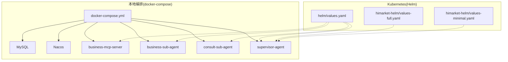
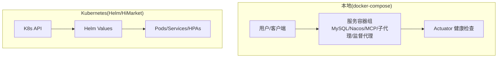
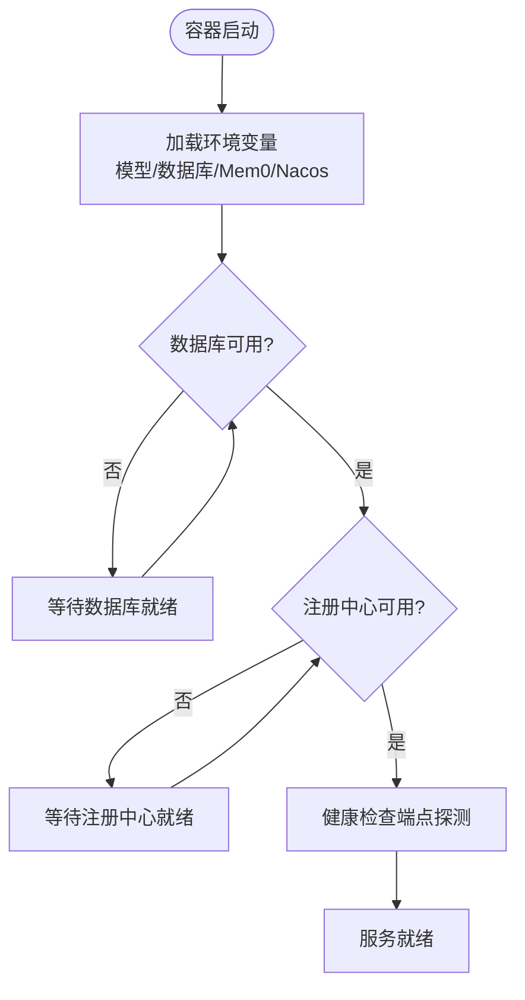
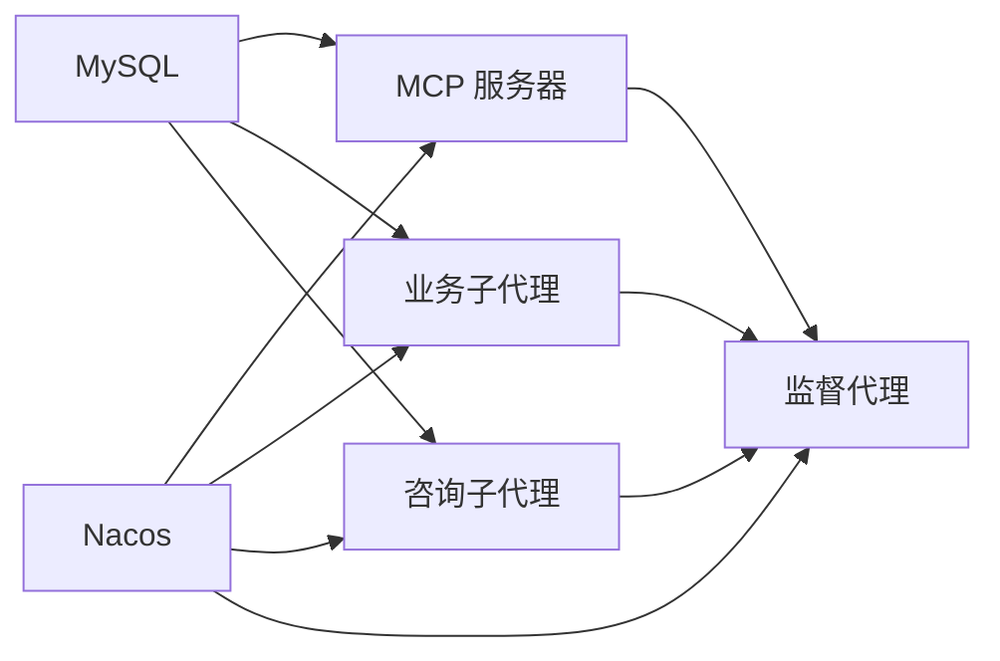

# 部署配置

<cite>
**本文引用的文件**
- [HIMARKET_DEPLOYMENT.md](file://agentscope-examples/boba-tea-shop/HIMARKET_DEPLOYMENT.md)
- [docker-compose.yml](file://agentscope-examples/boba-tea-shop/docker-compose.yml)
- [values.yaml](file://agentscope-examples/boba-tea-shop/helm/values.yaml)
- [values-full.yaml](file://agentscope-examples/boba-tea-shop/himarket-helm/values-full.yaml)
- [values-minimal.yaml](file://agentscope-examples/boba-tea-shop/himarket-helm/values-minimal.yaml)
- [business-mcp-server/Dockerfile](file://agentscope-examples/boba-tea-shop/business-mcp-server/Dockerfile)
- [business-sub-agent/Dockerfile](file://agentscope-examples/boba-tea-shop/business-sub-agent/Dockerfile)
- [consult-sub-agent/Dockerfile](file://agentscope-examples/boba-tea-shop/consult-sub-agent/Dockerfile)
- [supervisor-agent/Dockerfile](file://agentscope-examples/boba-tea-shop/supervisor-agent/Dockerfile)
- [build.sh](file://agentscope-examples/boba-tea-shop/build.sh)
</cite>

## 目录
1. [简介](#简介)
2. [项目结构](#项目结构)
3. [核心组件](#核心组件)
4. [架构总览](#架构总览)
5. [详细组件分析](#详细组件分析)
6. [依赖关系分析](#依赖关系分析)
7. [性能与资源规划](#性能与资源规划)
8. [故障排查指南](#故障排查指南)
9. [结论](#结论)
10. [附录](#附录)

## 简介
本文件面向 AgentScope Java 部署场景，系统化梳理“茶店”演示样例中的多智能体服务在本地 Docker Compose 与 Kubernetes(Helm/HiMarket) 两种部署形态下的配置要点，重点覆盖以下方面：
- 业务 MCP 服务器、业务子代理、咨询子代理、监督代理的部署策略与启动顺序
- 容器资源配置（CPU、内存限制与请求）、健康检查与就绪探针
- 环境变量、卷挂载与持久化存储
- 副本数、滚动更新策略与资源约束
- 不同部署场景的配置示例与最佳实践

## 项目结构
围绕“茶店”示例，部署相关的关键目录与文件如下：
- 本地编排：docker-compose.yml 定义基础设施与业务服务的镜像、端口、环境变量、健康检查与依赖关系
- Helm 配置：helm/values.yaml 提供全局镜像、数据库、注册中心、模型与DashScope等参数；himarket-helm/values-full.yaml 与 values-minimal.yaml 分别给出生产与开发场景的完整/最小化配置
- 容器镜像：各服务的 Dockerfile 统一基于 eclipse-temurin:17-jre，暴露应用端口，内置健康检查，使用非 root 用户运行
- 构建脚本：根目录 build.sh 支持按模块选择构建、版本标签、平台、推送等

图表来源
- [docker-compose.yml:19-255](file://agentscope-examples/boba-tea-shop/docker-compose.yml#L19-L255)
- [values.yaml:18-115](file://agentscope-examples/boba-tea-shop/helm/values.yaml#L18-L115)
- [values-full.yaml:15-106](file://agentscope-examples/boba-tea-shop/himarket-helm/values-full.yaml#L15-L106)
- [values-minimal.yaml:15-68](file://agentscope-examples/boba-tea-shop/himarket-helm/values-minimal.yaml#L15-L68)

章节来源
- [docker-compose.yml:19-255](file://agentscope-examples/boba-tea-shop/docker-compose.yml#L19-L255)
- [values.yaml:18-115](file://agentscope-examples/boba-tea-shop/helm/values.yaml#L18-L115)
- [values-full.yaml:15-106](file://agentscope-examples/boba-tea-shop/himarket-helm/values-full.yaml#L15-L106)
- [values-minimal.yaml:15-68](file://agentscope-examples/boba-tea-shop/himarket-helm/values-minimal.yaml#L15-L68)

## 核心组件
- 业务 MCP 服务器：提供工具能力，注册到 Nacos，供其他智能体调用
- 业务子代理：执行具体业务任务，依赖模型服务与知识库
- 咨询子代理：负责问答与检索增强，依赖数据库与模型
- 监督代理：协调多个子代理，提供前端静态资源与统一入口
- 基础设施：MySQL 数据库存储、Nacos 注册中心

章节来源
- [docker-compose.yml:79-239](file://agentscope-examples/boba-tea-shop/docker-compose.yml#L79-L239)
- [business-mcp-server/Dockerfile:15-62](file://agentscope-examples/boba-tea-shop/business-mcp-server/Dockerfile#L15-L62)
- [business-sub-agent/Dockerfile:15-55](file://agentscope-examples/boba-tea-shop/business-sub-agent/Dockerfile#L15-L55)
- [consult-sub-agent/Dockerfile:15-61](file://agentscope-examples/boba-tea-shop/consult-sub-agent/Dockerfile#L15-L61)
- [supervisor-agent/Dockerfile:15-82](file://agentscope-examples/boba-tea-shop/supervisor-agent/Dockerfile#L15-L82)

## 架构总览
下图展示本地与云原生两种部署形态的交互关系与数据流。

图表来源
- [docker-compose.yml:19-255](file://agentscope-examples/boba-tea-shop/docker-compose.yml#L19-L255)
- [values.yaml:18-115](file://agentscope-examples/boba-tea-shop/helm/values.yaml#L18-L115)
- [values-full.yaml:15-106](file://agentscope-examples/boba-tea-shop/himarket-helm/values-full.yaml#L15-L106)
- [values-minimal.yaml:15-68](file://agentscope-examples/boba-tea-shop/himarket-helm/values-minimal.yaml#L15-L68)

## 详细组件分析

### 业务 MCP 服务器
- 镜像与端口：暴露固定端口，容器内监听该端口
- 环境变量：包含模型提供商、API Key、模型名称、数据库连接、Mem0、Nacos 地址与命名空间等
- 健康检查：通过 Actuator 健康端点探测
- 依赖关系：需等待数据库与注册中心健康后启动

图表来源
- [docker-compose.yml:79-117](file://agentscope-examples/boba-tea-shop/docker-compose.yml#L79-L117)
- [business-mcp-server/Dockerfile:44-58](file://agentscope-examples/boba-tea-shop/business-mcp-server/Dockerfile#L44-L58)

章节来源
- [docker-compose.yml:79-117](file://agentscope-examples/boba-tea-shop/docker-compose.yml#L79-L117)
- [business-mcp-server/Dockerfile:15-62](file://agentscope-examples/boba-tea-shop/business-mcp-server/Dockerfile#L15-L62)

### 业务子代理
- 镜像与端口：暴露固定端口，容器内监听该端口
- 环境变量：模型、数据库、Mem0、Nacos 等
- 健康检查：通过 Actuator 健康端点探测
- 启动顺序：依赖数据库与注册中心健康

章节来源
- [docker-compose.yml:157-195](file://agentscope-examples/boba-tea-shop/docker-compose.yml#L157-L195)
- [business-sub-agent/Dockerfile:15-55](file://agentscope-examples/boba-tea-shop/business-sub-agent/Dockerfile#L15-L55)

### 咨询子代理
- 镜像与端口：暴露固定端口，容器内监听该端口
- 环境变量：模型、数据库、Mem0、Nacos 等
- 健康检查：通过 Actuator 健康端点探测
- 启动顺序：依赖数据库与注册中心健康

章节来源
- [docker-compose.yml:118-156](file://agentscope-examples/boba-tea-shop/docker-compose.yml#L118-L156)
- [consult-sub-agent/Dockerfile:15-61](file://agentscope-examples/boba-tea-shop/consult-sub-agent/Dockerfile#L15-L61)

### 监督代理（含前端）
- 镜像与端口：暴露固定端口，前端静态资源由后端直接提供
- 环境变量：数据库、Nacos、模型、调度开关与日志路径等
- 健康检查：通过 Actuator 健康端点探测
- 启动顺序：依赖数据库、注册中心以及 MCP/子代理已启动

章节来源
- [docker-compose.yml:196-239](file://agentscope-examples/boba-tea-shop/docker-compose.yml#L196-L239)
- [supervisor-agent/Dockerfile:15-82](file://agentscope-examples/boba-tea-shop/supervisor-agent/Dockerfile#L15-L82)

### 基础设施（数据库与注册中心）
- MySQL：定义端口映射、环境变量、卷与健康检查
- Nacos：定义端口映射、认证与健康检查

章节来源
- [docker-compose.yml:24-74](file://agentscope-examples/boba-tea-shop/docker-compose.yml#L24-L74)

## 依赖关系分析
- 服务间依赖：监督代理依赖 MCP 与两个子代理；子代理与 MCP 依赖数据库与注册中心
- 本地编排通过 depends_on 的条件控制启动顺序
- Kubernetes 中可通过 Pod 拓扑亲和、初始化容器、探针与启动延迟实现类似效果

图表来源
- [docker-compose.yml:109-237](file://agentscope-examples/boba-tea-shop/docker-compose.yml#L109-L237)

章节来源
- [docker-compose.yml:109-237](file://agentscope-examples/boba-tea-shop/docker-compose.yml#L109-L237)

## 性能与资源规划
- 资源配额建议（按服务类型）：
  - MCP 服务器：CPU 500m~1000m，内存 1Gi~2Gi
  - 子代理：CPU 250m~500m，内存 512Mi~1Gi
  - 监督代理：CPU 500m~1000m，内存 1Gi~2Gi
- 建议开启水平扩展（HPA），根据 CPU 使用率或自定义指标动态扩缩容
- 为数据库与注册中心预留足够资源，避免成为瓶颈
- 生产环境启用持久化卷与备份策略

[本节为通用指导，不直接分析具体文件]

## 故障排查指南
- 健康检查失败
  - 检查容器日志与 Actuator 健康端点
  - 确认数据库与注册中心连通性
  - 核对环境变量是否正确注入
- 启动顺序问题
  - 在 Kubernetes 中使用 Pod 启动延迟、探针与初始化容器
  - 在本地编排中调整 depends_on 条件
- 资源不足
  - 提升 requests/limits，优化 JVM 参数（堆大小）
  - 关闭不必要的功能（如调度、可观测性）

章节来源
- [business-mcp-server/Dockerfile:56-58](file://agentscope-examples/boba-tea-shop/business-mcp-server/Dockerfile#L56-L58)
- [business-sub-agent/Dockerfile:48-50](file://agentscope-examples/boba-tea-shop/business-sub-agent/Dockerfile#L48-L50)
- [consult-sub-agent/Dockerfile:54-56](file://agentscope-examples/boba-tea-shop/consult-sub-agent/Dockerfile#L54-L56)
- [supervisor-agent/Dockerfile:78-80](file://agentscope-examples/boba-tea-shop/supervisor-agent/Dockerfile#L78-L80)

## 结论
- 本地编排适合快速体验与开发联调，通过环境变量与健康检查即可满足基本需求
- Kubernetes 场景建议结合 Helm Values 进行集中管理，配合资源配额、HPA 与持久化策略实现稳定与弹性
- 不同服务的资源与副本应按职责与负载合理分配，确保整体系统的高可用与可维护性

[本节为总结性内容，不直接分析具体文件]

## 附录

### 本地 Docker Compose 部署要点
- 网络与卷
  - 使用自定义桥接网络隔离服务
  - MySQL 卷持久化数据
- 环境变量
  - 数据库：主机、端口、库名、用户名、密码
  - 模型：提供商、API Key、模型名称、基础地址
  - DashScope：访问密钥、工作空间、索引
  - Mem0：API Key
  - Nacos：地址、命名空间、注册开关
- 健康检查
  - 数据库与注册中心使用命令行工具探测端口
  - 应用服务使用 Actuator 健康端点探测

章节来源
- [docker-compose.yml:24-255](file://agentscope-examples/boba-tea-shop/docker-compose.yml#L24-L255)

### Kubernetes(Helm/HiMarket) 部署要点
- 全局配置
  - 镜像仓库、拉取策略、默认标签
  - 数据库、注册中心、模型与 DashScope 参数
- 服务开关
  - 启用/禁用监督代理、MCP、子代理
- 资源配额
  - 生产环境：CPU 与内存上限/请求更高
  - 开发环境：较小配额，便于本地调试
- 服务类型
  - 开发环境可使用 NodePort，生产环境使用 ClusterIP/LoadBalancer

章节来源
- [values.yaml:18-115](file://agentscope-examples/boba-tea-shop/helm/values.yaml#L18-L115)
- [values-full.yaml:97-105](file://agentscope-examples/boba-tea-shop/himarket-helm/values-full.yaml#L97-L105)
- [values-minimal.yaml:53-67](file://agentscope-examples/boba-tea-shop/himarket-helm/values-minimal.yaml#L53-L67)

### 镜像构建与发布
- 构建脚本支持按模块选择、版本标签、平台与推送
- 默认构建模块：监督代理（含前端）、业务 MCP 服务器、业务子代理、咨询子代理
- 可选模块：MySQL 镜像、Nacos 镜像

章节来源
- [build.sh:22-199](file://agentscope-examples/boba-tea-shop/build.sh#L22-L199)

### 部署场景与最佳实践
- 快速体验（开发/测试）
  - 使用最小化 Helm 配置，启用内置 MySQL，NodePort 暴露服务
  - 降低资源配额，简化探针与持久化
- 生产演示（全功能）
  - 使用完整 Helm 配置，启用内置 MySQL 与网关，配置管理员与开发者账户
  - 提升资源配额，启用持久化存储与备份
- 企业集成
  - 外部数据库与注册中心，关闭内置组件
  - 严格区分命名空间与权限，启用安全扫描与审计

章节来源
- [HIMARKET_DEPLOYMENT.md:18-63](file://agentscope-examples/boba-tea-shop/HIMARKET_DEPLOYMENT.md#L18-L63)
- [values-full.yaml:15-106](file://agentscope-examples/boba-tea-shop/himarket-helm/values-full.yaml#L15-L106)
- [values-minimal.yaml:15-68](file://agentscope-examples/boba-tea-shop/himarket-helm/values-minimal.yaml#L15-L68)