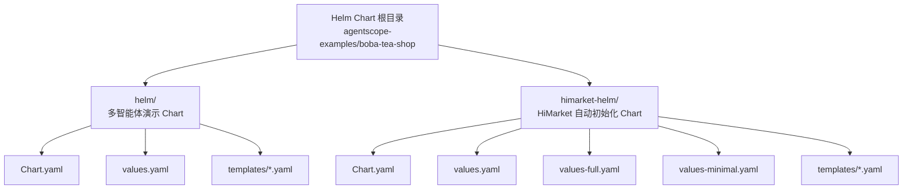
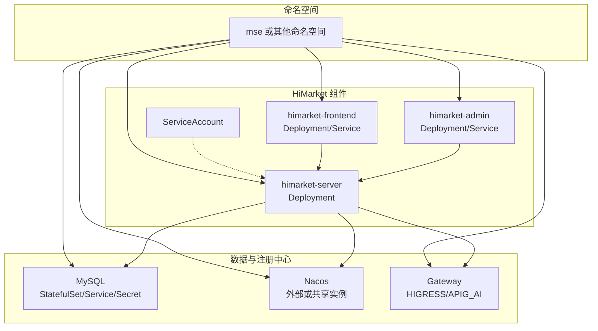
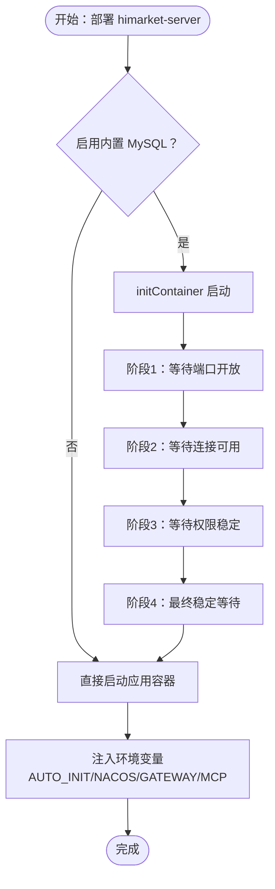
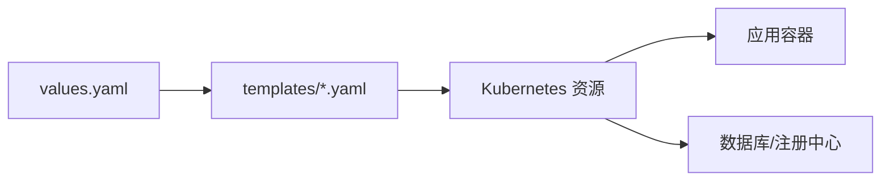

# Helm Charts 概述

<cite>
**本文引用的文件**
- [Chart.yaml](file://agentscope-examples/boba-tea-shop/helm/Chart.yaml)
- [values.yaml](file://agentscope-examples/boba-tea-shop/helm/values.yaml)
- [Chart.yaml](file://agentscope-examples/boba-tea-shop/himarket-helm/Chart.yaml)
- [values.yaml](file://agentscope-examples/boba-tea-shop/himarket-helm/values.yaml)
- [values-full.yaml](file://agentscope-examples/boba-tea-shop/himarket-helm/values-full.yaml)
- [values-minimal.yaml](file://agentscope-examples/boba-tea-shop/himarket-helm/values-minimal.yaml)
- [himarket-server-deployment.yaml](file://agentscope-examples/boba-tea-shop/himarket-helm/templates/himarket-server-deployment.yaml)
- [mysql.yaml](file://agentscope-examples/boba-tea-shop/himarket-helm/templates/mysql.yaml)
- [_helpers.tpl](file://agentscope-examples/boba-tea-shop/himarket-helm/templates/_helpers.tpl)
- [README.md](file://agentscope-examples/boba-tea-shop/README.md)
- [HIMARKET_DEPLOYMENT.md](file://agentscope-examples/boba-tea-shop/HIMARKET_DEPLOYMENT.md)
</cite>

## 目录
1. [简介](#简介)
2. [项目结构](#项目结构)
3. [核心组件](#核心组件)
4. [架构总览](#架构总览)
5. [详细组件分析](#详细组件分析)
6. [依赖关系分析](#依赖关系分析)
7. [性能考虑](#性能考虑)
8. [故障排查指南](#故障排查指南)
9. [结论](#结论)
10. [附录](#附录)

## 简介
本文件面向 AgentScope Java Helm Charts 的使用者与维护者，系统性阐述 Helm Chart 的基本概念、架构设计与配置要点，并结合仓库中的实际 Chart 文件（多智能体演示 Chart 与 HiMarket 自动初始化 Chart）进行深入解析。内容涵盖：
- Chart.yaml 的结构与字段说明
- values.yaml 的参数配置（全局、镜像、数据库、服务等）
- 不同配置文件（values.yaml、values-full.yaml、values-minimal.yaml）的差异与适用场景
- 安装、升级与卸载命令示例
- 版本管理、依赖管理与打包发布流程建议

## 项目结构
本仓库中与 Helm 相关的关键目录与文件如下：
- 多智能体演示 Chart：agentscope-examples/boba-tea-shop/helm
  - Chart.yaml
  - values.yaml
  - templates/*.yaml
- HiMarket 自动初始化 Chart：agentscope-examples/boba-tea-shop/himarket-helm
  - Chart.yaml
  - values.yaml
  - values-full.yaml
  - values-minimal.yaml
  - templates/*.yaml

**图表来源**
- [Chart.yaml:15-32](file://agentscope-examples/boba-tea-shop/helm/Chart.yaml#L15-L32)
- [Chart.yaml:15-32](file://agentscope-examples/boba-tea-shop/himarket-helm/Chart.yaml#L15-L32)

**章节来源**
- [Chart.yaml:15-32](file://agentscope-examples/boba-tea-shop/helm/Chart.yaml#L15-L32)
- [Chart.yaml:15-32](file://agentscope-examples/boba-tea-shop/himarket-helm/Chart.yaml#L15-L32)

## 核心组件
- 多智能体演示 Chart（agentscope-multi-agent）
  - 类型：application
  - 版本：1.0.0
  - 应用版本：1.0.0
  - 关键用途：一键部署多智能体演示系统，包含 Supervisor Agent、业务子 Agent、咨询子 Agent、MCP Server、前端、MySQL、Nacos 等组件
- HiMarket 自动初始化 Chart（himarket-auto-init）
  - 类型：application
  - 版本：1.0.0
  - 应用版本：latest
  - 关键用途：自动初始化并部署 HiMarket 服务器、前端、后台管理、可选内置 MySQL、Nacos 注册、网关对接、MCP 导入与发布等

**章节来源**
- [Chart.yaml:15-32](file://agentscope-examples/boba-tea-shop/helm/Chart.yaml#L15-L32)
- [Chart.yaml:15-32](file://agentscope-examples/boba-tea-shop/himarket-helm/Chart.yaml#L15-L32)

## 架构总览
下图展示了 HiMarket Chart 的典型部署拓扑与组件交互关系，突出“自动初始化”“内置 MySQL”“Nacos 注册”“网关对接”“MCP 导入/发布”等关键能力。

**图表来源**
- [himarket-server-deployment.yaml:15-249](file://agentscope-examples/boba-tea-shop/himarket-helm/templates/himarket-server-deployment.yaml#L15-L249)
- [mysql.yaml:15-228](file://agentscope-examples/boba-tea-shop/himarket-helm/templates/mysql.yaml#L15-L228)
- [_helpers.tpl:1-4](file://agentscope-examples/boba-tea-shop/himarket-helm/templates/_helpers.tpl#L1-L4)

## 详细组件分析

### 多智能体演示 Chart（agentscope-multi-agent）
- Chart 元数据
  - apiVersion: v2
  - name: agentscope-multi-agent
  - description: AgentScope multi-agent-demo Helm Chart
  - type: application
  - version: 1.0.0
  - appVersion: "1.0.0"
  - keywords: agentscope, multi-agent, ai, llm
  - maintainers: AgentScope Team
  - home: https://github.com/modelscope/agentscope
  - sources: https://github.com/modelscope/agentscope

- 关键配置项（values.yaml 节选）
  - 全局配置
    - global.namespace: 命名空间（默认 agentscope）
  - 镜像配置
    - image.registry: 镜像仓库地址
    - image.pullPolicy: 镜像拉取策略
    - image.tag: 默认镜像标签
  - 数据库配置（MySQL）
    - mysql.deployEnabled: 是否部署内置 MySQL
    - mysql.host: MySQL 服务主机名（K8s Service 名称）
    - mysql.dbname/username/password: 数据库、用户名、密码
  - Nacos 配置
    - nacos.deployEnabled: 是否部署内置 Nacos
    - nacos.serverAddr: Nacos 地址
    - nacos.namespace: 命名空间
    - nacos.registerEnabled: 是否启用注册
  - 模型配置（DashScope/OpenAI）
    - agentscope.model.provider: 提供商（dashscope/openai）
    - agentscope.model.apiKey: API Key（需保密）
    - agentscope.model.modelName: 模型名称
  - DashScope RAG 配置
    - dashscope.accessKeyId/secret: 访问凭证
    - dashscope.workspaceId/indexId: 工作区与知识库索引
  - Mem0 内存服务配置
    - mem0.apiKey: API Key
  - XXL-JOB 任务调度配置
    - xxlJob.enabled/admin/accessToken/appname: 开关与管理地址、令牌、应用名
  - 服务启停开关
    - services.supervisorAgent/businessMcpServer/businessSubAgent/consultSubAgent: 各组件启用/禁用

- 适用场景
  - 快速体验多智能体协作
  - 开发与测试环境
  - 生产环境可参考该 Chart 结构进行定制化

**章节来源**
- [Chart.yaml:15-32](file://agentscope-examples/boba-tea-shop/helm/Chart.yaml#L15-L32)
- [values.yaml:15-115](file://agentscope-examples/boba-tea-shop/helm/values.yaml#L15-L115)

### HiMarket 自动初始化 Chart（himarket-auto-init）
- Chart 元数据
  - apiVersion: v2
  - name: himarket-auto-init
  - description: HiMarket Server with Auto-Initialization - Out-of-the-box HiMarket deployment solution
  - type: application
  - version: 1.0.0
  - appVersion: "latest"
  - keywords: himarket, api-gateway, mcp, auto-init
  - maintainers: HiMarket Team
  - home: https://github.com/alibaba/higress
  - sources: https://github.com/alibaba/higress

- 关键配置项（values.yaml 节选）
  - 镜像拉取密钥
    - imagePullSecrets: 使用自定义镜像拉取密钥
  - 前端（开源默认镜像）
    - frontend.image.hub/repository/tag/pullPolicy
    - frontend.service.type/port
    - frontend.replicaCount/serverPort
  - 后台管理（开源默认镜像）
    - admin.image.hub/repository/tag/pullPolicy
    - admin.service.type/port
    - admin.replicaCount/serverPort
  - 服务器（自动初始化镜像）
    - server.image.hub/repository/tag/pullPolicy
    - server.service.type/port
    - server.replicaCount/serverPort
    - initContainer: 当启用内置 MySQL 时自动等待数据库就绪
  - ServiceAccount
    - serviceAccount.name: 服务账号名称
  - 资源限制
    - resources.limits/requests.cpu/memory
  - MySQL 配置
    - mysql.enabled: 是否启用内置 MySQL
    - mysql.image: 镜像仓库、仓库、标签、拉取策略
    - mysql.auth: 数据库、用户名、root 密码、用户密码（为空则自动生成）
    - mysql.service.external: 外部访问开关与类型
    - mysql.persistence: 存储类、容量、访问模式
    - mysql.resources: 资源请求与限制
    - mysql.replicaCount: 副本数
    - database: 外部数据库配置（当 mysql.enabled=false 时生效）
  - 自动初始化配置
    - autoInit.enabled/delay/frontendUrl/admin/developer/portal: 控制是否自动初始化及账户与门户信息
  - Nacos 配置
    - nacos.enabled/name/serverUrl
    - nacos.username/password 或 accessKey/secretKey
  - 网关配置
    - gateway.enabled/type/name
    - gateway.higress.url/username/password 或 gateway.apig.region/accessKey/secretKey
  - MCP 配置
    - mcp.importToNacos/publishToHimarket/jsonFile

- 不同配置文件对比
  - values.yaml：通用配置入口，覆盖基础部署所需参数
  - values-full.yaml：完整功能部署（含 Nacos、网关、MCP），适用于生产演示
  - values-minimal.yaml：最小化部署（仅服务器、前端、后台、内置 MySQL），适用于快速体验与开发

**章节来源**
- [Chart.yaml:15-32](file://agentscope-examples/boba-tea-shop/himarket-helm/Chart.yaml#L15-L32)
- [values.yaml:15-227](file://agentscope-examples/boba-tea-shop/himarket-helm/values.yaml#L15-L227)
- [values-full.yaml:15-106](file://agentscope-examples/boba-tea-shop/himarket-helm/values-full.yaml#L15-L106)
- [values-minimal.yaml:15-68](file://agentscope-examples/boba-tea-shop/himarket-helm/values-minimal.yaml#L15-L68)

### 模板与初始化流程（HiMarket）
- 服务账号与命名约定
  - 通过 _helpers.tpl 定义模板函数，统一服务账号名称
- 服务器部署（himarket-server）
  - 条件渲染：当启用内置 MySQL 时注入 initContainer
  - initContainer 逻辑：分阶段检测 MySQL 端口开放、连接可用、权限稳定，确保应用启动前数据库完全就绪
  - 环境变量：自动初始化、Nacos 注册、网关对接、MCP 导入/发布等
- MySQL 部署（mysql.yaml）
  - 条件渲染：仅在 mysql.enabled=true 时创建
  - 自动密码生成：若未提供 rootPassword/password，则随机生成
  - 初始化脚本：通过 ConfigMap 注入 SQL，确保用户可从任意主机连接并授予权限
  - Secret：存储数据库敏感信息，供应用容器读取
  - Headless Service：为 StatefulSet 提供稳定网络域
  - 可选外部 Service：按需暴露外网访问

**图表来源**
- [himarket-server-deployment.yaml:36-123](file://agentscope-examples/boba-tea-shop/himarket-helm/templates/himarket-server-deployment.yaml#L36-L123)

**章节来源**
- [_helpers.tpl:1-4](file://agentscope-examples/boba-tea-shop/himarket-helm/templates/_helpers.tpl#L1-L4)
- [himarket-server-deployment.yaml:15-249](file://agentscope-examples/boba-tea-shop/himarket-helm/templates/himarket-server-deployment.yaml#L15-L249)
- [mysql.yaml:15-228](file://agentscope-examples/boba-tea-shop/himarket-helm/templates/mysql.yaml#L15-L228)

## 依赖关系分析
- 多智能体演示 Chart
  - 依赖：Kubernetes 资源（Deployment/Service/ConfigMap/Secret 等）、可选内置 MySQL 与 Nacos
  - 通过 values.yaml 控制各组件启用/禁用与镜像版本
- HiMarket Chart
  - 依赖：Kubernetes 资源、可选内置 MySQL、外部或共享 Nacos、可选网关（HIGRESS/APIG_AI）
  - 通过 values.yaml 控制镜像、资源、数据库、自动初始化、Nacos 与网关行为

**图表来源**
- [values.yaml:15-227](file://agentscope-examples/boba-tea-shop/himarket-helm/values.yaml#L15-L227)
- [himarket-server-deployment.yaml:15-249](file://agentscope-examples/boba-tea-shop/himarket-helm/templates/himarket-server-deployment.yaml#L15-L249)
- [mysql.yaml:15-228](file://agentscope-examples/boba-tea-shop/himarket-helm/templates/mysql.yaml#L15-L228)

**章节来源**
- [values.yaml:15-227](file://agentscope-examples/boba-tea-shop/himarket-helm/values.yaml#L15-L227)
- [himarket-server-deployment.yaml:15-249](file://agentscope-examples/boba-tea-shop/himarket-helm/templates/himarket-server-deployment.yaml#L15-L249)
- [mysql.yaml:15-228](file://agentscope-examples/boba-tea-shop/himarket-helm/templates/mysql.yaml#L15-L228)

## 性能考虑
- 资源配额
  - 通过 values.yaml 中的 resources.limits/requests 控制 CPU 与内存，避免资源争抢
- 存储与持久化
  - MySQL 使用持久卷声明（PVC），建议选择高可靠存储类（如 aliyun-disk-essd）
- 并发与副本
  - 通过 replicaCount 调整副本数量，结合 HPA/HPA 策略实现弹性伸缩
- 网络与服务暴露
  - 建议根据环境选择 ClusterIP/LoadBalancer/NodePort，生产环境优先使用受控入口网关

## 故障排查指南
- 启动失败（数据库未就绪）
  - 现象：应用容器启动后立即退出或反复重启
  - 排查：检查 initContainer 日志，确认 MySQL 端口开放、连接可用、权限稳定
  - 处理：调整 mysql.auth 密码、确认内置 MySQL 正常运行、检查存储与资源配额
- 密钥与凭据问题
  - 现象：应用无法连接数据库或访问外部服务
  - 排查：核对 Secret 与 ConfigMap 内容；确认 values.yaml 中的密钥配置正确
- 网关与 Nacos 注册异常
  - 现象：服务发现失败或网关无法接入
  - 排查：确认 nacos.serverUrl 与 gateway.url 正确；验证认证信息与网络连通性
- 自动初始化失败
  - 现象：管理员/开发者账户未创建或门户未初始化
  - 排查：检查 autoInit.enabled 与 delay 设置；确认数据库已就绪

**章节来源**
- [himarket-server-deployment.yaml:36-123](file://agentscope-examples/boba-tea-shop/himarket-helm/templates/himarket-server-deployment.yaml#L36-L123)
- [mysql.yaml:15-228](file://agentscope-examples/boba-tea-shop/himarket-helm/templates/mysql.yaml#L15-L228)

## 结论
- 多智能体演示 Chart 与 HiMarket 自动初始化 Chart 分别面向“快速体验”与“开箱即用”的部署目标，两者均通过 values.yaml 实现参数化配置与模板渲染。
- HiMarket Chart 在“自动初始化”“内置 MySQL”“Nacos 注册”“网关对接”“MCP 导入/发布”等方面提供了完整的自动化能力，适合需要统一管理 Agent 与 MCP 的企业级场景。
- 建议在生产环境中结合 values-full.yaml 进行部署，并根据实际资源情况调整资源配额与存储策略。

## 附录

### 安装、升级与卸载命令示例
- 多智能体演示 Chart（agentscope-multi-agent）
  - 创建命名空间并安装
    - kubectl create namespace agentscope
    - helm install agentscope helm/ --namespace agentscope --values helm/values.yaml
- HiMarket Chart（himarket-auto-init）
  - 安装（默认 values.yaml）
    - kubectl create namespace mse
    - helm install agentscope helm/ --namespace mse
    - helm install himarket himarket-helm/ --namespace mse
  - 升级
    - helm upgrade himarket himarket-helm/ --namespace mse --values himarket-helm/values-full.yaml
  - 卸载
    - helm uninstall himarket --namespace mse
    - helm uninstall agentscope --namespace mse

**章节来源**
- [README.md:277-303](file://agentscope-examples/boba-tea-shop/README.md#L277-L303)
- [HIMARKET_DEPLOYMENT.md:47-63](file://agentscope-examples/boba-tea-shop/HIMARKET_DEPLOYMENT.md#L47-L63)

### 版本管理、依赖管理与打包发布流程
- 版本管理
  - Chart.yaml 中的 version/appVersion 用于标识 Chart 版本与应用版本，建议遵循语义化版本控制
- 依赖管理
  - 通过 Chart.yaml 的 dependencies 字段声明依赖（如需）
- 打包与发布
  - 打包：helm package <chart-path>
  - 发布：推送到 OCI 仓库或 Chart 仓库，配合 CI/CD 自动化发布

**章节来源**
- [Chart.yaml:15-32](file://agentscope-examples/boba-tea-shop/helm/Chart.yaml#L15-L32)
- [Chart.yaml:15-32](file://agentscope-examples/boba-tea-shop/himarket-helm/Chart.yaml#L15-L32)