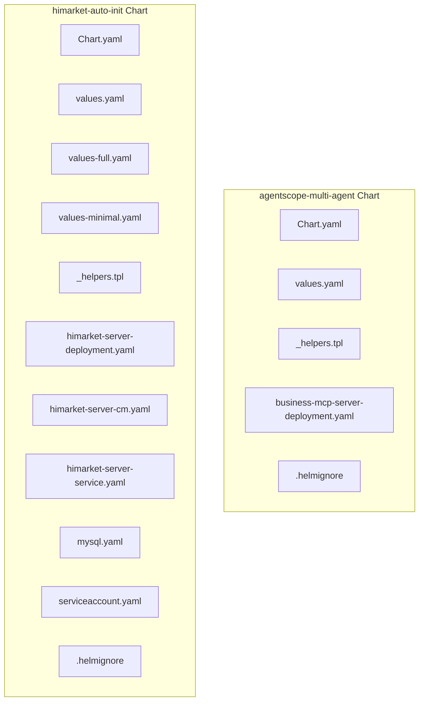
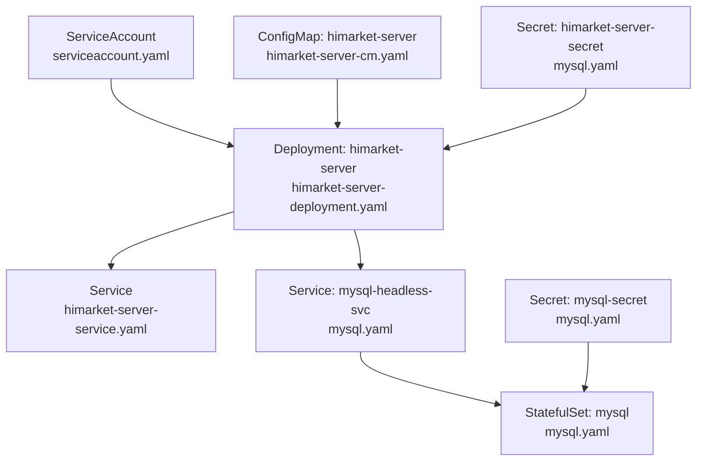
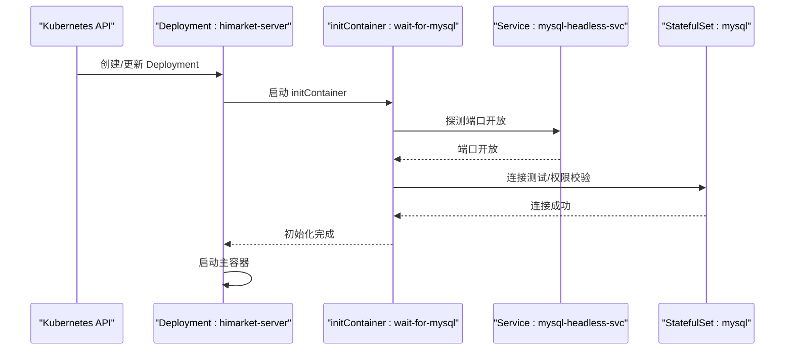
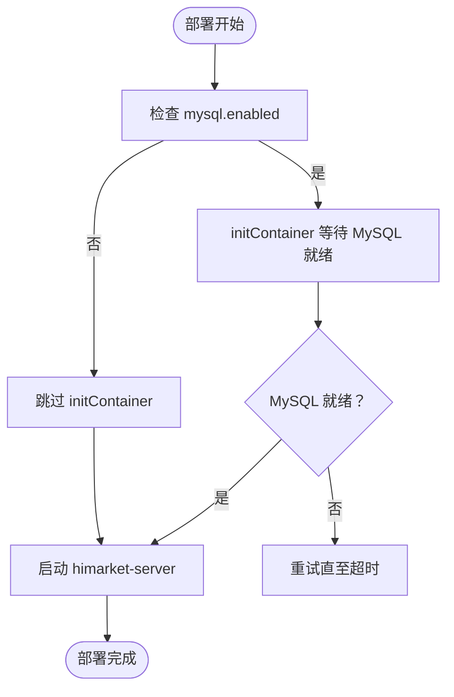

# Kubernetes 部署

<cite>
**本文引用的文件**
- [Chart.yaml](file://agentscope-examples/boba-tea-shop/helm/Chart.yaml)
- [values.yaml](file://agentscope-examples/boba-tea-shop/helm/values.yaml)
- [_helpers.tpl](file://agentscope-examples/boba-tea-shop/helm/templates/_helpers.tpl)
- [business-mcp-server-deployment.yaml](file://agentscope-examples/boba-tea-shop/helm/templates/business-mcp-server-deployment.yaml)
- [.helmignore](file://agentscope-examples/boba-tea-shop/helm/.helmignore)
- [Chart.yaml](file://agentscope-examples/boba-tea-shop/himarket-helm/Chart.yaml)
- [values.yaml](file://agentscope-examples/boba-tea-shop/himarket-helm/values.yaml)
- [values-full.yaml](file://agentscope-examples/boba-tea-shop/himarket-helm/values-full.yaml)
- [values-minimal.yaml](file://agentscope-examples/boba-tea-shop/himarket-helm/values-minimal.yaml)
- [_helpers.tpl](file://agentscope-examples/boba-tea-shop/himarket-helm/templates/_helpers.tpl)
- [himarket-server-deployment.yaml](file://agentscope-examples/boba-tea-shop/himarket-helm/templates/himarket-server-deployment.yaml)
- [himarket-server-cm.yaml](file://agentscope-examples/boba-tea-shop/himarket-helm/templates/himarket-server-cm.yaml)
- [himarket-server-service.yaml](file://agentscope-examples/boba-tea-shop/himarket-helm/templates/himarket-server-service.yaml)
- [mysql.yaml](file://agentscope-examples/boba-tea-shop/himarket-helm/templates/mysql.yaml)
- [serviceaccount.yaml](file://agentscope-examples/boba-tea-shop/himarket-helm/templates/serviceaccount.yaml)
- [.helmignore](file://agentscope-examples/boba-tea-shop/himarket-helm/.helmignore)
</cite>

## 目录
1. [简介](#简介)
2. [项目结构](#项目结构)
3. [核心组件](#核心组件)
4. [架构总览](#架构总览)
5. [详细组件分析](#详细组件分析)
6. [依赖关系分析](#依赖关系分析)
7. [性能与弹性](#性能与弹性)
8. [故障排查指南](#故障排查指南)
9. [结论](#结论)
10. [附录](#附录)

## 简介
本技术文档面向 AgentScope Java 在 Kubernetes 上的 Helm 部署，系统性解析 Helm Charts 的设计与实现，覆盖 Chart 结构、模板语法与值文件管理；深入说明 Deployment、Service、ConfigMap、Secret 的配置策略；阐述 Pod 调度、亲和性与反亲和性；提供水平与垂直自动扩缩容的配置思路；并给出集群资源管理、命名空间隔离与权限控制策略，以及滚动更新、蓝绿与金丝雀发布实践建议。

## 项目结构
本仓库包含两套 Helm Charts：
- 多智能体演示 Chart：agentscope-multi-agent，用于演示多子代理与 MCP 服务的编排。
- HiMarket 自动初始化 Chart：himarket-auto-init，提供前端、管理端、服务器、内置 MySQL、Nacos、网关与 MCP 的一键部署方案。

图表来源
- [Chart.yaml:15-32](file://agentscope-examples/boba-tea-shop/helm/Chart.yaml#L15-L32)
- [values.yaml:1-115](file://agentscope-examples/boba-tea-shop/helm/values.yaml#L1-L115)
- [_helpers.tpl:1-141](file://agentscope-examples/boba-tea-shop/helm/templates/_helpers.tpl#L1-L141)
- [business-mcp-server-deployment.yaml:15-66](file://agentscope-examples/boba-tea-shop/helm/templates/business-mcp-server-deployment.yaml#L15-L66)
- [.helmignore:1-30](file://agentscope-examples/boba-tea-shop/helm/.helmignore#L1-L30)
- [Chart.yaml:15-32](file://agentscope-examples/boba-tea-shop/himarket-helm/Chart.yaml#L15-L32)
- [values.yaml:1-227](file://agentscope-examples/boba-tea-shop/himarket-helm/values.yaml#L1-L227)
- [values-full.yaml:1-106](file://agentscope-examples/boba-tea-shop/himarket-helm/values-full.yaml#L1-L106)
- [values-minimal.yaml:1-68](file://agentscope-examples/boba-tea-shop/himarket-helm/values-minimal.yaml#L1-L68)
- [_helpers.tpl:1-4](file://agentscope-examples/boba-tea-shop/himarket-helm/templates/_helpers.tpl#L1-L4)
- [himarket-server-deployment.yaml:15-249](file://agentscope-examples/boba-tea-shop/himarket-helm/templates/himarket-server-deployment.yaml#L15-L249)
- [himarket-server-cm.yaml:15-33](file://agentscope-examples/boba-tea-shop/himarket-helm/templates/himarket-server-cm.yaml#L15-L33)
- [himarket-server-service.yaml:15-30](file://agentscope-examples/boba-tea-shop/himarket-helm/templates/himarket-server-service.yaml#L15-L30)
- [mysql.yaml:15-228](file://agentscope-examples/boba-tea-shop/himarket-helm/templates/mysql.yaml#L15-L228)
- [serviceaccount.yaml:15-19](file://agentscope-examples/boba-tea-shop/himarket-helm/templates/serviceaccount.yaml#L15-L19)
- [.helmignore:1-27](file://agentscope-examples/boba-tea-shop/himarket-helm/.helmignore#L1-L27)

章节来源
- [Chart.yaml:15-32](file://agentscope-examples/boba-tea-shop/helm/Chart.yaml#L15-L32)
- [Chart.yaml:15-32](file://agentscope-examples/boba-tea-shop/himarket-helm/Chart.yaml#L15-L32)

## 核心组件
- Helm Chart 元数据与版本：定义 Chart 名称、类型、版本与应用版本，便于统一管理与升级。
- 值文件（values.yaml）：集中管理镜像仓库、标签、数据库、注册中心、模型服务等全局参数，支持多环境差异化配置（如 full/minimal）。
- 模板函数与复用：通过 _helpers.tpl 定义标签、选择器、通用环境变量、等待依赖容器等可复用片段，降低重复与维护成本。
- 工作负载与网络：Deployment 负责副本与滚动更新策略；Service 提供稳定访问入口；StatefulSet 与 Headless Service 支持有状态数据库。
- 配置与密钥：ConfigMap 承载非敏感配置；Secret 承载敏感凭据；initContainer 确保依赖就绪后再启动主容器。
- 权限与调度：ServiceAccount 绑定最小权限；通过 nodeSelector、affinity、tolerations 控制调度与亲和性。

章节来源
- [values.yaml:17-227](file://agentscope-examples/boba-tea-shop/himarket-helm/values.yaml#L17-L227)
- [values-full.yaml:15-106](file://agentscope-examples/boba-tea-shop/himarket-helm/values-full.yaml#L15-L106)
- [values-minimal.yaml:15-68](file://agentscope-examples/boba-tea-shop/himarket-helm/values-minimal.yaml#L15-L68)
- [_helpers.tpl:1-4](file://agentscope-examples/boba-tea-shop/himarket-helm/templates/_helpers.tpl#L1-L4)
- [himarket-server-deployment.yaml:15-249](file://agentscope-examples/boba-tea-shop/himarket-helm/templates/himarket-server-deployment.yaml#L15-L249)
- [himarket-server-cm.yaml:15-33](file://agentscope-examples/boba-tea-shop/himarket-helm/templates/himarket-server-cm.yaml#L15-L33)
- [himarket-server-service.yaml:15-30](file://agentscope-examples/boba-tea-shop/himarket-helm/templates/himarket-server-service.yaml#L15-L30)
- [mysql.yaml:15-228](file://agentscope-examples/boba-tea-shop/himarket-helm/templates/mysql.yaml#L15-L228)
- [serviceaccount.yaml:15-19](file://agentscope-examples/boba-tea-shop/himarket-helm/templates/serviceaccount.yaml#L15-L19)

## 架构总览
下图展示 HiMarket Chart 的核心组件交互：服务器 Deployment 依赖内置 MySQL（StatefulSet + Headless Service），并通过 ConfigMap/Secret 注入配置；Service 暴露服务；initContainer 在启动前等待数据库就绪；可选地注册到 Nacos 并发布 MCP。

图表来源
- [serviceaccount.yaml:15-19](file://agentscope-examples/boba-tea-shop/himarket-helm/templates/serviceaccount.yaml#L15-L19)
- [himarket-server-service.yaml:15-30](file://agentscope-examples/boba-tea-shop/himarket-helm/templates/himarket-server-service.yaml#L15-L30)
- [himarket-server-deployment.yaml:15-249](file://agentscope-examples/boba-tea-shop/himarket-helm/templates/himarket-server-deployment.yaml#L15-L249)
- [himarket-server-cm.yaml:15-33](file://agentscope-examples/boba-tea-shop/himarket-helm/templates/himarket-server-cm.yaml#L15-L33)
- [mysql.yaml:15-228](file://agentscope-examples/boba-tea-shop/himarket-helm/templates/mysql.yaml#L15-L228)

## 详细组件分析

### Helm Charts 设计与模板语法
- Chart 元数据：定义名称、类型、版本与应用版本，便于版本追踪与升级。
- 模板语法：使用 Helm 模板语言进行条件渲染、循环与函数调用；通过 .Values 访问值文件，通过 .Release 获取发布上下文。
- 可复用片段：_helpers.tpl 中定义标签、选择器、通用环境变量、等待依赖容器等，提升一致性与可维护性。
- 忽略规则：.helmignore 控制打包时忽略的文件模式，避免无关文件进入 Chart 包。

章节来源
- [Chart.yaml:15-32](file://agentscope-examples/boba-tea-shop/himarket-helm/Chart.yaml#L15-L32)
- [_helpers.tpl:1-4](file://agentscope-examples/boba-tea-shop/himarket-helm/templates/_helpers.tpl#L1-L4)
- [.helmignore:1-27](file://agentscope-examples/boba-tea-shop/himarket-helm/.helmignore#L1-L27)

### 值文件管理与多环境配置
- 全局配置：命名空间、镜像仓库与标签、拉取策略等。
- 数据库配置：内置 MySQL 开关、镜像、认证、持久化与资源限制；或外部数据库地址与凭据。
- 服务开关：是否启用 Nacos、网关、MCP 等功能模块。
- 资源配额：CPU/内存请求与限制，按开发/生产/最小化场景分层。
- 多值文件：values.yaml 为基础，values-full.yaml 与 values-minimal.yaml 覆盖不同部署场景的关键差异。

章节来源
- [values.yaml:17-227](file://agentscope-examples/boba-tea-shop/himarket-helm/values.yaml#L17-L227)
- [values-full.yaml:15-106](file://agentscope-examples/boba-tea-shop/himarket-helm/values-full.yaml#L15-L106)
- [values-minimal.yaml:15-68](file://agentscope-examples/boba-tea-shop/himarket-helm/values-minimal.yaml#L15-L68)

### Deployment 配置策略
- 滚动更新：默认滚动更新，可配置最大并发与不可用比例；保留历史版本数量以支持回滚。
- 资源与探针：设置 CPU/内存请求与限制；可通过注释开启存活/就绪探针（当前注释掉以便简化）。
- 环境注入：通过 ConfigMap/Secret 注入非敏感与敏感配置；支持 initContainer 等待依赖服务。
- 调度与亲和性：通过 nodeSelector、affinity、tolerations 控制调度行为；可在 values 中扩展。

图表来源
- [himarket-server-deployment.yaml:36-123](file://agentscope-examples/boba-tea-shop/himarket-helm/templates/himarket-server-deployment.yaml#L36-L123)
- [mysql.yaml:103-131](file://agentscope-examples/boba-tea-shop/himarket-helm/templates/mysql.yaml#L103-L131)

章节来源
- [himarket-server-deployment.yaml:15-249](file://agentscope-examples/boba-tea-shop/himarket-helm/templates/himarket-server-deployment.yaml#L15-L249)

### Service、ConfigMap 与 Secret 配置
- Service：ClusterIP/LoadBalancer/NodePort 等类型，暴露服务器端口；Headless Service 用于 StatefulSet 稳定网络域。
- ConfigMap：存放非敏感配置（如服务器端口、数据库主机名等），通过 envFrom 注入。
- Secret：存放敏感配置（如数据库密码、访问密钥等），通过 secretRef 注入；内置 MySQL 密钥与应用密钥分离管理。

章节来源
- [himarket-server-service.yaml:15-30](file://agentscope-examples/boba-tea-shop/himarket-helm/templates/himarket-server-service.yaml#L15-L30)
- [himarket-server-cm.yaml:15-33](file://agentscope-examples/boba-tea-shop/himarket-helm/templates/himarket-server-cm.yaml#L15-L33)
- [mysql.yaml:73-101](file://agentscope-examples/boba-tea-shop/himarket-helm/templates/mysql.yaml#L73-L101)

### Pod 调度、亲和性与反亲和性
- 调度控制：通过 nodeSelector 将 Pod 固定到特定节点；通过 affinity/anti-affinity 将相关工作负载分散或聚集。
- 容忍性：通过 tolerations 允许在带污点节点上运行，增强可用性。
- 实践建议：将数据库与应用置于不同节点池，避免单点故障；对高可用服务使用 Pod 反亲和确保副本分散。

章节来源
- [himarket-server-deployment.yaml:237-248](file://agentscope-examples/boba-tea-shop/himarket-helm/templates/himarket-server-deployment.yaml#L237-L248)

### 水平与垂直自动扩缩容（HPA/VPA）
- 水平自动扩缩容（HPA）：基于 CPU/内存利用率或自定义指标动态调整副本数；建议在 values 中新增 HPA 资源定义，并根据业务流量特征设置阈值。
- 垂直自动扩缩容（VPA）：自动调整 Pod 的 CPU/内存请求与限制；适用于资源波动较大的场景，需结合监控与成本控制策略。
- 注意事项：HPA/VPA 与手动副本数存在冲突，应统一由自动扩缩容策略管理。

[本节为通用实践指导，不直接分析具体文件]

### 集群资源管理、命名空间隔离与权限控制
- 命名空间：通过 values.global.namespace 或 Release Namespace 隔离不同环境（开发/测试/生产）。
- 权限控制：使用 ServiceAccount 与 RBAC 最小授权原则；将应用与数据库、注册中心等服务解耦，避免过度权限。
- 资源配额：在 values 中为各组件设置 requests/limits，防止资源争抢影响稳定性。

章节来源
- [serviceaccount.yaml:15-19](file://agentscope-examples/boba-tea-shop/himarket-helm/templates/serviceaccount.yaml#L15-L19)
- [values.yaml:18-31](file://agentscope-examples/boba-tea-shop/himarket-helm/values.yaml#L18-L31)

### 滚动更新、蓝绿与金丝雀发布
- 滚动更新：默认策略，适合大多数场景；可调整 maxSurge/maxUnavailable 控制变更速率。
- 蓝绿发布：通过两套完全独立的 Deployment/Service 切换流量，降低风险；需在 values 中准备两套配置并配合 Ingress/网关切换。
- 金丝雀发布：逐步将部分流量导入新版本，结合探针与指标观察稳定性；可借助网关或服务网格实现细粒度路由。

[本节为通用实践指导，不直接分析具体文件]

## 依赖关系分析
- 服务器依赖：内置 MySQL（StatefulSet + Headless Service）；可选 Nacos、网关与 MCP。
- 初始化链路：initContainer 等待数据库端口开放、连接成功与权限稳定后，再启动主容器。
- 配置链路：ConfigMap/Secret 通过 env/envFrom 注入；数据库凭据与应用配置分离，确保安全与可维护性。

图表来源
- [himarket-server-deployment.yaml:36-123](file://agentscope-examples/boba-tea-shop/himarket-helm/templates/himarket-server-deployment.yaml#L36-L123)
- [mysql.yaml:103-131](file://agentscope-examples/boba-tea-shop/himarket-helm/templates/mysql.yaml#L103-L131)

章节来源
- [himarket-server-deployment.yaml:15-249](file://agentscope-examples/boba-tea-shop/himarket-helm/templates/himarket-server-deployment.yaml#L15-L249)
- [mysql.yaml:15-228](file://agentscope-examples/boba-tea-shop/himarket-helm/templates/mysql.yaml#L15-L228)

## 性能与弹性
- 资源规划：为数据库与应用分别设置合理的 requests/limits，避免资源饥饿。
- 存储策略：内置 MySQL 使用持久化卷，合理设置容量与存储类型；生产环境建议使用高可靠存储类。
- 网络与延迟：Headless Service 保证稳定的 DNS 解析；Service 类型按访问方式选择（ClusterIP/LB/NodePort）。
- 弹性与可用性：通过副本数与亲和性策略提升可用性；结合 HPA/VPA 动态调整资源。

[本节提供通用性能建议，不直接分析具体文件]

## 故障排查指南
- 数据库未就绪：检查 initContainer 日志与 MySQL 探针；确认凭据正确与网络连通。
- 配置注入失败：核对 ConfigMap/Secret 名称与键；确认 env/envFrom 引用路径正确。
- 权限问题：检查 ServiceAccount 与 RBAC；确认 Secret 与 PVC 绑定正常。
- 升级异常：查看 Deployment 滚动更新状态与事件；必要时回滚至历史版本。

章节来源
- [himarket-server-deployment.yaml:210-228](file://agentscope-examples/boba-tea-shop/himarket-helm/templates/himarket-server-deployment.yaml#L210-L228)
- [mysql.yaml:177-205](file://agentscope-examples/boba-tea-shop/himarket-helm/templates/mysql.yaml#L177-L205)

## 结论
本 Helm Charts 将多智能体演示与 HiMarket 一体化部署方案标准化，通过值文件与模板实现高度可配置与可维护。建议在生产环境中结合 HPA/VPA、蓝绿/金丝雀发布与严格的权限控制，持续优化资源利用与交付质量。

## 附录
- 多环境值文件：values.yaml（基础）、values-full.yaml（生产全量）、values-minimal.yaml（开发体验）。
- 关键模板：_helpers.tpl（标签/环境/等待逻辑）、Deployment/Service/ConfigMap/Secret/StatefulSet 等。
- 忽略规则：.helmignore 用于排除构建包中的无关文件。

章节来源
- [values.yaml:15-227](file://agentscope-examples/boba-tea-shop/himarket-helm/values.yaml#L15-L227)
- [values-full.yaml:15-106](file://agentscope-examples/boba-tea-shop/himarket-helm/values-full.yaml#L15-L106)
- [values-minimal.yaml:15-68](file://agentscope-examples/boba-tea-shop/himarket-helm/values-minimal.yaml#L15-L68)
- [_helpers.tpl:1-4](file://agentscope-examples/boba-tea-shop/himarket-helm/templates/_helpers.tpl#L1-L4)
- [himarket-server-deployment.yaml:15-249](file://agentscope-examples/boba-tea-shop/himarket-helm/templates/himarket-server-deployment.yaml#L15-L249)
- [himarket-server-cm.yaml:15-33](file://agentscope-examples/boba-tea-shop/himarket-helm/templates/himarket-server-cm.yaml#L15-L33)
- [himarket-server-service.yaml:15-30](file://agentscope-examples/boba-tea-shop/himarket-helm/templates/himarket-server-service.yaml#L15-L30)
- [mysql.yaml:15-228](file://agentscope-examples/boba-tea-shop/himarket-helm/templates/mysql.yaml#L15-L228)
- [serviceaccount.yaml:15-19](file://agentscope-examples/boba-tea-shop/himarket-helm/templates/serviceaccount.yaml#L15-L19)
- [.helmignore:1-27](file://agentscope-examples/boba-tea-shop/himarket-helm/.helmignore#L1-L27)