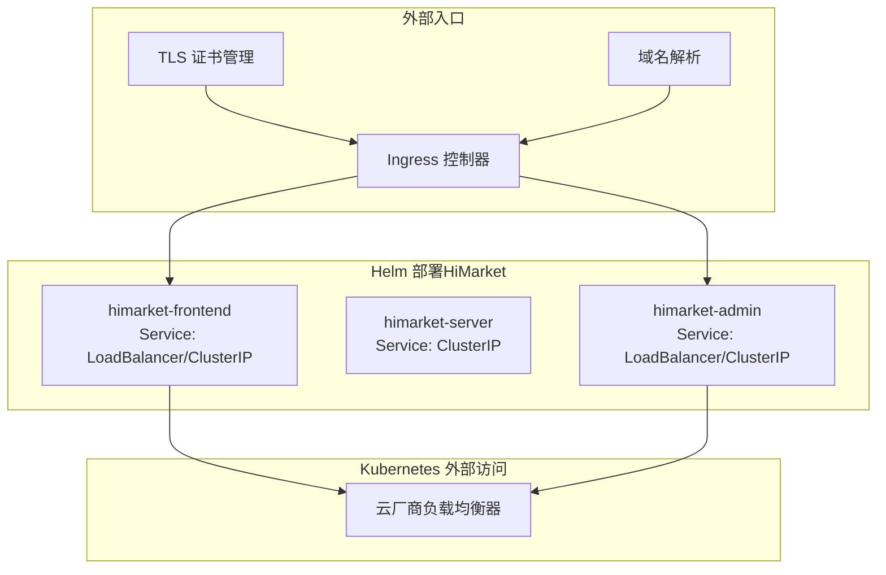
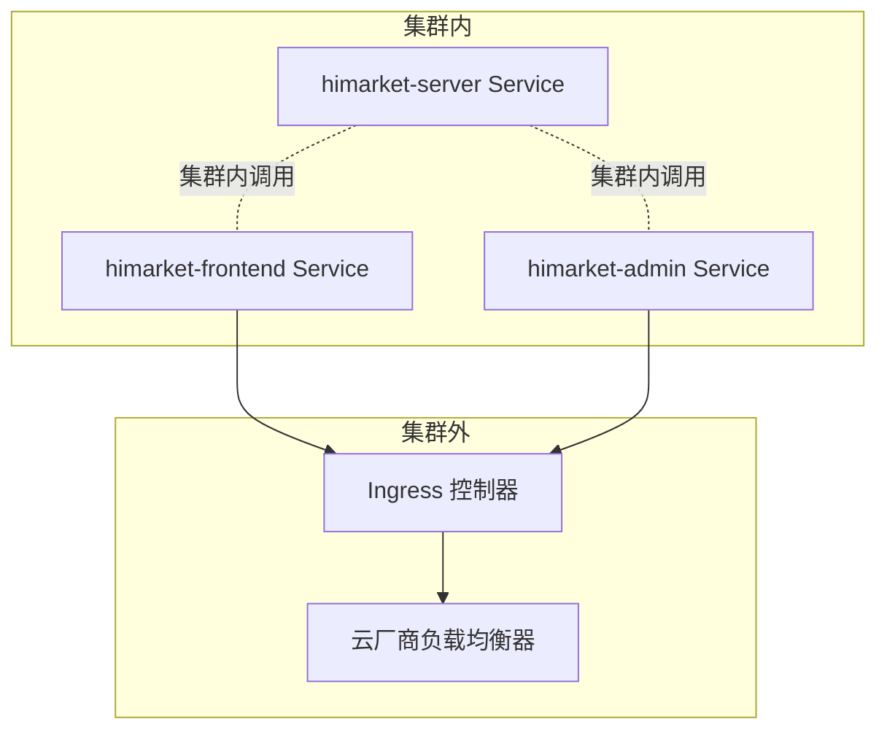
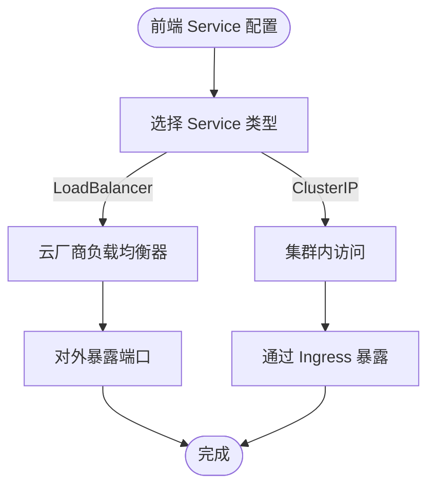
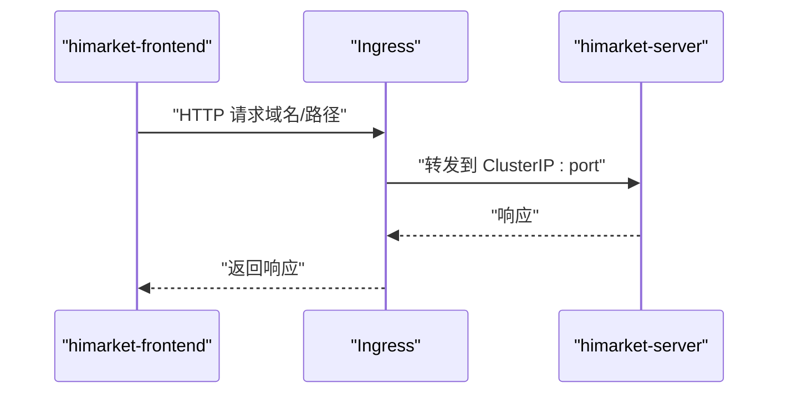
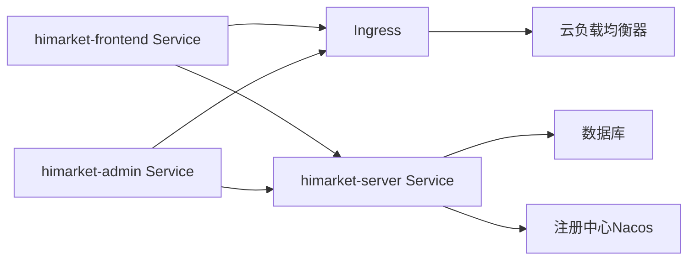

# Service 与网络配置

<cite>
**本文引用的文件**
- [Chart.yaml](file://agentscope-examples/boba-tea-shop/helm/Chart.yaml)
- [values.yaml](file://agentscope-examples/boba-tea-shop/helm/values.yaml)
- [Chart.yaml](file://agentscope-examples/boba-tea-shop/himarket-helm/Chart.yaml)
- [values.yaml](file://agentscope-examples/boba-tea-shop/himarket-helm/values.yaml)
- [himarket-frontend-service.yaml](file://agentscope-examples/boba-tea-shop/himarket-helm/templates/himarket-frontend-service.yaml)
- [himarket-server-service.yaml](file://agentscope-examples/boba-tea-shop/himarket-helm/templates/himarket-server-service.yaml)
- [himarket-admin-service.yaml](file://agentscope-examples/boba-tea-shop/himarket-helm/templates/himarket-admin-service.yaml)
- [docker-compose.yml](file://agentscope-examples/boba-tea-shop/docker-compose.yml)
</cite>

## 目录
1. [简介](#简介)
2. [项目结构](#项目结构)
3. [核心组件](#核心组件)
4. [架构总览](#架构总览)
5. [详细组件分析](#详细组件分析)
6. [依赖关系分析](#依赖关系分析)
7. [性能考虑](#性能考虑)
8. [故障排查指南](#故障排查指南)
9. [结论](#结论)
10. [附录](#附录)

## 简介
本文件聚焦于 AgentScope Java Service 的网络配置与服务发布实践，围绕以下主题展开：Kubernetes 中的 Service 配置（ClusterIP、NodePort、LoadBalancer）、端口映射与服务发现、负载均衡策略；Ingress 与 TLS 证书管理、域名解析设置；网络策略（NetworkPolicy）与安全组/防火墙建议；以及服务间通信的安全与访问控制策略。  
在仓库中，我们主要参考了两套部署方案：
- 基于 Helm 的多组件编排（含 HiMarket 前后端与服务器），明确展示了 Service 类型与端口映射。
- 基于 docker-compose 的本地开发环境，提供了端口映射与服务发现的参考。

## 项目结构
本项目的网络相关配置主要分布在 Helm Chart 与 docker-compose 两种方式中：
- Helm Chart（HiMarket 方案）：定义了前端、服务器、管理后台三类 Service，并通过 values.yaml 控制 Service 类型（ClusterIP/LoadBalancer）与端口。
- docker-compose（本地开发）：定义了业务服务的容器端口映射与内部网络，便于理解服务间通信与端口暴露。

图表来源
- [himarket-frontend-service.yaml:15-30](file://agentscope-examples/boba-tea-shop/himarket-helm/templates/himarket-frontend-service.yaml#L15-L30)
- [himarket-admin-service.yaml:15-30](file://agentscope-examples/boba-tea-shop/himarket-helm/templates/himarket-admin-service.yaml#L15-L30)
- [himarket-server-service.yaml:15-30](file://agentscope-examples/boba-tea-shop/himarket-helm/templates/himarket-server-service.yaml#L15-L30)
- [values.yaml:35-70](file://agentscope-examples/boba-tea-shop/himarket-helm/values.yaml#L35-L70)

章节来源
- [Chart.yaml:15-31](file://agentscope-examples/boba-tea-shop/himarket-helm/Chart.yaml#L15-L31)
- [values.yaml:35-70](file://agentscope-examples/boba-tea-shop/himarket-helm/values.yaml#L35-L70)

## 核心组件
- 前端服务（himarket-frontend）
  - Service 类型：由 values.yaml 控制，默认可配置为 LoadBalancer 或 ClusterIP。
  - 暴露端口：由 values.yaml 的 frontend.service.port 决定。
  - 典型用途：对外提供 Web 界面访问。
- 管理后台服务（himarket-admin）
  - Service 类型：由 values.yaml 控制，默认可配置为 LoadBalancer 或 ClusterIP。
  - 暴露端口：由 values.yaml 的 admin.service.port 决定。
  - 典型用途：提供管理界面或运维入口。
- 服务器服务（himarket-server）
  - Service 类型：默认为 ClusterIP，适合集群内访问。
  - 暴露端口：由 values.yaml 的 server.service.port 决定。
  - 典型用途：作为后端应用服务，供前端/管理后台调用。

章节来源
- [himarket-frontend-service.yaml:15-30](file://agentscope-examples/boba-tea-shop/himarket-helm/templates/himarket-frontend-service.yaml#L15-L30)
- [himarket-admin-service.yaml:15-30](file://agentscope-examples/boba-tea-shop/himarket-helm/templates/himarket-admin-service.yaml#L15-L30)
- [himarket-server-service.yaml:15-30](file://agentscope-examples/boba-tea-shop/himarket-helm/templates/himarket-server-service.yaml#L15-L30)
- [values.yaml:35-70](file://agentscope-examples/boba-tea-shop/himarket-helm/values.yaml#L35-L70)

## 架构总览
下图展示基于 Helm 的服务发布与外部访问路径，强调 Service 类型选择对访问方式的影响。

图表来源
- [himarket-frontend-service.yaml:15-30](file://agentscope-examples/boba-tea-shop/himarket-helm/templates/himarket-frontend-service.yaml#L15-L30)
- [himarket-admin-service.yaml:15-30](file://agentscope-examples/boba-tea-shop/himarket-helm/templates/himarket-admin-service.yaml#L15-L30)
- [himarket-server-service.yaml:15-30](file://agentscope-examples/boba-tea-shop/himarket-helm/templates/himarket-server-service.yaml#L15-L30)
- [values.yaml:35-70](file://agentscope-examples/boba-tea-shop/himarket-helm/values.yaml#L35-L70)

## 详细组件分析

### 组件一：前端服务（himarket-frontend）的 Service 配置
- Service 类型
  - 可选类型：LoadBalancer 或 ClusterIP，由 values.yaml 的 frontend.service.type 控制。
  - 若使用 LoadBalancer，将自动绑定云厂商负载均衡器，便于公网访问。
  - 若使用 ClusterIP，则仅限集群内访问，需通过 Ingress 暴露到公网。
- 端口映射
  - Service 暴露端口：frontend.service.port（如 80）。
  - Pod 目标端口：http（通常对应容器内的 Web 服务监听端口）。
- 适用场景
  - 对外公开的 Web 界面，支持公网直连或经 Ingress 转发。

图表来源
- [himarket-frontend-service.yaml:15-30](file://agentscope-examples/boba-tea-shop/himarket-helm/templates/himarket-frontend-service.yaml#L15-L30)
- [values.yaml:35-40](file://agentscope-examples/boba-tea-shop/himarket-helm/values.yaml#L35-L40)

章节来源
- [himarket-frontend-service.yaml:15-30](file://agentscope-examples/boba-tea-shop/himarket-helm/templates/himarket-frontend-service.yaml#L15-L30)
- [values.yaml:35-40](file://agentscope-examples/boba-tea-shop/himarket-helm/values.yaml#L35-L40)

### 组件二：服务器服务（himarket-server）的 Service 配置
- Service 类型
  - 默认为 ClusterIP，适合集群内调用，避免直接暴露到公网。
- 端口映射
  - Service 暴露端口：server.service.port（如 80）。
  - Pod 目标端口：http（容器内服务监听端口）。
- 适用场景
  - 作为后端服务被前端/管理后台调用，不直接面向公网。

图表来源
- [himarket-server-service.yaml:15-30](file://agentscope-examples/boba-tea-shop/himarket-helm/templates/himarket-server-service.yaml#L15-L30)
- [himarket-frontend-service.yaml:15-30](file://agentscope-examples/boba-tea-shop/himarket-helm/templates/himarket-frontend-service.yaml#L15-L30)
- [values.yaml:66-70](file://agentscope-examples/boba-tea-shop/himarket-helm/values.yaml#L66-L70)

章节来源
- [himarket-server-service.yaml:15-30](file://agentscope-examples/boba-tea-shop/himarket-helm/templates/himarket-server-service.yaml#L15-L30)
- [values.yaml:66-70](file://agentscope-examples/boba-tea-shop/himarket-helm/values.yaml#L66-L70)

### 组件三：管理后台服务（himarket-admin）的 Service 配置
- Service 类型
  - 可选类型：LoadBalancer 或 ClusterIP，由 values.yaml 的 admin.service.type 控制。
- 端口映射
  - Service 暴露端口：admin.service.port（如 80）。
  - Pod 目标端口：http。
- 适用场景
  - 对外公开的管理界面，可直连或经 Ingress 转发。

章节来源
- [himarket-admin-service.yaml:15-30](file://agentscope-examples/boba-tea-shop/himarket-helm/templates/himarket-admin-service.yaml#L15-L30)
- [values.yaml:44-54](file://agentscope-examples/boba-tea-shop/himarket-helm/values.yaml#L44-L54)

### 组件四：本地 docker-compose 环境中的端口映射与服务发现
- 端口映射
  - 各业务服务通过宿主机端口映射到容器内服务端口，便于本地调试与联调。
- 服务发现
  - 使用自定义 bridge 网络，容器通过服务名进行相互访问。
- 适用场景
  - 开发与测试阶段，快速验证服务间通信与端口配置。

章节来源
- [docker-compose.yml:24-255](file://agentscope-examples/boba-tea-shop/docker-compose.yml#L24-L255)

## 依赖关系分析
- Service 类型与外部访问的关系
  - LoadBalancer：适合需要公网直连的场景，云厂商会分配公网 IP。
  - ClusterIP：适合仅集群内访问，需配合 Ingress 暴露到公网。
- 服务间依赖
  - 前端/管理后台依赖服务器 Service 进行数据交互。
  - 服务器 Service 依赖数据库与注册中心（如 Nacos）进行配置与发现。

图表来源
- [himarket-frontend-service.yaml:15-30](file://agentscope-examples/boba-tea-shop/himarket-helm/templates/himarket-frontend-service.yaml#L15-L30)
- [himarket-admin-service.yaml:15-30](file://agentscope-examples/boba-tea-shop/himarket-helm/templates/himarket-admin-service.yaml#L15-L30)
- [himarket-server-service.yaml:15-30](file://agentscope-examples/boba-tea-shop/himarket-helm/templates/himarket-server-service.yaml#L15-L30)
- [docker-compose.yml:50-74](file://agentscope-examples/boba-tea-shop/docker-compose.yml#L50-L74)

## 性能考虑
- Service 类型选择
  - LoadBalancer：具备公网直连能力，但可能引入额外的网络延迟与成本；适合对外服务。
  - ClusterIP：减少公网暴露面，通过 Ingress 统一接入，利于集中优化与缓存。
- Ingress 层优化
  - 在 Ingress 层启用连接复用、压缩与缓存，降低后端压力。
  - 合理设置超时与重试策略，提升用户体验。
- 端口与资源
  - 为不同服务设置合理的资源请求与限制，避免资源争抢导致的抖动。

## 故障排查指南
- 无法从外部访问
  - 检查 Service 类型是否为 LoadBalancer；若为 ClusterIP，确认 Ingress 是否正确配置并已生效。
  - 核对云厂商安全组/防火墙是否放行相应端口。
- 访问缓慢或超时
  - 检查 Ingress 层的超时与重试配置。
  - 观察后端服务健康状态与资源使用情况。
- 服务间通信异常
  - 确认服务名与命名空间一致，DNS 解析正常。
  - 检查注册中心（如 Nacos）可用性与配置。

## 结论
- Service 类型应根据访问需求选择：对外服务优先考虑 LoadBalancer，内部服务采用 ClusterIP 并通过 Ingress 暴露。
- 端口映射与服务发现是保障通信稳定的关键，需在 Helm values 与容器编排中保持一致。
- 安全方面，建议通过 NetworkPolicy 限制入站流量，结合 Ingress/TLS 实现加密传输与访问控制。

## 附录
- Service 类型与典型用途对照
  - ClusterIP：仅集群内访问，适合后端服务。
  - NodePort：通过节点端口暴露，适合测试与临时场景。
  - LoadBalancer：自动分配公网 IP，适合生产对外服务。
- Ingress 与 TLS 建议
  - 使用 Ingress 管理域名与路由规则，结合证书管理组件（如 cert-manager）实现自动化 TLS 证书签发与续期。
  - 将证书存储在密钥库中，确保 Ingress 正确引用。
- 网络策略（NetworkPolicy）建议
  - 限制前端/管理后台到服务器的入站流量，仅允许必要的命名空间与端口。
  - 限制服务器对数据库与注册中心的出站流量，最小化暴露面。
- 安全组与防火墙
  - 仅开放对外必需的端口（如 80/443），关闭其他端口。
  - 对管理端口（如 8080）仅放行运维网段。