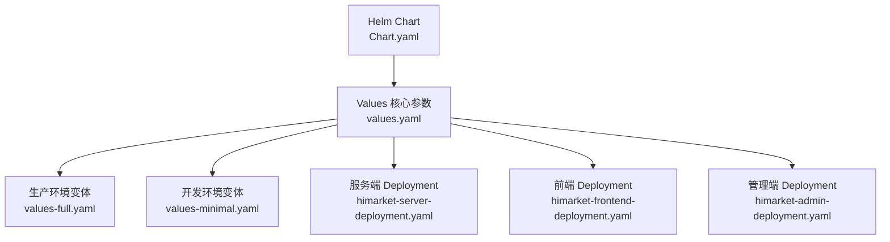
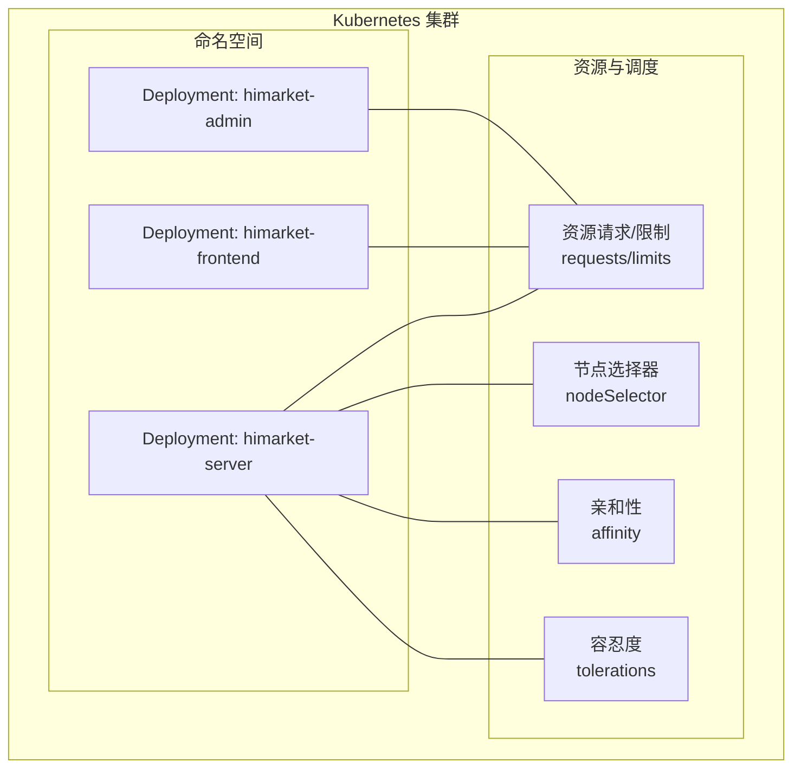
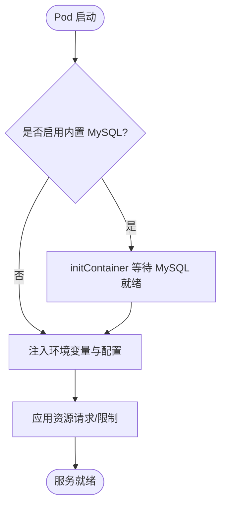
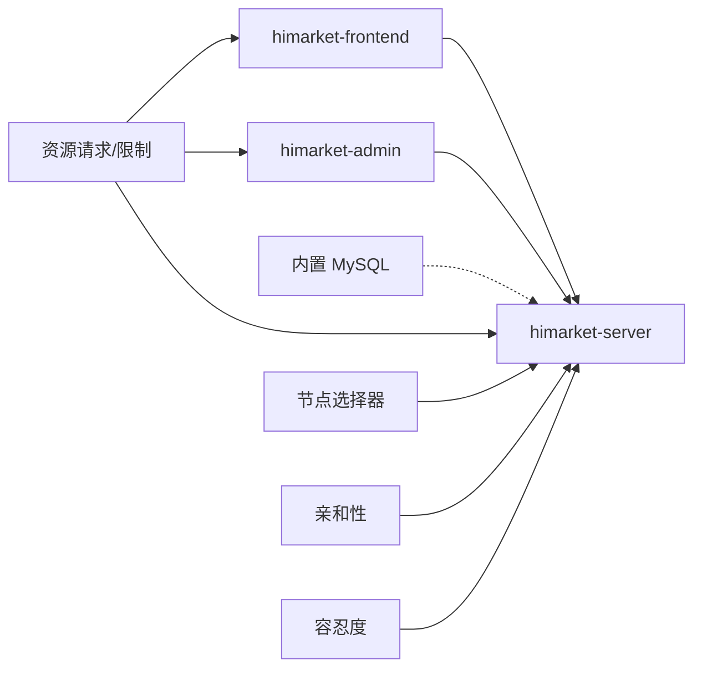

# 扩缩容策略

<cite>
**本文引用的文件**
- [Chart.yaml](file://agentscope-examples/boba-tea-shop/himarket-helm/Chart.yaml)
- [values.yaml](file://agentscope-examples/boba-tea-shop/himarket-helm/values.yaml)
- [values-full.yaml](file://agentscope-examples/boba-tea-shop/himarket-helm/values-full.yaml)
- [values-minimal.yaml](file://agentscope-examples/boba-tea-shop/himarket-helm/values-minimal.yaml)
- [himarket-server-deployment.yaml](file://agentscope-examples/boba-tea-shop/himarket-helm/templates/himarket-server-deployment.yaml)
- [himarket-frontend-deployment.yaml](file://agentscope-examples/boba-tea-shop/himarket-helm/templates/himarket-frontend-deployment.yaml)
- [himarket-admin-deployment.yaml](file://agentscope-examples/boba-tea-shop/himarket-helm/templates/himarket-admin-deployment.yaml)
</cite>

## 目录
1. [引言](#引言)
2. [项目结构](#项目结构)
3. [核心组件](#核心组件)
4. [架构总览](#架构总览)
5. [详细组件分析](#详细组件分析)
6. [依赖关系分析](#依赖关系分析)
7. [性能考虑](#性能考虑)
8. [故障排查指南](#故障排查指南)
9. [结论](#结论)
10. [附录](#附录)

## 引言
本文件面向 AgentScope Java 在 Kubernetes 环境中的扩缩容策略，结合仓库中提供的 Helm Chart 与 Deployment 模板，系统阐述以下主题：
- 基于副本数的水平扩缩容（HPA）策略：如何通过副本数与资源请求/限制配合实现弹性伸缩
- 垂直扩缩容（VPA）：在不改变副本数的前提下，对单实例容器的 CPU/内存进行动态调整
- 集群自动扩缩容（Cluster Autoscaler）：在节点资源不足时自动扩容节点，保障 Pod 调度
- 不同业务场景下的扩缩容策略选择与配置示例
- 性能优化与成本控制建议

需要特别说明的是：本仓库未包含 Kubernetes HPA、VPA 或 Cluster Autoscaler 的 YAML 定义文件；本文档基于现有 Helm 配置与 Deployment 模板，给出可落地的扩缩容实践建议与最佳实践。

## 项目结构
本项目围绕 HiMarket 全栈应用提供 Helm Chart，包含前端、管理端、服务端以及可选的数据库与注册中心等组件。扩缩容相关的关键位置如下：
- Helm Chart 元数据与版本信息
- values.yaml 及其多套变体（完整版、最小化）
- 各组件的 Deployment 模板（含资源请求/限制、亲和性、容忍度等）

图表来源
- [Chart.yaml:15-32](file://agentscope-examples/boba-tea-shop/himarket-helm/Chart.yaml#L15-L32)
- [values.yaml:85-91](file://agentscope-examples/boba-tea-shop/himarket-helm/values.yaml#L85-L91)
- [values-full.yaml:97-105](file://agentscope-examples/boba-tea-shop/himarket-helm/values-full.yaml#L97-L105)
- [values-minimal.yaml:53-67](file://agentscope-examples/boba-tea-shop/himarket-helm/values-minimal.yaml#L53-L67)
- [himarket-server-deployment.yaml:225-228](file://agentscope-examples/boba-tea-shop/himarket-helm/templates/himarket-server-deployment.yaml#L225-L228)
- [himarket-frontend-deployment.yaml:47-50](file://agentscope-examples/boba-tea-shop/himarket-helm/templates/himarket-frontend-deployment.yaml#L47-L50)
- [himarket-admin-deployment.yaml:47-50](file://agentscope-examples/boba-tea-shop/himarket-helm/templates/himarket-admin-deployment.yaml#L47-L50)

章节来源
- [Chart.yaml:15-32](file://agentscope-examples/boba-tea-shop/himarket-helm/Chart.yaml#L15-L32)
- [values.yaml:85-91](file://agentscope-examples/boba-tea-shop/himarket-helm/values.yaml#L85-L91)
- [values-full.yaml:97-105](file://agentscope-examples/boba-tea-shop/himarket-helm/values-full.yaml#L97-L105)
- [values-minimal.yaml:53-67](file://agentscope-examples/boba-tea-shop/himarket-helm/values-minimal.yaml#L53-L67)
- [himarket-server-deployment.yaml:225-228](file://agentscope-examples/boba-tea-shop/himarket-helm/templates/himarket-server-deployment.yaml#L225-L228)
- [himarket-frontend-deployment.yaml:47-50](file://agentscope-examples/boba-tea-shop/himarket-helm/templates/himarket-frontend-deployment.yaml#L47-L50)
- [himarket-admin-deployment.yaml:47-50](file://agentscope-examples/boba-tea-shop/himarket-helm/templates/himarket-admin-deployment.yaml#L47-L50)

## 核心组件
- 资源请求与限制（requests/limits）
  - 生产环境：CPU 限制 4000m，内存限制 4Gi；请求 CPU 1000m，内存 2Gi
  - 开发环境：CPU 限制 1000m，内存限制 1Gi；请求 CPU 250m，内存 512Mi
- 副本数（replicas）
  - 默认均为 1，可通过 values 中的 replicaCount 字段调整
- 节点调度与亲和性
  - Deployment 模板支持 nodeSelector、affinity、tolerations，便于将 Pod 调度到特定节点或具备亲和性的节点池

章节来源
- [values.yaml:85-91](file://agentscope-examples/boba-tea-shop/himarket-helm/values.yaml#L85-L91)
- [values-full.yaml:97-105](file://agentscope-examples/boba-tea-shop/himarket-helm/values-full.yaml#L97-L105)
- [values-minimal.yaml:53-67](file://agentscope-examples/boba-tea-shop/himarket-helm/values-minimal.yaml#L53-L67)
- [himarket-server-deployment.yaml:225-228](file://agentscope-examples/boba-tea-shop/himarket-helm/templates/himarket-server-deployment.yaml#L225-L228)
- [himarket-frontend-deployment.yaml:47-50](file://agentscope-examples/boba-tea-shop/himarket-helm/templates/himarket-frontend-deployment.yaml#L47-L50)
- [himarket-admin-deployment.yaml:47-50](file://agentscope-examples/boba-tea-shop/himarket-helm/templates/himarket-admin-deployment.yaml#L47-L50)

## 架构总览
下图展示各组件的部署关系与扩缩容相关配置入口：

图表来源
- [himarket-server-deployment.yaml:225-228](file://agentscope-examples/boba-tea-shop/himarket-helm/templates/himarket-server-deployment.yaml#L225-L228)
- [himarket-frontend-deployment.yaml:47-50](file://agentscope-examples/boba-tea-shop/himarket-helm/templates/himarket-frontend-deployment.yaml#L47-L50)
- [himarket-admin-deployment.yaml:47-50](file://agentscope-examples/boba-tea-shop/himarket-helm/templates/himarket-admin-deployment.yaml#L47-L50)

## 详细组件分析

### 服务端（himarket-server）扩缩容要点
- 副本数：由 values 中的 server.replicaCount 控制，默认为 1
- 资源配额：通过 resources.limits/requests 设置 CPU 与内存上限与预留
- 初始化容器：当启用内置 MySQL 时，会添加 initContainer 等待数据库就绪，避免启动阶段资源争用
- 环境变量：通过 ConfigMap 注入 AUTO_INIT、REGISTER_NACOS、REGISTER_GATEWAY、IMPORT_MCP_TO_NACOS 等开关，间接影响服务负载特性

图表来源
- [himarket-server-deployment.yaml:36-123](file://agentscope-examples/boba-tea-shop/himarket-helm/templates/himarket-server-deployment.yaml#L36-L123)
- [himarket-server-deployment.yaml:225-228](file://agentscope-examples/boba-tea-shop/himarket-helm/templates/himarket-server-deployment.yaml#L225-L228)

章节来源
- [himarket-server-deployment.yaml:22-123](file://agentscope-examples/boba-tea-shop/himarket-helm/templates/himarket-server-deployment.yaml#L22-L123)
- [himarket-server-deployment.yaml:225-228](file://agentscope-examples/boba-tea-shop/himarket-helm/templates/himarket-server-deployment.yaml#L225-L228)

### 前端与管理端（himarket-frontend / himarket-admin）扩缩容要点
- 副本数：frontend.replicaCount 与 admin.replicaCount 默认为 1
- 资源配额：resources.limits/requests 用于控制 CPU 与内存
- 环境变量：从 ConfigMap 注入运行所需配置

章节来源
- [himarket-frontend-deployment.yaml:22-71](file://agentscope-examples/boba-tea-shop/himarket-helm/templates/himarket-frontend-deployment.yaml#L22-L71)
- [himarket-admin-deployment.yaml:22-71](file://agentscope-examples/boba-tea-shop/himarket-helm/templates/himarket-admin-deployment.yaml#L22-L71)

### 值文件（values.yaml / values-full.yaml / values-minimal.yaml）与扩缩容的关系
- 资源请求/限制：决定 Pod 的最小可用资源与最大可使用资源，直接影响调度与扩缩容触发条件
- 副本数：决定水平扩展的上限与初始容量
- 节点调度：通过 nodeSelector、affinity、tolerations 影响 Pod 的调度范围与可用节点池

章节来源
- [values.yaml:85-91](file://agentscope-examples/boba-tea-shop/himarket-helm/values.yaml#L85-L91)
- [values-full.yaml:97-105](file://agentscope-examples/boba-tea-shop/himarket-helm/values-full.yaml#L97-L105)
- [values-minimal.yaml:53-67](file://agentscope-examples/boba-tea-shop/himarket-helm/values-minimal.yaml#L53-L67)

## 依赖关系分析
- 组件间依赖
  - 服务端依赖前端与管理端的访问路径与配置（通过 ConfigMap 注入）
  - 服务端可选地依赖内置 MySQL（initContainer 等待数据库就绪）
- 资源与调度依赖
  - 资源请求/限制决定调度器是否允许 Pod 被调度
  - 节点亲和性与容忍度决定可调度节点集合

图表来源
- [himarket-server-deployment.yaml:225-228](file://agentscope-examples/boba-tea-shop/himarket-helm/templates/himarket-server-deployment.yaml#L225-L228)
- [himarket-frontend-deployment.yaml:47-50](file://agentscope-examples/boba-tea-shop/himarket-helm/templates/himarket-frontend-deployment.yaml#L47-L50)
- [himarket-admin-deployment.yaml:47-50](file://agentscope-examples/boba-tea-shop/himarket-helm/templates/himarket-admin-deployment.yaml#L47-L50)

## 性能考虑
- 资源请求/限制设置
  - 过低会导致频繁的限流与重启；过高会降低节点利用率与调度灵活性
  - 建议以监控指标（如 CPU 使用率、内存占用）为依据，逐步调优
- 副本数与并发
  - 对无状态服务（前端、管理端），优先通过副本数横向扩展
  - 对有状态或强一致要求的服务，需评估锁竞争与共享资源瓶颈
- 调度与隔离
  - 使用亲和性/反亲和性将关键服务分散到不同节点或 AZ，提升可用性
  - 使用容忍度让关键服务在节点维护或污点场景下仍可调度
- 成本控制
  - 在非高峰时段降低副本数或使用 Spot 实例（需结合容忍度与弹性）
  - 合理设置资源上限，避免“幽灵资源”导致的资源浪费

## 故障排查指南
- 启动阶段卡住（initContainer 等待 MySQL）
  - 现象：Pod 处于 Pending 或 CrashLoopBackOff
  - 排查：检查内置 MySQL 是否正常、网络连通性、权限与初始化脚本
  - 参考路径：[initContainer 等待逻辑:36-123](file://agentscope-examples/boba-tea-shop/himarket-helm/templates/himarket-server-deployment.yaml#L36-L123)
- 调度失败
  - 现象：Pod 长期 Pending
  - 排查：检查节点资源、亲和性/反亲和性规则、容忍度、Taints
  - 参考路径：[调度相关字段:237-248](file://agentscope-examples/boba-tea-shop/himarket-helm/templates/himarket-server-deployment.yaml#L237-L248)
- 资源不足导致抖动
  - 现象：Pod 频繁 OOM 或 CPU throttling
  - 排查：核对 resources.limits/requests，结合监控指标调整
  - 参考路径：[资源声明:225-228](file://agentscope-examples/boba-tea-shop/himarket-helm/templates/himarket-server-deployment.yaml#L225-L228)

章节来源
- [himarket-server-deployment.yaml:36-123](file://agentscope-examples/boba-tea-shop/himarket-helm/templates/himarket-server-deployment.yaml#L36-L123)
- [himarket-server-deployment.yaml:237-248](file://agentscope-examples/boba-tea-shop/himarket-helm/templates/himarket-server-deployment.yaml#L237-L248)
- [himarket-server-deployment.yaml:225-228](file://agentscope-examples/boba-tea-shop/himarket-helm/templates/himarket-server-deployment.yaml#L225-L228)

## 结论
- 本仓库提供了完整的 Helm Chart 与 Deployment 模板，明确了资源请求/限制、副本数与调度策略的配置入口
- HPA/VPA/Cluster Autoscaler 的具体 YAML 并未包含在仓库中，但可基于现有配置进行扩展
- 建议以监控数据为依据，结合业务流量特征，制定分层扩缩容策略，并持续优化资源配额与副本数

## 附录

### HPA（基于副本数的水平扩缩容）配置建议
- 触发条件
  - CPU 使用率：例如平均 CPU 使用率超过 70%
  - 内存使用量：例如内存使用超过阈值（如 2Gi）
  - 自定义指标：如 QPS、错误率、队列长度等
- 关键参数
  - 最小/最大副本数：根据 SLA 与成本目标设定
  - 扩缩容窗口：稳定期（如 5 分钟）避免频繁抖动
- 与现有配置的衔接
  - 基于 Deployment 的 replicas 字段，结合 resources.requests/limits，确保扩缩容后 Pod 能被调度与运行

### VPA（垂直扩缩容）配置建议
- 工作模式
  - 自动模式：自动调整容器的 requests/limits
  - 拒绝模式：仅报告建议，不自动修改
- 适用场景
  - 资源请求设置过低或过高，导致频繁限流或资源浪费
- 与现有配置的衔接
  - 建议先在测试环境启用 VPA，观察推荐值后再更新 values.yaml 中的 resources

### 集群自动扩缩容（Cluster Autoscaler）设置与最佳实践
- 目标
  - 当 Pod 因资源不足无法调度时，自动增加节点
- 关键配置
  - 节点池标签与 ASG/Managed Instance Group 集成
  - 节点资源阈值与扩容步长
- 最佳实践
  - 为关键服务配置亲和性/反亲和性，避免集中在少数节点
  - 使用容忍度与污点策略，平衡高可用与成本

### 不同业务场景下的扩缩容策略选择与配置示例
- 场景一：前端与管理端（无状态）
  - 策略：副本数横向扩展 + 资源请求适度预留
  - 示例参考：frontend/admin 的 Deployment 与 resources 配置
- 场景二：服务端（有状态依赖）
  - 策略：副本数横向扩展 + 数据库高可用 + 资源隔离
  - 示例参考：server 的 Deployment、initContainer 与 resources 配置
- 场景三：生产与开发环境差异
  - 生产：更高的资源上限与副本数，更强的可用性与隔离
  - 开发：更低的资源上限与副本数，快速迭代与成本控制

章节来源
- [himarket-frontend-deployment.yaml:22-71](file://agentscope-examples/boba-tea-shop/himarket-helm/templates/himarket-frontend-deployment.yaml#L22-L71)
- [himarket-admin-deployment.yaml:22-71](file://agentscope-examples/boba-tea-shop/himarket-helm/templates/himarket-admin-deployment.yaml#L22-L71)
- [himarket-server-deployment.yaml:22-123](file://agentscope-examples/boba-tea-shop/himarket-helm/templates/himarket-server-deployment.yaml#L22-L123)
- [himarket-server-deployment.yaml:225-228](file://agentscope-examples/boba-tea-shop/himarket-helm/templates/himarket-server-deployment.yaml#L225-L228)
- [values-full.yaml:97-105](file://agentscope-examples/boba-tea-shop/himarket-helm/values-full.yaml#L97-L105)
- [values-minimal.yaml:53-67](file://agentscope-examples/boba-tea-shop/himarket-helm/values-minimal.yaml#L53-L67)