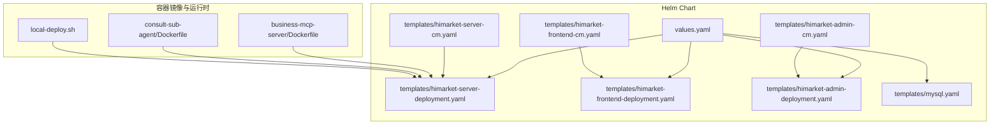
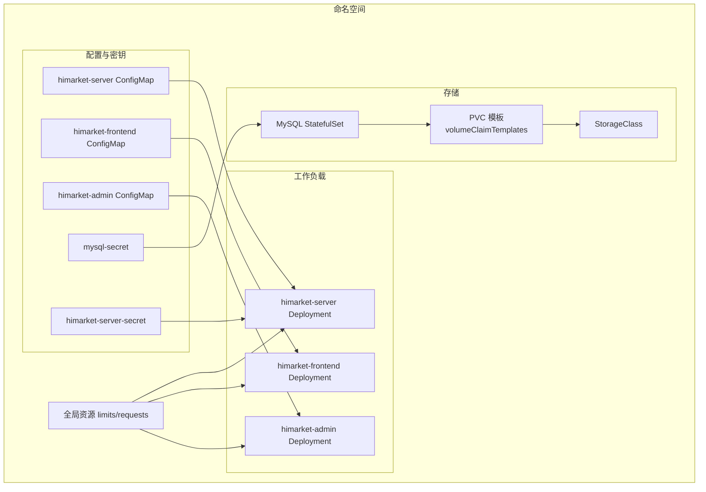
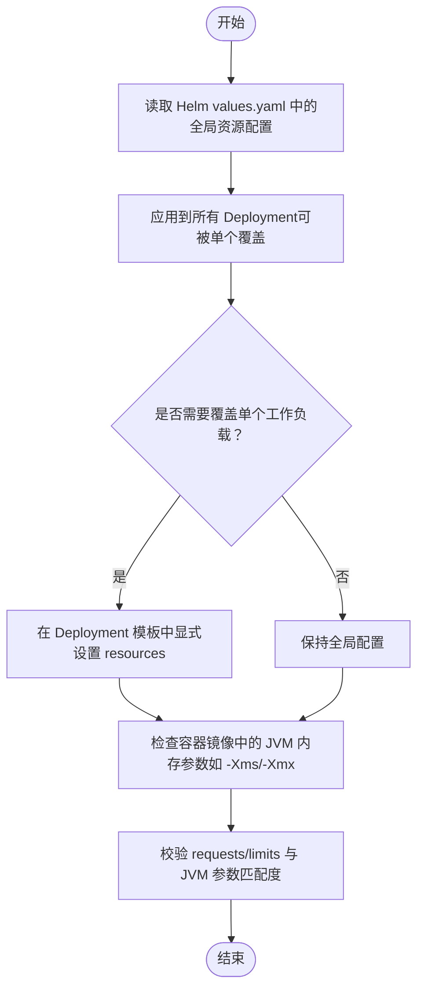
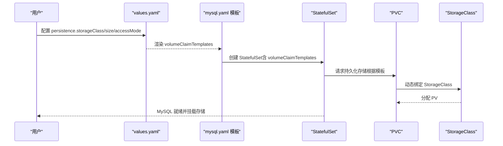
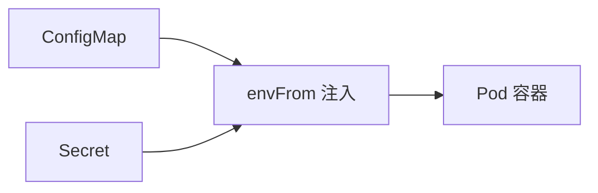
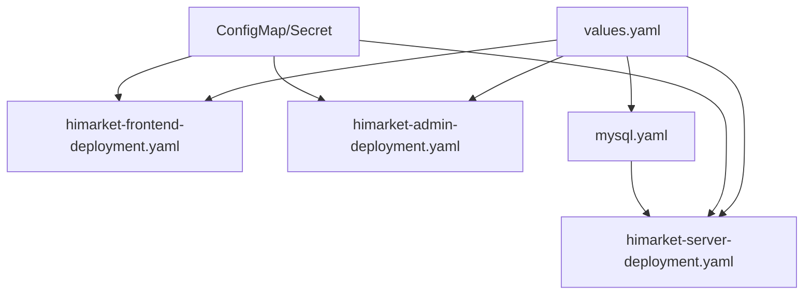

# 资源管理与配置

<cite>
**本文引用的文件**
- [values.yaml](file://agentscope-examples/boba-tea-shop/himarket-helm/values.yaml)
- [himarket-server-deployment.yaml](file://agentscope-examples/boba-tea-shop/himarket-helm/templates/himarket-server-deployment.yaml)
- [himarket-frontend-deployment.yaml](file://agentscope-examples/boba-tea-shop/himarket-helm/templates/himarket-frontend-deployment.yaml)
- [himarket-admin-deployment.yaml](file://agentscope-examples/boba-tea-shop/himarket-helm/templates/himarket-admin-deployment.yaml)
- [mysql.yaml](file://agentscope-examples/boba-tea-shop/himarket-helm/templates/mysql.yaml)
- [himarket-server-cm.yaml](file://agentscope-examples/boba-tea-shop/himarket-helm/templates/himarket-server-cm.yaml)
- [himarket-frontend-cm.yaml](file://agentscope-examples/boba-tea-shop/himarket-helm/templates/himarket-frontend-cm.yaml)
- [himarket-admin-cm.yaml](file://agentscope-examples/boba-tea-shop/himarket-helm/templates/himarket-admin-cm.yaml)
- [business-mcp-server/Dockerfile](file://agentscope-examples/boba-tea-shop/business-mcp-server/Dockerfile)
- [consult-sub-agent/Dockerfile](file://agentscope-examples/boba-tea-shop/consult-sub-agent/Dockerfile)
- [local-deploy.sh](file://agentscope-examples/boba-tea-shop/local-deploy.sh)
</cite>

## 目录
1. [简介](#简介)
2. [项目结构](#项目结构)
3. [核心组件](#核心组件)
4. [架构总览](#架构总览)
5. [详细组件分析](#详细组件分析)
6. [依赖关系分析](#依赖关系分析)
7. [性能考虑](#性能考虑)
8. [故障排查指南](#故障排查指南)
9. [结论](#结论)
10. [附录](#附录)

## 简介
本文件面向 AgentScope Java 在 Kubernetes 环境中的资源管理与配置，系统性阐述 CPU 与内存资源的 requests/limits 设置原则、存储资源（PersistentVolume、PersistentVolumeClaim、StorageClass）的配置方式、ConfigMap 与 Secret 的使用场景与配置方法，并结合 Helm 模板与示例应用给出资源配额（ResourceQuota）与限制范围（LimitRange）的落地建议。同时提供资源监控、告警配置思路以及成本优化策略，帮助在生产环境中实现稳定、可预测且高性价比的资源使用。

## 项目结构
本仓库中与资源管理直接相关的内容主要集中在 Boba Tea Shop 示例的 Helm Chart 及其子模块中，涵盖前端、后台服务、数据库与初始化脚本等。下图展示与资源管理相关的目录与文件关系：

**图表来源**
- [values.yaml:85-91](file://agentscope-examples/boba-tea-shop/himarket-helm/values.yaml#L85-L91)
- [himarket-server-deployment.yaml:225-228](file://agentscope-examples/boba-tea-shop/himarket-helm/templates/himarket-server-deployment.yaml#L225-L228)
- [himarket-frontend-deployment.yaml:47-49](file://agentscope-examples/boba-tea-shop/himarket-helm/templates/himarket-frontend-deployment.yaml#L47-L49)
- [himarket-admin-deployment.yaml:47-49](file://agentscope-examples/boba-tea-shop/himarket-helm/templates/himarket-admin-deployment.yaml#L47-L49)
- [mysql.yaml:173-176](file://agentscope-examples/boba-tea-shop/himarket-helm/templates/mysql.yaml#L173-L176)
- [himarket-server-cm.yaml:22-31](file://agentscope-examples/boba-tea-shop/himarket-helm/templates/himarket-server-cm.yaml#L22-L31)
- [himarket-frontend-cm.yaml](file://agentscope-examples/boba-tea-shop/himarket-helm/templates/himarket-frontend-cm.yaml#L22)
- [himarket-admin-cm.yaml](file://agentscope-examples/boba-tea-shop/himarket-helm/templates/himarket-admin-cm.yaml#L22)
- [business-mcp-server/Dockerfile:44-54](file://agentscope-examples/boba-tea-shop/business-mcp-server/Dockerfile#L44-L54)
- [consult-sub-agent/Dockerfile:43-52](file://agentscope-examples/boba-tea-shop/consult-sub-agent/Dockerfile#L43-L52)
- [local-deploy.sh:163-176](file://agentscope-examples/boba-tea-shop/local-deploy.sh#L163-L176)

**章节来源**
- [values.yaml:85-91](file://agentscope-examples/boba-tea-shop/himarket-helm/values.yaml#L85-L91)
- [himarket-server-deployment.yaml:225-228](file://agentscope-examples/boba-tea-shop/himarket-helm/templates/himarket-server-deployment.yaml#L225-L228)
- [himarket-frontend-deployment.yaml:47-49](file://agentscope-examples/boba-tea-shop/himarket-helm/templates/himarket-frontend-deployment.yaml#L47-L49)
- [himarket-admin-deployment.yaml:47-49](file://agentscope-examples/boba-tea-shop/himarket-helm/templates/himarket-admin-deployment.yaml#L47-L49)
- [mysql.yaml:173-176](file://agentscope-examples/boba-tea-shop/himarket-helm/templates/mysql.yaml#L173-L176)
- [himarket-server-cm.yaml:22-31](file://agentscope-examples/boba-tea-shop/himarket-helm/templates/himarket-server-cm.yaml#L22-L31)
- [himarket-frontend-cm.yaml](file://agentscope-examples/boba-tea-shop/himarket-helm/templates/himarket-frontend-cm.yaml#L22)
- [himarket-admin-cm.yaml](file://agentscope-examples/boba-tea-shop/himarket-helm/templates/himarket-admin-cm.yaml#L22)
- [business-mcp-server/Dockerfile:44-54](file://agentscope-examples/boba-tea-shop/business-mcp-server/Dockerfile#L44-L54)
- [consult-sub-agent/Dockerfile:43-52](file://agentscope-examples/boba-tea-shop/consult-sub-agent/Dockerfile#L43-L52)
- [local-deploy.sh:163-176](file://agentscope-examples/boba-tea-shop/local-deploy.sh#L163-L176)

## 核心组件
- 资源请求与限制（CPU/内存）
  - 全局资源限制：在 Helm values 中定义全局 requests/limits，用于控制命名空间内各工作负载的默认资源边界。
  - 工作负载级覆盖：通过 Deployment 模板中的 resources 字段对单个 Pod 的 requests/limits 进行细化或覆盖。
- 存储资源
  - 使用 StatefulSet 部署 MySQL，通过 volumeClaimTemplates 声明持久化卷请求，结合 StorageClass 实现动态供应。
  - 数据库凭据通过 Secret 管理，敏感信息不暴露在镜像或配置中。
- 配置与密钥
  - ConfigMap 用于存放非敏感配置（如端口、服务地址），通过 envFrom 注入到容器。
  - Secret 用于存放数据库密码等敏感信息，通过 envFrom 注入到容器。
- 初始化流程
  - 当启用内置 MySQL 时，Server Deployment 自动注入 initContainer，等待 MySQL 就绪后再启动业务容器，确保数据一致性。

**章节来源**
- [values.yaml:85-91](file://agentscope-examples/boba-tea-shop/himarket-helm/values.yaml#L85-L91)
- [himarket-server-deployment.yaml:36-123](file://agentscope-examples/boba-tea-shop/himarket-helm/templates/himarket-server-deployment.yaml#L36-L123)
- [mysql.yaml:134-227](file://agentscope-examples/boba-tea-shop/himarket-helm/templates/mysql.yaml#L134-L227)
- [himarket-server-cm.yaml:22-31](file://agentscope-examples/boba-tea-shop/himarket-helm/templates/himarket-server-cm.yaml#L22-L31)
- [himarket-frontend-cm.yaml](file://agentscope-examples/boba-tea-shop/himarket-helm/templates/himarket-frontend-cm.yaml#L22)
- [himarket-admin-cm.yaml](file://agentscope-examples/boba-tea-shop/himarket-helm/templates/himarket-admin-cm.yaml#L22)

## 架构总览
下图展示了资源管理在整体架构中的位置与交互关系：Helm values 定义资源与存储策略，Deployment 模板将策略落实到 Pod，ConfigMap/Secret 提供配置与密钥，MySQL 通过 PVC 与 StorageClass 实现持久化。

**图表来源**
- [values.yaml:85-91](file://agentscope-examples/boba-tea-shop/himarket-helm/values.yaml#L85-L91)
- [himarket-server-deployment.yaml:225-228](file://agentscope-examples/boba-tea-shop/himarket-helm/templates/himarket-server-deployment.yaml#L225-L228)
- [himarket-frontend-deployment.yaml:47-49](file://agentscope-examples/boba-tea-shop/himarket-helm/templates/himarket-frontend-deployment.yaml#L47-L49)
- [himarket-admin-deployment.yaml:47-49](file://agentscope-examples/boba-tea-shop/himarket-helm/templates/himarket-admin-deployment.yaml#L47-L49)
- [mysql.yaml:211-226](file://agentscope-examples/boba-tea-shop/himarket-helm/templates/mysql.yaml#L211-L226)
- [himarket-server-cm.yaml:22-31](file://agentscope-examples/boba-tea-shop/himarket-helm/templates/himarket-server-cm.yaml#L22-L31)
- [himarket-frontend-cm.yaml](file://agentscope-examples/boba-tea-shop/himarket-helm/templates/himarket-frontend-cm.yaml#L22)
- [himarket-admin-cm.yaml](file://agentscope-examples/boba-tea-shop/himarket-helm/templates/himarket-admin-cm.yaml#L22)

## 详细组件分析

### CPU 与内存资源分配策略（requests 与 limits）
- 全局资源边界
  - 在 values.yaml 中定义全局的 resources.limits 与 resources.requests，作为命名空间内各工作负载的默认上限与预留值，避免过度占用集群资源。
- 工作负载级覆盖
  - 通过 Deployment 模板中的 resources 字段，对单个 Pod 的 requests/limits 进行细化，确保关键服务（如数据库）有充足的资源保障。
- requests 与 limits 设定原则
  - requests：保证调度器能将 Pod 正确调度到具备足够可用资源的节点；应基于实际运行峰值与并发场景估算。
  - limits：防止单个 Pod 或服务占用过多资源影响其他 Pod；通常略高于 requests，留出突发缓冲。
  - 对于数据库类服务，建议将 limits 与 requests 设置得更接近，避免资源抢占导致抖动。
- 容器运行参数与 JVM 内存
  - Dockerfile 中通过环境变量设置 JVM 堆大小（如 -Xms、-Xmx），需与容器内存 limits 协调，避免 OOM 触发驱逐。

**图表来源**
- [values.yaml:85-91](file://agentscope-examples/boba-tea-shop/himarket-helm/values.yaml#L85-L91)
- [himarket-server-deployment.yaml:225-228](file://agentscope-examples/boba-tea-shop/himarket-helm/templates/himarket-server-deployment.yaml#L225-L228)
- [business-mcp-server/Dockerfile:44-54](file://agentscope-examples/boba-tea-shop/business-mcp-server/Dockerfile#L44-L54)
- [consult-sub-agent/Dockerfile:43-52](file://agentscope-examples/boba-tea-shop/consult-sub-agent/Dockerfile#L43-L52)

**章节来源**
- [values.yaml:85-91](file://agentscope-examples/boba-tea-shop/himarket-helm/values.yaml#L85-L91)
- [himarket-server-deployment.yaml:225-228](file://agentscope-examples/boba-tea-shop/himarket-helm/templates/himarket-server-deployment.yaml#L225-L228)
- [business-mcp-server/Dockerfile:44-54](file://agentscope-examples/boba-tea-shop/business-mcp-server/Dockerfile#L44-L54)
- [consult-sub-agent/Dockerfile:43-52](file://agentscope-examples/boba-tea-shop/consult-sub-agent/Dockerfile#L43-L52)

### 存储资源管理（PersistentVolume、PersistentVolumeClaim、StorageClass）
- StatefulSet 与 PVC
  - MySQL 使用 StatefulSet 部署，volumeClaimTemplates 声明持久化存储请求，自动为每个副本生成对应 PVC。
- StorageClass 与访问模式
  - 通过 persistence.storageClass 指定后端存储类型；accessMode 选择 ReadWriteOnce 以满足 MySQL 主从一致性要求。
- 存储容量与副本数
  - persistence.size 定义单个 PVC 的容量；replicaCount 控制副本数量，结合 StatefulSet 的稳定网络标识符进行扩展。
- 数据安全与初始化
  - 通过 Secret 存放数据库凭据，避免明文配置；初始化 SQL 通过 ConfigMap 注入容器，在首次启动时执行用户授权与权限刷新。

**图表来源**
- [values.yaml:121-125](file://agentscope-examples/boba-tea-shop/himarket-helm/values.yaml#L121-L125)
- [mysql.yaml:211-226](file://agentscope-examples/boba-tea-shop/himarket-helm/templates/mysql.yaml#L211-L226)
- [mysql.yaml:173-176](file://agentscope-examples/boba-tea-shop/himarket-helm/templates/mysql.yaml#L173-L176)

**章节来源**
- [values.yaml:121-125](file://agentscope-examples/boba-tea-shop/himarket-helm/values.yaml#L121-L125)
- [mysql.yaml:134-227](file://agentscope-examples/boba-tea-shop/himarket-helm/templates/mysql.yaml#L134-L227)

### ConfigMap 与 Secret 的使用场景与配置
- ConfigMap
  - 用于存放非敏感配置（如端口、服务地址、开关项），通过 envFrom 注入到容器，便于集中管理与热更新。
  - 示例：himarket-server-cm.yaml、himarket-frontend-cm.yaml、himarket-admin-cm.yaml。
- Secret
  - 用于存放敏感信息（如数据库密码、访问密钥），通过 envFrom 注入到容器，避免硬编码。
  - 示例：mysql-secret、himarket-server-secret。
- 注入方式
  - Deployment 模板中通过 envFrom 引用对应的 ConfigMap/Secret，确保配置与密钥在 Pod 启动时生效。

**图表来源**
- [himarket-server-cm.yaml:22-31](file://agentscope-examples/boba-tea-shop/himarket-helm/templates/himarket-server-cm.yaml#L22-L31)
- [himarket-frontend-cm.yaml](file://agentscope-examples/boba-tea-shop/himarket-helm/templates/himarket-frontend-cm.yaml#L22)
- [himarket-admin-cm.yaml](file://agentscope-examples/boba-tea-shop/himarket-helm/templates/himarket-admin-cm.yaml#L22)
- [mysql.yaml:73-100](file://agentscope-examples/boba-tea-shop/himarket-helm/templates/mysql.yaml#L73-L100)
- [himarket-server-deployment.yaml:210-216](file://agentscope-examples/boba-tea-shop/himarket-helm/templates/himarket-server-deployment.yaml#L210-L216)

**章节来源**
- [himarket-server-cm.yaml:22-31](file://agentscope-examples/boba-tea-shop/himarket-helm/templates/himarket-server-cm.yaml#L22-L31)
- [himarket-frontend-cm.yaml](file://agentscope-examples/boba-tea-shop/himarket-helm/templates/himarket-frontend-cm.yaml#L22)
- [himarket-admin-cm.yaml](file://agentscope-examples/boba-tea-shop/himarket-helm/templates/himarket-admin-cm.yaml#L22)
- [mysql.yaml:73-100](file://agentscope-examples/boba-tea-shop/himarket-helm/templates/mysql.yaml#L73-L100)
- [himarket-server-deployment.yaml:210-216](file://agentscope-examples/boba-tea-shop/himarket-helm/templates/himarket-server-deployment.yaml#L210-L216)

### 资源配额（ResourceQuota）与限制范围（LimitRange）
- ResourceQuota
  - 在命名空间层面设置资源总量上限，防止某个应用或团队过度消耗集群资源，保障多租户公平性。
- LimitRange
  - 为未显式声明 requests/limits 的 Pod 设置默认值与最小/最大边界，确保默认行为符合安全与稳定性要求。
- 建议实践
  - 将全局 values.yaml 中的资源限制与 LimitRange 默认值对齐，避免出现“越界”配置。
  - 对数据库、网关等关键组件单独设置更高的 limits，以降低突发流量下的不稳定风险。

[本节为通用实践建议，不直接分析具体文件，故无“章节来源”]

### 资源监控、告警配置与成本优化
- 监控与告警
  - 结合 Prometheus/Grafana 对 CPU/内存使用率、PVC 使用量、Pod 重启次数进行监控；针对资源使用率阈值设置告警。
- 成本优化
  - 合理设置 requests/limits，避免过度预留造成资源浪费。
  - 利用 HPA（水平自动伸缩）与资源回收策略（如优雅停机、Pod 亲和/反亲和）提升资源利用率。
  - 对数据库等热点组件采用专用节点池或预留实例，减少干扰。

[本节为通用实践建议，不直接分析具体文件，故无“章节来源”]

## 依赖关系分析
- Helm values 与模板
  - values.yaml 中的资源、存储与镜像配置通过 Helm 渲染到各个 Deployment 与 StatefulSet 模板中。
- 配置与密钥注入
  - ConfigMap/Secret 通过 envFrom 注入到容器，形成“配置即代码”的管理模式。
- 初始化依赖
  - 启用内置 MySQL 时，Server Deployment 注入 initContainer 等待数据库就绪，体现资源依赖的顺序约束。

**图表来源**
- [values.yaml:85-91](file://agentscope-examples/boba-tea-shop/himarket-helm/values.yaml#L85-L91)
- [himarket-server-deployment.yaml:225-228](file://agentscope-examples/boba-tea-shop/himarket-helm/templates/himarket-server-deployment.yaml#L225-L228)
- [himarket-frontend-deployment.yaml:47-49](file://agentscope-examples/boba-tea-shop/himarket-helm/templates/himarket-frontend-deployment.yaml#L47-L49)
- [himarket-admin-deployment.yaml:47-49](file://agentscope-examples/boba-tea-shop/himarket-helm/templates/himarket-admin-deployment.yaml#L47-L49)
- [mysql.yaml:173-176](file://agentscope-examples/boba-tea-shop/himarket-helm/templates/mysql.yaml#L173-L176)

**章节来源**
- [values.yaml:85-91](file://agentscope-examples/boba-tea-shop/himarket-helm/values.yaml#L85-L91)
- [himarket-server-deployment.yaml:225-228](file://agentscope-examples/boba-tea-shop/himarket-helm/templates/himarket-server-deployment.yaml#L225-L228)
- [himarket-frontend-deployment.yaml:47-49](file://agentscope-examples/boba-tea-shop/himarket-helm/templates/himarket-frontend-deployment.yaml#L47-L49)
- [himarket-admin-deployment.yaml:47-49](file://agentscope-examples/boba-tea-shop/himarket-helm/templates/himarket-admin-deployment.yaml#L47-L49)
- [mysql.yaml:173-176](file://agentscope-examples/boba-tea-shop/himarket-helm/templates/mysql.yaml#L173-L176)

## 性能考虑
- 资源边界与调度
  - requests 应贴近稳定负载，limits 应覆盖峰值与突发，避免频繁 OOM 或调度失败。
- JVM 与容器内存协同
  - 容器内存 limits 与 JVM 堆大小需匹配，避免容器驱逐或应用 GC 抖动。
- 存储 I/O 与延迟
  - 选择合适的 StorageClass 与 accessMode，确保数据库写入性能与一致性。
- 网络与健康检查
  - 通过健康检查与探针（liveness/readiness）确保服务可用性，减少无效重试与资源浪费。

[本节提供一般性指导，不直接分析具体文件，故无“章节来源”]

## 故障排查指南
- 数据库连接失败
  - 检查 MySQL Secret 是否正确注入，确认 DB_HOST/DB_PORT/DB_NAME/DB_USERNAME/DB_PASSWORD 是否与 ConfigMap/Secret 一致。
  - 若启用内置 MySQL，确认 initContainer 是否成功等待数据库就绪。
- 资源不足导致的调度失败或驱逐
  - 检查 Pod 的 requests/limits 与节点可用资源，必要时调整 values.yaml 中的全局资源或单个工作负载的资源声明。
- 容器内存溢出（OOM）
  - 校验容器内存 limits 与 JVM 堆大小配置，适当提高 limits 或降低堆大小。
- 本地环境连通性问题
  - 使用本地部署脚本检查 Java 版本与依赖服务（MySQL、Nacos）连通性。

**章节来源**
- [mysql.yaml:73-100](file://agentscope-examples/boba-tea-shop/himarket-helm/templates/mysql.yaml#L73-L100)
- [himarket-server-deployment.yaml:36-123](file://agentscope-examples/boba-tea-shop/himarket-helm/templates/himarket-server-deployment.yaml#L36-L123)
- [local-deploy.sh:163-176](file://agentscope-examples/boba-tea-shop/local-deploy.sh#L163-L176)

## 结论
通过 Helm values 统一管理资源与存储策略，结合 ConfigMap/Secret 的分层配置，AgentScope Java 在 Kubernetes 上实现了可控、可观测且可扩展的资源管理体系。建议在生产环境中进一步完善 ResourceQuota/LimitRange、监控告警与成本优化机制，以获得更稳健的运行表现与更高的资源利用率。

## 附录
- 关键路径参考
  - 全局资源配置：[values.yaml:85-91](file://agentscope-examples/boba-tea-shop/himarket-helm/values.yaml#L85-L91)
  - 工作负载资源覆盖：[himarket-server-deployment.yaml:225-228](file://agentscope-examples/boba-tea-shop/himarket-helm/templates/himarket-server-deployment.yaml#L225-L228)
  - 存储与 PVC：[mysql.yaml:211-226](file://agentscope-examples/boba-tea-shop/himarket-helm/templates/mysql.yaml#L211-L226)
  - 配置与密钥注入：[himarket-server-cm.yaml:22-31](file://agentscope-examples/boba-tea-shop/himarket-helm/templates/himarket-server-cm.yaml#L22-L31)、[mysql.yaml:73-100](file://agentscope-examples/boba-tea-shop/himarket-helm/templates/mysql.yaml#L73-L100)
  - 初始化依赖：[himarket-server-deployment.yaml:36-123](file://agentscope-examples/boba-tea-shop/himarket-helm/templates/himarket-server-deployment.yaml#L36-L123)
  - JVM 内存参数：[business-mcp-server/Dockerfile:44-54](file://agentscope-examples/boba-tea-shop/business-mcp-server/Dockerfile#L44-L54)、[consult-sub-agent/Dockerfile:43-52](file://agentscope-examples/boba-tea-shop/consult-sub-agent/Dockerfile#L43-L52)
  - 本地环境检查：[local-deploy.sh:163-176](file://agentscope-examples/boba-tea-shop/local-deploy.sh#L163-L176)