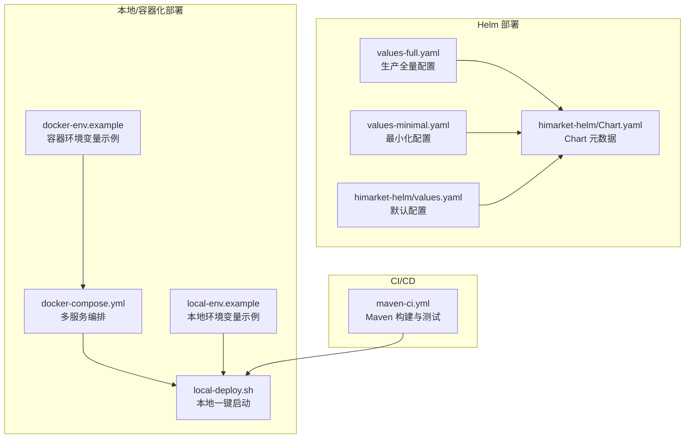
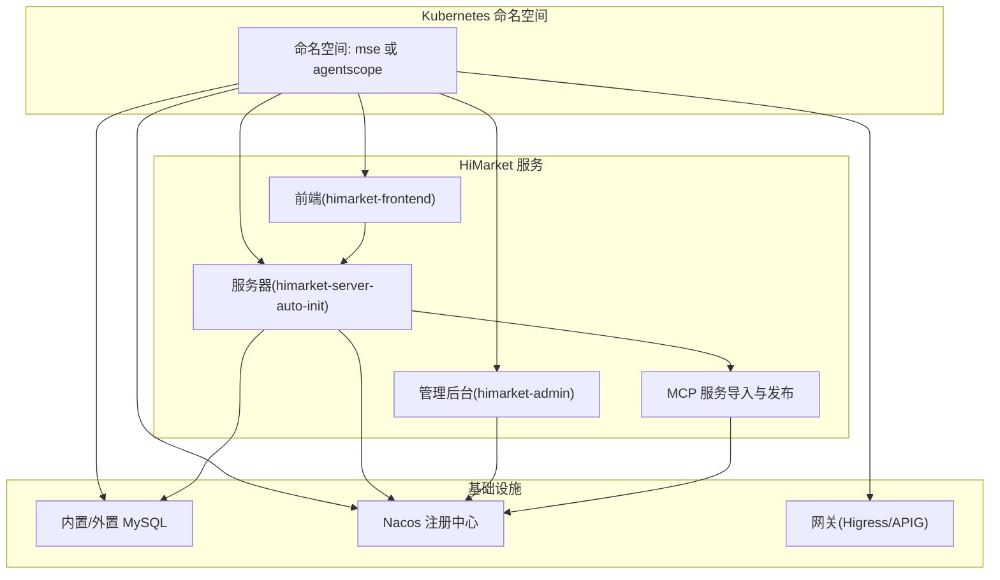
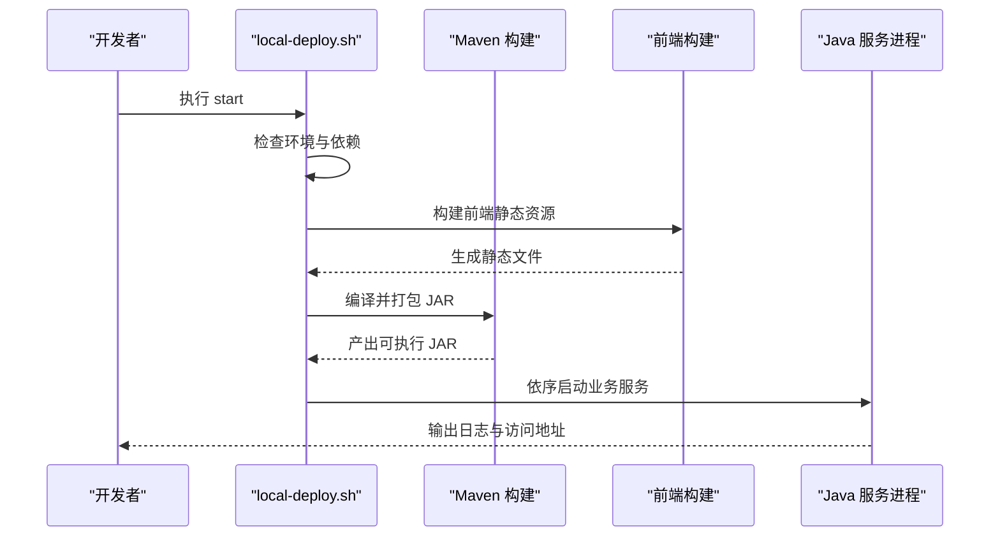
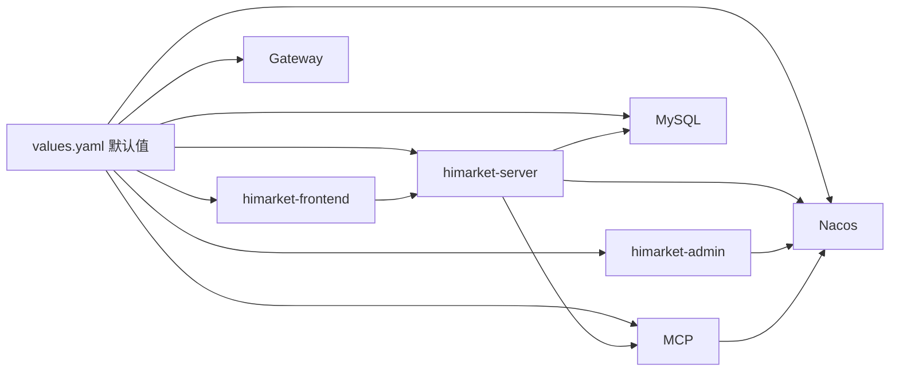

# 部署环境配置

<cite>
**本文引用的文件**
- [HIMARKET_DEPLOYMENT.md](file://agentscope-examples/boba-tea-shop/HIMARKET_DEPLOYMENT.md)
- [values-full.yaml](file://agentscope-examples/boba-tea-shop/himarket-helm/values-full.yaml)
- [values-minimal.yaml](file://agentscope-examples/boba-tea-shop/himarket-helm/values-minimal.yaml)
- [himarket-helm/values.yaml](file://agentscope-examples/boba-tea-shop/himarket-helm/values.yaml)
- [himarket-helm/Chart.yaml](file://agentscope-examples/boba-tea-shop/himarket-helm/Chart.yaml)
- [docker-compose.yml](file://agentscope-examples/boba-tea-shop/docker-compose.yml)
- [local-deploy.sh](file://agentscope-examples/boba-tea-shop/local-deploy.sh)
- [docker-env.example](file://agentscope-examples/boba-tea-shop/docker-env.example)
- [local-env.example](file://agentscope-examples/boba-tea-shop/local-env.example)
- [.github/workflows/maven-ci.yml](file://.github/workflows/maven-ci.yml)
</cite>

## 目录
1. [简介](#简介)
2. [项目结构](#项目结构)
3. [核心组件](#核心组件)
4. [架构总览](#架构总览)
5. [详细组件分析](#详细组件分析)
6. [依赖关系分析](#依赖关系分析)
7. [性能考虑](#性能考虑)
8. [故障排查指南](#故障排查指南)
9. [结论](#结论)
10. [附录](#附录)

## 简介
本指南面向 AgentScope Java 的部署与运维团队，系统性说明不同环境（开发、测试、生产）的配置差异与最佳实践，详解 Helm values-full.yaml 与 values-minimal.yaml 的配置项与适用场景，并覆盖环境变量管理、配置热更新与配置文件加密建议、CI/CD 集成与自动化部署/回滚策略，以及公有云、私有云与混合云的适配要点。

## 项目结构
围绕部署与配置的关键目录与文件如下：
- Helm Chart：himarket-helm 提供完整的市场服务一键部署能力，包含 values-full.yaml（生产全量）、values-minimal.yaml（最小化体验）与通用 values.yaml。
- 本地与容器化部署：docker-compose.yml、local-deploy.sh、docker-env.example、local-env.example。
- 文档与示例：HIMARKET_DEPLOYMENT.md 提供部署步骤与使用说明。
- CI/CD：GitHub Actions 工作流用于构建与质量门禁。

**图表来源**
- [himarket-helm/values-full.yaml:1-106](file://agentscope-examples/boba-tea-shop/himarket-helm/values-full.yaml#L1-L106)
- [himarket-helm/values-minimal.yaml:1-68](file://agentscope-examples/boba-tea-shop/himarket-helm/values-minimal.yaml#L1-L68)
- [himarket-helm/values.yaml:1-227](file://agentscope-examples/boba-tea-shop/himarket-helm/values.yaml#L1-L227)
- [himarket-helm/Chart.yaml:1-32](file://agentscope-examples/boba-tea-shop/himarket-helm/Chart.yaml#L1-L32)
- [docker-compose.yml:1-255](file://agentscope-examples/boba-tea-shop/docker-compose.yml#L1-L255)
- [local-deploy.sh:1-568](file://agentscope-examples/boba-tea-shop/local-deploy.sh#L1-L568)
- [.github/workflows/maven-ci.yml](file://.github/workflows/maven-ci.yml)

**章节来源**
- [HIMARKET_DEPLOYMENT.md:1-197](file://agentscope-examples/boba-tea-shop/HIMARKET_DEPLOYMENT.md#L1-L197)
- [himarket-helm/values-full.yaml:1-106](file://agentscope-examples/boba-tea-shop/himarket-helm/values-full.yaml#L1-L106)
- [himarket-helm/values-minimal.yaml:1-68](file://agentscope-examples/boba-tea-shop/himarket-helm/values-minimal.yaml#L1-L68)
- [himarket-helm/values.yaml:1-227](file://agentscope-examples/boba-tea-shop/himarket-helm/values.yaml#L1-L227)
- [himarket-helm/Chart.yaml:1-32](file://agentscope-examples/boba-tea-shop/himarket-helm/Chart.yaml#L1-L32)
- [docker-compose.yml:1-255](file://agentscope-examples/boba-tea-shop/docker-compose.yml#L1-L255)
- [local-deploy.sh:1-568](file://agentscope-examples/boba-tea-shop/local-deploy.sh#L1-L568)
- [docker-env.example:1-111](file://agentscope-examples/boba-tea-shop/docker-env.example#L1-L111)
- [local-env.example:1-89](file://agentscope-examples/boba-tea-shop/local-env.example#L1-L89)

## 核心组件
- HiMarket 服务族：前端、管理后台、服务器、MySQL、Nacos、网关、MCP。
- 部署方式：Helm（Kubernetes）、Docker Compose（单机/本地）、本地脚本（JVM 进程）。
- 配置来源：Helm values、环境变量、容器/本地 .env 文件、应用内配置文件。

关键差异与最佳实践：
- 开发环境：强调易用性与快速迭代，使用内置 MySQL、关闭外部注册、降低资源限制、暴露 NodePort。
- 测试环境：在保证功能完整的同时适度提升资源与持久化容量，启用必要的外部服务（如 Nacos、网关）以贴近真实。
- 生产环境：启用高可用与安全加固（密码、密钥、存储类、资源上限），开启自动初始化与 MCP 导入，配置监控与可观测性。

**章节来源**
- [himarket-helm/values-minimal.yaml:15-68](file://agentscope-examples/boba-tea-shop/himarket-helm/values-minimal.yaml#L15-L68)
- [himarket-helm/values-full.yaml:15-106](file://agentscope-examples/boba-tea-shop/himarket-helm/values-full.yaml#L15-L106)
- [himarket-helm/values.yaml:15-227](file://agentscope-examples/boba-tea-shop/himarket-helm/values.yaml#L15-L227)
- [docker-compose.yml:1-255](file://agentscope-examples/boba-tea-shop/docker-compose.yml#L1-L255)
- [local-deploy.sh:1-568](file://agentscope-examples/boba-tea-shop/local-deploy.sh#L1-L568)

## 架构总览
下图展示基于 Helm 的部署架构，突出各组件间的关系与依赖顺序。

**图表来源**
- [himarket-helm/values.yaml:29-227](file://agentscope-examples/boba-tea-shop/himarket-helm/values.yaml#L29-L227)
- [HIMARKET_DEPLOYMENT.md:47-63](file://agentscope-examples/boba-tea-shop/HIMARKET_DEPLOYMENT.md#L47-L63)

**章节来源**
- [HIMARKET_DEPLOYMENT.md:1-197](file://agentscope-examples/boba-tea-shop/HIMARKET_DEPLOYMENT.md#L1-L197)
- [himarket-helm/values.yaml:1-227](file://agentscope-examples/boba-tea-shop/himarket-helm/values.yaml#L1-L227)

## 详细组件分析

### values-full.yaml 与 values-minimal.yaml 对比
- 共同点
  - 均定义镜像拉取密钥、服务镜像仓库与标签、资源请求/限制。
  - 支持内置 MySQL 与持久化配置。
- 差异点
  - 生产全量（values-full.yaml）
    - 启用内置 MySQL 并设置更大容量与存储类；启用 Nacos、网关、MCP；设置更高的 CPU/内存限制；自动初始化延迟更长。
  - 最小化（values-minimal.yaml）
    - 关闭 Nacos 与网关；禁用 MCP；资源限制更低；服务类型为 NodePort 便于本地访问；内置 MySQL 容量较小。

使用建议
- 开发/测试：优先使用 values-minimal.yaml 快速验证。
- 生产：使用 values-full.yaml 作为基线，结合企业安全策略调整密钥与网络策略。

**章节来源**
- [himarket-helm/values-full.yaml:15-106](file://agentscope-examples/boba-tea-shop/himarket-helm/values-full.yaml#L15-L106)
- [himarket-helm/values-minimal.yaml:15-68](file://agentscope-examples/boba-tea-shop/himarket-helm/values-minimal.yaml#L15-L68)

### Helm Chart 元数据与默认值
- Chart.yaml 描述了应用名称、版本、关键字与维护者信息。
- 默认 values.yaml 提供了前端、管理后台、服务器、MySQL、Nacos、网关、MCP 的默认配置与注释说明，便于按需覆盖。

最佳实践
- 将环境差异化参数放入独立 values-{env}.yaml，并通过 Helm 的 --values 多文件合并实现环境隔离。
- 使用 imagePullSecrets 与私有镜像仓库配合，确保镜像拉取安全。

**章节来源**
- [himarket-helm/Chart.yaml:1-32](file://agentscope-examples/boba-tea-shop/himarket-helm/Chart.yaml#L1-L32)
- [himarket-helm/values.yaml:1-227](file://agentscope-examples/boba-tea-shop/himarket-helm/values.yaml#L1-L227)

### 本地与容器化部署流程
- Docker Compose
  - 通过 docker-compose.yml 统一编排 MySQL、Nacos、MCP 服务、子代理与总控代理。
  - 环境变量由 docker-env.example 提供模板，支持模型提供商、API Key、数据库与 Nacos 地址等。
- 本地脚本
  - local-deploy.sh 负责检查前置条件（JDK、端口占用、依赖连通性）、构建前端与后端、按依赖顺序启动服务，并输出日志与状态。
  - local-env.example 提供本地运行时的环境变量模板。

**图表来源**
- [local-deploy.sh:202-281](file://agentscope-examples/boba-tea-shop/local-deploy.sh#L202-L281)
- [docker-compose.yml:19-255](file://agentscope-examples/boba-tea-shop/docker-compose.yml#L19-L255)

**章节来源**
- [docker-compose.yml:1-255](file://agentscope-examples/boba-tea-shop/docker-compose.yml#L1-L255)
- [local-deploy.sh:1-568](file://agentscope-examples/boba-tea-shop/local-deploy.sh#L1-L568)
- [docker-env.example:1-111](file://agentscope-examples/boba-tea-shop/docker-env.example#L1-L111)
- [local-env.example:1-89](file://agentscope-examples/boba-tea-shop/local-env.example#L1-L89)

### 环境变量管理
- 容器化环境
  - 使用 docker-compose.yml 中的 environment 字段注入服务级变量，如模型提供商、API Key、数据库连接、Nacos 地址等。
  - docker-env.example 提供变量模板，建议在 CI/CD 中通过密文注入或 Secret 管理。
- 本地环境
  - local-env.example 提供本地运行时变量模板，local-deploy.sh 会读取并转换为 JVM 参数。
- 建议
  - 区分明文与密文变量，敏感信息统一走密文管理（如 Kubernetes Secret、CI/CD 变量库）。
  - 采用分层配置：默认值在 values.yaml 或 .env 中，环境覆盖在 CI/CD 或 Helm 命令中。

**章节来源**
- [docker-compose.yml:59-110](file://agentscope-examples/boba-tea-shop/docker-compose.yml#L59-L110)
- [docker-env.example:35-111](file://agentscope-examples/boba-tea-shop/docker-env.example#L35-L111)
- [local-env.example:26-89](file://agentscope-examples/boba-tea-shop/local-env.example#L26-L89)
- [local-deploy.sh:307-326](file://agentscope-examples/boba-tea-shop/local-deploy.sh#L307-L326)

### 配置热更新与配置文件加密
- 热更新
  - 应用侧可通过配置中心（如 Nacos）动态刷新部分配置（如模型参数、数据库连接池参数），避免重启。
  - 对于 Helm/Compose 配置变更，建议通过 Helm 升级或重新编排实现，配合滚动更新策略。
- 配置文件加密
  - 敏感配置（API Key、数据库密码）建议以密文形式存储，通过密钥管理服务解密后注入。
  - 在 CI/CD 中对密文进行加解密，避免明文泄露。

[本节为通用指导，不直接分析具体文件]

### CI/CD 集成、自动化部署与回滚
- Maven 构建与测试
  - maven-ci.yml 提供构建与测试流水线，建议在此基础上扩展镜像构建、推送与 Helm 部署步骤。
- 自动化部署
  - 使用 Helm 将 values-{env}.yaml 与密文 Secret 结合，实现一键部署。
  - 推荐使用 GitOps（如 ArgoCD/Flux）实现声明式管理与变更审计。
- 回滚策略
  - Helm 历史版本管理：升级失败时可回滚至上一个稳定版本。
  - 金丝雀/蓝绿发布：分批替换 Pod，结合健康检查与自动回滚。

**章节来源**
- [.github/workflows/maven-ci.yml](file://.github/workflows/maven-ci.yml)

### 不同部署平台适配方案
- 公有云
  - 使用托管 MySQL/Nacos/网关服务，减少自运维成本；通过弹性伸缩与高可用存储满足生产需求。
  - 镜像仓库与密钥管理建议使用云厂商提供的托管服务。
- 私有云
  - 自建 MySQL/Nacos/网关，结合企业安全策略与网络策略；注意备份与容灾。
- 混合云
  - 跨云部署时，统一通过网关与服务发现实现跨域访问；对敏感数据与密钥集中管理。

[本节为通用指导，不直接分析具体文件]

## 依赖关系分析
Helm Chart 与服务间的依赖关系如下：

**图表来源**
- [himarket-helm/values.yaml:29-227](file://agentscope-examples/boba-tea-shop/himarket-helm/values.yaml#L29-L227)

**章节来源**
- [himarket-helm/values.yaml:1-227](file://agentscope-examples/boba-tea-shop/himarket-helm/values.yaml#L1-L227)

## 性能考虑
- 资源配额
  - 生产环境适当提高 CPU/内存上限与请求值，避免突发流量导致 OOM 或限流。
- 存储
  - 生产环境选择更高性能的存储类与更大容量，开启持久化并定期备份。
- 网络
  - 合理设置服务暴露方式（LoadBalancer/NodePort/ClusterIP），在公有云上优先使用托管网关。
- 数据库
  - 使用连接池优化、慢查询监控与索引调优；必要时拆分读写分离。

[本节为通用指导，不直接分析具体文件]

## 故障排查指南
- 本地启动失败
  - 检查 JDK 版本、端口占用与依赖连通性；查看日志目录定位问题。
- 容器化启动异常
  - 核对 docker-env.example 中的变量是否正确注入；确认镜像拉取密钥与仓库可达。
- Helm 部署问题
  - 使用 kubectl describe pod/svc 查看事件与状态；核对 values-{env}.yaml 是否正确合并。
- 配置生效问题
  - 确认变量是否被正确注入到 JVM 参数或应用配置；对于动态配置，确认配置中心订阅与刷新机制。

**章节来源**
- [local-deploy.sh:116-200](file://agentscope-examples/boba-tea-shop/local-deploy.sh#L116-L200)
- [docker-compose.yml:31-46](file://agentscope-examples/boba-tea-shop/docker-compose.yml#L31-L46)
- [HIMARKET_DEPLOYMENT.md:47-63](file://agentscope-examples/boba-tea-shop/HIMARKET_DEPLOYMENT.md#L47-L63)

## 结论
通过 Helm values-full.yaml 与 values-minimal.yaml 的合理选择与组合，结合完善的环境变量管理、CI/CD 流水线与平台适配策略，AgentScope Java 可在开发、测试与生产环境中实现一致、可控且可扩展的部署体验。建议在生产中强化安全与可观测性，并建立完善的回滚与应急响应机制。

## 附录
- 部署步骤参考：HIMARKET_DEPLOYMENT.md 提供了 Helm 与本地部署的详细步骤与注意事项。
- 示例配置文件路径：values-full.yaml、values-minimal.yaml、values.yaml、Chart.yaml、docker-compose.yml、local-deploy.sh、docker-env.example、local-env.example。

**章节来源**
- [HIMARKET_DEPLOYMENT.md:1-197](file://agentscope-examples/boba-tea-shop/HIMARKET_DEPLOYMENT.md#L1-L197)
- [himarket-helm/values-full.yaml:1-106](file://agentscope-examples/boba-tea-shop/himarket-helm/values-full.yaml#L1-L106)
- [himarket-helm/values-minimal.yaml:1-68](file://agentscope-examples/boba-tea-shop/himarket-helm/values-minimal.yaml#L1-L68)
- [himarket-helm/values.yaml:1-227](file://agentscope-examples/boba-tea-shop/himarket-helm/values.yaml#L1-L227)
- [himarket-helm/Chart.yaml:1-32](file://agentscope-examples/boba-tea-shop/himarket-helm/Chart.yaml#L1-L32)
- [docker-compose.yml:1-255](file://agentscope-examples/boba-tea-shop/docker-compose.yml#L1-L255)
- [local-deploy.sh:1-568](file://agentscope-examples/boba-tea-shop/local-deploy.sh#L1-L568)
- [docker-env.example:1-111](file://agentscope-examples/boba-tea-shop/docker-env.example#L1-L111)
- [local-env.example:1-89](file://agentscope-examples/boba-tea-shop/local-env.example#L1-L89)