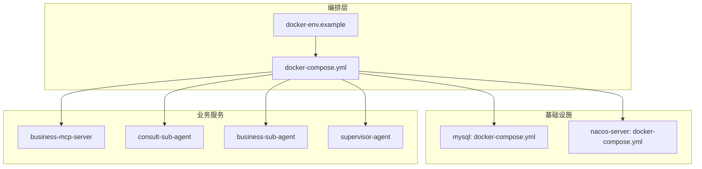
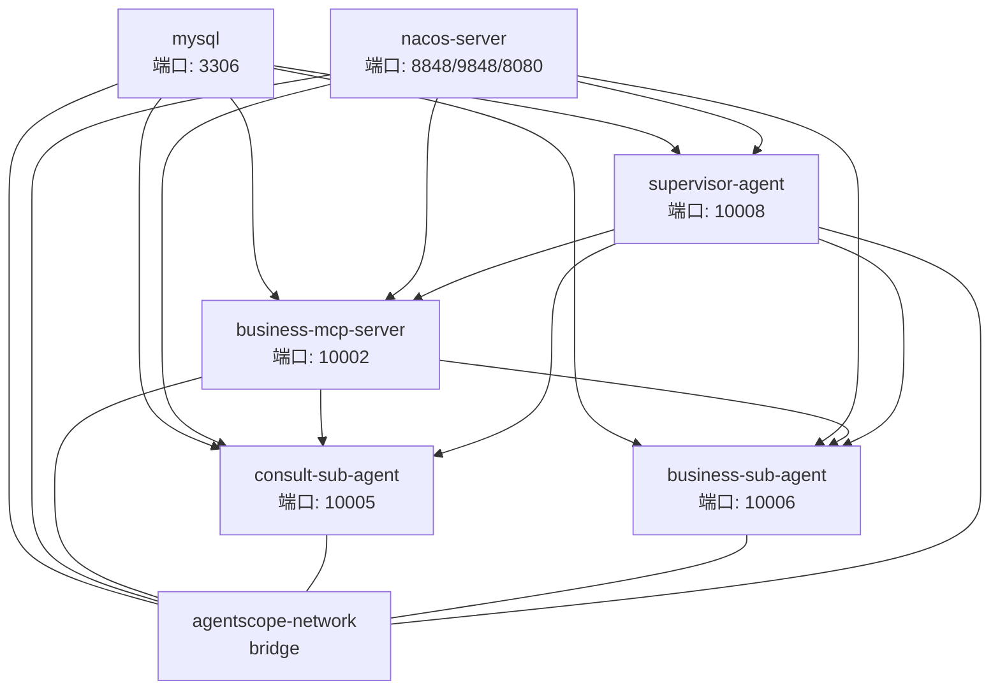
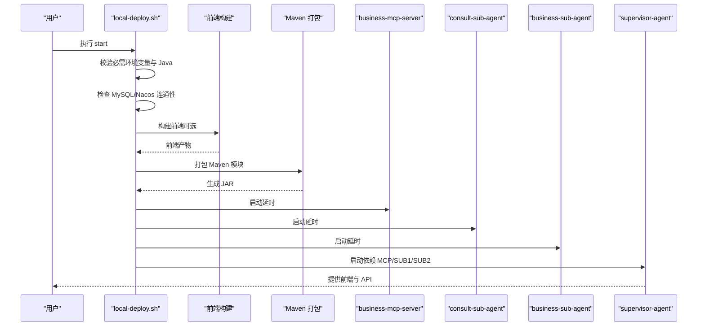
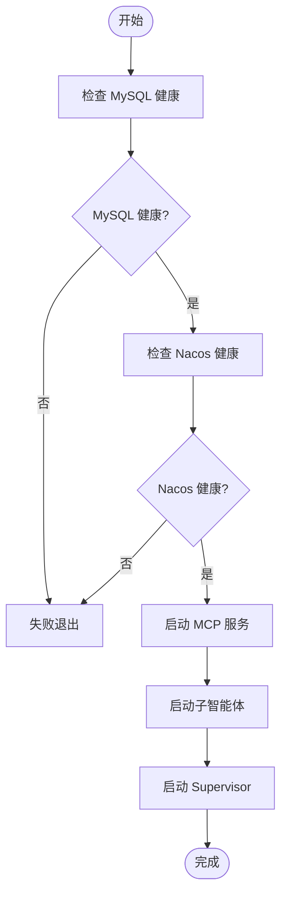

# Docker Compose 编排

<cite>
**本文引用的文件**
- [docker-compose.yml](file://agentscope-examples/boba-tea-shop/docker-compose.yml)
- [docker-env.example](file://agentscope-examples/boba-tea-shop/docker-env.example)
- [local-deploy.sh](file://agentscope-examples/boba-tea-shop/local-deploy.sh)
- [local-env.example](file://agentscope-examples/boba-tea-shop/local-env.example)
- [build.sh](file://agentscope-examples/boba-tea-shop/build.sh)
- [business-mcp-server/Dockerfile](file://agentscope-examples/boba-tea-shop/business-mcp-server/Dockerfile)
- [business-sub-agent/Dockerfile](file://agentscope-examples/boba-tea-shop/business-sub-agent/Dockerfile)
- [consult-sub-agent/Dockerfile](file://agentscope-examples/boba-tea-shop/consult-sub-agent/Dockerfile)
- [supervisor-agent/Dockerfile](file://agentscope-examples/boba-tea-shop/supervisor-agent/Dockerfile)
- [mysql-image/Dockerfile](file://agentscope-examples/boba-tea-shop/mysql-image/Dockerfile)
- [nacos-image/Dockerfile](file://agentscope-examples/boba-tea-shop/nacos-image/Dockerfile)
- [mysql-image/init-db.sh](file://agentscope-examples/boba-tea-shop/mysql-image/init-db.sh)
- [mysql-image/init.sql.template](file://agentscope-examples/boba-tea-shop/mysql-image/init.sql.template)
- [mysql-image/my.cnf](file://agentscope-examples/boba-tea-shop/mysql-image/my.cnf)
- [nacos-image/init-password.sh](file://agentscope-examples/boba-tea-shop/nacos-image/init-password.sh)
</cite>

## 目录
1. [简介](#简介)
2. [项目结构](#项目结构)
3. [核心组件](#核心组件)
4. [架构总览](#架构总览)
5. [详细组件分析](#详细组件分析)
6. [依赖关系分析](#依赖关系分析)
7. [性能与可用性建议](#性能与可用性建议)
8. [故障排除指南](#故障排除指南)
9. [结论](#结论)
10. [附录](#附录)

## 简介
本文件面向 AgentScope Java 多智能体系统在本地与容器环境中的 Docker Compose 编排，聚焦于 Boba Tea Shop 示例的完整服务编排配置。内容涵盖基础设施服务（MySQL、Nacos）与业务服务（Business MCP Server、Consult Sub Agent、Business Sub Agent、Supervisor Agent）的配置细节，包括服务间依赖关系、网络与数据卷策略、环境变量、健康检查与重启策略，并提供本地部署脚本使用指南、环境变量模板与故障排除方法。同时给出服务扩缩容、负载均衡与高可用配置建议。

## 项目结构
该示例采用“多模块 Maven 工程 + Docker Compose 编排”的方式组织，核心目录如下：
- agentscope-examples/boba-tea-shop：编排与镜像构建脚本所在目录
  - docker-compose.yml：Compose 编排文件
  - docker-env.example：Compose 环境变量模板
  - local-deploy.sh：本地一键部署脚本（非容器化）
  - local-env.example：本地部署环境变量模板
  - build.sh：统一构建脚本（可选构建额外镜像）
  - 各子模块 Dockerfile：业务服务镜像定义
  - mysql-image/nacos-image：数据库与注册中心镜像定制
  - mysql-image/init.sql.template：数据库初始化脚本模板
  - mysql-image/my.cnf：MySQL 字符集与时区配置
  - nacos-image/init-password.sh：Nacos 初始化密码脚本

图表来源
- [docker-compose.yml:19-255](file://agentscope-examples/boba-tea-shop/docker-compose.yml#L19-L255)
- [docker-env.example:29-111](file://agentscope-examples/boba-tea-shop/docker-env.example#L29-L111)

章节来源
- [docker-compose.yml:19-255](file://agentscope-examples/boba-tea-shop/docker-compose.yml#L19-L255)
- [docker-env.example:19-111](file://agentscope-examples/boba-tea-shop/docker-env.example#L19-L111)

## 核心组件
- 基础设施服务
  - MySQL：提供业务数据持久化，内置字符集与时区配置，首次启动通过初始化脚本创建用户与数据库并注入示例数据。
  - Nacos：服务注册与发现，单机模式，提供健康检查与自动密码初始化。
- 业务服务
  - Business MCP Server：对外提供 MCP 接口，依赖 MySQL 与 Nacos。
  - Consult Sub Agent：咨询类子智能体，依赖 MySQL 与 Nacos。
  - Business Sub Agent：业务类子智能体，依赖 MySQL 与 Nacos。
  - Supervisor Agent：总控智能体，内置前端静态资源，依赖 MySQL、Nacos 与其他子服务。

章节来源
- [docker-compose.yml:24-239](file://agentscope-examples/boba-tea-shop/docker-compose.yml#L24-L239)
- [business-mcp-server/Dockerfile:15-62](file://agentscope-examples/boba-tea-shop/business-mcp-server/Dockerfile#L15-L62)
- [business-sub-agent/Dockerfile:15-55](file://agentscope-examples/boba-tea-shop/business-sub-agent/Dockerfile#L15-L55)
- [consult-sub-agent/Dockerfile:15-61](file://agentscope-examples/boba-tea-shop/consult-sub-agent/Dockerfile#L15-L61)
- [supervisor-agent/Dockerfile:15-82](file://agentscope-examples/boba-tea-shop/supervisor-agent/Dockerfile#L15-L82)

## 架构总览
下图展示服务间的依赖关系与网络拓扑。所有服务位于同一自定义桥接网络，业务服务通过环境变量指向 MySQL 与 Nacos；Supervisor Agent 作为前端入口，其余服务独立端口暴露。

图表来源
- [docker-compose.yml:24-239](file://agentscope-examples/boba-tea-shop/docker-compose.yml#L24-L239)

## 详细组件分析

### 数据库服务（MySQL）
- 镜像与初始化
  - 使用自定义镜像，内置 my.cnf 保证 utf8mb4 字符集与时区配置。
  - 首次启动通过 init.sql.template 与 init-db.sh 创建数据库、用户并授予权限，随后执行建表与插入示例数据。
- 端口映射与健康检查
  - 暴露 3306 端口，健康检查基于 mysqladmin ping。
- 数据卷
  - 使用命名卷 mysql-data 持久化数据。

章节来源
- [mysql-image/Dockerfile:15-47](file://agentscope-examples/boba-tea-shop/mysql-image/Dockerfile#L15-L47)
- [mysql-image/my.cnf:15-36](file://agentscope-examples/boba-tea-shop/mysql-image/my.cnf#L15-L36)
- [mysql-image/init-db.sh:1-30](file://agentscope-examples/boba-tea-shop/mysql-image/init-db.sh#L1-L30)
- [mysql-image/init.sql.template:15-358](file://agentscope-examples/boba-tea-shop/mysql-image/init.sql.template#L15-L358)
- [docker-compose.yml:24-48](file://agentscope-examples/boba-tea-shop/docker-compose.yml#L24-L48)

### 注册中心（Nacos）
- 镜像与初始化
  - 单机模式，预置鉴权参数与默认令牌。
  - 通过 init-password.sh 在 Nacos 就绪后设置管理员密码。
- 端口映射与健康检查
  - 暴露 8848（gRPC）、9848（gRPC）、8080（控制台），健康检查基于端口探测。
- 服务注册
  - 默认启用服务注册与发现。

章节来源
- [nacos-image/Dockerfile:15-47](file://agentscope-examples/boba-tea-shop/nacos-image/Dockerfile#L15-L47)
- [nacos-image/init-password.sh:1-67](file://agentscope-examples/boba-tea-shop/nacos-image/init-password.sh#L1-L67)
- [docker-compose.yml:50-74](file://agentscope-examples/boba-tea-shop/docker-compose.yml#L50-L74)

### 业务服务（Business MCP Server）
- 镜像与运行
  - 基于 eclipse-temurin:17-jre，非 root 用户运行，暴露 10002 端口。
  - 内置健康检查，访问 actuator/health。
- 环境变量
  - 服务器端口、模型提供商与密钥、DashScope RAG 参数、数据库连接、Mem0 密钥、Nacos 地址与命名空间。
- 依赖
  - 依赖 mysql 与 nacos-server 的健康状态。

章节来源
- [business-mcp-server/Dockerfile:15-62](file://agentscope-examples/boba-tea-shop/business-mcp-server/Dockerfile#L15-L62)
- [docker-compose.yml:79-116](file://agentscope-examples/boba-tea-shop/docker-compose.yml#L79-L116)

### 子智能体（Consult Sub Agent）
- 镜像与运行
  - 基于 eclipse-temurin:17-jre，非 root 用户运行，暴露 10005 端口。
  - 内置健康检查，访问 actuator/health。
- 环境变量
  - 与 MCP 服务一致的模型与数据库配置，以及 Nacos 地址与命名空间。
- 依赖
  - 依赖 mysql 与 nacos-server 的健康状态。

章节来源
- [consult-sub-agent/Dockerfile:15-61](file://agentscope-examples/boba-tea-shop/consult-sub-agent/Dockerfile#L15-L61)
- [docker-compose.yml:118-155](file://agentscope-examples/boba-tea-shop/docker-compose.yml#L118-L155)

### 子智能体（Business Sub Agent）
- 镜像与运行
  - 基于 eclipse-temurin:17-jre，非 root 用户运行，暴露 10006 端口。
  - 内置健康检查，访问 actuator/health。
- 环境变量
  - 与 MCP 服务一致的模型与数据库配置，以及 Nacos 地址与命名空间。
- 依赖
  - 依赖 mysql 与 nacos-server 的健康状态。

章节来源
- [business-sub-agent/Dockerfile:15-55](file://agentscope-examples/boba-tea-shop/business-sub-agent/Dockerfile#L15-L55)
- [docker-compose.yml:157-194](file://agentscope-examples/boba-tea-shop/docker-compose.yml#L157-L194)

### 总控智能体（Supervisor Agent）
- 镜像与运行
  - 基于多阶段构建：前端在 Node 阶段构建，Java 阶段复制静态资源，暴露 10008 端口。
  - 内置健康检查，访问 actuator/health。
- 环境变量
  - 包含 DashScope 模型名称、XXL-Job 相关参数、静态资源路径等。
- 依赖
  - 依赖 mysql 与 nacos-server 的健康状态，且依赖 MCP 与两个子智能体已启动。

章节来源
- [supervisor-agent/Dockerfile:15-82](file://agentscope-examples/boba-tea-shop/supervisor-agent/Dockerfile#L15-L82)
- [docker-compose.yml:196-239](file://agentscope-examples/boba-tea-shop/docker-compose.yml#L196-L239)

### 本地部署脚本（local-deploy.sh）
- 功能概览
  - 校验必需环境变量与 Java 版本，检查 MySQL 与 Nacos 连通性。
  - 可选构建前端并打包 Maven 模块，按依赖顺序启动各服务。
  - 提供状态查询、日志查看与配置展示。
- 关键流程
  - 构建前端 → 打包 Maven → 启动 MCP → 启动子智能体 → 启动 Supervisor。

图表来源
- [local-deploy.sh:509-567](file://agentscope-examples/boba-tea-shop/local-deploy.sh#L509-L567)
- [local-deploy.sh:468-503](file://agentscope-examples/boba-tea-shop/local-deploy.sh#L468-L503)

章节来源
- [local-deploy.sh:1-568](file://agentscope-examples/boba-tea-shop/local-deploy.sh#L1-L568)

### 环境变量配置
- Compose 环境变量模板
  - 包含镜像仓库与标签、模型提供商与密钥、DashScope RAG 参数、Mem0 密钥、MySQL 与 Nacos 端口与命名空间、各服务端口等。
- 本地部署环境变量模板
  - 用于本地部署脚本加载，包含 MySQL 与 Nacos 地址、命名空间与注册开关等。

章节来源
- [docker-env.example:29-111](file://agentscope-examples/boba-tea-shop/docker-env.example#L29-L111)
- [local-env.example:26-89](file://agentscope-examples/boba-tea-shop/local-env.example#L26-L89)

## 依赖关系分析
- 服务启动顺序
  - MySQL 与 Nacos 先行启动并通过健康检查。
  - MCP 服务优先启动，其他子智能体随后启动。
  - Supervisor Agent 最后启动，确保其依赖的服务已就绪。
- 服务间通信
  - 业务服务通过环境变量中的 DB_HOST/DB_PORT 与 NACOS_SERVER_ADDR 访问基础设施。
  - Supervisor Agent 作为统一入口，聚合其他服务能力。

图表来源
- [docker-compose.yml:110-114](file://agentscope-examples/boba-tea-shop/docker-compose.yml#L110-L114)
- [docker-compose.yml:189-191](file://agentscope-examples/boba-tea-shop/docker-compose.yml#L189-L191)
- [docker-compose.yml:227-237](file://agentscope-examples/boba-tea-shop/docker-compose.yml#L227-L237)

章节来源
- [docker-compose.yml:110-237](file://agentscope-examples/boba-tea-shop/docker-compose.yml#L110-L237)

## 性能与可用性建议
- 资源与健康检查
  - 建议为各服务设置合理的 JVM 堆大小（JAVA_OPTS），并结合健康检查与重启策略保障稳定性。
- 数据库性能
  - 生产环境建议开启索引优化与慢查询日志，合理拆分读写分离与缓存层。
- 注册中心高可用
  - 生产环境建议使用集群模式的 Nacos，配合外部 MySQL 实现高可用。
- 服务扩缩容
  - 使用 Compose 的 scale 功能对子智能体进行横向扩展，结合负载均衡或反向代理实现流量分发。
- 网络与存储
  - 使用自定义桥接网络隔离服务，数据卷持久化重要数据，避免容器重建导致数据丢失。

## 故障排除指南
- 常见问题定位
  - 端口冲突：确认各服务端口未被占用，或调整 docker-env.example 中的端口映射。
  - 环境变量缺失：本地部署脚本会校验必需变量，按提示补充 MODEL_API_KEY、DashScope 与 Mem0 密钥。
  - 依赖服务未就绪：检查 MySQL 与 Nacos 的健康检查是否通过，必要时延长启动等待时间。
- 日志与状态
  - 使用 local-deploy.sh status 查看各服务 PID 与运行状态，查看 logs 目录下的日志文件定位问题。
- 数据库初始化失败
  - 检查 init-db.sh 是否正确替换模板变量，确认 root 密码与 DB_* 变量一致。
- Nacos 密码初始化失败
  - 确认控制台端口 8080 可用，脚本会轮询 8848 端口直至开放后再调用管理接口。

章节来源
- [local-deploy.sh:116-161](file://agentscope-examples/boba-tea-shop/local-deploy.sh#L116-L161)
- [local-deploy.sh:336-355](file://agentscope-examples/boba-tea-shop/local-deploy.sh#L336-L355)
- [mysql-image/init-db.sh:14-26](file://agentscope-examples/boba-tea-shop/mysql-image/init-db.sh#L14-L26)
- [nacos-image/init-password.sh:15-44](file://agentscope-examples/boba-tea-shop/nacos-image/init-password.sh#L15-L44)

## 结论
本编排方案通过 Compose 将基础设施与业务服务有机整合，明确服务间依赖与网络拓扑，提供完善的健康检查与重启策略。配合本地部署脚本与环境变量模板，可快速完成本地验证与演示。生产部署建议进一步完善高可用、性能优化与可观测性配置。

## 附录

### 环境变量清单（摘自模板）
- 镜像配置
  - IMAGE_REGISTRY、IMAGE_TAG
- 模型与知识库
  - MODEL_PROVIDER、MODEL_API_KEY、MODEL_NAME、MODEL_BASE_URL
  - DASHSCOPE_ACCESS_KEY_ID、DASHSCOPE_ACCESS_KEY_SECRET、DASHSCOPE_WORKSPACE_ID、DASHSCOPE_INDEX_ID
- 内存服务
  - MEM0_API_KEY
- 数据库
  - MYSQL_PORT、DB_NAME、DB_USERNAME、DB_PASSWORD
- 注册中心
  - NACOS_PORT、NACOS_GRPC_PORT、NACOS_CONSOLE_PORT、NACOS_NAMESPACE、NACOS_REGISTER_ENABLED
- 服务端口
  - BUSINESS_MCP_SERVER_PORT、CONSULT_SUB_AGENT_PORT、BUSINESS_SUB_AGENT_PORT、SUPERVISOR_AGENT_PORT

章节来源
- [docker-env.example:29-111](file://agentscope-examples/boba-tea-shop/docker-env.example#L29-L111)
- [local-env.example:26-89](file://agentscope-examples/boba-tea-shop/local-env.example#L26-L89)