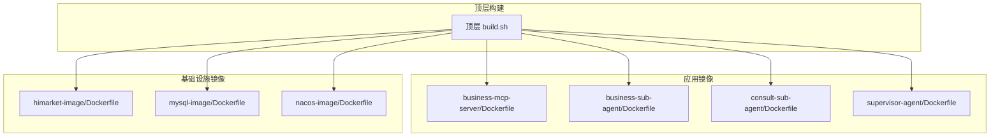
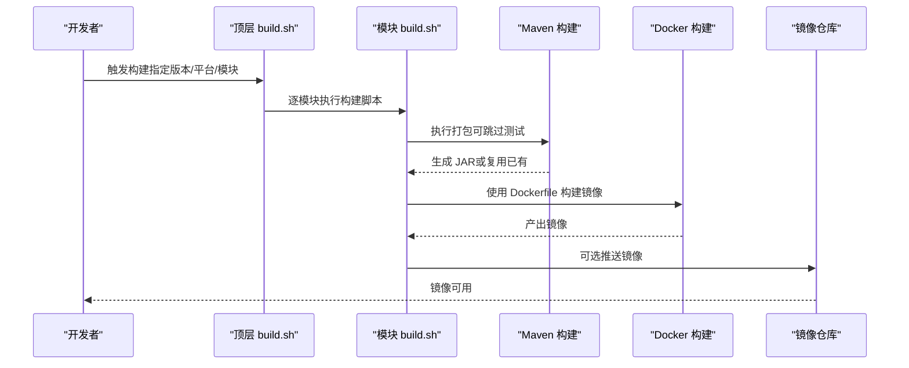
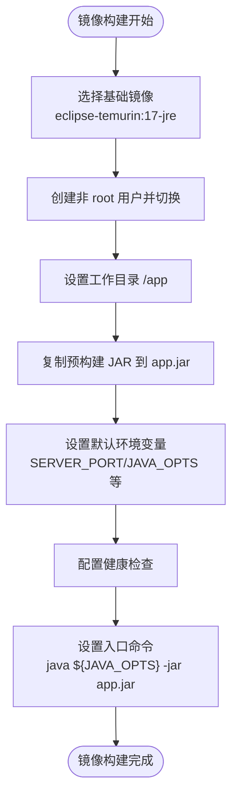
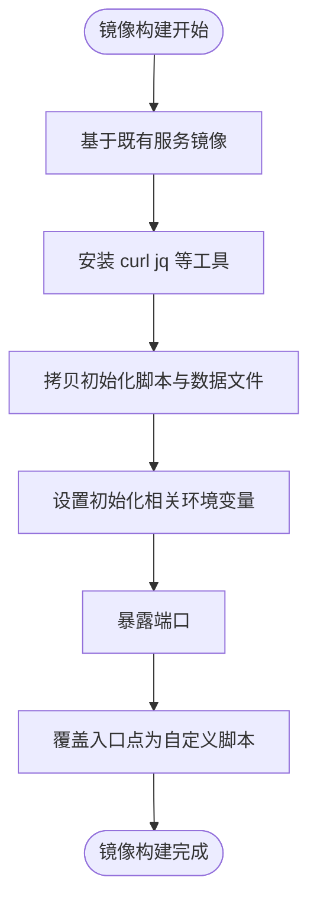
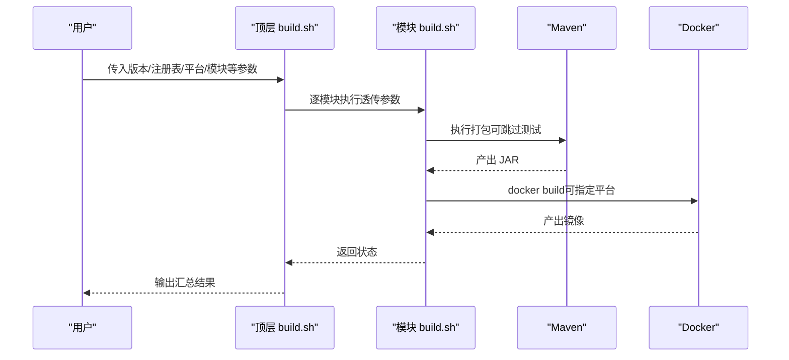
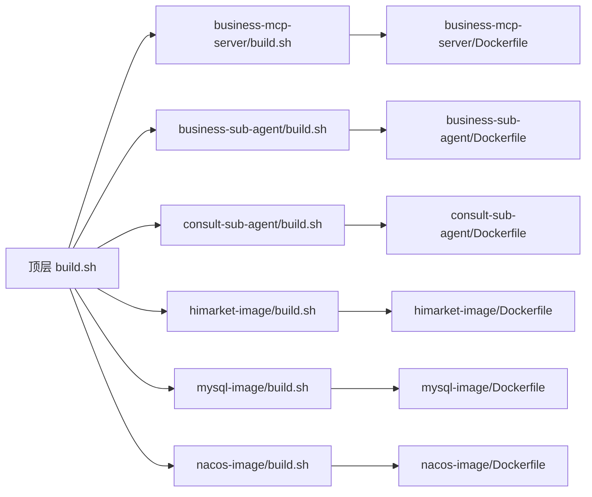

# Docker 镜像构建

<cite>
**本文引用的文件**
- [business-mcp-server/Dockerfile](file://agentscope-examples/boba-tea-shop/business-mcp-server/Dockerfile)
- [business-sub-agent/Dockerfile](file://agentscope-examples/boba-tea-shop/business-sub-agent/Dockerfile)
- [consult-sub-agent/Dockerfile](file://agentscope-examples/boba-tea-shop/consult-sub-agent/Dockerfile)
- [himarket-image/Dockerfile](file://agentscope-examples/boba-tea-shop/himarket-image/Dockerfile)
- [mysql-image/Dockerfile](file://agentscope-examples/boba-tea-shop/mysql-image/Dockerfile)
- [nacos-image/Dockerfile](file://agentscope-examples/boba-tea-shop/nacos-image/Dockerfile)
- [build.sh](file://agentscope-examples/boba-tea-shop/build.sh)
- [business-mcp-server/build.sh](file://agentscope-examples/boba-tea-shop/business-mcp-server/build.sh)
- [business-sub-agent/build.sh](file://agentscope-examples/boba-tea-shop/business-sub-agent/build.sh)
- [consult-sub-agent/build.sh](file://agentscope-examples/boba-tea-shop/consult-sub-agent/build.sh)
- [himarket-image/build.sh](file://agentscope-examples/boba-tea-shop/himarket-image/build.sh)
- [mysql-image/build.sh](file://agentscope-examples/boba-tea-shop/mysql-image/build.sh)
- [nacos-image/build.sh](file://agentscope-examples/boba-tea-shop/nacos-image/build.sh)
</cite>

## 目录
1. [简介](#简介)
2. [项目结构](#项目结构)
3. [核心组件](#核心组件)
4. [架构总览](#架构总览)
5. [详细组件分析](#详细组件分析)
6. [依赖关系分析](#依赖关系分析)
7. [性能考虑](#性能考虑)
8. [故障排查指南](#故障排查指南)
9. [结论](#结论)
10. [附录](#附录)

## 简介
本技术文档聚焦于 AgentScope Java 示例工程中的 Docker 镜像构建体系，系统性解析多阶段与单阶段构建策略、基础镜像选择、JVM 参数优化、容器运行时配置、构建脚本工作流、依赖缓存策略、镜像标签管理、容器启动命令与环境变量传递、资源限制设置、镜像体积优化与安全加固等主题。文档以 Boba Tea Shop 多模块示例为基础，提供可操作的最佳实践与排障建议。

## 项目结构
本仓库包含多个独立的 Docker 化服务与基础设施镜像，均位于 boba-tea-shop 示例目录下，采用“按功能模块拆分”的组织方式：
- 应用镜像：business-mcp-server、business-sub-agent、consult-sub-agent、supervisor-agent（部分）
- 基础设施镜像：himarket-image、mysql-image、nacos-image
- 统一构建入口：顶层 build.sh
- 各模块独立构建脚本：各子模块的 build.sh

图表来源
- [build.sh](file://agentscope-examples/boba-tea-shop/build.sh)
- [business-mcp-server/Dockerfile](file://agentscope-examples/boba-tea-shop/business-mcp-server/Dockerfile)
- [business-sub-agent/Dockerfile](file://agentscope-examples/boba-tea-shop/business-sub-agent/Dockerfile)
- [consult-sub-agent/Dockerfile](file://agentscope-examples/boba-tea-shop/consult-sub-agent/Dockerfile)
- [himarket-image/Dockerfile](file://agentscope-examples/boba-tea-shop/himarket-image/Dockerfile)
- [mysql-image/Dockerfile](file://agentscope-examples/boba-tea-shop/mysql-image/Dockerfile)
- [nacos-image/Dockerfile](file://agentscope-examples/boba-tea-shop/nacos-image/Dockerfile)

章节来源
- [build.sh:1-199](file://agentscope-examples/boba-tea-shop/build.sh#L1-L199)

## 核心组件
本节从镜像构建视角梳理核心组件及其职责：
- 单阶段应用镜像：直接基于 JRE 基础镜像，复制预构建 JAR 并通过 JVM 参数控制内存，典型代表 business-mcp-server、business-sub-agent、consult-sub-agent。
- 自定义入口镜像：himarket-image 在既有服务镜像基础上扩展初始化脚本与自动注册能力。
- 基础设施镜像：mysql-image、nacos-image 分别提供数据库与注册中心的自定义初始化与启动逻辑。
- 构建编排：顶层 build.sh 负责模块选择、参数透传与结果汇总；各模块 build.sh 负责 Maven 构建与 Docker 构建链路。

章节来源
- [business-mcp-server/Dockerfile:15-62](file://agentscope-examples/boba-tea-shop/business-mcp-server/Dockerfile#L15-L62)
- [business-sub-agent/Dockerfile:15-55](file://agentscope-examples/boba-tea-shop/business-sub-agent/Dockerfile#L15-L55)
- [consult-sub-agent/Dockerfile:15-61](file://agentscope-examples/boba-tea-shop/consult-sub-agent/Dockerfile#L15-L61)
- [himarket-image/Dockerfile:15-70](file://agentscope-examples/boba-tea-shop/himarket-image/Dockerfile#L15-L70)
- [mysql-image/Dockerfile:15-47](file://agentscope-examples/boba-tea-shop/mysql-image/Dockerfile#L15-L47)
- [nacos-image/Dockerfile:15-47](file://agentscope-examples/boba-tea-shop/nacos-image/Dockerfile#L15-L47)

## 架构总览
下图展示从源码到镜像再到运行时的整体流程，以及各模块在统一编排下的交互关系。

图表来源
- [build.sh:138-176](file://agentscope-examples/boba-tea-shop/build.sh#L138-L176)
- [business-mcp-server/build.sh:73-130](file://agentscope-examples/boba-tea-shop/business-mcp-server/build.sh#L73-L130)
- [business-sub-agent/build.sh:73-130](file://agentscope-examples/boba-tea-shop/business-sub-agent/build.sh#L73-L130)
- [consult-sub-agent/build.sh:73-130](file://agentscope-examples/boba-tea-shop/consult-sub-agent/build.sh#L73-L130)

## 详细组件分析

### 单阶段应用镜像（business-mcp-server）
- 基础镜像：使用 Eclipse Temurin 17 JRE，兼顾多架构与安全性。
- 运行用户：非 root 用户运行，降低权限风险。
- 端口暴露与健康检查：固定端口与 actuator 健康检查结合。
- JVM 参数：通过环境变量注入，便于运行时调整。
- 入口命令：通过 sh -c 拼接 JAVA_OPTS 与 jar 启动。

图表来源
- [business-mcp-server/Dockerfile:17-61](file://agentscope-examples/boba-tea-shop/business-mcp-server/Dockerfile#L17-L61)

章节来源
- [business-mcp-server/Dockerfile:15-62](file://agentscope-examples/boba-tea-shop/business-mcp-server/Dockerfile#L15-L62)

### 单阶段应用镜像（business-sub-agent）
- 结构与 business-mcp-server 类似，差异在于端口与默认环境变量集合。
- 通过 SERVER_PORT 与 JAVA_OPTS 控制运行行为。

章节来源
- [business-sub-agent/Dockerfile:15-55](file://agentscope-examples/boba-tea-shop/business-sub-agent/Dockerfile#L15-L55)

### 单阶段应用镜像（consult-sub-agent）
- 引入数据库相关默认变量，体现该模块对持久化依赖。
- 保持与前述模块一致的安全与运行时配置。

章节来源
- [consult-sub-agent/Dockerfile:15-61](file://agentscope-examples/boba-tea-shop/consult-sub-agent/Dockerfile#L15-L61)

### 自定义入口镜像（himarket-image）
- 基于既有服务镜像扩展，安装 curl/jq 等工具，准备初始化脚本与数据文件。
- 通过自定义入口脚本先启动 Java 应用，再执行初始化流程，支持多种初始化开关与参数。
- 显式声明端口并覆盖入口点。

图表来源
- [himarket-image/Dockerfile:15-68](file://agentscope-examples/boba-tea-shop/himarket-image/Dockerfile#L15-L68)

章节来源
- [himarket-image/Dockerfile:15-70](file://agentscope-examples/boba-tea-shop/himarket-image/Dockerfile#L15-L70)

### 基础设施镜像（mysql-image）
- 基于 Anolis MySQL 8.0.30，内置 UTF-8 配置与初始化模板。
- 通过环境变量驱动初始化 SQL 的生成与执行，简化部署。

章节来源
- [mysql-image/Dockerfile:15-47](file://agentscope-examples/boba-tea-shop/mysql-image/Dockerfile#L15-L47)

### 基础设施镜像（nacos-image）
- 基于官方 Nacos v3.1.1，设置认证与模式参数。
- 通过自定义入口脚本与初始化脚本实现自动密码初始化与并行启动。

章节来源
- [nacos-image/Dockerfile:15-47](file://agentscope-examples/boba-tea-shop/nacos-image/Dockerfile#L15-L47)

### 构建脚本工作流（顶层与模块级）
- 顶层 build.sh：解析参数、确定模块集合并逐个调用对应模块的 build.sh，汇总成功/失败列表。
- 模块 build.sh：负责 Maven 构建（可跳过测试）、Docker 构建（支持平台参数）、可选推送。

图表来源
- [build.sh:138-176](file://agentscope-examples/boba-tea-shop/build.sh#L138-L176)
- [business-mcp-server/build.sh:73-130](file://agentscope-examples/boba-tea-shop/business-mcp-server/build.sh#L73-L130)
- [business-sub-agent/build.sh:73-130](file://agentscope-examples/boba-tea-shop/business-sub-agent/build.sh#L73-L130)
- [consult-sub-agent/build.sh:73-130](file://agentscope-examples/boba-tea-shop/consult-sub-agent/build.sh#L73-L130)

章节来源
- [build.sh:1-199](file://agentscope-examples/boba-tea-shop/build.sh#L1-L199)
- [business-mcp-server/build.sh:1-133](file://agentscope-examples/boba-tea-shop/business-mcp-server/build.sh#L1-L133)
- [business-sub-agent/build.sh:1-133](file://agentscope-examples/boba-tea-shop/business-sub-agent/build.sh#L1-L133)
- [consult-sub-agent/build.sh:1-133](file://agentscope-examples/boba-tea-shop/consult-sub-agent/build.sh#L1-L133)
- [himarket-image/build.sh:1-194](file://agentscope-examples/boba-tea-shop/himarket-image/build.sh#L1-L194)
- [mysql-image/build.sh:1-101](file://agentscope-examples/boba-tea-shop/mysql-image/build.sh#L1-L101)
- [nacos-image/build.sh:1-101](file://agentscope-examples/boba-tea-shop/nacos-image/build.sh#L1-L101)

## 依赖关系分析
- 模块耦合：顶层 build.sh 与各模块 build.sh 之间为编排与被编排关系；模块 Dockerfile 与本地 Maven 构建产物存在隐式依赖（需先构建 JAR）。
- 外部依赖：基础镜像来源、包管理器（apt/yum/apk）、第三方镜像仓库（阿里云镜像）。
- 运行时依赖：应用镜像依赖 Nacos、MySQL 等基础设施镜像提供的服务。

图表来源
- [build.sh:138-176](file://agentscope-examples/boba-tea-shop/build.sh#L138-L176)
- [business-mcp-server/build.sh:106-111](file://agentscope-examples/boba-tea-shop/business-mcp-server/build.sh#L106-L111)
- [business-sub-agent/build.sh:106-111](file://agentscope-examples/boba-tea-shop/business-sub-agent/build.sh#L106-L111)
- [consult-sub-agent/build.sh:106-111](file://agentscope-examples/boba-tea-shop/consult-sub-agent/build.sh#L106-L111)
- [himarket-image/build.sh:91](file://agentscope-examples/boba-tea-shop/himarket-image/build.sh#L91)
- [mysql-image/build.sh:79-83](file://agentscope-examples/boba-tea-shop/mysql-image/build.sh#L79-L83)
- [nacos-image/build.sh:79-83](file://agentscope-examples/boba-tea-shop/nacos-image/build.sh#L79-L83)

章节来源
- [build.sh:1-199](file://agentscope-examples/boba-tea-shop/build.sh#L1-L199)

## 性能考虑
- 构建性能
  - Maven 层面：通过 -DskipTests 或运行测试按需控制构建时间；启用增量更新 -U。
  - Docker 层面：合理利用缓存层顺序，将变化频率低的步骤（如安装工具、复制依赖）前置；避免不必要的多阶段。
- 运行性能
  - JVM 参数：通过 JAVA_OPTS 控制堆大小（如 -Xms/-Xmx），结合容器资源限制进行匹配。
  - 健康检查：合理设置间隔与超时，避免频繁探测造成额外开销。
- 镜像体积
  - 基础镜像选择：优先 slim 版本（如 eclipse-temurin:17-jre-slim）减少体积。
  - 清理包管理器缓存与临时文件，避免将缓存写入镜像层。
  - 合理分层：将变动频繁的层（如 JAR）置于靠后层，以提升缓存命中率。

## 故障排查指南
- 构建失败
  - Maven 失败：检查 -DskipTests 与 -U 参数是否符合预期；确认网络可达与依赖仓库可用。
  - Docker 失败：核对 Dockerfile 中的 COPY 路径与 JAR 是否存在；确认平台参数与目标架构兼容。
- 运行异常
  - 健康检查失败：检查 SERVER_PORT 与 actuator 健康端点路径；确认容器端口映射正确。
  - 权限问题：确认非 root 用户对 /app 的读写权限已正确设置。
  - 初始化失败：针对 himarket-image/nacos-image/mysql-image，检查初始化脚本与环境变量是否齐全。
- 推送失败
  - 注册表鉴权：确保 -r/--registry 正确且具备推送权限；顶层 build.sh 对 --push 的前置校验可作为参考。

章节来源
- [business-mcp-server/build.sh:115-123](file://agentscope-examples/boba-tea-shop/business-mcp-server/build.sh#L115-L123)
- [business-sub-agent/build.sh:115-123](file://agentscope-examples/boba-tea-shop/business-sub-agent/build.sh#L115-L123)
- [consult-sub-agent/build.sh:115-123](file://agentscope-examples/boba-tea-shop/consult-sub-agent/build.sh#L115-L123)
- [build.sh:189-193](file://agentscope-examples/boba-tea-shop/build.sh#L189-L193)

## 结论
本项目的 Docker 镜像构建体系以“模块化、可编排、可扩展”为核心设计原则：通过统一的顶层构建脚本协调多模块构建，各模块镜像采用单阶段精简策略并结合非 root 运行、健康检查与 JVM 参数优化，既保证了运行时稳定性，也兼顾了构建效率与镜像体积。基础设施镜像进一步完善了端到端部署体验。建议在生产环境中配合资源限制、只读根文件系统、最小权限等安全加固措施，持续优化镜像与运行时配置。

## 附录
- 最佳实践清单
  - 基础镜像：优先选择 slim 版本，明确多架构支持需求。
  - 构建脚本：统一参数命名与日志输出，提供帮助信息与错误提示。
  - 镜像标签：遵循语义化版本，必要时保留 latest 标签但谨慎使用。
  - 安全加固：非 root 运行、最小权限、只读根文件系统、禁用不必要工具。
  - 运行时：结合容器资源限制与 JVM 参数，避免过度分配导致资源浪费。