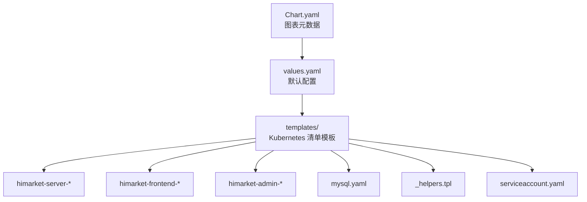
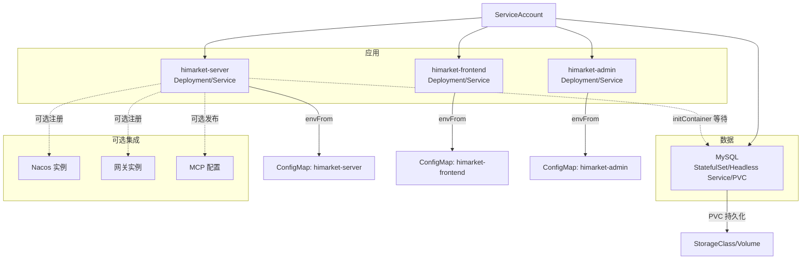
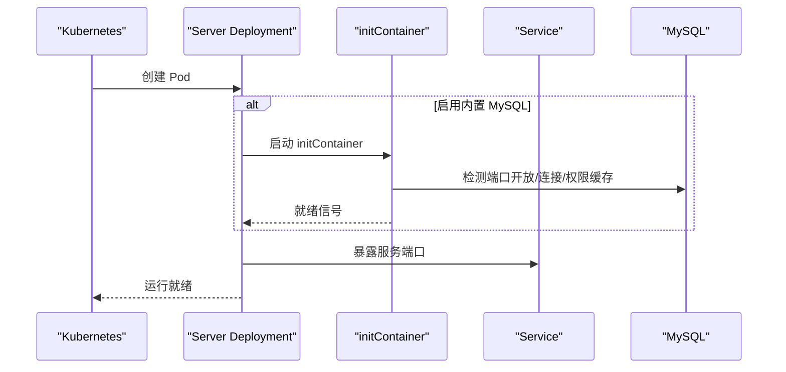
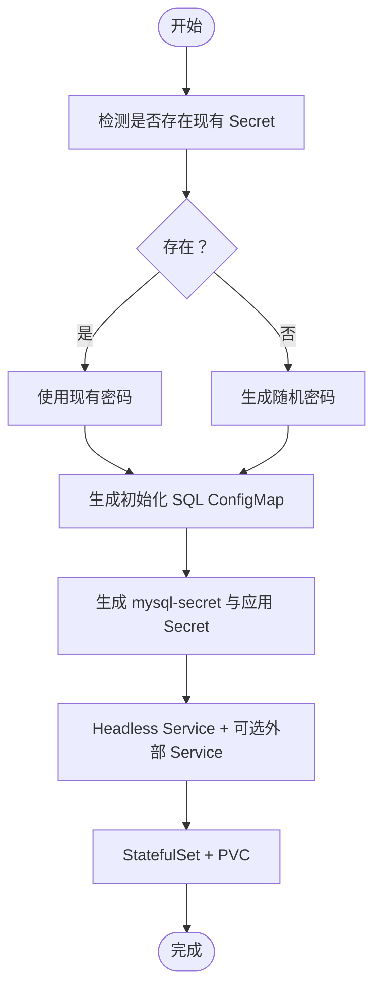
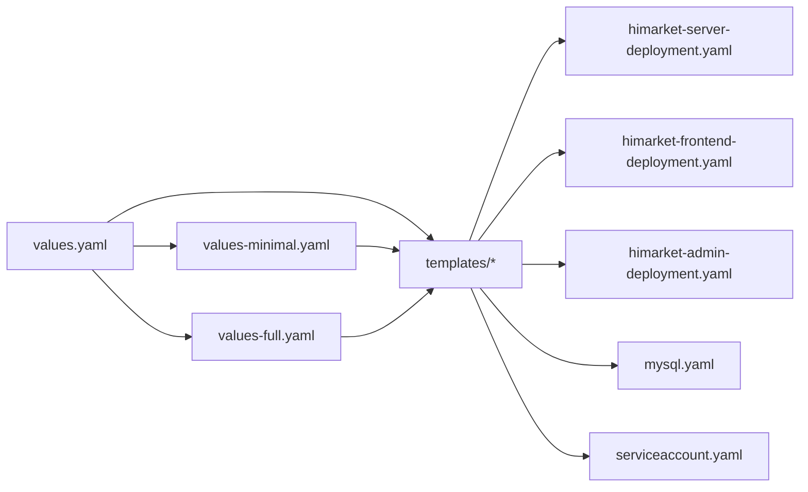

# Kubernetes 部署

<cite>
**本文引用的文件**
- [Chart.yaml](file://agentscope-examples/boba-tea-shop/himarket-helm/Chart.yaml)
- [values.yaml](file://agentscope-examples/boba-tea-shop/himarket-helm/values.yaml)
- [values-minimal.yaml](file://agentscope-examples/boba-tea-shop/himarket-helm/values-minimal.yaml)
- [values-full.yaml](file://agentscope-examples/boba-tea-shop/himarket-helm/values-full.yaml)
- [_helpers.tpl](file://agentscope-examples/boba-tea-shop/himarket-helm/templates/_helpers.tpl)
- [himarket-server-deployment.yaml](file://agentscope-examples/boba-tea-shop/himarket-helm/templates/himarket-server-deployment.yaml)
- [himarket-server-service.yaml](file://agentscope-examples/boba-tea-shop/himarket-helm/templates/himarket-server-service.yaml)
- [himarket-frontend-deployment.yaml](file://agentscope-examples/boba-tea-shop/himarket-helm/templates/himarket-frontend-deployment.yaml)
- [himarket-frontend-service.yaml](file://agentscope-examples/boba-tea-shop/himarket-helm/templates/himarket-frontend-service.yaml)
- [himarket-admin-deployment.yaml](file://agentscope-examples/boba-tea-shop/himarket-helm/templates/himarket-admin-deployment.yaml)
- [himarket-admin-service.yaml](file://agentscope-examples/boba-tea-shop/himarket-helm/templates/himarket-admin-service.yaml)
- [mysql.yaml](file://agentscope-examples/boba-tea-shop/himarket-helm/templates/mysql.yaml)
- [serviceaccount.yaml](file://agentscope-examples/boba-tea-shop/himarket-helm/templates/serviceaccount.yaml)
</cite>

## 目录
1. [简介](#简介)
2. [项目结构](#项目结构)
3. [核心组件](#核心组件)
4. [架构总览](#架构总览)
5. [详细组件分析](#详细组件分析)
6. [依赖关系分析](#依赖关系分析)
7. [性能与资源规划](#性能与资源规划)
8. [故障排查指南](#故障排查指南)
9. [结论](#结论)
10. [附录](#附录)

## 简介
本技术文档面向 AgentScope Java 在 Kubernetes 上的 Helm 部署，系统性解析 Helm Chart 的结构与配置，涵盖 Chart.yaml 定义、values.yaml 模板与模板文件组织；详解 Kubernetes 资源清单（Deployment、Service、ConfigMap、Secret、PersistentVolumeClaim）；阐述 values 的两种典型配置模式（minimal、full）及其差异；并提供集群部署、命名空间管理与权限控制的最佳实践，以及滚动更新策略与监控建议。

## 项目结构
该 Helm Chart 位于 boba-tea-shop 示例工程中，用于一键部署 HiMarket 生态（前端、管理端、服务端、内置数据库与可选外部组件）。其目录组织遵循 Helm 标准：Chart.yaml 描述元数据，values.yaml 提供默认配置，templates 目录存放渲染后的 Kubernetes 清单模板。

图示来源
- [Chart.yaml:15-31](file://agentscope-examples/boba-tea-shop/himarket-helm/Chart.yaml#L15-L31)
- [values.yaml:1-227](file://agentscope-examples/boba-tea-shop/himarket-helm/values.yaml#L1-L227)
- [himarket-server-deployment.yaml:1-249](file://agentscope-examples/boba-tea-shop/himarket-helm/templates/himarket-server-deployment.yaml#L1-L249)
- [himarket-frontend-deployment.yaml:1-71](file://agentscope-examples/boba-tea-shop/himarket-helm/templates/himarket-frontend-deployment.yaml#L1-L71)
- [himarket-admin-deployment.yaml:1-71](file://agentscope-examples/boba-tea-shop/himarket-helm/templates/himarket-admin-deployment.yaml#L1-L71)
- [mysql.yaml:1-228](file://agentscope-examples/boba-tea-shop/himarket-helm/templates/mysql.yaml#L1-L228)
- [_helpers.tpl:1-4](file://agentscope-examples/boba-tea-shop/himarket-helm/templates/_helpers.tpl#L1-L4)
- [serviceaccount.yaml:1-19](file://agentscope-examples/boba-tea-shop/himarket-helm/templates/serviceaccount.yaml#L1-L19)

章节来源
- [Chart.yaml:15-31](file://agentscope-examples/boba-tea-shop/himarket-helm/Chart.yaml#L15-L31)
- [values.yaml:1-227](file://agentscope-examples/boba-tea-shop/himarket-helm/values.yaml#L1-L227)

## 核心组件
- 应用层
  - himarket-server：核心服务端，支持自动初始化、注册 Nacos、网关与 MCP 发布等能力。
  - himarket-frontend：前端应用，提供用户交互界面。
  - himarket-admin：管理后台应用。
- 数据与网络
  - 内置 MySQL（StatefulSet + Headless Service + PVC）：按需暴露外网访问。
  - ServiceAccount：统一的服务账号，便于 RBAC 权限绑定。
  - Service：ClusterIP/LoadBalancer/NodePort 类型，分别用于内部访问或外部暴露。
- 配置与密钥
  - ConfigMap：非敏感环境变量注入（如前端/管理端配置）。
  - Secret：敏感配置（数据库凭据、应用密钥等）。
- 初始化与依赖
  - initContainer：当启用内置 MySQL 时，等待数据库就绪后再启动主容器。

章节来源
- [himarket-server-deployment.yaml:36-123](file://agentscope-examples/boba-tea-shop/himarket-helm/templates/himarket-server-deployment.yaml#L36-L123)
- [himarket-server-service.yaml:15-30](file://agentscope-examples/boba-tea-shop/himarket-helm/templates/himarket-server-service.yaml#L15-L30)
- [himarket-frontend-deployment.yaml:15-71](file://agentscope-examples/boba-tea-shop/himarket-helm/templates/himarket-frontend-deployment.yaml#L15-L71)
- [himarket-frontend-service.yaml:15-30](file://agentscope-examples/boba-tea-shop/himarket-helm/templates/himarket-frontend-service.yaml#L15-L30)
- [himarket-admin-deployment.yaml:15-71](file://agentscope-examples/boba-tea-shop/himarket-helm/templates/himarket-admin-deployment.yaml#L15-L71)
- [himarket-admin-service.yaml:15-30](file://agentscope-examples/boba-tea-shop/himarket-helm/templates/himarket-admin-service.yaml#L15-L30)
- [mysql.yaml:15-227](file://agentscope-examples/boba-tea-shop/himarket-helm/templates/mysql.yaml#L15-L227)
- [serviceaccount.yaml:15-19](file://agentscope-examples/boba-tea-shop/himarket-helm/templates/serviceaccount.yaml#L15-L19)

## 架构总览
下图展示各组件之间的交互关系与依赖：服务端通过 initContainer 等待内置 MySQL 就绪后启动；前端与管理端通过 Service 暴露端口；可选地注册 Nacos、网关与 MCP；数据库持久化存储由 PVC 提供。

图示来源
- [himarket-server-deployment.yaml:15-249](file://agentscope-examples/boba-tea-shop/himarket-helm/templates/himarket-server-deployment.yaml#L15-L249)
- [himarket-server-service.yaml:15-30](file://agentscope-examples/boba-tea-shop/himarket-helm/templates/himarket-server-service.yaml#L15-L30)
- [himarket-frontend-deployment.yaml:15-71](file://agentscope-examples/boba-tea-shop/himarket-helm/templates/himarket-frontend-deployment.yaml#L15-L71)
- [himarket-frontend-service.yaml:15-30](file://agentscope-examples/boba-tea-shop/himarket-helm/templates/himarket-frontend-service.yaml#L15-L30)
- [himarket-admin-deployment.yaml:15-71](file://agentscope-examples/boba-tea-shop/himarket-helm/templates/himarket-admin-deployment.yaml#L15-L71)
- [himarket-admin-service.yaml:15-30](file://agentscope-examples/boba-tea-shop/himarket-helm/templates/himarket-admin-service.yaml#L15-L30)
- [mysql.yaml:134-227](file://agentscope-examples/boba-tea-shop/himarket-helm/templates/mysql.yaml#L134-L227)
- [serviceaccount.yaml:15-19](file://agentscope-examples/boba-tea-shop/himarket-helm/templates/serviceaccount.yaml#L15-L19)

## 详细组件分析

### Helm Chart 元数据与版本
- Chart.yaml 定义了图表名称、类型、版本、应用版本、关键字与维护者信息，适用于应用型 Chart。
- 该 Chart 作为“开箱即用”的部署方案，描述为“带自动初始化的 HiMarket 服务器”。

章节来源
- [Chart.yaml:15-31](file://agentscope-examples/boba-tea-shop/himarket-helm/Chart.yaml#L15-L31)

### values.yaml 默认配置与模板
- 基础镜像与拉取策略：三类组件（前端、管理端、服务端）均支持自定义镜像仓库、仓库名、标签与拉取策略。
- 服务暴露：前端/管理端默认使用 LoadBalancer；服务端默认 ClusterIP。
- 副本数与端口：每类组件提供 replicaCount 与 serverPort。
- 资源配额：统一的 limits/requests 配置项，便于资源约束。
- 内置 MySQL：可启用内置数据库，自动注入 initContainer 以等待数据库就绪；支持外网 Service 暴露、PVC 存储与资源限制。
- 外部数据库：当禁用内置 MySQL 时，可通过 database.* 字段配置外部数据库连接参数。
- 自动初始化：autoInit 控制是否自动初始化，包含延迟、前端 URL、管理员与开发者账户、门户名称等。
- 可选集成：nacos、gateway、mcp 三大模块均可按需开启，并提供认证与发布策略配置。

章节来源
- [values.yaml:17-227](file://agentscope-examples/boba-tea-shop/himarket-helm/values.yaml#L17-L227)

### values-minimal.yaml（最小化模式）
- 仅部署服务端、前端、管理端与内置 MySQL，适合快速体验与开发测试。
- 关闭 Nacos、网关与 MCP 注册发布。
- 使用较小容量的 PVC 与较低资源请求/限制，便于本地或小规模集群运行。
- 服务暴露方式可选择 NodePort，便于本地访问。

章节来源
- [values-minimal.yaml:1-68](file://agentscope-examples/boba-tea-shop/himarket-helm/values-minimal.yaml#L1-L68)

### values-full.yaml（完整模式）
- 包含服务端、前端、管理端、内置 MySQL、Nacos、网关与 MCP，适合生产演示与完整功能验证。
- 内置 MySQL 使用更大容量 PVC 与更严格的资源限制。
- 开启 Nacos 与网关注册，提供生产级默认密码与门户名称。
- 自动初始化延迟适当增加，确保生产环境稳定性。

章节来源
- [values-full.yaml:1-106](file://agentscope-examples/boba-tea-shop/himarket-helm/values-full.yaml#L1-L106)

### 模板辅助与命名约定
- _helpers.tpl 中定义了服务账号名称的模板函数，避免硬编码，便于复用。
- 模板文件命名规范清晰：组件名-资源类型.yaml，便于识别与维护。

章节来源
- [_helpers.tpl:1-4](file://agentscope-examples/boba-tea-shop/himarket-helm/templates/_helpers.tpl#L1-L4)

### himarket-server 组件
- Deployment：设置副本数、镜像拉取策略、ServiceAccount 名称；当启用内置 MySQL 时注入 initContainer，执行多阶段检查以确保数据库可用且权限稳定。
- Service：按值文件配置类型与端口映射。
- 环境变量：通过 env 与 envFrom 注入 ConfigMap 与 Secret；包含自动初始化、Nacos 注册、网关注册、MCP 导入与发布等开关与参数。
- 资源与调度：支持 resources、volumeMounts/volumes、nodeSelector、affinity、tolerations 等扩展字段。

图示来源
- [himarket-server-deployment.yaml:36-123](file://agentscope-examples/boba-tea-shop/himarket-helm/templates/himarket-server-deployment.yaml#L36-L123)
- [himarket-server-service.yaml:15-30](file://agentscope-examples/boba-tea-shop/himarket-helm/templates/himarket-server-service.yaml#L15-L30)
- [mysql.yaml:134-227](file://agentscope-examples/boba-tea-shop/himarket-helm/templates/mysql.yaml#L134-L227)

章节来源
- [himarket-server-deployment.yaml:15-249](file://agentscope-examples/boba-tea-shop/himarket-helm/templates/himarket-server-deployment.yaml#L15-L249)
- [himarket-server-service.yaml:15-30](file://agentscope-examples/boba-tea-shop/himarket-helm/templates/himarket-server-service.yaml#L15-L30)

### himarket-frontend 与 himarket-admin 组件
- 两者均为 Deployment + Service，镜像、端口与资源配置与服务端一致，通过 ConfigMap 注入环境变量。
- 前端与管理端默认使用 LoadBalancer 暴露，可在 values-minimal 中改为 NodePort 以适配本地环境。

章节来源
- [himarket-frontend-deployment.yaml:15-71](file://agentscope-examples/boba-tea-shop/himarket-helm/templates/himarket-frontend-deployment.yaml#L15-L71)
- [himarket-frontend-service.yaml:15-30](file://agentscope-examples/boba-tea-shop/himarket-helm/templates/himarket-frontend-service.yaml#L15-L30)
- [himarket-admin-deployment.yaml:15-71](file://agentscope-examples/boba-tea-shop/himarket-helm/templates/himarket-admin-deployment.yaml#L15-L71)
- [himarket-admin-service.yaml:15-30](file://agentscope-examples/boba-tea-shop/himarket-helm/templates/himarket-admin-service.yaml#L15-L30)

### MySQL（内置数据库）
- ConfigMap：初始化 SQL，确保用户可从任意主机连接并授予数据库权限。
- Secret：存储 MySQL Root 与普通用户密码、数据库名等敏感信息；同时生成应用侧的数据库连接 Secret。
- Headless Service：为 StatefulSet 提供稳定的网络域。
- 外部 Service：可选暴露外网访问。
- StatefulSet：定义副本、存储卷声明模板（PVC）、探针与资源限制；挂载初始化脚本与数据目录。

图示来源
- [mysql.yaml:15-227](file://agentscope-examples/boba-tea-shop/himarket-helm/templates/mysql.yaml#L15-L227)

章节来源
- [mysql.yaml:1-228](file://agentscope-examples/boba-tea-shop/himarket-helm/templates/mysql.yaml#L1-L228)

### ServiceAccount
- 通过 _helpers.tpl 提供统一的服务账号名称，避免硬编码；所有工作负载在 spec 中引用该名称，便于集中权限管理。

章节来源
- [_helpers.tpl:1-4](file://agentscope-examples/boba-tea-shop/himarket-helm/templates/_helpers.tpl#L1-L4)
- [serviceaccount.yaml:15-19](file://agentscope-examples/boba-tea-shop/himarket-helm/templates/serviceaccount.yaml#L15-L19)

## 依赖关系分析
- 组件耦合
  - himarket-server 对内置 MySQL 存在显式依赖（initContainer），当 mysql.enabled=false 时不会注入。
  - 所有组件共享同一 ServiceAccount，降低权限分散风险。
- 外部依赖
  - Nacos、网关与 MCP 为可选集成，通过环境变量开关控制。
- 配置耦合
  - values.yaml 作为默认模板，values-minimal.yaml 与 values-full.yaml 作为场景化覆盖，体现“默认 + 场景覆盖”的设计。

图示来源
- [values.yaml:1-227](file://agentscope-examples/boba-tea-shop/himarket-helm/values.yaml#L1-L227)
- [values-minimal.yaml:1-68](file://agentscope-examples/boba-tea-shop/himarket-helm/values-minimal.yaml#L1-L68)
- [values-full.yaml:1-106](file://agentscope-examples/boba-tea-shop/himarket-helm/values-full.yaml#L1-L106)
- [himarket-server-deployment.yaml:15-249](file://agentscope-examples/boba-tea-shop/himarket-helm/templates/himarket-server-deployment.yaml#L15-L249)
- [himarket-frontend-deployment.yaml:15-71](file://agentscope-examples/boba-tea-shop/himarket-helm/templates/himarket-frontend-deployment.yaml#L15-L71)
- [himarket-admin-deployment.yaml:15-71](file://agentscope-examples/boba-tea-shop/himarket-helm/templates/himarket-admin-deployment.yaml#L15-L71)
- [mysql.yaml:1-228](file://agentscope-examples/boba-tea-shop/himarket-helm/templates/mysql.yaml#L1-L228)
- [serviceaccount.yaml:15-19](file://agentscope-examples/boba-tea-shop/himarket-helm/templates/serviceaccount.yaml#L15-L19)

## 性能与资源规划
- 资源配额
  - values.yaml 提供统一的 limits/requests；values-minimal.yaml 与 values-full.yaml 分别给出开发与生产场景的建议值，可根据集群规模调整。
- 存储
  - 内置 MySQL 使用 PVC，建议在生产环境指定合适的 StorageClass 与容量；注意访问模式（ReadWriteOnce）与节点亲和。
- 探针与健康检查
  - MySQL StatefulSet 已内置存活与就绪探针，建议结合业务健康端点完善应用探针。
- 滚动更新策略
  - 建议采用 RollingUpdate，设置合理的 maxUnavailable 与 maxSurge，配合 ReadinessGate 保障流量切换安全。

[本节为通用指导，不直接分析具体文件]

## 故障排查指南
- 服务端启动失败
  - 检查 initContainer 日志，确认数据库端口开放、连接成功与权限缓存稳定。
  - 核对 autoInit 配置与环境变量注入是否正确。
- 数据库连接异常
  - 确认 Secret 是否生成、应用 Secret 中的 DB_* 参数是否匹配。
  - 若使用外部数据库，请核对 database.* 配置与网络连通性。
- 服务无法暴露
  - 检查 Service 类型与端口映射；NodePort 场景确认集群节点端口范围与防火墙策略。
- 权限问题
  - 查看 MySQL 初始化 SQL 是否成功执行，确认用户授权与主机白名单。

章节来源
- [himarket-server-deployment.yaml:36-123](file://agentscope-examples/boba-tea-shop/himarket-helm/templates/himarket-server-deployment.yaml#L36-L123)
- [mysql.yaml:35-101](file://agentscope-examples/boba-tea-shop/himarket-helm/templates/mysql.yaml#L35-L101)
- [himarket-server-service.yaml:15-30](file://agentscope-examples/boba-tea-shop/himarket-helm/templates/himarket-server-service.yaml#L15-L30)

## 结论
该 Helm Chart 以“默认 + 场景覆盖”为核心设计，通过 values.yaml 提供通用配置，再以 minimal/full 场景化覆盖满足不同部署需求。模板组织清晰，组件职责明确，具备良好的可扩展性与可维护性。建议在生产环境中结合资源规划、存储与网络策略进行精细化调优，并配套完善的监控与告警体系。

[本节为总结性内容，不直接分析具体文件]

## 附录

### 命名空间与权限控制
- 建议将各组件部署于独立命名空间，集中管理 ServiceAccount 与 RBAC。
- 通过 _helpers.tpl 统一服务账号名称，减少权限分散。
- 如需细粒度权限，可为不同组件创建专用 Role/ClusterRole 并绑定至对应 ServiceAccount。

章节来源
- [_helpers.tpl:1-4](file://agentscope-examples/boba-tea-shop/himarket-helm/templates/_helpers.tpl#L1-L4)
- [serviceaccount.yaml:15-19](file://agentscope-examples/boba-tea-shop/himarket-helm/templates/serviceaccount.yaml#L15-L19)

### 滚动更新与监控建议
- 滚动更新
  - 设置合理的 maxUnavailable/maxSurge，结合 ReadinessProbe 与 PodDisruptionBudget 保障更新过程中的可用性。
- 监控
  - 采集 CPU/内存/磁盘/网络指标，关注 Pod 重启、探针失败与数据库连接异常。
  - 记录 initContainer 的等待时间与成功率，定位数据库准备阶段的潜在瓶颈。

[本节为通用指导，不直接分析具体文件]