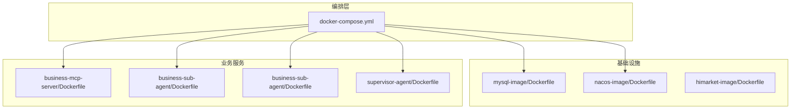
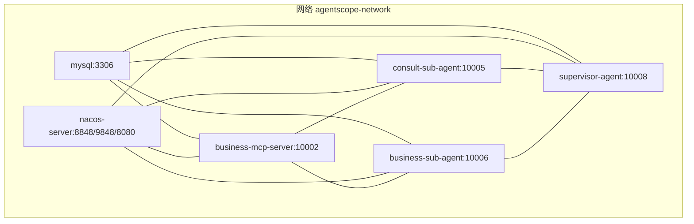
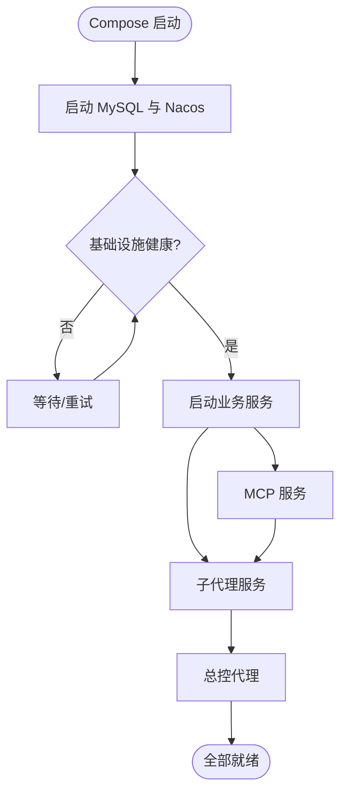

# 容器化部署

<cite>
**本文引用的文件**
- [docker-compose.yml](file://agentscope-examples/boba-tea-shop/docker-compose.yml)
- [business-mcp-server/Dockerfile](file://agentscope-examples/boba-tea-shop/business-mcp-server/Dockerfile)
- [business-sub-agent/Dockerfile](file://agentscope-examples/boba-tea-shop/business-sub-agent/Dockerfile)
- [supervisor-agent/Dockerfile](file://agentscope-examples/boba-tea-shop/supervisor-agent/Dockerfile)
- [mysql-image/Dockerfile](file://agentscope-examples/boba-tea-shop/mysql-image/Dockerfile)
- [nacos-image/Dockerfile](file://agentscope-examples/boba-tea-shop/nacos-image/Dockerfile)
- [himarket-image/Dockerfile](file://agentscope-examples/boba-tea-shop/himarket-image/Dockerfile)
- [business-mcp-server/.dockerignore](file://agentscope-examples/boba-tea-shop/business-mcp-server/.dockerignore)
- [business-sub-agent/.dockerignore](file://agentscope-examples/boba-tea-shop/business-sub-agent/.dockerignore)
- [himarket-image/.dockerignore](file://agentscope-examples/boba-tea-shop/himarket-image/.dockerignore)
- [build.sh](file://agentscope-examples/boba-tea-shop/build.sh)
- [local-deploy.sh](file://agentscope-examples/boba-tea-shop/local-deploy.sh)
</cite>

## 目录
1. [简介](#简介)
2. [项目结构](#项目结构)
3. [核心组件](#核心组件)
4. [架构总览](#架构总览)
5. [详细组件分析](#详细组件分析)
6. [依赖分析](#依赖分析)
7. [性能考虑](#性能考虑)
8. [故障排查指南](#故障排查指南)
9. [结论](#结论)
10. [附录](#附录)

## 简介
本文件面向 AgentScope Java 的容器化部署，系统性阐述 Docker 镜像构建流程（含多阶段构建与单阶段优化）、镜像大小控制与安全加固策略；详解 Docker Compose 编排配置（服务依赖、网络与卷）；逐项解析各业务组件的 Dockerfile 实现（基础镜像、环境变量、启动参数与健康检查）；并提供容器健康检查、资源限制与性能调优建议，以及容器安全最佳实践、镜像扫描与漏洞修复策略。

## 项目结构
围绕“波波茶店”示例的容器化部署，主要涉及以下目录与文件：
- 顶层编排：docker-compose.yml
- 业务镜像：business-mcp-server、business-sub-agent、supervisor-agent
- 基础设施镜像：mysql-image、nacos-image、himarket-image
- 构建脚本：根级 build.sh 与各模块 build.sh
- 本地部署脚本：local-deploy.sh
- 构建上下文排除：.dockerignore

图示来源
- [docker-compose.yml:19-255](file://agentscope-examples/boba-tea-shop/docker-compose.yml#L19-L255)
- [mysql-image/Dockerfile:1-47](file://agentscope-examples/boba-tea-shop/mysql-image/Dockerfile#L1-L47)
- [nacos-image/Dockerfile:1-47](file://agentscope-examples/boba-tea-shop/nacos-image/Dockerfile#L1-L47)
- [himarket-image/Dockerfile:1-70](file://agentscope-examples/boba-tea-shop/himarket-image/Dockerfile#L1-L70)
- [business-mcp-server/Dockerfile:1-62](file://agentscope-examples/boba-tea-shop/business-mcp-server/Dockerfile#L1-L62)
- [business-sub-agent/Dockerfile:1-55](file://agentscope-examples/boba-tea-shop/business-sub-agent/Dockerfile#L1-L55)
- [supervisor-agent/Dockerfile:1-82](file://agentscope-examples/boba-tea-shop/supervisor-agent/Dockerfile#L1-L82)

章节来源
- [docker-compose.yml:1-255](file://agentscope-examples/boba-tea-shop/docker-compose.yml#L1-L255)

## 核心组件
- 数据库（MySQL）：内置初始化 SQL 模板与数据库账号配置，支持 UTF-8 字符集与自动初始化。
- 服务注册与发现（Nacos）：单机模式，内置鉴权初始化脚本，启动时自动执行。
- 业务 MCP 服务：基于预构建 JAR 的单阶段镜像，暴露健康检查端点。
- 子代理服务：两类子代理，均使用预构建 JAR，具备健康检查。
- 总控代理（Supervisor Agent）：采用多阶段构建，前端静态资源直接由后端提供。
- Himarket 网关：基于上游镜像，安装必要工具，提供自定义入口脚本与初始化流程。

章节来源
- [mysql-image/Dockerfile:1-47](file://agentscope-examples/boba-tea-shop/mysql-image/Dockerfile#L1-L47)
- [nacos-image/Dockerfile:1-47](file://agentscope-examples/boba-tea-shop/nacos-image/Dockerfile#L1-L47)
- [business-mcp-server/Dockerfile:1-62](file://agentscope-examples/boba-tea-shop/business-mcp-server/Dockerfile#L1-L62)
- [business-sub-agent/Dockerfile:1-55](file://agentscope-examples/boba-tea-shop/business-sub-agent/Dockerfile#L1-L55)
- [supervisor-agent/Dockerfile:1-82](file://agentscope-examples/boba-tea-shop/supervisor-agent/Dockerfile#L1-L82)
- [himarket-image/Dockerfile:1-70](file://agentscope-examples/boba-tea-shop/himarket-image/Dockerfile#L1-L70)

## 架构总览
下图展示容器编排的服务拓扑、依赖关系与网络划分。

图示来源
- [docker-compose.yml:24-255](file://agentscope-examples/boba-tea-shop/docker-compose.yml#L24-L255)

章节来源
- [docker-compose.yml:19-255](file://agentscope-examples/boba-tea-shop/docker-compose.yml#L19-L255)

## 详细组件分析

### 数据库镜像（MySQL）
- 基础镜像：基于 Anolis MySQL 8.0.30，支持多架构。
- 初始化机制：通过复制初始化模板与脚本至初始化目录，容器启动时自动执行。
- 关键配置：
  - 字符集：UTF-8（utf8mb4）
  - 环境变量：DB_NAME、DB_USERNAME、DB_PASSWORD（默认值来自 compose）
  - 运行时入口：继承自基础镜像，无需覆盖
- 安全与体积：
  - 使用最小化安装（仅安装 gettext），减少包管理器缓存。
  - 排除构建无关文件，缩小构建上下文。

章节来源
- [mysql-image/Dockerfile:1-47](file://agentscope-examples/boba-tea-shop/mysql-image/Dockerfile#L1-L47)
- [.dockerignore（mysql-image）:1-39](file://agentscope-examples/boba-tea-shop/mysql-image/.dockerignore#L1-L39)

### Nacos 镜像
- 基础镜像：Nacos v3.1.1 单机版。
- 自动初始化：通过覆盖入口脚本，在启动 Nacos 同时运行初始化脚本以设置鉴权信息。
- 关键配置：
  - 运行模式：standalone
  - 认证参数：鉴权键与令牌
  - 环境变量：TZ 等

章节来源
- [nacos-image/Dockerfile:1-47](file://agentscope-examples/boba-tea-shop/nacos-image/Dockerfile#L1-L47)

### 业务 MCP 服务器
- 构建方式：单阶段，使用预构建 JAR。
- 安全加固：
  - 非 root 用户运行（创建应用组与用户，变更工作目录权限）
  - 仅暴露应用端口
- 环境变量与启动：
  - 默认端口、数据库连接、Nacos 地址与命名空间、JVM 参数等
  - 健康检查：访问 actuator/health
- 构建上下文：
  - 仅包含目标 JAR，避免无关文件进入镜像

章节来源
- [business-mcp-server/Dockerfile:1-62](file://agentscope-examples/boba-tea-shop/business-mcp-server/Dockerfile#L1-L62)
- [business-mcp-server/.dockerignore:1-62](file://agentscope-examples/boba-tea-shop/business-mcp-server/.dockerignore#L1-L62)

### 子代理服务（两类）
- 构建方式：单阶段，使用预构建 JAR。
- 安全与运行：
  - 非 root 用户运行
  - 健康检查：访问 actuator/health
- 环境变量：
  - 端口、Nacos 地址与命名空间、JVM 参数等
- 构建上下文：
  - 仅包含目标 JAR

章节来源
- [business-sub-agent/Dockerfile:1-55](file://agentscope-examples/boba-tea-shop/business-sub-agent/Dockerfile#L1-L55)
- [business-sub-agent/.dockerignore:1-60](file://agentscope-examples/boba-tea-shop/business-sub-agent/.dockerignore#L1-L60)

### 总控代理（Supervisor Agent，含前端）
- 构建方式：多阶段构建
  - 第一阶段：Node 基础镜像，安装依赖并构建前端产物
  - 第二阶段：Java 运行时镜像，拷贝后端 JAR 与前端静态资源
- 安全与运行：
  - 非 root 用户运行
  - 健康检查：访问 actuator/health
- 环境变量：
  - 端口、数据库、Nacos、模型提供商、XXL-Job 等
  - 前端静态资源路径指向 /app/static
- 构建上下文：
  - 仅包含目标 JAR 与前端产物目录

章节来源
- [supervisor-agent/Dockerfile:1-82](file://agentscope-examples/boba-tea-shop/supervisor-agent/Dockerfile#L1-L82)

### Himarket 网关镜像
- 基础镜像：基于上游镜像，指定平台为 amd64。
- 工具安装：根据可用包管理器安装 curl 与 jq。
- 初始化与入口：
  - 复制初始化脚本与入口脚本，设置环境变量
  - 覆盖入口点，先启动 Java 应用再执行初始化
- 端口：8080（显式声明）

章节来源
- [himarket-image/Dockerfile:1-70](file://agentscope-examples/boba-tea-shop/himarket-image/Dockerfile#L1-L70)
- [himarket-image/.dockerignore:1-22](file://agentscope-examples/boba-tea-shop/himarket-image/.dockerignore#L1-L22)

### Docker Compose 编排配置
- 网络：自定义桥接网络 agentscope-network
- 卷：MySQL 数据卷 mysql-data（本地驱动）
- 服务依赖：
  - 业务服务在数据库与注册中心健康后再启动
  - 总控代理额外要求 MCP 与两个子代理已启动
- 环境变量：
  - 统一通过环境变量注入模型提供商、密钥、数据库与 Nacos 配置
  - 支持通过环境变量覆盖端口映射

章节来源
- [docker-compose.yml:19-255](file://agentscope-examples/boba-tea-shop/docker-compose.yml#L19-L255)

### 构建与发布流水线
- 根级 build.sh：
  - 支持版本号、仓库、平台、测试开关、模块选择（default/all/具体模块）
  - 自动遍历模块并调用各自 build.sh
  - 可选推送镜像到仓库
- 模块 build.sh：
  - 业务镜像通常包含源码构建（Maven/NPM）与 Docker 构建两步
  - 基础设施镜像（MySQL、Nacos）为纯 Docker 镜像构建
- 本地部署脚本（可选）：
  - local-deploy.sh 提供本地直连已有 MySQL/Nacos 的一键启动流程，便于开发调试

章节来源
- [build.sh:1-199](file://agentscope-examples/boba-tea-shop/build.sh#L1-L199)
- [local-deploy.sh:1-568](file://agentscope-examples/boba-tea-shop/local-deploy.sh#L1-L568)

## 依赖分析
- 服务间依赖：
  - 业务服务（MCP、子代理、总控）依赖 MySQL 与 Nacos
  - 总控代理依赖 MCP 与两个子代理
- 编排依赖：
  - 使用 compose 的 depends_on 条件表达式，确保按顺序与健康状态启动
- 网络与卷：
  - 共享网络实现服务互通
  - MySQL 数据卷持久化

图示来源
- [docker-compose.yml:110-238](file://agentscope-examples/boba-tea-shop/docker-compose.yml#L110-L238)

章节来源
- [docker-compose.yml:19-255](file://agentscope-examples/boba-tea-shop/docker-compose.yml#L19-L255)

## 性能考虑
- JVM 内存参数：
  - 各镜像通过环境变量或启动参数设置初始与最大堆大小，建议结合实际负载调整
- 前端构建优化（Supervisor Agent）：
  - 多阶段构建分离前端构建与运行时，减少最终镜像体积
- 端口与网络：
  - 仅暴露必要端口，降低网络面开销
- 健康检查：
  - actuator/health 作为轻量探针，建议配合重启策略与延迟启动使用

章节来源
- [business-mcp-server/Dockerfile:44-61](file://agentscope-examples/boba-tea-shop/business-mcp-server/Dockerfile#L44-L61)
- [business-sub-agent/Dockerfile:42-53](file://agentscope-examples/boba-tea-shop/business-sub-agent/Dockerfile#L42-L53)
- [supervisor-agent/Dockerfile:64-81](file://agentscope-examples/boba-tea-shop/supervisor-agent/Dockerfile#L64-L81)

## 故障排查指南
- 健康检查失败：
  - 检查 actuator/health 是否可达（端口、环境变量 SERVER_PORT）
  - 查看容器日志与启动参数是否正确
- 服务依赖问题：
  - 确认 MySQL 与 Nacos 健康检查通过
  - 校验 Nacos 注册地址与命名空间配置
- 端口冲突：
  - 修改 compose 中的 host:container 映射端口
- 前端不可用（Supervisor Agent）：
  - 确认前端静态资源已复制到 /app/static
- 构建上下文过大：
  - 检查 .dockerignore，确保仅包含必要文件

章节来源
- [docker-compose.yml:41-46](file://agentscope-examples/boba-tea-shop/docker-compose.yml#L41-L46)
- [business-mcp-server/Dockerfile:56-58](file://agentscope-examples/boba-tea-shop/business-mcp-server/Dockerfile#L56-L58)
- [business-sub-agent/Dockerfile:48-50](file://agentscope-examples/boba-tea-shop/business-sub-agent/Dockerfile#L48-L50)
- [supervisor-agent/Dockerfile:78-80](file://agentscope-examples/boba-tea-shop/supervisor-agent/Dockerfile#L78-L80)

## 结论
该容器化方案通过单阶段与多阶段镜像组合，兼顾构建效率与镜像体积；借助 Compose 的健康检查与依赖条件，保障服务有序启动；通过非 root 用户、最小化安装与明确端口暴露实现安全加固。建议在生产环境中进一步引入资源限制、镜像扫描与漏洞修复流程，持续提升安全性与稳定性。

## 附录

### 容器安全最佳实践
- 最小权限：始终以非 root 用户运行
- 最小镜像：仅安装必要工具，清理包管理器缓存
- 明确暴露：仅暴露必要端口
- 健康检查：使用轻量探针，配合重启策略
- 配置管理：敏感信息通过环境变量或密文存储，避免硬编码

### 镜像扫描与漏洞修复
- 扫描工具：使用企业级镜像扫描平台（如 Harbor、Clair、Trivy 等）
- 周期性扫描：CI/CD 中集成镜像扫描与阻断
- 修复策略：优先升级基础镜像版本，其次修补运行时依赖

### 资源限制与性能调优
- CPU/内存配额：在 Compose 中设置 deploy.resources
- JVM 参数：依据负载调整堆大小与 GC 策略
- 并发与连接池：合理配置数据库连接数与模型服务并发