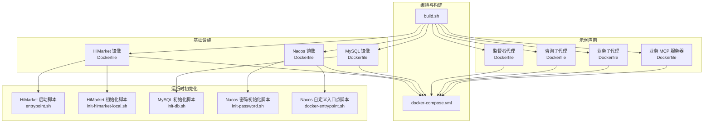
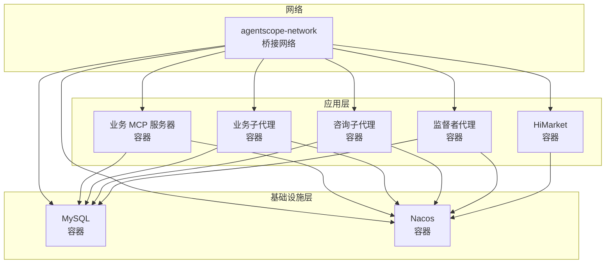
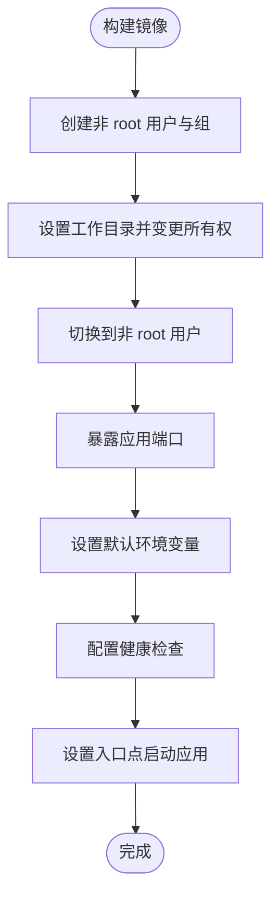
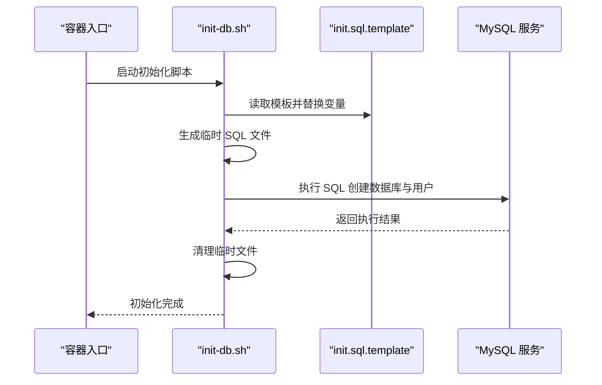
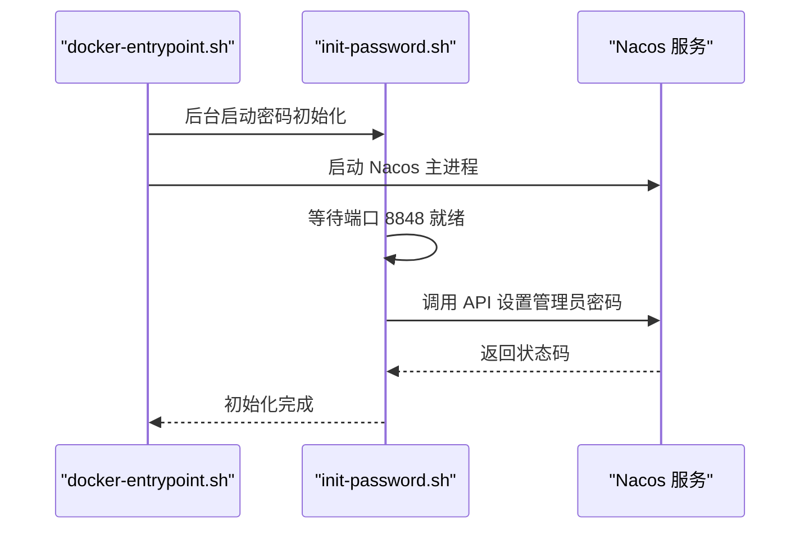
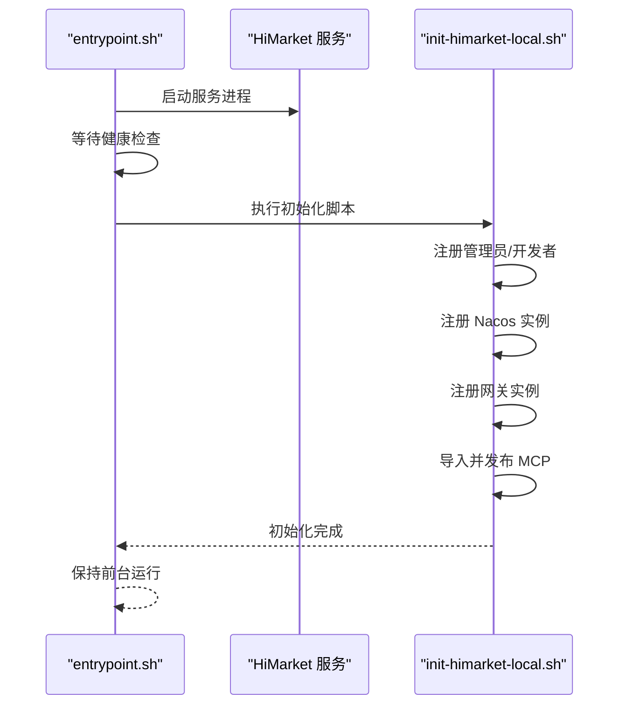
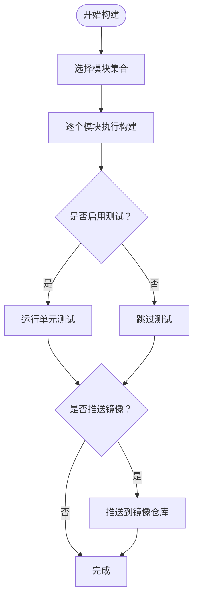
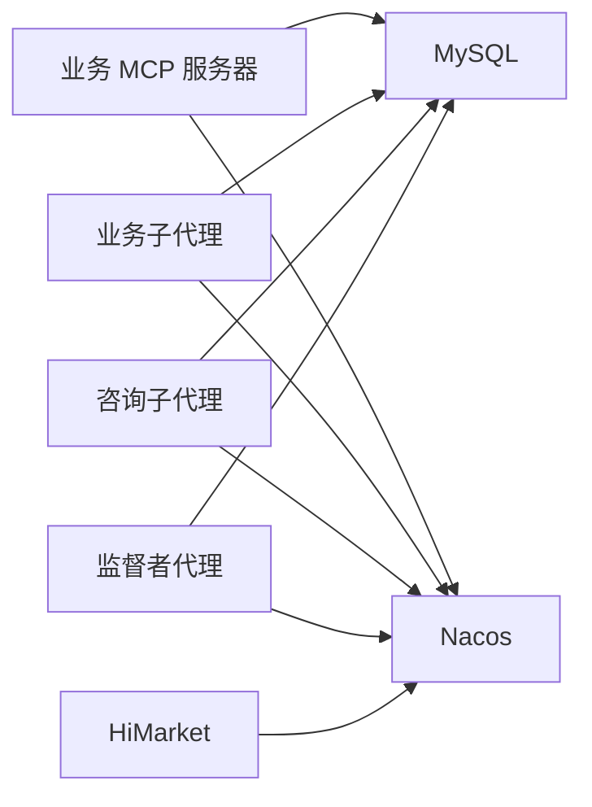

# 容器安全配置

<cite>
**本文档引用的文件**
- [Dockerfile（业务 MCP 服务器）](file://agentscope-examples/boba-tea-shop/business-mcp-server/Dockerfile)
- [Dockerfile（业务子代理）](file://agentscope-examples/boba-tea-shop/business-sub-agent/Dockerfile)
- [Dockerfile（咨询子代理）](file://agentscope-examples/boba-tea-shop/consult-sub-agent/Dockerfile)
- [Dockerfile（监督者代理）](file://agentscope-examples/boba-tea-shop/supervisor-agent/Dockerfile)
- [Dockerfile（HiMarket 镜像）](file://agentscope-examples/boba-tea-shop/himarket-image/Dockerfile)
- [Dockerfile（MySQL 镜像）](file://agentscope-examples/boba-tea-shop/mysql-image/Dockerfile)
- [Dockerfile（Nacos 镜像）](file://agentscope-examples/boba-tea-shop/nacos-image/Dockerfile)
- [Docker Compose 配置](file://agentscope-examples/boba-tea-shop/docker-compose.yml)
- [构建脚本](file://agentscope-examples/boba-tea-shop/build.sh)
- [HiMarket 启动脚本](file://agentscope-examples/boba-tea-shop/himarket-image/entrypoint.sh)
- [HiMarket 初始化脚本](file://agentscope-examples/boba-tea-shop/himarket-image/init-himarket-local.sh)
- [MySQL 初始化脚本](file://agentscope-examples/boba-tea-shop/mysql-image/init-db.sh)
- [Nacos 密码初始化脚本](file://agentscope-examples/boba-tea-shop/nacos-image/init-password.sh)
- [Nacos 自定义入口点脚本](file://agentscope-examples/boba-tea-shop/nacos-image/docker-entrypoint.sh)
- [MySQL 配置文件](file://agentscope-examples/boba-tea-shop/mysql-image/my.cnf)
- [MySQL 初始化模板](file://agentscope-examples/boba-tea-shop/mysql-image/init.sql.template)
</cite>

## 目录
1. [简介](#简介)
2. [项目结构](#项目结构)
3. [核心组件](#核心组件)
4. [架构总览](#架构总览)
5. [详细组件分析](#详细组件分析)
6. [依赖关系分析](#依赖关系分析)
7. [性能考量](#性能考量)
8. [故障排查指南](#故障排查指南)
9. [结论](#结论)
10. [附录](#附录)

## 简介
本文件面向 AgentScope Java 项目的容器化部署，系统性梳理容器安全配置与最佳实践，覆盖以下主题：
- 最小权限原则、非 root 用户运行与只读文件系统配置
- 镜像安全扫描流程、漏洞检测与修复策略
- 敏感信息保护：密钥管理、环境变量加密与配置文件安全
- 容器运行时安全配置、网络安全策略与访问控制列表设置
- 安全审计、合规性检查与安全事件响应指南
- 容器镜像签名、供应链安全与依赖漏洞管理

本指南基于仓库中的实际 Dockerfile、Compose 配置与初始化脚本进行分析，并提供可操作的改进建议。

## 项目结构
AgentScope Java 的容器化示例位于 boba-tea-shop 示例工程中，包含多类服务镜像与编排配置：
- 业务服务镜像：业务 MCP 服务器、业务子代理、咨询子代理、监督者代理
- 基础设施镜像：MySQL、Nacos、HiMarket
- 编排与构建：docker-compose.yml、build.sh
- 运行时初始化：entrypoint.sh、init-himarket-local.sh、init-db.sh、init-password.sh、docker-entrypoint.sh

图表来源
- [Dockerfile（业务 MCP 服务器）:1-62](file://agentscope-examples/boba-tea-shop/business-mcp-server/Dockerfile#L1-L62)
- [Dockerfile（业务子代理）:1-55](file://agentscope-examples/boba-tea-shop/business-sub-agent/Dockerfile#L1-L55)
- [Dockerfile（咨询子代理）:1-61](file://agentscope-examples/boba-tea-shop/consult-sub-agent/Dockerfile#L1-L61)
- [Dockerfile（监督者代理）:1-82](file://agentscope-examples/boba-tea-shop/supervisor-agent/Dockerfile#L1-L82)
- [Dockerfile（HiMarket 镜像）:1-70](file://agentscope-examples/boba-tea-shop/himarket-image/Dockerfile#L1-L70)
- [Dockerfile（MySQL 镜像）:1-47](file://agentscope-examples/boba-tea-shop/mysql-image/Dockerfile#L1-L47)
- [Dockerfile（Nacos 镜像）:1-47](file://agentscope-examples/boba-tea-shop/nacos-image/Dockerfile#L1-L47)
- [Docker Compose 配置:1-255](file://agentscope-examples/boba-tea-shop/docker-compose.yml#L1-L255)
- [构建脚本:1-199](file://agentscope-examples/boba-tea-shop/build.sh#L1-L199)
- [HiMarket 启动脚本:1-100](file://agentscope-examples/boba-tea-shop/himarket-image/entrypoint.sh#L1-L100)
- [HiMarket 初始化脚本:1-1072](file://agentscope-examples/boba-tea-shop/himarket-image/init-himarket-local.sh#L1-L1072)
- [MySQL 初始化脚本:1-30](file://agentscope-examples/boba-tea-shop/mysql-image/init-db.sh#L1-L30)
- [Nacos 密码初始化脚本:1-67](file://agentscope-examples/boba-tea-shop/nacos-image/init-password.sh#L1-L67)
- [Nacos 自定义入口点脚本:1-14](file://agentscope-examples/boba-tea-shop/nacos-image/docker-entrypoint.sh#L1-L14)

章节来源
- [Docker Compose 配置:1-255](file://agentscope-examples/boba-tea-shop/docker-compose.yml#L1-L255)
- [构建脚本:1-199](file://agentscope-examples/boba-tea-shop/build.sh#L1-L199)

## 核心组件
- 业务服务镜像（业务 MCP 服务器、业务子代理、咨询子代理、监督者代理）
  - 统一使用 eclipse-temurin:17-jre 作为基础镜像
  - 创建非 root 用户并切换执行，暴露应用端口，设置默认环境变量，配置健康检查
  - 监督者代理同时包含前端静态资源，通过环境变量指定静态资源路径
- 基础设施镜像（MySQL、Nacos、HiMarket）
  - MySQL：自定义配置文件启用 utf8mb4，初始化数据库与用户，模板化 SQL 脚本
  - Nacos：自定义入口点在后台启动密码初始化脚本，再启动 Nacos
  - HiMarket：自定义入口点先启动服务，再执行初始化脚本，支持自动注册与发布
- 编排与构建
  - docker-compose.yml 将所有服务置于同一桥接网络，定义健康检查与依赖关系
  - build.sh 支持模块化构建、平台选择、推送与测试开关

章节来源
- [Dockerfile（业务 MCP 服务器）:15-62](file://agentscope-examples/boba-tea-shop/business-mcp-server/Dockerfile#L15-L62)
- [Dockerfile（业务子代理）:15-55](file://agentscope-examples/boba-tea-shop/business-sub-agent/Dockerfile#L15-L55)
- [Dockerfile（咨询子代理）:15-61](file://agentscope-examples/boba-tea-shop/consult-sub-agent/Dockerfile#L15-L61)
- [Dockerfile（监督者代理）:15-82](file://agentscope-examples/boba-tea-shop/supervisor-agent/Dockerfile#L15-L82)
- [Dockerfile（MySQL 镜像）:15-47](file://agentscope-examples/boba-tea-shop/mysql-image/Dockerfile#L15-L47)
- [Dockerfile（Nacos 镜像）:15-47](file://agentscope-examples/boba-tea-shop/nacos-image/Dockerfile#L15-L47)
- [Dockerfile（HiMarket 镜像）:15-70](file://agentscope-examples/boba-tea-shop/himarket-image/Dockerfile#L15-L70)
- [Docker Compose 配置:19-255](file://agentscope-examples/boba-tea-shop/docker-compose.yml#L19-L255)
- [构建脚本:22-199](file://agentscope-examples/boba-tea-shop/build.sh#L22-L199)

## 架构总览
下图展示容器化部署的整体架构与交互关系，强调最小权限、网络隔离与运行时初始化流程。

图表来源
- [Docker Compose 配置:24-255](file://agentscope-examples/boba-tea-shop/docker-compose.yml#L24-L255)

## 详细组件分析

### 业务服务镜像（最小权限与运行时配置）
- 最小权限原则
  - 使用 RUN 创建非 root 组与用户，WORKDIR 设置后 chown 将目录所有权归还给非 root 用户，最终通过 USER 切换执行
- 非 root 用户运行
  - 所有业务镜像均在镜像构建阶段完成用户与权限设置，运行时以非 root 身份启动
- 只读文件系统
  - 当前镜像未启用只读根文件系统；建议在生产环境中通过容器运行时参数启用（例如 Kubernetes 的 readOnlyRootFilesystem），并仅挂载必要的卷
- 健康检查
  - 业务镜像均配置 HEALTHCHECK，通过本地 HTTP 探针验证健康状态
- 环境变量与敏感信息
  - 镜像内设置了数据库凭据与模型密钥等敏感信息的默认值，建议在编排或运行时通过外部机密管理（如 Kubernetes Secret、Vault）注入，避免硬编码

图表来源
- [Dockerfile（业务 MCP 服务器）:25-61](file://agentscope-examples/boba-tea-shop/business-mcp-server/Dockerfile#L25-L61)
- [Dockerfile（业务子代理）:24-53](file://agentscope-examples/boba-tea-shop/business-sub-agent/Dockerfile#L24-L53)
- [Dockerfile（咨询子代理）:24-59](file://agentscope-examples/boba-tea-shop/consult-sub-agent/Dockerfile#L24-L59)
- [Dockerfile（监督者代理）:44-81](file://agentscope-examples/boba-tea-shop/supervisor-agent/Dockerfile#L44-L81)

章节来源
- [Dockerfile（业务 MCP 服务器）:25-61](file://agentscope-examples/boba-tea-shop/business-mcp-server/Dockerfile#L25-L61)
- [Dockerfile（业务子代理）:24-53](file://agentscope-examples/boba-tea-shop/business-sub-agent/Dockerfile#L24-L53)
- [Dockerfile（咨询子代理）:24-59](file://agentscope-examples/boba-tea-shop/consult-sub-agent/Dockerfile#L24-L59)
- [Dockerfile（监督者代理）:44-81](file://agentscope-examples/boba-tea-shop/supervisor-agent/Dockerfile#L44-L81)

### 数据库镜像（MySQL）
- 字符集与时区
  - 通过 my.cnf 配置 utf8mb4 与默认时区，确保多语言与本地化显示正确
- 初始化流程
  - 使用 envsubst 处理模板 SQL，生成临时 SQL 文件并执行，随后清理临时文件
  - 模板中包含用户、数据库与权限的创建与授权逻辑
- 安全建议
  - 在生产环境，建议将 root 密码与业务用户凭据通过 Secret 注入，避免在镜像或模板中硬编码
  - 限制数据库监听地址与访问源，配合网络策略实现最小暴露面

图表来源
- [MySQL 初始化脚本:1-30](file://agentscope-examples/boba-tea-shop/mysql-image/init-db.sh#L1-L30)
- [MySQL 初始化模板:1-358](file://agentscope-examples/boba-tea-shop/mysql-image/init.sql.template#L1-L358)
- [MySQL 配置文件:15-36](file://agentscope-examples/boba-tea-shop/mysql-image/my.cnf#L15-L36)

章节来源
- [Dockerfile（MySQL 镜像）:15-47](file://agentscope-examples/boba-tea-shop/mysql-image/Dockerfile#L15-L47)
- [MySQL 初始化脚本:1-30](file://agentscope-examples/boba-tea-shop/mysql-image/init-db.sh#L1-L30)
- [MySQL 初始化模板:1-358](file://agentscope-examples/boba-tea-shop/mysql-image/init.sql.template#L1-L358)
- [MySQL 配置文件:15-36](file://agentscope-examples/boba-tea-shop/mysql-image/my.cnf#L15-L36)

### 服务注册与发现（Nacos）
- 启动流程
  - 自定义入口点在后台启动密码初始化脚本，随后启动 Nacos 主进程
  - 密码初始化脚本等待端口就绪后调用 API 设置管理员密码
- 安全建议
  - 生产环境应通过 Secret 注入初始密码，避免明文写入镜像
  - 结合网络策略限制对 Nacos 的访问范围

图表来源
- [Nacos 自定义入口点脚本:1-14](file://agentscope-examples/boba-tea-shop/nacos-image/docker-entrypoint.sh#L1-L14)
- [Nacos 密码初始化脚本:1-67](file://agentscope-examples/boba-tea-shop/nacos-image/init-password.sh#L1-L67)

章节来源
- [Dockerfile（Nacos 镜像）:15-47](file://agentscope-examples/boba-tea-shop/nacos-image/Dockerfile#L15-L47)
- [Nacos 自定义入口点脚本:1-14](file://agentscope-examples/boba-tea-shop/nacos-image/docker-entrypoint.sh#L1-L14)
- [Nacos 密码初始化脚本:1-67](file://agentscope-examples/boba-tea-shop/nacos-image/init-password.sh#L1-L67)

### 高级网关（HiMarket）
- 启动与初始化
  - 先启动服务进程，等待健康检查通过后执行初始化脚本
  - 初始化脚本支持管理员账户、开发者账户、Nacos 注册、网关注册与 MCP 发布等步骤
- 安全建议
  - 初始化脚本中涉及的凭据与配置应来自外部机密，避免硬编码
  - 对外暴露端口应配合网络策略与 TLS 终止

图表来源
- [HiMarket 启动脚本:1-100](file://agentscope-examples/boba-tea-shop/himarket-image/entrypoint.sh#L1-L100)
- [HiMarket 初始化脚本:1-1072](file://agentscope-examples/boba-tea-shop/himarket-image/init-himarket-local.sh#L1-L1072)

章节来源
- [Dockerfile（HiMarket 镜像）:15-70](file://agentscope-examples/boba-tea-shop/himarket-image/Dockerfile#L15-L70)
- [HiMarket 启动脚本:1-100](file://agentscope-examples/boba-tea-shop/himarket-image/entrypoint.sh#L1-L100)
- [HiMarket 初始化脚本:1-1072](file://agentscope-examples/boba-tea-shop/himarket-image/init-himarket-local.sh#L1-L1072)

### 编排与构建（docker-compose 与 build.sh）
- 网络与卷
  - 所有服务置于同一桥接网络，MySQL 数据持久化至本地卷
- 健康检查
  - MySQL 与 Nacos 均配置健康检查，业务服务通过容器内 HTTP 探针
- 构建流程
  - build.sh 支持模块化构建、平台选择、推送与测试开关，便于 CI/CD 集成

图表来源
- [构建脚本:138-199](file://agentscope-examples/boba-tea-shop/build.sh#L138-L199)
- [Docker Compose 配置:19-255](file://agentscope-examples/boba-tea-shop/docker-compose.yml#L19-L255)

章节来源
- [Docker Compose 配置:19-255](file://agentscope-examples/boba-tea-shop/docker-compose.yml#L19-L255)
- [构建脚本:138-199](file://agentscope-examples/boba-tea-shop/build.sh#L138-L199)

## 依赖关系分析
- 组件耦合
  - 业务服务镜像依赖 MySQL 与 Nacos，且通过环境变量传递连接信息
  - HiMarket 依赖 Nacos 进行服务注册与 MCP 管理
- 外部依赖
  - 基础镜像版本（如 eclipse-temurin:17-jre、nacos/nacos-server、mysql:8.0.30）需纳入供应链安全与漏洞扫描范围
- 潜在风险
  - 镜像内硬编码敏感信息（如数据库密码、模型密钥）可能被提取
  - 默认网络策略缺失可能导致服务间横向移动

图表来源
- [Docker Compose 配置:79-239](file://agentscope-examples/boba-tea-shop/docker-compose.yml#L79-L239)

章节来源
- [Docker Compose 配置:79-239](file://agentscope-examples/boba-tea-shop/docker-compose.yml#L79-L239)

## 性能考量
- 镜像大小与层数
  - 建议合并多条 RUN 指令，清理包管理器缓存，减少镜像层数与体积
- JVM 参数
  - 通过 JAVA_OPTS 控制堆大小，结合容器资源限制（requests/limits）实现稳定性能
- 健康检查频率
  - 合理设置 HEALTHCHECK 的间隔与超时，避免过度探测影响性能

## 故障排查指南
- 健康检查失败
  - 检查容器日志与端口可达性，确认应用端口与健康检查路径一致
- 数据库初始化失败
  - 核对环境变量注入与模板替换是否正确，确认 root 密码与目标数据库名称
- Nacos 密码设置异常
  - 查看初始化脚本输出，确认端口就绪与 API 返回状态码
- HiMarket 初始化失败
  - 关注初始化脚本的依赖项（Nacos、网关）是否可用，核对凭据与配置

章节来源
- [Docker Compose 配置:41-71](file://agentscope-examples/boba-tea-shop/docker-compose.yml#L41-L71)
- [MySQL 初始化脚本:1-30](file://agentscope-examples/boba-tea-shop/mysql-image/init-db.sh#L1-L30)
- [Nacos 密码初始化脚本:1-67](file://agentscope-examples/boba-tea-shop/nacos-image/init-password.sh#L1-L67)
- [HiMarket 启动脚本:1-100](file://agentscope-examples/boba-tea-shop/himarket-image/entrypoint.sh#L1-L100)
- [HiMarket 初始化脚本:1-1072](file://agentscope-examples/boba-tea-shop/himarket-image/init-himarket-local.sh#L1-L1072)

## 结论
本项目在容器安全方面已具备基础实践：非 root 用户运行、健康检查与模块化构建。为进一步提升安全性与可运维性，建议：
- 引入只读根文件系统与最小权限卷挂载
- 使用外部机密管理替代镜像内硬编码
- 增强网络策略与 TLS 终止
- 建立镜像扫描与漏洞修复流程
- 完善安全审计与事件响应机制

## 附录
- 容器安全最佳实践清单
  - 最小权限：始终以非 root 用户运行，限制容器能力
  - 只读文件系统：生产环境启用，仅挂载必要卷
  - 网络策略：最小暴露面，服务间通信加密
  - 机密管理：Secret/Key Management，避免硬编码
  - 镜像扫描：CI 中集成漏洞扫描与基线校验
  - 审计与合规：日志采集、合规检查与事件响应