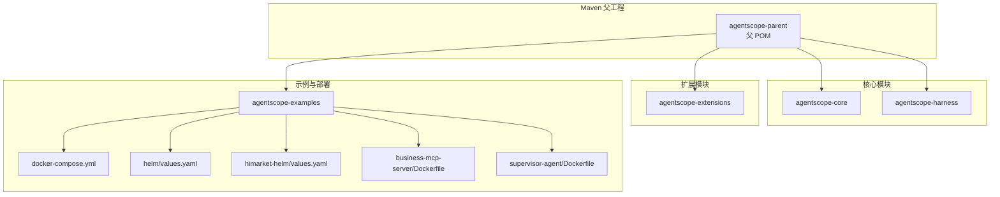
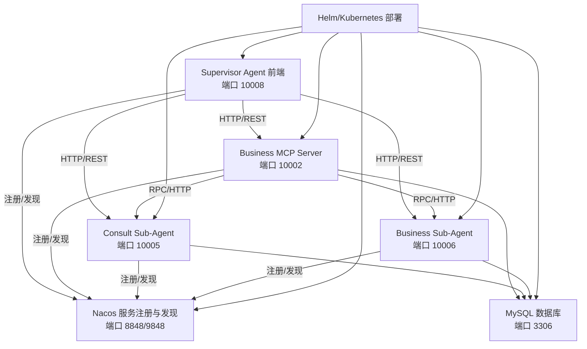
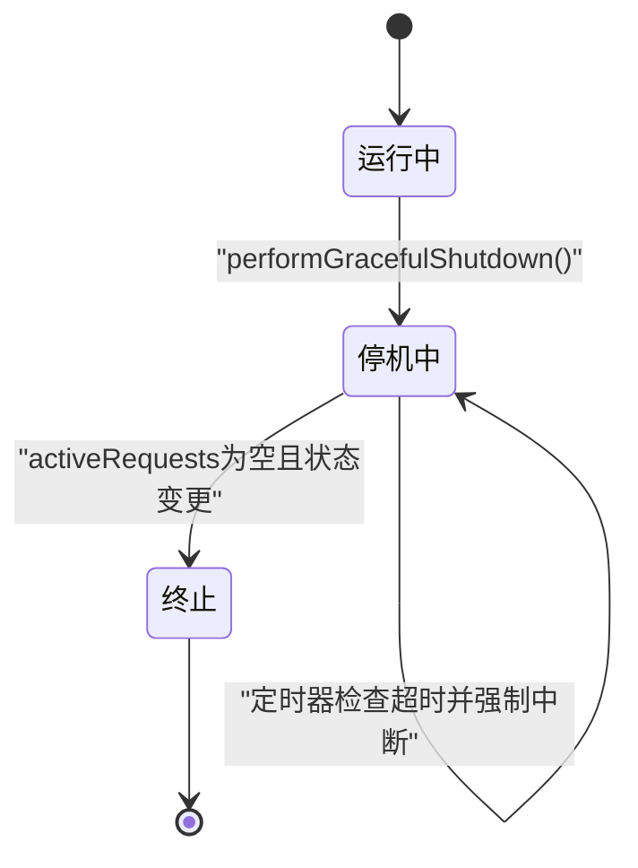
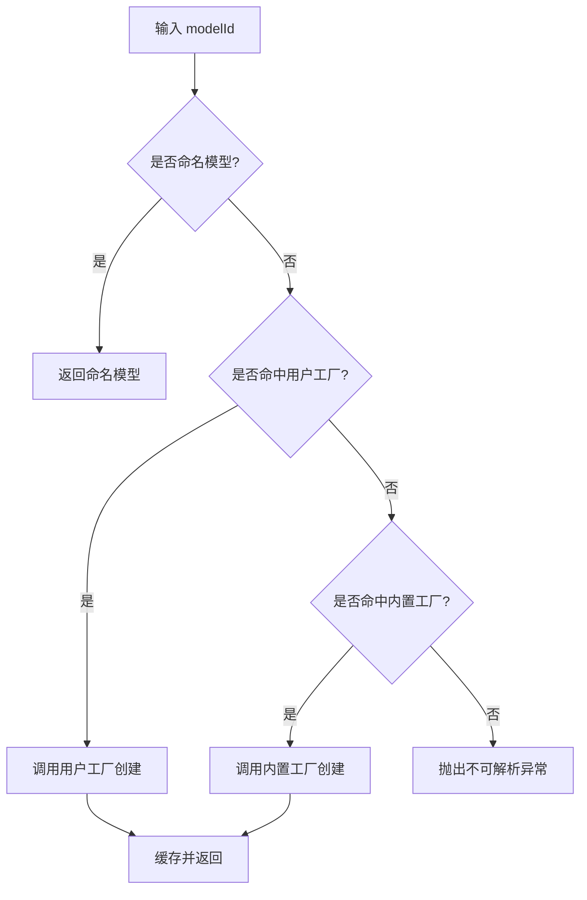
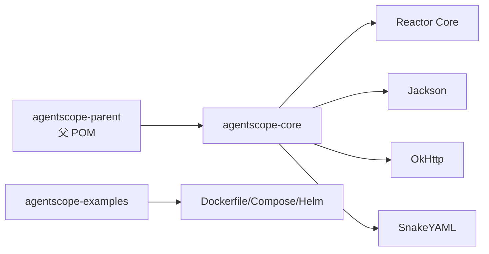
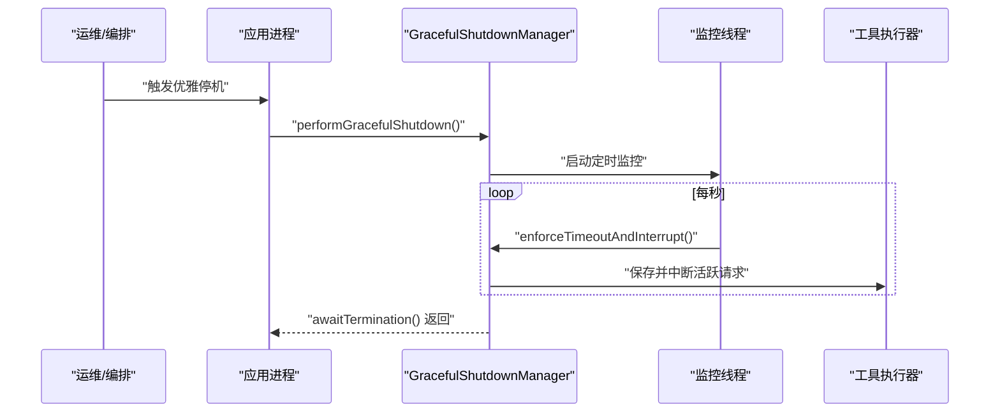

# 生产环境优化

<cite>
**本文引用的文件**   
- [pom.xml](file://pom.xml)
- [agentscope-core/pom.xml](file://agentscope-core/pom.xml)
- [agentscope-examples/a2a/src/main/resources/application.yml](file://agentscope-examples/a2a/src/main/resources/application.yml)
- [agentscope-examples/graceful-shutdown/src/main/resources/application.yml](file://agentscope-examples/graceful-shutdown/src/main/resources/application.yml)
- [agentscope-examples/boba-tea-shop/docker-compose.yml](file://agentscope-examples/boba-tea-shop/docker-compose.yml)
- [agentscope-examples/boba-tea-shop/helm/values.yaml](file://agentscope-examples/boba-tea-shop/helm/values.yaml)
- [agentscope-examples/boba-tea-shop/himarket-helm/values.yaml](file://agentscope-examples/boba-tea-shop/himarket-helm/values.yaml)
- [agentscope-examples/boba-tea-shop/business-mcp-server/Dockerfile](file://agentscope-examples/boba-tea-shop/business-mcp-server/Dockerfile)
- [agentscope-examples/boba-tea-shop/supervisor-agent/Dockerfile](file://agentscope-examples/boba-tea-shop/supervisor-agent/Dockerfile)
- [agentscope-core/src/main/java/io/agentscope/core/Version.java](file://agentscope-core/src/main/java/io/agentscope/core/Version.java)
- [agentscope-core/src/main/java/io/agentscope/core/shutdown/GracefulShutdownManager.java](file://agentscope-core/src/main/java/io/agentscope/core/shutdown/GracefulShutdownManager.java)
- [agentscope-core/src/main/java/io/agentscope/core/model/ModelRegistry.java](file://agentscope-core/src/main/java/io/agentscope/core/model/ModelRegistry.java)
</cite>

## 目录
1. [引言](#引言)
2. [项目结构](#项目结构)
3. [核心组件](#核心组件)
4. [架构总览](#架构总览)
5. [详细组件分析](#详细组件分析)
6. [依赖关系分析](#依赖关系分析)
7. [性能考量](#性能考量)
8. [故障排查指南](#故障排查指南)
9. [结论](#结论)
10. [附录](#附录)

## 引言
本文件面向 AgentScope Java 在生产环境中的优化与落地，围绕性能调优（JVM 参数、GC、内存池）、容量规划（资源评估、压测与基准）、高可用设计（多副本、故障转移、备份）、安全加固（网络、访问控制、漏洞防护）、灾备与连续性（灾难恢复、业务连续性、应急响应）以及成本优化（资源利用率与运维效率）展开，结合仓库中现有配置与实现进行系统化梳理与最佳实践建议。

## 项目结构
AgentScope Java 采用多模块 Maven 结构，核心模块包含 agentscope-core、agentscope-extensions、agentscope-examples、agentscope-harness 等；examples 提供多种部署形态（Docker Compose、Helm、Kubernetes）与示例应用（A2A、Graceful Shutdown、Bobo Tea Shop、HiMarket），便于在生产环境中参考其资源配置、健康检查与运行参数。

图示来源
- [pom.xml:56-63](file://pom.xml#L56-L63)
- [agentscope-examples/boba-tea-shop/docker-compose.yml:19-255](file://agentscope-examples/boba-tea-shop/docker-compose.yml#L19-L255)
- [agentscope-examples/boba-tea-shop/helm/values.yaml:1-115](file://agentscope-examples/boba-tea-shop/helm/values.yaml#L1-L115)
- [agentscope-examples/boba-tea-shop/himarket-helm/values.yaml:1-227](file://agentscope-examples/boba-tea-shop/himarket-helm/values.yaml#L1-L227)
- [agentscope-examples/boba-tea-shop/business-mcp-server/Dockerfile:15-62](file://agentscope-examples/boba-tea-shop/business-mcp-server/Dockerfile#L15-L62)
- [agentscope-examples/boba-tea-shop/supervisor-agent/Dockerfile:15-82](file://agentscope-examples/boba-tea-shop/supervisor-agent/Dockerfile#L15-L82)

章节来源
- [pom.xml:56-63](file://pom.xml#L56-L63)

## 核心组件
- 版本与用户代理：统一版本号与 User-Agent 生成，便于统计与追踪。
- 优雅停机管理器：全局管理请求生命周期、超时中断与终止等待，确保停机期间有界状态与会话一致性。
- 模型注册中心：按命名或正则工厂解析模型实例，内置多家模型提供商，支持缓存与重置。

章节来源
- [agentscope-core/src/main/java/io/agentscope/core/Version.java:24-45](file://agentscope-core/src/main/java/io/agentscope/core/Version.java#L24-L45)
- [agentscope-core/src/main/java/io/agentscope/core/shutdown/GracefulShutdownManager.java:41-321](file://agentscope-core/src/main/java/io/agentscope/core/shutdown/GracefulShutdownManager.java#L41-L321)
- [agentscope-core/src/main/java/io/agentscope/core/model/ModelRegistry.java:35-260](file://agentscope-core/src/main/java/io/agentscope/core/model/ModelRegistry.java#L35-L260)

## 架构总览
下图展示生产环境典型拓扑：前端服务（Supervisor Agent）与后端子代理通过 Nacos 注册发现，业务 MCP 服务器承载 RAG/记忆等能力，数据库（MySQL）持久化状态与会话，容器编排通过 Docker Compose 或 Helm/Kubernetes 实现。

图示来源
- [agentscope-examples/boba-tea-shop/docker-compose.yml:79-239](file://agentscope-examples/boba-tea-shop/docker-compose.yml#L79-L239)
- [agentscope-examples/boba-tea-shop/helm/values.yaml:59-115](file://agentscope-examples/boba-tea-shop/helm/values.yaml#L59-L115)
- [agentscope-examples/boba-tea-shop/himarket-helm/values.yaml:29-71](file://agentscope-examples/boba-tea-shop/himarket-helm/values.yaml#L29-L71)

## 详细组件分析

### 组件一：优雅停机与请求生命周期
- 全局状态机：RUNNING → SHUTTING_DOWN → TERMINATED，配合定时监控强制超时中断。
- 请求跟踪：按 Agent 维度登记/注销活跃请求，支持会话绑定与中断标记清理。
- 超时信号：基于 Reactor 的 Mono 信号，工具执行可竞速中断。
- 停机等待：阻塞等待至终止或超时返回。

图示来源
- [agentscope-core/src/main/java/io/agentscope/core/shutdown/GracefulShutdownManager.java:46-303](file://agentscope-core/src/main/java/io/agentscope/core/shutdown/GracefulShutdownManager.java#L46-L303)

章节来源
- [agentscope-core/src/main/java/io/agentscope/core/shutdown/GracefulShutdownManager.java:41-321](file://agentscope-core/src/main/java/io/agentscope/core/shutdown/GracefulShutdownManager.java#L41-L321)

### 组件二：模型注册与解析
- 命名模型优先：精确名称匹配直接返回。
- 工厂解析：用户注册工厂优先于内置规则，支持正则匹配与缓存。
- 内置提供程序：OpenAI、DashScope、Gemini、Anthropic、Ollama，自动读取环境变量。
- 错误提示：清晰的不可解析原因列表，便于定位配置问题。

图示来源
- [agentscope-core/src/main/java/io/agentscope/core/model/ModelRegistry.java:142-201](file://agentscope-core/src/main/java/io/agentscope/core/model/ModelRegistry.java#L142-L201)

章节来源
- [agentscope-core/src/main/java/io/agentscope/core/model/ModelRegistry.java:35-260](file://agentscope-core/src/main/java/io/agentscope/core/model/ModelRegistry.java#L35-L260)

### 组件三：A2A 示例与 Nacos 集成
- 应用端口与 Banner 关闭，便于容器日志与自动化。
- Agent 配置启用 ReActAgent，技能卡片描述与文档链接完善。
- Nacos 开关与地址、凭据通过环境变量注入，支持本地/远程。

章节来源
- [agentscope-examples/a2a/src/main/resources/application.yml:16-65](file://agentscope-examples/a2a/src/main/resources/application.yml#L16-L65)

### 组件四：Graceful Shutdown 示例
- Spring Server 启用 graceful shutdown，生命周期阶段超时设置较长。
- 模型名称与停机相关策略（超时秒数、部分推理策略）通过配置项控制。

章节来源
- [agentscope-examples/graceful-shutdown/src/main/resources/application.yml:15-29](file://agentscope-examples/graceful-shutdown/src/main/resources/application.yml#L15-L29)

### 组件五：Docker 与容器运行参数
- 业务 MCP 与 Supervisor Agent 使用非 root 用户运行，降低权限风险。
- 默认 JAVA_OPTS 设置为 -Xms512m -Xmx1024m，建议结合实际负载调整。
- 健康检查通过 actuator/health 探针，便于编排器快速感知状态。

章节来源
- [agentscope-examples/boba-tea-shop/business-mcp-server/Dockerfile:25-61](file://agentscope-examples/boba-tea-shop/business-mcp-server/Dockerfile#L25-L61)
- [agentscope-examples/boba-tea-shop/supervisor-agent/Dockerfile:44-82](file://agentscope-examples/boba-tea-shop/supervisor-agent/Dockerfile#L44-L82)

### 组件六：Docker Compose 与 Helm 部署
- Docker Compose：MySQL、Nacos、MCP Server、Sub-Agent、Supervisor Agent 串联，健康检查与依赖顺序明确。
- Helm/values：镜像仓库、数据库、Nacos、DashScope、Mem0、服务开关等集中配置，便于生产部署与参数覆盖。

章节来源
- [agentscope-examples/boba-tea-shop/docker-compose.yml:19-255](file://agentscope-examples/boba-tea-shop/docker-compose.yml#L19-L255)
- [agentscope-examples/boba-tea-shop/helm/values.yaml:18-115](file://agentscope-examples/boba-tea-shop/helm/values.yaml#L18-L115)
- [agentscope-examples/boba-tea-shop/himarket-helm/values.yaml:85-146](file://agentscope-examples/boba-tea-shop/himarket-helm/values.yaml#L85-L146)

## 依赖关系分析
- 父 POM 定义统一 Java 版本与插件版本，继承子模块默认 JVM 参数（-Xms512m -Xmx1024m）。
- agentscope-core 依赖 Reactor、Jackson、OkHttp、YAML、OpenTelemetry 测试依赖等，体现异步流式处理、序列化与可观测性基础。
- 示例模块提供容器与编排模板，便于在生产中复用。

图示来源
- [pom.xml:29-54](file://pom.xml#L29-L54)
- [agentscope-core/pom.xml:51-154](file://agentscope-core/pom.xml#L51-L154)

章节来源
- [pom.xml:29-54](file://pom.xml#L29-L54)
- [agentscope-core/pom.xml:51-154](file://agentscope-core/pom.xml#L51-L154)

## 性能考量

### JVM 参数优化
- 当前默认值：父工程与子模块均设置 -Xms512m -Xmx1024m，适合轻量演示，生产需根据 QPS、并发连接数、消息体大小与 GC 行为进行上调。
- 建议策略：
  - 初步以 2G~4G 上限起步，观察堆外内存（Netty、序列化缓冲）与线程栈开销。
  - 对长链路流式对话（如 OpenAI/Gemini）适当提高新生代比例，减少晋升压力。
  - 为大对象（图片/视频）消息引入对象池与流式传输，避免频繁 Full GC。
- 参考路径
  - [pom.xml:53](file://pom.xml#L53)
  - [agentscope-core/pom.xml:46](file://agentscope-core/pom.xml#L46)
  - [agentscope-examples/boba-tea-shop/business-mcp-server/Dockerfile:54](file://agentscope-examples/boba-tea-shop/business-mcp-server/Dockerfile#L54)
  - [agentscope-examples/boba-tea-shop/supervisor-agent/Dockerfile:75](file://agentscope-examples/boba-tea-shop/supervisor-agent/Dockerfile#L75)

### 垃圾回收调优
- 建议使用 G1GC 或 ZGC（JDK 17），关注停顿时间目标与吞吐量平衡。
- 关键指标：GC 次数、暂停时间、晋升失败次数、老年代回收耗时。
- 触发点：大对象分配、批量对象释放、序列化/反序列化峰值。
- 参考路径
  - [agentscope-examples/boba-tea-shop/business-mcp-server/Dockerfile:54](file://agentscope-examples/boba-tea-shop/business-mcp-server/Dockerfile#L54)
  - [agentscope-examples/boba-tea-shop/supervisor-agent/Dockerfile:75](file://agentscope-examples/boba-tea-shop/supervisor-agent/Dockerfile#L75)

### 内存池配置
- Netty/OkHttp 连接池：根据并发请求数与下游模型服务 SLA 设定最大连接、空闲超时、队列长度。
- Jackson/JSON Schema：对高频结构化输出启用流式写入，避免一次性构建大型对象树。
- 对象池：对重复使用的工具结果、消息块进行池化复用，降低分配与 GC 压力。
- 参考路径
  - [agentscope-core/pom.xml:128-142](file://agentscope-core/pom.xml#L128-L142)

### 容量规划
- 资源需求评估
  - CPU：按每并发请求估算核数，考虑模型推理与序列化开销。
  - 内存：堆内 + 堆外 + 线程栈，预留 20% 缓冲。
  - 存储：MySQL 日志、慢查询、binlog 空间；容器镜像与持久卷。
  - 网络：模型服务出口带宽、Nacos 注册发现流量。
- 负载测试与基准
  - 使用 JMeter/Locust/AgentScope 自身示例进行 RPS、P95/P99 延迟、错误率压测。
  - 分层压测：先压测前端，再逐步下沉至 MCP/子代理/数据库。
- 参考路径
  - [agentscope-examples/boba-tea-shop/docker-compose.yml:24-48](file://agentscope-examples/boba-tea-shop/docker-compose.yml#L24-L48)
  - [agentscope-examples/boba-tea-shop/helm/values.yaml:36-58](file://agentscope-examples/boba-tea-shop/helm/values.yaml#L36-L58)

## 故障排查指南

### 优雅停机流程

图示来源
- [agentscope-core/src/main/java/io/agentscope/core/shutdown/GracefulShutdownManager.java:198-266](file://agentscope-core/src/main/java/io/agentscope/core/shutdown/GracefulShutdownManager.java#L198-L266)

章节来源
- [agentscope-core/src/main/java/io/agentscope/core/shutdown/GracefulShutdownManager.java:41-321](file://agentscope-core/src/main/java/io/agentscope/core/shutdown/GracefulShutdownManager.java#L41-L321)

### 常见问题定位
- 模型解析失败：检查环境变量（OPENAI/DASHSCOPE/GEMINI/ANTHROPIC/Ollama）与短名格式。
- Nacos 连接异常：确认 server-addr、namespace、认证信息与网络连通。
- 健康检查失败：查看 actuator/health 输出与容器日志，核对端口映射与探针命令。
- 容器权限：确认非 root 用户具备读写权限与目录所有权。

章节来源
- [agentscope-core/src/main/java/io/agentscope/core/model/ModelRegistry.java:232-258](file://agentscope-core/src/main/java/io/agentscope/core/model/ModelRegistry.java#L232-L258)
- [agentscope-examples/a2a/src/main/resources/application.yml:60-65](file://agentscope-examples/a2a/src/main/resources/application.yml#L60-L65)
- [agentscope-examples/boba-tea-shop/business-mcp-server/Dockerfile:56-61](file://agentscope-examples/boba-tea-shop/business-mcp-server/Dockerfile#L56-L61)

## 结论
通过统一的 JVM 参数、GC 与内存池策略，结合容量规划与压测验证，AgentScope Java 可在生产环境中获得稳定低延迟的服务表现。配合多副本部署、健康检查、优雅停机与完善的日志/指标体系，可显著提升可用性与可维护性。安全加固与灾备演练应纳入发布流程，确保业务连续性与合规要求。

## 附录

### 安全加固清单
- 网络安全
  - 仅暴露必要端口，内部服务通过私网/Service 访问。
  - 使用 TLS/HTTPS 与证书管理，限制模型服务出口域名白名单。
- 访问控制
  - Nacos/数据库启用用户名密码或 Token，最小权限原则。
  - API Key 与敏感参数通过密钥管理服务注入，避免明文存储。
- 漏洞防护
  - 定期扫描依赖漏洞，及时升级到安全版本。
  - 容器镜像最小化，定期更新基础镜像与补丁。

### 灾难恢复与业务连续性
- 多副本与故障转移
  - 前端/后端服务副本数 ≥ 2，结合就绪/存活探针与滚动升级。
  - 数据库主从/高可用，定期校验复制延迟。
- 数据备份
  - MySQL 定时快照与增量备份，验证恢复流程。
  - 关键会话/状态持久化至独立存储，支持跨区容灾。
- 应急响应
  - 建立值班与升级机制，标准化事件分级与处置步骤。
  - 预置回滚脚本与一键切换方案。

### 成本优化与运维效率
- 资源利用率
  - 合理设置副本数与水平扩展阈值，避免过度冗余。
  - 使用 HPA/VPA 动态扩缩容，结合历史负载曲线。
- 运维效率
  - 统一日志/指标采集与告警，建立 SLO/SLO 报表。
  - 将部署参数收敛到 Helm values，减少手工配置漂移。
  - 自动化测试与灰度发布，缩短故障修复周期。