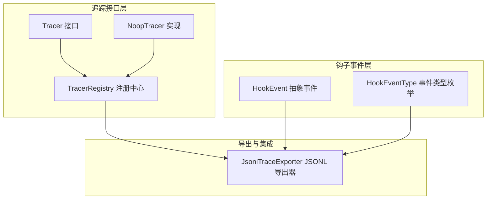
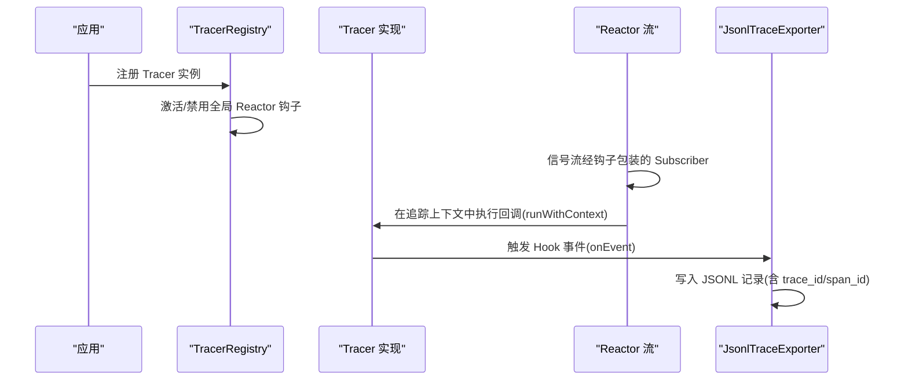
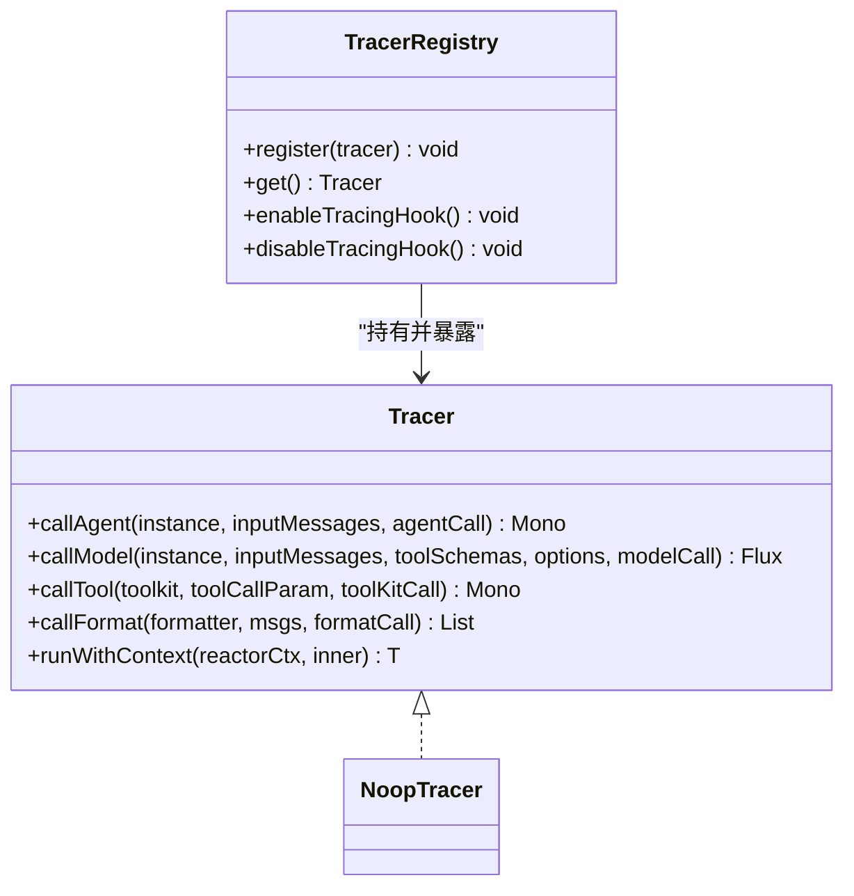
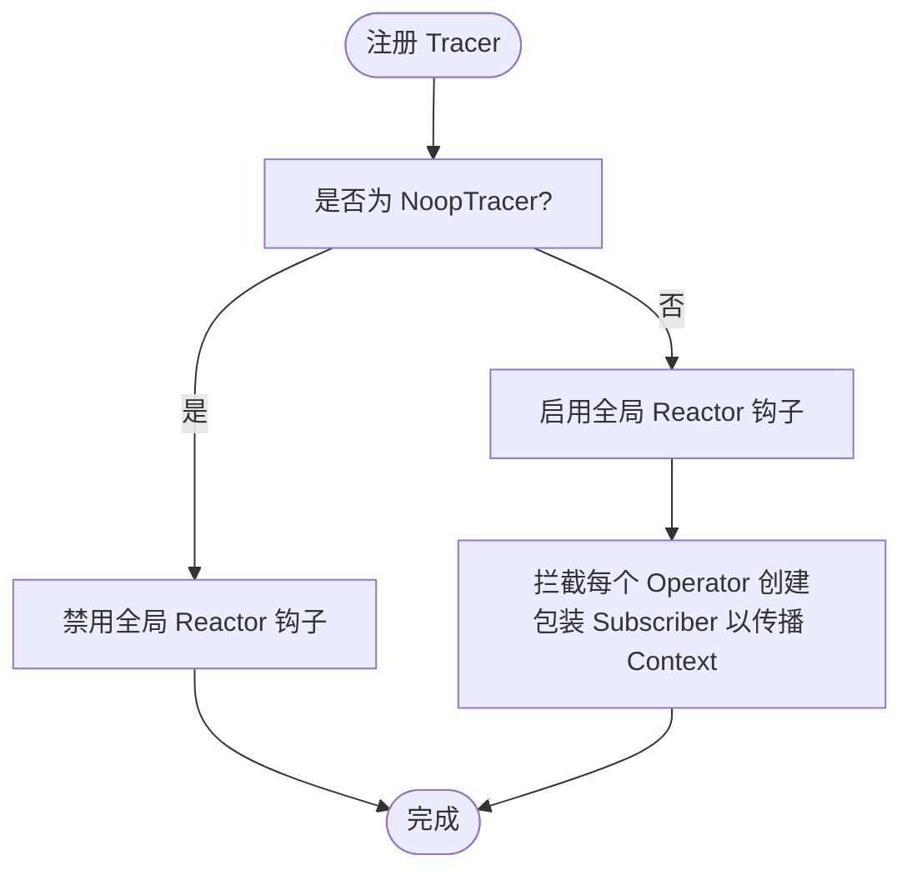
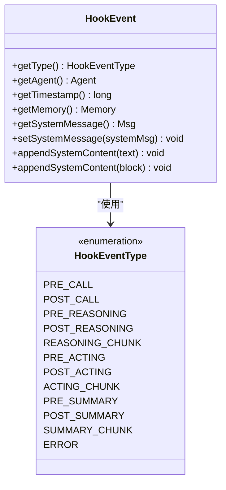
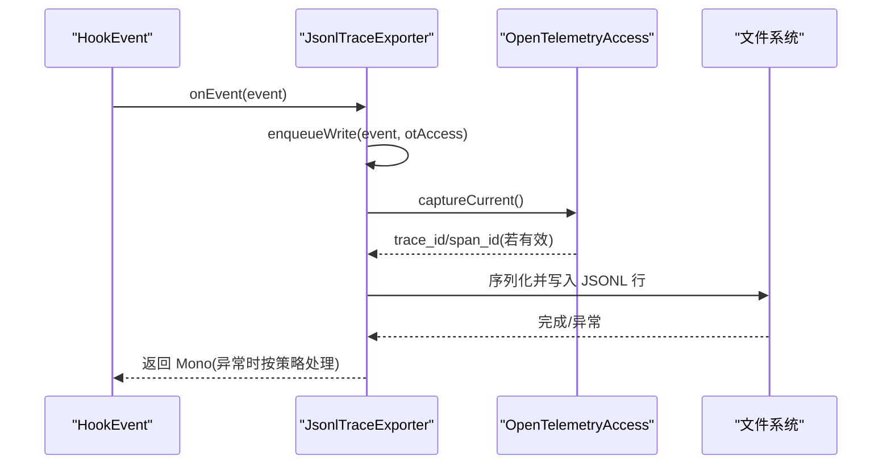
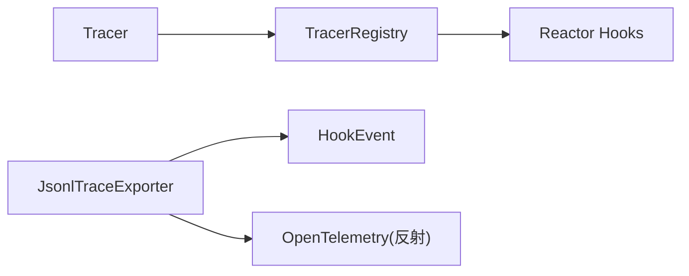

# 分布式追踪

<cite>
**本文引用的文件**
- [Tracer.java](file://agentscope-core/src/main/java/io/agentscope/core/tracing/Tracer.java)
- [NoopTracer.java](file://agentscope-core/src/main/java/io/agentscope/core/tracing/NoopTracer.java)
- [TracerRegistry.java](file://agentscope-core/src/main/java/io/agentscope/core/tracing/TracerRegistry.java)
- [JsonlTraceExporter.java](file://agentscope-core/src/main/java/io/agentscope/core/hook/recorder/JsonlTraceExporter.java)
- [HookEventType.java](file://agentscope-core/src/main/java/io/agentscope/core/hook/HookEventType.java)
- [HookEvent.java](file://agentscope-core/src/main/java/io/agentscope/core/hook/HookEvent.java)
- [observability.md](file://docs/zh/task/observability.md)
- [application.yml](file://agentscope-examples/a2a/src/main/resources/application.yml)
</cite>

## 目录
1. [引言](#引言)
2. [项目结构](#项目结构)
3. [核心组件](#核心组件)
4. [架构总览](#架构总览)
5. [详细组件分析](#详细组件分析)
6. [依赖分析](#依赖分析)
7. [性能考虑](#性能考虑)
8. [故障排查指南](#故障排查指南)
9. [结论](#结论)
10. [附录](#附录)

## 引言
本文件面向 AgentScope Java 的分布式追踪体系，聚焦 Tracer 接口的设计与实现、Span 的创建与传播、OpenTelemetry 集成方式、以及在智能体调用、模型请求、工具执行与格式化过程中的追踪点。文档同时提供配置示例、最佳实践与故障排查建议，帮助在生产环境中获得可观测性与性能平衡。

## 项目结构
追踪相关能力主要分布在如下模块：
- tracing 接口与注册中心：Tracer、NoopTracer、TracerRegistry
- 钩子事件与事件类型：HookEvent、HookEventType
- 追踪导出器：基于 Hook 事件系统的 JsonlTraceExporter
- 文档与示例：observability 文档、示例应用配置

**图表来源**
- [Tracer.java:35-68](file://agentscope-core/src/main/java/io/agentscope/core/tracing/Tracer.java#L35-L68)
- [NoopTracer.java:19-19](file://agentscope-core/src/main/java/io/agentscope/core/tracing/NoopTracer.java#L19-L19)
- [TracerRegistry.java:40-153](file://agentscope-core/src/main/java/io/agentscope/core/tracing/TracerRegistry.java#L40-L153)
- [HookEvent.java:74-205](file://agentscope-core/src/main/java/io/agentscope/core/hook/HookEvent.java#L74-L205)
- [HookEventType.java:27-63](file://agentscope-core/src/main/java/io/agentscope/core/hook/HookEventType.java#L27-L63)
- [JsonlTraceExporter.java:82-543](file://agentscope-core/src/main/java/io/agentscope/core/hook/recorder/JsonlTraceExporter.java#L82-L543)

**章节来源**
- [Tracer.java:35-68](file://agentscope-core/src/main/java/io/agentscope/core/tracing/Tracer.java#L35-L68)
- [TracerRegistry.java:40-153](file://agentscope-core/src/main/java/io/agentscope/core/tracing/TracerRegistry.java#L40-L153)
- [HookEventType.java:27-63](file://agentscope-core/src/main/java/io/agentscope/core/hook/HookEventType.java#L27-L63)
- [HookEvent.java:74-205](file://agentscope-core/src/main/java/io/agentscope/core/hook/HookEvent.java#L74-L205)
- [JsonlTraceExporter.java:82-543](file://agentscope-core/src/main/java/io/agentscope/core/hook/recorder/JsonlTraceExporter.java#L82-L543)

## 核心组件
- Tracer 接口：定义了对 Agent 调用、模型请求、工具执行、消息格式化的拦截点，默认实现为空操作，便于在无追踪需求时零开销。
- NoopTracer：空实现，注册后会自动关闭全局 Reactor 上下文传播钩子，避免不必要的性能损耗。
- TracerRegistry：全局 Tracer 注册中心，负责注册与获取 Tracer，并在启用非空实现时激活全局 Reactor 钩子，确保跨异步边界的上下文传播。
- HookEvent/HookEventType：统一的事件模型与事件类型枚举，覆盖从预处理到后处理、推理流式、工具执行、摘要生成与错误等全链路阶段。
- JsonlTraceExporter：基于 Hook 事件的 JSONL 导出器，可选地注入 OpenTelemetry 的 trace_id/span_id，便于与外部观测平台对接。

**章节来源**
- [Tracer.java:35-68](file://agentscope-core/src/main/java/io/agentscope/core/tracing/Tracer.java#L35-L68)
- [NoopTracer.java:19-19](file://agentscope-core/src/main/java/io/agentscope/core/tracing/NoopTracer.java#L19-L19)
- [TracerRegistry.java:40-153](file://agentscope-core/src/main/java/io/agentscope/core/tracing/TracerRegistry.java#L40-L153)
- [HookEventType.java:27-63](file://agentscope-core/src/main/java/io/agentscope/core/hook/HookEventType.java#L27-L63)
- [HookEvent.java:74-205](file://agentscope-core/src/main/java/io/agentscope/core/hook/HookEvent.java#L74-L205)
- [JsonlTraceExporter.java:82-543](file://agentscope-core/src/main/java/io/agentscope/core/hook/recorder/JsonlTraceExporter.java#L82-L543)

## 架构总览
Tracer 通过注册中心进行全局管理；当启用具体 Tracer 实现时，TracerRegistry 会在 Reactor 全局钩子中注入上下文传播逻辑，使下游信号在正确的追踪上下文中执行。JsonlTraceExporter 基于 Hook 事件系统工作，可选地捕获当前 OpenTelemetry Span 并写入 trace_id/span_id 字段，便于与外部平台对齐。

**图表来源**
- [TracerRegistry.java:74-126](file://agentscope-core/src/main/java/io/agentscope/core/tracing/TracerRegistry.java#L74-L126)
- [Tracer.java:65-67](file://agentscope-core/src/main/java/io/agentscope/core/tracing/Tracer.java#L65-L67)
- [JsonlTraceExporter.java:129-148](file://agentscope-core/src/main/java/io/agentscope/core/hook/recorder/JsonlTraceExporter.java#L129-L148)

## 详细组件分析

### Tracer 接口与实现
- 设计理念：以最小侵入的方式提供扩展点，所有方法均为默认实现，允许上层按需重写特定拦截点。
- 关键拦截点：
  - callAgent：拦截智能体调用
  - callModel：拦截模型请求
  - callTool：拦截工具执行
  - callFormat：拦截消息格式化
  - runWithContext：在 Reactor 上下文中运行内部逻辑，保障跨异步边界的追踪上下文一致

**图表来源**
- [Tracer.java:35-68](file://agentscope-core/src/main/java/io/agentscope/core/tracing/Tracer.java#L35-L68)
- [NoopTracer.java:19-19](file://agentscope-core/src/main/java/io/agentscope/core/tracing/NoopTracer.java#L19-L19)
- [TracerRegistry.java:139-152](file://agentscope-core/src/main/java/io/agentscope/core/tracing/TracerRegistry.java#L139-L152)

**章节来源**
- [Tracer.java:35-68](file://agentscope-core/src/main/java/io/agentscope/core/tracing/Tracer.java#L35-L68)
- [NoopTracer.java:19-19](file://agentscope-core/src/main/java/io/agentscope/core/tracing/NoopTracer.java#L19-L19)
- [TracerRegistry.java:139-152](file://agentscope-core/src/main/java/io/agentscope/core/tracing/TracerRegistry.java#L139-L152)

### TracerRegistry：全局注册与上下文传播
- 全局 Reactor 钩子：在启用非空实现时，对每个 Operator 创建进行包装，确保下游信号在装配时或上游提供的 Context 中执行。
- 性能提示：该钩子会影响 JVM 中所有 Reactor 操作，应仅在确需跨异步边界的上下文传播时启用。
- 注册行为：注册 NoopTracer 时自动禁用钩子；注册其他 Tracer 时自动启用钩子。

**图表来源**
- [TracerRegistry.java:74-126](file://agentscope-core/src/main/java/io/agentscope/core/tracing/TracerRegistry.java#L74-L126)
- [TracerRegistry.java:139-148](file://agentscope-core/src/main/java/io/agentscope/core/tracing/TracerRegistry.java#L139-L148)

**章节来源**
- [TracerRegistry.java:40-153](file://agentscope-core/src/main/java/io/agentscope/core/tracing/TracerRegistry.java#L40-L153)

### Hook 事件体系：追踪点与数据承载
- 事件类型：涵盖预处理、后处理、推理流式、工具执行、摘要生成、错误等阶段。
- 事件抽象：统一提供 agent、timestamp、memory、systemMsg 等上下文字段，便于在各阶段读写系统消息与元数据。
- 追踪点映射：
  - 预处理/后处理：PreCallEvent/PostCallEvent
  - 推理阶段：PreReasoningEvent/PostReasoningEvent/ReasoningChunkEvent
  - 工具阶段：PreActingEvent/PostActingEvent/ActingChunkEvent
  - 摘要阶段：PreSummaryEvent/PostSummaryEvent/SummaryChunkEvent
  - 错误阶段：ErrorEvent

**图表来源**
- [HookEvent.java:74-205](file://agentscope-core/src/main/java/io/agentscope/core/hook/HookEvent.java#L74-L205)
- [HookEventType.java:27-63](file://agentscope-core/src/main/java/io/agentscope/core/hook/HookEventType.java#L27-L63)

**章节来源**
- [HookEvent.java:74-205](file://agentscope-core/src/main/java/io/agentscope/core/hook/HookEvent.java#L74-L205)
- [HookEventType.java:27-63](file://agentscope-core/src/main/java/io/agentscope/core/hook/HookEventType.java#L27-L63)

### JsonlTraceExporter：事件导出与 OpenTelemetry 集成
- 事件过滤与构建：通过 Builder 可选择启用的事件类型，并支持开启推理/工具/摘要的流式事件。
- 写入策略：单线程队列顺序写入，保证 run_id/turn_id/step_id 的一致性；可选每行 flush。
- OpenTelemetry 集成：在可用时反射式捕获当前 Span 的 trace_id/span_id 并写入记录，便于与外部平台对齐。
- 失败策略：默认“尽力而为”，可通过 failFast 控制是否在导出失败时中断执行。

**图表来源**
- [JsonlTraceExporter.java:129-148](file://agentscope-core/src/main/java/io/agentscope/core/hook/recorder/JsonlTraceExporter.java#L129-L148)
- [JsonlTraceExporter.java:387-416](file://agentscope-core/src/main/java/io/agentscope/core/hook/recorder/JsonlTraceExporter.java#L387-L416)
- [JsonlTraceExporter.java:174-247](file://agentscope-core/src/main/java/io/agentscope/core/hook/recorder/JsonlTraceExporter.java#L174-L247)

**章节来源**
- [JsonlTraceExporter.java:82-543](file://agentscope-core/src/main/java/io/agentscope/core/hook/recorder/JsonlTraceExporter.java#L82-L543)

## 依赖分析
- 组件耦合与内聚：
  - TracerRegistry 对 Reactor 的全局钩子具有强耦合，但通过条件启用避免对非追踪场景的性能影响。
  - JsonlTraceExporter 与 Hook 事件系统解耦，仅在需要时捕获 OpenTelemetry 上下文，降低对无 OT 场景的影响。
- 外部依赖：
  - OpenTelemetry：通过反射访问 Span/SpanContext，未强制依赖，具备降级能力。
  - Reactor：用于上下文传播与异步流处理。

**图表来源**
- [TracerRegistry.java:74-126](file://agentscope-core/src/main/java/io/agentscope/core/tracing/TracerRegistry.java#L74-L126)
- [JsonlTraceExporter.java:86-86](file://agentscope-core/src/main/java/io/agentscope/core/hook/recorder/JsonlTraceExporter.java#L86-L86)

**章节来源**
- [TracerRegistry.java:40-153](file://agentscope-core/src/main/java/io/agentscope/core/tracing/TracerRegistry.java#L40-L153)
- [JsonlTraceExporter.java:82-543](file://agentscope-core/src/main/java/io/agentscope/core/hook/recorder/JsonlTraceExporter.java#L82-L543)

## 性能考虑
- 全局 Reactor 钩子：仅在注册非空 Tracer 时启用，且会对所有 Reactor 操作引入额外开销。建议在需要跨异步边界的上下文传播时启用。
- 导出器写入：单线程顺序写入，保证一致性但可能成为瓶颈。可通过减少事件数量、调整 flush 策略与启用 failFast 来平衡可靠性与吞吐。
- OpenTelemetry 集成：反射式访问，无依赖时自动降级，避免强制依赖带来的类加载与版本冲突风险。

[本节为通用指导，不直接分析具体文件]

## 故障排查指南
- 未看到追踪数据
  - 检查是否已注册 Tracer 实例；注册 NoopTracer 将自动禁用全局钩子。
  - 确认是否启用了必要的 Hook 事件类型与导出器优先级。
- JSONL 导出失败
  - 若启用 failFast，导出异常将中断执行；否则将以警告日志记录并继续。
  - 检查输出路径权限与磁盘空间。
- OpenTelemetry ID 未写入
  - 确保运行时存在有效的 OpenTelemetry Span；若不存在则导出器会自动忽略。
- 上下文未传播
  - 确认已注册非空 Tracer 实现，以便激活全局 Reactor 钩子。
  - 检查异步边界处是否正确使用了 Reactor 上下文传播。

**章节来源**
- [TracerRegistry.java:74-126](file://agentscope-core/src/main/java/io/agentscope/core/tracing/TracerRegistry.java#L74-L126)
- [JsonlTraceExporter.java:137-147](file://agentscope-core/src/main/java/io/agentscope/core/hook/recorder/JsonlTraceExporter.java#L137-L147)
- [JsonlTraceExporter.java:297-331](file://agentscope-core/src/main/java/io/agentscope/core/hook/recorder/JsonlTraceExporter.java#L297-L331)

## 结论
AgentScope Java 的分布式追踪体系以轻量接口与事件驱动为核心，既能在无追踪需求时零开销运行，又可在启用追踪时提供全链路可观测性。通过 TracerRegistry 的全局钩子与 JsonlTraceExporter 的事件导出，结合可选的 OpenTelemetry 集成，开发者可以在开发调试与生产监控之间取得良好平衡。

[本节为总结性内容，不直接分析具体文件]

## 附录

### OpenTelemetry 集成与导出器配置
- 配置要点
  - 通过 TracerRegistry 注册具体 Tracer 实现以启用追踪。
  - 使用 JsonlTraceExporter 记录 Hook 事件，必要时可启用 includeReasoningChunks/includeActingChunks/includeSummary 等选项。
  - 当运行时存在 OpenTelemetry Span 时，导出器会自动写入 trace_id/span_id。
- 示例参考
  - 文档中提供了 TelemetryTracer 的 Builder 选项与 Langfuse 接入示例，可作为 OTLP 导出的参考。

**章节来源**
- [observability.md:269-307](file://docs/zh/task/observability.md#L269-L307)
- [JsonlTraceExporter.java:436-542](file://agentscope-core/src/main/java/io/agentscope/core/hook/recorder/JsonlTraceExporter.java#L436-L542)

### 不同组件的追踪点
- 智能体调用：PreCallEvent/PostCallEvent
- 模型请求：PreReasoningEvent/PostReasoningEvent/ReasoningChunkEvent
- 工具执行：PreActingEvent/PostActingEvent/ActingChunkEvent
- 格式化过程：callFormat 拦截点
- 错误处理：ErrorEvent

**章节来源**
- [HookEventType.java:27-63](file://agentscope-core/src/main/java/io/agentscope/core/hook/HookEventType.java#L27-L63)
- [Tracer.java:37-63](file://agentscope-core/src/main/java/io/agentscope/core/tracing/Tracer.java#L37-L63)

### 生产环境最佳实践
- 事件选择：仅启用必要的 Hook 事件类型，减少导出压力。
- 写入策略：在高吞吐场景下可关闭 flushEveryLine 或合并写入批次。
- 失败策略：生产环境建议禁用 failFast，配合告警与重试策略。
- 上下文传播：仅在确实需要跨异步边界的追踪时启用全局钩子。

[本节为通用指导，不直接分析具体文件]

### 配置示例与参考
- 示例应用配置文件展示了基础服务与 AgentScope 的配置项，可作为集成追踪的起点。

**章节来源**
- [application.yml:1-65](file://agentscope-examples/a2a/src/main/resources/application.yml#L1-L65)