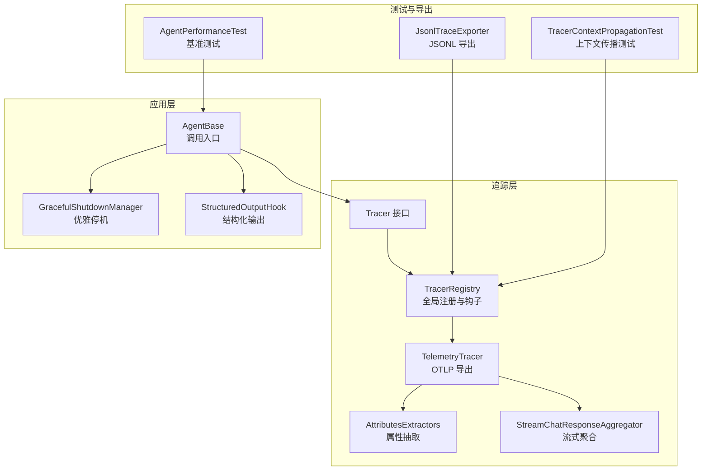
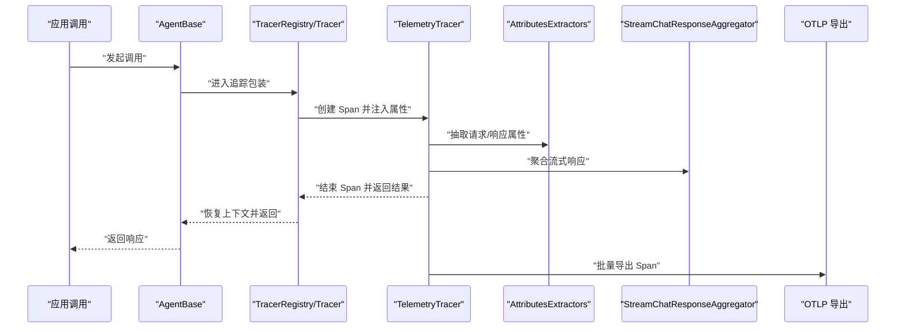
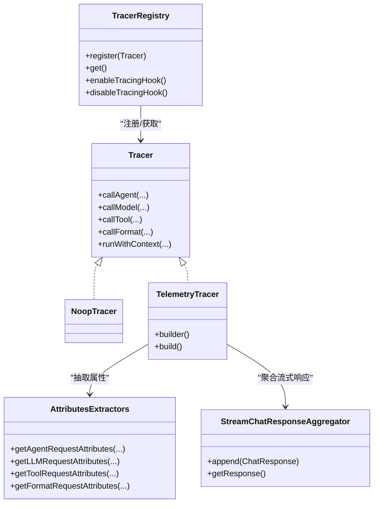
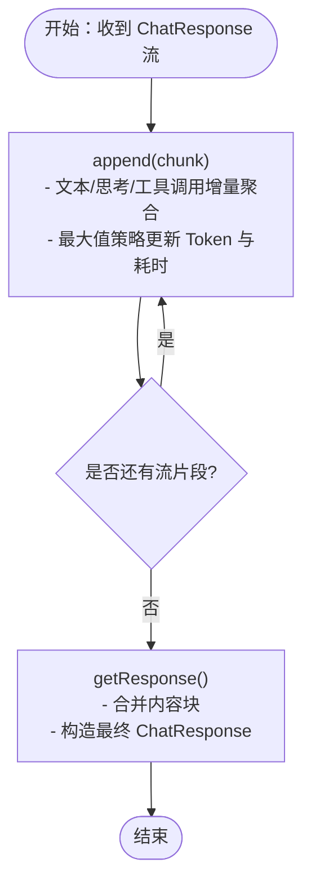
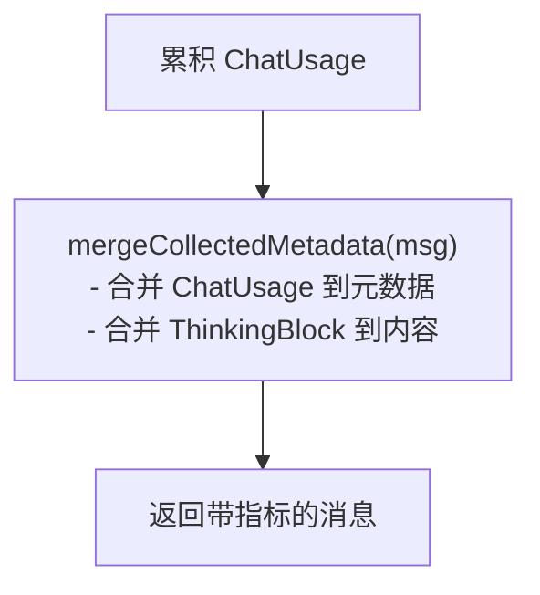
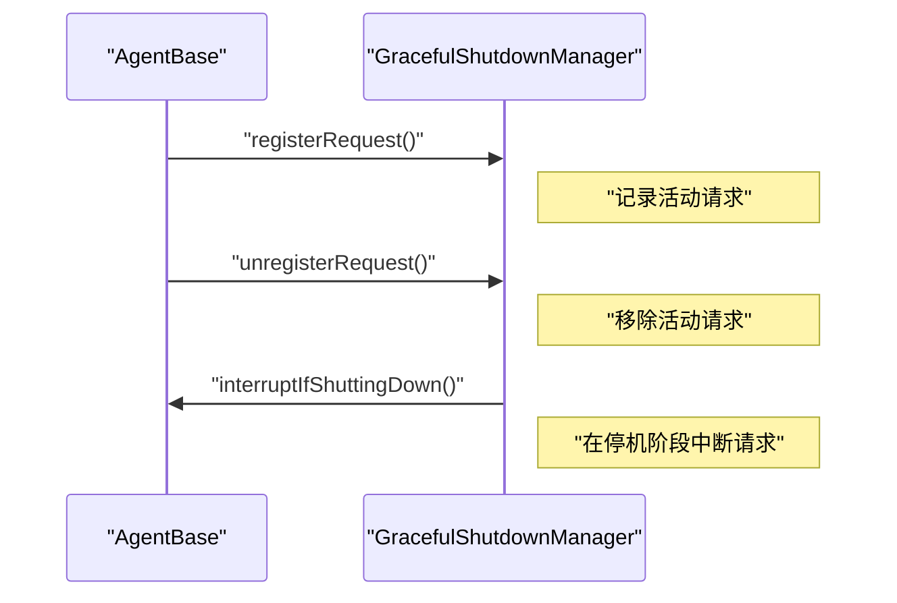
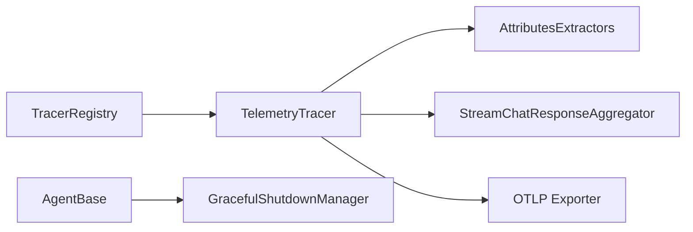

# 性能监控

<cite>
**本文引用的文件**
- [TracerRegistry.java](file://agentscope-core/src/main/java/io/agentscope/core/tracing/TracerRegistry.java)
- [Tracer.java](file://agentscope-core/src/main/java/io/agentscope/core/tracing/Tracer.java)
- [NoopTracer.java](file://agentscope-core/src/main/java/io/agentscope/core/tracing/NoopTracer.java)
- [TelemetryTracer.java](file://agentscope-extensions/agentscope-extensions-studio/src/main/java/io/agentscope/core/tracing/telemetry/TelemetryTracer.java)
- [AttributesExtractors.java](file://agentscope-extensions/agentscope-extensions-studio/src/main/java/io/agentscope/core/tracing/telemetry/AttributesExtractors.java)
- [StreamChatResponseAggregator.java](file://agentscope-extensions/agentscope-extensions-studio/src/main/java/io/agentscope/core/tracing/telemetry/StreamChatResponseAggregator.java)
- [observability.md](file://docs/zh/task/observability.md)
- [AgentBase.java](file://agentscope-core/src/main/java/io/agentscope/core/agent/AgentBase.java)
- [GracefulShutdownManager.java](file://agentscope-core/src/main/java/io/agentscope/core/shutdown/GracefulShutdownManager.java)
- [CompositeAgentException.java](file://agentscope-core/src/main/java/io/agentscope/core/exception/CompositeAgentException.java)
- [AgentPerformanceTest.java](file://agentscope-core/src/test/java/io/agentscope/core/agent/AgentPerformanceTest.java)
- [StructuredOutputHook.java](file://agentscope-core/src/main/java/io/agentscope/core/agent/StructuredOutputHook.java)
- [ReasoningContextTest.java](file://agentscope-core/src/test/java/io/agentscope/core/agent/accumulator/ReasoningContextTest.java)
- [JsonlTraceExporter.java](file://agentscope-core/src/main/java/io/agentscope/core/hook/recorder/JsonlTraceExporter.java)
- [TracerContextPropagationTest.java](file://agentscope-core/src/test/java/io/agentscope/core/tracing/TracerContextPropagationTest.java)
</cite>

## 目录
1. [简介](#简介)
2. [项目结构](#项目结构)
3. [核心组件](#核心组件)
4. [架构总览](#架构总览)
5. [详细组件分析](#详细组件分析)
6. [依赖分析](#依赖分析)
7. [性能考量](#性能考量)
8. [故障排查指南](#故障排查指南)
9. [结论](#结论)
10. [附录](#附录)

## 简介
本文件面向 AgentScope Java 的性能监控体系，聚焦于 JVM 性能指标采集与分析、业务关键指标设计（响应时间、吞吐量、错误率）、自定义指标实现（计数器、直方图、仪表板集成）、性能基准测试策略与瓶颈识别方法，以及监控告警配置、阈值设定与自动化响应机制。文档同时总结模型调用性能优化与资源利用率提升的最佳实践，帮助读者在生产环境中建立稳定、可观测且可扩展的性能监控体系。

## 项目结构
AgentScope Java 的性能监控能力主要由“追踪（Tracing）”与“指标（Metrics）”两条主线构成：
- 追踪（Tracing）：通过全局 Tracer 注册与 Reactor 上下文传播，对 Agent 调用、模型调用、工具调用与格式化过程进行分布式追踪与属性抽取。
- 指标（Metrics）：通过 ChatUsage 等结构化元数据聚合，形成响应时间、Token 使用、耗时等业务关键指标，并支持导出至外部系统。

图表来源
- [TracerRegistry.java:40-154](file://agentscope-core/src/main/java/io/agentscope/core/tracing/TracerRegistry.java#L40-L154)
- [TelemetryTracer.java:67-308](file://agentscope-extensions/agentscope-extensions-studio/src/main/java/io/agentscope/core/tracing/telemetry/TelemetryTracer.java#L67-L308)
- [AttributesExtractors.java:111-608](file://agentscope-extensions/agentscope-extensions-studio/src/main/java/io/agentscope/core/tracing/telemetry/AttributesExtractors.java#L111-L608)
- [StreamChatResponseAggregator.java:31-111](file://agentscope-extensions/agentscope-extensions-studio/src/main/java/io/agentscope/core/tracing/telemetry/StreamChatResponseAggregator.java#L31-L111)
- [AgentBase.java:404-439](file://agentscope-core/src/main/java/io/agentscope/core/agent/AgentBase.java#L404-L439)
- [GracefulShutdownManager.java:46-320](file://agentscope-core/src/main/java/io/agentscope/core/shutdown/GracefulShutdownManager.java#L46-L320)
- [StructuredOutputHook.java:245-286](file://agentscope-core/src/main/java/io/agentscope/core/agent/StructuredOutputHook.java#L245-L286)
- [AgentPerformanceTest.java:183-229](file://agentscope-core/src/test/java/io/agentscope/core/agent/AgentPerformanceTest.java#L183-L229)
- [JsonlTraceExporter.java:369-437](file://agentscope-core/src/main/java/io/agentscope/core/hook/recorder/JsonlTraceExporter.java#L369-L437)
- [TracerContextPropagationTest.java:48-132](file://agentscope-core/src/test/java/io/agentscope/core/tracing/TracerContextPropagationTest.java#L48-L132)

章节来源
- [TracerRegistry.java:40-154](file://agentscope-core/src/main/java/io/agentscope/core/tracing/TracerRegistry.java#L40-L154)
- [TelemetryTracer.java:67-308](file://agentscope-extensions/agentscope-extensions-studio/src/main/java/io/agentscope/core/tracing/telemetry/TelemetryTracer.java#L67-L308)
- [AttributesExtractors.java:111-608](file://agentscope-extensions/agentscope-extensions-studio/src/main/java/io/agentscope/core/tracing/telemetry/AttributesExtractors.java#L111-L608)
- [AgentBase.java:404-439](file://agentscope-core/src/main/java/io/agentscope/core/agent/AgentBase.java#L404-L439)

## 核心组件
- Tracer 接口与实现
  - Tracer 定义了对 Agent、模型、工具与格式化的统一追踪入口，默认透传调用，便于扩展。
  - TelemetryTracer 基于 OpenTelemetry，为 Agent 调用、模型调用、工具调用与格式化分别创建 Span，并注入通用属性与函数名属性。
  - NoopTracer 作为默认占位实现，关闭追踪时自动禁用全局 Reactor 钩子，避免不必要开销。
- TracerRegistry
  - 提供全局 Tracer 注册与获取；当启用 TelemetryTracer 时，注册全局 Reactor 钩子以传播 OpenTelemetry 上下文；禁用时移除钩子。
- 属性抽取与流式聚合
  - AttributesExtractors 将请求/响应消息、工具参数、模型参数等序列化为 OpenTelemetry 属性，便于查询与仪表板展示。
  - StreamChatResponseAggregator 聚合流式 ChatResponse，合并文本、思考与工具调用内容，并取最大值策略汇总输入/输出 Token 与耗时。
- 结构化输出与指标聚合
  - StructuredOutputHook 将累积的 ChatUsage 合并到最终消息元数据中，形成统一的业务指标载体。
- 应用层集成
  - AgentBase 在每次调用前后进行资源获取/释放、运行状态检查与优雅停机协调，保障并发与停机期间的稳定性。
  - GracefulShutdownManager 统一管理优雅停机流程与监控，确保在停机窗口内完成请求处理或中断。

章节来源
- [Tracer.java:35-69](file://agentscope-core/src/main/java/io/agentscope/core/tracing/Tracer.java#L35-L69)
- [NoopTracer.java:19-20](file://agentscope-core/src/main/java/io/agentscope/core/tracing/NoopTracer.java#L19-L20)
- [TelemetryTracer.java:67-308](file://agentscope-extensions/agentscope-extensions-studio/src/main/java/io/agentscope/core/tracing/telemetry/TelemetryTracer.java#L67-L308)
- [TracerRegistry.java:40-154](file://agentscope-core/src/main/java/io/agentscope/core/tracing/TracerRegistry.java#L40-L154)
- [AttributesExtractors.java:111-608](file://agentscope-extensions/agentscope-extensions-studio/src/main/java/io/agentscope/core/tracing/telemetry/AttributesExtractors.java#L111-L608)
- [StreamChatResponseAggregator.java:31-111](file://agentscope-extensions/agentscope-extensions-studio/src/main/java/io/agentscope/core/tracing/telemetry/StreamChatResponseAggregator.java#L31-L111)
- [StructuredOutputHook.java:245-286](file://agentscope-core/src/main/java/io/agentscope/core/agent/StructuredOutputHook.java#L245-L286)
- [AgentBase.java:404-439](file://agentscope-core/src/main/java/io/agentscope/core/agent/AgentBase.java#L404-L439)
- [GracefulShutdownManager.java:46-320](file://agentscope-core/src/main/java/io/agentscope/core/shutdown/GracefulShutdownManager.java#L46-L320)

## 架构总览
下图展示了从应用调用到追踪导出的关键路径，以及关键指标的生成与传播：

图表来源
- [AgentBase.java:404-439](file://agentscope-core/src/main/java/io/agentscope/core/agent/AgentBase.java#L404-L439)
- [TracerRegistry.java:74-126](file://agentscope-core/src/main/java/io/agentscope/core/tracing/TracerRegistry.java#L74-L126)
- [TelemetryTracer.java:75-151](file://agentscope-extensions/agentscope-extensions-studio/src/main/java/io/agentscope/core/tracing/telemetry/TelemetryTracer.java#L75-L151)
- [AttributesExtractors.java:166-237](file://agentscope-extensions/agentscope-extensions-studio/src/main/java/io/agentscope/core/tracing/telemetry/AttributesExtractors.java#L166-L237)
- [StreamChatResponseAggregator.java:50-103](file://agentscope-extensions/agentscope-extensions-studio/src/main/java/io/agentscope/core/tracing/telemetry/StreamChatResponseAggregator.java#L50-L103)

## 详细组件分析

### 组件一：Tracer 与 TelemetryTracer
- 设计要点
  - Tracer 接口提供统一的拦截点，便于在不侵入业务代码的前提下记录调用链。
  - TelemetryTracer 为不同调用类型（Agent、模型、工具、格式化）创建独立 Span，并注入通用属性（如操作名称、提供商、模型名、输入/输出消息、工具定义、函数名等）。
  - 流式模型调用通过 StreamChatResponseAggregator 聚合文本、思考与工具调用，使用最大值策略汇总 Token 与耗时，保证指标一致性。
- 关键实现路径
  - [TelemetryTracer.callAgent:76-107](file://agentscope-extensions/agentscope-extensions-studio/src/main/java/io/agentscope/core/tracing/telemetry/TelemetryTracer.java#L76-L107)
  - [TelemetryTracer.callModel:110-151](file://agentscope-extensions/agentscope-extensions-studio/src/main/java/io/agentscope/core/tracing/telemetry/TelemetryTracer.java#L110-L151)
  - [TelemetryTracer.callTool:154-194](file://agentscope-extensions/agentscope-extensions-studio/src/main/java/io/agentscope/core/tracing/telemetry/TelemetryTracer.java#L154-L194)
  - [TelemetryTracer.callFormat:197-219](file://agentscope-extensions/agentscope-extensions-studio/src/main/java/io/agentscope/core/tracing/telemetry/TelemetryTracer.java#L197-L219)
  - [StreamChatResponseAggregator.append/getResponse:50-103](file://agentscope-extensions/agentscope-extensions-studio/src/main/java/io/agentscope/core/tracing/telemetry/StreamChatResponseAggregator.java#L50-L103)

图表来源
- [Tracer.java:35-69](file://agentscope-core/src/main/java/io/agentscope/core/tracing/Tracer.java#L35-L69)
- [NoopTracer.java:19-20](file://agentscope-core/src/main/java/io/agentscope/core/tracing/NoopTracer.java#L19-L20)
- [TelemetryTracer.java:67-308](file://agentscope-extensions/agentscope-extensions-studio/src/main/java/io/agentscope/core/tracing/telemetry/TelemetryTracer.java#L67-L308)
- [TracerRegistry.java:40-154](file://agentscope-core/src/main/java/io/agentscope/core/tracing/TracerRegistry.java#L40-L154)
- [AttributesExtractors.java:111-608](file://agentscope-extensions/agentscope-extensions-studio/src/main/java/io/agentscope/core/tracing/telemetry/AttributesExtractors.java#L111-L608)
- [StreamChatResponseAggregator.java:31-111](file://agentscope-extensions/agentscope-extensions-studio/src/main/java/io/agentscope/core/tracing/telemetry/StreamChatResponseAggregator.java#L31-L111)

章节来源
- [Tracer.java:35-69](file://agentscope-core/src/main/java/io/agentscope/core/tracing/Tracer.java#L35-L69)
- [TelemetryTracer.java:67-308](file://agentscope-extensions/agentscope-extensions-studio/src/main/java/io/agentscope/core/tracing/telemetry/TelemetryTracer.java#L67-L308)
- [AttributesExtractors.java:111-608](file://agentscope-extensions/agentscope-extensions-studio/src/main/java/io/agentscope/core/tracing/telemetry/AttributesExtractors.java#L111-L608)
- [StreamChatResponseAggregator.java:31-111](file://agentscope-extensions/agentscope-extensions-studio/src/main/java/io/agentscope/core/tracing/telemetry/StreamChatResponseAggregator.java#L31-L111)

### 组件二：属性抽取与流式聚合
- 属性抽取
  - 将输入消息、工具定义、模型参数、输出消息等结构化为 JSON 字符串属性，便于查询与可视化。
  - 通过 ProviderNameConverter 与 FormatterConverter 映射提供商与格式化目标，增强可读性与可比性。
- 流式聚合
  - 文本、思考与工具调用分别由对应 Accumulator 聚合；Token 与耗时采用最大值策略，避免重复累加导致的偏差。
- 关键实现路径
  - [AttributesExtractors.getLLMRequestAttributes/getLLMResponseAttributes:166-237](file://agentscope-extensions/agentscope-extensions-studio/src/main/java/io/agentscope/core/tracing/telemetry/AttributesExtractors.java#L166-L237)
  - [AttributesExtractors.getToolRequestAttributes/getToolResponseAttributes:248-287](file://agentscope-extensions/agentscope-extensions-studio/src/main/java/io/agentscope/core/tracing/telemetry/AttributesExtractors.java#L248-L287)
  - [AttributesExtractors.getFormatRequestAttributes/getFormatResponseAttributes:299-328](file://agentscope-extensions/agentscope-extensions-studio/src/main/java/io/agentscope/core/tracing/telemetry/AttributesExtractors.java#L299-L328)
  - [StreamChatResponseAggregator.append/getResponse:50-103](file://agentscope-extensions/agentscope-extensions-studio/src/main/java/io/agentscope/core/tracing/telemetry/StreamChatResponseAggregator.java#L50-L103)

图表来源
- [StreamChatResponseAggregator.java:50-103](file://agentscope-extensions/agentscope-extensions-studio/src/main/java/io/agentscope/core/tracing/telemetry/StreamChatResponseAggregator.java#L50-L103)

章节来源
- [AttributesExtractors.java:111-608](file://agentscope-extensions/agentscope-extensions-studio/src/main/java/io/agentscope/core/tracing/telemetry/AttributesExtractors.java#L111-L608)
- [StreamChatResponseAggregator.java:31-111](file://agentscope-extensions/agentscope-extensions-studio/src/main/java/io/agentscope/core/tracing/telemetry/StreamChatResponseAggregator.java#L31-L111)

### 组件三：结构化输出与业务指标
- 结构化输出
  - StructuredOutputHook 将累积的 ChatUsage 合并到最终消息元数据中，形成统一的业务指标载体，便于后续统计与告警。
- 关键实现路径
  - [StructuredOutputHook.mergeCollectedMetadata:258-286](file://agentscope-core/src/main/java/io/agentscope/core/agent/StructuredOutputHook.java#L258-L286)

图表来源
- [StructuredOutputHook.java:245-286](file://agentscope-core/src/main/java/io/agentscope/core/agent/StructuredOutputHook.java#L245-L286)

章节来源
- [StructuredOutputHook.java:245-286](file://agentscope-core/src/main/java/io/agentscope/core/agent/StructuredOutputHook.java#L245-L286)

### 组件四：应用层集成与优雅停机
- 调用入口与资源管理
  - AgentBase.acquireExecution/releaseExecution 保证并发安全与资源释放，配合 GracefulShutdownManager 注册/注销活动请求。
- 优雅停机
  - GracefulShutdownManager 统一管理停机状态、监控与中断，确保在停机窗口内完成或中断请求。
- 关键实现路径
  - [AgentBase.acquireExecution/releaseExecution:411-439](file://agentscope-core/src/main/java/io/agentscope/core/agent/AgentBase.java#L411-L439)
  - [GracefulShutdownManager.performGracefulShutdown:198-213](file://agentscope-core/src/main/java/io/agentscope/core/shutdown/GracefulShutdownManager.java#L198-L213)

图表来源
- [AgentBase.java:411-439](file://agentscope-core/src/main/java/io/agentscope/core/agent/AgentBase.java#L411-L439)
- [GracefulShutdownManager.java:180-196](file://agentscope-core/src/main/java/io/agentscope/core/shutdown/GracefulShutdownManager.java#L180-L196)

章节来源
- [AgentBase.java:404-439](file://agentscope-core/src/main/java/io/agentscope/core/agent/AgentBase.java#L404-L439)
- [GracefulShutdownManager.java:46-320](file://agentscope-core/src/main/java/io/agentscope/core/shutdown/GracefulShutdownManager.java#L46-L320)

### 组件五：基准测试与上下文传播
- 基准测试
  - AgentPerformanceTest 通过测量单次与多次调用的耗时，验证响应时间指标是否满足预期阈值。
- 上下文传播
  - TracerContextPropagationTest 验证 Reactor 上下文在 map/flatMap 等算子中的正确传递，确保追踪上下文贯穿异步链路。
- 关键实现路径
  - [AgentPerformanceTest 响应时间测量:183-229](file://agentscope-core/src/test/java/io/agentscope/core/agent/AgentPerformanceTest.java#L183-L229)
  - [TracerContextPropagationTest.runWithContext:61-79](file://agentscope-core/src/test/java/io/agentscope/core/tracing/TracerContextPropagationTest.java#L61-L79)

章节来源
- [AgentPerformanceTest.java:183-229](file://agentscope-core/src/test/java/io/agentscope/core/agent/AgentPerformanceTest.java#L183-L229)
- [TracerContextPropagationTest.java:48-132](file://agentscope-core/src/test/java/io/agentscope/core/tracing/TracerContextPropagationTest.java#L48-L132)

## 依赖分析
- 组件耦合
  - TracerRegistry 与 TelemetryTracer 之间为注册与使用关系；TelemetryTracer 依赖 AttributesExtractors 与 StreamChatResponseAggregator。
  - AgentBase 与 GracefulShutdownManager 通过注册/注销活动请求实现运行期协调。
- 外部依赖
  - OpenTelemetry SDK 与 OTLP 导出器用于追踪数据的采集与传输。
  - Reactor 全局钩子用于上下文传播，需谨慎启用以避免对非追踪相关代码造成性能影响。

图表来源
- [TracerRegistry.java:40-154](file://agentscope-core/src/main/java/io/agentscope/core/tracing/TracerRegistry.java#L40-L154)
- [TelemetryTracer.java:67-308](file://agentscope-extensions/agentscope-extensions-studio/src/main/java/io/agentscope/core/tracing/telemetry/TelemetryTracer.java#L67-L308)
- [AttributesExtractors.java:111-608](file://agentscope-extensions/agentscope-extensions-studio/src/main/java/io/agentscope/core/tracing/telemetry/AttributesExtractors.java#L111-L608)
- [StreamChatResponseAggregator.java:31-111](file://agentscope-extensions/agentscope-extensions-studio/src/main/java/io/agentscope/core/tracing/telemetry/StreamChatResponseAggregator.java#L31-L111)
- [AgentBase.java:404-439](file://agentscope-core/src/main/java/io/agentscope/core/agent/AgentBase.java#L404-L439)
- [GracefulShutdownManager.java:46-320](file://agentscope-core/src/main/java/io/agentscope/core/shutdown/GracefulShutdownManager.java#L46-L320)

章节来源
- [TracerRegistry.java:40-154](file://agentscope-core/src/main/java/io/agentscope/core/tracing/TracerRegistry.java#L40-L154)
- [TelemetryTracer.java:67-308](file://agentscope-extensions/agentscope-extensions-studio/src/main/java/io/agentscope/core/tracing/telemetry/TelemetryTracer.java#L67-L308)

## 性能考量
- 追踪开销控制
  - 全局 Reactor 钩子会对每个操作符引入额外开销，仅在需要跨异步边界的上下文传播时启用。
  - 当使用 NoopTracer 时，自动禁用钩子，避免不必要的性能损耗。
- 指标聚合策略
  - 流式响应的 Token 与耗时采用最大值策略，避免重复累加导致的偏差，提高指标稳定性。
- 并发与优雅停机
  - AgentBase 的并发检查与资源释放保证调用的原子性；GracefulShutdownManager 在停机阶段主动中断请求，减少资源占用。
- 基准测试建议
  - 使用 AgentPerformanceTest 的方式测量单次与平均响应时间，结合压测工具评估高负载下的稳定性与延迟分布。

章节来源
- [TracerRegistry.java:74-126](file://agentscope-core/src/main/java/io/agentscope/core/tracing/TracerRegistry.java#L74-L126)
- [NoopTracer.java:19-20](file://agentscope-core/src/main/java/io/agentscope/core/tracing/NoopTracer.java#L19-L20)
- [StreamChatResponseAggregator.java:73-83](file://agentscope-extensions/agentscope-extensions-studio/src/main/java/io/agentscope/core/tracing/telemetry/StreamChatResponseAggregator.java#L73-L83)
- [AgentBase.java:411-439](file://agentscope-core/src/main/java/io/agentscope/core/agent/AgentBase.java#L411-L439)
- [GracefulShutdownManager.java:198-213](file://agentscope-core/src/main/java/io/agentscope/core/shutdown/GracefulShutdownManager.java#L198-L213)
- [AgentPerformanceTest.java:183-229](file://agentscope-core/src/test/java/io/agentscope/core/agent/AgentPerformanceTest.java#L183-L229)

## 故障排查指南
- 追踪未生效
  - 检查 TracerRegistry 是否已注册 TelemetryTracer；确认全局 Reactor 钩子已启用。
  - 参考：[TracerRegistry.enableTracingHook/disableTracingHook:74-137](file://agentscope-core/src/main/java/io/agentscope/core/tracing/TracerRegistry.java#L74-L137)
- 上下文未传播
  - 使用 TracerContextPropagationTest 的思路验证 Reactor 上下文在 map/flatMap 中的传递。
  - 参考：[TracerContextPropagationTest:97-130](file://agentscope-core/src/test/java/io/agentscope/core/tracing/TracerContextPropagationTest.java#L97-L130)
- 指标异常
  - 检查 StreamChatResponseAggregator 的聚合逻辑与 AttributesExtractors 的属性抽取是否正常。
  - 参考：[StreamChatResponseAggregator:50-103](file://agentscope-extensions/agentscope-extensions-studio/src/main/java/io/agentscope/core/tracing/telemetry/StreamChatResponseAggregator.java#L50-L103)、[AttributesExtractors:166-237](file://agentscope-extensions/agentscope-extensions-studio/src/main/java/io/agentscope/core/tracing/telemetry/AttributesExtractors.java#L166-L237)
- 优雅停机失败
  - 检查 GracefulShutdownManager 的状态转换与中断逻辑，确认活动请求是否正确注册/注销。
  - 参考：[GracefulShutdownManager.performGracefulShutdown:198-213](file://agentscope-core/src/main/java/io/agentscope/core/shutdown/GracefulShutdownManager.java#L198-L213)
- 错误聚合
  - 使用 CompositeAgentException 查看复合异常信息，定位具体 Agent 与异常原因。
  - 参考：[CompositeAgentException:40-84](file://agentscope-core/src/main/java/io/agentscope/core/exception/CompositeAgentException.java#L40-L84)

章节来源
- [TracerRegistry.java:74-137](file://agentscope-core/src/main/java/io/agentscope/core/tracing/TracerRegistry.java#L74-L137)
- [TracerContextPropagationTest.java:97-130](file://agentscope-core/src/test/java/io/agentscope/core/tracing/TracerContextPropagationTest.java#L97-L130)
- [StreamChatResponseAggregator.java:50-103](file://agentscope-extensions/agentscope-extensions-studio/src/main/java/io/agentscope/core/tracing/telemetry/StreamChatResponseAggregator.java#L50-L103)
- [AttributesExtractors.java:166-237](file://agentscope-extensions/agentscope-extensions-studio/src/main/java/io/agentscope/core/tracing/telemetry/AttributesExtractors.java#L166-L237)
- [GracefulShutdownManager.java:198-213](file://agentscope-core/src/main/java/io/agentscope/core/shutdown/GracefulShutdownManager.java#L198-L213)
- [CompositeAgentException.java:40-84](file://agentscope-core/src/main/java/io/agentscope/core/exception/CompositeAgentException.java#L40-L84)

## 结论
AgentScope Java 的性能监控体系以 OpenTelemetry 为基础，结合结构化指标与流式聚合，实现了对 Agent 调用、模型调用、工具调用与格式化的全链路可观测性。通过合理的钩子启用策略、聚合与导出机制，以及基准测试与优雅停机流程，能够在保证性能的同时，提供稳定可靠的监控与告警能力。建议在生产环境中按需启用追踪钩子，结合业务指标阈值与自动化响应机制，持续优化模型调用性能与资源利用率。

## 附录
- 配置与接入
  - 参考文档：[可观测性（中文）:269-307](file://docs/zh/task/observability.md#L269-L307)
  - TelemetryTracer 支持的 Builder 选项：endpoint、headers、enabled、tracer。
- 业务关键指标设计
  - 响应时间：通过基准测试与流式聚合的耗时字段计算。
  - 吞吐量：结合活动请求计数与停机监控统计。
  - 错误率：通过 CompositeAgentException 与异常事件统计。
- 自定义指标与仪表板
  - 使用 AttributesExtractors 抽取的属性可在仪表板中进行聚合与可视化。
  - JSONL 导出可用于离线分析与二次加工。
- 监控告警与自动化响应
  - 建议基于响应时间、错误率与资源利用率设置阈值，结合优雅停机与中断机制实现自动化响应。

章节来源
- [observability.md:269-307](file://docs/zh/task/observability.md#L269-L307)
- [TelemetryTracer.java:229-306](file://agentscope-extensions/agentscope-extensions-studio/src/main/java/io/agentscope/core/tracing/telemetry/TelemetryTracer.java#L229-L306)
- [JsonlTraceExporter.java:369-437](file://agentscope-core/src/main/java/io/agentscope/core/hook/recorder/JsonlTraceExporter.java#L369-L437)
- [CompositeAgentException.java:40-84](file://agentscope-core/src/main/java/io/agentscope/core/exception/CompositeAgentException.java#L40-L84)
- [GracefulShutdownManager.java:198-213](file://agentscope-core/src/main/java/io/agentscope/core/shutdown/GracefulShutdownManager.java#L198-L213)