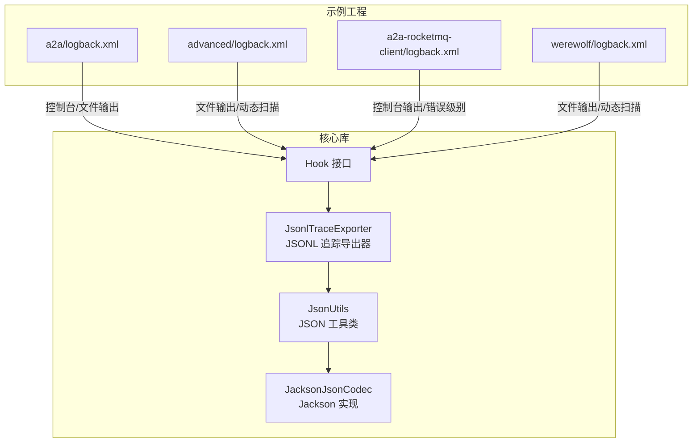
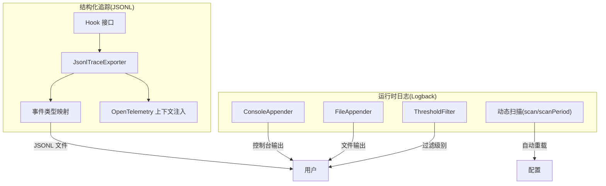
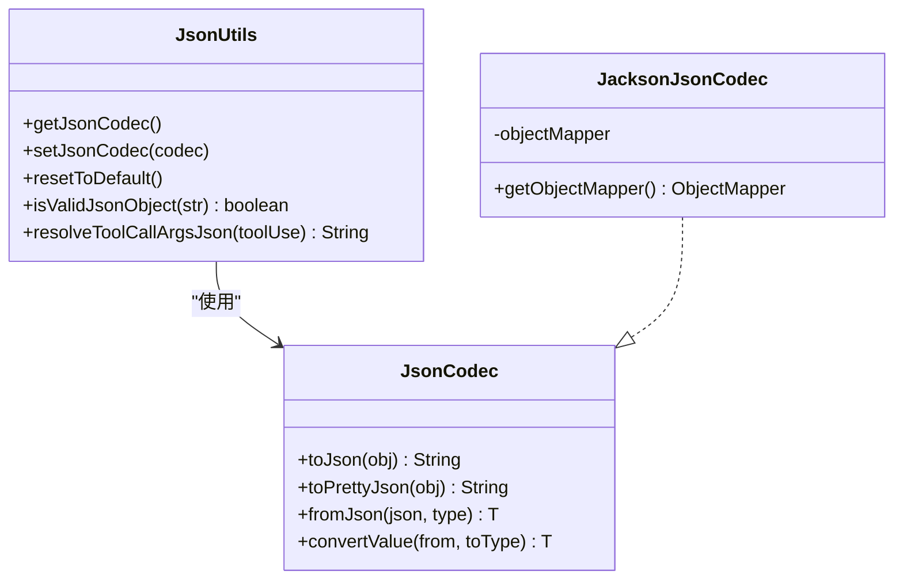
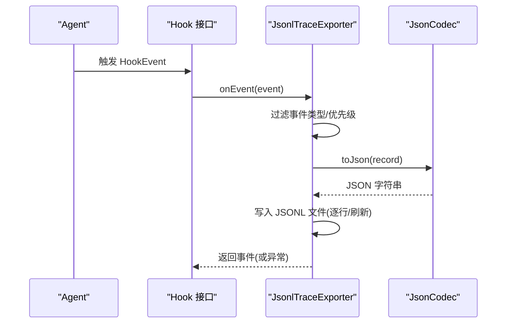
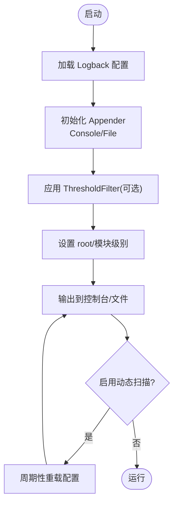
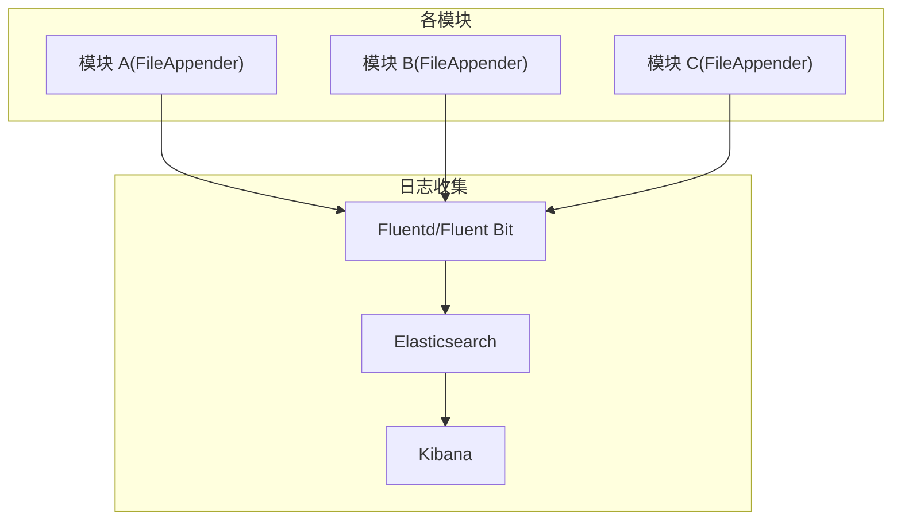
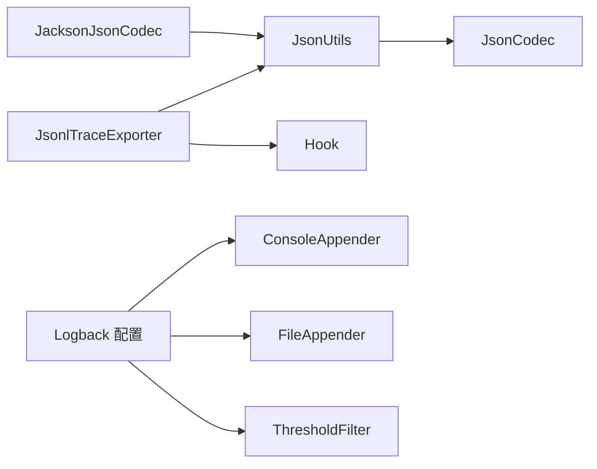

# 日志管理

<cite>
**本文引用的文件**
- [agentscope-examples/a2a/src/main/resources/logback.xml](file://agentscope-examples/a2a/src/main/resources/logback.xml)
- [agentscope-examples/advanced/src/main/resources/logback.xml](file://agentscope-examples/advanced/src/main/resources/logback.xml)
- [agentscope-examples/a2a-rocketmq/agentscope-client/src/main/resources/logback.xml](file://agentscope-examples/a2a-rocketmq/agentscope-client/src/main/resources/logback.xml)
- [agentscope-examples/werewolf/src/main/resources/logback.xml](file://agentscope-examples/werewolf/src/main/resources/logback.xml)
- [agentscope-core/src/main/java/io/agentscope/core/hook/recorder/JsonlTraceExporter.java](file://agentscope-core/src/main/java/io/agentscope/core/hook/recorder/JsonlTraceExporter.java)
- [agentscope-core/src/main/java/io/agentscope/core/hook/Hook.java](file://agentscope-core/src/main/java/io/agentscope/core/hook/Hook.java)
- [agentscope-core/src/main/java/io/agentscope/core/util/JacksonJsonCodec.java](file://agentscope-core/src/main/java/io/agentscope/core/util/JacksonJsonCodec.java)
- [agentscope-core/src/main/java/io/agentscope/core/util/JsonUtils.java](file://agentscope-core/src/main/java/io/agentscope/core/util/JsonUtils.java)
</cite>

## 目录
1. [简介](#简介)
2. [项目结构](#项目结构)
3. [核心组件](#核心组件)
4. [架构总览](#架构总览)
5. [详细组件分析](#详细组件分析)
6. [依赖关系分析](#依赖关系分析)
7. [性能考虑](#性能考虑)
8. [故障排查指南](#故障排查指南)
9. [结论](#结论)
10. [附录](#附录)

## 简介
本技术文档面向 AgentScope Java 的日志管理系统，系统性阐述结构化日志设计与实现，涵盖 JSON 格式化、字段标准化与日志级别管理；深入解析 Logback 配置策略（异步日志、滚动策略、输出格式）；并给出多模块日志聚合方案（集中式收集、过滤与搜索）、性能优化建议（缓冲、批量写入、磁盘空间管理），以及日志分析工具集成与实时监控配置思路。文档以仓库中实际存在的源码与配置文件为依据，确保内容可追溯、可落地。

## 项目结构
AgentScope 在示例工程与核心库中分别提供了多种日志配置与结构化日志能力：
- 示例工程中的 Logback 配置文件展示了控制台输出、文件输出、阈值过滤与动态扫描等策略。
- 核心库通过 Hook 事件系统与 JSONL 导出器，提供结构化追踪日志的生成与持久化能力。
- JSON 工具链（JacksonJsonCodec、JsonUtils）统一了结构化数据的序列化与反序列化，保证日志字段的一致性与可解析性。

**图表来源**
- [agentscope-examples/a2a/src/main/resources/logback.xml:1-32](file://agentscope-examples/a2a/src/main/resources/logback.xml#L1-L32)
- [agentscope-examples/advanced/src/main/resources/logback.xml:1-46](file://agentscope-examples/advanced/src/main/resources/logback.xml#L1-L46)
- [agentscope-examples/a2a-rocketmq/agentscope-client/src/main/resources/logback.xml:1-26](file://agentscope-examples/a2a-rocketmq/agentscope-client/src/main/resources/logback.xml#L1-L26)
- [agentscope-examples/werewolf/src/main/resources/logback.xml:1-35](file://agentscope-examples/werewolf/src/main/resources/logback.xml#L1-L35)
- [agentscope-core/src/main/java/io/agentscope/core/hook/Hook.java:1-187](file://agentscope-core/src/main/java/io/agentscope/core/hook/Hook.java#L1-L187)
- [agentscope-core/src/main/java/io/agentscope/core/hook/recorder/JsonlTraceExporter.java:1-544](file://agentscope-core/src/main/java/io/agentscope/core/hook/recorder/JsonlTraceExporter.java#L1-L544)
- [agentscope-core/src/main/java/io/agentscope/core/util/JsonUtils.java:1-153](file://agentscope-core/src/main/java/io/agentscope/core/util/JsonUtils.java#L1-L153)
- [agentscope-core/src/main/java/io/agentscope/core/util/JacksonJsonCodec.java:1-153](file://agentscope-core/src/main/java/io/agentscope/core/util/JacksonJsonCodec.java#L1-L153)

**章节来源**
- [agentscope-examples/a2a/src/main/resources/logback.xml:1-32](file://agentscope-examples/a2a/src/main/resources/logback.xml#L1-L32)
- [agentscope-examples/advanced/src/main/resources/logback.xml:1-46](file://agentscope-examples/advanced/src/main/resources/logback.xml#L1-L46)
- [agentscope-examples/a2a-rocketmq/agentscope-client/src/main/resources/logback.xml:1-26](file://agentscope-examples/a2a-rocketmq/agentscope-client/src/main/resources/logback.xml#L1-L26)
- [agentscope-examples/werewolf/src/main/resources/logback.xml:1-35](file://agentscope-examples/werewolf/src/main/resources/logback.xml#L1-L35)
- [agentscope-core/src/main/java/io/agentscope/core/hook/Hook.java:1-187](file://agentscope-core/src/main/java/io/agentscope/core/hook/Hook.java#L1-L187)
- [agentscope-core/src/main/java/io/agentscope/core/hook/recorder/JsonlTraceExporter.java:1-544](file://agentscope-core/src/main/java/io/agentscope/core/hook/recorder/JsonlTraceExporter.java#L1-L544)
- [agentscope-core/src/main/java/io/agentscope/core/util/JsonUtils.java:1-153](file://agentscope-core/src/main/java/io/agentscope/core/util/JsonUtils.java#L1-L153)
- [agentscope-core/src/main/java/io/agentscope/core/util/JacksonJsonCodec.java:1-153](file://agentscope-core/src/main/java/io/agentscope/core/util/JacksonJsonCodec.java#L1-L153)

## 核心组件
- 结构化日志与 JSON 序列化：通过 JsonUtils 统一访问 JsonCodec，默认使用 JacksonJsonCodec，提供 toPrettyJson、toJson、fromJson 等能力，保证日志字段的稳定与可解析。
- Hook 事件系统：统一的 Hook 接口定义事件处理与优先级，支持在推理、工具调用、总结等阶段注入日志与指标。
- JSONL 追踪导出器：JsonlTraceExporter 将 Hook 事件按行输出为 JSONL 文件，支持事件类型映射、OpenTelemetry 上下文注入、失败快速模式与逐行刷新等配置。
- Logback 配置：示例工程提供多种配置模板，覆盖控制台输出、文件输出、动态扫描、阈值过滤与模块化日志级别。

**章节来源**
- [agentscope-core/src/main/java/io/agentscope/core/util/JsonUtils.java:1-153](file://agentscope-core/src/main/java/io/agentscope/core/util/JsonUtils.java#L1-L153)
- [agentscope-core/src/main/java/io/agentscope/core/util/JacksonJsonCodec.java:1-153](file://agentscope-core/src/main/java/io/agentscope/core/util/JacksonJsonCodec.java#L1-L153)
- [agentscope-core/src/main/java/io/agentscope/core/hook/Hook.java:1-187](file://agentscope-core/src/main/java/io/agentscope/core/hook/Hook.java#L1-L187)
- [agentscope-core/src/main/java/io/agentscope/core/hook/recorder/JsonlTraceExporter.java:1-544](file://agentscope-core/src/main/java/io/agentscope/core/hook/recorder/JsonlTraceExporter.java#L1-L544)
- [agentscope-examples/a2a/src/main/resources/logback.xml:1-32](file://agentscope-examples/a2a/src/main/resources/logback.xml#L1-L32)
- [agentscope-examples/advanced/src/main/resources/logback.xml:1-46](file://agentscope-examples/advanced/src/main/resources/logback.xml#L1-L46)
- [agentscope-examples/a2a-rocketmq/agentscope-client/src/main/resources/logback.xml:1-26](file://agentscope-examples/a2a-rocketmq/agentscope-client/src/main/resources/logback.xml#L1-L26)
- [agentscope-examples/werewolf/src/main/resources/logback.xml:1-35](file://agentscope-examples/werewolf/src/main/resources/logback.xml#L1-L35)

## 架构总览
AgentScope 的日志体系由“运行时日志”和“结构化追踪日志”两部分组成：
- 运行时日志：基于 Logback 的 Console/File 输出，结合阈值过滤与动态扫描，满足开发调试与生产落盘需求。
- 结构化追踪日志：基于 Hook 事件系统，将推理、工具调用、错误等关键节点转换为 JSONL 行，便于离线分析与问题定位。

**图表来源**
- [agentscope-examples/advanced/src/main/resources/logback.xml:18-46](file://agentscope-examples/advanced/src/main/resources/logback.xml#L18-L46)
- [agentscope-examples/a2a/src/main/resources/logback.xml:18-32](file://agentscope-examples/a2a/src/main/resources/logback.xml#L18-L32)
- [agentscope-examples/a2a-rocketmq/agentscope-client/src/main/resources/logback.xml:16-26](file://agentscope-examples/a2a-rocketmq/agentscope-client/src/main/resources/logback.xml#L16-L26)
- [agentscope-examples/werewolf/src/main/resources/logback.xml:18-35](file://agentscope-examples/werewolf/src/main/resources/logback.xml#L18-L35)
- [agentscope-core/src/main/java/io/agentscope/core/hook/Hook.java:1-187](file://agentscope-core/src/main/java/io/agentscope/core/hook/Hook.java#L1-L187)
- [agentscope-core/src/main/java/io/agentscope/core/hook/recorder/JsonlTraceExporter.java:1-544](file://agentscope-core/src/main/java/io/agentscope/core/hook/recorder/JsonlTraceExporter.java#L1-L544)

## 详细组件分析

### 结构化日志与 JSON 格式化
- 统一编码器：JsonUtils 提供全局 JsonCodec 访问点，默认实现为 JacksonJsonCodec，具备时间模块注册与未知字段忽略等特性，确保序列化稳定性。
- 字段标准化：JsonlTraceExporter 将 Hook 事件映射为固定字段（如 ts、event_type、agent_id、run_id、turn_id、step_id、trace_id、span_id 等），并针对不同事件类型补充模型名、消息、增量块、工具结果、错误信息等上下文，形成一致的 JSONL 模式。
- 失败策略：支持 failFast 模式（失败中断执行）与最佳努力模式（记录告警但不中断），默认最佳努力，避免日志导出影响主流程。

**图表来源**
- [agentscope-core/src/main/java/io/agentscope/core/util/JsonUtils.java:1-153](file://agentscope-core/src/main/java/io/agentscope/core/util/JsonUtils.java#L1-L153)
- [agentscope-core/src/main/java/io/agentscope/core/util/JacksonJsonCodec.java:1-153](file://agentscope-core/src/main/java/io/agentscope/core/util/JacksonJsonCodec.java#L1-L153)

**章节来源**
- [agentscope-core/src/main/java/io/agentscope/core/util/JsonUtils.java:1-153](file://agentscope-core/src/main/java/io/agentscope/core/util/JsonUtils.java#L1-L153)
- [agentscope-core/src/main/java/io/agentscope/core/util/JacksonJsonCodec.java:1-153](file://agentscope-core/src/main/java/io/agentscope/core/util/JacksonJsonCodec.java#L1-L153)

### Hook 事件系统与日志级别管理
- 事件模型：Hook 接口统一接收所有 Agent 执行事件，通过优先级（数值越小优先级越高）与注册顺序决定执行顺序；事件类型覆盖预推理、推理流式、后推理、预行动、行动流式、后行动、总结与错误等。
- 日志级别：示例工程通过 Logback 的 logger/root level 与 ThresholdFilter 控制输出级别；同时可通过模块路径（如 io.agentscope.core.a2a.agent）进行精细化级别管理。

**图表来源**
- [agentscope-core/src/main/java/io/agentscope/core/hook/Hook.java:1-187](file://agentscope-core/src/main/java/io/agentscope/core/hook/Hook.java#L1-L187)
- [agentscope-core/src/main/java/io/agentscope/core/hook/recorder/JsonlTraceExporter.java:1-544](file://agentscope-core/src/main/java/io/agentscope/core/hook/recorder/JsonlTraceExporter.java#L1-L544)
- [agentscope-core/src/main/java/io/agentscope/core/util/JacksonJsonCodec.java:1-153](file://agentscope-core/src/main/java/io/agentscope/core/util/JacksonJsonCodec.java#L1-L153)

**章节来源**
- [agentscope-core/src/main/java/io/agentscope/core/hook/Hook.java:1-187](file://agentscope-core/src/main/java/io/agentscope/core/hook/Hook.java#L1-L187)
- [agentscope-examples/a2a/src/main/resources/logback.xml:25-26](file://agentscope-examples/a2a/src/main/resources/logback.xml#L25-L26)

### Logback 配置策略
- 控制台输出：示例工程提供 ConsoleAppender，用于本地开发与调试，可设置时间戳、线程、级别、Logger 名称与消息。
- 文件输出：FileAppender 支持文件路径、追加/截断、字符集与自定义输出模式；示例中包含 TraceId、RequestId、Uid 等上下文字段，便于跨服务关联。
- 动态扫描：scan 与 scanPeriod 允许在运行时自动重载配置，减少重启成本。
- 阈值过滤：ThresholdFilter 可限制控制台输出最低级别，避免噪声。
- 模块化级别：通过 logger 节点对特定包路径设置级别，实现细粒度控制。

**图表来源**
- [agentscope-examples/advanced/src/main/resources/logback.xml:18-46](file://agentscope-examples/advanced/src/main/resources/logback.xml#L18-L46)
- [agentscope-examples/a2a/src/main/resources/logback.xml:18-32](file://agentscope-examples/a2a/src/main/resources/logback.xml#L18-L32)
- [agentscope-examples/a2a-rocketmq/agentscope-client/src/main/resources/logback.xml:16-26](file://agentscope-examples/a2a-rocketmq/agentscope-client/src/main/resources/logback.xml#L16-L26)
- [agentscope-examples/werewolf/src/main/resources/logback.xml:18-35](file://agentscope-examples/werewolf/src/main/resources/logback.xml#L18-L35)

**章节来源**
- [agentscope-examples/advanced/src/main/resources/logback.xml:18-46](file://agentscope-examples/advanced/src/main/resources/logback.xml#L18-L46)
- [agentscope-examples/a2a/src/main/resources/logback.xml:18-32](file://agentscope-examples/a2a/src/main/resources/logback.xml#L18-L32)
- [agentscope-examples/a2a-rocketmq/agentscope-client/src/main/resources/logback.xml:16-26](file://agentscope-examples/a2a-rocketmq/agentscope-client/src/main/resources/logback.xml#L16-L26)
- [agentscope-examples/werewolf/src/main/resources/logback.xml:18-35](file://agentscope-examples/werewolf/src/main/resources/logback.xml#L18-L35)

### 多模块日志聚合方案
- 集中式收集：在容器化或分布式部署场景，建议将各模块的 FileAppender 输出目录挂载至统一日志收集系统（如 Fluentd/Fluent Bit/Logstash）。
- 日志过滤与搜索：利用 JSONL 字段（如 agent_id、run_id、event_type、trace_id、span_id）在 ELK 或类似平台建立索引，实现按会话、事件类型、错误堆栈等维度检索。
- 事件类型映射：JsonlTraceExporter 已将 Hook 事件标准化为 JSONL，便于下游系统统一解析与可视化。

[此图为概念性示意，无需图表来源]

## 依赖关系分析
- JsonUtils 依赖 JsonCodec，默认实现为 JacksonJsonCodec，负责 JSON 序列化与反序列化。
- JsonlTraceExporter 依赖 Hook 事件系统与 JsonUtils，将事件映射为 JSONL 并写入文件。
- Logback 配置文件独立于核心逻辑，通过 Appender/Filter/Logger 管理运行时日志输出。

**图表来源**
- [agentscope-core/src/main/java/io/agentscope/core/util/JsonUtils.java:1-153](file://agentscope-core/src/main/java/io/agentscope/core/util/JsonUtils.java#L1-L153)
- [agentscope-core/src/main/java/io/agentscope/core/util/JacksonJsonCodec.java:1-153](file://agentscope-core/src/main/java/io/agentscope/core/util/JacksonJsonCodec.java#L1-L153)
- [agentscope-core/src/main/java/io/agentscope/core/hook/recorder/JsonlTraceExporter.java:1-544](file://agentscope-core/src/main/java/io/agentscope/core/hook/recorder/JsonlTraceExporter.java#L1-L544)
- [agentscope-core/src/main/java/io/agentscope/core/hook/Hook.java:1-187](file://agentscope-core/src/main/java/io/agentscope/core/hook/Hook.java#L1-L187)
- [agentscope-examples/advanced/src/main/resources/logback.xml:18-46](file://agentscope-examples/advanced/src/main/resources/logback.xml#L18-L46)

**章节来源**
- [agentscope-core/src/main/java/io/agentscope/core/util/JsonUtils.java:1-153](file://agentscope-core/src/main/java/io/agentscope/core/util/JsonUtils.java#L1-L153)
- [agentscope-core/src/main/java/io/agentscope/core/util/JacksonJsonCodec.java:1-153](file://agentscope-core/src/main/java/io/agentscope/core/util/JacksonJsonCodec.java#L1-L153)
- [agentscope-core/src/main/java/io/agentscope/core/hook/recorder/JsonlTraceExporter.java:1-544](file://agentscope-core/src/main/java/io/agentscope/core/hook/recorder/JsonlTraceExporter.java#L1-L544)
- [agentscope-core/src/main/java/io/agentscope/core/hook/Hook.java:1-187](file://agentscope-core/src/main/java/io/agentscope/core/hook/Hook.java#L1-L187)
- [agentscope-examples/advanced/src/main/resources/logback.xml:18-46](file://agentscope-examples/advanced/src/main/resources/logback.xml#L18-L46)

## 性能考虑
- 异步日志：示例配置未直接使用 Logback AsyncAppender，可在高吞吐场景引入异步 Appender 降低阻塞；同时注意队列容量与丢弃策略。
- 缓冲与批量写入：JsonlTraceExporter 使用单线程队列与 BufferedWrite，逐行写入并可选择逐行刷新；在磁盘 IO 压力较大时可评估批量写入策略与刷盘频率。
- 磁盘空间管理：建议结合 FileAppender 的滚动策略（如 SizeAndTimeBasedRollingPolicy）与保留策略，避免无限增长；同时定期清理旧日志或归档。
- 事件过滤：通过 JsonlTraceExporter 的事件过滤器仅保留必要事件类型，减少 JSONL 文件体积与下游解析压力。
- 失败快速模式：在需要强一致性的生产环境可启用 failFast，避免日志导出异常掩盖业务异常。

[本节为通用性能建议，不涉及具体文件分析]

## 故障排查指南
- JSON 序列化异常：JsonUtils/JacksonJsonCodec 在序列化失败时抛出异常并记录错误日志，检查对象结构与字段类型。
- JSONL 导出异常：JsonlTraceExporter 默认最佳努力模式，若出现导出失败会记录告警；可启用 failFast 快速暴露问题。
- 关闭与资源释放：JsonlTraceExporter 提供关闭方法，等待待写任务完成或超时，确保数据一致性。
- Logback 配置生效：确认 scan/scanPeriod 设置与权限；检查 logger 路径是否匹配包路径，避免级别被覆盖。

**章节来源**
- [agentscope-core/src/main/java/io/agentscope/core/util/JsonUtils.java:88-114](file://agentscope-core/src/main/java/io/agentscope/core/util/JsonUtils.java#L88-L114)
- [agentscope-core/src/main/java/io/agentscope/core/util/JacksonJsonCodec.java:88-151](file://agentscope-core/src/main/java/io/agentscope/core/util/JacksonJsonCodec.java#L88-L151)
- [agentscope-core/src/main/java/io/agentscope/core/hook/recorder/JsonlTraceExporter.java:136-148](file://agentscope-core/src/main/java/io/agentscope/core/hook/recorder/JsonlTraceExporter.java#L136-L148)
- [agentscope-core/src/main/java/io/agentscope/core/hook/recorder/JsonlTraceExporter.java:297-331](file://agentscope-core/src/main/java/io/agentscope/core/hook/recorder/JsonlTraceExporter.java#L297-L331)

## 结论
AgentScope Java 的日志体系以 Logback 运行时日志与 Hook 结构化追踪日志为核心，配合统一的 JSON 工具链，实现了从格式化、字段标准化到事件过滤与持久化的完整闭环。通过示例工程的多样化配置与核心库的事件导出器，开发者可以在不同环境下灵活选择输出方式，并借助 JSONL 的结构化特性实现高效的离线分析与问题定位。建议在生产环境中结合异步 Appender、滚动策略与磁盘空间管理，持续优化日志系统的吞吐与稳定性。

## 附录
- 日志字段参考（来自 JSONL 导出器）：ts、event_type、agent_id、agent_name、run_id、turn_id、step_id、trace_id、span_id、model_name、generate_options、input_messages、final_message、reasoning_message、tool_use、tool_result、error_class、error_message、stacktrace 等。
- 建议的 Logback 扩展：AsyncAppender、SizeAndTimeBasedRollingPolicy、自定义 encoder pattern 以适配集中式日志平台。