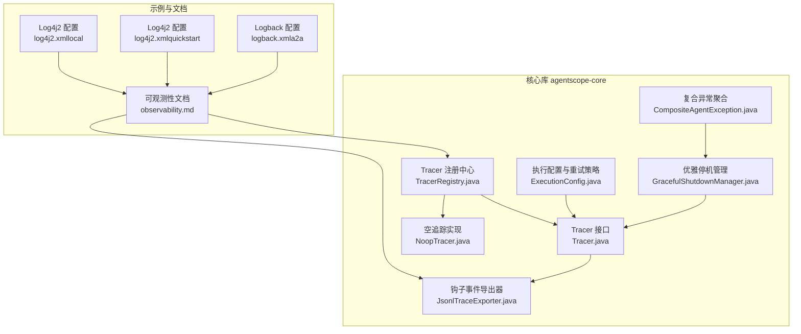
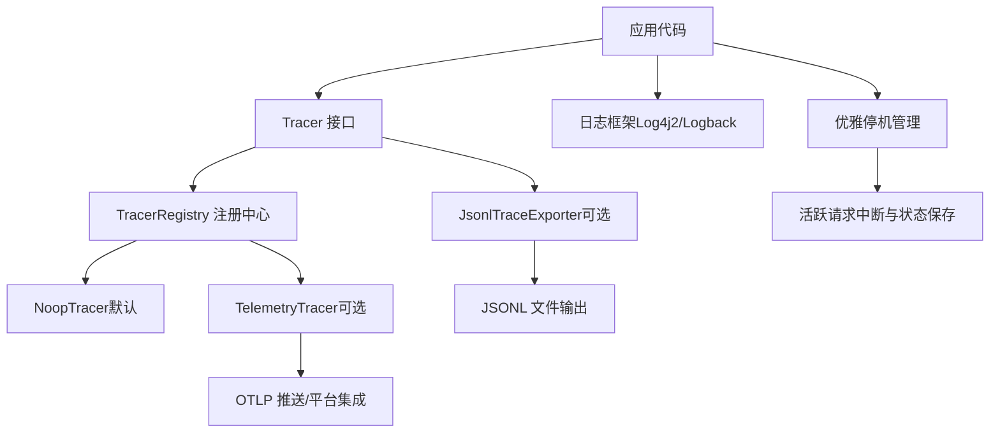
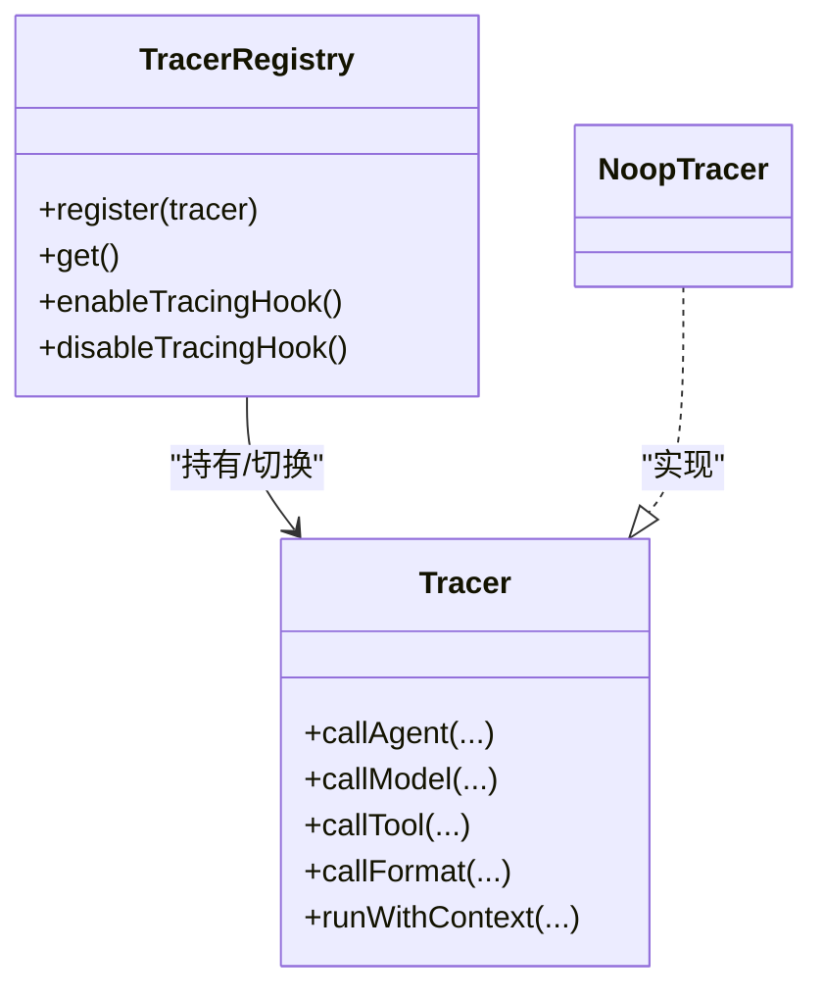
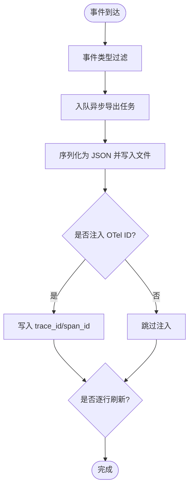
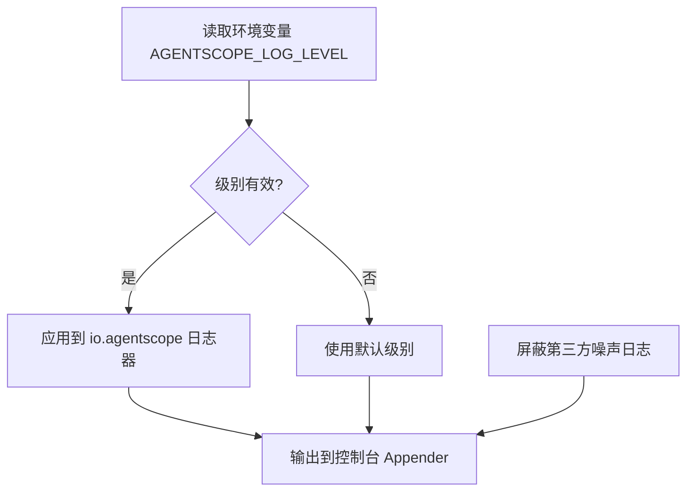
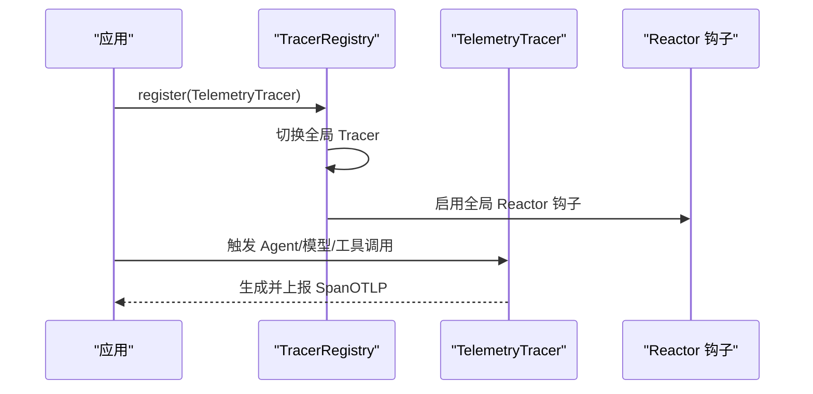
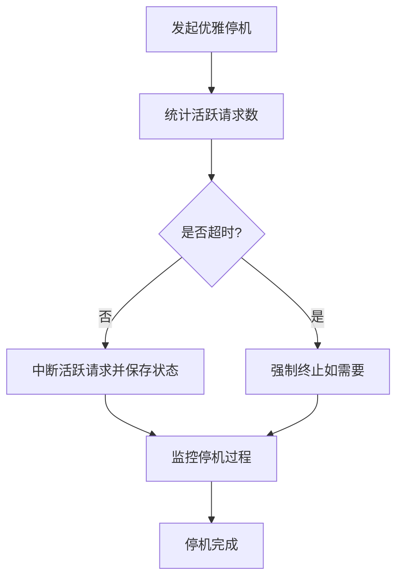
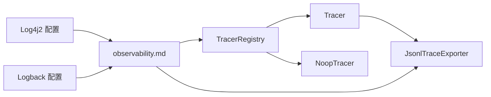

# 监控与调试

<cite>
**本文引用的文件**
- [Tracer.java](file://agentscope-core/src/main/java/io/agentscope/core/tracing/Tracer.java)
- [TracerRegistry.java](file://agentscope-core/src/main/java/io/agentscope/core/tracing/TracerRegistry.java)
- [NoopTracer.java](file://agentscope-core/src/main/java/io/agentscope/core/tracing/NoopTracer.java)
- [JsonlTraceExporter.java](file://agentscope-core/src/main/java/io/agentscope/core/hook/recorder/JsonlTraceExporter.java)
- [observability.md](file://docs/zh/task/observability.md)
- [log4j2.xml（harness-example-local）](file://agentscope-examples/harness-examples/harness-example-local/src/main/resources/log4j2.xml)
- [log4j2.xml（harness-quickstart）](file://agentscope-examples/harness-examples/harness-quickstart/src/main/resources/log4j2.xml)
- [logback.xml（a2a 示例）](file://agentscope-examples/a2a/src/main/resources/logback.xml)
- [GracefulShutdownManager.java](file://agentscope-core/src/main/java/io/agentscope/core/shutdown/GracefulShutdownManager.java)
- [CompositeAgentException.java](file://agentscope-core/src/main/java/io/agentscope/core/exception/CompositeAgentException.java)
- [ExecutionConfig.java](file://agentscope-core/src/main/java/io/agentscope/core/model/ExecutionConfig.java)
</cite>

## 目录
1. [引言](#引言)
2. [项目结构](#项目结构)
3. [核心组件](#核心组件)
4. [架构总览](#架构总览)
5. [组件详解](#组件详解)
6. [依赖关系分析](#依赖关系分析)
7. [性能考量](#性能考量)
8. [故障诊断与排错指南](#故障诊断与排错指南)
9. [结论](#结论)
10. [附录](#附录)

## 引言
本文件面向 AgentScope Java 的监控与调试场景，系统化阐述分布式追踪、日志采集与聚合、性能指标设计与采集、故障诊断方法论以及告警与应急响应流程。内容基于仓库中已实现的追踪注册中心、钩子事件导出器、日志配置示例及优雅停机机制等模块，帮助读者快速落地可观测性能力并提升问题定位效率。

## 项目结构
围绕监控与调试的关键模块主要分布在以下位置：
- 分布式追踪与上下文传播：agentscope-core/tracing 下的 Tracer 接口、TracerRegistry 注册中心与 NoopTracer 空实现
- 钩子事件与 JSONL 导出：agentscope-core/hook/recorder 下的 JsonlTraceExporter
- 文档与示例：docs/zh/task/observability.md 提供追踪接入与配置说明；examples 中包含 Log4j2 与 Logback 的日志配置示例
- 优雅停机与异常聚合：agentscope-core/shutdown 与 agentscope-core/exception 下的相关类

图表来源
- [Tracer.java:35-68](file://agentscope-core/src/main/java/io/agentscope/core/tracing/Tracer.java#L35-L68)
- [TracerRegistry.java:40-154](file://agentscope-core/src/main/java/io/agentscope/core/tracing/TracerRegistry.java#L40-L154)
- [NoopTracer.java:19-19](file://agentscope-core/src/main/java/io/agentscope/core/tracing/NoopTracer.java#L19-L19)
- [JsonlTraceExporter.java:82-544](file://agentscope-core/src/main/java/io/agentscope/core/hook/recorder/JsonlTraceExporter.java#L82-L544)
- [observability.md:269-307](file://docs/zh/task/observability.md#L269-L307)
- [log4j2.xml（harness-example-local）:21-49](file://agentscope-examples/harness-examples/harness-example-local/src/main/resources/log4j2.xml#L21-L49)
- [log4j2.xml（harness-quickstart）:21-49](file://agentscope-examples/harness-examples/harness-quickstart/src/main/resources/log4j2.xml#L21-L49)
- [logback.xml（a2a 示例）:18-31](file://agentscope-examples/a2a/src/main/resources/logback.xml#L18-L31)
- [GracefulShutdownManager.java:198-213](file://agentscope-core/src/main/java/io/agentscope/core/shutdown/GracefulShutdownManager.java#L198-L213)
- [CompositeAgentException.java:40-84](file://agentscope-core/src/main/java/io/agentscope/core/exception/CompositeAgentException.java#L40-L84)
- [ExecutionConfig.java:63-105](file://agentscope-core/src/main/java/io/agentscope/core/model/ExecutionConfig.java#L63-L105)

章节来源
- [Tracer.java:35-68](file://agentscope-core/src/main/java/io/agentscope/core/tracing/Tracer.java#L35-L68)
- [TracerRegistry.java:40-154](file://agentscope-core/src/main/java/io/agentscope/core/tracing/TracerRegistry.java#L40-L154)
- [JsonlTraceExporter.java:82-544](file://agentscope-core/src/main/java/io/agentscope/core/hook/recorder/JsonlTraceExporter.java#L82-L544)
- [observability.md:269-307](file://docs/zh/task/observability.md#L269-L307)

## 核心组件
- Tracer 接口：定义对 Agent 调用、模型调用、工具调用与消息格式化的可插拔追踪扩展点，默认实现为空操作，便于在不启用追踪时零开销。
- TracerRegistry 注册中心：提供全局 Tracer 实例注册、Reactors 全局上下文传播钩子的启用/禁用，支持在运行时切换追踪实现并控制跨异步边界的上下文传播。
- NoopTracer 空实现：默认注册的追踪器，禁用 Reactor 上下文传播钩子，避免不必要的性能影响。
- JsonlTraceExporter 钩子导出器：基于 Hook 事件系统输出结构化 JSONL 行，支持按事件类型过滤、失败快速失败模式、逐行刷新、OpenTelemetry ID 注入等，适合本地调试与离线问题复盘。
- 日志配置示例：Log4j2 与 Logback 的配置展示了如何按包级别调整日志等级、屏蔽噪声日志、输出到控制台等，便于在不同环境中统一日志策略。
- 优雅停机与异常聚合：GracefulShutdownManager 在停机阶段中断活跃请求并保存状态；CompositeAgentException 聚合多 Agent 异常信息，便于统一上报与诊断。
- 执行配置与重试策略：ExecutionConfig 定义了可重试错误类别与退避策略，有助于在不稳定网络或上游限流场景下提升稳定性。

章节来源
- [Tracer.java:35-68](file://agentscope-core/src/main/java/io/agentscope/core/tracing/Tracer.java#L35-L68)
- [TracerRegistry.java:40-154](file://agentscope-core/src/main/java/io/agentscope/core/tracing/TracerRegistry.java#L40-L154)
- [NoopTracer.java:19-19](file://agentscope-core/src/main/java/io/agentscope/core/tracing/NoopTracer.java#L19-L19)
- [JsonlTraceExporter.java:82-544](file://agentscope-core/src/main/java/io/agentscope/core/hook/recorder/JsonlTraceExporter.java#L82-L544)
- [log4j2.xml（harness-example-local）:21-49](file://agentscope-examples/harness-examples/harness-example-local/src/main/resources/log4j2.xml#L21-L49)
- [log4j2.xml（harness-quickstart）:21-49](file://agentscope-examples/harness-examples/harness-quickstart/src/main/resources/log4j2.xml#L21-L49)
- [logback.xml（a2a 示例）:18-31](file://agentscope-examples/a2a/src/main/resources/logback.xml#L18-L31)
- [GracefulShutdownManager.java:198-213](file://agentscope-core/src/main/java/io/agentscope/core/shutdown/GracefulShutdownManager.java#L198-L213)
- [CompositeAgentException.java:40-84](file://agentscope-core/src/main/java/io/agentscope/core/exception/CompositeAgentException.java#L40-L84)
- [ExecutionConfig.java:63-105](file://agentscope-core/src/main/java/io/agentscope/core/model/ExecutionConfig.java#L63-L105)

## 架构总览
AgentScope 的监控与调试体系由“追踪注册中心 + 可插拔追踪器 + 钩子事件导出 + 日志配置 + 优雅停机”构成，形成从端到端的可观测闭环。

图表来源
- [Tracer.java:35-68](file://agentscope-core/src/main/java/io/agentscope/core/tracing/Tracer.java#L35-L68)
- [TracerRegistry.java:40-154](file://agentscope-core/src/main/java/io/agentscope/core/tracing/TracerRegistry.java#L40-L154)
- [NoopTracer.java:19-19](file://agentscope-core/src/main/java/io/agentscope/core/tracing/NoopTracer.java#L19-L19)
- [JsonlTraceExporter.java:82-544](file://agentscope-core/src/main/java/io/agentscope/core/hook/recorder/JsonlTraceExporter.java#L82-L544)
- [observability.md:269-307](file://docs/zh/task/observability.md#L269-L307)
- [GracefulShutdownManager.java:198-213](file://agentscope-core/src/main/java/io/agentscope/core/shutdown/GracefulShutdownManager.java#L198-L213)

## 组件详解

### 分布式追踪与上下文传播
- Tracer 接口提供了对 Agent 调用、模型调用、工具调用与消息格式化的扩展点，默认实现为空操作，便于在不启用追踪时零开销。
- TracerRegistry 提供全局 Tracer 注册，并通过 Reactor 全局钩子在操作符链上注入/恢复追踪上下文，影响 JVM 内所有 Reactor 流，需谨慎启用以避免性能影响。
- NoopTracer 作为默认实现，会禁用 Reactor 上下文传播钩子，确保默认情况下无追踪开销。

图表来源
- [Tracer.java:35-68](file://agentscope-core/src/main/java/io/agentscope/core/tracing/Tracer.java#L35-L68)
- [TracerRegistry.java:40-154](file://agentscope-core/src/main/java/io/agentscope/core/tracing/TracerRegistry.java#L40-L154)
- [NoopTracer.java:19-19](file://agentscope-core/src/main/java/io/agentscope/core/tracing/NoopTracer.java#L19-L19)

章节来源
- [Tracer.java:35-68](file://agentscope-core/src/main/java/io/agentscope/core/tracing/Tracer.java#L35-L68)
- [TracerRegistry.java:40-154](file://agentscope-core/src/main/java/io/agentscope/core/tracing/TracerRegistry.java#L40-L154)
- [NoopTracer.java:19-19](file://agentscope-core/src/main/java/io/agentscope/core/tracing/NoopTracer.java#L19-L19)

### 钩子事件与 JSONL 导出
- JsonlTraceExporter 基于 Hook 事件系统，将每个事件写为一行 JSON 对象，支持：
  - 事件类型过滤（如预调用、推理、行动、后处理、错误等）
  - 失败快速失败模式（failFast）
  - 逐行刷新与追加写入
  - 自动注入 OpenTelemetry trace_id/span_id（若可用）
  - 生成 run_id/turn_id/step_id，保证一次交互内的时序一致性
- 导出器内部使用单线程队列进行阻塞式文件写入，确保顺序与一致性。

图表来源
- [JsonlTraceExporter.java:124-247](file://agentscope-core/src/main/java/io/agentscope/core/hook/recorder/JsonlTraceExporter.java#L124-L247)
- [JsonlTraceExporter.java:333-434](file://agentscope-core/src/main/java/io/agentscope/core/hook/recorder/JsonlTraceExporter.java#L333-L434)

章节来源
- [JsonlTraceExporter.java:82-544](file://agentscope-core/src/main/java/io/agentscope/core/hook/recorder/JsonlTraceExporter.java#L82-L544)

### 日志收集与聚合策略
- Log4j2 配置示例展示了：
  - 通过环境变量动态调整 io.agentscope 包的日志级别
  - 屏蔽第三方噪声日志（Netty、Reactor、OkHttp、阿里巴巴等）
  - 控制台输出模式与时间戳、级别、类名、消息与堆栈
- Logback 配置示例展示了：
  - 按包设置 DEBUG/INFO 等级
  - 将 AgentScope 特定包的日志降级以减少噪音
  - 输出到控制台

图表来源
- [log4j2.xml（harness-example-local）:21-49](file://agentscope-examples/harness-examples/harness-example-local/src/main/resources/log4j2.xml#L21-L49)
- [log4j2.xml（harness-quickstart）:21-49](file://agentscope-examples/harness-examples/harness-quickstart/src/main/resources/log4j2.xml#L21-L49)
- [logback.xml（a2a 示例）:18-31](file://agentscope-examples/a2a/src/main/resources/logback.xml#L18-L31)

章节来源
- [log4j2.xml（harness-example-local）:21-49](file://agentscope-examples/harness-examples/harness-example-local/src/main/resources/log4j2.xml#L21-L49)
- [log4j2.xml（harness-quickstart）:21-49](file://agentscope-examples/harness-examples/harness-quickstart/src/main/resources/log4j2.xml#L21-L49)
- [logback.xml（a2a 示例）:18-31](file://agentscope-examples/a2a/src/main/resources/logback.xml#L18-L31)

### 性能监控指标设计与采集
- JVM 指标：建议结合 Micrometer 与 Actuator 暴露 JVM/应用指标（如 GC、堆、线程、内存、请求耗时等），并在容器化部署中通过 Prometheus 抓取。
- 业务指标：围绕 Agent 生命周期关键节点（推理开始/结束、工具调用耗时、消息格式化耗时、总结阶段耗时）埋点，形成端到端时延分布。
- 自定义指标：针对特定工具或模型调用失败率、重试次数、超时比例等建立告警阈值。
- 采集方式：优先采用异步采样与批量上报，避免对主业务路径造成干扰。

[本节为通用实践说明，不直接分析具体文件，故无章节来源]

### OpenTelemetry 集成与链路追踪配置
- 文档明确指出，一旦注册 TelemetryTracer，将自动捕获 Agent 调用、模型调用、工具执行与消息格式化等关键 Span。
- TelemetryTracer 支持的 Builder 选项包括 endpoint、headers、enabled、tracer 等，便于对接 Langfuse 或其他 OTLP 平台。
- 通过 TracerRegistry.register 注册 TelemetryTracer 后，会自动启用 Reactor 上下文传播钩子，确保跨异步边界的追踪上下文一致。

图表来源
- [observability.md:269-307](file://docs/zh/task/observability.md#L269-L307)
- [TracerRegistry.java:74-126](file://agentscope-core/src/main/java/io/agentscope/core/tracing/TracerRegistry.java#L74-L126)
- [Tracer.java:35-68](file://agentscope-core/src/main/java/io/agentscope/core/tracing/Tracer.java#L35-L68)

章节来源
- [observability.md:269-307](file://docs/zh/task/observability.md#L269-L307)
- [TracerRegistry.java:40-154](file://agentscope-core/src/main/java/io/agentscope/core/tracing/TracerRegistry.java#L40-L154)

### 优雅停机与问题排查
- 优雅停机：GracefulShutdownManager 在停机阶段中断活跃请求并保存状态，记录停机启动时间与超时配置，保障服务平滑退出。
- 异常聚合：CompositeAgentException 聚合多 Agent 的异常信息，包含 agentId、agentName 与异常摘要，便于统一上报与根因分析。
- 重试策略：ExecutionConfig 定义可重试错误类别与退避策略，降低瞬时故障对整体可用性的影响。

图表来源
- [GracefulShutdownManager.java:198-213](file://agentscope-core/src/main/java/io/agentscope/core/shutdown/GracefulShutdownManager.java#L198-L213)
- [CompositeAgentException.java:40-84](file://agentscope-core/src/main/java/io/agentscope/core/exception/CompositeAgentException.java#L40-L84)
- [ExecutionConfig.java:63-105](file://agentscope-core/src/main/java/io/agentscope/core/model/ExecutionConfig.java#L63-L105)

章节来源
- [GracefulShutdownManager.java:198-213](file://agentscope-core/src/main/java/io/agentscope/core/shutdown/GracefulShutdownManager.java#L198-L213)
- [CompositeAgentException.java:40-84](file://agentscope-core/src/main/java/io/agentscope/core/exception/CompositeAgentException.java#L40-L84)
- [ExecutionConfig.java:63-105](file://agentscope-core/src/main/java/io/agentscope/core/model/ExecutionConfig.java#L63-L105)

## 依赖关系分析
- TracerRegistry 与 Tracer/NoopTracer：注册中心负责切换全局 Tracer，并根据实现启用/禁用 Reactor 上下文传播钩子。
- JsonlTraceExporter 与 Hook 事件：导出器订阅 Hook 事件，按配置过滤并写入 JSONL 文件，同时尝试注入 OpenTelemetry ID。
- 日志配置与文档：Log4j2/Logback 配置与 observability.md 文档共同构成日志与追踪的接入指引。

图表来源
- [TracerRegistry.java:40-154](file://agentscope-core/src/main/java/io/agentscope/core/tracing/TracerRegistry.java#L40-L154)
- [Tracer.java:35-68](file://agentscope-core/src/main/java/io/agentscope/core/tracing/Tracer.java#L35-L68)
- [NoopTracer.java:19-19](file://agentscope-core/src/main/java/io/agentscope/core/tracing/NoopTracer.java#L19-L19)
- [JsonlTraceExporter.java:82-544](file://agentscope-core/src/main/java/io/agentscope/core/hook/recorder/JsonlTraceExporter.java#L82-L544)
- [observability.md:269-307](file://docs/zh/task/observability.md#L269-L307)
- [log4j2.xml（harness-example-local）:21-49](file://agentscope-examples/harness-examples/harness-example-local/src/main/resources/log4j2.xml#L21-L49)
- [logback.xml（a2a 示例）:18-31](file://agentscope-examples/a2a/src/main/resources/logback.xml#L18-L31)

章节来源
- [TracerRegistry.java:40-154](file://agentscope-core/src/main/java/io/agentscope/core/tracing/TracerRegistry.java#L40-L154)
- [JsonlTraceExporter.java:82-544](file://agentscope-core/src/main/java/io/agentscope/core/hook/recorder/JsonlTraceExporter.java#L82-L544)
- [observability.md:269-307](file://docs/zh/task/observability.md#L269-L307)

## 性能考量
- 追踪上下文传播钩子会对所有 Reactor 操作引入额外开销，仅在需要跨异步边界的上下文传播时启用。
- JSONL 导出器采用单线程队列与阻塞 IO，保证顺序与一致性，但可能成为高并发下的瓶颈，建议在生产环境限制事件量或采用异步落盘方案。
- 日志级别与噪声日志屏蔽可显著降低 I/O 压力，建议在生产环境统一收敛日志级别并输出到集中式日志系统。

[本节为通用指导，不直接分析具体文件，故无章节来源]

## 故障诊断与排错指南
- 慢查询分析
  - 使用 TelemetryTracer 记录端到端 Span，定位推理、工具调用与消息格式化阶段的热点。
  - 结合 JSONL 导出器中的 run_id/turn_id/step_id，复原一次交互的完整时序。
- 内存泄漏检测
  - 关注 JsonlTraceExporter 使用的 WeakHashMap 与单线程导出器，确认未被外部强引用导致资源无法回收。
  - 在长时间运行的服务中定期检查导出器关闭流程，避免句柄泄露。
- 并发问题定位
  - 若启用 Reactor 上下文传播钩子，观察是否存在过度包装 Subscriber 带来的额外对象分配。
  - 使用 JSONL 导出器记录错误事件（ErrorEvent），配合堆栈信息快速定位异常根因。
- 优雅停机与异常聚合
  - 在停机阶段观察活跃请求数与中断保存行为，确保状态一致性。
  - 使用 CompositeAgentException 聚合多 Agent 异常，统一上报与告警。

章节来源
- [JsonlTraceExporter.java:124-247](file://agentscope-core/src/main/java/io/agentscope/core/hook/recorder/JsonlTraceExporter.java#L124-L247)
- [GracefulShutdownManager.java:198-213](file://agentscope-core/src/main/java/io/agentscope/core/shutdown/GracefulShutdownManager.java#L198-L213)
- [CompositeAgentException.java:40-84](file://agentscope-core/src/main/java/io/agentscope/core/exception/CompositeAgentException.java#L40-L84)

## 结论
AgentScope Java 的监控与调试体系以“可插拔追踪 + 钩子事件导出 + 日志配置 + 优雅停机”为核心，既能在开发与测试环境提供丰富的可观测性数据，又能在生产环境通过最小化开销实现稳定运行。建议结合 OTLP 平台（如 Langfuse）进行集中式追踪与日志聚合，并配套完善的告警与应急响应流程，持续优化端到端性能与可靠性。

[本节为总结性内容，不直接分析具体文件，故无章节来源]

## 附录
- 配置项速查（TelemetryTracer）
  - endpoint：OTLP 端点 URL
  - addHeader/headers：HTTP 请求头（含认证）
  - enabled：启用/禁用追踪
  - tracer：自定义 OpenTelemetry Tracer 实例
- 建议的告警规则与通知渠道
  - 追踪：端到端时延 P95/99 超阈、错误率上升、重试比例异常
  - 日志：ERROR/WARN 比例突增、关键包日志级别异常
  - 运行时：GC 频率/时长异常、线程池排队长度、内存使用率
  - 通知：邮件/IM/Webhook，区分严重/警告/通知三级

章节来源
- [observability.md:273-282](file://docs/zh/task/observability.md#L273-L282)