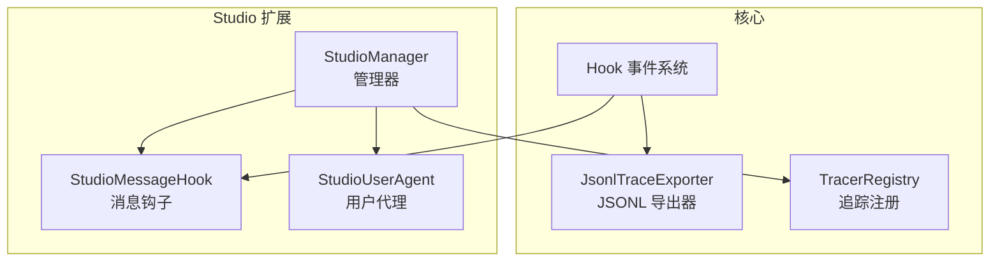
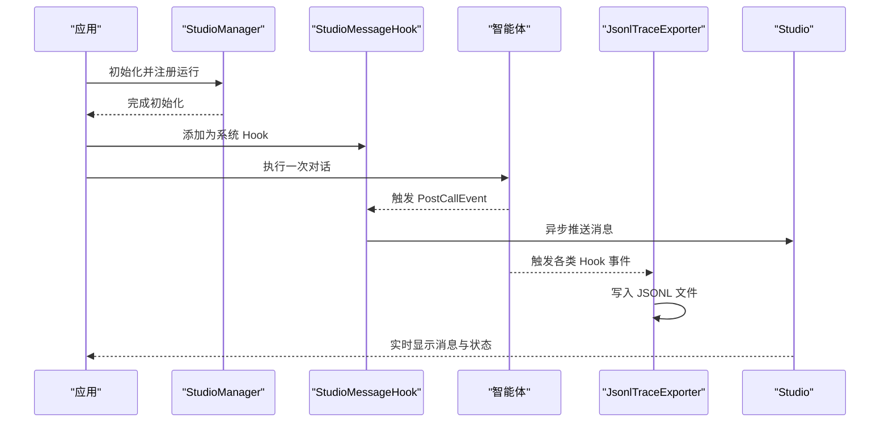
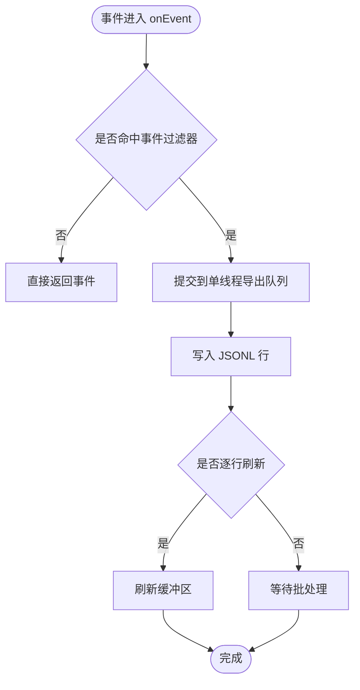
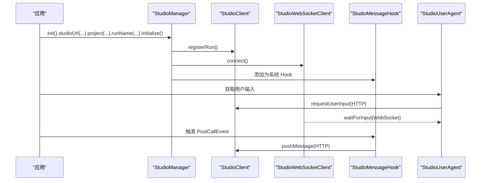
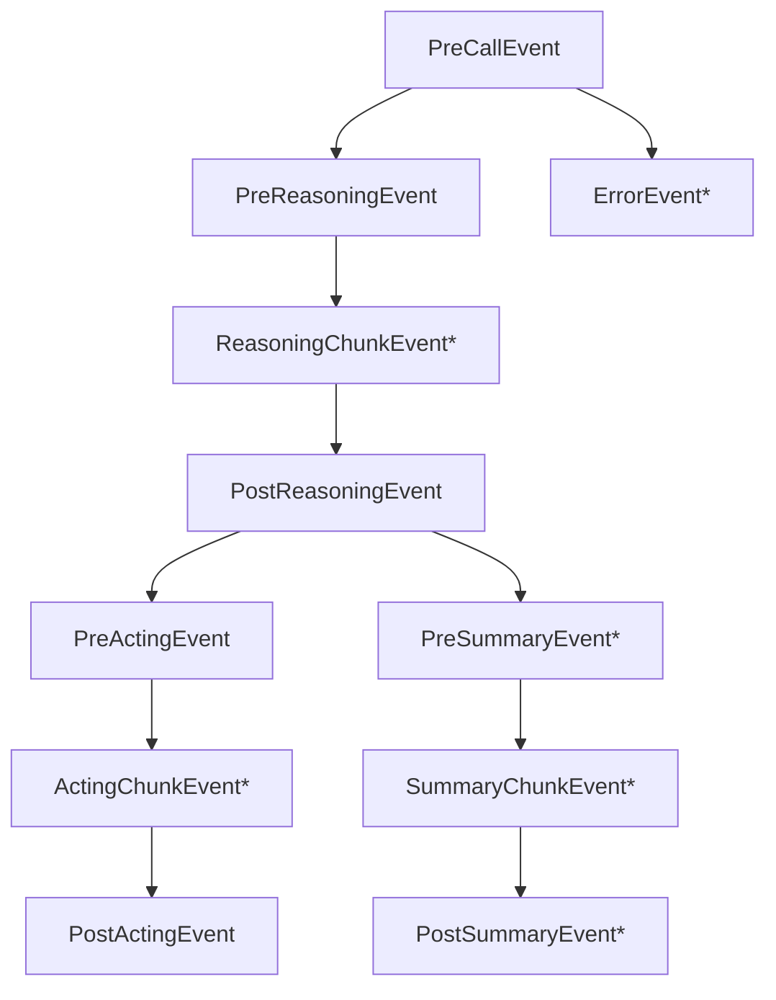
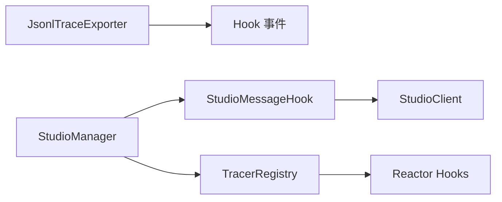

# 调试工具

<cite>
**本文引用的文件**
- [JsonlTraceExporter.java](file://agentscope-core/src/main/java/io/agentscope/core/hook/recorder/JsonlTraceExporter.java)
- [JsonlTraceExporterTest.java](file://agentscope-core/src/test/java/io/agentscope/core/hook/recorder/JsonlTraceExporterTest.java)
- [StudioManager.java](file://agentscope-extensions/agentscope-extensions-studio/src/main/java/io/agentscope/core/studio/StudioManager.java)
- [StudioMessageHook.java](file://agentscope-extensions/agentscope-extensions-studio/src/main/java/io/agentscope/core/studio/StudioMessageHook.java)
- [StudioUserAgent.java](file://agentscope-extensions/agentscope-extensions-studio/src/main/java/io/agentscope/core/studio/StudioUserAgent.java)
- [TracerRegistry.java](file://agentscope-core/src/main/java/io/agentscope/core/tracing/TracerRegistry.java)
- [observability.md（英文）](file://docs/en/task/observability.md)
- [hook.md（英文）](file://docs/en/task/hook.md)
- [observability.md（中文）](file://docs/zh/task/observability.md)
- [key-concepts.md（中文）](file://docs/zh/quickstart/key-concepts.md)
- [AgentBase.java](file://agentscope-core/src/main/java/io/agentscope/core/agent/AgentBase.java)
</cite>

## 目录
1. [简介](#简介)
2. [项目结构](#项目结构)
3. [核心组件](#核心组件)
4. [架构总览](#架构总览)
5. [详细组件分析](#详细组件分析)
6. [依赖分析](#依赖分析)
7. [性能考量](#性能考量)
8. [故障排查指南](#故障排查指南)
9. [结论](#结论)
10. [附录](#附录)

## 简介
本文件面向 AgentScope Java 的调试与可观测性场景，聚焦以下目标：
- 快速上手调试钩子，尤其是 JsonlTraceExporter 的配置与输出格式
- 深入理解 Studio 调试界面的集成方式与使用流程，包括实时消息查看与状态监控
- 提供断点调试技巧，覆盖智能体生命周期断点、工具执行断点与模型调用断点
- 总结常见问题的诊断方法，包括死锁检测、内存泄漏分析与并发问题排查
- 说明调试工具的配置项、输出重定向与性能影响评估
- 给出生产环境调试的安全考虑与最佳实践

## 项目结构
围绕调试与可观测性的关键模块分布如下：
- 核心导出器：JsonlTraceExporter（基于 Hook 事件系统，输出 JSONL 行）
- Studio 集成：StudioManager、StudioMessageHook、StudioUserAgent（HTTP/WebSocket）
- 追踪注册：TracerRegistry（全局 Reactor 上下文传播钩子）
- 文档与示例：英文与中文的 observability 与 hook 文档

图表来源
- [JsonlTraceExporter.java:82-122](file://agentscope-core/src/main/java/io/agentscope/core/hook/recorder/JsonlTraceExporter.java#L82-L122)
- [StudioManager.java:53-122](file://agentscope-extensions/agentscope-extensions-studio/src/main/java/io/agentscope/core/studio/StudioManager.java#L53-L122)
- [StudioMessageHook.java:42-96](file://agentscope-extensions/agentscope-extensions-studio/src/main/java/io/agentscope/core/studio/StudioMessageHook.java#L42-L96)
- [StudioUserAgent.java:74-88](file://agentscope-extensions/agentscope-extensions-studio/src/main/java/io/agentscope/core/studio/StudioUserAgent.java#L74-L88)
- [TracerRegistry.java:40-153](file://agentscope-core/src/main/java/io/agentscope/core/tracing/TracerRegistry.java#L40-L153)

章节来源
- [JsonlTraceExporter.java:67-122](file://agentscope-core/src/main/java/io/agentscope/core/hook/recorder/JsonlTraceExporter.java#L67-L122)
- [StudioManager.java:53-122](file://agentscope-extensions/agentscope-extensions-studio/src/main/java/io/agentscope/core/studio/StudioManager.java#L53-L122)
- [StudioMessageHook.java:42-96](file://agentscope-extensions/agentscope-extensions-studio/src/main/java/io/agentscope/core/studio/StudioMessageHook.java#L42-L96)
- [StudioUserAgent.java:74-88](file://agentscope-extensions/agentscope-extensions-studio/src/main/java/io/agentscope/core/studio/StudioUserAgent.java#L74-L88)
- [TracerRegistry.java:40-153](file://agentscope-core/src/main/java/io/agentscope/core/tracing/TracerRegistry.java#L40-L153)

## 核心组件
- JsonlTraceExporter：基于 Hook 事件系统的 JSONL 导出器，支持按事件类型过滤、流式分块导出、OpenTelemetry ID 注入、失败快速失败策略与逐行刷新等配置。
- StudioMessageHook：在 PostCallEvent 后自动推送最终消息到 Studio，不影响主流程执行。
- StudioManager：集中初始化与管理 Studio 的 HTTP 与 WebSocket 客户端，并注册运行、建立连接、注册系统级 Hook 与 TelemetryTracer。
- StudioUserAgent：支持终端与 Studio Web UI 两种输入方式；当启用 Studio 集成时，通过 HTTP 请求与 WebSocket 交互获取用户输入。
- TracerRegistry：全局 Reactor 钩子注册/禁用，传播 tracing 上下文，影响 JVM 内所有 Reactor 流。

章节来源
- [JsonlTraceExporter.java:82-122](file://agentscope-core/src/main/java/io/agentscope/core/hook/recorder/JsonlTraceExporter.java#L82-L122)
- [StudioMessageHook.java:42-96](file://agentscope-extensions/agentscope-extensions-studio/src/main/java/io/agentscope/core/studio/StudioMessageHook.java#L42-L96)
- [StudioManager.java:53-122](file://agentscope-extensions/agentscope-extensions-studio/src/main/java/io/agentscope/core/studio/StudioManager.java#L53-L122)
- [StudioUserAgent.java:74-88](file://agentscope-extensions/agentscope-extensions-studio/src/main/java/io/agentscope/core/studio/StudioUserAgent.java#L74-L88)
- [TracerRegistry.java:40-153](file://agentscope-core/src/main/java/io/agentscope/core/tracing/TracerRegistry.java#L40-L153)

## 架构总览
下面以序列图展示典型调试工作流：应用启动 Studio 集成 → 注册系统 Hook → 智能体调用 → 事件产生 → 导出器写入 JSONL/Studio 推送。

图表来源
- [StudioManager.java:213-267](file://agentscope-extensions/agentscope-extensions-studio/src/main/java/io/agentscope/core/studio/StudioManager.java#L213-L267)
- [StudioMessageHook.java:66-95](file://agentscope-extensions/agentscope-extensions-studio/src/main/java/io/agentscope/core/studio/StudioMessageHook.java#L66-L95)
- [JsonlTraceExporter.java:129-148](file://agentscope-core/src/main/java/io/agentscope/core/hook/recorder/JsonlTraceExporter.java#L129-L148)

章节来源
- [StudioManager.java:213-267](file://agentscope-extensions/agentscope-extensions-studio/src/main/java/io/agentscope/core/studio/StudioManager.java#L213-L267)
- [StudioMessageHook.java:66-95](file://agentscope-extensions/agentscope-extensions-studio/src/main/java/io/agentscope/core/studio/StudioMessageHook.java#L66-L95)
- [JsonlTraceExporter.java:129-148](file://agentscope-core/src/main/java/io/agentscope/core/hook/recorder/JsonlTraceExporter.java#L129-L148)

## 详细组件分析

### JsonlTraceExporter：配置与输出格式
- 功能定位
  - 基于 Hook 事件系统，将每个事件写为单行 JSON 对象，适合本地调试、离线排障与问题归档。
  - 默认“尽力而为”策略：序列化或 IO 错误不中断执行，除非启用 failFast。
  - 单线程队列保证顺序、turn_id、step_id 一致性。
- 关键配置
  - 输出路径与追加/覆盖
  - flushEveryLine：逐行刷新
  - failFast：导出异常是否中断执行
  - priority：Hook 优先级（默认较低，避免干扰主流程）
  - enabledEvents：启用的事件集合
  - includeReasoningChunks/ActingChunks/Summary/SummaryChunks：是否包含流式分块
- 输出字段要点
  - ts、event_type、agent_id、agent_name、run_id、turn_id、step_id
  - 与事件类型相关的字段：如 reasoning 相关、tool_use、tool_result、final_message、增量分块等
  - 若存在 OpenTelemetry 上下文，注入 trace_id、span_id
- 典型使用
  - 在测试中验证事件序列、OTel ID 注入、失败快速失败行为等

图表来源
- [JsonlTraceExporter.java:129-172](file://agentscope-core/src/main/java/io/agentscope/core/hook/recorder/JsonlTraceExporter.java#L129-L172)
- [JsonlTraceExporter.java:174-247](file://agentscope-core/src/main/java/io/agentscope/core/hook/recorder/JsonlTraceExporter.java#L174-L247)

章节来源
- [JsonlTraceExporter.java:82-122](file://agentscope-core/src/main/java/io/agentscope/core/hook/recorder/JsonlTraceExporter.java#L82-L122)
- [JsonlTraceExporter.java:436-542](file://agentscope-core/src/main/java/io/agentscope/core/hook/recorder/JsonlTraceExporter.java#L436-L542)
- [JsonlTraceExporterTest.java:77-214](file://agentscope-core/src/test/java/io/agentscope/core/hook/recorder/JsonlTraceExporterTest.java#L77-L214)
- [JsonlTraceExporterTest.java:217-227](file://agentscope-core/src/test/java/io/agentscope/core/hook/recorder/JsonlTraceExporterTest.java#L217-L227)
- [JsonlTraceExporterTest.java:336-360](file://agentscope-core/src/test/java/io/agentscope/core/hook/recorder/JsonlTraceExporterTest.java#L336-L360)

### Studio 调试界面集成与使用
- 初始化与生命周期
  - 通过 StudioManager.Builder 设置 studioUrl、project、runName、tracingUrl 等，调用 initialize 完成客户端创建、运行注册与 WebSocket 连接。
  - 初始化成功后，自动添加系统级 StudioMessageHook，并注册 TelemetryTracer 到 TracerRegistry。
- 消息推送
  - StudioMessageHook 在 PostCallEvent 时异步推送最终消息至 Studio，失败仅记录日志不中断执行。
- 用户输入
  - StudioUserAgent 支持两种输入源：终端与 Studio Web UI。启用集成后，通过 HTTP 请求触发 UI 表单，再由 WebSocket 接收用户输入。
- 示例参考
  - 英文与中文文档提供了完整的集成与使用示例，包括项目创建、会话循环与关闭资源。

图表来源
- [StudioManager.java:213-267](file://agentscope-extensions/agentscope-extensions-studio/src/main/java/io/agentscope/core/studio/StudioManager.java#L213-L267)
- [StudioMessageHook.java:66-95](file://agentscope-extensions/agentscope-extensions-studio/src/main/java/io/agentscope/core/studio/StudioMessageHook.java#L66-L95)
- [StudioUserAgent.java:128-193](file://agentscope-extensions/agentscope-extensions-studio/src/main/java/io/agentscope/core/studio/StudioUserAgent.java#L128-L193)

章节来源
- [StudioManager.java:53-122](file://agentscope-extensions/agentscope-extensions-studio/src/main/java/io/agentscope/core/studio/StudioManager.java#L53-L122)
- [StudioManager.java:213-267](file://agentscope-extensions/agentscope-extensions-studio/src/main/java/io/agentscope/core/studio/StudioManager.java#L213-L267)
- [StudioMessageHook.java:42-96](file://agentscope-extensions/agentscope-extensions-studio/src/main/java/io/agentscope/core/studio/StudioMessageHook.java#L42-L96)
- [StudioUserAgent.java:74-88](file://agentscope-extensions/agentscope-extensions-studio/src/main/java/io/agentscope/core/studio/StudioUserAgent.java#L74-L88)
- [StudioUserAgent.java:128-193](file://agentscope-extensions/agentscope-extensions-studio/src/main/java/io/agentscope/core/studio/StudioUserAgent.java#L128-L193)
- [observability.md（英文）:46-117](file://docs/en/task/observability.md#L46-L117)
- [observability.md（中文）:74-115](file://docs/zh/task/observability.md#L74-L115)

### 断点调试技巧
- 智能体生命周期断点
  - 在 AgentBase 的错误处理链路中，可通过中断标志与中断源检查实现自定义中断逻辑；在 Hook 中捕获 PreCallEvent/PostCallEvent 进行输入/输出断点。
- 工具执行断点
  - 在 Hook 中监听 PreActingEvent/ActingChunkEvent/PostActingEvent，结合工具参数与结果进行断点与条件断点设置。
- 模型调用断点
  - 在 PreReasoningEvent/ReasoningChunkEvent/PostReasoningEvent 中断点，观察生成选项、输入消息与推理中间态。
- 事件类型与可修改性参考
  - 英文 Hook 文档与中文“关键概念”文档提供了事件类型、触发时机与可修改性的对照表，便于设计断点策略。

图表来源
- [hook.md（英文）:14-29](file://docs/en/task/hook.md#L14-L29)
- [key-concepts.md（中文）:262-283](file://docs/zh/quickstart/key-concepts.md#L262-L283)

章节来源
- [AgentBase.java:441-477](file://agentscope-core/src/main/java/io/agentscope/core/agent/AgentBase.java#L441-L477)
- [hook.md（英文）:14-29](file://docs/en/task/hook.md#L14-L29)
- [key-concepts.md（中文）:262-283](file://docs/zh/quickstart/key-concepts.md#L262-L283)

## 依赖分析
- 组件耦合
  - JsonlTraceExporter 与 Hook 事件系统强耦合，通过事件过滤器与优先级控制其参与度。
  - StudioMessageHook 依赖 StudioClient，且与 Hook 事件绑定，确保非阻塞推送。
  - StudioManager 负责客户端生命周期与系统 Hook 注册，同时与 TracerRegistry 协作注入 TelemetryTracer。
- 外部依赖
  - TracerRegistry 通过 Reactor Hooks 影响全局 Reactor 流，需谨慎启用以避免性能开销。
  - JsonlTraceExporter 依赖 OpenTelemetry API（反射式探测），若未引入则不会注入 trace_id/span_id。

图表来源
- [JsonlTraceExporter.java:82-122](file://agentscope-core/src/main/java/io/agentscope/core/hook/recorder/JsonlTraceExporter.java#L82-L122)
- [StudioMessageHook.java:42-96](file://agentscope-extensions/agentscope-extensions-studio/src/main/java/io/agentscope/core/studio/StudioMessageHook.java#L42-L96)
- [StudioManager.java:247-259](file://agentscope-extensions/agentscope-extensions-studio/src/main/java/io/agentscope/core/studio/StudioManager.java#L247-L259)
- [TracerRegistry.java:40-153](file://agentscope-core/src/main/java/io/agentscope/core/tracing/TracerRegistry.java#L40-L153)

章节来源
- [StudioManager.java:247-259](file://agentscope-extensions/agentscope-extensions-studio/src/main/java/io/agentscope/core/studio/StudioManager.java#L247-L259)
- [TracerRegistry.java:40-153](file://agentscope-core/src/main/java/io/agentscope/core/tracing/TracerRegistry.java#L40-L153)

## 性能考量
- JsonlTraceExporter
  - 单线程导出队列与逐行刷新会带来 IO 开销；建议在生产调试中关闭 flushEveryLine 或降低事件粒度。
  - failFast 会在导出异常时中断执行，适合严格场景但可能影响稳定性。
- TracerRegistry
  - 全局 Reactor 钩子会对 JVM 内所有 Reactor 操作增加包装与上下文传递成本，仅在需要跨边界传播时启用。
- Studio 推送
  - StudioMessageHook 采用 fire-and-forget 异步推送，避免阻塞主流程，但网络抖动可能导致丢包，应配合重试与告警。

章节来源
- [JsonlTraceExporter.java:73-80](file://agentscope-core/src/main/java/io/agentscope/core/hook/recorder/JsonlTraceExporter.java#L73-L80)
- [JsonlTraceExporter.java:475-481](file://agentscope-core/src/main/java/io/agentscope/core/hook/recorder/JsonlTraceExporter.java#L475-L481)
- [TracerRegistry.java:25-39](file://agentscope-core/src/main/java/io/agentscope/core/tracing/TracerRegistry.java#L25-L39)
- [StudioMessageHook.java:82-92](file://agentscope-extensions/agentscope-extensions-studio/src/main/java/io/agentscope/core/studio/StudioMessageHook.java#L82-L92)

## 故障排查指南
- 死锁检测
  - 使用 JsonlTraceExporter 记录 PRE_CALL/POST_CALL 与 PRE_ACTING/POST_ACTING，观察是否存在长时间停留在某一步的事件序列。
  - 结合 TracerRegistry 的全局钩子，确认是否存在跨线程/跨订阅边界导致的上下文错配。
- 内存泄漏分析
  - 注意 JsonlTraceExporter 使用弱映射保存 per-agent run 状态，但仍需避免在事件中持有长生命周期对象引用。
  - StudioMessageHook 不阻塞主流程，但大量失败推送会堆积日志，应关注日志级别与重试策略。
- 并发问题排查
  - Reactor 全局钩子可能改变背压与调度行为；在定位并发问题时，可临时禁用 TracerRegistry 钩子以排除干扰。
  - StudioUserAgent 在 WebSocket 等待输入时具备超时控制，超时回退到终端输入，有助于发现网络或 UI 卡顿问题。

章节来源
- [JsonlTraceExporter.java:99-102](file://agentscope-core/src/main/java/io/agentscope/core/hook/recorder/JsonlTraceExporter.java#L99-L102)
- [StudioUserAgent.java:135-193](file://agentscope-extensions/agentscope-extensions-studio/src/main/java/io/agentscope/core/studio/StudioUserAgent.java#L135-L193)
- [TracerRegistry.java:128-137](file://agentscope-core/src/main/java/io/agentscope/core/tracing/TracerRegistry.java#L128-L137)

## 结论
- JsonlTraceExporter 提供轻量、可靠、可配置的本地调试与离线分析能力，适合在开发与预生产阶段广泛使用。
- Studio 集成通过系统级 Hook 与用户代理，实现了可视化调试与实时交互，显著提升联调效率。
- TracerRegistry 的全局钩子为跨边界追踪提供便利，但需权衡性能影响。
- 生产环境建议谨慎开启高开销调试功能，优先使用 failFast 与批量导出策略，并配合监控与告警。

## 附录

### 配置选项速查
- JsonlTraceExporter.Builder
  - append：是否追加到现有文件
  - flushEveryLine：是否逐行刷新
  - failFast：导出异常是否中断执行
  - priority：Hook 优先级
  - enabledEvents：启用的事件集合
  - includeReasoningChunks/includeActingChunks/includeSummary/includeSummaryChunks：是否包含对应流式事件
- StudioManager.Builder
  - studioUrl、tracingUrl、project、runName、maxRetries、reconnectAttempts
- StudioUserAgent.Builder
  - name、description、studioClient、webSocketClient、inputTimeout、terminalReader

章节来源
- [JsonlTraceExporter.java:436-542](file://agentscope-core/src/main/java/io/agentscope/core/hook/recorder/JsonlTraceExporter.java#L436-L542)
- [StudioManager.java:127-267](file://agentscope-extensions/agentscope-extensions-studio/src/main/java/io/agentscope/core/studio/StudioManager.java#L127-L267)
- [StudioUserAgent.java:244-333](file://agentscope-extensions/agentscope-extensions-studio/src/main/java/io/agentscope/core/studio/StudioUserAgent.java#L244-L333)