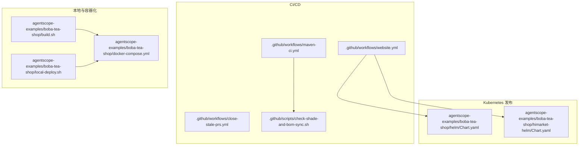
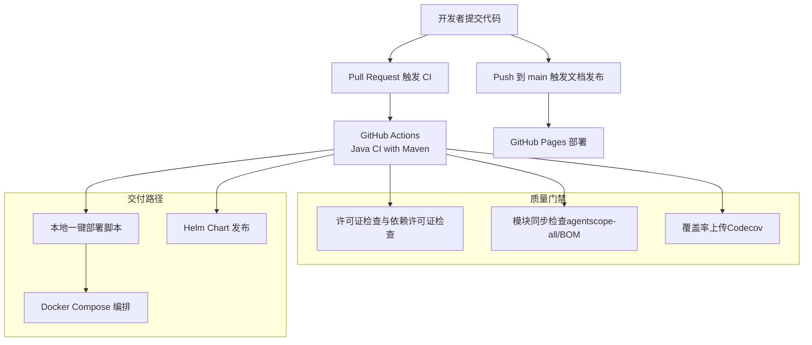
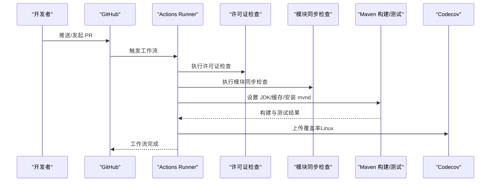
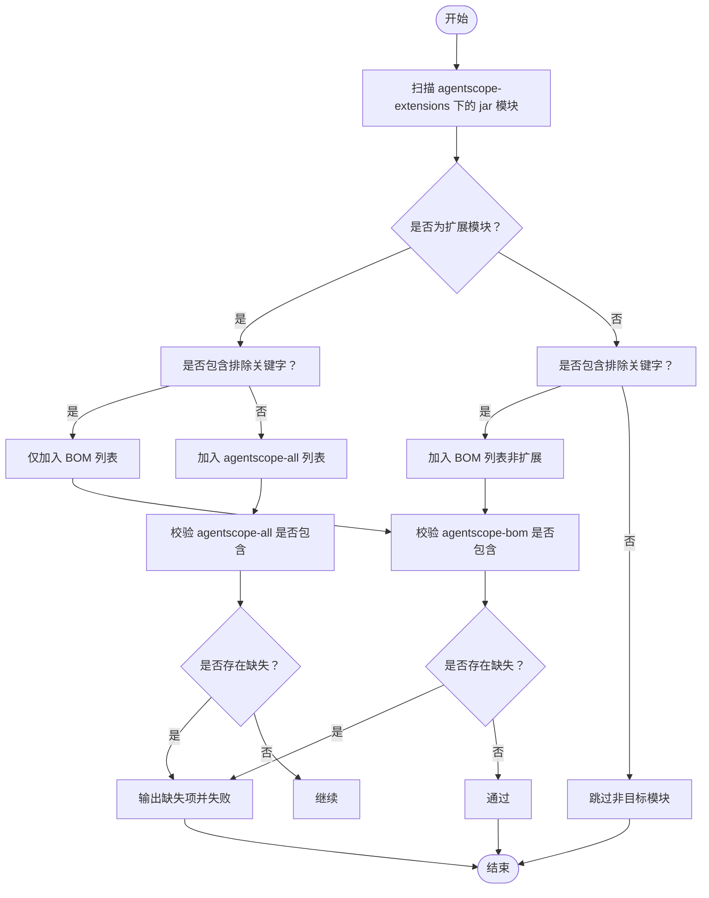
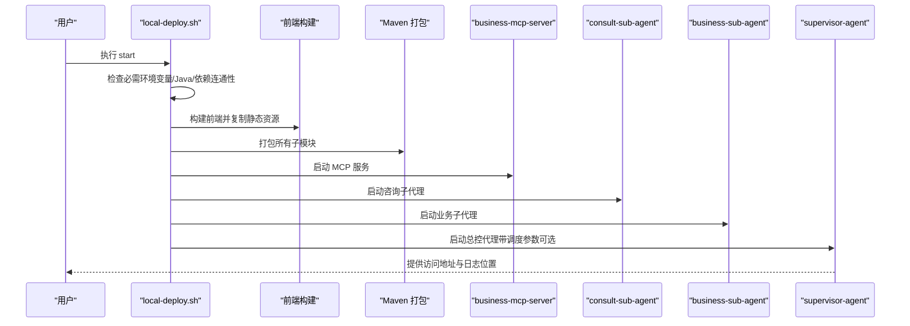
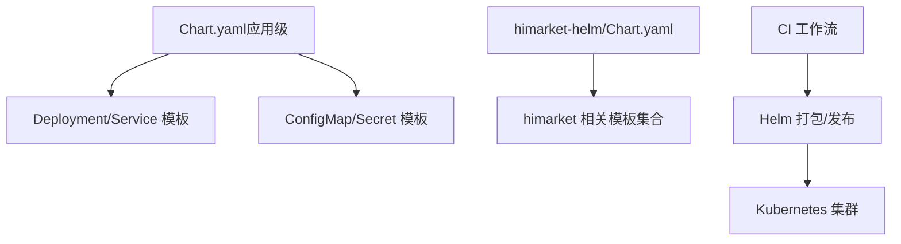
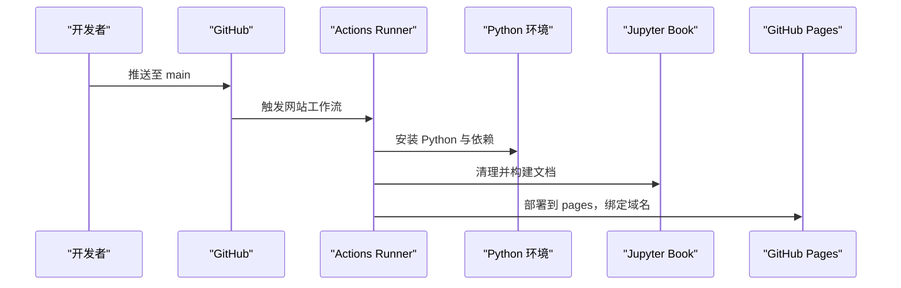
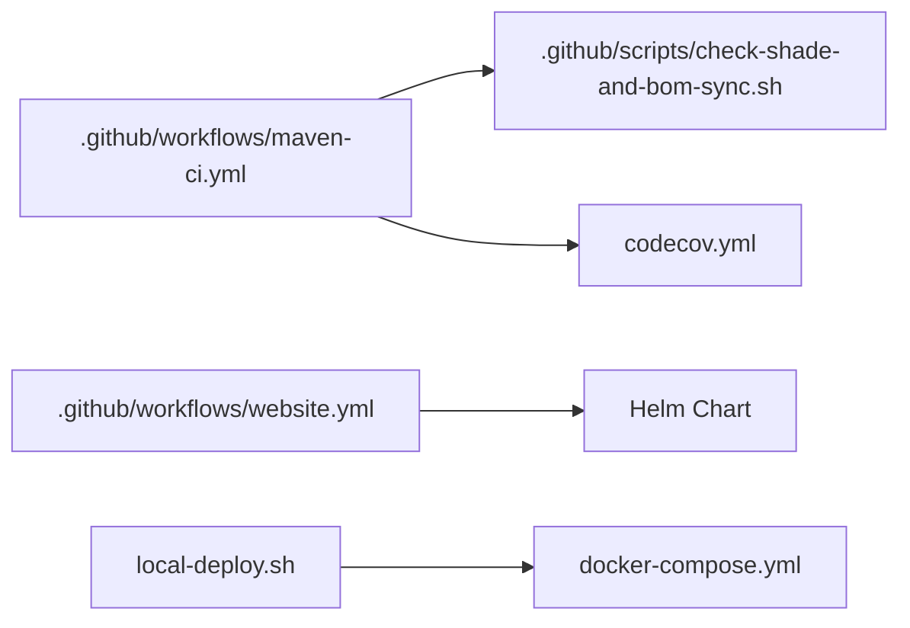

# 运维自动化

<cite>
**本文引用的文件**
- [.github/workflows/maven-ci.yml](file://.github/workflows/maven-ci.yml)
- [.github/workflows/close-stale-prs.yml](file://.github/workflows/close-stale-prs.yml)
- [.github/workflows/website.yml](file://.github/workflows/website.yml)
- [.github/scripts/check-shade-and-bom-sync.sh](file://.github/scripts/check-shade-and-bom-sync.sh)
- [codecov.yml](file://codecov.yml)
- [agentscope-examples/boba-tea-shop/build.sh](file://agentscope-examples/boba-tea-shop/build.sh)
- [agentscope-examples/boba-tea-shop/docker-compose.yml](file://agentscope-examples/boba-tea-shop/docker-compose.yml)
- [agentscope-examples/boba-tea-shop/local-deploy.sh](file://agentscope-examples/boba-tea-shop/local-deploy.sh)
- [agentscope-examples/boba-tea-shop/helm/Chart.yaml](file://agentscope-examples/boba-tea-shop/helm/Chart.yaml)
- [agentscope-examples/boba-tea-shop/himarket-helm/Chart.yaml](file://agentscope-examples/boba-tea-shop/himarket-helm/Chart.yaml)
</cite>

## 目录
1. [简介](#简介)
2. [项目结构](#项目结构)
3. [核心组件](#核心组件)
4. [架构总览](#架构总览)
5. [详细组件分析](#详细组件分析)
6. [依赖关系分析](#依赖关系分析)
7. [性能考虑](#性能考虑)
8. [故障排查指南](#故障排查指南)
9. [结论](#结论)
10. [附录](#附录)

## 简介
本技术文档面向 AgentScope Java 的运维自动化，系统性阐述 CI/CD 流水线设计与实现、自动化部署脚本、基础设施即代码（IaC）实践，以及运维脚本标准化模板（健康检查、备份恢复、监控告警）与自动化测试、质量门禁及发布管理的落地方法。内容以仓库中实际文件为依据，结合图示帮助读者快速理解并复用。

## 项目结构
本项目采用多模块 Maven 结构，配合 GitHub Actions 实现跨平台 CI、许可证与模块同步校验、文档站点发布；同时提供本地一键部署脚本与 Docker Compose 编排，以及 Helm Chart 用于 Kubernetes 发布。

图表来源
- [.github/workflows/maven-ci.yml:1-140](file://.github/workflows/maven-ci.yml#L1-L140)
- [.github/scripts/check-shade-and-bom-sync.sh:1-195](file://.github/scripts/check-shade-and-bom-sync.sh#L1-L195)
- [agentscope-examples/boba-tea-shop/build.sh:1-199](file://agentscope-examples/boba-tea-shop/build.sh#L1-L199)
- [agentscope-examples/boba-tea-shop/docker-compose.yml:1-255](file://agentscope-examples/boba-tea-shop/docker-compose.yml#L1-L255)
- [agentscope-examples/boba-tea-shop/local-deploy.sh:1-568](file://agentscope-examples/boba-tea-shop/local-deploy.sh#L1-L568)
- [agentscope-examples/boba-tea-shop/helm/Chart.yaml:1-32](file://agentscope-examples/boba-tea-shop/helm/Chart.yaml#L1-L32)
- [agentscope-examples/boba-tea-shop/himarket-helm/Chart.yaml:1-32](file://agentscope-examples/boba-tea-shop/himarket-helm/Chart.yaml#L1-L32)

章节来源
- [.github/workflows/maven-ci.yml:1-140](file://.github/workflows/maven-ci.yml#L1-L140)
- [.github/scripts/check-shade-and-bom-sync.sh:1-195](file://.github/scripts/check-shade-and-bom-sync.sh#L1-L195)
- [agentscope-examples/boba-tea-shop/build.sh:1-199](file://agentscope-examples/boba-tea-shop/build.sh#L1-L199)
- [agentscope-examples/boba-tea-shop/docker-compose.yml:1-255](file://agentscope-examples/boba-tea-shop/docker-compose.yml#L1-L255)
- [agentscope-examples/boba-tea-shop/local-deploy.sh:1-568](file://agentscope-examples/boba-tea-shop/local-deploy.sh#L1-L568)
- [agentscope-examples/boba-tea-shop/helm/Chart.yaml:1-32](file://agentscope-examples/boba-tea-shop/helm/Chart.yaml#L1-L32)
- [agentscope-examples/boba-tea-shop/himarket-helm/Chart.yaml:1-32](file://agentscope-examples/boba-tea-shop/himarket-helm/Chart.yaml#L1-L32)

## 核心组件
- CI/CD 工作流
  - Java CI with Maven：跨平台构建、缓存、测试与覆盖率上传。
  - 关闭陈旧 PR：按计划关闭长时间无响应的拉取请求。
  - 文档发布到 GitHub Pages：基于 Python 环境构建 Jupyter Book 并部署。
- 质量门禁与合规
  - 许可证检查与依赖许可证一致性检查。
  - 模块同步检查：确保扩展模块正确纳入聚合包与 BOM。
- 自动化部署与编排
  - 多模块构建脚本：统一入口，支持版本、镜像仓库、平台、测试开关、模块选择等参数。
  - Docker Compose：定义数据库、服务注册中心与业务服务的容器编排与健康检查。
  - 本地一键部署：前置检查、前端构建、后端打包、服务启动与状态查询。
- 发布与 IaC
  - Helm Chart：应用级 Chart 定义与模板，支持多套部署场景（如 himarket）。

章节来源
- [.github/workflows/maven-ci.yml:1-140](file://.github/workflows/maven-ci.yml#L1-L140)
- [.github/workflows/close-stale-prs.yml:1-25](file://.github/workflows/close-stale-prs.yml#L1-L25)
- [.github/workflows/website.yml:1-41](file://.github/workflows/website.yml#L1-L41)
- [.github/scripts/check-shade-and-bom-sync.sh:1-195](file://.github/scripts/check-shade-and-bom-sync.sh#L1-L195)
- [agentscope-examples/boba-tea-shop/build.sh:1-199](file://agentscope-examples/boba-tea-shop/build.sh#L1-L199)
- [agentscope-examples/boba-tea-shop/docker-compose.yml:1-255](file://agentscope-examples/boba-tea-shop/docker-compose.yml#L1-L255)
- [agentscope-examples/boba-tea-shop/local-deploy.sh:1-568](file://agentscope-examples/boba-tea-shop/local-deploy.sh#L1-L568)
- [agentscope-examples/boba-tea-shop/helm/Chart.yaml:1-32](file://agentscope-examples/boba-tea-shop/helm/Chart.yaml#L1-L32)
- [agentscope-examples/boba-tea-shop/himarket-helm/Chart.yaml:1-32](file://agentscope-examples/boba-tea-shop/himarket-helm/Chart.yaml#L1-L32)

## 架构总览
下图展示从代码提交到本地/容器/Kubernetes 的交付路径，以及质量门禁与文档发布的协同关系。

图表来源
- [.github/workflows/maven-ci.yml:1-140](file://.github/workflows/maven-ci.yml#L1-L140)
- [.github/scripts/check-shade-and-bom-sync.sh:1-195](file://.github/scripts/check-shade-and-bom-sync.sh#L1-L195)
- [codecov.yml:1-34](file://codecov.yml#L1-L34)
- [.github/workflows/website.yml:1-41](file://.github/workflows/website.yml#L1-L41)
- [agentscope-examples/boba-tea-shop/local-deploy.sh:1-568](file://agentscope-examples/boba-tea-shop/local-deploy.sh#L1-L568)
- [agentscope-examples/boba-tea-shop/docker-compose.yml:1-255](file://agentscope-examples/boba-tea-shop/docker-compose.yml#L1-L255)
- [agentscope-examples/boba-tea-shop/helm/Chart.yaml:1-32](file://agentscope-examples/boba-tea-shop/helm/Chart.yaml#L1-L32)

## 详细组件分析

### 组件一：CI/CD 工作流（Java CI with Maven）
- 触发条件：push 与 pull_request。
- 任务拆分：
  - 许可证检查：验证项目与依赖许可证合规。
  - 模块同步检查：校验扩展模块是否正确声明在聚合包与 BOM 中。
  - 构建与测试：跨平台缓存、安装 mvnd、单线程保证反应堆顺序、执行测试。
  - 覆盖率上传：Linux 平台上传至 Codecov。
- 质量门禁：
  - 依赖许可证配置文件参与校验。
  - 覆盖率阈值与范围在配置文件中定义。

图表来源
- [.github/workflows/maven-ci.yml:1-140](file://.github/workflows/maven-ci.yml#L1-L140)
- [.github/scripts/check-shade-and-bom-sync.sh:1-195](file://.github/scripts/check-shade-and-bom-sync.sh#L1-L195)
- [codecov.yml:1-34](file://codecov.yml#L1-L34)

章节来源
- [.github/workflows/maven-ci.yml:1-140](file://.github/workflows/maven-ci.yml#L1-L140)
- [codecov.yml:1-34](file://codecov.yml#L1-L34)

### 组件二：模块同步检查（agentscope-all 与 BOM 同步）
- 目标：确保扩展模块既被纳入聚合包（shaded into uber-jar），也被纳入 BOM（版本管理）。
- 规则：
  - 排除关键字（starter、quarkus、micronaut）的模块不进入聚合包，但需纳入 BOM。
  - 非扩展模块（非 agentscope-extensions-* 前缀）若含排除关键字也纳入 BOM。
- 输出：对缺失项生成提示，失败时终止流水线。

图表来源
- [.github/scripts/check-shade-and-bom-sync.sh:1-195](file://.github/scripts/check-shade-and-bom-sync.sh#L1-L195)

章节来源
- [.github/scripts/check-shade-and-bom-sync.sh:1-195](file://.github/scripts/check-shade-and-bom-sync.sh#L1-L195)

### 组件三：自动化部署脚本（多模块构建与本地部署）
- 多模块构建脚本（build.sh）
  - 支持指定版本、镜像仓库、目标平台、是否运行测试、跳过源码构建或 Docker 构建、是否推送镜像、模块选择（default/all/逗号分隔）。
  - 对每个模块调用其子目录下的 build.sh，并汇总成功/失败模块。
- 本地一键部署脚本（local-deploy.sh）
  - 前置检查：必需环境变量、Java 版本、依赖连通性（MySQL、Nacos）。
  - 前端构建与静态资源注入（复制到 supervisor-agent 静态资源目录）。
  - Maven 打包：全子模块打包，校验 JAR 产物存在。
  - 服务启动：按依赖顺序启动各服务，记录 PID 与日志文件，支持重启与状态查询。
  - 配置展示：打印当前生效的数据库、注册中心、模型、RAG、内存服务、调度等配置。
- Docker Compose 编排
  - 定义数据库、Nacos、业务服务（MCP 服务器、咨询子代理、业务子代理、总控代理）。
  - 为数据库与 Nacos 配置健康检查与依赖启动条件。
  - 使用环境变量控制镜像标签、端口与认证信息。

图表来源
- [agentscope-examples/boba-tea-shop/local-deploy.sh:1-568](file://agentscope-examples/boba-tea-shop/local-deploy.sh#L1-L568)
- [agentscope-examples/boba-tea-shop/build.sh:1-199](file://agentscope-examples/boba-tea-shop/build.sh#L1-L199)
- [agentscope-examples/boba-tea-shop/docker-compose.yml:1-255](file://agentscope-examples/boba-tea-shop/docker-compose.yml#L1-L255)

章节来源
- [agentscope-examples/boba-tea-shop/build.sh:1-199](file://agentscope-examples/boba-tea-shop/build.sh#L1-L199)
- [agentscope-examples/boba-tea-shop/docker-compose.yml:1-255](file://agentscope-examples/boba-tea-shop/docker-compose.yml#L1-L255)
- [agentscope-examples/boba-tea-shop/local-deploy.sh:1-568](file://agentscope-examples/boba-tea-shop/local-deploy.sh#L1-L568)

### 组件四：基础设施即代码（IaC）与发布
- 应用级 Chart（agentscope-multi-agent）
  - 定义应用名称、版本、描述、关键字、维护者与源码链接。
- Himarket 场景 Chart
  - 提供独立的 himarket 部署场景，包含管理端、前端、服务端与数据库等模板。
- 发布策略建议
  - 使用 Helm 参数覆盖 values，区分开发/预发/生产环境。
  - 通过滚动更新与就绪/存活探针保障发布稳定性。
  - 配合 CI 将 Chart 打包并推送到制品库或 OCI 仓库。

图表来源
- [agentscope-examples/boba-tea-shop/helm/Chart.yaml:1-32](file://agentscope-examples/boba-tea-shop/helm/Chart.yaml#L1-L32)
- [agentscope-examples/boba-tea-shop/himarket-helm/Chart.yaml:1-32](file://agentscope-examples/boba-tea-shop/himarket-helm/Chart.yaml#L1-L32)

章节来源
- [agentscope-examples/boba-tea-shop/helm/Chart.yaml:1-32](file://agentscope-examples/boba-tea-shop/helm/Chart.yaml#L1-L32)
- [agentscope-examples/boba-tea-shop/himarket-helm/Chart.yaml:1-32](file://agentscope-examples/boba-tea-shop/himarket-helm/Chart.yaml#L1-L32)

### 组件五：文档发布（GitHub Pages）
- 触发条件：向 main 分支推送。
- 步骤：检出仓库、设置 Python、安装依赖、构建文档、部署到 GitHub Pages。
- 域名：java.agentscope.io。

图表来源
- [.github/workflows/website.yml:1-41](file://.github/workflows/website.yml#L1-L41)

章节来源
- [.github/workflows/website.yml:1-41](file://.github/workflows/website.yml#L1-L41)

### 组件六：质量门禁与发布管理
- 质量门禁
  - 许可证检查：skywalking-eyes 插件校验。
  - 依赖许可证：基于 .licenserc.yaml 配置进行检查。
  - 模块同步：check-shade-and-bom-sync.sh 校验 agentscope-all 与 agentscope-bom。
  - 覆盖率：codecov.yml 定义阈值与忽略规则。
- 发布管理
  - 通过 CI 成功后触发文档发布与制品打包。
  - Helm Chart 可作为发布产物之一，结合版本号与标签管理。

章节来源
- [.github/scripts/check-shade-and-bom-sync.sh:1-195](file://.github/scripts/check-shade-and-bom-sync.sh#L1-L195)
- [codecov.yml:1-34](file://codecov.yml#L1-L34)

## 依赖关系分析
- CI 与模块同步：maven-ci.yml 调用 check-shade-and-bom-sync.sh，确保模块清单一致。
- 文档发布与 Helm：website.yml 与 Helm Chart 共同支撑外部文档站点与集群发布。
- 本地部署与容器编排：local-deploy.sh 与 docker-compose.yml 协同，前者负责构建与启动，后者负责容器编排与健康检查。

图表来源
- [.github/workflows/maven-ci.yml:1-140](file://.github/workflows/maven-ci.yml#L1-L140)
- [.github/scripts/check-shade-and-bom-sync.sh:1-195](file://.github/scripts/check-shade-and-bom-sync.sh#L1-L195)
- [codecov.yml:1-34](file://codecov.yml#L1-L34)
- [.github/workflows/website.yml:1-41](file://.github/workflows/website.yml#L1-L41)
- [agentscope-examples/boba-tea-shop/local-deploy.sh:1-568](file://agentscope-examples/boba-tea-shop/local-deploy.sh#L1-L568)
- [agentscope-examples/boba-tea-shop/docker-compose.yml:1-255](file://agentscope-examples/boba-tea-shop/docker-compose.yml#L1-L255)

章节来源
- [.github/workflows/maven-ci.yml:1-140](file://.github/workflows/maven-ci.yml#L1-L140)
- [.github/scripts/check-shade-and-bom-sync.sh:1-195](file://.github/scripts/check-shade-and-bom-sync.sh#L1-L195)
- [codecov.yml:1-34](file://codecov.yml#L1-L34)
- [.github/workflows/website.yml:1-41](file://.github/workflows/website.yml#L1-L41)
- [agentscope-examples/boba-tea-shop/local-deploy.sh:1-568](file://agentscope-examples/boba-tea-shop/local-deploy.sh#L1-L568)
- [agentscope-examples/boba-tea-shop/docker-compose.yml:1-255](file://agentscope-examples/boba-tea-shop/docker-compose.yml#L1-L255)

## 性能考虑
- 构建性能
  - 使用 mvnd 与 Maven 仓库缓存，减少重复下载时间。
  - 单线程构建以保证反应堆顺序，避免模块解析问题。
- 部署性能
  - Docker Compose 健康检查与依赖启动条件降低启动失败重试成本。
  - Helm 模板化配置便于批量部署与回滚。
- 覆盖率与质量
  - 通过覆盖率阈值与忽略策略，平衡质量与效率。

## 故障排查指南
- CI 失败
  - 许可证检查失败：核对 .licenserc.yaml 与依赖许可证配置。
  - 模块同步失败：根据脚本输出补充 agentscope-all 与 agentscope-bom 的依赖声明。
  - 覆盖率上传失败：确认 Linux 平台且 CODECOV_TOKEN 配置正确。
- 本地部署失败
  - Java 版本过低：确保 JDK 17+。
  - 必需环境变量缺失：补齐 MODEL_API_KEY、DashScope 凭据、Mem0 Key 等。
  - 依赖不可达：检查 MySQL 与 Nacos 地址与端口。
  - JAR 未生成：确认 Maven 打包步骤执行成功。
- 容器编排问题
  - 健康检查失败：查看容器日志，确认数据库初始化与注册中心可用。
  - 端口冲突：调整映射端口或释放占用进程。
- Helm 发布问题
  - Chart 语法错误：使用 helm lint 检查模板。
  - 权限不足：确认集群权限与命名空间可用。

章节来源
- [.github/workflows/maven-ci.yml:1-140](file://.github/workflows/maven-ci.yml#L1-L140)
- [.github/scripts/check-shade-and-bom-sync.sh:1-195](file://.github/scripts/check-shade-and-bom-sync.sh#L1-L195)
- [codecov.yml:1-34](file://codecov.yml#L1-L34)
- [agentscope-examples/boba-tea-shop/local-deploy.sh:1-568](file://agentscope-examples/boba-tea-shop/local-deploy.sh#L1-L568)
- [agentscope-examples/boba-tea-shop/docker-compose.yml:1-255](file://agentscope-examples/boba-tea-shop/docker-compose.yml#L1-L255)

## 结论
本项目通过完善的 CI/CD 工作流、模块同步校验与许可证检查，确保构建质量与合规；借助本地一键部署脚本与 Docker Compose，快速完成多模块联调；通过 Helm Chart 支撑 Kubernetes 发布。建议在现有基础上进一步完善监控告警与备份恢复脚本模板，以形成闭环的运维自动化体系。

## 附录
- 运维脚本标准化模板建议
  - 健康检查：基于容器健康检查与服务端点探测，统一返回码与日志格式。
  - 备份恢复：数据库定时快照、配置文件版本化存储、一键恢复流程。
  - 监控告警：指标采集、阈值设定、告警收敛与通知渠道标准化。
- 发布管理最佳实践
  - 版本号规范：语义化版本与分支策略联动。
  - 制品管理：镜像与 Chart 的标签与签名策略。
  - 回滚预案：灰度发布与一键回滚脚本。