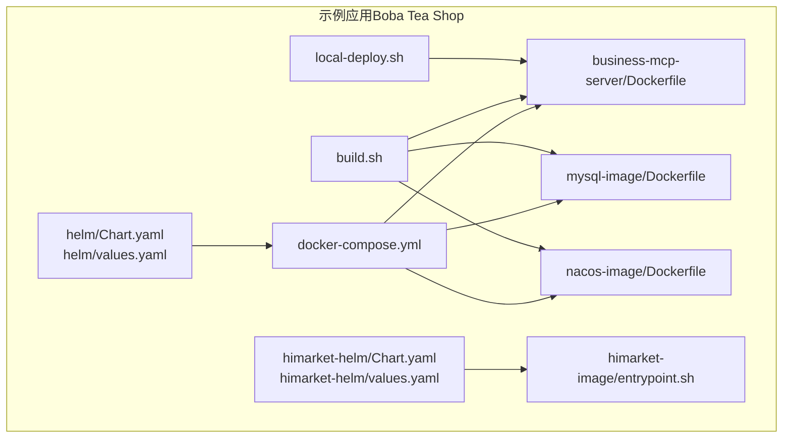
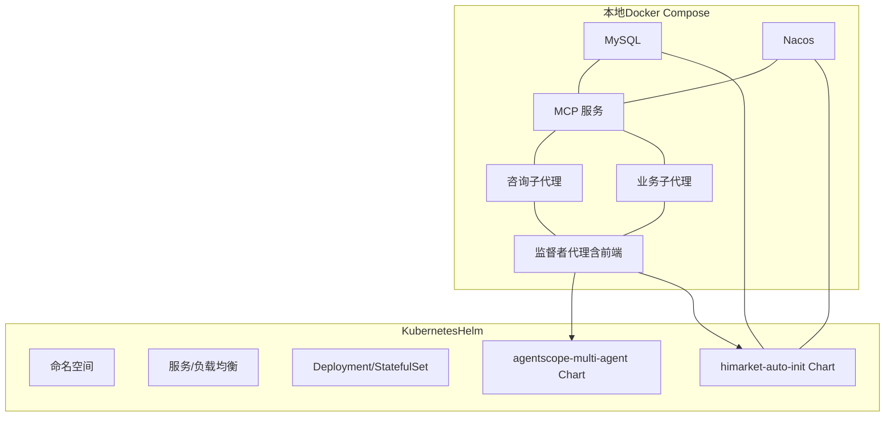
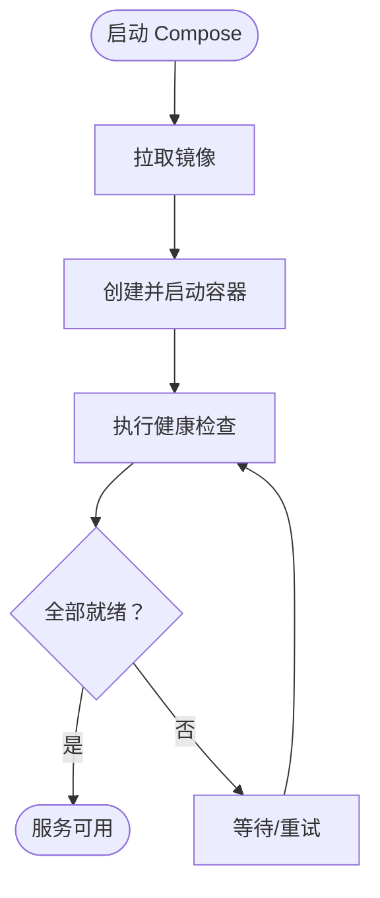
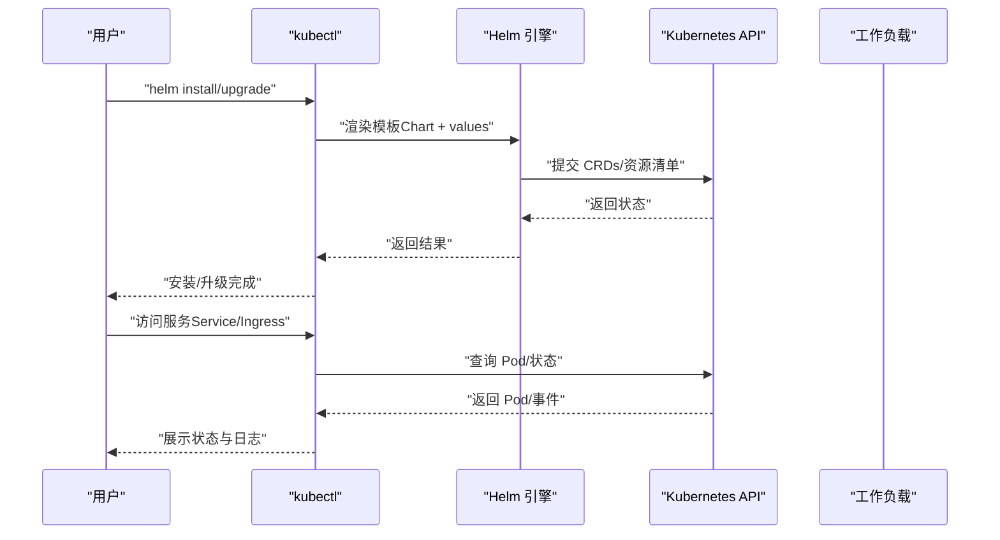
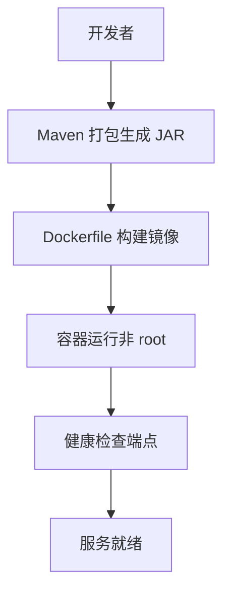
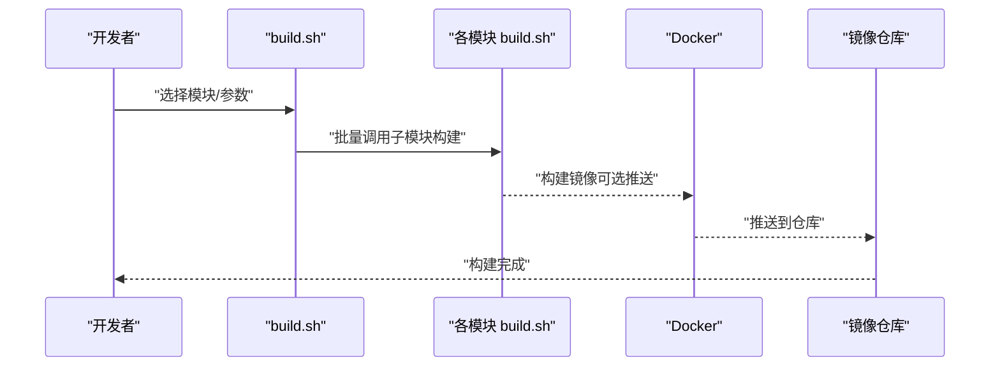
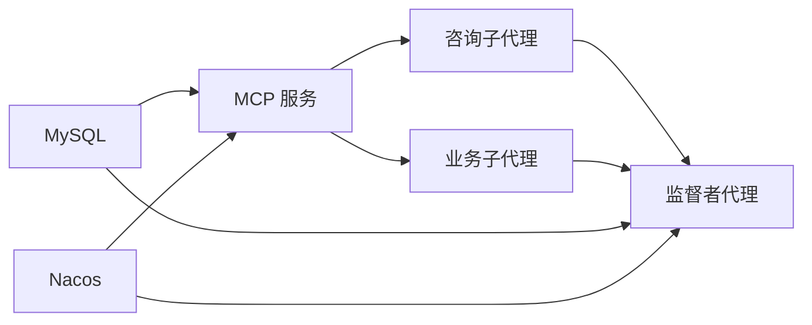

# 部署与运维

<cite>
**本文引用的文件**
- [docker-compose.yml](file://agentscope-examples/boba-tea-shop/docker-compose.yml)
- [Chart.yaml（多智能体 Helm）](file://agentscope-examples/boba-tea-shop/helm/Chart.yaml)
- [values.yaml（多智能体 Helm）](file://agentscope-examples/boba-tea-shop/helm/values.yaml)
- [Chart.yaml（HiMarket 自动初始化 Helm）](file://agentscope-examples/boba-tea-shop/himarket-helm/Chart.yaml)
- [values.yaml（HiMarket 自动初始化 Helm）](file://agentscope-examples/boba-tea-shop/himarket-helm/values.yaml)
- [build.sh（主构建脚本）](file://agentscope-examples/boba-tea-shop/build.sh)
- [IMAGE_BUILD_GUIDE.md](file://agentscope-examples/boba-tea-shop/IMAGE_BUILD_GUIDE.md)
- [entrypoint.sh（HiMarket 自动初始化入口）](file://agentscope-examples/boba-tea-shop/himarket-image/entrypoint.sh)
- [Dockerfile（业务 MCP 服务）](file://agentscope-examples/boba-tea-shop/business-mcp-server/Dockerfile)
- [Dockerfile（MySQL 基础镜像）](file://agentscope-examples/boba-tea-shop/mysql-image/Dockerfile)
- [Dockerfile（Nacos 基础镜像）](file://agentscope-examples/boba-tea-shop/nacos-image/Dockerfile)
- [local-deploy.sh（本地部署脚本）](file://agentscope-examples/boba-tea-shop/local-deploy.sh)
</cite>

## 目录
1. [简介](#简介)
2. [项目结构](#项目结构)
3. [核心组件](#核心组件)
4. [架构总览](#架构总览)
5. [详细组件分析](#详细组件分析)
6. [依赖关系分析](#依赖关系分析)
7. [性能考虑](#性能考虑)
8. [故障排查指南](#故障排查指南)
9. [结论](#结论)
10. [附录](#附录)

## 简介
本文件面向 AgentScope Java 的部署与运维，围绕容器化与云原生展开，覆盖以下主题：
- 容器化：Docker 镜像构建、运行参数与健康检查
- 编排与集群：Docker Compose 与 Kubernetes（Helm Charts）
- 云原生配置：Helm Values、服务发现与注册、资源限制
- 运维自动化：构建脚本、本地部署脚本、初始化流程
- 安全与合规：非 root 用户、最小权限、密钥注入与外部化
- 监控与调试：健康检查端点、日志与可观测性建议
- 备份与灾备：数据库持久化与外部化策略
- 性能调优与容量规划：JVM 参数、资源配额与水平扩展

## 项目结构
本仓库中与部署运维直接相关的关键目录与文件如下：
- Boba Tea Shop 示例（演示多智能体系统）
  - Docker Compose 编排：docker-compose.yml
  - Helm Charts（多智能体）：helm/Chart.yaml、helm/values.yaml
  - 构建与发布：build.sh、IMAGE_BUILD_GUIDE.md
  - 本地部署：local-deploy.sh
  - 镜像与入口：business-mcp-server/Dockerfile、mysql-image/Dockerfile、nacos-image/Dockerfile、himarket-image/entrypoint.sh
- HiMarket 自动初始化（API 网关与 MCP 管理）
  - Helm Charts（HiMarket）：himarket-helm/Chart.yaml、himarket-helm/values.yaml

**图表来源**
- [docker-compose.yml:1-255](file://agentscope-examples/boba-tea-shop/docker-compose.yml#L1-L255)
- [Chart.yaml（多智能体 Helm）:1-32](file://agentscope-examples/boba-tea-shop/helm/Chart.yaml#L1-L32)
- [values.yaml（多智能体 Helm）:1-115](file://agentscope-examples/boba-tea-shop/helm/values.yaml#L1-L115)
- [Chart.yaml（HiMarket 自动初始化 Helm）:1-32](file://agentscope-examples/boba-tea-shop/himarket-helm/Chart.yaml#L1-L32)
- [values.yaml（HiMarket 自动初始化 Helm）:1-227](file://agentscope-examples/boba-tea-shop/himarket-helm/values.yaml#L1-L227)
- [build.sh（主构建脚本）:1-199](file://agentscope-examples/boba-tea-shop/build.sh#L1-L199)
- [local-deploy.sh（本地部署脚本）:1-568](file://agentscope-examples/boba-tea-shop/local-deploy.sh#L1-L568)
- [Dockerfile（业务 MCP 服务）:1-62](file://agentscope-examples/boba-tea-shop/business-mcp-server/Dockerfile#L1-L62)
- [Dockerfile（MySQL 基础镜像）:1-47](file://agentscope-examples/boba-tea-shop/mysql-image/Dockerfile#L1-L47)
- [Dockerfile（Nacos 基础镜像）:1-47](file://agentscope-examples/boba-tea-shop/nacos-image/Dockerfile#L1-L47)
- [entrypoint.sh（HiMarket 自动初始化入口）:1-100](file://agentscope-examples/boba-tea-shop/himarket-image/entrypoint.sh#L1-L100)

**章节来源**
- [docker-compose.yml:1-255](file://agentscope-examples/boba-tea-shop/docker-compose.yml#L1-L255)
- [Chart.yaml（多智能体 Helm）:1-32](file://agentscope-examples/boba-tea-shop/helm/Chart.yaml#L1-L32)
- [values.yaml（多智能体 Helm）:1-115](file://agentscope-examples/boba-tea-shop/helm/values.yaml#L1-L115)
- [Chart.yaml（HiMarket 自动初始化 Helm）:1-32](file://agentscope-examples/boba-tea-shop/himarket-helm/Chart.yaml#L1-L32)
- [values.yaml（HiMarket 自动初始化 Helm）:1-227](file://agentscope-examples/boba-tea-shop/himarket-helm/values.yaml#L1-L227)
- [build.sh（主构建脚本）:1-199](file://agentscope-examples/boba-tea-shop/build.sh#L1-L199)
- [IMAGE_BUILD_GUIDE.md:1-165](file://agentscope-examples/boba-tea-shop/IMAGE_BUILD_GUIDE.md#L1-L165)
- [local-deploy.sh（本地部署脚本）:1-568](file://agentscope-examples/boba-tea-shop/local-deploy.sh#L1-L568)
- [Dockerfile（业务 MCP 服务）:1-62](file://agentscope-examples/boba-tea-shop/business-mcp-server/Dockerfile#L1-L62)
- [Dockerfile（MySQL 基础镜像）:1-47](file://agentscope-examples/boba-tea-shop/mysql-image/Dockerfile#L1-L47)
- [Dockerfile（Nacos 基础镜像）:1-47](file://agentscope-examples/boba-tea-shop/nacos-image/Dockerfile#L1-L47)
- [entrypoint.sh（HiMarket 自动初始化入口）:1-100](file://agentscope-examples/boba-tea-shop/himarket-image/entrypoint.sh#L1-L100)

## 核心组件
- 业务 MCP 服务：提供多智能体交互的 MCP 接口，内置健康检查端点，支持外部化模型与数据库配置。
- 子代理（咨询/业务）：作为下游工具或服务的代理，复用 MCP 服务配置。
- 监督者代理（Supervisor Agent）：聚合子代理能力并提供前端静态资源（通过 Spring Boot 内置静态服务）。
- 数据库（MySQL）：提供持久化存储，支持本地卷与外部数据库切换。
- 服务注册与发现（Nacos）：提供服务注册与配置中心能力，支持独立部署或外部接入。
- HiMarket 自动初始化：一键部署 API 网关与 MCP 管理平台，支持自动初始化与可选的 MySQL、Nacos、网关对接。

**章节来源**
- [docker-compose.yml:79-239](file://agentscope-examples/boba-tea-shop/docker-compose.yml#L79-L239)
- [values.yaml（多智能体 Helm）:36-114](file://agentscope-examples/boba-tea-shop/helm/values.yaml#L36-L114)
- [values.yaml（HiMarket 自动初始化 Helm）:96-227](file://agentscope-examples/boba-tea-shop/himarket-helm/values.yaml#L96-L227)
- [Dockerfile（业务 MCP 服务）:44-61](file://agentscope-examples/boba-tea-shop/business-mcp-server/Dockerfile#L44-L61)

## 架构总览
下图展示本地与云原生两种部署形态的总体关系：Docker Compose 用于本地快速验证；Helm Charts 用于 Kubernetes 生产级部署；HiMarket Helm 提供 API 网关与 MCP 管理的开箱即用方案。

**图表来源**
- [docker-compose.yml:24-239](file://agentscope-examples/boba-tea-shop/docker-compose.yml#L24-L239)
- [Chart.yaml（多智能体 Helm）:15-32](file://agentscope-examples/boba-tea-shop/helm/Chart.yaml#L15-L32)
- [values.yaml（多智能体 Helm）:18-114](file://agentscope-examples/boba-tea-shop/helm/values.yaml#L18-L114)
- [Chart.yaml（HiMarket 自动初始化 Helm）:15-32](file://agentscope-examples/boba-tea-shop/himarket-helm/Chart.yaml#L15-L32)
- [values.yaml（HiMarket 自动初始化 Helm）:17-227](file://agentscope-examples/boba-tea-shop/himarket-helm/values.yaml#L17-L227)

## 详细组件分析

### Docker Compose 部署策略
- 服务编排
  - MySQL：使用本地卷持久化数据，设置字符集与时区，带健康检查。
  - Nacos：单机模式，暴露控制台端口，健康检查基于端口探测。
  - MCP 服务/子代理/监督者代理：均以环境变量注入模型、数据库、Nacos 等配置，按依赖顺序启动。
- 网络与卷
  - 统一桥接网络，便于服务间通信。
  - MySQL 数据卷本地持久化，避免误删。
- 环境变量与外部化
  - 所有敏感信息通过环境变量注入，避免硬编码在镜像中。
  - 支持切换外部数据库与 Nacos 地址。

**图表来源**
- [docker-compose.yml:24-239](file://agentscope-examples/boba-tea-shop/docker-compose.yml#L24-L239)

**章节来源**
- [docker-compose.yml:24-239](file://agentscope-examples/boba-tea-shop/docker-compose.yml#L24-L239)

### Kubernetes 与 Helm 部署策略
- 多智能体 Helm（agentscope-multi-agent）
  - Chart 元数据与关键字定义清晰，版本与应用版本分离。
  - values.yaml 提供全局命名空间、镜像仓库与标签、数据库与 Nacos 开关、模型与 RAG、Mem0、任务调度等配置项。
  - 服务开关集中管理，便于按需启用/禁用。
- HiMarket 自动初始化 Helm（himarket-auto-init）
  - 提供前端、管理端、服务器三组件的默认镜像与服务类型。
  - 支持内置 MySQL（StatefulSet）与外置数据库切换。
  - 支持自动初始化流程（账户、门户、Nacos 注册、MCP 导入与发布）。
  - 资源限制与请求、ServiceAccount、镜像拉取密钥等生产级配置项齐全。

**图表来源**
- [Chart.yaml（多智能体 Helm）:15-32](file://agentscope-examples/boba-tea-shop/helm/Chart.yaml#L15-L32)
- [values.yaml（多智能体 Helm）:18-114](file://agentscope-examples/boba-tea-shop/helm/values.yaml#L18-L114)
- [Chart.yaml（HiMarket 自动初始化 Helm）:15-32](file://agentscope-examples/boba-tea-shop/himarket-helm/Chart.yaml#L15-L32)
- [values.yaml（HiMarket 自动初始化 Helm）:17-227](file://agentscope-examples/boba-tea-shop/himarket-helm/values.yaml#L17-L227)

**章节来源**
- [Chart.yaml（多智能体 Helm）:15-32](file://agentscope-examples/boba-tea-shop/helm/Chart.yaml#L15-L32)
- [values.yaml（多智能体 Helm）:18-114](file://agentscope-examples/boba-tea-shop/helm/values.yaml#L18-L114)
- [Chart.yaml（HiMarket 自动初始化 Helm）:15-32](file://agentscope-examples/boba-tea-shop/himarket-helm/Chart.yaml#L15-L32)
- [values.yaml（HiMarket 自动初始化 Helm）:17-227](file://agentscope-examples/boba-tea-shop/himarket-helm/values.yaml#L17-L227)

### 镜像构建与运行参数
- 业务 MCP 服务镜像
  - 单阶段构建，基于 JRE 基础镜像，非 root 用户运行，暴露端口与健康检查。
  - 默认 JVM 参数与环境变量可覆盖，便于在不同运行环境中调整内存与注册开关。
- MySQL 基础镜像
  - 基于指定版本，拷贝配置与初始化脚本，支持 UTF-8 字符集与环境变量驱动的初始化。
- Nacos 基础镜像
  - 设置认证与令牌，覆盖入口以同时启动初始化脚本与服务。
- HiMarket 自动初始化入口
  - 启动后等待健康端点就绪，再执行初始化脚本（可选），并保持主进程存活。

**图表来源**
- [Dockerfile（业务 MCP 服务）:15-62](file://agentscope-examples/boba-tea-shop/business-mcp-server/Dockerfile#L15-L62)
- [Dockerfile（MySQL 基础镜像）:15-47](file://agentscope-examples/boba-tea-shop/mysql-image/Dockerfile#L15-L47)
- [Dockerfile（Nacos 基础镜像）:15-47](file://agentscope-examples/boba-tea-shop/nacos-image/Dockerfile#L15-L47)
- [entrypoint.sh（HiMarket 自动初始化入口）:9-100](file://agentscope-examples/boba-tea-shop/himarket-image/entrypoint.sh#L9-L100)

**章节来源**
- [Dockerfile（业务 MCP 服务）:15-62](file://agentscope-examples/boba-tea-shop/business-mcp-server/Dockerfile#L15-L62)
- [Dockerfile（MySQL 基础镜像）:15-47](file://agentscope-examples/boba-tea-shop/mysql-image/Dockerfile#L15-L47)
- [Dockerfile（Nacos 基础镜像）:15-47](file://agentscope-examples/boba-tea-shop/nacos-image/Dockerfile#L15-L47)
- [entrypoint.sh（HiMarket 自动初始化入口）:9-100](file://agentscope-examples/boba-tea-shop/himarket-image/entrypoint.sh#L9-L100)

### 运维自动化脚本
- 主构建脚本（build.sh）
  - 支持模块选择（默认/全部）、版本标签、平台、是否推送、是否跳过构建/打包等。
  - 对应用模块与基础设施模块分别处理，统一输出构建结果。
- 本地部署脚本（local-deploy.sh）
  - 检查前置条件（Java 版本、必需环境变量、依赖连通性）。
  - 可选构建前端并打包到监督者代理 JAR 中。
  - 顺序启动各服务（MCP → 子代理 → 监督者代理），记录 PID 与日志。
  - 提供停止、重启、状态查询、配置查看、日志目录等功能。

**图表来源**
- [build.sh（主构建脚本）:139-176](file://agentscope-examples/boba-tea-shop/build.sh#L139-L176)
- [IMAGE_BUILD_GUIDE.md:29-165](file://agentscope-examples/boba-tea-shop/IMAGE_BUILD_GUIDE.md#L29-L165)

**章节来源**
- [build.sh（主构建脚本）:1-199](file://agentscope-examples/boba-tea-shop/build.sh#L1-L199)
- [IMAGE_BUILD_GUIDE.md:1-165](file://agentscope-examples/boba-tea-shop/IMAGE_BUILD_GUIDE.md#L1-L165)
- [local-deploy.sh（本地部署脚本）:116-568](file://agentscope-examples/boba-tea-shop/local-deploy.sh#L116-L568)

### 配置管理、环境变量与密钥管理最佳实践
- 环境变量注入
  - 模型提供商、API Key、模型名称、基础 URL、数据库地址与凭据、Nacos 地址与命名空间、Mem0 Key 等均通过环境变量传入。
- 密钥与敏感信息
  - 建议使用 Kubernetes Secret 或 Docker Compose secrets 管理，避免提交到版本库。
  - 在 Helm 中通过 values.yaml 外部化密钥，结合 imagePullSecrets 与 Secret 资源。
- 外部化数据库与注册中心
  - values.yaml 提供 deployEnabled 与 serverAddr 等开关，便于切换内置/外置服务。

**章节来源**
- [docker-compose.yml:86-109](file://agentscope-examples/boba-tea-shop/docker-compose.yml#L86-L109)
- [values.yaml（多智能体 Helm）:36-84](file://agentscope-examples/boba-tea-shop/helm/values.yaml#L36-L84)
- [values.yaml（HiMarket 自动初始化 Helm）:140-227](file://agentscope-examples/boba-tea-shop/himarket-helm/values.yaml#L140-L227)

### 监控与调试
- 健康检查
  - 业务 MCP 服务使用 HTTP 健康端点进行探活。
  - MySQL/Nacos 在 Compose 中使用端口探测或 ping 命令。
- 日志与可观测性
  - 建议在 Kubernetes 中启用标准输出采集（stdout/stderr），结合日志聚合系统。
  - 为每个组件设置合适的资源请求/限制，并开启 HorizontalPodAutoscaler（HPA）以应对流量波动。
- 故障定位
  - 优先检查依赖服务（数据库、注册中心）连通性与健康状态。
  - 查看容器日志与事件，确认启动参数与环境变量是否正确注入。

**章节来源**
- [Dockerfile（业务 MCP 服务）:56-58](file://agentscope-examples/boba-tea-shop/business-mcp-server/Dockerfile#L56-L58)
- [docker-compose.yml:41-46](file://agentscope-examples/boba-tea-shop/docker-compose.yml#L41-L46)
- [values.yaml（HiMarket 自动初始化 Helm）:85-92](file://agentscope-examples/boba-tea-shop/himarket-helm/values.yaml#L85-L92)

### 安全加固
- 非 root 运行
  - 业务 MCP 服务镜像以非特权用户运行，降低权限风险。
- 最小权限原则
  - 在 Kubernetes 中为服务绑定最小权限的 ServiceAccount，并限制 RBAC 权限范围。
- 镜像与网络
  - 使用只读根文件系统、丢弃不必要的包与工具，减少攻击面。
  - 通过网络策略限制入站/出站访问，仅开放必要端口。

**章节来源**
- [Dockerfile（业务 MCP 服务）:25-40](file://agentscope-examples/boba-tea-shop/business-mcp-server/Dockerfile#L25-L40)

### 备份恢复与灾难恢复
- 数据持久化
  - MySQL 使用本地卷（Compose）或持久卷（Kubernetes），确保数据不随 Pod 删除而丢失。
- 外部化数据库
  - 通过 values.yaml 切换至外置数据库，便于使用托管数据库服务（如云厂商 RDS）。
- 初始化与回滚
  - HiMarket 自动初始化支持延迟与失败容忍，便于在依赖未就绪时重试。
  - 建议在升级前保留当前 values.yaml，以便快速回滚。

**章节来源**
- [docker-compose.yml:39-41](file://agentscope-examples/boba-tea-shop/docker-compose.yml#L39-L41)
- [values.yaml（HiMarket 自动初始化 Helm）:72-92](file://agentscope-examples/boba-tea-shop/himarket-helm/values.yaml#L72-L92)

## 依赖关系分析
- 服务依赖
  - 子代理依赖 MCP 服务；监督者代理依赖子代理与 MCP。
  - 数据库与注册中心为所有业务服务提供依赖。
- 镜像依赖
  - 业务服务镜像基于 JRE 基础镜像；MySQL/Nacos 镜像分别来自官方或定制版本。
- Helm 依赖
  - 多智能体 Helm 与 HiMarket Helm 分别管理不同维度的服务组合。

**图表来源**
- [docker-compose.yml:110-237](file://agentscope-examples/boba-tea-shop/docker-compose.yml#L110-L237)

**章节来源**
- [docker-compose.yml:110-237](file://agentscope-examples/boba-tea-shop/docker-compose.yml#L110-L237)

## 性能考虑
- JVM 参数与内存
  - 业务服务镜像提供默认 JVM 参数，可在运行时通过环境变量覆盖。
- 资源配额
  - 建议在 Kubernetes 中为各组件设置合理的 requests/limits，并根据实际负载调优。
- 水平扩展
  - 对无状态组件（子代理、MCP）可通过副本数扩展；对有状态组件（数据库）需评估分片或迁移策略。
- 网络与存储
  - 将数据库与注册中心置于高性能网络与持久化存储上，避免成为瓶颈。

**章节来源**
- [Dockerfile（业务 MCP 服务）:54-54](file://agentscope-examples/boba-tea-shop/business-mcp-server/Dockerfile#L54-L54)
- [values.yaml（HiMarket 自动初始化 Helm）:85-92](file://agentscope-examples/boba-tea-shop/himarket-helm/values.yaml#L85-L92)

## 故障排查指南
- 必需环境变量缺失
  - local-deploy.sh 会在启动前校验模型、RAG、Mem0 等关键变量，缺失时会提示并退出。
- 依赖连通性问题
  - 检查数据库与注册中心端口连通性，确认凭据正确。
- 健康检查失败
  - 查看容器健康端点响应与日志，确认服务已监听正确端口。
- 本地部署状态与日志
  - 使用 status/logs 命令查看 PID、端口占用与日志文件位置。

**章节来源**
- [local-deploy.sh（本地部署脚本）:116-200](file://agentscope-examples/boba-tea-shop/local-deploy.sh#L116-L200)
- [Dockerfile（业务 MCP 服务）:56-58](file://agentscope-examples/boba-tea-shop/business-mcp-server/Dockerfile#L56-L58)

## 结论
本项目提供了从本地验证到生产级部署的完整路径：Docker Compose 适合快速体验，Helm Charts 适配 Kubernetes 生态，配合完善的构建与运维脚本，能够满足多智能体系统的部署与运维需求。建议在生产环境中进一步强化安全、监控与备份策略，并结合容量规划与弹性伸缩提升稳定性与成本效率。

## 附录
- 快速开始（本地）
  - 配置必需环境变量后，执行本地部署脚本即可启动全部服务。
- 快速开始（Kubernetes）
  - 准备镜像仓库与密钥，使用 Helm 安装多智能体或 HiMarket Chart，并按需调整 values.yaml。
- 构建与发布
  - 使用主构建脚本批量构建并推送镜像，支持多模块与多平台。

**章节来源**
- [local-deploy.sh（本地部署脚本）:440-467](file://agentscope-examples/boba-tea-shop/local-deploy.sh#L440-L467)
- [IMAGE_BUILD_GUIDE.md:14-84](file://agentscope-examples/boba-tea-shop/IMAGE_BUILD_GUIDE.md#L14-L84)
- [build.sh（主构建脚本）:33-86](file://agentscope-examples/boba-tea-shop/build.sh#L33-L86)