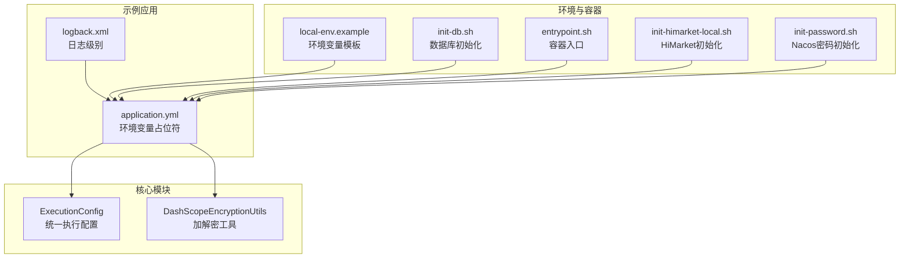
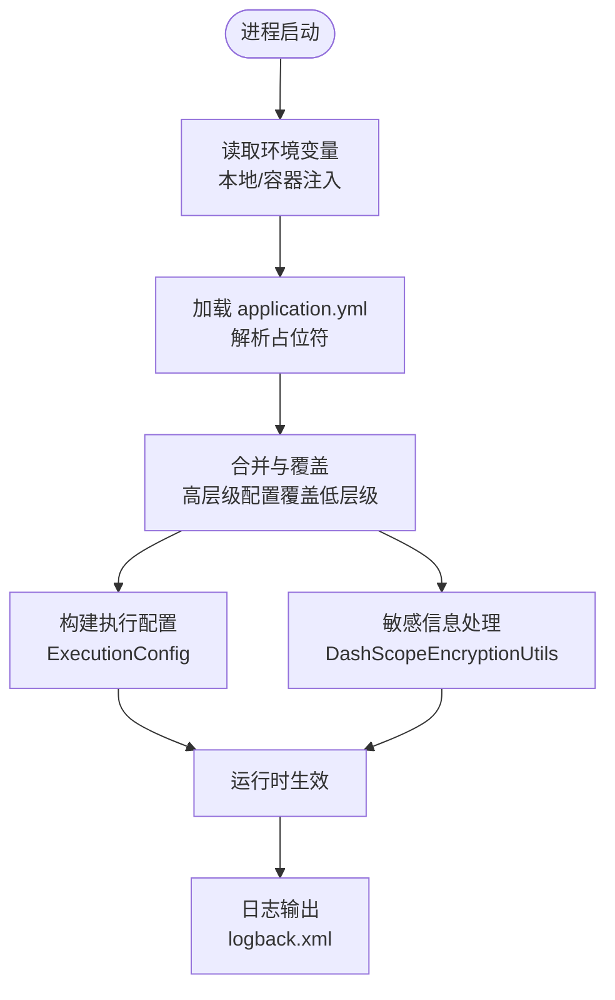
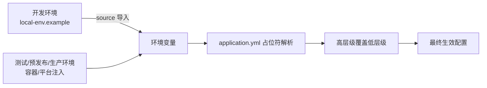
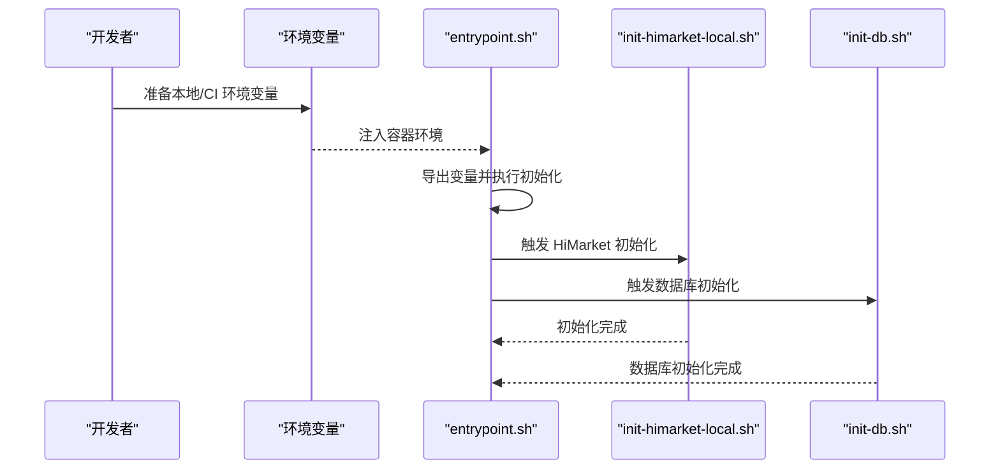
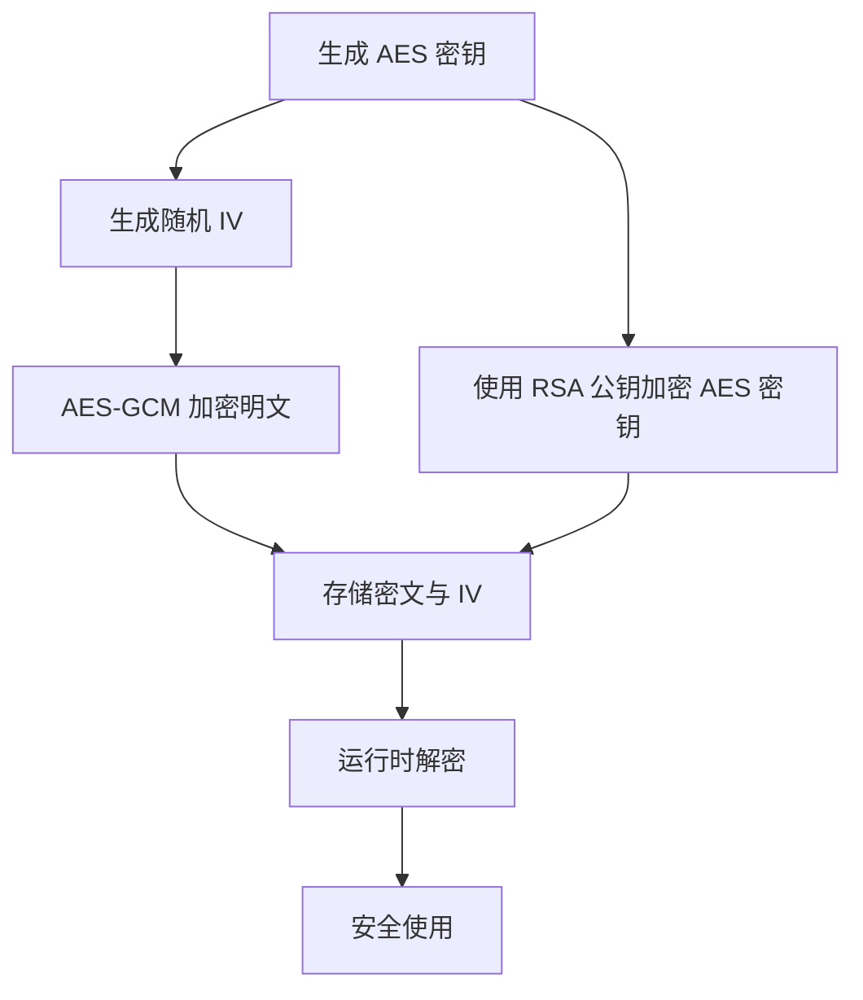
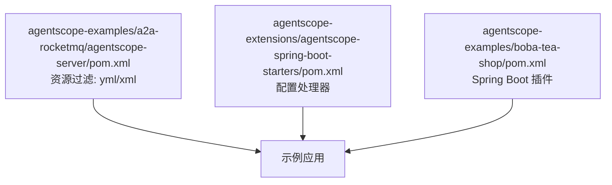

# 配置管理

<cite>
**本文引用的文件**
- [agentscope-examples/a2a/src/main/resources/application.yml](file://agentscope-examples/a2a/src/main/resources/application.yml)
- [agentscope-examples/a2a/src/main/resources/logback.xml](file://agentscope-examples/a2a/src/main/resources/logback.xml)
- [agentscope-core/src/main/java/io/agentscope/core/model/ExecutionConfig.java](file://agentscope-core/src/main/java/io/agentscope/core/model/ExecutionConfig.java)
- [agentscope-core/src/main/java/io/agentscope/core/model/DashScopeEncryptionUtils.java](file://agentscope-core/src/main/java/io/agentscope/core/model/DashScopeEncryptionUtils.java)
- [agentscope-examples/boba-tea-shop/local-env.example](file://agentscope-examples/boba-tea-shop/local-env.example)
- [agentscope-examples/boba-tea-shop/mysql-image/init-db.sh](file://agentscope-examples/boba-tea-shop/mysql-image/init-db.sh)
- [agentscope-examples/boba-tea-shop/himarket-image/entrypoint.sh](file://agentscope-examples/boba-tea-shop/himarket-image/entrypoint.sh)
- [agentscope-examples/boba-tea-shop/himarket-image/init-himarket-local.sh](file://agentscope-examples/boba-tea-shop/himarket-image/init-himarket-local.sh)
- [agentscope-examples/boba-tea-shop/nacos-image/init-password.sh](file://agentscope-examples/boba-tea-shop/nacos-image/init-password.sh)
- [agentscope-examples/a2a-rocketmq/agentscope-server/pom.xml](file://agentscope-examples/a2a-rocketmq/agentscope-server/pom.xml)
- [agentscope-extensions/agentscope-spring-boot-starters/pom.xml](file://agentscope-extensions/agentscope-spring-boot-starters/pom.xml)
- [agentscope-examples/boba-tea-shop/pom.xml](file://agentscope-examples/boba-tea-shop/pom.xml)
</cite>

## 目录
1. [简介](#简介)
2. [项目结构](#项目结构)
3. [核心组件](#核心组件)
4. [架构总览](#架构总览)
5. [详细组件分析](#详细组件分析)
6. [依赖分析](#依赖分析)
7. [性能考虑](#性能考虑)
8. [故障排查指南](#故障排查指南)
9. [结论](#结论)
10. [附录](#附录)

## 简介
本文件面向 AgentScope Java 的配置管理，系统性梳理多环境配置策略（开发、测试、预发布、生产）、环境变量管理、配置文件加载与优先级、敏感信息保护（密钥、加密、访问控制）、配置热更新与零停机部署、配置验证与审计、配置回滚以及模板化与版本管理最佳实践。文档以仓库中现有实现为依据，结合示例工程与核心模块，给出可操作的落地建议。

## 项目结构
AgentScope Java 在示例工程中广泛采用 Spring Boot 的 application.yml 作为主配置载体，并通过环境变量进行参数化；核心模块提供统一的执行配置模型与加密工具；部分示例工程还包含 Docker 初始化脚本与入口脚本，用于在容器环境中注入配置并完成初始化。

图表来源
- [agentscope-examples/a2a/src/main/resources/application.yml:1-65](file://agentscope-examples/a2a/src/main/resources/application.yml#L1-L65)
- [agentscope-examples/a2a/src/main/resources/logback.xml:1-32](file://agentscope-examples/a2a/src/main/resources/logback.xml#L1-L32)
- [agentscope-core/src/main/java/io/agentscope/core/model/ExecutionConfig.java:1-395](file://agentscope-core/src/main/java/io/agentscope/core/model/ExecutionConfig.java#L1-L395)
- [agentscope-core/src/main/java/io/agentscope/core/model/DashScopeEncryptionUtils.java:53-181](file://agentscope-core/src/main/java/io/agentscope/core/model/DashScopeEncryptionUtils.java#L53-L181)
- [agentscope-examples/boba-tea-shop/local-env.example:1-89](file://agentscope-examples/boba-tea-shop/local-env.example#L1-L89)
- [agentscope-examples/boba-tea-shop/mysql-image/init-db.sh:1-28](file://agentscope-examples/boba-tea-shop/mysql-image/init-db.sh#L1-L28)
- [agentscope-examples/boba-tea-shop/himarket-image/entrypoint.sh:43-98](file://agentscope-examples/boba-tea-shop/himarket-image/entrypoint.sh#L43-L98)
- [agentscope-examples/boba-tea-shop/himarket-image/init-himarket-local.sh:287-640](file://agentscope-examples/boba-tea-shop/himarket-image/init-himarket-local.sh#L287-L640)
- [agentscope-examples/boba-tea-shop/nacos-image/init-password.sh:1-47](file://agentscope-examples/boba-tea-shop/nacos-image/init-password.sh#L1-L47)

章节来源
- [agentscope-examples/a2a/src/main/resources/application.yml:1-65](file://agentscope-examples/a2a/src/main/resources/application.yml#L1-L65)
- [agentscope-examples/a2a/src/main/resources/logback.xml:1-32](file://agentscope-examples/a2a/src/main/resources/logback.xml#L1-L32)
- [agentscope-examples/boba-tea-shop/local-env.example:1-89](file://agentscope-examples/boba-tea-shop/local-env.example#L1-L89)

## 核心组件
- 统一执行配置模型：提供超时、重试次数、指数退避等统一配置，支持按字段合并，便于在不同层级叠加配置。
- 加密工具：提供 AES-GCM 对称加密与 RSA 公钥封装对称密钥的能力，用于敏感数据的安全处理。
- 示例配置与日志：application.yml 中使用环境变量占位符；logback.xml 控制日志输出与级别。
- 容器与初始化：通过 shell 脚本在容器启动阶段注入环境变量、执行初始化任务、注册服务。

章节来源
- [agentscope-core/src/main/java/io/agentscope/core/model/ExecutionConfig.java:1-395](file://agentscope-core/src/main/java/io/agentscope/core/model/ExecutionConfig.java#L1-L395)
- [agentscope-core/src/main/java/io/agentscope/core/model/DashScopeEncryptionUtils.java:53-181](file://agentscope-core/src/main/java/io/agentscope/core/model/DashScopeEncryptionUtils.java#L53-L181)
- [agentscope-examples/a2a/src/main/resources/application.yml:1-65](file://agentscope-examples/a2a/src/main/resources/application.yml#L1-L65)
- [agentscope-examples/a2a/src/main/resources/logback.xml:1-32](file://agentscope-examples/a2a/src/main/resources/logback.xml#L1-L32)

## 架构总览
下图展示从环境变量到配置文件、再到运行时配置的加载与优先级关系，以及敏感信息处理路径。

图表来源
- [agentscope-examples/a2a/src/main/resources/application.yml:1-65](file://agentscope-examples/a2a/src/main/resources/application.yml#L1-L65)
- [agentscope-examples/a2a/src/main/resources/logback.xml:1-32](file://agentscope-examples/a2a/src/main/resources/logback.xml#L1-L32)
- [agentscope-core/src/main/java/io/agentscope/core/model/ExecutionConfig.java:244-297](file://agentscope-core/src/main/java/io/agentscope/core/model/ExecutionConfig.java#L244-L297)
- [agentscope-core/src/main/java/io/agentscope/core/model/DashScopeEncryptionUtils.java:53-181](file://agentscope-core/src/main/java/io/agentscope/core/model/DashScopeEncryptionUtils.java#L53-L181)

## 详细组件分析

### 多环境配置策略与优先级
- 开发环境：通过本地环境变量模板定义默认值，便于本地快速启动与调试。
- 测试/预发布/生产环境：通过容器或平台注入环境变量，覆盖默认值；容器入口脚本负责导出变量并触发初始化流程。
- 配置文件加载与优先级：示例工程使用 Spring Boot 的 application.yml，其中的占位符由环境变量解析；高层级配置（如运行时注入）可覆盖低层级默认值。

图表来源
- [agentscope-examples/boba-tea-shop/local-env.example:1-89](file://agentscope-examples/boba-tea-shop/local-env.example#L1-L89)
- [agentscope-examples/a2a/src/main/resources/application.yml:1-65](file://agentscope-examples/a2a/src/main/resources/application.yml#L1-L65)
- [agentscope-examples/boba-tea-shop/himarket-image/entrypoint.sh:43-98](file://agentscope-examples/boba-tea-shop/himarket-image/entrypoint.sh#L43-L98)

章节来源
- [agentscope-examples/boba-tea-shop/local-env.example:1-89](file://agentscope-examples/boba-tea-shop/local-env.example#L1-L89)
- [agentscope-examples/a2a/src/main/resources/application.yml:1-65](file://agentscope-examples/a2a/src/main/resources/application.yml#L1-L65)
- [agentscope-examples/boba-tea-shop/himarket-image/entrypoint.sh:43-98](file://agentscope-examples/boba-tea-shop/himarket-image/entrypoint.sh#L43-L98)

### 环境变量管理与配置文件加载
- 环境变量模板：提供本地开发所需的关键变量示例，避免硬编码。
- 容器入口脚本：在容器启动时导出变量并执行初始化逻辑，确保服务启动前完成必要的配置准备。
- 数据库初始化脚本：使用 envsubst 进行模板替换，将环境变量注入 SQL 模板后执行，体现容器内配置注入的典型模式。

图表来源
- [agentscope-examples/boba-tea-shop/himarket-image/entrypoint.sh:43-98](file://agentscope-examples/boba-tea-shop/himarket-image/entrypoint.sh#L43-L98)
- [agentscope-examples/boba-tea-shop/himarket-image/init-himarket-local.sh:287-640](file://agentscope-examples/boba-tea-shop/himarket-image/init-himarket-local.sh#L287-L640)
- [agentscope-examples/boba-tea-shop/mysql-image/init-db.sh:1-28](file://agentscope-examples/boba-tea-shop/mysql-image/init-db.sh#L1-L28)

章节来源
- [agentscope-examples/boba-tea-shop/himarket-image/entrypoint.sh:43-98](file://agentscope-examples/boba-tea-shop/himarket-image/entrypoint.sh#L43-L98)
- [agentscope-examples/boba-tea-shop/mysql-image/init-db.sh:1-28](file://agentscope-examples/boba-tea-shop/mysql-image/init-db.sh#L1-L28)

### 敏感信息保护策略
- 对称加密与随机初始化向量：提供 AES-GCM 加解密能力，支持生成随机 IV，保证同一明文多次加密得到不同密文。
- 密钥封装：提供使用 RSA 公钥对 AES 密钥进行加密的能力，便于安全地分发对称密钥。
- 使用建议：将敏感配置（如 API Key、访问凭证）以密文形式存储，运行时再解密；限制密钥访问权限，仅授予必要进程。

图表来源
- [agentscope-core/src/main/java/io/agentscope/core/model/DashScopeEncryptionUtils.java:53-181](file://agentscope-core/src/main/java/io/agentscope/core/model/DashScopeEncryptionUtils.java#L53-L181)

章节来源
- [agentscope-core/src/main/java/io/agentscope/core/model/DashScopeEncryptionUtils.java:53-181](file://agentscope-core/src/main/java/io/agentscope/core/model/DashScopeEncryptionUtils.java#L53-L181)

### 配置热更新与零停机部署
- 建议方案：利用外部配置中心（如 Nacos）动态推送配置变更；应用监听配置变化并触发局部刷新（如重新加载执行配置、刷新日志级别等），避免重启。
- 容器侧：通过入口脚本与初始化脚本在启动阶段完成一次性配置注入；对于需要热更的部分，结合配置中心与应用内部刷新逻辑实现零停机。

章节来源
- [agentscope-examples/a2a/src/main/resources/application.yml:1-65](file://agentscope-examples/a2a/src/main/resources/application.yml#L1-L65)
- [agentscope-examples/boba-tea-shop/himarket-image/entrypoint.sh:43-98](file://agentscope-examples/boba-tea-shop/himarket-image/entrypoint.sh#L43-L98)

### 配置验证、审计与回滚
- 验证：在加载配置后进行字段校验（如必填项、格式、范围），失败则拒绝启动或降级至安全配置。
- 审计：记录配置来源、生效时间、变更人/CI 任务等元信息，便于追踪。
- 回滚：保留最近 N 次配置快照，发生问题时一键回滚至上一个稳定版本。

（本节为通用实践说明，不直接分析具体文件）

### 配置模板化、参数化部署与版本管理
- 模板化：使用环境变量模板与容器初始化脚本，将“变量”与“模板”分离，提升复用性。
- 参数化：通过环境变量覆盖默认值，实现同一镜像在不同环境的差异化部署。
- 版本管理：将配置文件纳入版本控制系统，配合分支与标签管理不同环境的配置版本。

章节来源
- [agentscope-examples/boba-tea-shop/local-env.example:1-89](file://agentscope-examples/boba-tea-shop/local-env.example#L1-L89)
- [agentscope-examples/boba-tea-shop/mysql-image/init-db.sh:1-28](file://agentscope-examples/boba-tea-shop/mysql-image/init-db.sh#L1-L28)

## 依赖分析
- Maven 插件与资源过滤：示例工程启用资源过滤，使 YAML/XML 等资源中的占位符被正确替换。
- Spring Boot 启动器：通过 BOM 与插件配置，确保自动装配与配置处理器可用。
- 示例工程构建：示例工程集成 Spring Boot 插件，支持打包与运行。

图表来源
- [agentscope-examples/a2a-rocketmq/agentscope-server/pom.xml:96-109](file://agentscope-examples/a2a-rocketmq/agentscope-server/pom.xml#L96-L109)
- [agentscope-extensions/agentscope-spring-boot-starters/pom.xml:59-81](file://agentscope-extensions/agentscope-spring-boot-starters/pom.xml#L59-L81)
- [agentscope-examples/boba-tea-shop/pom.xml:87-117](file://agentscope-examples/boba-tea-shop/pom.xml#L87-L117)

章节来源
- [agentscope-examples/a2a-rocketmq/agentscope-server/pom.xml:96-109](file://agentscope-examples/a2a-rocketmq/agentscope-server/pom.xml#L96-L109)
- [agentscope-extensions/agentscope-spring-boot-starters/pom.xml:59-81](file://agentscope-extensions/agentscope-spring-boot-starters/pom.xml#L59-L81)
- [agentscope-examples/boba-tea-shop/pom.xml:87-117](file://agentscope-examples/boba-tea-shop/pom.xml#L87-L117)

## 性能考虑
- 执行配置的超时与重试：通过统一的执行配置模型设置合理的超时与退避策略，降低高并发场景下的抖动与资源占用。
- 日志级别：在生产环境适当提高日志级别，减少 IO 压力。
- 容器初始化：将耗时的初始化步骤（如数据库初始化、服务注册）前置到容器启动阶段，缩短业务就绪时间。

章节来源
- [agentscope-core/src/main/java/io/agentscope/core/model/ExecutionConfig.java:136-170](file://agentscope-core/src/main/java/io/agentscope/core/model/ExecutionConfig.java#L136-L170)
- [agentscope-examples/a2a/src/main/resources/logback.xml:1-32](file://agentscope-examples/a2a/src/main/resources/logback.xml#L1-L32)
- [agentscope-examples/boba-tea-shop/mysql-image/init-db.sh:1-28](file://agentscope-examples/boba-tea-shop/mysql-image/init-db.sh#L1-L28)

## 故障排查指南
- 环境变量未生效：检查容器入口脚本是否正确导出变量，确认初始化脚本执行顺序与返回码。
- 数据库初始化失败：核对模板变量替换结果与 SQL 文件，关注临时文件清理与权限问题。
- Nacos 初始化：确认端口可达与登录接口响应，提取并使用访问令牌。
- 配置加载异常：检查 application.yml 占位符是否被正确替换，必要时开启调试日志。

章节来源
- [agentscope-examples/boba-tea-shop/himarket-image/entrypoint.sh:43-98](file://agentscope-examples/boba-tea-shop/himarket-image/entrypoint.sh#L43-L98)
- [agentscope-examples/boba-tea-shop/himarket-image/init-himarket-local.sh:287-640](file://agentscope-examples/boba-tea-shop/himarket-image/init-himarket-local.sh#L287-L640)
- [agentscope-examples/boba-tea-shop/mysql-image/init-db.sh:1-28](file://agentscope-examples/boba-tea-shop/mysql-image/init-db.sh#L1-L28)
- [agentscope-examples/boba-tea-shop/nacos-image/init-password.sh:1-47](file://agentscope-examples/boba-tea-shop/nacos-image/init-password.sh#L1-L47)

## 结论
AgentScope Java 的配置管理以 Spring Boot 的 application.yml 为核心，结合环境变量模板与容器初始化脚本，实现了多环境分离与参数化部署。通过统一的执行配置模型与内置的加解密工具，可在保证安全性的同时提升系统的可维护性与可运维性。建议进一步引入外部配置中心与自动化审计回滚机制，以满足更高标准的生产要求。

## 附录
- 关键实现参考路径
  - [application.yml:1-65](file://agentscope-examples/a2a/src/main/resources/application.yml#L1-L65)
  - [logback.xml:1-32](file://agentscope-examples/a2a/src/main/resources/logback.xml#L1-L32)
  - [ExecutionConfig:1-395](file://agentscope-core/src/main/java/io/agentscope/core/model/ExecutionConfig.java#L1-L395)
  - [DashScopeEncryptionUtils:53-181](file://agentscope-core/src/main/java/io/agentscope/core/model/DashScopeEncryptionUtils.java#L53-L181)
  - [local-env.example:1-89](file://agentscope-examples/boba-tea-shop/local-env.example#L1-L89)
  - [init-db.sh:1-28](file://agentscope-examples/boba-tea-shop/mysql-image/init-db.sh#L1-L28)
  - [entrypoint.sh:43-98](file://agentscope-examples/boba-tea-shop/himarket-image/entrypoint.sh#L43-L98)
  - [init-himarket-local.sh:287-640](file://agentscope-examples/boba-tea-shop/himarket-image/init-himarket-local.sh#L287-L640)
  - [init-password.sh:1-47](file://agentscope-examples/boba-tea-shop/nacos-image/init-password.sh#L1-L47)
  - [a2a-rocketmq agentscope-server pom.xml:96-109](file://agentscope-examples/a2a-rocketmq/agentscope-server/pom.xml#L96-L109)
  - [spring-boot-starters pom.xml:59-81](file://agentscope-extensions/agentscope-spring-boot-starters/pom.xml#L59-L81)
  - [boba-tea-shop pom.xml:87-117](file://agentscope-examples/boba-tea-shop/pom.xml#L87-L117)