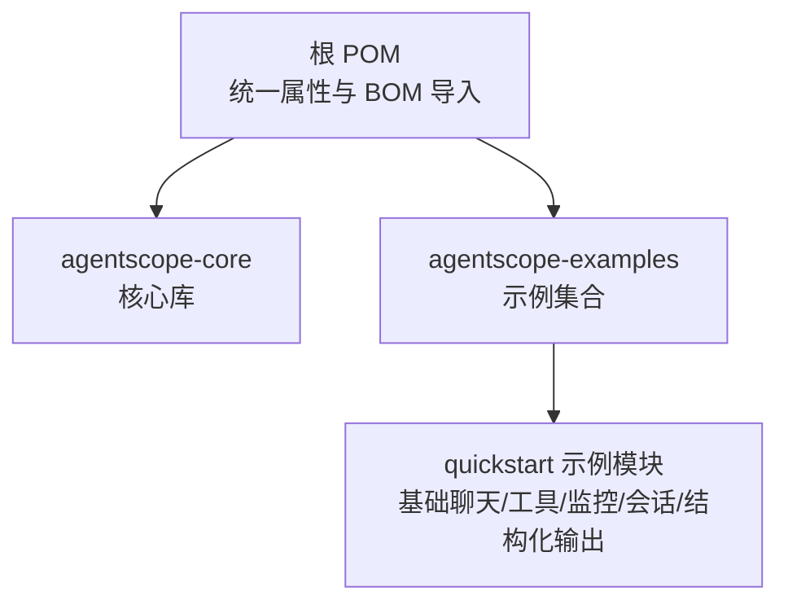
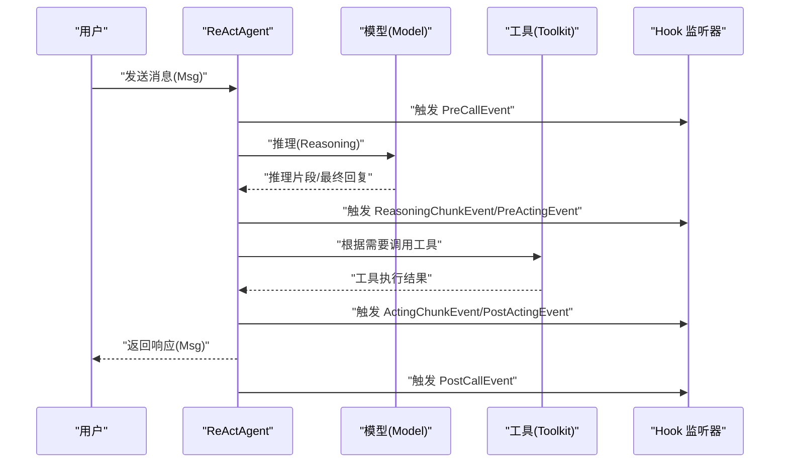
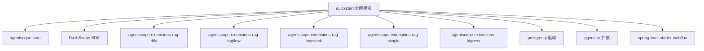

# 快速开始

<cite>
**本文引用的文件**
- [README.md](file://README.md)
- [pom.xml](file://pom.xml)
- [agentscope-core/pom.xml](file://agentscope-core/pom.xml)
- [agentscope-examples/quickstart/pom.xml](file://agentscope-examples/quickstart/pom.xml)
- [BasicChatExample.java](file://agentscope-examples/quickstart/src/main/java/io/agentscope/examples/quickstart/BasicChatExample.java)
- [ToolCallingExample.java](file://agentscope-examples/quickstart/src/main/java/io/agentscope/examples/quickstart/ToolCallingExample.java)
- [HookExample.java](file://agentscope-examples/quickstart/src/main/java/io/agentscope/examples/quickstart/HookExample.java)
- [SessionExample.java](file://agentscope-examples/quickstart/src/main/java/io/agentscope/examples/quickstart/SessionExample.java)
- [StructuredOutputExample.java](file://agentscope-examples/quickstart/src/main/java/io/agentscope/examples/quickstart/StructuredOutputExample.java)
- [ReActAgent.java](file://agentscope-core/src/main/java/io/agentscope/core/ReActAgent.java)
</cite>

## 目录
1. [简介](#简介)
2. [项目结构](#项目结构)
3. [核心组件](#核心组件)
4. [架构总览](#架构总览)
5. [详细组件分析](#详细组件分析)
6. [依赖分析](#依赖分析)
7. [性能考虑](#性能考虑)
8. [故障排查指南](#故障排查指南)
9. [结论](#结论)
10. [附录](#附录)

## 简介
本指南面向首次接触 AgentScope Java 框架的开发者，目标是帮助你在最短时间内完成环境准备、安装依赖、运行第一个智能体，并掌握工具调用、Hook 监控、会话持久化与结构化输出等核心能力。示例均来自仓库中的“快速开始”示例模块，可直接运行并观察效果。

## 项目结构
AgentScope Java 采用多模块组织方式，核心能力集中在 agentscope-core，示例集中在 agentscope-examples。根 pom.xml 提供统一的版本管理和 BOM 导入；agentscope-examples/quickstart 展示了从零到一的入门路径。

图表来源
- [pom.xml:132-149](file://pom.xml#L132-L149)
- [agentscope-examples/quickstart/pom.xml:22-27](file://agentscope-examples/quickstart/pom.xml#L22-L27)

章节来源
- [pom.xml:29-54](file://pom.xml#L29-L54)
- [agentscope-examples/quickstart/pom.xml:22-41](file://agentscope-examples/quickstart/pom.xml#L22-L41)

## 核心组件
- ReActAgent：基于推理-行动（ReAct）范式的智能体实现，支持流式输出、Hook 扩展、结构化输出、计划笔记本、RAG 集成、长短期记忆等。
- 工具系统：通过 Toolkit 注册工具方法，配合模型进行工具调用，支持输入参数校验与结果转换。
- Hook 系统：事件驱动的扩展机制，可在推理、行动、总结等阶段注入日志、追踪或人工干预。
- 会话与内存：支持将对话历史保存到本地或外部存储，并在后续会话中加载继续。
- 结构化输出：通过 JSON Schema 生成器与模型提示，自动纠正输出格式，映射到 Java POJO。

章节来源
- [ReActAgent.java:93-139](file://agentscope-core/src/main/java/io/agentscope/core/ReActAgent.java#L93-L139)

## 架构总览
下图展示了从用户发起消息到智能体返回响应的关键交互路径，以及工具调用与 Hook 触发的时序关系。

图表来源
- [HookExample.java:109-160](file://agentscope-examples/quickstart/src/main/java/io/agentscope/examples/quickstart/HookExample.java#L109-L160)
- [ReActAgent.java:198-200](file://agentscope-core/src/main/java/io/agentscope/core/ReActAgent.java#L198-L200)

## 详细组件分析

### 安装与环境要求
- 运行环境：JDK 17 或以上
- Maven 依赖：引入 agentscope-core 或在示例模块中使用已配置好的依赖
- 可选：DashScope API Key（示例中用于模型调用）

章节来源
- [README.md:72-82](file://README.md#L72-L82)
- [agentscope-core/pom.xml:34-46](file://agentscope-core/pom.xml#L34-L46)

### 第一个智能体：基础聊天
目标：创建一个最小化的 ReActAgent 并进行交互式聊天。

要点
- 使用 ReActAgent.builder 配置名称、系统提示、模型（如 DashScopeChatModel）、内存与工具包
- 通过 ExampleUtils.startChat 启动交互循环
- 可开启流式输出与思考内容开关以提升体验

章节来源
- [BasicChatExample.java:30-63](file://agentscope-examples/quickstart/src/main/java/io/agentscope/examples/quickstart/BasicChatExample.java#L30-L63)

### 工具调用：让智能体具备“行动”能力
目标：为智能体注册工具，使其能处理时间查询、计算与模拟搜索等任务。

要点
- 创建 Toolkit 并注册工具类（@Tool/@ToolParam 注解）
- 在 Agent 构建时传入 toolkit
- 通过自然语言指令触发工具调用，智能体自动选择并执行

章节来源
- [ToolCallingExample.java:44-75](file://agentscope-examples/quickstart/src/main/java/io/agentscope/examples/quickstart/ToolCallingExample.java#L44-L75)

### Hook 使用：可观测性与人工干预
目标：通过 Hook 记录推理与行动过程，实现调试、追踪与人类在回路（HITL）。

要点
- 实现 Hook 接口，在 onEvent 中按事件类型打印日志或注入逻辑
- 使用 JsonlTraceExporter 将事件导出到本地文件，便于问题定位
- 工具可通过 ToolEmitter 发送进度块，被 Hook 捕获

章节来源
- [HookExample.java:47-101](file://agentscope-examples/quickstart/src/main/java/io/agentscope/examples/quickstart/HookExample.java#L47-L101)

### 会话管理：持久化对话历史
目标：将对话保存到本地文件，下次启动时可恢复。

要点
- 使用 JsonSession 指定会话存储路径
- 在加载会话后，调用 agent.loadFrom 恢复上下文
- 每次交互后调用 agent.saveTo 保存最新状态

章节来源
- [SessionExample.java:57-92](file://agentscope-examples/quickstart/src/main/java/io/agentscope/examples/quickstart/SessionExample.java#L57-L92)

### 结构化输出：安全可靠的类型化响应
目标：让模型输出符合预定义结构的数据，自动纠正格式偏差。

要点
- 调用 agent.call(...) 时指定目标类型（如 POJO 类），或使用 stream(...) 获取增量事件流
- 框架基于 JSON Schema 与模型提示，保证输出可解析且类型安全

章节来源
- [StructuredOutputExample.java:84-120](file://agentscope-examples/quickstart/src/main/java/io/agentscope/examples/quickstart/StructuredOutputExample.java#L84-L120)

### 从零开始的完整开发流程
- 步骤 1：新建 Maven 工程，添加 JDK 17 属性与依赖管理（可参考根 POM 的 BOM 导入）
- 步骤 2：引入 agentscope-core 或示例模块依赖
- 步骤 3：编写主程序，构建 ReActAgent（模型、内存、工具包）
- 步骤 4：运行基础聊天示例验证环境
- 步骤 5：逐步加入工具、Hook、会话与结构化输出
- 步骤 6：集成真实模型 API Key，完善错误处理与日志

章节来源
- [pom.xml:132-149](file://pom.xml#L132-L149)
- [agentscope-examples/quickstart/pom.xml:56-113](file://agentscope-examples/quickstart/pom.xml#L56-L113)

## 依赖分析
下图展示了示例模块 quickstart 的关键依赖关系，包括核心库、模型 SDK、RAG 扩展与 WebFlux 响应式依赖。

图表来源
- [agentscope-examples/quickstart/pom.xml:56-113](file://agentscope-examples/quickstart/pom.xml#L56-L113)

章节来源
- [agentscope-examples/quickstart/pom.xml:56-113](file://agentscope-examples/quickstart/pom.xml#L56-L113)

## 性能考虑
- 流式输出：开启模型流式与思考预算，可降低首字节延迟并提升交互体验
- 非阻塞执行：ReActor 核心与 WebFlux 集成，适合高并发场景
- 内存与工具：合理设置内存容量与工具超时策略，避免长时间阻塞
- 日志与追踪：Hook 与 JSONL 导出仅在调试阶段启用，生产环境建议按需开启

## 故障排查指南
常见问题与建议
- API Key 未配置：示例中通过 ExampleUtils.getDashScopeApiKey 获取密钥，请确认环境变量或交互输入正确
- 依赖缺失：若自定义工程缺少模型 SDK 或 RAG 扩展，请参考 quickstart 示例的依赖清单
- 会话保存失败：检查 JsonSession 路径权限与磁盘空间
- Hook 不生效：确认已将 Hook 列表传入 Agent 构建器，并在工具执行中使用 ToolEmitter 发送进度块
- 结构化输出异常：检查目标 POJO 字段与 JSON Schema 是否匹配，必要时调整模型提示词

章节来源
- [BasicChatExample.java:37-38](file://agentscope-examples/quickstart/src/main/java/io/agentscope/examples/quickstart/BasicChatExample.java#L37-L38)
- [SessionExample.java:171-179](file://agentscope-examples/quickstart/src/main/java/io/agentscope/examples/quickstart/SessionExample.java#L171-L179)
- [HookExample.java:59-66](file://agentscope-examples/quickstart/src/main/java/io/agentscope/examples/quickstart/HookExample.java#L59-L66)
- [StructuredOutputExample.java:105-120](file://agentscope-examples/quickstart/src/main/java/io/agentscope/examples/quickstart/StructuredOutputExample.java#L105-L120)

## 结论
通过本指南，你已经完成了 AgentScope Java 的环境准备与核心能力入门：从基础聊天到工具调用、Hook 监控、会话持久化与结构化输出。建议在完成示例后，结合自身业务场景扩展工具与 Hook，逐步引入 RAG、计划笔记本与多智能体协作等高级特性。

## 附录
- 快速开始示例入口（可直接运行）
  - 基础聊天：[BasicChatExample.java:30-63](file://agentscope-examples/quickstart/src/main/java/io/agentscope/examples/quickstart/BasicChatExample.java#L30-L63)
  - 工具调用：[ToolCallingExample.java:34-75](file://agentscope-examples/quickstart/src/main/java/io/agentscope/examples/quickstart/ToolCallingExample.java#L34-L75)
  - Hook 监控：[HookExample.java:47-101](file://agentscope-examples/quickstart/src/main/java/io/agentscope/examples/quickstart/HookExample.java#L47-L101)
  - 会话管理：[SessionExample.java:46-92](file://agentscope-examples/quickstart/src/main/java/io/agentscope/examples/quickstart/SessionExample.java#L46-L92)
  - 结构化输出：[StructuredOutputExample.java:36-82](file://agentscope-examples/quickstart/src/main/java/io/agentscope/examples/quickstart/StructuredOutputExample.java#L36-L82)