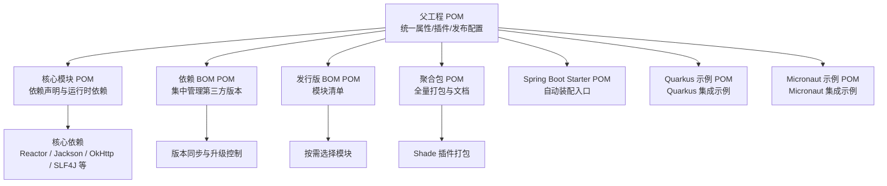
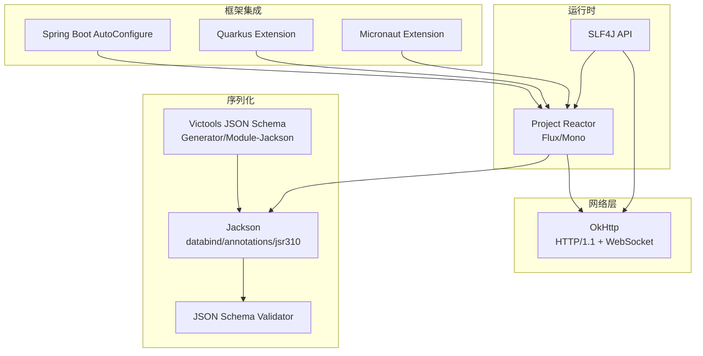
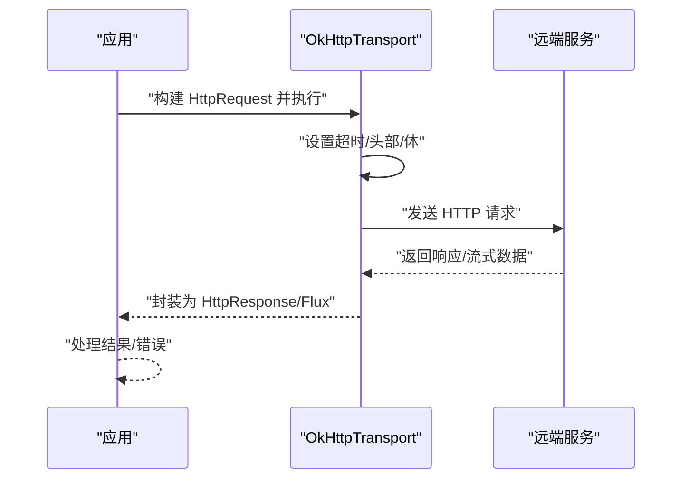
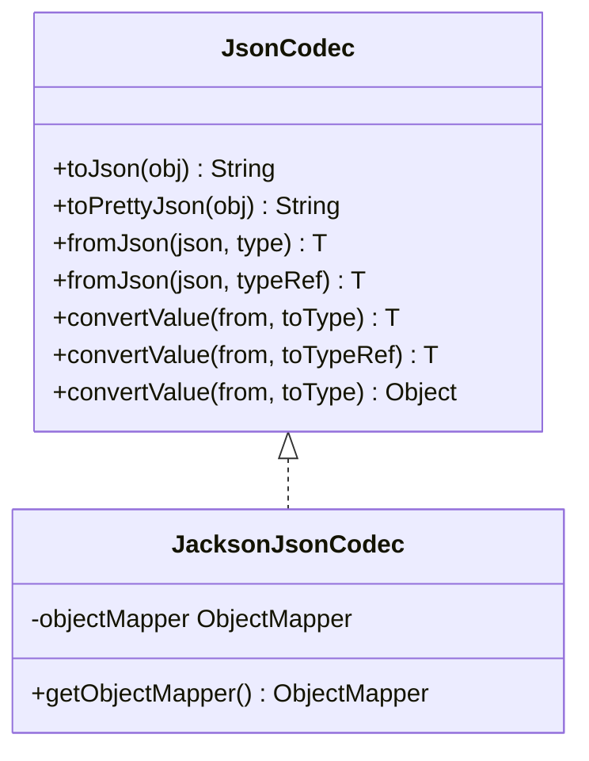
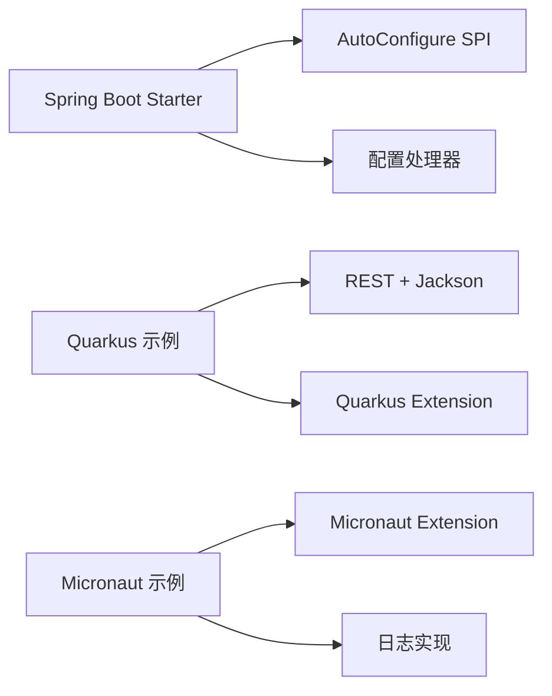
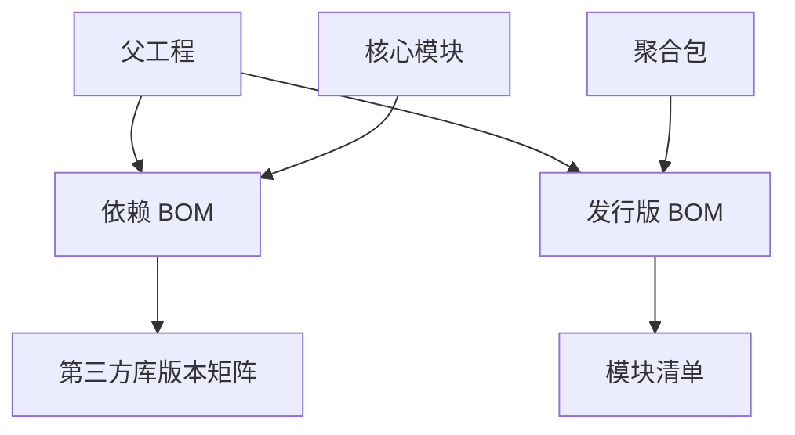

# 技术栈

<cite>
**本文引用的文件**
- [根 POM（父工程）](file://pom.xml)
- [核心模块 POM](file://agentscope-core/pom.xml)
- [依赖 BOM POM](file://agentscope-dependencies-bom/pom.xml)
- [发行版 BOM POM](file://agentscope-distribution/agentscope-bom/pom.xml)
- [聚合包 POM（全量打包）](file://agentscope-distribution/agentscope-all/pom.xml)
- [Spring Boot Starter POM](file://agentscope-extensions/agentscope-spring-boot-starters/agentscope-spring-boot-starter/pom.xml)
- [Quarkus 示例 POM](file://agentscope-examples/quarkus/pom.xml)
- [Micronaut 示例 POM](file://agentscope-examples/micronaut/pom.xml)
- [版本工具类](file://agentscope-core/src/main/java/io/agentscope/core/Version.java)
- [JSON 编解码接口](file://agentscope-core/src/main/java/io/agentscope/core/util/JsonCodec.java)
- [Jackson JSON 实现](file://agentscope-core/src/main/java/io/agentscope/core/util/JacksonJsonCodec.java)
- [OkHttp 传输实现](file://agentscope-core/src/main/java/io/agentscope/core/model/transport/OkHttpTransport.java)
- [OkHttp WebSocket 传输实现](file://agentscope-core/src/main/java/io/agentscope/core/model/transport/websocket/OkHttpWebSocketTransport.java)
- [OkHttp 传输单元测试](file://agentscope-core/src/test/java/io/agentscope/core/model/transport/OkHttpTransportTest.java)
- [OkHttp 传输构造器测试](file://agentscope-core/src/test/java/io/agentscope/core/model/transport/OkHttpTransportConstructorTest.java)
- [README（项目概览）](file://README.md)
</cite>

## 目录
1. [引言](#引言)
2. [项目结构](#项目结构)
3. [核心组件](#核心组件)
4. [架构总览](#架构总览)
5. [详细组件分析](#详细组件分析)
6. [依赖分析](#依赖分析)
7. [性能考量](#性能考量)
8. [故障排查指南](#故障排查指南)
9. [结论](#结论)
10. [附录](#附录)

## 引言
本节概述 AgentScope Java 框架的技术栈定位与目标：围绕“以代理为中心”的编程范式，构建面向生产环境的大模型应用开发框架。框架强调响应式执行、可观测性、安全沙箱与多协议扩展能力，并通过统一的依赖管理策略确保版本一致性与可维护性。

## 项目结构
- 父工程统一编译与插件配置，定义 Java 版本、源编码、覆盖率与发布流程等。
- 核心模块提供代理内核、消息模型、工具系统、记忆与检索增强、管道与计划等基础能力。
- 依赖 BOM 聚合第三方库版本，确保跨模块一致性和升级可控。
- 发行版 BOM 提供模块化清单，便于按需引入或全量打包。
- 聚合包（agentscope-all）通过 Shade 插件生成“全量”构件，方便快速集成。
- 各类扩展与示例模块演示与 Spring Boot、Quarkus、Micronaut 的集成方式。

图表来源
- [根 POM（父工程）:29-54](file://pom.xml#L29-L54)
- [核心模块 POM:51-154](file://agentscope-core/pom.xml#L51-L154)
- [依赖 BOM POM:127-489](file://agentscope-dependencies-bom/pom.xml#L127-L489)
- [发行版 BOM POM:80-359](file://agentscope-distribution/agentscope-bom/pom.xml#L80-L359)
- [聚合包 POM（全量打包）:40-311](file://agentscope-distribution/agentscope-all/pom.xml#L40-L311)
- [Spring Boot Starter POM:38-73](file://agentscope-extensions/agentscope-spring-boot-starters/agentscope-spring-boot-starter/pom.xml#L38-L73)
- [Quarkus 示例 POM:39-87](file://agentscope-examples/quarkus/pom.xml#L39-L87)
- [Micronaut 示例 POM:38-71](file://agentscope-examples/micronaut/pom.xml#L38-L71)

章节来源
- [根 POM（父工程）:29-54](file://pom.xml#L29-L54)
- [核心模块 POM:51-154](file://agentscope-core/pom.xml#L51-L154)
- [依赖 BOM POM:127-489](file://agentscope-dependencies-bom/pom.xml#L127-L489)
- [发行版 BOM POM:80-359](file://agentscope-distribution/agentscope-bom/pom.xml#L80-L359)
- [聚合包 POM（全量打包）:40-311](file://agentscope-distribution/agentscope-all/pom.xml#L40-L311)
- [Spring Boot Starter POM:38-73](file://agentscope-extensions/agentscope-spring-boot-starters/agentscope-spring-boot-starter/pom.xml#L38-L73)
- [Quarkus 示例 POM:39-87](file://agentscope-examples/quarkus/pom.xml#L39-L87)
- [Micronaut 示例 POM:38-71](file://agentscope-examples/micronaut/pom.xml#L38-L71)

## 核心组件
- 响应式运行时：基于 Project Reactor，提供非阻塞、背压感知的流处理能力，支撑长连接、SSE 与并发调用。
- 序列化与模式校验：Jackson 用于 JSON 的高性能编解码；Victools 生成 JSON Schema，结合网络库校验工具入参，保障结构化输出与输入安全。
- HTTP 客户端：OkHttp 提供稳定、高效的 HTTP/1.1 与 WebSocket 支持，内置连接池、心跳与可复用客户端实例。
- 日志门面：SLF4J 统一日志抽象，配合具体实现（如 Logback）在示例中使用，保证日志一致性。
- 版本与用户代理：Version 工具类统一生成 User-Agent，便于服务端统计与追踪。
- JSON 编解码抽象：JsonCodec 接口与 Jackson 实现解耦序列化细节，支持替换为其他实现（如 Gson/Fastjson）。

章节来源
- [核心模块 POM:52-154](file://agentscope-core/pom.xml#L52-L154)
- [JSON 编解码接口:22-89](file://agentscope-core/src/main/java/io/agentscope/core/util/JsonCodec.java#L22-L89)
- [Jackson JSON 实现:29-152](file://agentscope-core/src/main/java/io/agentscope/core/util/JacksonJsonCodec.java#L29-L152)
- [OkHttp 传输实现:64-465](file://agentscope-core/src/main/java/io/agentscope/core/model/transport/OkHttpTransport.java#L64-L465)
- [OkHttp WebSocket 传输实现:47-84](file://agentscope-core/src/main/java/io/agentscope/core/model/transport/websocket/OkHttpWebSocketTransport.java#L47-L84)
- [版本工具类:24-45](file://agentscope-core/src/main/java/io/agentscope/core/Version.java#L24-L45)

## 架构总览
下图展示框架的关键技术选型与其交互关系：Reactor 作为执行引擎，Jackson 负责数据编解码，OkHttp 提供网络传输，SLF4J 作为日志门面，Spring Boot、Quarkus、Micronaut 通过 Starter 或扩展模块接入。

图表来源
- [核心模块 POM:52-154](file://agentscope-core/pom.xml#L52-L154)
- [依赖 BOM POM:127-489](file://agentscope-dependencies-bom/pom.xml#L127-L489)
- [Spring Boot Starter POM:38-73](file://agentscope-extensions/agentscope-spring-boot-starters/agentscope-spring-boot-starter/pom.xml#L38-L73)
- [Quarkus 示例 POM:39-87](file://agentscope-examples/quarkus/pom.xml#L39-L87)
- [Micronaut 示例 POM:38-71](file://agentscope-examples/micronaut/pom.xml#L38-L71)

## 详细组件分析

### 依赖管理策略与版本兼容
- 多层 BOM 管理
  - 依赖 BOM（agentscope-dependencies-bom）集中管理第三方库版本，含 OpenTelemetry、OkHttp、Reactor、Jackson、Mockito、JUnit、Guava、Google GenAI、DashScope、Anthropic、MCP、Qdrant、Elasticsearch、Kotlin 协程、Redisson、A2A、Nacos、SnakeYAML、Protobuf 等。
  - 发行版 BOM（agentscope-bom）提供模块清单，便于按需选择或统一版本。
  - 聚合包（agentscope-all）通过 Shade 插件打包核心与扩展模块，同时保留 Jackson、Reactor、SLF4J、JSON Schema 生成器等关键依赖。
- 版本兼容性
  - 所有模块统一 Java 17+ 编译目标，确保与 LTS JDK 兼容。
  - 通过 BOM 导入各子生态（如 OkHttp BOM、Reactor BOM、Jackson BOM、OpenTelemetry BOM），避免版本漂移。
- 冲突解决
  - 使用 dependencyManagement 锁定版本，子模块仅声明 groupId/artifactId，不指定版本，减少冲突。
  - 对于可选依赖（如 DashScope SDK），显式排除内部日志实现，避免与用户侧日志桥接冲突。

章节来源
- [依赖 BOM POM:62-125](file://agentscope-dependencies-bom/pom.xml#L62-L125)
- [依赖 BOM POM:127-489](file://agentscope-dependencies-bom/pom.xml#L127-L489)
- [发行版 BOM POM:80-359](file://agentscope-distribution/agentscope-bom/pom.xml#L80-L359)
- [聚合包 POM（全量打包）:40-311](file://agentscope-distribution/agentscope-all/pom.xml#L40-L311)
- [核心模块 POM:93-108](file://agentscope-core/pom.xml#L93-L108)

### 核心运行时与网络传输
- 响应式执行
  - 基于 Reactor 的 Flux/Mono，支持背压、错误传播与组合操作，满足高并发与低延迟场景。
- HTTP/1.1 与 WebSocket
  - OkHttpTransport 提供请求构建、超时配置、SSE 数据解析与连接复用；OkHttpWebSocketTransport 提供 WebSocket 客户端，内置心跳与重连策略。
- 测试验证
  - 单元测试覆盖成功请求、超时与异常路径，确保传输层稳定性。

图表来源
- [OkHttp 传输实现:64-465](file://agentscope-core/src/main/java/io/agentscope/core/model/transport/OkHttpTransport.java#L64-L465)
- [OkHttp 传输单元测试:63-80](file://agentscope-core/src/test/java/io/agentscope/core/model/transport/OkHttpTransportTest.java#L63-L80)

章节来源
- [OkHttp 传输实现:64-465](file://agentscope-core/src/main/java/io/agentscope/core/model/transport/OkHttpTransport.java#L64-L465)
- [OkHttp 传输单元测试:63-80](file://agentscope-core/src/test/java/io/agentscope/core/model/transport/OkHttpTransportTest.java#L63-L80)
- [OkHttp 传输构造器测试:57-75](file://agentscope-core/src/test/java/io/agentscope/core/model/transport/OkHttpTransportConstructorTest.java#L57-L75)

### JSON 序列化与结构化输出
- 抽象与实现分离
  - JsonCodec 接口定义统一编解码契约；JacksonJsonCodec 提供默认实现，注册 JavaTimeModule，默认忽略未知字段，支持类型引用与对象转换。
- 结构化输出与校验
  - 通过 Victools 生成 JSON Schema，结合网络库校验器对工具入参进行强约束，提升鲁棒性。

图表来源
- [JSON 编解码接口:22-89](file://agentscope-core/src/main/java/io/agentscope/core/util/JsonCodec.java#L22-L89)
- [Jackson JSON 实现:29-152](file://agentscope-core/src/main/java/io/agentscope/core/util/JacksonJsonCodec.java#L29-L152)

章节来源
- [JSON 编解码接口:22-89](file://agentscope-core/src/main/java/io/agentscope/core/util/JsonCodec.java#L22-L89)
- [Jackson JSON 实现:29-152](file://agentscope-core/src/main/java/io/agentscope/core/util/JacksonJsonCodec.java#L29-L152)

### 企业级框架集成
- Spring Boot
  - 通过 agentscope-spring-boot-starter 引入自动装配 SPI 与配置处理器，简化在 Spring Boot 中的集成与配置暴露。
- Quarkus
  - 示例工程引入 Quarkus BOM 与 REST/Jackson 扩展，结合 AgentScope Quarkus 扩展，实现原生镜像与云原生部署。
- Micronaut
  - 示例工程引入 Micronaut 平台 BOM，结合 AgentScope Micronaut 扩展与日志实现，完成最小化启动与运行。

图表来源
- [Spring Boot Starter POM:38-73](file://agentscope-extensions/agentscope-spring-boot-starters/agentscope-spring-boot-starter/pom.xml#L38-L73)
- [Quarkus 示例 POM:39-87](file://agentscope-examples/quarkus/pom.xml#L39-L87)
- [Micronaut 示例 POM:38-71](file://agentscope-examples/micronaut/pom.xml#L38-L71)

章节来源
- [Spring Boot Starter POM:38-73](file://agentscope-extensions/agentscope-spring-boot-starters/agentscope-spring-boot-starter/pom.xml#L38-L73)
- [Quarkus 示例 POM:39-87](file://agentscope-examples/quarkus/pom.xml#L39-L87)
- [Micronaut 示例 POM:38-71](file://agentscope-examples/micronaut/pom.xml#L38-L71)

### 性能与可观察性
- 性能基线
  - 响应式执行与 OkHttp 连接池显著降低延迟与资源占用；示例 README 提及 GraalVM 原生镜像冷启动可达 200ms 级别，适合无服务器与弹性扩缩容场景。
- 可观测性
  - 内置 OpenTelemetry 集成（示例中可见相关依赖），支持分布式追踪与指标采集；配套 Studio 提供可视化调试与监控。

章节来源
- [根 POM（父工程）:33-35](file://pom.xml#L33-L35)
- [README（项目概览）:66-70](file://README.md#L66-L70)

## 依赖分析
- 依赖导入链路
  - 父工程在 dependencyManagement 中导入 agentscope-dependencies-bom 与 agentscope-bom，确保所有子模块共享同一版本矩阵。
  - 核心模块直接声明运行时依赖（Reactor、Jackson、OkHttp、SLF4J 等），不重复锁定版本。
  - 聚合包通过 artifactSet 限定被合并模块，Shade 插件生成全量构件。
- 版本来源
  - 依赖 BOM 中集中定义各库版本号，如 OkHttp、Reactor、Jackson、OpenTelemetry、Spring/Spring Boot、Quarkus、Micronaut、Kotlin 协程、数据库与向量库 SDK 等。

图表来源
- [根 POM（父工程）:132-149](file://pom.xml#L132-L149)
- [依赖 BOM POM:127-489](file://agentscope-dependencies-bom/pom.xml#L127-L489)
- [发行版 BOM POM:80-359](file://agentscope-distribution/agentscope-bom/pom.xml#L80-L359)
- [聚合包 POM（全量打包）:40-311](file://agentscope-distribution/agentscope-all/pom.xml#L40-L311)

章节来源
- [根 POM（父工程）:132-149](file://pom.xml#L132-L149)
- [依赖 BOM POM:127-489](file://agentscope-dependencies-bom/pom.xml#L127-L489)
- [发行版 BOM POM:80-359](file://agentscope-distribution/agentscope-bom/pom.xml#L80-L359)
- [聚合包 POM（全量打包）:40-311](file://agentscope-distribution/agentscope-all/pom.xml#L40-L311)

## 性能考量
- 响应式与非阻塞
  - Reactor 提供背压与异步调度，适合高并发与长连接场景。
- 网络层优化
  - OkHttp 连接池、复用与心跳机制降低握手与上下文切换成本；SSE 流式解析减少内存峰值。
- 序列化效率
  - Jackson 默认忽略未知字段，减少解析失败与回退开销；类型引用与对象转换支持复杂泛型场景。
- 部署形态
  - 原生镜像具备更短冷启动时间，适合事件驱动与边缘计算。

章节来源
- [根 POM（父工程）:33-35](file://pom.xml#L33-L35)
- [README（项目概览）:66-70](file://README.md#L66-L70)
- [OkHttp 传输实现:64-465](file://agentscope-core/src/main/java/io/agentscope/core/model/transport/OkHttpTransport.java#L64-L465)
- [Jackson JSON 实现:68-76](file://agentscope-core/src/main/java/io/agentscope/core/util/JacksonJsonCodec.java#L68-L76)

## 故障排查指南
- 日志级别
  - 示例工程中常见将 netty、reactor、okhttp3、alibaba 包的日志级别下调，聚焦业务日志，便于问题定位。
- 传输层问题
  - 使用 OkHttp MockWebServer 进行单元测试，覆盖成功与失败分支，验证超时、异常与重试策略。
- 版本冲突
  - 通过 BOM 导入统一版本，避免不同模块引入不同版本导致的类冲突；必要时使用 Maven 依赖树分析工具定位来源。

章节来源
- [OkHttp 传输单元测试:63-80](file://agentscope-core/src/test/java/io/agentscope/core/model/transport/OkHttpTransportTest.java#L63-L80)
- [OkHttp 传输构造器测试:57-75](file://agentscope-core/src/test/java/io/agentscope/core/model/transport/OkHttpTransportConstructorTest.java#L57-L75)

## 结论
AgentScope Java 以响应式为核心、以 OkHttp 为网络基石、以 Jackson 为数据编解码中枢，辅以 SLF4J 与 OpenTelemetry，形成一套可扩展、可集成、可运维的企业级代理开发框架。通过多层 BOM 管理版本、模块化发行与全量打包，既满足轻量集成也支持完整生态。与 Spring Boot、Quarkus、Micronaut 的集成示例表明其具备良好的生态适配能力。

## 附录
- 版本信息
  - 框架版本由 Version 工具类统一提供，生成标准化 User-Agent 字符串，便于服务端识别与统计。
- 快速开始
  - README 提供 JDK 要求、依赖坐标与最小示例，帮助开发者快速上手。

章节来源
- [版本工具类:24-45](file://agentscope-core/src/main/java/io/agentscope/core/Version.java#L24-L45)
- [README（项目概览）:74-98](file://README.md#L74-L98)