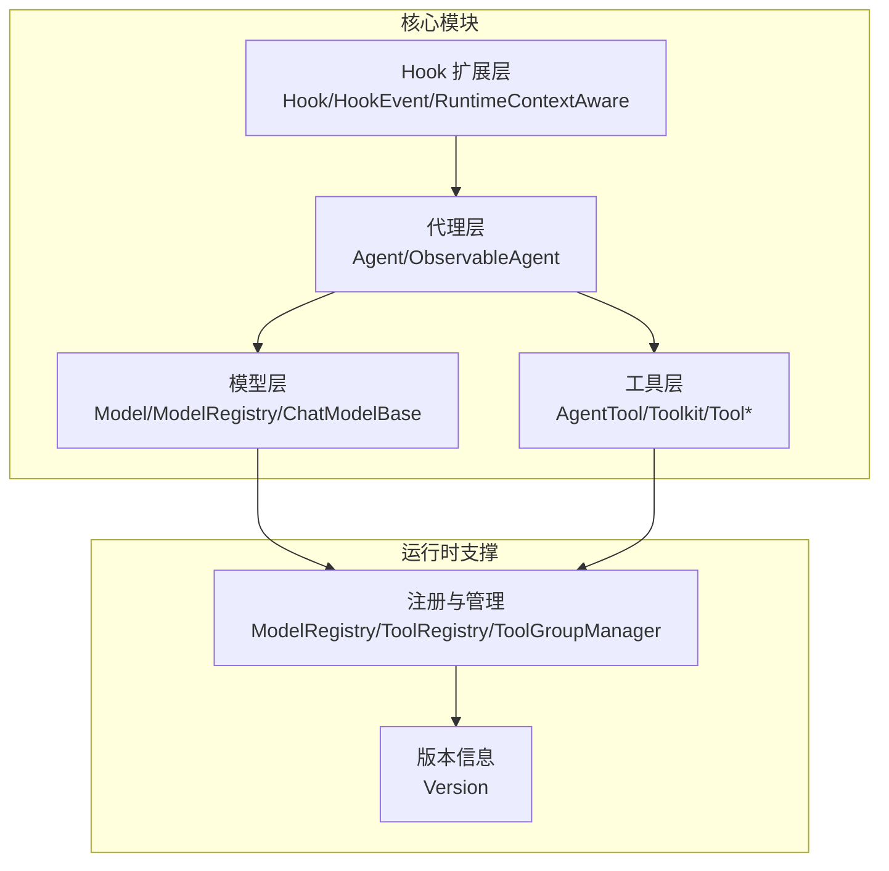
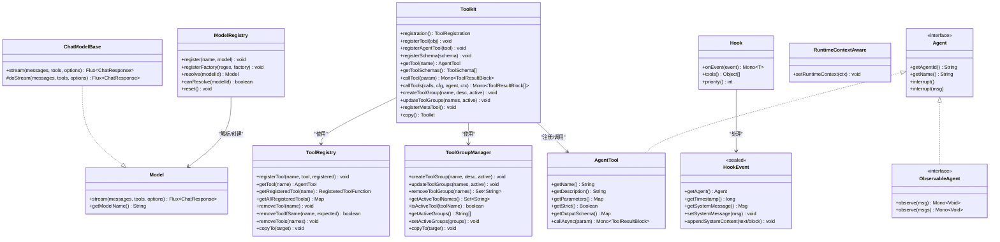
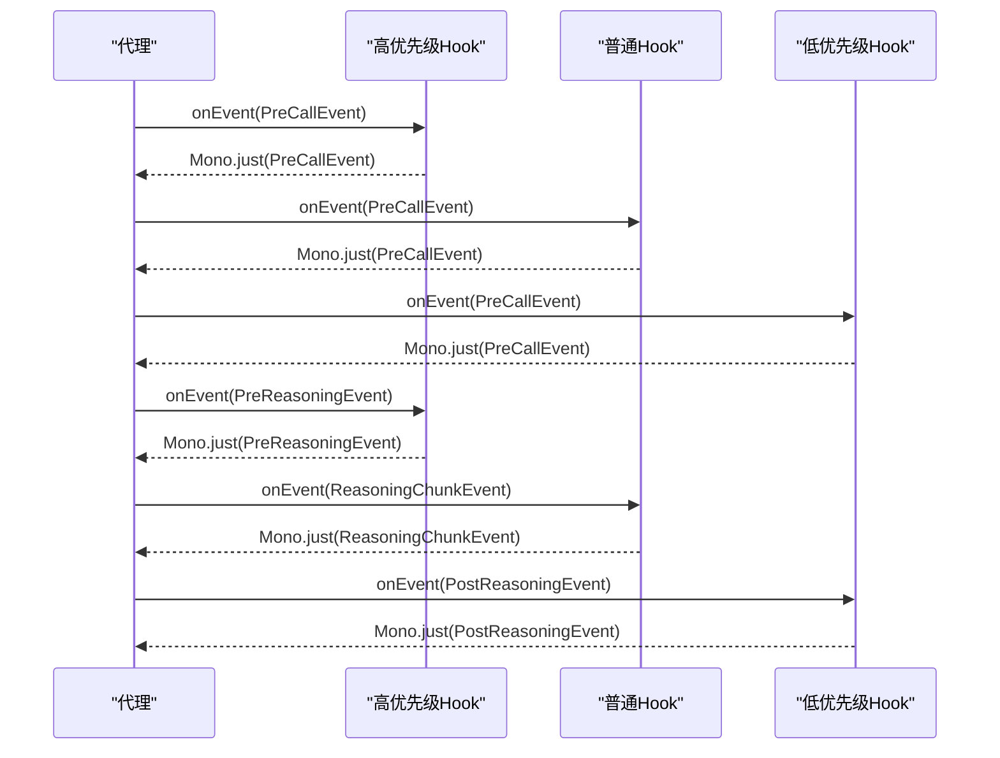
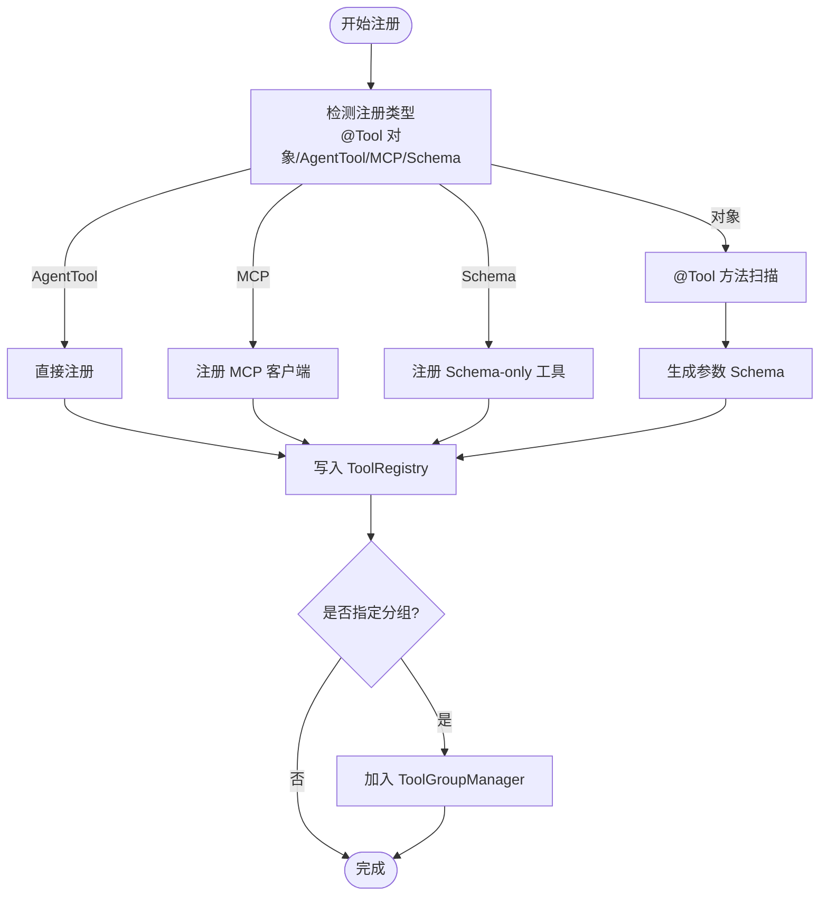
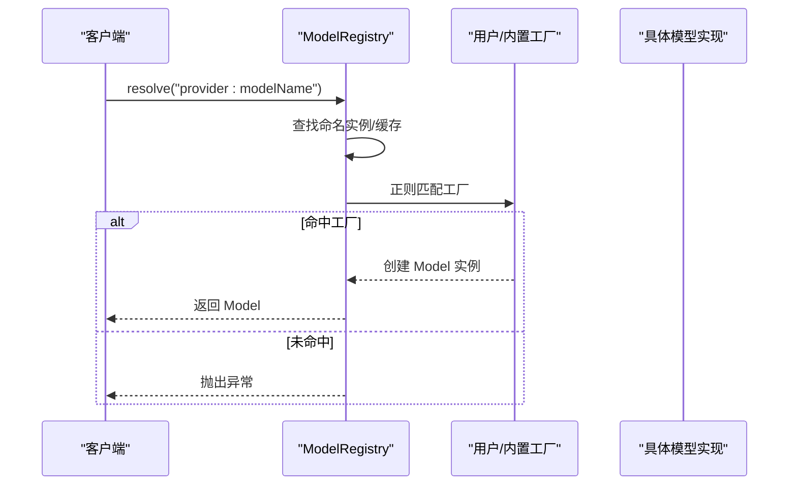
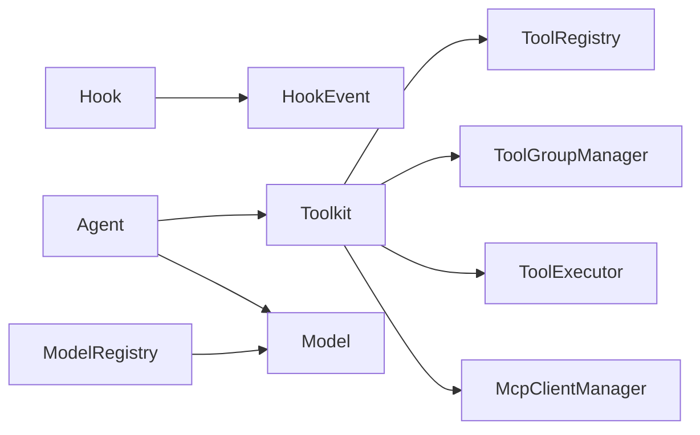

# 可扩展性设计

<cite>
**本文引用的文件**   
- [Version.java](file://agentscope-core/src/main/java/io/agentscope/core/Version.java)
- [ModelRegistry.java](file://agentscope-core/src/main/java/io/agentscope/core/model/ModelRegistry.java)
- [Model.java](file://agentscope-core/src/main/java/io/agentscope/core/model/Model.java)
- [ChatModelBase.java](file://agentscope-core/src/main/java/io/agentscope/core/model/ChatModelBase.java)
- [Tool.java](file://agentscope-core/src/main/java/io/agentscope/core/tool/Tool.java)
- [AgentTool.java](file://agentscope-core/src/main/java/io/agentscope/core/tool/AgentTool.java)
- [Toolkit.java](file://agentscope-core/src/main/java/io/agentscope/core/tool/Toolkit.java)
- [ToolRegistry.java](file://agentscope-core/src/main/java/io/agentscope/core/tool/ToolRegistry.java)
- [ToolGroup.java](file://agentscope-core/src/main/java/io/agentscope/core/tool/ToolGroup.java)
- [ToolGroupManager.java](file://agentscope-core/src/main/java/io/agentscope/core/tool/ToolGroupManager.java)
- [Hook.java](file://agentscope-core/src/main/java/io/agentscope/core/hook/Hook.java)
- [HookEvent.java](file://agentscope-core/src/main/java/io/agentscope/core/hook/HookEvent.java)
- [RuntimeContextAware.java](file://agentscope-core/src/main/java/io/agentscope/core/hook/RuntimeContextAware.java)
- [PendingToolRecoveryHook.java](file://agentscope-core/src/main/java/io/agentscope/core/hook/PendingToolRecoveryHook.java)
- [TTSHook.java](file://agentscope-core/src/main/java/io/agentscope/core/hook/TTSHook.java)
- [ObservableAgent.java](file://agentscope-core/src/main/java/io/agentscope/core/agent/ObservableAgent.java)
- [Agent.java](file://agentscope-core/src/main/java/io/agentscope/core/agent/Agent.java)
</cite>

## 目录
1. [引言](#引言)
2. [项目结构](#项目结构)
3. [核心组件](#核心组件)
4. [架构总览](#架构总览)
5. [详细组件分析](#详细组件分析)
6. [依赖关系分析](#依赖关系分析)
7. [性能考量](#性能考量)
8. [故障排查指南](#故障排查指南)
9. [结论](#结论)
10. [附录](#附录)

## 引言
本设计文档聚焦 AgentScope Java 框架的可扩展性设计，围绕以下主题展开：插件化架构与 SPI 机制、Hook 系统的事件驱动扩展点、工具系统的动态注册与分组管理、模型抽象层对新大模型提供商的接入支持、自定义扩展的开发指南与最佳实践、安全性与性能影响分析，以及通过配置与继承实现业务逻辑定制化的路径。

## 项目结构
AgentScope 采用模块化与分层设计，核心能力由“模型层（Model）”、“工具层（Tool）”、“Hook 扩展层（Hook）”、“代理层（Agent）”等构成，并通过注册表与管理器实现运行时的动态装配与状态持久化。版本信息统一由版本类提供，便于跨模块识别与统计。

图示来源
- [ModelRegistry.java:35-106](file://agentscope-core/src/main/java/io/agentscope/core/model/ModelRegistry.java#L35-L106)
- [Toolkit.java:66-117](file://agentscope-core/src/main/java/io/agentscope/core/tool/Toolkit.java#L66-L117)
- [Hook.java:117-186](file://agentscope-core/src/main/java/io/agentscope/core/hook/Hook.java#L117-L186)
- [Agent.java:41-82](file://agentscope-core/src/main/java/io/agentscope/core/agent/Agent.java#L41-L82)
- [Version.java:24-45](file://agentscope-core/src/main/java/io/agentscope/core/Version.java#L24-L45)

章节来源
- [Version.java:24-45](file://agentscope-core/src/main/java/io/agentscope/core/Version.java#L24-L45)
- [ModelRegistry.java:35-106](file://agentscope-core/src/main/java/io/agentscope/core/model/ModelRegistry.java#L35-L106)
- [Toolkit.java:66-117](file://agentscope-core/src/main/java/io/agentscope/core/tool/Toolkit.java#L66-L117)
- [Hook.java:117-186](file://agentscope-core/src/main/java/io/agentscope/core/hook/Hook.java#L117-L186)
- [Agent.java:41-82](file://agentscope-core/src/main/java/io/agentscope/core/agent/Agent.java#L41-L82)

## 核心组件
- 模型抽象与注册
  - 抽象接口与基类：Model 定义流式对话能力；ChatModelBase 提供统一的追踪包装与流式调用入口。
  - 注册中心：ModelRegistry 支持命名实例、用户工厂、内置规则三类解析路径，具备缓存与优先级控制。
- 工具系统
  - 工具契约：AgentTool 定义名称、描述、参数模式、严格模式、输出模式与异步调用。
  - 工具注册与分组：Toolkit 聚合 ToolRegistry、ToolGroupManager、SchemaProvider、MCP 管理器与执行器，提供动态注册、分组激活、外部工具与元工具等能力。
- Hook 扩展
  - 统一事件模型：Hook 接口以单一 onEvent 方法接收所有事件；HookEvent 为密封类，确保类型安全与穷尽匹配。
  - 运行时上下文：RuntimeContextAware 允许 Hook 在每次调用中注入共享上下文。
- 代理能力
  - 多能力组合：Agent 同时具备可调用、可流式、可观察能力，便于在多智能体协作场景中实现观察与响应。

章节来源
- [Model.java:22-41](file://agentscope-core/src/main/java/io/agentscope/core/model/Model.java#L22-L41)
- [ChatModelBase.java:29-61](file://agentscope-core/src/main/java/io/agentscope/core/model/ChatModelBase.java#L29-L61)
- [ModelRegistry.java:35-260](file://agentscope-core/src/main/java/io/agentscope/core/model/ModelRegistry.java#L35-L260)
- [AgentTool.java:40-119](file://agentscope-core/src/main/java/io/agentscope/core/tool/AgentTool.java#L40-L119)
- [Toolkit.java:66-117](file://agentscope-core/src/main/java/io/agentscope/core/tool/Toolkit.java#L66-L117)
- [Hook.java:117-186](file://agentscope-core/src/main/java/io/agentscope/core/hook/Hook.java#L117-L186)
- [HookEvent.java:74-205](file://agentscope-core/src/main/java/io/agentscope/core/hook/HookEvent.java#L74-L205)
- [RuntimeContextAware.java:30-39](file://agentscope-core/src/main/java/io/agentscope/core/hook/RuntimeContextAware.java#L30-L39)
- [ObservableAgent.java:36-53](file://agentscope-core/src/main/java/io/agentscope/core/agent/ObservableAgent.java#L36-L53)
- [Agent.java:41-82](file://agentscope-core/src/main/java/io/agentscope/core/agent/Agent.java#L41-L82)

## 架构总览
AgentScope 的可扩展性建立在“统一抽象 + 动态注册 + 事件驱动 + 分层管理”的基础上。模型层通过注册中心按需创建具体实现；工具层通过 Toolkit 实现动态注册与分组控制；Hook 层通过事件流对代理生命周期进行拦截与增强；代理层聚合上述能力并对外暴露统一接口。

图示来源
- [Model.java:22-41](file://agentscope-core/src/main/java/io/agentscope/core/model/Model.java#L22-L41)
- [ChatModelBase.java:29-61](file://agentscope-core/src/main/java/io/agentscope/core/model/ChatModelBase.java#L29-L61)
- [ModelRegistry.java:35-260](file://agentscope-core/src/main/java/io/agentscope/core/model/ModelRegistry.java#L35-L260)
- [AgentTool.java:40-119](file://agentscope-core/src/main/java/io/agentscope/core/tool/AgentTool.java#L40-L119)
- [Toolkit.java:66-117](file://agentscope-core/src/main/java/io/agentscope/core/tool/Toolkit.java#L66-L117)
- [ToolRegistry.java:40-156](file://agentscope-core/src/main/java/io/agentscope/core/tool/ToolRegistry.java#L40-L156)
- [ToolGroupManager.java:31-394](file://agentscope-core/src/main/java/io/agentscope/core/tool/ToolGroupManager.java#L31-L394)
- [Hook.java:117-186](file://agentscope-core/src/main/java/io/agentscope/core/hook/Hook.java#L117-L186)
- [HookEvent.java:74-205](file://agentscope-core/src/main/java/io/agentscope/core/hook/HookEvent.java#L74-L205)
- [RuntimeContextAware.java:30-39](file://agentscope-core/src/main/java/io/agentscope/core/hook/RuntimeContextAware.java#L30-L39)
- [Agent.java:41-82](file://agentscope-core/src/main/java/io/agentscope/core/agent/Agent.java#L41-L82)
- [ObservableAgent.java:36-53](file://agentscope-core/src/main/java/io/agentscope/core/agent/ObservableAgent.java#L36-L53)

## 详细组件分析

### 插件化架构与 SPI 机制
- SPI 契约
  - 模型侧：通过 ModelRegistry 的工厂注册与内置规则，实现“提供者前缀 + 模型名”的解析与自动创建，支持 openai、dashscope、gemini、anthropic、ollama 等内置提供者，同时允许用户注册自定义正则工厂优先于内置规则。
  - 工具侧：通过 @Tool 注解扫描与 AgentTool 接口实现，Toolkit 提供统一注册入口与 Schema 生成；同时支持 MCP 客户端与外部 Schema-only 工具。
  - Hook 侧：Hook 接口统一 onEvent 处理，支持 tools() 返回工具集合与 priority() 控制执行顺序。
- 使用方法
  - 模型：通过 ModelRegistry.registerFactory 或直接注册命名实例；在代理或服务中通过 ModelRegistry.resolve 获取实例。
  - 工具：使用 Toolkit.registration().tool(...) 或直接注册 AgentTool；也可注册 Schema-only 工具用于外部执行。
  - Hook：实现 Hook 接口并注册到代理构建器或运行时上下文。

章节来源
- [ModelRegistry.java:35-260](file://agentscope-core/src/main/java/io/agentscope/core/model/ModelRegistry.java#L35-L260)
- [Tool.java:60-133](file://agentscope-core/src/main/java/io/agentscope/core/tool/Tool.java#L60-L133)
- [AgentTool.java:40-119](file://agentscope-core/src/main/java/io/agentscope/core/tool/AgentTool.java#L40-L119)
- [Toolkit.java:146-148](file://agentscope-core/src/main/java/io/agentscope/core/tool/Toolkit.java#L146-L148)
- [Hook.java:117-186](file://agentscope-core/src/main/java/io/agentscope/core/hook/Hook.java#L117-L186)

### Hook 系统的扩展点与事件驱动机制
- 事件模型
  - HookEvent 为密封类，包含 PreCall、PostCall、Reasoning、Acting、Summary、Error 等事件类型；每个事件携带 Agent、时间戳与统一的 systemMsg 字段。
  - Hook 接口以 onEvent 作为唯一入口，返回 Mono<T> 支持异步链式处理；支持修改事件（带 setter）与只读通知事件。
- 生命周期与优先级
  - Hook 按 priority 升序执行，相同优先级按注册顺序；RuntimeContextAware 可在每次调用注入共享上下文。
- 典型扩展
  - PendingToolRecoveryHook：在 PreCall 阶段检测并补全悬挂工具调用结果，保障流程连续性。
  - TTSHook：实时/批量将推理文本转语音，支持本地播放与回调推送，适合多模态交互。

图示来源
- [HookEvent.java:74-205](file://agentscope-core/src/main/java/io/agentscope/core/hook/HookEvent.java#L74-L205)
- [Hook.java:117-186](file://agentscope-core/src/main/java/io/agentscope/core/hook/Hook.java#L117-L186)
- [PendingToolRecoveryHook.java:58-124](file://agentscope-core/src/main/java/io/agentscope/core/hook/PendingToolRecoveryHook.java#L58-L124)
- [TTSHook.java:74-197](file://agentscope-core/src/main/java/io/agentscope/core/hook/TTSHook.java#L74-L197)

章节来源
- [HookEvent.java:74-205](file://agentscope-core/src/main/java/io/agentscope/core/hook/HookEvent.java#L74-L205)
- [Hook.java:117-186](file://agentscope-core/src/main/java/io/agentscope/core/hook/Hook.java#L117-L186)
- [RuntimeContextAware.java:30-39](file://agentscope-core/src/main/java/io/agentscope/core/hook/RuntimeContextAware.java#L30-L39)
- [PendingToolRecoveryHook.java:58-124](file://agentscope-core/src/main/java/io/agentscope/core/hook/PendingToolRecoveryHook.java#L58-L124)
- [TTSHook.java:74-197](file://agentscope-core/src/main/java/io/agentscope/core/hook/TTSHook.java#L74-L197)

### 工具系统的动态注册与工具组管理
- 动态注册
  - 支持对象扫描（含 @Tool 方法）、AgentTool 实例、Schema-only 工具与 MCP 客户端注册；注册时可指定分组、扩展模型与预设参数。
- 工具组策略
  - ToolGroupManager 提供组的创建、激活/停用、成员增删、状态查询与复制；仅激活组内的工具对代理可见与可调用。
- 元工具与外部工具
  - 元工具 reset_equipped_tools 支持运行时动态切换工具组；Schema-only 工具用于外部执行场景，避免框架内部执行。

图示来源
- [Toolkit.java:154-243](file://agentscope-core/src/main/java/io/agentscope/core/tool/Toolkit.java#L154-L243)
- [Toolkit.java:294-324](file://agentscope-core/src/main/java/io/agentscope/core/tool/Toolkit.java#L294-L324)
- [ToolRegistry.java:40-156](file://agentscope-core/src/main/java/io/agentscope/core/tool/ToolRegistry.java#L40-L156)
- [ToolGroupManager.java:47-103](file://agentscope-core/src/main/java/io/agentscope/core/tool/ToolGroupManager.java#L47-L103)

章节来源
- [Toolkit.java:154-243](file://agentscope-core/src/main/java/io/agentscope/core/tool/Toolkit.java#L154-L243)
- [Toolkit.java:294-324](file://agentscope-core/src/main/java/io/agentscope/core/tool/Toolkit.java#L294-L324)
- [ToolRegistry.java:40-156](file://agentscope-core/src/main/java/io/agentscope/core/tool/ToolRegistry.java#L40-L156)
- [ToolGroupManager.java:47-103](file://agentscope-core/src/main/java/io/agentscope/core/tool/ToolGroupManager.java#L47-L103)
- [ToolGroup.java:42-201](file://agentscope-core/src/main/java/io/agentscope/core/tool/ToolGroup.java#L42-L201)

### 模型抽象层对新大模型提供商的接入
- 抽象与基类
  - Model 定义统一的流式对话接口；ChatModelBase 提供统一的 tracing 包装与 doStream 实现入口。
- 注册与解析
  - ModelRegistry 通过 registerFactory 注册正则工厂，优先于内置规则；内置规则覆盖 openai、dashscope、gemini、anthropic、ollama 等。
- 接入步骤
  - 实现 Model 或其子类，按需覆写 doStream；
  - 通过 ModelRegistry.registerFactory 注册工厂，或直接 register 命名实例；
  - 在代理或服务中通过 ModelRegistry.resolve(modelId) 获取实例。

图示来源
- [ModelRegistry.java:142-173](file://agentscope-core/src/main/java/io/agentscope/core/model/ModelRegistry.java#L142-L173)
- [ModelRegistry.java:214-226](file://agentscope-core/src/main/java/io/agentscope/core/model/ModelRegistry.java#L214-L226)
- [ChatModelBase.java:43-48](file://agentscope-core/src/main/java/io/agentscope/core/model/ChatModelBase.java#L43-L48)

章节来源
- [Model.java:22-41](file://agentscope-core/src/main/java/io/agentscope/core/model/Model.java#L22-L41)
- [ChatModelBase.java:29-61](file://agentscope-core/src/main/java/io/agentscope/core/model/ChatModelBase.java#L29-L61)
- [ModelRegistry.java:35-260](file://agentscope-core/src/main/java/io/agentscope/core/model/ModelRegistry.java#L35-L260)

### 自定义扩展的开发指南与最佳实践
- 开发指南
  - Hook：实现 Hook 接口，必要时实现 RuntimeContextAware；通过 priority 控制执行顺序；在 tools() 中返回需要随 Hook 一起注册的工具实例。
  - 工具：实现 AgentTool 或使用 @Tool 注解标注方法；合理设置 name、description、strict 与 converter；通过 Toolkit 注册并按需加入工具组。
  - 模型：继承 ChatModelBase 并实现 doStream；在 ModelRegistry 中注册工厂或命名实例。
- 最佳实践
  - Hook 优先级建议：0-50 关键系统（鉴权、安全），51-100 高优先级（校验、预处理），101-500 正常业务，501-1000 日志与指标。
  - 工具注册：为每个工具提供清晰的描述与严格的参数模式；对外部工具使用 Schema-only 注册。
  - 模型接入：遵循统一 tracing 与错误处理；提供环境变量或配置项以支持密钥与端点配置。

章节来源
- [Hook.java:117-186](file://agentscope-core/src/main/java/io/agentscope/core/hook/Hook.java#L117-L186)
- [RuntimeContextAware.java:30-39](file://agentscope-core/src/main/java/io/agentscope/core/hook/RuntimeContextAware.java#L30-L39)
- [Tool.java:60-133](file://agentscope-core/src/main/java/io/agentscope/core/tool/Tool.java#L60-L133)
- [AgentTool.java:40-119](file://agentscope-core/src/main/java/io/agentscope/core/tool/AgentTool.java#L40-L119)
- [ChatModelBase.java:29-61](file://agentscope-core/src/main/java/io/agentscope/core/model/ChatModelBase.java#L29-L61)
- [ModelRegistry.java:35-260](file://agentscope-core/src/main/java/io/agentscope/core/model/ModelRegistry.java#L35-L260)

### 安全性考虑与性能影响分析
- 安全性
  - Hook 优先级与执行顺序：将鉴权、审计等关键 Hook 设置在较高优先级，避免被后续 Hook 覆盖。
  - 工具参数与结果转换：通过 @Tool.converter 自定义 ToolResultConverter，过滤敏感数据与压缩大输出。
  - 外部工具：Schema-only 工具不被框架内部执行，降低误执行风险。
- 性能
  - 工具执行：Toolkit 支持并行/串行执行与超时重试配置；合理设置并发度与回调链路以减少阻塞。
  - Hook 链路：避免在 onEvent 中进行重型同步操作；使用 Mono 异步链路与背压策略。
  - 模型调用：统一 tracing 与流式处理，减少不必要的中间对象创建。

章节来源
- [Hook.java:173-185](file://agentscope-core/src/main/java/io/agentscope/core/hook/Hook.java#L173-L185)
- [Tool.java:100-132](file://agentscope-core/src/main/java/io/agentscope/core/tool/Tool.java#L100-L132)
- [Toolkit.java:510-524](file://agentscope-core/src/main/java/io/agentscope/core/tool/Toolkit.java#L510-L524)
- [ChatModelBase.java:43-48](file://agentscope-core/src/main/java/io/agentscope/core/model/ChatModelBase.java#L43-L48)

### 通过配置与继承实现业务定制化
- 配置
  - 工具层：ToolkitConfig 支持执行配置、并行策略、删除开关与预设参数更新；通过 registration() 流式配置工具组、MCP 客户端与预设参数。
  - 模型层：通过环境变量或配置项注入 API Key 与端点；ModelRegistry 内置多提供商解析规则。
- 继承
  - 模型：继承 ChatModelBase 并实现 doStream，复用 tracing 与统一流式处理。
  - Hook：继承或组合现有 Hook 实现，利用系统消息注入与事件修改能力。

章节来源
- [Toolkit.java:146-148](file://agentscope-core/src/main/java/io/agentscope/core/tool/Toolkit.java#L146-L148)
- [Toolkit.java:510-524](file://agentscope-core/src/main/java/io/agentscope/core/tool/Toolkit.java#L510-L524)
- [ModelRegistry.java:43-106](file://agentscope-core/src/main/java/io/agentscope/core/model/ModelRegistry.java#L43-L106)
- [ChatModelBase.java:29-61](file://agentscope-core/src/main/java/io/agentscope/core/model/ChatModelBase.java#L29-L61)

## 依赖关系分析
- 组件耦合
  - Toolkit 对 ToolRegistry、ToolGroupManager、SchemaProvider、MCP 管理器与执行器存在强依赖，体现“门面 + 管理器”的分层设计。
  - Hook 与 HookEvent 之间为单向依赖，事件类型受密封类约束，保证类型安全。
  - Model 与 ModelRegistry 为“解析/创建”关系，支持多提供商与用户自定义工厂。
- 外部集成
  - 版本信息通过 Version 统一提供，便于跨模块识别与统计。

图示来源
- [Toolkit.java:66-117](file://agentscope-core/src/main/java/io/agentscope/core/tool/Toolkit.java#L66-L117)
- [Hook.java:117-186](file://agentscope-core/src/main/java/io/agentscope/core/hook/Hook.java#L117-L186)
- [HookEvent.java:74-205](file://agentscope-core/src/main/java/io/agentscope/core/hook/HookEvent.java#L74-L205)
- [ModelRegistry.java:35-260](file://agentscope-core/src/main/java/io/agentscope/core/model/ModelRegistry.java#L35-L260)
- [Agent.java:41-82](file://agentscope-core/src/main/java/io/agentscope/core/agent/Agent.java#L41-L82)

章节来源
- [Toolkit.java:66-117](file://agentscope-core/src/main/java/io/agentscope/core/tool/Toolkit.java#L66-L117)
- [Hook.java:117-186](file://agentscope-core/src/main/java/io/agentscope/core/hook/Hook.java#L117-L186)
- [ModelRegistry.java:35-260](file://agentscope-core/src/main/java/io/agentscope/core/model/ModelRegistry.java#L35-L260)
- [Agent.java:41-82](file://agentscope-core/src/main/java/io/agentscope/core/agent/Agent.java#L41-L82)

## 性能考量
- 异步与背压：Hook 与工具调用均基于 Reactor，建议在回调链路中使用合适的调度器与背压策略。
- 缓存与解析：ModelRegistry 对已创建实例进行缓存，减少重复创建开销；工具注册采用并发容器，支持高并发注册与查找。
- 执行策略：Toolkit 支持并行/串行执行与超时重试配置，应根据业务场景调整以平衡吞吐与延迟。

章节来源
- [Hook.java:147](file://agentscope-core/src/main/java/io/agentscope/core/hook/Hook.java#L147)
- [Toolkit.java:510-524](file://agentscope-core/src/main/java/io/agentscope/core/tool/Toolkit.java#L510-L524)
- [ModelRegistry.java:41-42](file://agentscope-core/src/main/java/io/agentscope/core/model/ModelRegistry.java#L41-L42)

## 故障排查指南
- 模型解析失败
  - 检查 ModelRegistry.canResolve 与错误提示，确认命名实例、工厂正则与内置规则是否匹配；核对环境变量与 API Key。
- 工具不可见或无法调用
  - 检查工具组激活状态与 ToolGroupManager 的 isGroupedTool/isActiveTool；确认 Schema 生成与预设参数。
- Hook 未生效或顺序异常
  - 检查 priority 设置与注册顺序；确认 RuntimeContext 是否正确注入；避免在事件中直接修改输入消息列表导致系统消息冲突。
- 悬挂工具调用
  - 使用 PendingToolRecoveryHook 自动补全缺失的结果；检查内存中的 ToolUseBlock 与 ToolResultBlock 匹配情况。

章节来源
- [ModelRegistry.java:179-191](file://agentscope-core/src/main/java/io/agentscope/core/model/ModelRegistry.java#L179-L191)
- [ModelRegistry.java:244-258](file://agentscope-core/src/main/java/io/agentscope/core/model/ModelRegistry.java#L244-L258)
- [ToolGroupManager.java:231-245](file://agentscope-core/src/main/java/io/agentscope/core/tool/ToolGroupManager.java#L231-L245)
- [Hook.java:173-185](file://agentscope-core/src/main/java/io/agentscope/core/hook/Hook.java#L173-L185)
- [RuntimeContextAware.java:30-39](file://agentscope-core/src/main/java/io/agentscope/core/hook/RuntimeContextAware.java#L30-L39)
- [PendingToolRecoveryHook.java:84-124](file://agentscope-core/src/main/java/io/agentscope/core/hook/PendingToolRecoveryHook.java#L84-L124)

## 结论
AgentScope Java 框架通过统一抽象、动态注册与事件驱动扩展，实现了高度可扩展的插件化架构。模型层、工具层与 Hook 层分别提供明确的扩展点，配合分层管理器与配置策略，既满足多提供商接入与工具动态编排的需求，又兼顾安全性与性能。开发者可基于本文档的指南与最佳实践，快速实现定制化扩展并安全高效地集成到业务系统中。

## 附录
- 版本信息：统一 User-Agent 字符串，便于识别与统计。
  
章节来源
- [Version.java:24-45](file://agentscope-core/src/main/java/io/agentscope/core/Version.java#L24-L45)