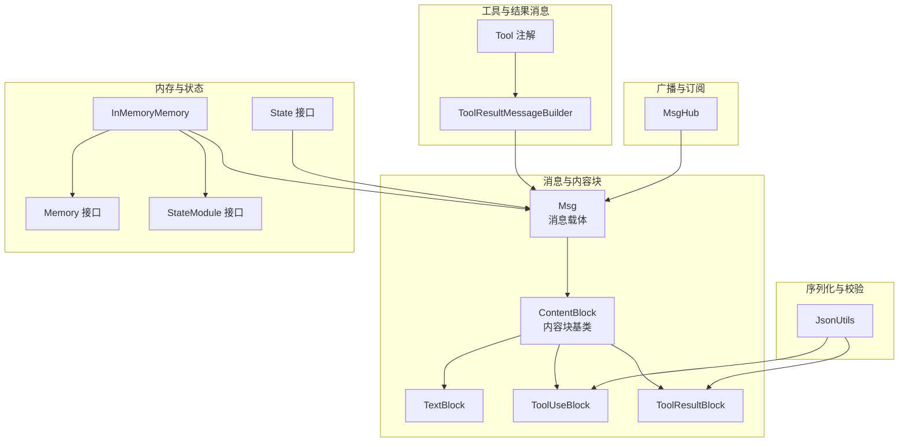
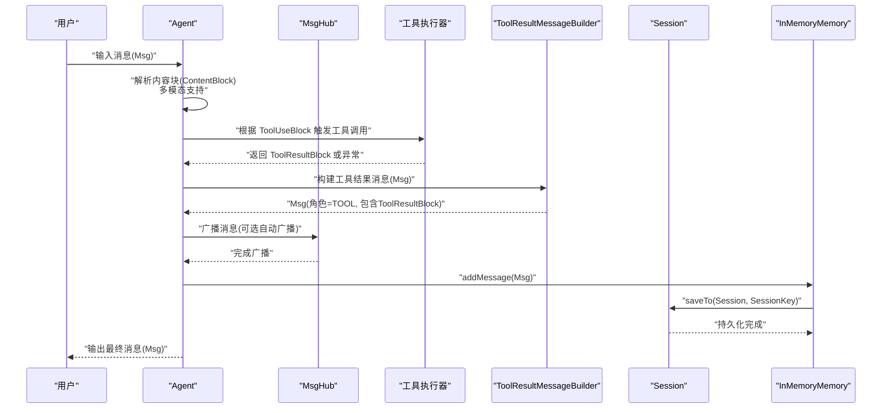
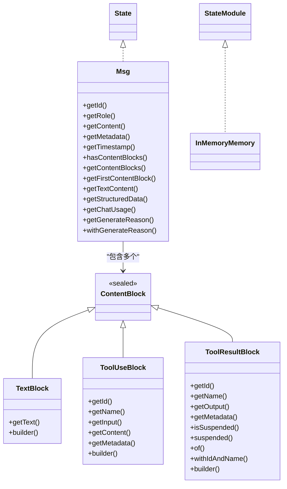
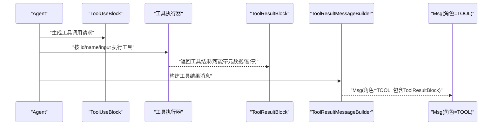
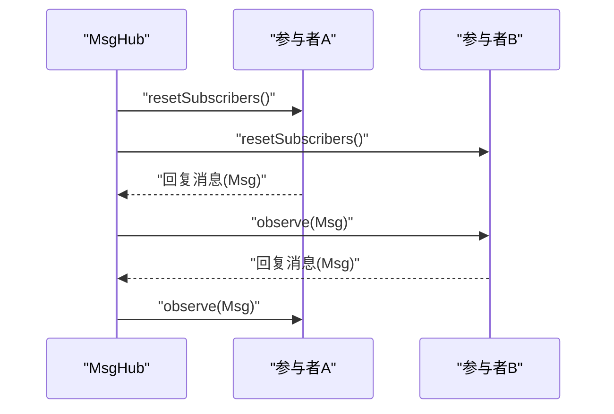
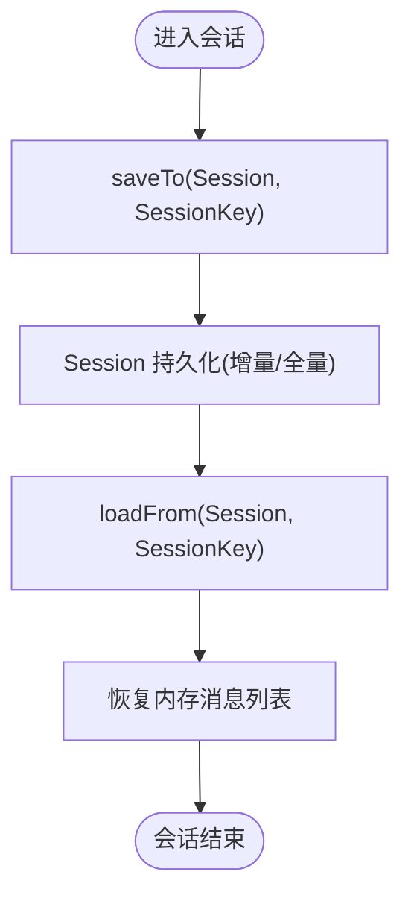
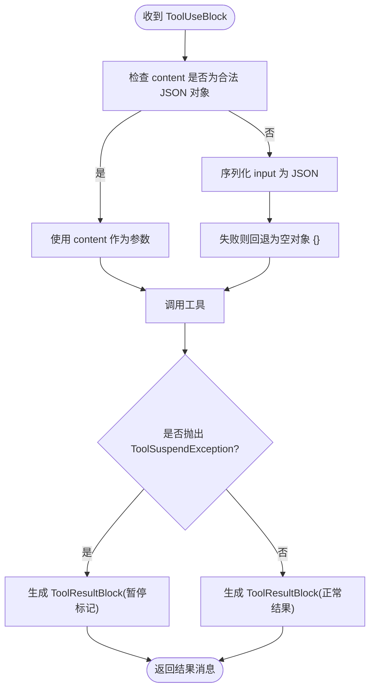
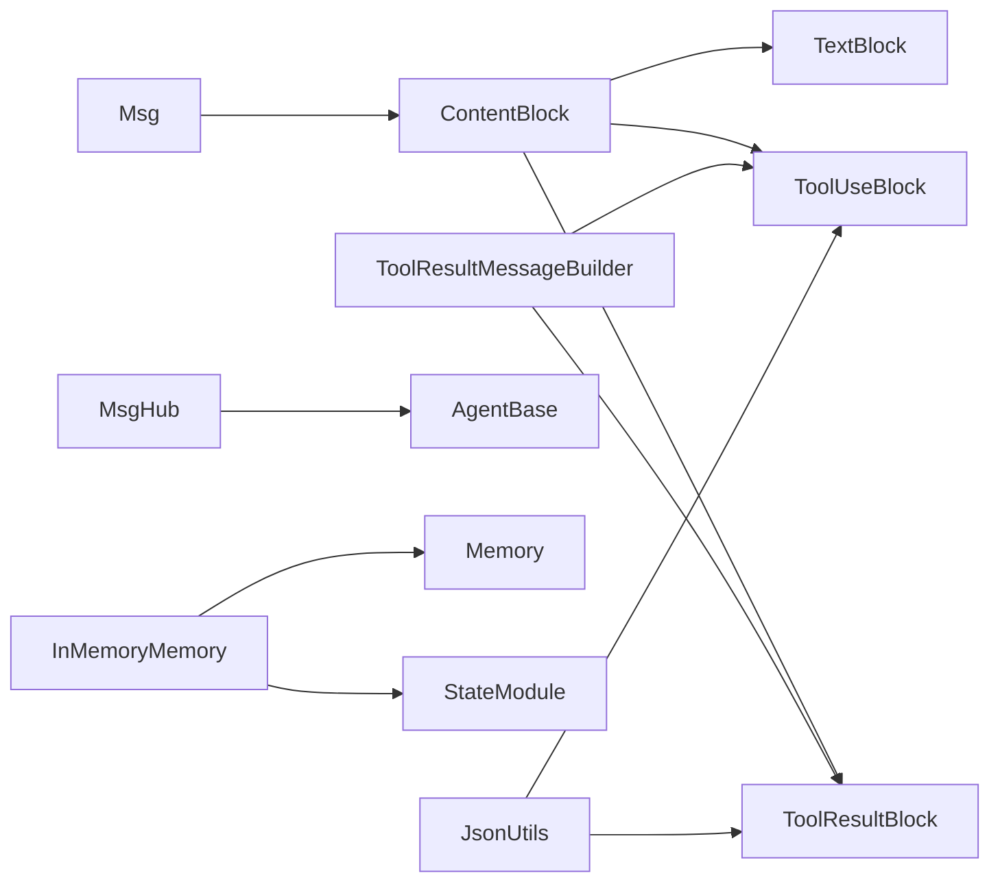

# 数据流架构

<cite>
**本文引用的文件**
- [agentscope-core/src/main/java/io/agentscope/core/message/Msg.java](file://agentscope-core/src/main/java/io/agentscope/core/message/Msg.java)
- [agentscope-core/src/main/java/io/agentscope/core/message/ContentBlock.java](file://agentscope-core/src/main/java/io/agentscope/core/message/ContentBlock.java)
- [agentscope-core/src/main/java/io/agentscope/core/message/TextBlock.java](file://agentscope-core/src/main/java/io/agentscope/core/message/TextBlock.java)
- [agentscope-core/src/main/java/io/agentscope/core/message/ToolUseBlock.java](file://agentscope-core/src/main/java/io/agentscope/core/message/ToolUseBlock.java)
- [agentscope-core/src/main/java/io/agentscope/core/message/ToolResultBlock.java](file://agentscope-core/src/main/java/io/agentscope/core/message/ToolResultBlock.java)
- [agentscope-core/src/main/java/io/agentscope/core/message/MessageMetadataKeys.java](file://agentscope-core/src/main/java/io/agentscope/core/message/MessageMetadataKeys.java)
- [agentscope-core/src/main/java/io/agentscope/core/model/ChatUsage.java](file://agentscope-core/src/main/java/io/agentscope/core/model/ChatUsage.java)
- [agentscope-core/src/main/java/io/agentscope/core/tool/ToolResultMessageBuilder.java](file://agentscope-core/src/main/java/io/agentscope/core/tool/ToolResultMessageBuilder.java)
- [agentscope-core/src/main/java/io/agentscope/core/pipeline/MsgHub.java](file://agentscope-core/src/main/java/io/agentscope/core/pipeline/MsgHub.java)
- [agentscope-core/src/main/java/io/agentscope/core/memory/Memory.java](file://agentscope-core/src/main/java/io/agentscope/core/memory/Memory.java)
- [agentscope-core/src/main/java/io/agentscope/core/memory/InMemoryMemory.java](file://agentscope-core/src/main/java/io/agentscope/core/memory/InMemoryMemory.java)
- [agentscope-core/src/main/java/io/agentscope/core/state/State.java](file://agentscope-core/src/main/java/io/agentscope/core/state/State.java)
- [agentscope-core/src/main/java/io/agentscope/core/state/StateModule.java](file://agentscope-core/src/main/java/io/agentscope/core/state/StateModule.java)
- [agentscope-core/src/main/java/io/agentscope/core/util/JsonUtils.java](file://agentscope-core/src/main/java/io/agentscope/core/util/JsonUtils.java)
- [agentscope-core/src/main/java/io/agentscope/core/tool/Tool.java](file://agentscope-core/src/main/java/io/agentscope/core/tool/Tool.java)
</cite>

## 目录
1. [引言](#引言)
2. [项目结构](#项目结构)
3. [核心组件](#核心组件)
4. [架构总览](#架构总览)
5. [详细组件分析](#详细组件分析)
6. [依赖分析](#依赖分析)
7. [性能考虑](#性能考虑)
8. [故障排查指南](#故障排查指南)
9. [结论](#结论)
10. [附录](#附录)

## 引言
本文件面向 AgentScope Java 框架，系统性梳理“消息在系统中的流转路径”，从输入消息到最终输出的完整数据处理流程；解释 Msg 对象的结构设计与 ContentBlock 多模态支持；阐述工具调用产生的数据转换过程（ToolResultBlock 的生成与传递）；说明内存系统的数据持久化策略与状态同步机制；并提供数据流图与状态转换图，覆盖典型场景下的数据变化过程。同时总结数据验证、类型转换与错误处理的设计要点。

## 项目结构
AgentScope 的数据流核心由以下模块构成：
- 消息与内容块：Msg、ContentBlock 及其子类（TextBlock、ToolUseBlock、ToolResultBlock 等）
- 工具与结果消息构建：Tool 注解、ToolResultMessageBuilder
- 广播与订阅：MsgHub（多智能体消息共享）
- 内存与状态：Memory 接口及 InMemoryMemory 实现、State/StateModule 标记接口
- 序列化与校验：JsonUtils（JSON 编解码与工具调用参数解析）

**图表来源**
- [agentscope-core/src/main/java/io/agentscope/core/message/Msg.java:53-654](file://agentscope-core/src/main/java/io/agentscope/core/message/Msg.java#L53-L654)
- [agentscope-core/src/main/java/io/agentscope/core/message/ContentBlock.java:54-61](file://agentscope-core/src/main/java/io/agentscope/core/message/ContentBlock.java#L54-L61)
- [agentscope-core/src/main/java/io/agentscope/core/message/TextBlock.java:31-95](file://agentscope-core/src/main/java/io/agentscope/core/message/TextBlock.java#L31-L95)
- [agentscope-core/src/main/java/io/agentscope/core/message/ToolUseBlock.java:34-233](file://agentscope-core/src/main/java/io/agentscope/core/message/ToolUseBlock.java#L34-L233)
- [agentscope-core/src/main/java/io/agentscope/core/message/ToolResultBlock.java:35-374](file://agentscope-core/src/main/java/io/agentscope/core/message/ToolResultBlock.java#L35-L374)
- [agentscope-core/src/main/java/io/agentscope/core/tool/ToolResultMessageBuilder.java:30-52](file://agentscope-core/src/main/java/io/agentscope/core/tool/ToolResultMessageBuilder.java#L30-L52)
- [agentscope-core/src/main/java/io/agentscope/core/pipeline/MsgHub.java:100-434](file://agentscope-core/src/main/java/io/agentscope/core/pipeline/MsgHub.java#L100-L434)
- [agentscope-core/src/main/java/io/agentscope/core/memory/Memory.java:29-62](file://agentscope-core/src/main/java/io/agentscope/core/memory/Memory.java#L29-L62)
- [agentscope-core/src/main/java/io/agentscope/core/memory/InMemoryMemory.java:33-127](file://agentscope-core/src/main/java/io/agentscope/core/memory/InMemoryMemory.java#L33-L127)
- [agentscope-core/src/main/java/io/agentscope/core/state/State.java:18-47](file://agentscope-core/src/main/java/io/agentscope/core/state/State.java#L18-L47)
- [agentscope-core/src/main/java/io/agentscope/core/state/StateModule.java:45-120](file://agentscope-core/src/main/java/io/agentscope/core/state/StateModule.java#L45-L120)
- [agentscope-core/src/main/java/io/agentscope/core/util/JsonUtils.java:49-152](file://agentscope-core/src/main/java/io/agentscope/core/util/JsonUtils.java#L49-L152)
- [agentscope-core/src/main/java/io/agentscope/core/tool/Tool.java:60-133](file://agentscope-core/src/main/java/io/agentscope/core/tool/Tool.java#L60-L133)

**章节来源**
- [agentscope-core/src/main/java/io/agentscope/core/message/Msg.java:53-654](file://agentscope-core/src/main/java/io/agentscope/core/message/Msg.java#L53-L654)
- [agentscope-core/src/main/java/io/agentscope/core/pipeline/MsgHub.java:100-434](file://agentscope-core/src/main/java/io/agentscope/core/pipeline/MsgHub.java#L100-L434)

## 核心组件
- Msg：消息载体，封装角色、内容块列表、元数据与时间戳，并提供结构化数据提取、文本拼接、用量统计与生成原因等便捷方法。
- ContentBlock 及其实现：以密封类形式定义内容块层次，支持文本、思考、图像、音频、视频、工具调用与工具结果等多模态内容。
- ToolUseBlock/ToolResultBlock：工具调用请求与结果的消息内容块，支持带元数据的暂停标记、外部执行提示与多内容块输出。
- ToolResultMessageBuilder：将工具结果转换为 Msg（角色为工具），自动填充 id 与 name。
- MsgHub：多智能体消息共享与自动广播，简化订阅与观察者模式。
- Memory/InMemoryMemory：会话历史存储接口与内存实现，支持保存/加载与线程安全读写。
- State/StateModule：可持久化状态标记接口与会话存取协议。
- JsonUtils：全局 JSON 编解码器访问与工具调用参数解析（保障参数为合法 JSON 对象）。

**章节来源**
- [agentscope-core/src/main/java/io/agentscope/core/message/Msg.java:53-654](file://agentscope-core/src/main/java/io/agentscope/core/message/Msg.java#L53-L654)
- [agentscope-core/src/main/java/io/agentscope/core/message/ContentBlock.java:54-61](file://agentscope-core/src/main/java/io/agentscope/core/message/ContentBlock.java#L54-L61)
- [agentscope-core/src/main/java/io/agentscope/core/message/ToolUseBlock.java:34-233](file://agentscope-core/src/main/java/io/agentscope/core/message/ToolUseBlock.java#L34-L233)
- [agentscope-core/src/main/java/io/agentscope/core/message/ToolResultBlock.java:35-374](file://agentscope-core/src/main/java/io/agentscope/core/message/ToolResultBlock.java#L35-L374)
- [agentscope-core/src/main/java/io/agentscope/core/tool/ToolResultMessageBuilder.java:30-52](file://agentscope-core/src/main/java/io/agentscope/core/tool/ToolResultMessageBuilder.java#L30-L52)
- [agentscope-core/src/main/java/io/agentscope/core/pipeline/MsgHub.java:100-434](file://agentscope-core/src/main/java/io/agentscope/core/pipeline/MsgHub.java#L100-L434)
- [agentscope-core/src/main/java/io/agentscope/core/memory/Memory.java:29-62](file://agentscope-core/src/main/java/io/agentscope/core/memory/Memory.java#L29-L62)
- [agentscope-core/src/main/java/io/agentscope/core/memory/InMemoryMemory.java:33-127](file://agentscope-core/src/main/java/io/agentscope/core/memory/InMemoryMemory.java#L33-L127)
- [agentscope-core/src/main/java/io/agentscope/core/state/State.java:18-47](file://agentscope-core/src/main/java/io/agentscope/core/state/State.java#L18-L47)
- [agentscope-core/src/main/java/io/agentscope/core/state/StateModule.java:45-120](file://agentscope-core/src/main/java/io/agentscope/core/state/StateModule.java#L45-L120)
- [agentscope-core/src/main/java/io/agentscope/core/util/JsonUtils.java:49-152](file://agentscope-core/src/main/java/io/agentscope/core/util/JsonUtils.java#L49-L152)

## 架构总览
下图展示了从输入消息到最终输出的端到端数据流，涵盖多模态内容、工具调用与结果、广播分发、内存持久化与状态恢复等关键环节。

**图表来源**
- [agentscope-core/src/main/java/io/agentscope/core/pipeline/MsgHub.java:282-295](file://agentscope-core/src/main/java/io/agentscope/core/pipeline/MsgHub.java#L282-L295)
- [agentscope-core/src/main/java/io/agentscope/core/tool/ToolResultMessageBuilder.java:40-51](file://agentscope-core/src/main/java/io/agentscope/core/tool/ToolResultMessageBuilder.java#L40-L51)
- [agentscope-core/src/main/java/io/agentscope/core/memory/InMemoryMemory.java:57-74](file://agentscope-core/src/main/java/io/agentscope/core/memory/InMemoryMemory.java#L57-L74)
- [agentscope-core/src/main/java/io/agentscope/core/message/Msg.java:53-654](file://agentscope-core/src/main/java/io/agentscope/core/message/Msg.java#L53-L654)

## 详细组件分析

### 消息与内容块：Msg 与 ContentBlock 层次
- Msg 设计要点
  - 不可变字段（ID、角色、内容块列表、元数据、时间戳）保证线程安全与可追踪性
  - 提供类型安全的内容块筛选与首个匹配项获取
  - 支持结构化数据提取（POJO/Map）与文本拼接
  - 元数据中可携带用量统计（ChatUsage）、生成原因（GenerateReason）等
- ContentBlock 密封类层次
  - 通过 Jackson 多态序列化（type 字段）实现统一序列化/反序列化
  - 子类包括 TextBlock、ToolUseBlock、ToolResultBlock 等，覆盖多模态与工具交互
- TextBlock：最基础文本内容块，提供 builder 与 toString 便捷方法
- ToolUseBlock：工具调用请求，包含 id/name/input/content/metadata
- ToolResultBlock：工具执行结果，支持 id/name/output/metadata，以及暂停标记与多种构造方式

**图表来源**
- [agentscope-core/src/main/java/io/agentscope/core/message/Msg.java:53-654](file://agentscope-core/src/main/java/io/agentscope/core/message/Msg.java#L53-L654)
- [agentscope-core/src/main/java/io/agentscope/core/message/ContentBlock.java:54-61](file://agentscope-core/src/main/java/io/agentscope/core/message/ContentBlock.java#L54-L61)
- [agentscope-core/src/main/java/io/agentscope/core/message/TextBlock.java:31-95](file://agentscope-core/src/main/java/io/agentscope/core/message/TextBlock.java#L31-L95)
- [agentscope-core/src/main/java/io/agentscope/core/message/ToolUseBlock.java:34-233](file://agentscope-core/src/main/java/io/agentscope/core/message/ToolUseBlock.java#L34-L233)
- [agentscope-core/src/main/java/io/agentscope/core/message/ToolResultBlock.java:35-374](file://agentscope-core/src/main/java/io/agentscope/core/message/ToolResultBlock.java#L35-L374)
- [agentscope-core/src/main/java/io/agentscope/core/state/State.java:18-47](file://agentscope-core/src/main/java/io/agentscope/core/state/State.java#L18-L47)
- [agentscope-core/src/main/java/io/agentscope/core/state/StateModule.java:45-120](file://agentscope-core/src/main/java/io/agentscope/core/state/StateModule.java#L45-L120)

**章节来源**
- [agentscope-core/src/main/java/io/agentscope/core/message/Msg.java:53-654](file://agentscope-core/src/main/java/io/agentscope/core/message/Msg.java#L53-L654)
- [agentscope-core/src/main/java/io/agentscope/core/message/ContentBlock.java:54-61](file://agentscope-core/src/main/java/io/agentscope/core/message/ContentBlock.java#L54-L61)
- [agentscope-core/src/main/java/io/agentscope/core/message/TextBlock.java:31-95](file://agentscope-core/src/main/java/io/agentscope/core/message/TextBlock.java#L31-L95)
- [agentscope-core/src/main/java/io/agentscope/core/message/ToolUseBlock.java:34-233](file://agentscope-core/src/main/java/io/agentscope/core/message/ToolUseBlock.java#L34-L233)
- [agentscope-core/src/main/java/io/agentscope/core/message/ToolResultBlock.java:35-374](file://agentscope-core/src/main/java/io/agentscope/core/message/ToolResultBlock.java#L35-L374)

### 工具调用与结果消息构建
- 工具调用触发：Agent 在推理或规划阶段生成 ToolUseBlock，作为 Msg 的内容块之一
- 工具执行：框架根据 ToolUseBlock 的 id/name 与 input 调用注册的工具方法
- 结果封装：ToolResultBlock 表示工具执行结果，支持单个或多个内容块输出，可携带元数据
- 结果消息：ToolResultMessageBuilder 将 ToolResultBlock 转换为 Msg（角色=TOOL），并设置 id 与 name 与原始调用一致

**图表来源**
- [agentscope-core/src/main/java/io/agentscope/core/message/ToolUseBlock.java:34-233](file://agentscope-core/src/main/java/io/agentscope/core/message/ToolUseBlock.java#L34-L233)
- [agentscope-core/src/main/java/io/agentscope/core/message/ToolResultBlock.java:35-374](file://agentscope-core/src/main/java/io/agentscope/core/message/ToolResultBlock.java#L35-L374)
- [agentscope-core/src/main/java/io/agentscope/core/tool/ToolResultMessageBuilder.java:40-51](file://agentscope-core/src/main/java/io/agentscope/core/tool/ToolResultMessageBuilder.java#L40-L51)

**章节来源**
- [agentscope-core/src/main/java/io/agentscope/core/tool/ToolResultMessageBuilder.java:30-52](file://agentscope-core/src/main/java/io/agentscope/core/tool/ToolResultMessageBuilder.java#L30-L52)
- [agentscope-core/src/main/java/io/agentscope/core/message/ToolUseBlock.java:34-233](file://agentscope-core/src/main/java/io/agentscope/core/message/ToolUseBlock.java#L34-L233)
- [agentscope-core/src/main/java/io/agentscope/core/message/ToolResultBlock.java:35-374](file://agentscope-core/src/main/java/io/agentscope/core/message/ToolResultBlock.java#L35-L374)

### 广播与订阅：MsgHub
- 自动广播：当启用时，参与者回复的消息会被自动广播给其他参与者
- 动态参与者：运行时可添加/移除参与者，自动重置订阅关系
- 生命周期：enter()/exit() 或 AutoCloseable 管理订阅与清理
- 手动广播：也可手动调用 broadcast() 发送消息

**图表来源**
- [agentscope-core/src/main/java/io/agentscope/core/pipeline/MsgHub.java:323-333](file://agentscope-core/src/main/java/io/agentscope/core/pipeline/MsgHub.java#L323-L333)
- [agentscope-core/src/main/java/io/agentscope/core/pipeline/MsgHub.java:282-295](file://agentscope-core/src/main/java/io/agentscope/core/pipeline/MsgHub.java#L282-L295)

**章节来源**
- [agentscope-core/src/main/java/io/agentscope/core/pipeline/MsgHub.java:100-434](file://agentscope-core/src/main/java/io/agentscope/core/pipeline/MsgHub.java#L100-L434)

### 内存系统与状态持久化
- Memory 接口：定义 addMessage/getMessages/deleteMessage/clear
- InMemoryMemory：基于线程安全列表的内存实现，支持保存/加载到 Session
- State/StateModule：标记接口与会话存取协议，支持 saveTo/loadFrom/loadIfExists
- 持久化策略：InMemoryMemory 总是保存全量消息列表，Session 实现负责增量存储（如 JsonSession 基于行数增量）

**图表来源**
- [agentscope-core/src/main/java/io/agentscope/core/memory/InMemoryMemory.java:57-74](file://agentscope-core/src/main/java/io/agentscope/core/memory/InMemoryMemory.java#L57-L74)
- [agentscope-core/src/main/java/io/agentscope/core/state/StateModule.java:56-93](file://agentscope-core/src/main/java/io/agentscope/core/state/StateModule.java#L56-L93)

**章节来源**
- [agentscope-core/src/main/java/io/agentscope/core/memory/Memory.java:29-62](file://agentscope-core/src/main/java/io/agentscope/core/memory/Memory.java#L29-L62)
- [agentscope-core/src/main/java/io/agentscope/core/memory/InMemoryMemory.java:33-127](file://agentscope-core/src/main/java/io/agentscope/core/memory/InMemoryMemory.java#L33-L127)
- [agentscope-core/src/main/java/io/agentscope/core/state/StateModule.java:45-120](file://agentscope-core/src/main/java/io/agentscope/core/state/StateModule.java#L45-L120)

### 数据验证、类型转换与错误处理
- JSON 参数解析：JsonUtils.resolveToolCallArgsJson 优先使用 ToolUseBlock.content（若为合法 JSON 对象），否则序列化 input；失败回退空对象，避免发送非法 JSON
- 类型转换：Msg.getStructuredData 支持 POJO 与 Map 两种提取方式，内部通过 JsonCodec 完成转换
- 错误处理：ToolResultBlock.suspended 将 ToolSuspendException 转换为带暂停标记的结果；JsonUtils.isValidJsonObject 防止非对象 JSON 传入模型

**图表来源**
- [agentscope-core/src/main/java/io/agentscope/core/util/JsonUtils.java:133-151](file://agentscope-core/src/main/java/io/agentscope/core/util/JsonUtils.java#L133-L151)
- [agentscope-core/src/main/java/io/agentscope/core/message/ToolResultBlock.java:139-159](file://agentscope-core/src/main/java/io/agentscope/core/message/ToolResultBlock.java#L139-L159)

**章节来源**
- [agentscope-core/src/main/java/io/agentscope/core/util/JsonUtils.java:49-152](file://agentscope-core/src/main/java/io/agentscope/core/util/JsonUtils.java#L49-L152)
- [agentscope-core/src/main/java/io/agentscope/core/message/ToolResultBlock.java:115-159](file://agentscope-core/src/main/java/io/agentscope/core/message/ToolResultBlock.java#L115-L159)

## 依赖分析
- 组件耦合
  - Msg 依赖 ContentBlock 及其子类，具备强类型内容块集合
  - ToolResultMessageBuilder 依赖 ToolUseBlock 与 ToolResultBlock，用于结果消息构建
  - MsgHub 依赖 AgentBase 的 observe/resetSubscribers/removeSubscribers，实现广播与订阅
  - InMemoryMemory 实现 Memory 并遵循 StateModule 协议，与 Session 进行状态交换
  - JsonUtils 为 ToolUseBlock/ToolResultBlock 提供 JSON 解析与校验能力
- 外部依赖
  - Jackson（通过 JsonCodec/JacksonJsonCodec）用于序列化/反序列化
  - Reactor（Flux/Mono）用于异步消息广播与生命周期管理

**图表来源**
- [agentscope-core/src/main/java/io/agentscope/core/tool/ToolResultMessageBuilder.java:30-52](file://agentscope-core/src/main/java/io/agentscope/core/tool/ToolResultMessageBuilder.java#L30-L52)
- [agentscope-core/src/main/java/io/agentscope/core/pipeline/MsgHub.java:100-434](file://agentscope-core/src/main/java/io/agentscope/core/pipeline/MsgHub.java#L100-L434)
- [agentscope-core/src/main/java/io/agentscope/core/memory/InMemoryMemory.java:33-127](file://agentscope-core/src/main/java/io/agentscope/core/memory/InMemoryMemory.java#L33-L127)
- [agentscope-core/src/main/java/io/agentscope/core/util/JsonUtils.java:49-152](file://agentscope-core/src/main/java/io/agentscope/core/util/JsonUtils.java#L49-L152)

**章节来源**
- [agentscope-core/src/main/java/io/agentscope/core/tool/ToolResultMessageBuilder.java:30-52](file://agentscope-core/src/main/java/io/agentscope/core/tool/ToolResultMessageBuilder.java#L30-L52)
- [agentscope-core/src/main/java/io/agentscope/core/pipeline/MsgHub.java:100-434](file://agentscope-core/src/main/java/io/agentscope/core/pipeline/MsgHub.java#L100-L434)
- [agentscope-core/src/main/java/io/agentscope/core/memory/InMemoryMemory.java:33-127](file://agentscope-core/src/main/java/io/agentscope/core/memory/InMemoryMemory.java#L33-L127)
- [agentscope-core/src/main/java/io/agentscope/core/util/JsonUtils.java:49-152](file://agentscope-core/src/main/java/io/agentscope/core/util/JsonUtils.java#L49-L152)

## 性能考虑
- 线程安全
  - InMemoryMemory 使用 CopyOnWriteArrayList，适合高并发读、低频写场景
  - Msg/ContentBlock/ToolResultBlock/ToolUseBlock 均为不可变或防御性拷贝，降低竞态风险
- 序列化开销
  - ContentBlock 采用 Jackson 多态序列化，建议在高频路径复用 JsonCodec 引用
  - JsonUtils.resolveToolCallArgsJson 优先使用 content，减少 input 序列化成本
- 广播与订阅
  - MsgHub 的自动广播在多参与者场景下可能带来可观的 observe 调用，应合理控制参与者数量与消息频率

[本节为通用指导，不直接分析具体文件]

## 故障排查指南
- 工具调用参数非法
  - 现象：模型拒绝请求或报错
  - 排查：确认 ToolUseBlock.content 是否为合法 JSON 对象；必要时检查中间流中断导致的 content 非法
  - 处理：使用 JsonUtils.resolveToolCallArgsJson 获取有效 JSON；必要时记录日志
- 工具执行被暂停
  - 现象：ToolResultBlock.isSuspended() 为真
  - 排查：检查 ToolSuspendException 的触发原因
  - 处理：根据暂停提示进行外部执行或人工干预
- 结构化数据提取失败
  - 现象：Msg.getStructuredData 抛出异常
  - 排查：确认消息是否包含结构化输出键；目标类型是否与数据结构匹配
  - 处理：使用动态 Map 方案或修正目标类型
- 会话状态未恢复
  - 现象：重启后历史丢失
  - 排查：确认 Session 实现是否正确实现增量保存；loadIfExists 是否被调用
  - 处理：确保 saveTo/loadFrom 正确绑定 SessionKey

**章节来源**
- [agentscope-core/src/main/java/io/agentscope/core/util/JsonUtils.java:133-151](file://agentscope-core/src/main/java/io/agentscope/core/util/JsonUtils.java#L133-L151)
- [agentscope-core/src/main/java/io/agentscope/core/message/ToolResultBlock.java:115-159](file://agentscope-core/src/main/java/io/agentscope/core/message/ToolResultBlock.java#L115-L159)
- [agentscope-core/src/main/java/io/agentscope/core/message/Msg.java:267-291](file://agentscope-core/src/main/java/io/agentscope/core/message/Msg.java#L267-L291)
- [agentscope-core/src/main/java/io/agentscope/core/state/StateModule.java:102-119](file://agentscope-core/src/main/java/io/agentscope/core/state/StateModule.java#L102-L119)

## 结论
AgentScope Java 框架通过 Msg 与 ContentBlock 的清晰分层，实现了多模态消息的统一建模；借助 ToolUseBlock/ToolResultBlock 与 ToolResultMessageBuilder，工具调用与结果消息的转换过程明确且可追踪；MsgHub 简化了多智能体间的广播与订阅；InMemoryMemory 与 StateModule 提供了可扩展的状态持久化方案；JsonUtils 则在参数解析与类型转换方面提供了稳健的保障。整体架构兼顾了可扩展性、线程安全与易用性，适用于复杂多智能体协作与工具编排场景。

[本节为总结性内容，不直接分析具体文件]

## 附录
- 关键元数据键
  - 结构化输出键：用于提取结构化数据
  - 用量统计键：用于记录 token 与耗时
  - 缓存控制键：用于提示格式化器缓存消息
- 工具注解
  - Tool 注解用于声明工具方法，支持严格模式与自定义结果转换器

**章节来源**
- [agentscope-core/src/main/java/io/agentscope/core/message/MessageMetadataKeys.java:24-134](file://agentscope-core/src/main/java/io/agentscope/core/message/MessageMetadataKeys.java#L24-L134)
- [agentscope-core/src/main/java/io/agentscope/core/tool/Tool.java:60-133](file://agentscope-core/src/main/java/io/agentscope/core/tool/Tool.java#L60-L133)