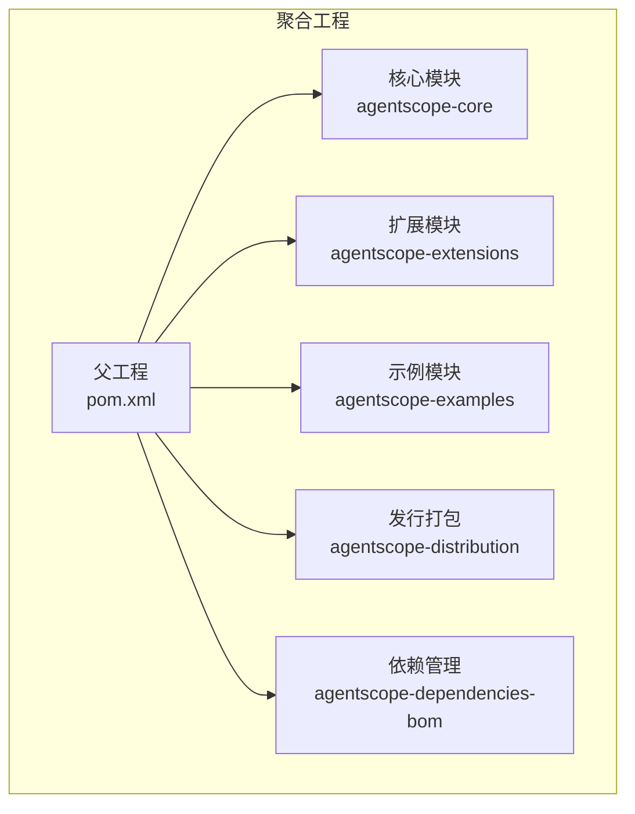
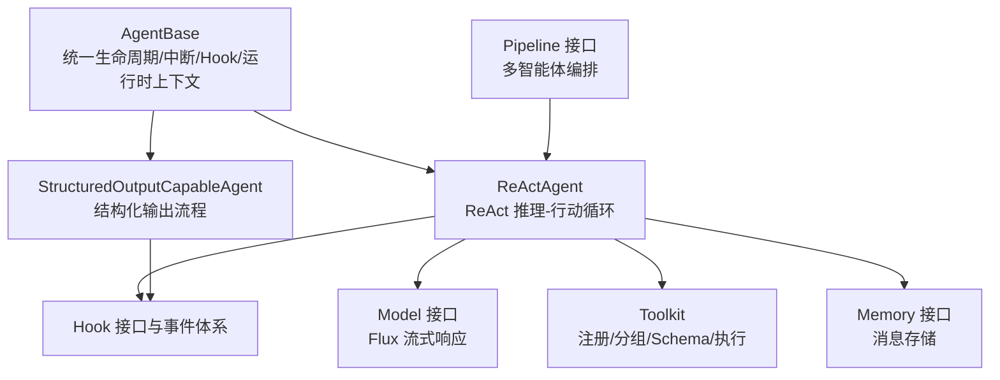
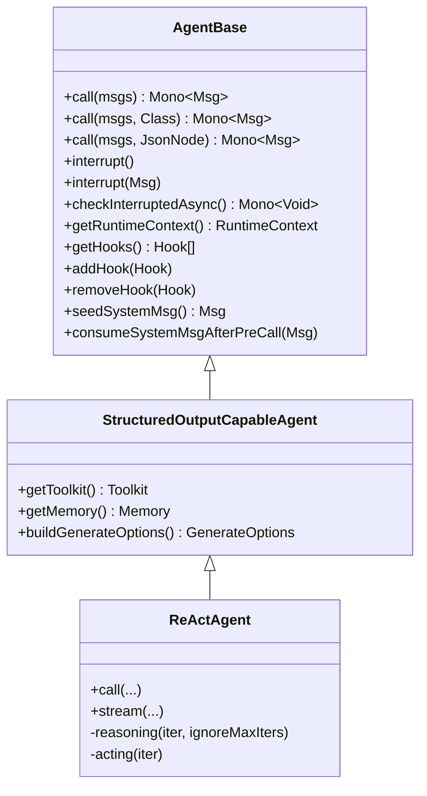
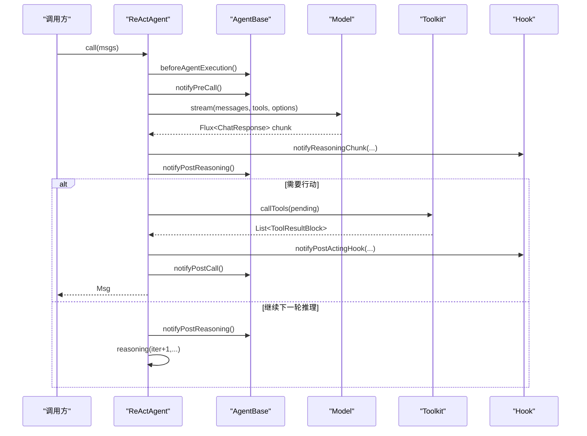
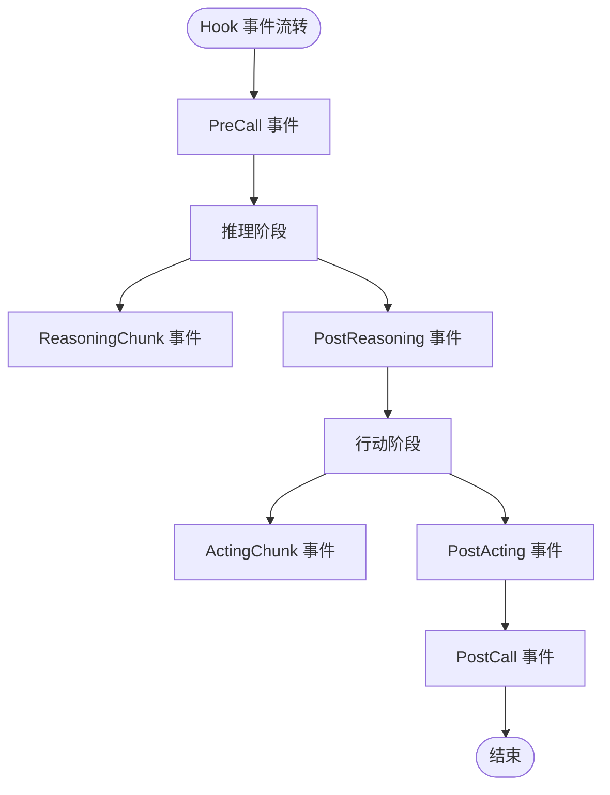
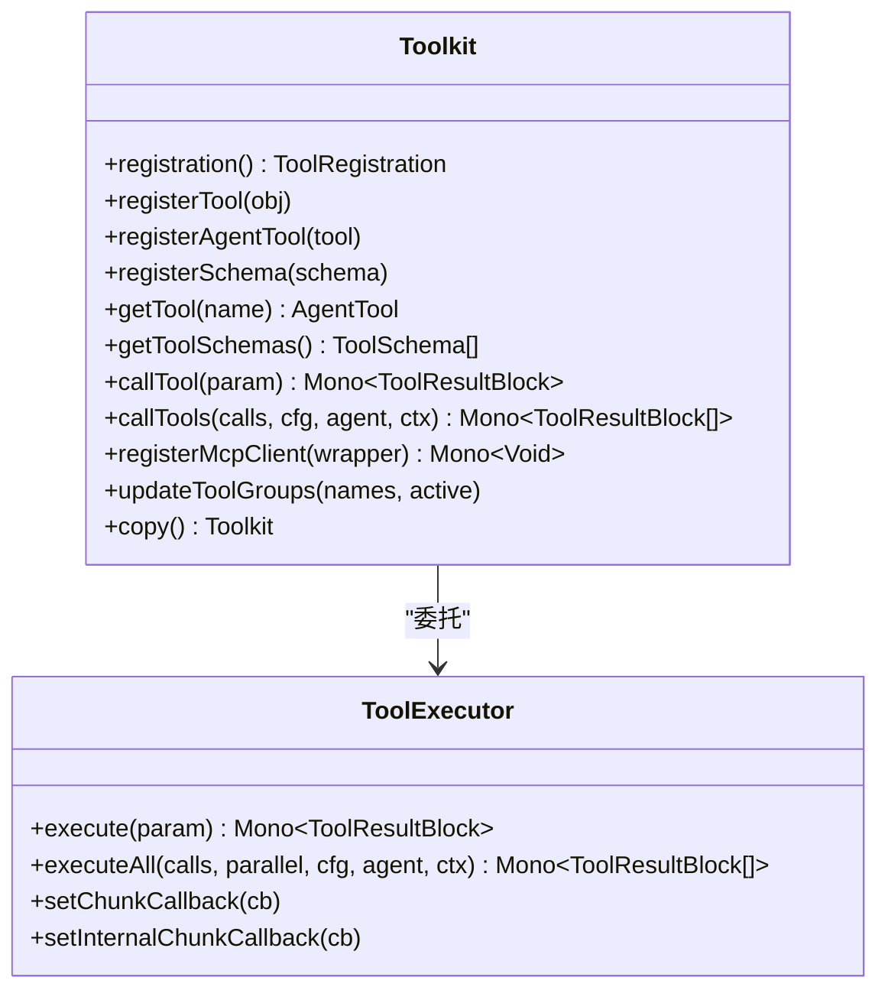
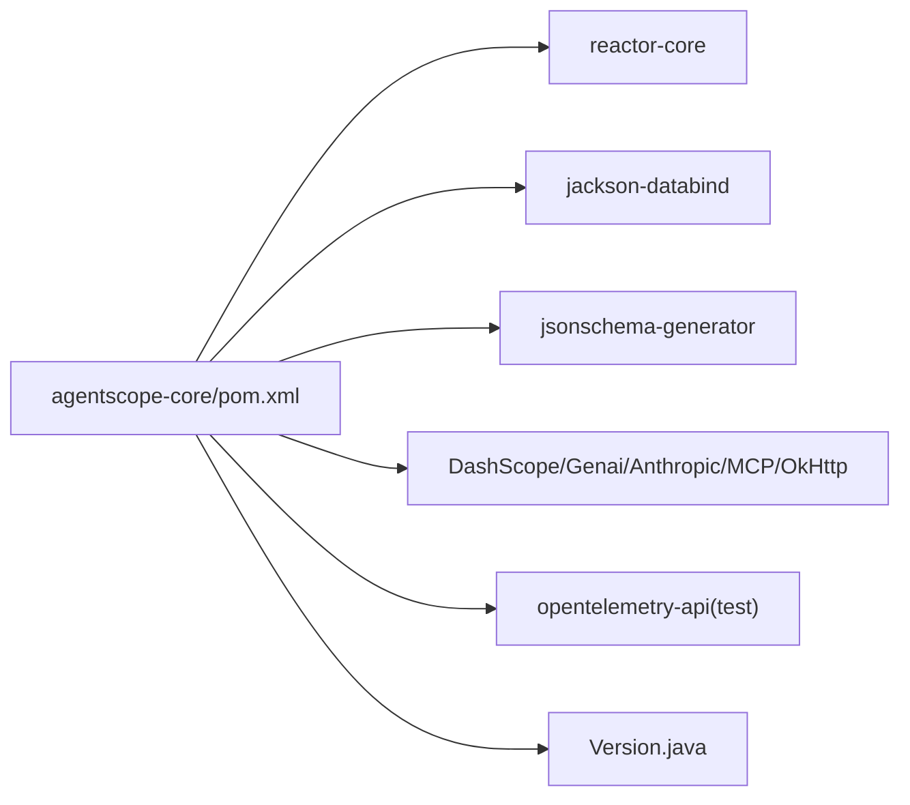

# 整体架构

<cite>
**本文引用的文件**
- [README.md](file://README.md)
- [pom.xml](file://pom.xml)
- [agentscope-core/pom.xml](file://agentscope-core/pom.xml)
- [agentscope-examples/pom.xml](file://agentscope-examples/pom.xml)
- [Version.java](file://agentscope-core/src/main/java/io/agentscope/core/Version.java)
- [AgentBase.java](file://agentscope-core/src/main/java/io/agentscope/core/agent/AgentBase.java)
- [ReActAgent.java](file://agentscope-core/src/main/java/io/agentscope/core/ReActAgent.java)
- [StructuredOutputCapableAgent.java](file://agentscope-core/src/main/java/io/agentscope/core/agent/StructuredOutputCapableAgent.java)
- [Hook.java](file://agentscope-core/src/main/java/io/agentscope/core/hook/Hook.java)
- [PendingToolRecoveryHook.java](file://agentscope-core/src/main/java/io/agentscope/core/hook/PendingToolRecoveryHook.java)
- [Model.java](file://agentscope-core/src/main/java/io/agentscope/core/model/Model.java)
- [Toolkit.java](file://agentscope-core/src/main/java/io/agentscope/core/tool/Toolkit.java)
- [Memory.java](file://agentscope-core/src/main/java/io/agentscope/core/memory/Memory.java)
- [Pipeline.java](file://agentscope-core/src/main/java/io/agentscope/core/pipeline/Pipeline.java)
</cite>

## 目录
1. [引言](#引言)
2. [项目结构](#项目结构)
3. [核心组件](#核心组件)
4. [架构总览](#架构总览)
5. [详细组件分析](#详细组件分析)
6. [依赖分析](#依赖分析)
7. [性能考虑](#性能考虑)
8. [故障排查指南](#故障排查指南)
9. [结论](#结论)
10. [附录](#附录)

## 引言
本文件面向 AgentScope Java 框架的整体架构文档，系统阐述其模块化设计原则（核心层、扩展层、示例层）、响应式编程与 Project Reactor 的异步非阻塞特性、组件间依赖与交互模式、抽象基类 AgentBase 的设计理念、ReActAgent 的实现要点，以及可扩展性设计（SPI 机制与 Hook 系统）。

## 项目结构
AgentScope Java 采用多模块聚合结构，父工程统一管理版本与构建配置，核心模块提供 Agent、模型、工具、记忆、Hook、流水线等基础能力；扩展模块提供 Spring Boot Starter、第三方集成与内存/会话持久化等；示例模块覆盖快速入门、高级用法、多智能体协作等场景。

图示来源
- [pom.xml:56-63](file://pom.xml#L56-L63)
- [agentscope-examples/pom.xml:34-59](file://agentscope-examples/pom.xml#L34-L59)

章节来源
- [pom.xml:56-63](file://pom.xml#L56-L63)
- [agentscope-examples/pom.xml:34-59](file://agentscope-examples/pom.xml#L34-L59)

## 核心组件
- 响应式执行与中断控制：AgentBase 提供统一的 call()/stream() 生命周期、Hook 通知链、运行时上下文绑定、中断检查与恢复、优雅停机钩子等基础设施。
- ReAct 推理与行动循环：ReActAgent 实现 ReAct（推理-行动）范式，迭代地进行模型推理与工具执行，支持流式输出、人类在环（HITL）、结构化输出、长短期记忆、计划笔记本等。
- 结构化输出：StructuredOutputCapableAgent 抽象出“生成最终结构化响应”的通用流程，结合 StructuredOutputHook 完成类型安全的输出解析与元数据合并。
- Hook 系统：统一事件模型 Hook/Event，支持优先级排序、可修改事件、工具注入、运行时上下文感知等。
- 工具体系：Toolkit 聚合注册、分组、Schema 生成、MCP 客户端、方法调用、结果转换、并发/串行执行与超时重试策略。
- 记忆接口：Memory 统一消息存储契约，支持状态持久化与恢复。
- 流水线：Pipeline 接口定义多智能体编排的顺序/并行/自定义流程。

章节来源
- [AgentBase.java:93-201](file://agentscope-core/src/main/java/io/agentscope/core/agent/AgentBase.java#L93-L201)
- [ReActAgent.java:140-140](file://agentscope-core/src/main/java/io/agentscope/core/ReActAgent.java#L140-L140)
- [StructuredOutputCapableAgent.java:65-124](file://agentscope-core/src/main/java/io/agentscope/core/agent/StructuredOutputCapableAgent.java#L65-L124)
- [Hook.java:117-186](file://agentscope-core/src/main/java/io/agentscope/core/hook/Hook.java#L117-L186)
- [Toolkit.java:66-117](file://agentscope-core/src/main/java/io/agentscope/core/tool/Toolkit.java#L66-L117)
- [Memory.java:29-62](file://agentscope-core/src/main/java/io/agentscope/core/memory/Memory.java#L29-L62)
- [Pipeline.java:29-75](file://agentscope-core/src/main/java/io/agentscope/core/pipeline/Pipeline.java#L29-L75)

## 架构总览
AgentScope Java 以响应式为核心，围绕 AgentBase 构建统一的生命周期与可观测性，ReActAgent 作为典型实现承载 ReAct 循环与 Hook 集成；模型抽象 Model 与工具体系 Toolkit 解耦外部服务与本地方法；Memory 提供可插拔的记忆存储；Pipeline 支持多智能体协作编排。

图示来源
- [AgentBase.java:93-100](file://agentscope-core/src/main/java/io/agentscope/core/agent/AgentBase.java#L93-L100)
- [ReActAgent.java:140-160](file://agentscope-core/src/main/java/io/agentscope/core/ReActAgent.java#L140-L160)
- [StructuredOutputCapableAgent.java:65-103](file://agentscope-core/src/main/java/io/agentscope/core/agent/StructuredOutputCapableAgent.java#L65-L103)
- [Hook.java:117-147](file://agentscope-core/src/main/java/io/agentscope/core/hook/Hook.java#L117-L147)
- [Model.java:22-41](file://agentscope-core/src/main/java/io/agentscope/core/model/Model.java#L22-L41)
- [Toolkit.java:66-117](file://agentscope-core/src/main/java/io/agentscope/core/tool/Toolkit.java#L66-L117)
- [Memory.java:29-62](file://agentscope-core/src/main/java/io/agentscope/core/memory/Memory.java#L29-L62)
- [Pipeline.java:29-75](file://agentscope-core/src/main/java/io/agentscope/core/pipeline/Pipeline.java#L29-L75)

## 详细组件分析

### AgentBase：抽象基类与响应式生命周期
- 设计理念：提供 Hook 集成、订阅管理、中断处理、追踪、状态模块化等通用能力，不包含领域逻辑；具体记忆管理由子类负责。
- 生命周期：call()/call(..., Class)/call(..., JsonNode) 三态入口，内部使用 Mono.using 确保资源获取/释放与异常处理一致；TracerRegistry 注入追踪。
- 中断机制：checkInterruptedAsync() 在 Mono 链中传播 InterruptedException；handleInterrupt(...) 由子类实现恢复策略。
- Hook 管理：动态增删 Hook，按 priority 排序；支持 RuntimeContextAware 钩子绑定。
- 观察模式：doObserve(...) 允许接收消息但不生成回复，用于多智能体协作。

图示来源
- [AgentBase.java:93-156](file://agentscope-core/src/main/java/io/agentscope/core/agent/AgentBase.java#L93-L156)
- [StructuredOutputCapableAgent.java:65-124](file://agentscope-core/src/main/java/io/agentscope/core/agent/StructuredOutputCapableAgent.java#L65-L124)
- [ReActAgent.java:140-194](file://agentscope-core/src/main/java/io/agentscope/core/ReActAgent.java#L140-L194)

章节来源
- [AgentBase.java:93-201](file://agentscope-core/src/main/java/io/agentscope/core/agent/AgentBase.java#L93-L201)
- [AgentBase.java:372-389](file://agentscope-core/src/main/java/io/agentscope/core/agent/AgentBase.java#L372-L389)
- [AgentBase.java:661-720](file://agentscope-core/src/main/java/io/agentscope/core/agent/AgentBase.java#L661-L720)
- [AgentBase.java:729-752](file://agentscope-core/src/main/java/io/agentscope/core/agent/AgentBase.java#L729-L752)

### ReActAgent：ReAct 推理-行动循环与 Hook 集成
- 核心职责：维护 Memory、Model、Toolkit、执行配置、最大迭代次数、计划笔记本、运行时上下文；在 doCall(...) 中根据 pending 工具状态决定推理或行动分支。
- 推理阶段：prependSystemMsg + model.stream(...)，逐块累积并通知 ReasoningChunkEvent；支持 HITL 停止、跳转到推理、完成条件判断。
- 行动阶段：提取待执行工具，设置内部 chunk 回调转发至 ActingChunkEvent；成功结果经 PostActingEvent 钩子处理后写回 Memory；若存在挂起工具则返回带 GenerateReason.TOOL_SUSPENDED 的消息。
- 结构化输出：委托 StructuredOutputCapableAgent 的流程，自动注册 generate_response 工具与 StructuredOutputHook，并在完成后合并用量与思考内容。
- 优雅停机：根据策略决定中断时是否丢弃部分推理结果。

图示来源
- [ReActAgent.java:560-650](file://agentscope-core/src/main/java/io/agentscope/core/ReActAgent.java#L560-L650)
- [ReActAgent.java:669-731](file://agentscope-core/src/main/java/io/agentscope/core/ReActAgent.java#L669-L731)
- [AgentBase.java:661-720](file://agentscope-core/src/main/java/io/agentscope/core/agent/AgentBase.java#L661-L720)
- [Model.java:22-41](file://agentscope-core/src/main/java/io/agentscope/core/model/Model.java#L22-L41)
- [Toolkit.java:510-524](file://agentscope-core/src/main/java/io/agentscope/core/tool/Toolkit.java#L510-L524)

章节来源
- [ReActAgent.java:364-398](file://agentscope-core/src/main/java/io/agentscope/core/ReActAgent.java#L364-L398)
- [ReActAgent.java:546-650](file://agentscope-core/src/main/java/io/agentscope/core/ReActAgent.java#L546-L650)
- [ReActAgent.java:669-731](file://agentscope-core/src/main/java/io/agentscope/core/ReActAgent.java#L669-L731)
- [ReActAgent.java:766-800](file://agentscope-core/src/main/java/io/agentscope/core/ReActAgent.java#L766-L800)

### Hook 系统：统一事件模型与插件化扩展
- Hook 接口：onEvent(T) 统一处理所有事件；priority 控制执行顺序；tools() 可注入工具；事件可读可写（如 PreReasoningEvent/PostActingEvent）。
- 典型事件：PreCall/PostCall/Error/PreReasoning/ReasoningChunk/PostReasoning/PreActing/ActingChunk/PostActing/PreSummary/SummaryChunk/PostSummary 等。
- 内置钩子：PendingToolRecoveryHook 在 PreCall 阶段自动修复孤儿 pending 工具调用，避免异常中断；默认高优先级确保在其他钩子之前生效。
- 运行时上下文：RuntimeContextAware 钩子在 call 前后绑定/解绑 RuntimeContext，便于追踪与可观测性。

图示来源
- [Hook.java:117-186](file://agentscope-core/src/main/java/io/agentscope/core/hook/Hook.java#L117-L186)
- [PendingToolRecoveryHook.java:58-124](file://agentscope-core/src/main/java/io/agentscope/core/hook/PendingToolRecoveryHook.java#L58-L124)

章节来源
- [Hook.java:117-186](file://agentscope-core/src/main/java/io/agentscope/core/hook/Hook.java#L117-L186)
- [PendingToolRecoveryHook.java:58-124](file://agentscope-core/src/main/java/io/agentscope/core/hook/PendingToolRecoveryHook.java#L58-L124)

### 工具体系：Toolkit 与工具注册/执行
- 职责划分：ToolRegistry（注册/查找）、ToolGroupManager（分组/激活）、ToolSchemaProvider（Schema 生成）、McpClientManager（MCP 客户端）、MetaToolFactory（动态分组控制）、ToolExecutor（并发/串行执行与超时重试）。
- 执行策略：支持并行/串行、合并执行配置（Agent > Toolkit > 默认），支持用户回调与框架内部回调（内部回调用于转发到 ActingChunkEvent）。
- 外部工具：registerSchema(...) 注册仅 Schema 的工具，框架返回 GenerateReason.TOOL_SUSPENDED，交由用户外部执行。

图示来源
- [Toolkit.java:66-117](file://agentscope-core/src/main/java/io/agentscope/core/tool/Toolkit.java#L66-L117)
- [Toolkit.java:510-524](file://agentscope-core/src/main/java/io/agentscope/core/tool/Toolkit.java#L510-L524)

章节来源
- [Toolkit.java:66-117](file://agentscope-core/src/main/java/io/agentscope/core/tool/Toolkit.java#L66-L117)
- [Toolkit.java:510-524](file://agentscope-core/src/main/java/io/agentscope/core/tool/Toolkit.java#L510-L524)

### 记忆与状态：Memory 接口与状态模块化
- Memory 接口：统一 addMessage/getMessages/deleteMessage/clear 等操作，继承 StateModule 支持保存/加载。
- ReActAgent 将 Memory 与 StatePersistence 配置结合，支持在会话中保存/恢复记忆、工具分组、计划笔记本等状态。

章节来源
- [Memory.java:29-62](file://agentscope-core/src/main/java/io/agentscope/core/memory/Memory.java#L29-L62)
- [ReActAgent.java:299-360](file://agentscope-core/src/main/java/io/agentscope/core/ReActAgent.java#L299-L360)

### 流水线：多智能体编排
- Pipeline 接口：提供 execute(Msg)/execute(Msg, Class) 等多种执行形态，支持顺序/并行/自定义编排。
- 与 Agent 的关系：Pipeline 可组合多个 Agent 或操作，形成复杂工作流。

章节来源
- [Pipeline.java:29-75](file://agentscope-core/src/main/java/io/agentscope/core/pipeline/Pipeline.java#L29-L75)

## 依赖分析
- 响应式与 JSON：reactor-core、jackson-databind、jsonschema-generator 等。
- 模型 SDK：DashScope、Google Gemini、Anthropic、MCP SDK、OkHttp。
- 观测性：OpenTelemetry API（测试范围）。
- 版本与用户代理：Version 提供统一 User-Agent 字符串，便于统计与识别。

图示来源
- [agentscope-core/pom.xml:51-154](file://agentscope-core/pom.xml#L51-L154)
- [Version.java:24-45](file://agentscope-core/src/main/java/io/agentscope/core/Version.java#L24-L45)

章节来源
- [agentscope-core/pom.xml:51-154](file://agentscope-core/pom.xml#L51-L154)
- [Version.java:24-45](file://agentscope-core/src/main/java/io/agentscope/core/Version.java#L24-L45)

## 性能考虑
- 响应式非阻塞：基于 Project Reactor 的 Flux/Mono 链式处理，避免线程阻塞，提升吞吐与延迟表现。
- 并发执行：Toolkit 支持并行工具执行与超时重试策略，合理配置可提升工具调用效率。
- 内存与状态：Memory 与 StatePersistence 支持按需保存/恢复，减少重复初始化成本。
- 观测性：TracerRegistry 与 OpenTelemetry 集成，便于定位热点与瓶颈。

## 故障排查指南
- 中断与恢复：检查 AgentBase 的中断标志与 handleInterrupt 实现；确认 checkInterruptedAsync() 在关键节点被调用。
- 工具执行失败：Toolkit 对异常进行捕获并生成错误 ToolResultBlock，避免中断 ReAct 循环；关注日志中的错误摘要。
- 孤儿 pending 工具：启用 PendingToolRecoveryHook 自动补全错误结果；若禁用，需手动提供 ToolResultBlock。
- 结构化输出：确保 StructuredOutputHook 正常注册与移除，Schema 生成正确，最终消息包含标准结构化输出键。

章节来源
- [AgentBase.java:372-389](file://agentscope-core/src/main/java/io/agentscope/core/agent/AgentBase.java#L372-L389)
- [ReActAgent.java:774-800](file://agentscope-core/src/main/java/io/agentscope/core/ReActAgent.java#L774-L800)
- [PendingToolRecoveryHook.java:116-124](file://agentscope-core/src/main/java/io/agentscope/core/hook/PendingToolRecoveryHook.java#L116-L124)
- [StructuredOutputCapableAgent.java:164-196](file://agentscope-core/src/main/java/io/agentscope/core/agent/StructuredOutputCapableAgent.java#L164-L196)

## 结论
AgentScope Java 以响应式为核心，通过 AgentBase 抽象统一生命周期与 Hook 机制，ReActAgent 实现 ReAct 推理-行动范式并与模型、工具、记忆、流水线深度集成；借助 Hook 系统与 SPI 化的工具注册，框架具备良好的可扩展性与生产级可观测性，适合构建复杂、可控、可演进的智能体应用。

## 附录
- 快速开始与示例：参考 README 中的示例与示例模块组织，涵盖 Spring Boot、Micronaut、Quarkus、多智能体协作、RAG、计划笔记本等场景。
- 发行与依赖：父工程统一版本与发布配置，BOM 与依赖管理模块确保一致性。

章节来源
- [README.md:72-101](file://README.md#L72-L101)
- [agentscope-examples/pom.xml:34-59](file://agentscope-examples/pom.xml#L34-L59)