# 架构设计

<cite>
**本文引用的文件列表**
- [ReActAgent.java](file://agentscope-core/src/main/java/io/agentscope/core/ReActAgent.java)
- [Agent.java](file://agentscope-core/src/main/java/io/agentscope/core/agent/Agent.java)
- [AgentBase.java](file://agentscope-core/src/main/java/io/agentscope/core/agent/AgentBase.java)
- [StructuredOutputCapableAgent.java](file://agentscope-core/src/main/java/io/agentscope/core/agent/StructuredOutputCapableAgent.java)
- [Model.java](file://agentscope-core/src/main/java/io/agentscope/core/model/Model.java)
- [Toolkit.java](file://agentscope-core/src/main/java/io/agentscope/core/tool/Toolkit.java)
- [Hook.java](file://agentscope-core/src/main/java/io/agentscope/core/hook/Hook.java)
- [Memory.java](file://agentscope-core/src/main/java/io/agentscope/core/memory/Memory.java)
- [StatePersistence.java](file://agentscope-core/src/main/java/io/agentscope/core/state/StatePersistence.java)
- [PlanNotebook.java](file://agentscope-core/src/main/java/io/agentscope/core/plan/PlanNotebook.java)
- [Pipeline.java](file://agentscope-core/src/main/java/io/agentscope/core/pipeline/Pipeline.java)
- [Version.java](file://agentscope-core/src/main/java/io/agentscope/core/Version.java)
- [SKILL.md](file://SKILL.md)
- [pom.xml](file://pom.xml)
</cite>

## 目录
1. [引言](#引言)
2. [项目结构](#项目结构)
3. [核心组件](#核心组件)
4. [架构总览](#架构总览)
5. [详细组件分析](#详细组件分析)
6. [依赖分析](#依赖分析)
7. [性能考虑](#性能考虑)
8. [故障排查指南](#故障排查指南)
9. [结论](#结论)
10. [附录](#附录)

## 引言
本文件面向 AgentScope Java 框架，系统化阐述其整体架构设计与实现要点，重点覆盖以下方面：
- 整体架构模式：模块化设计、分层架构与插件化机制
- 核心组件交互：ReActAgent 作为核心控制器、Model 抽象层、Toolkit 工具系统、Hook 扩展机制、Memory 内存管理等
- 响应式编程架构：优势、实现方式与最佳实践
- 设计决策的技术考量、性能优化策略与可扩展性设计
- 架构演进历史与未来发展规划（基于现有代码与文档线索）

## 项目结构
AgentScope Java 采用多模块聚合工程组织，核心模块 agentscope-core 提供框架内核能力；agentscope-extensions 提供生态扩展；agentscope-examples 展示使用范式；agentscope-harness 提供测试与沙箱工具。

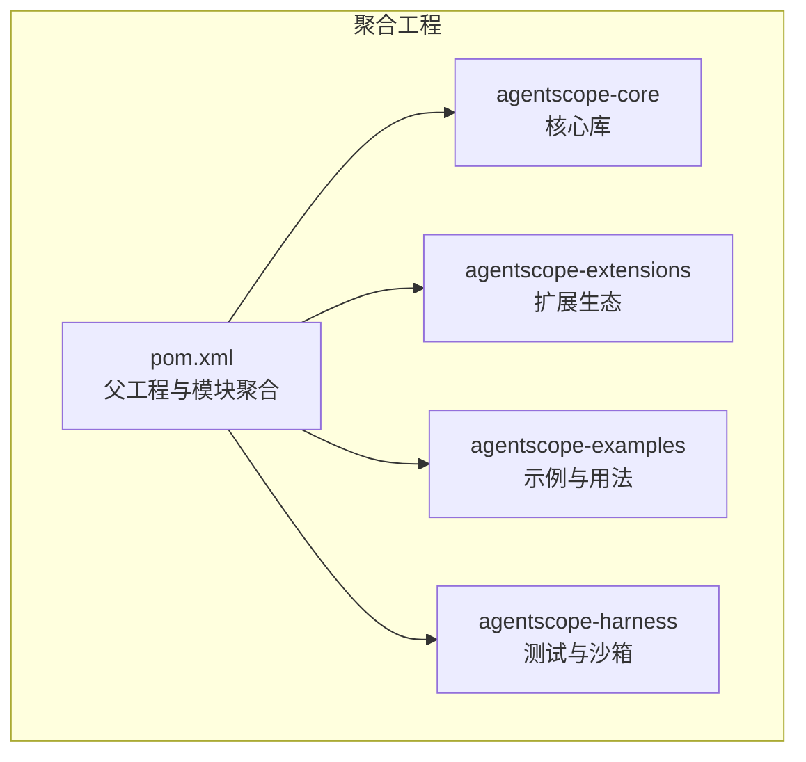

图示来源
- [pom.xml:1-200](file://pom.xml#L1-L200)

章节来源
- [pom.xml:1-200](file://pom.xml#L1-L200)

## 核心组件
本节从职责边界、接口契约与协作关系角度，梳理框架的关键构件及其定位。

- ReActAgent：作为核心控制器，驱动“推理-行动”的迭代循环，负责与 Model、Toolkit、Memory、Hook 等组件协同完成一次完整的对话或任务执行。
- Agent 接口族：定义统一的调用、流式事件与观察接口，AgentBase 提供通用基础设施（钩子、中断、订阅、状态）。
- Model 抽象层：屏蔽不同模型厂商与协议差异，统一以流式响应进行交互。
- Toolkit 工具系统：注册、检索与执行工具，支持组态控制、外部工具、MCP 客户端与元工具。
- Hook 扩展机制：统一事件模型，按优先级顺序拦截与修改执行过程。
- Memory 内存管理：抽象消息存储与持久化，支持会话恢复与状态保存。
- PlanNotebook 规划笔记本：提供计划与子任务管理工具集，自动注入上下文提示。
- Pipeline 流水线：提供顺序、并行等编排模式的统一入口。
- StatePersistence 状态持久化配置：细粒度控制 ReActAgent 对内存、工具组、规划笔记本等组件的状态管理范围。

章节来源
- [Agent.java:1-83](file://agentscope-core/src/main/java/io/agentscope/core/agent/Agent.java#L1-L83)
- [AgentBase.java:1-800](file://agentscope-core/src/main/java/io/agentscope/core/agent/AgentBase.java#L1-L800)
- [Model.java:1-42](file://agentscope-core/src/main/java/io/agentscope/core/model/Model.java#L1-L42)
- [Toolkit.java:1-800](file://agentscope-core/src/main/java/io/agentscope/core/tool/Toolkit.java#L1-L800)
- [Hook.java:1-187](file://agentscope-core/src/main/java/io/agentscope/core/hook/Hook.java#L1-L187)
- [Memory.java:1-63](file://agentscope-core/src/main/java/io/agentscope/core/memory/Memory.java#L1-L63)
- [StatePersistence.java:1-163](file://agentscope-core/src/main/java/io/agentscope/core/state/StatePersistence.java#L1-L163)
- [PlanNotebook.java:1-800](file://agentscope-core/src/main/java/io/agentscope/core/plan/PlanNotebook.java#L1-L800)
- [Pipeline.java:1-76](file://agentscope-core/src/main/java/io/agentscope/core/pipeline/Pipeline.java#L1-L76)

## 架构总览
AgentScope Java 采用“控制器-抽象层-工具系统-扩展机制-内存管理”的分层架构，并通过响应式编程实现非阻塞、可组合、可观测的执行模型。

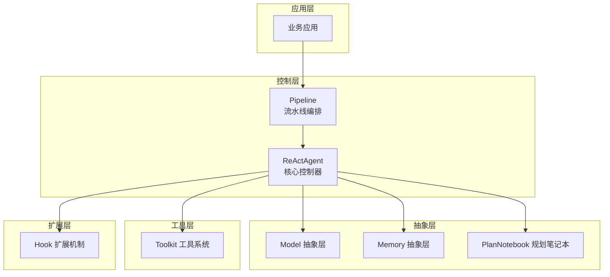

图示来源
- [ReActAgent.java:140-360](file://agentscope-core/src/main/java/io/agentscope/core/ReActAgent.java#L140-L360)
- [Model.java:22-42](file://agentscope-core/src/main/java/io/agentscope/core/model/Model.java#L22-L42)
- [Toolkit.java:66-118](file://agentscope-core/src/main/java/io/agentscope/core/tool/Toolkit.java#L66-L118)
- [Hook.java:25-187](file://agentscope-core/src/main/java/io/agentscope/core/hook/Hook.java#L25-L187)
- [Memory.java:22-63](file://agentscope-core/src/main/java/io/agentscope/core/memory/Memory.java#L22-L63)
- [PlanNotebook.java:104-135](file://agentscope-core/src/main/java/io/agentscope/core/plan/PlanNotebook.java#L104-L135)
- [Pipeline.java:29-76](file://agentscope-core/src/main/java/io/agentscope/core/pipeline/Pipeline.java#L29-L76)

## 详细组件分析

### ReActAgent：核心控制器
- 职责边界
  - 统一的 ReAct 循环：推理（reasoning）→ 行动（acting）→ 判断终止条件（含 HITL 与结构化输出）
  - 与 Model 的交互：构建输入消息、流式接收响应、累积与通知推理块
  - 与 Toolkit 的交互：提取待执行工具、执行工具、处理成功/挂起/失败结果
  - 与 Memory 的交互：记录消息、读取上下文、恢复/保存状态
  - 与 Hook 的交互：在关键节点触发事件，允许外部扩展与拦截
- 关键流程
  - doCall → reasoning → acting → 判断是否结束/继续迭代
  - 支持结构化输出：通过 StructuredOutputCapableAgent 注入生成工具与提醒策略
  - 支持长程记忆：根据模式注册工具或静态钩子，实现检索/记录自动化
- 响应式实现
  - 使用 Project Reactor 的 Mono/Flux 进行非阻塞流式处理
  - 在关键检查点调用 checkInterruptedAsync() 传播中断信号
  - 流式块（ReasoningChunk/ActingChunk）通过 Hook 通知用户回调

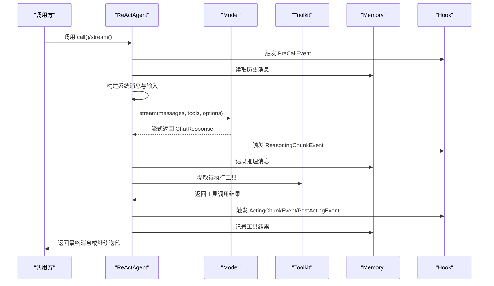

图示来源
- [ReActAgent.java:364-650](file://agentscope-core/src/main/java/io/agentscope/core/ReActAgent.java#L364-L650)
- [ReActAgent.java:669-731](file://agentscope-core/src/main/java/io/agentscope/core/ReActAgent.java#L669-L731)
- [AgentBase.java:182-263](file://agentscope-core/src/main/java/io/agentscope/core/agent/AgentBase.java#L182-L263)

章节来源
- [ReActAgent.java:140-360](file://agentscope-core/src/main/java/io/agentscope/core/ReActAgent.java#L140-L360)
- [ReActAgent.java:364-650](file://agentscope-core/src/main/java/io/agentscope/core/ReActAgent.java#L364-L650)
- [ReActAgent.java:669-731](file://agentscope-core/src/main/java/io/agentscope/core/ReActAgent.java#L669-L731)
- [AgentBase.java:182-263](file://agentscope-core/src/main/java/io/agentscope/core/agent/AgentBase.java#L182-L263)

### Model 抽象层
- 职责边界：屏蔽底层模型差异，统一以流式响应返回 ChatResponse
- 关键能力：stream(messages, tools, options)、getModelName()
- 设计要点：接口简洁、与格式化器解耦，便于接入不同厂商 SDK

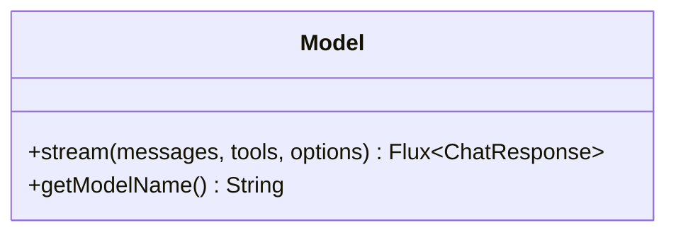

图示来源
- [Model.java:22-42](file://agentscope-core/src/main/java/io/agentscope/core/model/Model.java#L22-L42)

章节来源
- [Model.java:1-42](file://agentscope-core/src/main/java/io/agentscope/core/model/Model.java#L1-L42)

### Toolkit 工具系统
- 职责边界：工具注册、检索、执行与组态管理
- 关键能力：
  - 工具注册与查找（对象/注解方法/MCP 客户端/子代理）
  - 工具组管理（激活/停用/动态更新）
  - 工具执行（串行/并行、超时/重试、参数转换、结果转换）
  - 元工具（动态切换工具组）
- 设计要点：模块化管理器（ToolRegistry、ToolGroupManager、ToolSchemaProvider、ToolExecutor），支持外部工具与 MCP 协议

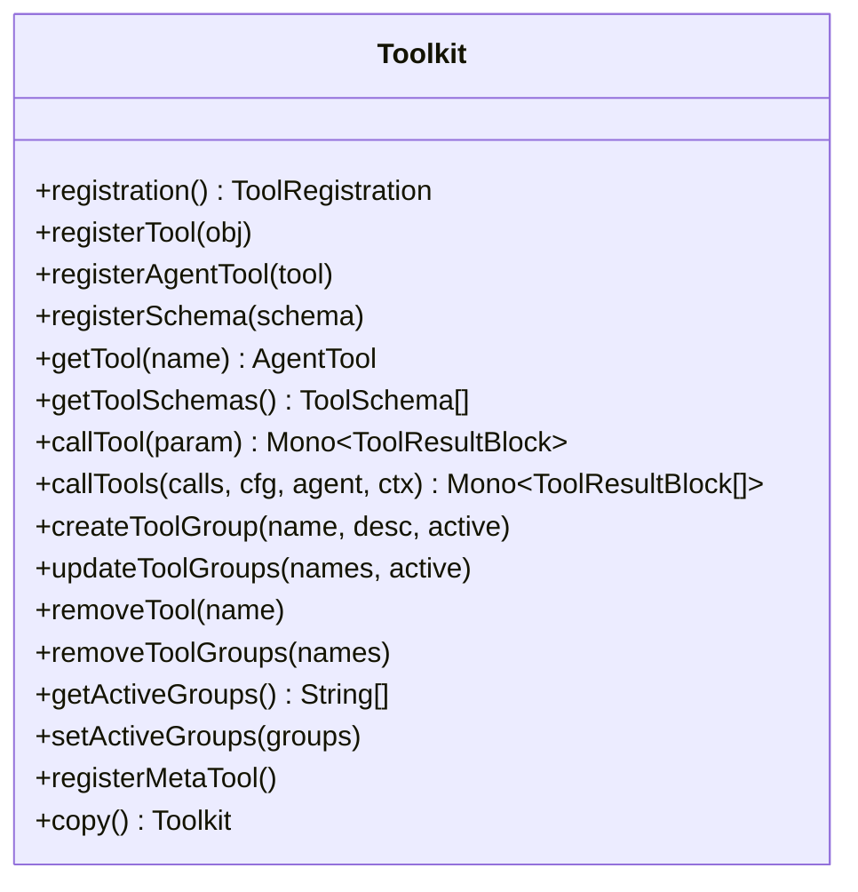

图示来源
- [Toolkit.java:66-118](file://agentscope-core/src/main/java/io/agentscope/core/tool/Toolkit.java#L66-L118)
- [Toolkit.java:146-148](file://agentscope-core/src/main/java/io/agentscope/core/tool/Toolkit.java#L146-L148)
- [Toolkit.java:510-524](file://agentscope-core/src/main/java/io/agentscope/core/tool/Toolkit.java#L510-L524)

章节来源
- [Toolkit.java:1-800](file://agentscope-core/src/main/java/io/agentscope/core/tool/Toolkit.java#L1-L800)

### Hook 扩展机制
- 职责边界：统一事件模型，按优先级顺序拦截与修改执行过程
- 关键能力：onEvent(T event)、tools()、priority()、RuntimeContextAware
- 设计要点：事件类型覆盖推理/行动/错误/总结等阶段；支持修改输入/输出；支持注入工具

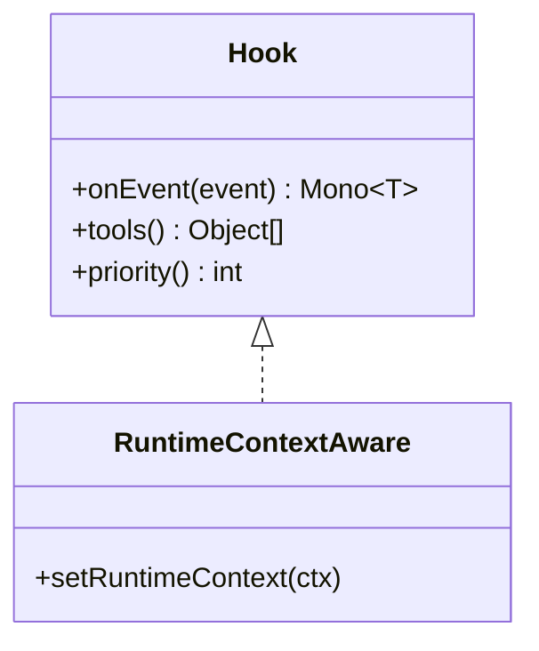

图示来源
- [Hook.java:117-187](file://agentscope-core/src/main/java/io/agentscope/core/hook/Hook.java#L117-L187)
- [AgentBase.java:541-556](file://agentscope-core/src/main/java/io/agentscope/core/agent/AgentBase.java#L541-L556)

章节来源
- [Hook.java:1-187](file://agentscope-core/src/main/java/io/agentscope/core/hook/Hook.java#L1-L187)
- [AgentBase.java:541-556](file://agentscope-core/src/main/java/io/agentscope/core/agent/AgentBase.java#L541-L556)

### Memory 内存管理
- 职责边界：抽象消息存储与管理，支持会话恢复与状态保存
- 关键能力：addMessage/getMessages/deleteMessage/clear，继承 StateModule
- 设计要点：与会话/状态模块解耦，支持多种实现（内存/持久化）

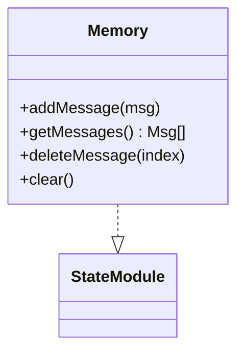

图示来源
- [Memory.java:22-63](file://agentscope-core/src/main/java/io/agentscope/core/memory/Memory.java#L22-L63)

章节来源
- [Memory.java:1-63](file://agentscope-core/src/main/java/io/agentscope/core/memory/Memory.java#L1-L63)

### PlanNotebook 规划笔记本
- 职责边界：提供计划与子任务管理工具集，自动注入上下文提示
- 关键能力：创建/修订/完成计划与子任务；状态跟踪；历史计划存储与恢复
- 设计要点：工具函数注解化；与 Hook 结合自动注入提示

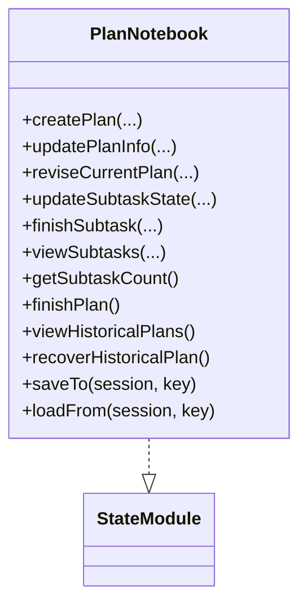

图示来源
- [PlanNotebook.java:104-135](file://agentscope-core/src/main/java/io/agentscope/core/plan/PlanNotebook.java#L104-L135)
- [PlanNotebook.java:268-331](file://agentscope-core/src/main/java/io/agentscope/core/plan/PlanNotebook.java#L268-L331)
- [PlanNotebook.java:467-567](file://agentscope-core/src/main/java/io/agentscope/core/plan/PlanNotebook.java#L467-L567)

章节来源
- [PlanNotebook.java:1-800](file://agentscope-core/src/main/java/io/agentscope/core/plan/PlanNotebook.java#L1-L800)

### Pipeline 流水线
- 职责边界：提供统一的执行入口，支持顺序/并行/自定义编排
- 关键能力：execute(input)/execute(input, structuredOutputClass)，默认描述与空输入变体

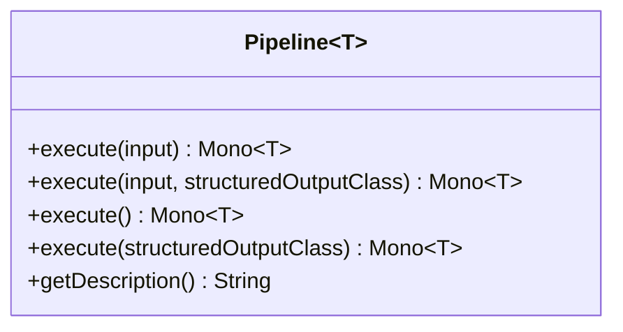

图示来源
- [Pipeline.java:29-76](file://agentscope-core/src/main/java/io/agentscope/core/pipeline/Pipeline.java#L29-L76)

章节来源
- [Pipeline.java:1-76](file://agentscope-core/src/main/java/io/agentscope/core/pipeline/Pipeline.java#L1-L76)

### StructuredOutputCapableAgent：结构化输出能力
- 职责边界：为具备结构化输出能力的 Agent 提供基础设施（生成工具、提醒模式、元数据合并）
- 关键能力：临时注册 generate_response 工具、StructuredOutputHook 控制流、Schema 校验与结果抽取

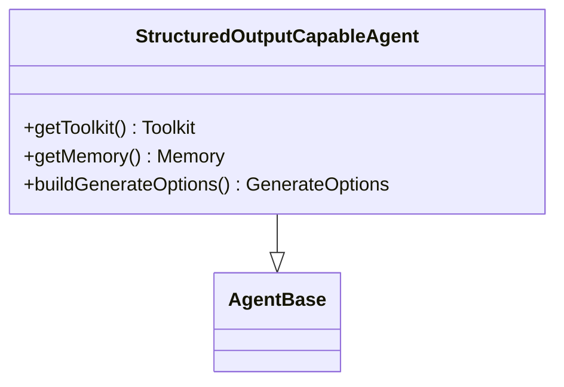

图示来源
- [StructuredOutputCapableAgent.java:65-124](file://agentscope-core/src/main/java/io/agentscope/core/agent/StructuredOutputCapableAgent.java#L65-L124)

章节来源
- [StructuredOutputCapableAgent.java:1-374](file://agentscope-core/src/main/java/io/agentscope/core/agent/StructuredOutputCapableAgent.java#L1-L374)

### StatePersistence：状态持久化配置
- 职责边界：控制 ReActAgent 对内存、工具组、规划笔记本等组件的状态管理范围
- 关键能力：all()/none()/memoryOnly() 与 Builder 配置

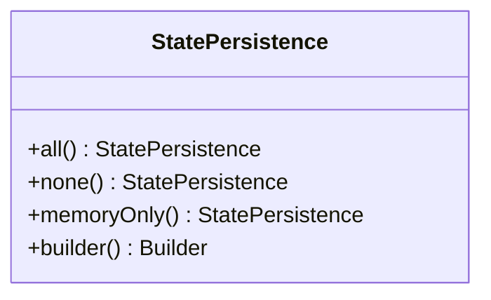

图示来源
- [StatePersistence.java:70-163](file://agentscope-core/src/main/java/io/agentscope/core/state/StatePersistence.java#L70-L163)

章节来源
- [StatePersistence.java:1-163](file://agentscope-core/src/main/java/io/agentscope/core/state/StatePersistence.java#L1-L163)

## 依赖分析
- 模块间依赖：agentscope-core 为核心，agentscope-extensions 通过 SPI 或装配方式集成；examples 仅演示用法；harness 提供测试与沙箱能力
- 外部依赖：Project Reactor 用于响应式编程；Jackson 用于 JSON 序列化；OkHttp/MockWebServer 用于测试；Junit/Mockito 用于单元测试
- 版本与兼容性：Java 17 最低版本，遵循 LTS 与稳定特性

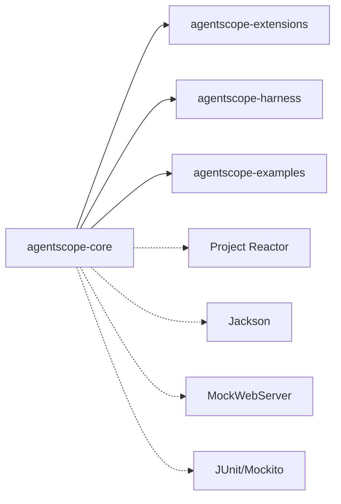

图示来源
- [pom.xml:97-130](file://pom.xml#L97-L130)
- [pom.xml:132-149](file://pom.xml#L132-L149)

章节来源
- [pom.xml:1-200](file://pom.xml#L1-L200)

## 性能考虑
- 响应式非阻塞：所有 I/O 与计算均通过 Mono/Flux 非阻塞执行，避免线程阻塞与上下文切换开销
- 流式处理：Model/Toolkit 的流式块通过 Hook 回调，减少中间缓冲与同步等待
- 中断与优雅关闭：在关键检查点抛出 InterruptedException，结合 GracefulShutdownManager 实现可控中断与资源回收
- 并行执行：Toolkit 支持并行工具执行，结合 ExecutionConfig 控制超时与重试，提升吞吐
- 线程安全：使用 CopyOnWrite 等并发容器保证钩子与订阅列表的线程安全

章节来源
- [AgentBase.java:372-379](file://agentscope-core/src/main/java/io/agentscope/core/agent/AgentBase.java#L372-L379)
- [Toolkit.java:510-524](file://agentscope-core/src/main/java/io/agentscope/core/tool/Toolkit.java#L510-L524)
- [SKILL.md:220-259](file://SKILL.md#L220-L259)

## 故障排查指南
- 钩子优先级与修改：确认 Hook.priority() 设置合理；仅对带 setter 的事件可修改输入/输出
- 中断与恢复：在推理/行动/工具执行等关键点调用 checkInterruptedAsync()；关注 InterruptedException 的处理与恢复消息
- 工具执行异常：工具失败会生成错误结果而非抛出异常，确保下游逻辑能正确处理错误块
- 结构化输出：若未生成预期结构化输出，检查 StructuredOutputHook 的提醒模式与 Schema 合规性
- 长程记忆：根据 LongTermMemoryMode 正确注册工具或静态钩子，避免遗漏导致检索/记录不生效

章节来源
- [Hook.java:117-187](file://agentscope-core/src/main/java/io/agentscope/core/hook/Hook.java#L117-L187)
- [AgentBase.java:449-457](file://agentscope-core/src/main/java/io/agentscope/core/agent/AgentBase.java#L449-L457)
- [ReActAgent.java:766-800](file://agentscope-core/src/main/java/io/agentscope/core/ReActAgent.java#L766-L800)
- [StructuredOutputCapableAgent.java:139-197](file://agentscope-core/src/main/java/io/agentscope/core/agent/StructuredOutputCapableAgent.java#L139-L197)

## 结论
AgentScope Java 通过清晰的分层与模块化设计、以 ReActAgent 为核心的控制流、以 Hook 为扩展点的插件化机制，以及以响应式编程为基础的非阻塞执行模型，实现了高可扩展性与高性能的智能体应用开发框架。其状态持久化配置、工具系统与规划笔记本进一步增强了复杂场景下的可用性与可维护性。

## 附录
- 版本信息：框架版本与统一 User-Agent 字符串，便于追踪与统计
- 编码规范与最佳实践：强调响应式链中避免阻塞、使用合适的调度器、错误处理与上下文传递等

章节来源
- [Version.java:24-46](file://agentscope-core/src/main/java/io/agentscope/core/Version.java#L24-L46)
- [SKILL.md:220-772](file://SKILL.md#L220-L772)