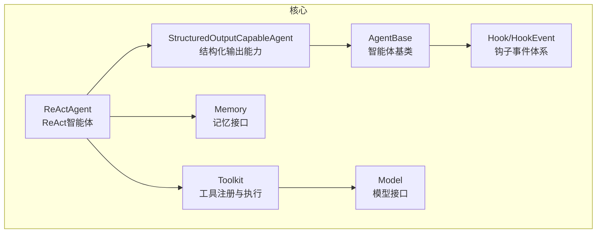
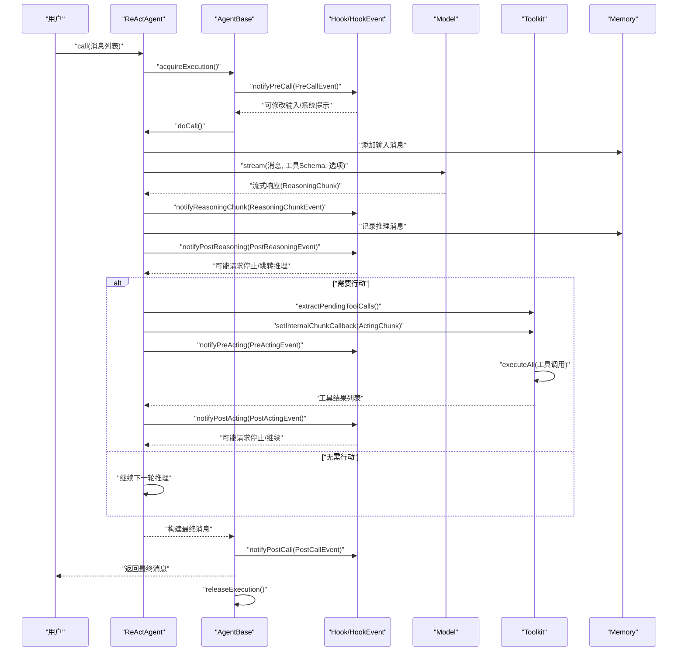
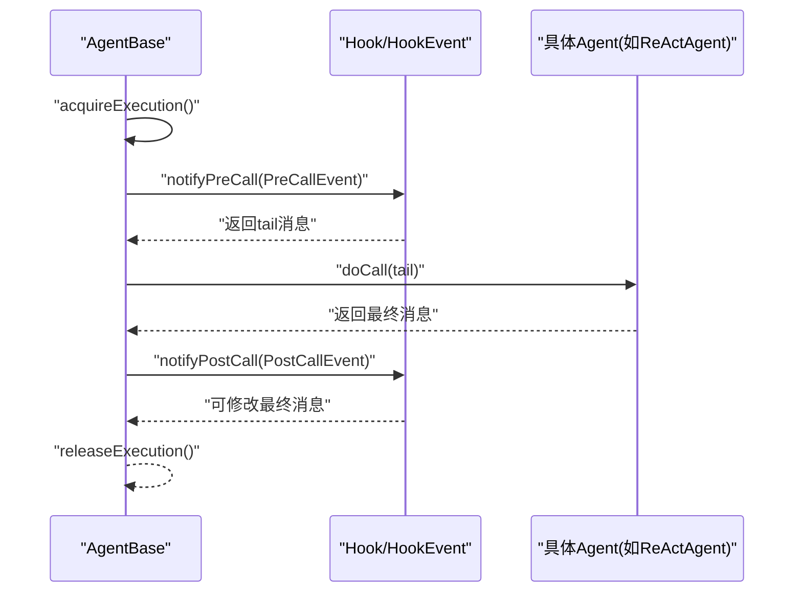
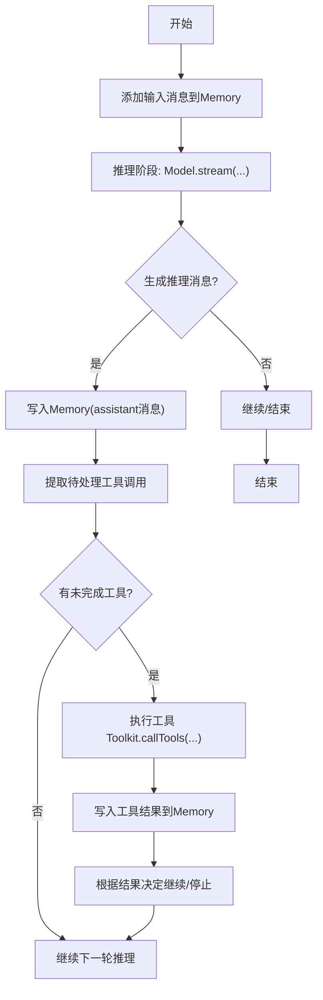
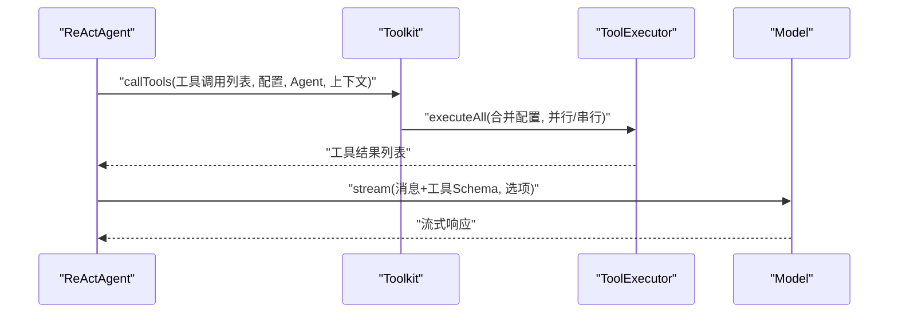
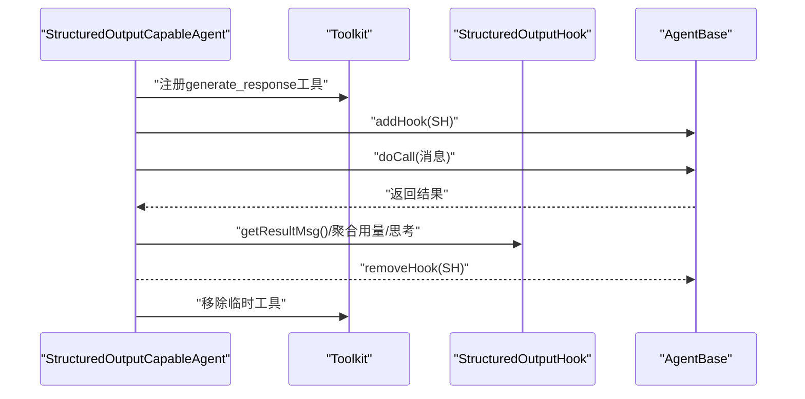
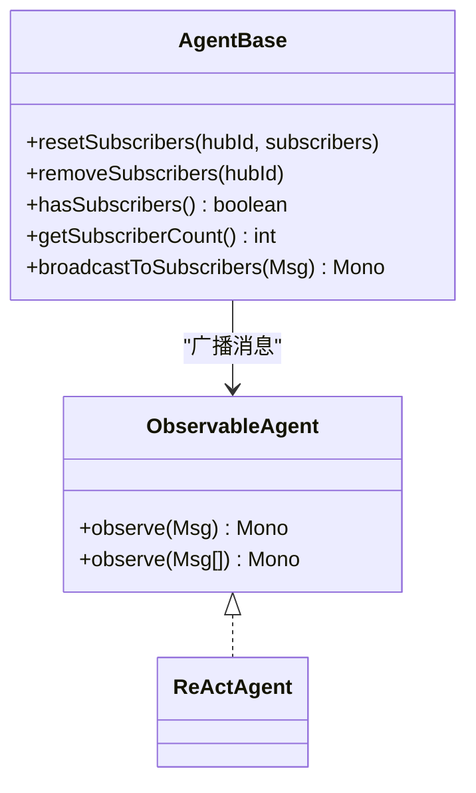
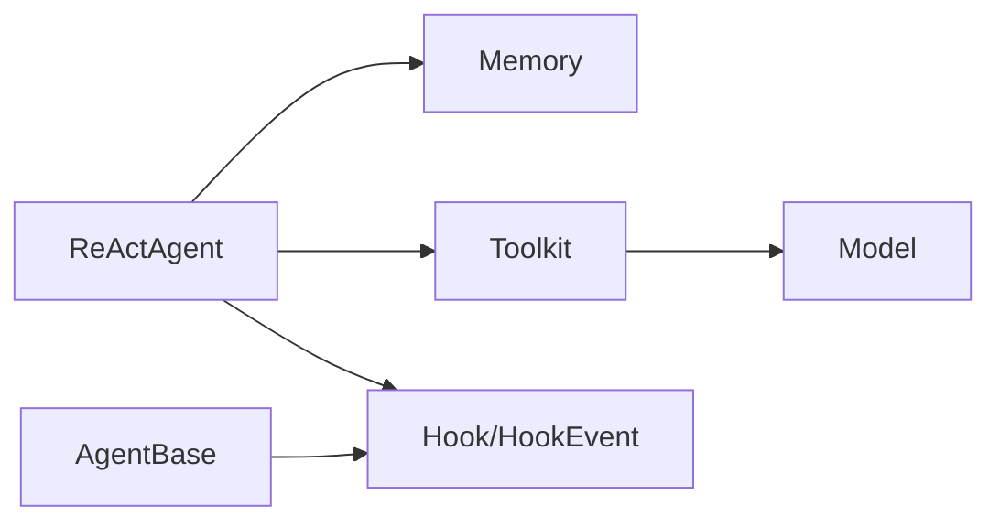

# 组件交互关系

<cite>
**本文引用的文件**
- [ReActAgent.java](file://agentscope-core/src/main/java/io/agentscope/core/ReActAgent.java)
- [AgentBase.java](file://agentscope-core/src/main/java/io/agentscope/core/agent/AgentBase.java)
- [StructuredOutputCapableAgent.java](file://agentscope-core/src/main/java/io/agentscope/core/agent/StructuredOutputCapableAgent.java)
- [ObservableAgent.java](file://agentscope-core/src/main/java/io/agentscope/core/agent/ObservableAgent.java)
- [Toolkit.java](file://agentscope-core/src/main/java/io/agentscope/core/tool/Toolkit.java)
- [Model.java](file://agentscope-core/src/main/java/io/agentscope/core/model/Model.java)
- [Memory.java](file://agentscope-core/src/main/java/io/agentscope/core/memory/Memory.java)
- [Hook.java](file://agentscope-core/src/main/java/io/agentscope/core/hook/Hook.java)
- [HookEvent.java](file://agentscope-core/src/main/java/io/agentscope/core/hook/HookEvent.java)
- [PreReasoningEvent.java](file://agentscope-core/src/main/java/io/agentscope/core/hook/PreReasoningEvent.java)
- [PostActingEvent.java](file://agentscope-core/src/main/java/io/agentscope/core/hook/PostActingEvent.java)
- [Msg.java](file://agentscope-core/src/main/java/io/agentscope/core/message/Msg.java)
- [Tool.java](file://agentscope-core/src/main/java/io/agentscope/core/tool/Tool.java)
</cite>

## 目录
1. [引言](#引言)
2. [项目结构](#项目结构)
3. [核心组件](#核心组件)
4. [架构总览](#架构总览)
5. [详细组件分析](#详细组件分析)
6. [依赖分析](#依赖分析)
7. [性能考虑](#性能考虑)
8. [故障排查指南](#故障排查指南)
9. [结论](#结论)

## 引言
本文件聚焦于 AgentScope Java 框架的组件交互关系，系统性梳理 AgentBase 与 Hook 系统的事件驱动交互、ReActAgent 与 Memory 的消息传递、以及 Toolkit 与 Model 的工具调用链路。文档强调框架通过接口抽象实现松耦合设计，并提供典型场景的交互序列图与时序图，帮助读者快速理解各组件在真实运行中的协作方式与数据流向。

## 项目结构
- 核心包结构采用按职责分层：agent（智能体基类与派生）、hook（钩子事件体系）、memory（记忆接口与实现）、model（模型接口与实现）、tool（工具注册与执行）、message（消息与内容块）、pipeline/state/skill 等扩展模块。
- ReActAgent 作为典型智能体，继承自 StructuredOutputCapableAgent，后者继承自 AgentBase；ReActAgent 通过 Toolkit 调用外部工具，通过 Model 发起推理，通过 Memory 存储对话历史。
- Hook 系统以统一事件接口贯穿 call 生命周期，支持前置/后置钩子对输入输出进行拦截与修改。

图表来源
- [AgentBase.java:1-954](file://agentscope-core/src/main/java/io/agentscope/core/agent/AgentBase.java#L1-L954)
- [StructuredOutputCapableAgent.java:1-374](file://agentscope-core/src/main/java/io/agentscope/core/agent/StructuredOutputCapableAgent.java#L1-L374)
- [ReActAgent.java:1-1904](file://agentscope-core/src/main/java/io/agentscope/core/ReActAgent.java#L1-L1904)
- [Memory.java:1-63](file://agentscope-core/src/main/java/io/agentscope/core/memory/Memory.java#L1-L63)
- [Toolkit.java:1-985](file://agentscope-core/src/main/java/io/agentscope/core/tool/Toolkit.java#L1-L985)
- [Model.java:1-42](file://agentscope-core/src/main/java/io/agentscope/core/model/Model.java#L1-L42)
- [Hook.java:1-187](file://agentscope-core/src/main/java/io/agentscope/core/hook/Hook.java#L1-L187)
- [HookEvent.java:1-206](file://agentscope-core/src/main/java/io/agentscope/core/hook/HookEvent.java#L1-L206)

章节来源
- [AgentBase.java:1-954](file://agentscope-core/src/main/java/io/agentscope/core/agent/AgentBase.java#L1-L954)
- [ReActAgent.java:1-1904](file://agentscope-core/src/main/java/io/agentscope/core/ReActAgent.java#L1-L1904)

## 核心组件
- AgentBase：提供统一的 call 流程、钩子通知、中断检查、状态管理等基础设施，不直接管理 Memory，交由具体智能体实现。
- StructuredOutputCapableAgent：在 AgentBase 基础上增加结构化输出能力，动态注册生成响应工具并通过 StructuredOutputHook 控制流程。
- ReActAgent：实现 ReAct 循环（推理-行动），与 Memory、Toolkit、Model 紧密协作，支持流式推理与工具执行，具备暂停/恢复与人类在回路（HITL）能力。
- Memory：统一的消息存储接口，支持保存/加载会话状态。
- Toolkit：工具注册、分组、Schema 生成、执行器与 MCP 客户端管理，负责工具调用链路。
- Model：统一的流式推理接口，接收消息与工具 Schema，返回流式响应。
- Hook/HookEvent：统一事件模型，贯穿 call 生命周期，支持修改输入输出、注入系统提示、触发停止等。

章节来源
- [AgentBase.java:1-954](file://agentscope-core/src/main/java/io/agentscope/core/agent/AgentBase.java#L1-L954)
- [StructuredOutputCapableAgent.java:1-374](file://agentscope-core/src/main/java/io/agentscope/core/agent/StructuredOutputCapableAgent.java#L1-L374)
- [ReActAgent.java:1-1904](file://agentscope-core/src/main/java/io/agentscope/core/ReActAgent.java#L1-L1904)
- [Memory.java:1-63](file://agentscope-core/src/main/java/io/agentscope/core/memory/Memory.java#L1-L63)
- [Toolkit.java:1-985](file://agentscope-core/src/main/java/io/agentscope/core/tool/Toolkit.java#L1-L985)
- [Model.java:1-42](file://agentscope-core/src/main/java/io/agentscope/core/model/Model.java#L1-L42)
- [Hook.java:1-187](file://agentscope-core/src/main/java/io/agentscope/core/hook/Hook.java#L1-L187)
- [HookEvent.java:1-206](file://agentscope-core/src/main/java/io/agentscope/core/hook/HookEvent.java#L1-L206)

## 架构总览
ReActAgent 的核心交互围绕“推理-行动”循环展开：推理阶段通过 Model 进行流式生成，同时通过 Hook 事件进行系统提示注入与流式回调；行动阶段通过 Toolkit 执行工具，工具结果经 Hook 后处理并写入 Memory，再决定是否继续下一轮推理或结束。

图表来源
- [AgentBase.java:182-201](file://agentscope-core/src/main/java/io/agentscope/core/agent/AgentBase.java#L182-L201)
- [AgentBase.java:661-720](file://agentscope-core/src/main/java/io/agentscope/core/agent/AgentBase.java#L661-L720)
- [AgentBase.java:729-741](file://agentscope-core/src/main/java/io/agentscope/core/agent/AgentBase.java#L729-L741)
- [ReActAgent.java:560-650](file://agentscope-core/src/main/java/io/agentscope/core/ReActAgent.java#L560-L650)
- [ReActAgent.java:669-731](file://agentscope-core/src/main/java/io/agentscope/core/ReActAgent.java#L669-L731)
- [ReActAgent.java:766-800](file://agentscope-core/src/main/java/io/agentscope/core/ReActAgent.java#L766-L800)
- [Hook.java:147](file://agentscope-core/src/main/java/io/agentscope/core/hook/Hook.java#L147)
- [HookEvent.java:74-206](file://agentscope-core/src/main/java/io/agentscope/core/hook/HookEvent.java#L74-L206)

## 详细组件分析

### AgentBase 与 Hook 系统的事件驱动交互
- 统一入口 call() 使用 Mono.using 确保 acquireExecution()/releaseExecution() 成功配对，内部通过 notifyPreCall/notifyPostCall 包裹 doCall()。
- 钩子按优先级排序执行，PreCallEvent 可注入/修改系统提示，PostCallEvent 可修改最终消息；错误通过 notifyError 分发。
- ReActAgent 在 beforeAgentExecution 中绑定 RuntimeContext 到 Hook，确保事件链中可访问上下文。

图表来源
- [AgentBase.java:182-201](file://agentscope-core/src/main/java/io/agentscope/core/agent/AgentBase.java#L182-L201)
- [AgentBase.java:661-720](file://agentscope-core/src/main/java/io/agentscope/core/agent/AgentBase.java#L661-L720)
- [AgentBase.java:729-741](file://agentscope-core/src/main/java/io/agentscope/core/agent/AgentBase.java#L729-L741)
- [HookEvent.java:140-205](file://agentscope-core/src/main/java/io/agentscope/core/hook/HookEvent.java#L140-L205)

章节来源
- [AgentBase.java:182-201](file://agentscope-core/src/main/java/io/agentscope/core/agent/AgentBase.java#L182-L201)
- [AgentBase.java:661-720](file://agentscope-core/src/main/java/io/agentscope/core/agent/AgentBase.java#L661-L720)
- [AgentBase.java:729-741](file://agentscope-core/src/main/java/io/agentscope/core/agent/AgentBase.java#L729-L741)
- [HookEvent.java:140-205](file://agentscope-core/src/main/java/io/agentscope/core/hook/HookEvent.java#L140-L205)

### ReActAgent 与 Memory 的消息传递
- 输入消息在推理前写入 Memory；推理得到的 Assistant 消息也写入 Memory；工具执行结果同样写入 Memory。
- 支持从 Memory 获取最后一条 Assistant 消息、提取待处理工具调用、校验用户提供的工具结果等。
- 会话持久化时，ReActAgent 将 Agent 元数据、Memory、Toolkit 活跃分组、PlanNotebook 状态保存到 Session。

图表来源
- [ReActAgent.java:364-398](file://agentscope-core/src/main/java/io/agentscope/core/ReActAgent.java#L364-L398)
- [ReActAgent.java:419-460](file://agentscope-core/src/main/java/io/agentscope/core/ReActAgent.java#L419-L460)
- [ReActAgent.java:478-531](file://agentscope-core/src/main/java/io/agentscope/core/ReActAgent.java#L478-L531)
- [ReActAgent.java:546-650](file://agentscope-core/src/main/java/io/agentscope/core/ReActAgent.java#L546-L650)
- [ReActAgent.java:669-731](file://agentscope-core/src/main/java/io/agentscope/core/ReActAgent.java#L669-L731)

章节来源
- [ReActAgent.java:364-398](file://agentscope-core/src/main/java/io/agentscope/core/ReActAgent.java#L364-L398)
- [ReActAgent.java:419-460](file://agentscope-core/src/main/java/io/agentscope/core/ReActAgent.java#L419-L460)
- [ReActAgent.java:478-531](file://agentscope-core/src/main/java/io/agentscope/core/ReActAgent.java#L478-L531)
- [ReActAgent.java:546-650](file://agentscope-core/src/main/java/io/agentscope/core/ReActAgent.java#L546-L650)
- [ReActAgent.java:669-731](file://agentscope-core/src/main/java/io/agentscope/core/ReActAgent.java#L669-L731)

### Toolkit 与 Model 的工具调用链路
- Toolkit 提供工具注册、Schema 生成、执行器与 MCP 客户端管理；callTools() 合并执行配置，支持并行/串行执行。
- Model 接口定义流式推理，接收消息与工具 Schema，返回流式 ChatResponse。
- ReActAgent 在行动阶段调用 Toolkit，将工具调用结果写入 Memory，并通过 Hook 事件进行拦截与处理。

图表来源
- [Toolkit.java:510-524](file://agentscope-core/src/main/java/io/agentscope/core/tool/Toolkit.java#L510-L524)
- [Toolkit.java:489-491](file://agentscope-core/src/main/java/io/agentscope/core/tool/Toolkit.java#L489-L491)
- [Model.java:24-33](file://agentscope-core/src/main/java/io/agentscope/core/model/Model.java#L24-L33)
- [ReActAgent.java:669-731](file://agentscope-core/src/main/java/io/agentscope/core/ReActAgent.java#L669-L731)

章节来源
- [Toolkit.java:510-524](file://agentscope-core/src/main/java/io/agentscope/core/tool/Toolkit.java#L510-L524)
- [Toolkit.java:489-491](file://agentscope-core/src/main/java/io/agentscope/core/tool/Toolkit.java#L489-L491)
- [Model.java:24-33](file://agentscope-core/src/main/java/io/agentscope/core/model/Model.java#L24-L33)
- [ReActAgent.java:669-731](file://agentscope-core/src/main/java/io/agentscope/core/ReActAgent.java#L669-L731)

### 结构化输出与 Hook 的协作
- StructuredOutputCapableAgent 动态注册 generate_response 工具，使用 StructuredOutputHook 控制生成流程；完成后提取结构化输出并合并元数据。
- ReActAgent 在需要时可复用该能力，通过 Hook 注入系统提示或覆盖生成选项。

图表来源
- [StructuredOutputCapableAgent.java:126-197](file://agentscope-core/src/main/java/io/agentscope/core/agent/StructuredOutputCapableAgent.java#L126-L197)
- [Hook.java:147](file://agentscope-core/src/main/java/io/agentscope/core/hook/Hook.java#L147)

章节来源
- [StructuredOutputCapableAgent.java:126-197](file://agentscope-core/src/main/java/io/agentscope/core/agent/StructuredOutputCapableAgent.java#L126-L197)
- [Hook.java:147](file://agentscope-core/src/main/java/io/agentscope/core/hook/Hook.java#L147)

### 观察者模式与消息广播
- ObservableAgent 接口允许智能体被动观察消息而不生成回复；AgentBase 提供订阅者管理与广播机制，便于多智能体协作。

图表来源
- [ObservableAgent.java:1-54](file://agentscope-core/src/main/java/io/agentscope/core/agent/ObservableAgent.java#L1-L54)
- [AgentBase.java:761-800](file://agentscope-core/src/main/java/io/agentscope/core/agent/AgentBase.java#L761-L800)

章节来源
- [ObservableAgent.java:1-54](file://agentscope-core/src/main/java/io/agentscope/core/agent/ObservableAgent.java#L1-L54)
- [AgentBase.java:761-800](file://agentscope-core/src/main/java/io/agentscope/core/agent/AgentBase.java#L761-L800)

## 依赖分析
- 松耦合设计通过接口抽象实现：
  - Memory、Model、Toolkit、Hook/HookEvent 均为接口/抽象类，ReActAgent 仅依赖这些抽象。
  - ReActAgent 通过 Builder 注入 Memory、Model、Toolkit、Hook，便于替换实现与测试。
- 关键依赖链：
  - ReActAgent → Memory（读写历史）
  - ReActAgent → Toolkit（工具注册/执行）
  - Toolkit → Model（工具调用时的参数/Schema）
  - AgentBase → Hook（事件通知与拦截）

图表来源
- [ReActAgent.java:148-194](file://agentscope-core/src/main/java/io/agentscope/core/ReActAgent.java#L148-L194)
- [Toolkit.java:66-117](file://agentscope-core/src/main/java/io/agentscope/core/tool/Toolkit.java#L66-L117)
- [Model.java:22-42](file://agentscope-core/src/main/java/io/agentscope/core/model/Model.java#L22-L42)
- [Hook.java:117-187](file://agentscope-core/src/main/java/io/agentscope/core/hook/Hook.java#L117-L187)
- [AgentBase.java:93-156](file://agentscope-core/src/main/java/io/agentscope/core/agent/AgentBase.java#L93-L156)

章节来源
- [ReActAgent.java:148-194](file://agentscope-core/src/main/java/io/agentscope/core/ReActAgent.java#L148-L194)
- [Toolkit.java:66-117](file://agentscope-core/src/main/java/io/agentscope/core/tool/Toolkit.java#L66-L117)
- [Model.java:22-42](file://agentscope-core/src/main/java/io/agentscope/core/model/Model.java#L22-L42)
- [Hook.java:117-187](file://agentscope-core/src/main/java/io/agentscope/core/hook/Hook.java#L117-L187)
- [AgentBase.java:93-156](file://agentscope-core/src/main/java/io/agentscope/core/agent/AgentBase.java#L93-L156)

## 性能考虑
- 流式处理：ReActAgent 与 Model 均采用流式响应，减少内存占用并提升交互体验。
- 工具执行：Toolkit 支持并行/串行执行策略与超时重试配置，建议根据工具特性选择合适策略。
- 内存管理：Memory 实现应避免无限增长，必要时结合会话持久化与清理策略。
- 钩子优先级：高频钩子（如日志）建议设置较高优先级，但需避免阻塞主链路。

## 故障排查指南
- 工具执行失败：ReActAgent 在工具执行异常时生成错误结果，避免中断整个流程；若出现大量错误，检查工具参数与转换器配置。
- 悬挂工具：当工具抛出 ToolSuspendException 时，ReActAgent 返回包含 ToolUseBlock 与 pending ToolResultBlock 的消息，等待用户执行后继续。
- 中断与停止：ReActAgent 支持用户/系统中断与 HITL 停止；检查 InterruptContext 与 GenerateReason 以定位原因。
- 钩子错误：AgentBase 通过 notifyError 分发错误，确认钩子实现是否正确处理异常并返回事件。

章节来源
- [ReActAgent.java:766-800](file://agentscope-core/src/main/java/io/agentscope/core/ReActAgent.java#L766-L800)
- [ReActAgent.java:742-754](file://agentscope-core/src/main/java/io/agentscope/core/ReActAgent.java#L742-L754)
- [AgentBase.java:449-457](file://agentscope-core/src/main/java/io/agentscope/core/agent/AgentBase.java#L449-L457)
- [Hook.java:147](file://agentscope-core/src/main/java/io/agentscope/core/hook/Hook.java#L147)

## 结论
AgentScope Java 框架通过 AgentBase 的统一基础设施、Hook 的事件驱动拦截、ReActAgent 的 ReAct 循环、以及 Toolkit 与 Model 的清晰边界，实现了高内聚、低耦合的组件交互。借助接口抽象与流式处理，系统在复杂多智能体协作场景中仍保持良好的可扩展性与可维护性。