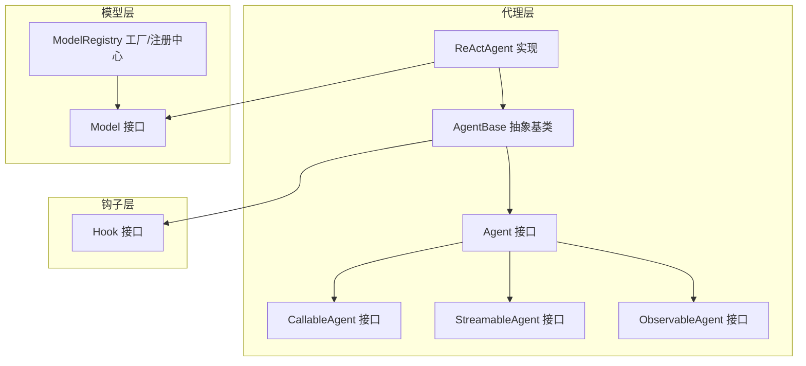
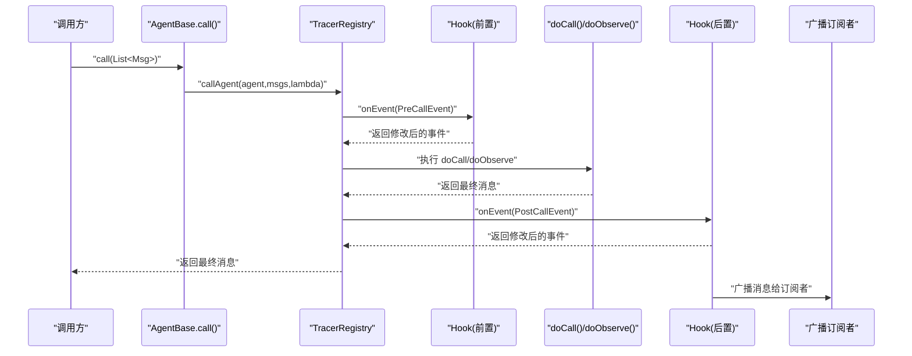
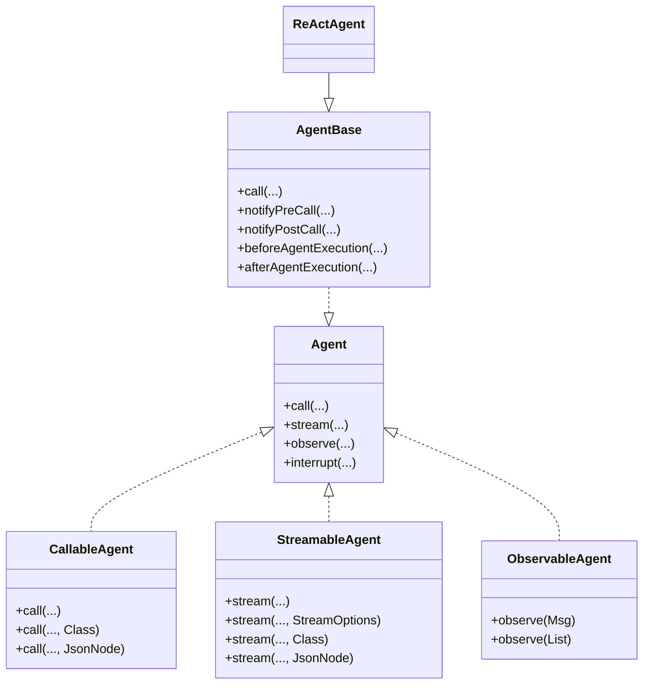
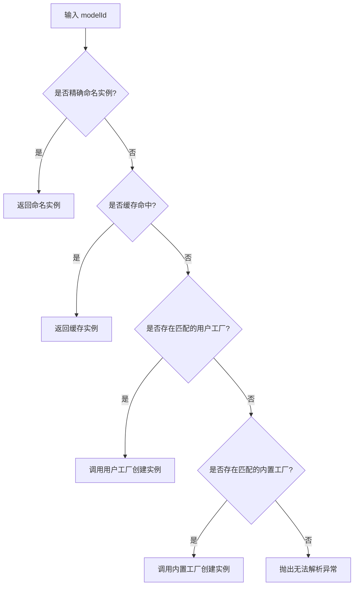
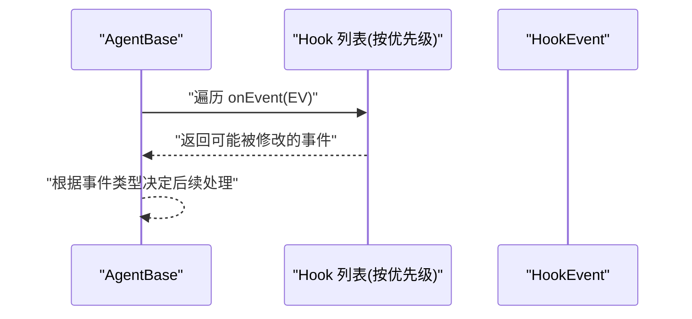
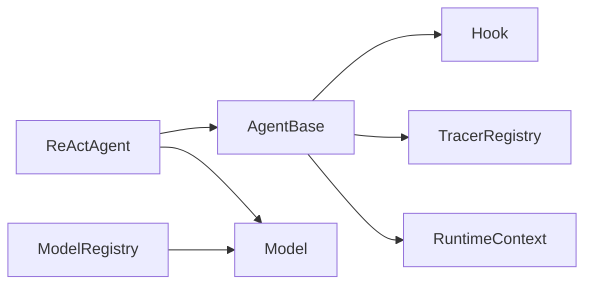

# 设计模式应用

<cite>
**本文引用的文件**
- [AgentBase.java](file://agentscope-core/src/main/java/io/agentscope/core/agent/AgentBase.java)
- [Hook.java](file://agentscope-core/src/main/java/io/agentscope/core/hook/Hook.java)
- [Model.java](file://agentscope-core/src/main/java/io/agentscope/core/model/Model.java)
- [ModelRegistry.java](file://agentscope-core/src/main/java/io/agentscope/core/model/ModelRegistry.java)
- [Agent.java](file://agentscope-core/src/main/java/io/agentscope/core/agent/Agent.java)
- [CallableAgent.java](file://agentscope-core/src/main/java/io/agentscope/core/agent/CallableAgent.java)
- [StreamableAgent.java](file://agentscope-core/src/main/java/io/agentscope/core/agent/StreamableAgent.java)
- [ObservableAgent.java](file://agentscope-core/src/main/java/io/agentscope/core/agent/ObservableAgent.java)
- [ReActAgent.java](file://agentscope-core/src/main/java/io/agentscope/core/ReActAgent.java)
</cite>

## 目录
1. [引言](#引言)
2. [项目结构](#项目结构)
3. [核心组件](#核心组件)
4. [架构总览](#架构总览)
5. [详细组件分析](#详细组件分析)
6. [依赖分析](#依赖分析)
7. [性能考量](#性能考量)
8. [故障排查指南](#故障排查指南)
9. [结论](#结论)
10. [附录](#附录)

## 引言
本文件聚焦于 AgentScope Java 框架中设计模式的应用与实践，围绕以下主题展开：模板方法模式在 AgentBase 中的体现、策略模式在多模型提供商支持中的实现、工厂模式在组件创建中的使用、观察者模式在 Hook 系统中的体现。我们将结合源码路径定位具体实现，解释每种模式的选择原因、带来的好处以及对可扩展性、可维护性、可测试性的提升，并总结模式组合的最佳实践与注意事项。

## 项目结构
AgentScope 的核心能力由“代理（Agent）”“钩子（Hook）”“模型（Model）”“注册表（ModelRegistry）”等模块协同完成。代理通过统一接口对外暴露调用、流式事件与观察能力；Hook 提供横切的监控与拦截；Model 抽象了不同大模型提供商的统一接口；ModelRegistry 则以工厂与注册机制实现多提供商策略选择。

图示来源
- [Agent.java:41-83](file://agentscope-core/src/main/java/io/agentscope/core/agent/Agent.java#L41-L83)
- [CallableAgent.java:35-140](file://agentscope-core/src/main/java/io/agentscope/core/agent/CallableAgent.java#L35-L140)
- [StreamableAgent.java:36-153](file://agentscope-core/src/main/java/io/agentscope/core/agent/StreamableAgent.java#L36-L153)
- [ObservableAgent.java:36-54](file://agentscope-core/src/main/java/io/agentscope/core/agent/ObservableAgent.java#L36-L54)
- [AgentBase.java:93-954](file://agentscope-core/src/main/java/io/agentscope/core/agent/AgentBase.java#L93-L954)
- [ReActAgent.java:140-1904](file://agentscope-core/src/main/java/io/agentscope/core/ReActAgent.java#L140-L1904)
- [Hook.java:117-187](file://agentscope-core/src/main/java/io/agentscope/core/hook/Hook.java#L117-L187)
- [Model.java:22-42](file://agentscope-core/src/main/java/io/agentscope/core/model/Model.java#L22-L42)
- [ModelRegistry.java:35-260](file://agentscope-core/src/main/java/io/agentscope/core/model/ModelRegistry.java#L35-L260)

章节来源
- [Agent.java:20-83](file://agentscope-core/src/main/java/io/agentscope/core/agent/Agent.java#L20-L83)
- [AgentBase.java:49-954](file://agentscope-core/src/main/java/io/agentscope/core/agent/AgentBase.java#L49-L954)
- [Hook.java:25-187](file://agentscope-core/src/main/java/io/agentscope/core/hook/Hook.java#L25-L187)
- [Model.java:22-42](file://agentscope-core/src/main/java/io/agentscope/core/model/Model.java#L22-L42)
- [ModelRegistry.java:35-260](file://agentscope-core/src/main/java/io/agentscope/core/model/ModelRegistry.java#L35-L260)
- [CallableAgent.java:35-140](file://agentscope-core/src/main/java/io/agentscope/core/agent/CallableAgent.java#L35-L140)
- [StreamableAgent.java:36-153](file://agentscope-core/src/main/java/io/agentscope/core/agent/StreamableAgent.java#L36-L153)
- [ObservableAgent.java:22-54](file://agentscope-core/src/main/java/io/agentscope/core/agent/ObservableAgent.java#L22-L54)
- [ReActAgent.java:93-1904](file://agentscope-core/src/main/java/io/agentscope/core/ReActAgent.java#L93-L1904)

## 核心组件
- 代理接口族：Agent 统一聚合 Callable/Streamable/Observable 能力；AgentBase 提供模板方法与基础设施（钩子、订阅、中断、状态、追踪）。
- 钩子系统：Hook 以单一 onEvent 方法统一拦截各类执行事件，支持优先级与工具注入。
- 模型抽象与注册：Model 定义统一流式推理接口；ModelRegistry 以用户自定义工厂优先、内置规则回退的策略解析模型实例。
- 观察者能力：ObservableAgent 允许代理被动接收消息，配合 AgentBase 的订阅广播实现多代理协作。

章节来源
- [Agent.java:20-83](file://agentscope-core/src/main/java/io/agentscope/core/agent/Agent.java#L20-L83)
- [AgentBase.java:93-954](file://agentscope-core/src/main/java/io/agentscope/core/agent/AgentBase.java#L93-L954)
- [Hook.java:117-187](file://agentscope-core/src/main/java/io/agentscope/core/hook/Hook.java#L117-L187)
- [Model.java:22-42](file://agentscope-core/src/main/java/io/agentscope/core/model/Model.java#L22-L42)
- [ModelRegistry.java:35-260](file://agentscope-core/src/main/java/io/agentscope/core/model/ModelRegistry.java#L35-L260)
- [ObservableAgent.java:22-54](file://agentscope-core/src/main/java/io/agentscope/core/agent/ObservableAgent.java#L22-L54)

## 架构总览
下图展示了代理调用主流程与 Hook 注入点，体现模板方法与观察者模式的协同：

图示来源
- [AgentBase.java:182-201](file://agentscope-core/src/main/java/io/agentscope/core/agent/AgentBase.java#L182-L201)
- [AgentBase.java:661-741](file://agentscope-core/src/main/java/io/agentscope/core/agent/AgentBase.java#L661-L741)
- [Hook.java:147-147](file://agentscope-core/src/main/java/io/agentscope/core/hook/Hook.java#L147-L147)

章节来源
- [AgentBase.java:182-201](file://agentscope-core/src/main/java/io/agentscope/core/agent/AgentBase.java#L182-L201)
- [AgentBase.java:661-741](file://agentscope-core/src/main/java/io/agentscope/core/agent/AgentBase.java#L661-L741)
- [Hook.java:147-147](file://agentscope-core/src/main/java/io/agentscope/core/hook/Hook.java#L147-L147)

## 详细组件分析

### 模板方法模式：AgentBase 中的固定骨架与可变步骤
- 设计要点
  - AgentBase 将“获取资源—通知前置钩子—执行核心逻辑—通知后置钩子—错误处理—释放资源”的流程固化为模板方法，子类仅需实现 doCall/doObserve 等可变步骤。
  - 通过 beforeAgentExecution/afterAgentExecution 钩子扩展生命周期行为（如 ReActAgent 在其中绑定 RuntimeContext）。
  - 通过 notifyPreCall/notifyPostCall/notifyError 统一事件通知，形成清晰的观察者链路。
- 选择原因
  - 保证代理执行的一致性与可观测性，避免重复样板代码；同时允许子类按领域需求定制核心逻辑。
- 好处
  - 可扩展：新增代理只需继承并实现 doCall/doObserve。
  - 可维护：横切关注点（日志、监控、中断、广播）集中在 AgentBase。
  - 可测试：模板方法便于单元测试隔离核心逻辑与横切行为。
- 代码示例路径
  - [AgentBase.call(...):182-201](file://agentscope-core/src/main/java/io/agentscope/core/agent/AgentBase.java#L182-L201)
  - [AgentBase.notifyPreCall(...):661-720](file://agentscope-core/src/main/java/io/agentscope/core/agent/AgentBase.java#L661-L720)
  - [AgentBase.notifyPostCall(...):729-741](file://agentscope-core/src/main/java/io/agentscope/core/agent/AgentBase.java#L729-L741)
  - [AgentBase.beforeAgentExecution(...)/afterAgentExecution(...):529-535](file://agentscope-core/src/main/java/io/agentscope/core/agent/AgentBase.java#L529-L535)
  - [ReActAgent.beforeAgentExecution(...):199-200](file://agentscope-core/src/main/java/io/agentscope/core/ReActAgent.java#L199-L200)

图示来源
- [Agent.java:41-83](file://agentscope-core/src/main/java/io/agentscope/core/agent/Agent.java#L41-L83)
- [CallableAgent.java:35-140](file://agentscope-core/src/main/java/io/agentscope/core/agent/CallableAgent.java#L35-L140)
- [StreamableAgent.java:36-153](file://agentscope-core/src/main/java/io/agentscope/core/agent/StreamableAgent.java#L36-L153)
- [ObservableAgent.java:36-54](file://agentscope-core/src/main/java/io/agentscope/core/agent/ObservableAgent.java#L36-L54)
- [AgentBase.java:93-954](file://agentscope-core/src/main/java/io/agentscope/core/agent/AgentBase.java#L93-L954)
- [ReActAgent.java:140-1904](file://agentscope-core/src/main/java/io/agentscope/core/ReActAgent.java#L140-L1904)

章节来源
- [AgentBase.java:93-954](file://agentscope-core/src/main/java/io/agentscope/core/agent/AgentBase.java#L93-L954)
- [Agent.java:20-83](file://agentscope-core/src/main/java/io/agentscope/core/agent/Agent.java#L20-L83)
- [CallableAgent.java:35-140](file://agentscope-core/src/main/java/io/agentscope/core/agent/CallableAgent.java#L35-L140)
- [StreamableAgent.java:36-153](file://agentscope-core/src/main/java/io/agentscope/core/agent/StreamableAgent.java#L36-L153)
- [ObservableAgent.java:22-54](file://agentscope-core/src/main/java/io/agentscope/core/agent/ObservableAgent.java#L22-L54)
- [ReActAgent.java:199-200](file://agentscope-core/src/main/java/io/agentscope/core/ReActAgent.java#L199-L200)

### 策略模式：多模型提供商支持（OpenAI/DashScope/Gemini/Anthropic/Ollama）
- 设计要点
  - Model 接口统一流式推理能力；各提供商实现（如 OpenAIChatModel、DashScopeChatModel、GeminiChatModel、AnthropicChatModel、OllamaChatModel）作为具体策略。
  - ModelRegistry 采用“命名实例优先 > 缓存命中 > 用户工厂 > 内置工厂”的解析顺序，形成可插拔的策略解析器。
- 选择原因
  - 解耦上层调用与底层提供商差异，支持动态切换与扩展新提供商。
- 好处
  - 可扩展：新增提供商只需实现 Model 并注册工厂或命名实例。
  - 可维护：环境变量驱动的自动创建降低配置复杂度。
  - 可测试：可通过注册命名实例替换真实提供商。
- 代码示例路径
  - [Model 接口:22-42](file://agentscope-core/src/main/java/io/agentscope/core/model/Model.java#L22-L42)
  - [ModelRegistry.resolve(...):142-173](file://agentscope-core/src/main/java/io/agentscope/core/model/ModelRegistry.java#L142-L173)
  - [ModelRegistry.registerFactory(...):129-134](file://agentscope-core/src/main/java/io/agentscope/core/model/ModelRegistry.java#L129-L134)
  - [内置工厂注册（OpenAI/DashScope/Gemini/Anthropic/Ollama）:44-106](file://agentscope-core/src/main/java/io/agentscope/core/model/ModelRegistry.java#L44-L106)

图示来源
- [ModelRegistry.java:142-173](file://agentscope-core/src/main/java/io/agentscope/core/model/ModelRegistry.java#L142-L173)
- [ModelRegistry.java:214-226](file://agentscope-core/src/main/java/io/agentscope/core/model/ModelRegistry.java#L214-L226)

章节来源
- [Model.java:22-42](file://agentscope-core/src/main/java/io/agentscope/core/model/Model.java#L22-L42)
- [ModelRegistry.java:35-260](file://agentscope-core/src/main/java/io/agentscope/core/model/ModelRegistry.java#L35-L260)

### 工厂模式：组件创建与实例化
- 设计要点
  - ModelRegistry 作为工厂注册中心，提供 register/registerFactory/resolve 等工厂方法；内部使用缓存避免重复创建。
  - ReActAgent Builder 在构建时复制并注册 Hook 所携带的工具，体现“工厂式装配”思想。
- 选择原因
  - 将对象创建与使用解耦，集中管理创建过程与生命周期。
- 好处
  - 可扩展：新增工厂或命名实例无需改动调用方。
  - 可测试：可替换为内存实例或桩实现。
- 代码示例路径
  - [ModelRegistry.register(...):114-118](file://agentscope-core/src/main/java/io/agentscope/core/model/ModelRegistry.java#L114-L118)
  - [ModelRegistry.registerFactory(...):129-134](file://agentscope-core/src/main/java/io/agentscope/core/model/ModelRegistry.java#L129-L134)
  - [ModelRegistry.resolve(...):142-173](file://agentscope-core/src/main/java/io/agentscope/core/model/ModelRegistry.java#L142-L173)
  - [Hook.tools() 默认空列表:163-165](file://agentscope-core/src/main/java/io/agentscope/core/hook/Hook.java#L163-L165)

章节来源
- [ModelRegistry.java:114-173](file://agentscope-core/src/main/java/io/agentscope/core/model/ModelRegistry.java#L114-L173)
- [Hook.java:163-165](file://agentscope-core/src/main/java/io/agentscope/core/hook/Hook.java#L163-L165)

### 观察者模式：Hook 系统与订阅广播
- 设计要点
  - Hook 以统一事件接口 onEvent 接收 PreCall/PostCall/ReasoningChunk/ActingChunk/Error 等事件，支持优先级与工具注入。
  - AgentBase 在 call 生命周期内触发事件链，ReActAgent 等可扩展系统消息传播；call 结束后广播消息给订阅者。
  - ObservableAgent 提供 observe 能力，AgentBase 维护订阅者映射并支持重置/移除。
- 选择原因
  - 将监控、日志、安全、限流、RAG、技能注入等横切逻辑与核心业务解耦。
- 好处
  - 可扩展：新增 Hook 不影响核心逻辑。
  - 可维护：事件类型集中，便于统一治理。
  - 可测试：可按事件粒度断言 Hook 行为。
- 代码示例路径
  - [Hook.onEvent(...):147-147](file://agentscope-core/src/main/java/io/agentscope/core/hook/Hook.java#L147-L147)
  - [AgentBase.notifyPreCall(...):661-720](file://agentscope-core/src/main/java/io/agentscope/core/agent/AgentBase.java#L661-L720)
  - [AgentBase.notifyPostCall(...):729-741](file://agentscope-core/src/main/java/io/agentscope/core/agent/AgentBase.java#L729-L741)
  - [AgentBase.broadcastToSubscribers(...):799-800](file://agentscope-core/src/main/java/io/agentscope/core/agent/AgentBase.java#L799-L800)
  - [ObservableAgent.observe(...):36-54](file://agentscope-core/src/main/java/io/agentscope/core/agent/ObservableAgent.java#L36-L54)

图示来源
- [AgentBase.java:661-741](file://agentscope-core/src/main/java/io/agentscope/core/agent/AgentBase.java#L661-L741)
- [Hook.java:147-147](file://agentscope-core/src/main/java/io/agentscope/core/hook/Hook.java#L147-L147)

章节来源
- [Hook.java:117-187](file://agentscope-core/src/main/java/io/agentscope/core/hook/Hook.java#L117-L187)
- [AgentBase.java:661-741](file://agentscope-core/src/main/java/io/agentscope/core/agent/AgentBase.java#L661-L741)
- [ObservableAgent.java:22-54](file://agentscope-core/src/main/java/io/agentscope/core/agent/ObservableAgent.java#L22-L54)

## 依赖分析
- 组件耦合
  - AgentBase 依赖 Hook、TracerRegistry、RuntimeContext、Memory 等横切与基础设施；ReActAgent 在其之上增加记忆、计划、工具上下文等。
  - Model 与 ModelRegistry 解耦：调用方只依赖 Model 接口，具体提供商通过注册表解析。
- 外部依赖
  - 使用 Project Reactor 进行响应式流式处理，贯穿 call/stream 的异步链路。
- 循环依赖
  - 未见直接循环依赖；Hook 与 AgentBase 通过事件单向传递，不形成闭环。

图示来源
- [AgentBase.java:93-954](file://agentscope-core/src/main/java/io/agentscope/core/agent/AgentBase.java#L93-L954)
- [ReActAgent.java:140-1904](file://agentscope-core/src/main/java/io/agentscope/core/ReActAgent.java#L140-L1904)
- [Model.java:22-42](file://agentscope-core/src/main/java/io/agentscope/core/model/Model.java#L22-L42)
- [ModelRegistry.java:35-260](file://agentscope-core/src/main/java/io/agentscope/core/model/ModelRegistry.java#L35-L260)

章节来源
- [AgentBase.java:93-954](file://agentscope-core/src/main/java/io/agentscope/core/agent/AgentBase.java#L93-L954)
- [ReActAgent.java:140-1904](file://agentscope-core/src/main/java/io/agentscope/core/ReActAgent.java#L140-L1904)
- [Model.java:22-42](file://agentscope-core/src/main/java/io/agentscope/core/model/Model.java#L22-L42)
- [ModelRegistry.java:35-260](file://agentscope-core/src/main/java/io/agentscope/core/model/ModelRegistry.java#L35-L260)

## 性能考量
- 流式与背压
  - 基于 Reactor 的 Flux/Mono 链路天然具备背压与非阻塞特性，适合长链路与高并发场景。
- Hook 优先级与数量
  - Hook 数量与优先级排序会影响链路开销；建议按需启用与合理分层。
- 订阅广播
  - 广播订阅者数量较多时会放大下游压力，应控制订阅拓扑与消息粒度。
- 缓存与工厂
  - ModelRegistry 的解析缓存显著降低重复创建成本；命名实例可避免工厂解析开销。

## 故障排查指南
- 中断与优雅停机
  - 使用 AgentBase 的中断机制与 GracefulShutdownManager 协同，确保在中断点及时响应并生成合理的恢复消息。
  - 参考路径：[AgentBase.interrupt(...):316-345](file://agentscope-core/src/main/java/io/agentscope/core/agent/AgentBase.java#L316-L345)，[AgentBase.handleInterrupt(...):514-514](file://agentscope-core/src/main/java/io/agentscope/core/agent/AgentBase.java#L514-L514)
- 错误处理
  - AgentBase 在 call 链路中捕获 InterruptedException 并委派到 handleInterrupt，其他错误通过 notifyError 通知所有 Hook。
  - 参考路径：[AgentBase.createErrorHandler(...):449-457](file://agentscope-core/src/main/java/io/agentscope/core/agent/AgentBase.java#L449-L457)，[AgentBase.notifyError(...):749-752](file://agentscope-core/src/main/java/io/agentscope/core/agent/AgentBase.java#L749-L752)
- 订阅问题
  - 若消息未到达订阅者，检查 resetSubscribers/removeSubscribers 的调用时机与 Hub 生命周期。
  - 参考路径：[AgentBase.resetSubscribers(...):773-775](file://agentscope-core/src/main/java/io/agentscope/core/agent/AgentBase.java#L773-L775)，[AgentBase.removeSubscribers(...):761-763](file://agentscope-core/src/main/java/io/agentscope/core/agent/AgentBase.java#L761-L763)

章节来源
- [AgentBase.java:316-345](file://agentscope-core/src/main/java/io/agentscope/core/agent/AgentBase.java#L316-L345)
- [AgentBase.java:449-457](file://agentscope-core/src/main/java/io/agentscope/core/agent/AgentBase.java#L449-L457)
- [AgentBase.java:514-514](file://agentscope-core/src/main/java/io/agentscope/core/agent/AgentBase.java#L514-L514)
- [AgentBase.java:749-752](file://agentscope-core/src/main/java/io/agentscope/core/agent/AgentBase.java#L749-L752)
- [AgentBase.java:761-775](file://agentscope-core/src/main/java/io/agentscope/core/agent/AgentBase.java#L761-L775)

## 结论
AgentScope 通过模板方法模式统一代理执行骨架，借助策略模式与工厂模式实现多模型提供商的灵活接入，利用观察者模式将横切关注点与核心逻辑解耦。这些模式共同提升了系统的可扩展性、可维护性与可测试性。在实践中，建议遵循“接口隔离、职责单一、事件驱动、按需装配”的原则，谨慎评估 Hook 数量与订阅规模，确保在复杂场景下的稳定性与性能。

## 附录
- 最佳实践
  - 将通用横切逻辑封装为 Hook，避免侵入核心业务。
  - 使用 ModelRegistry 的命名实例与工厂组合，兼顾灵活性与性能。
  - 在 ReActAgent 等复杂代理中，合理划分迭代检查点，确保中断生效。
- 注意事项
  - Hook 优先级与顺序至关重要，需明确关键 Hook 的执行先后。
  - 订阅者管理应在 Hub 生命周期内正确调用 reset/remove，防止悬挂引用。
  - 对外暴露的 Agent 接口保持稳定，内部实现细节通过抽象基类收敛。