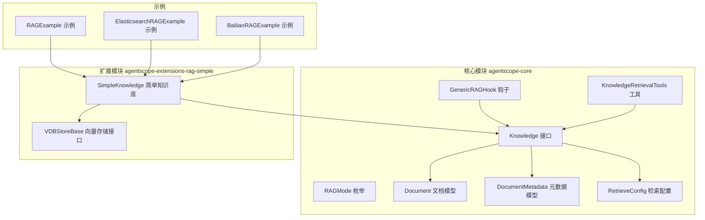
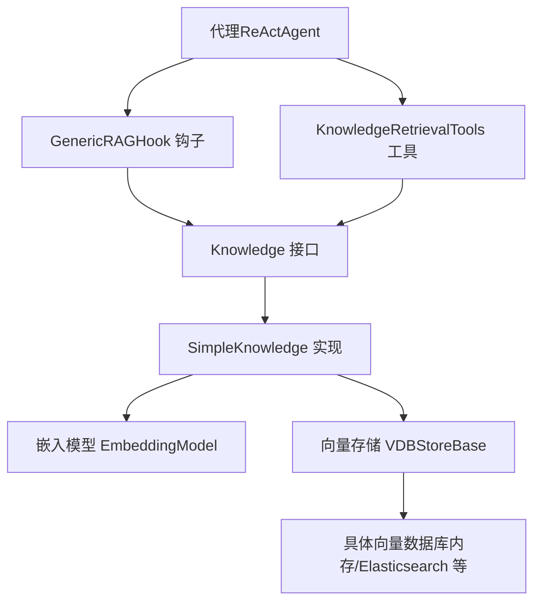
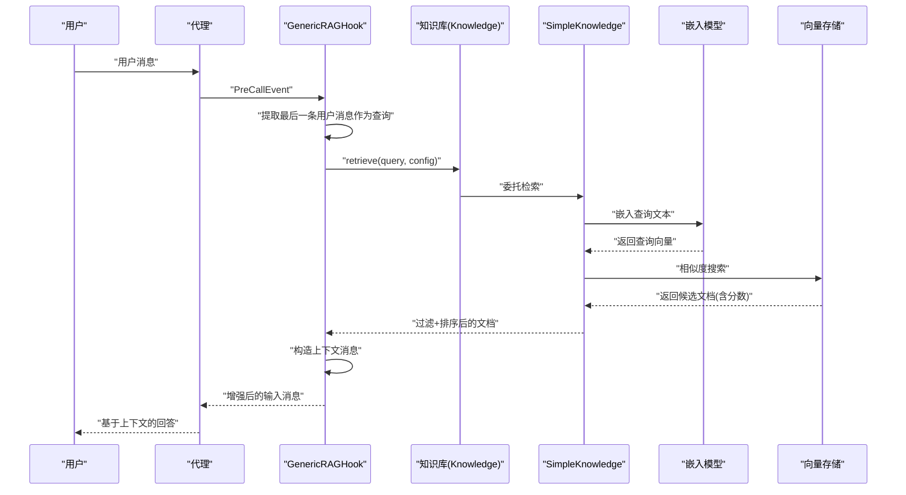
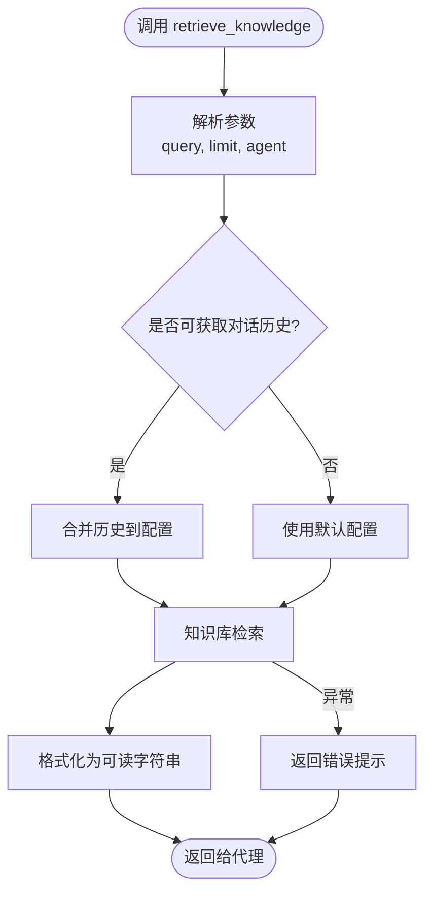
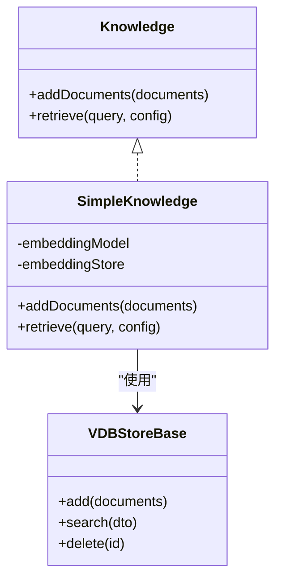
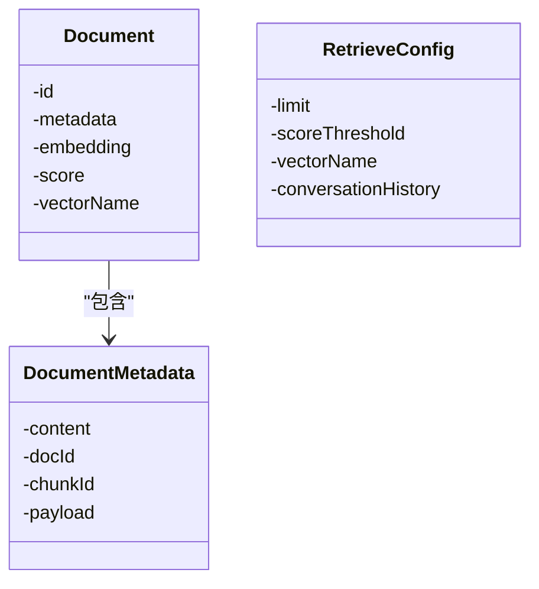
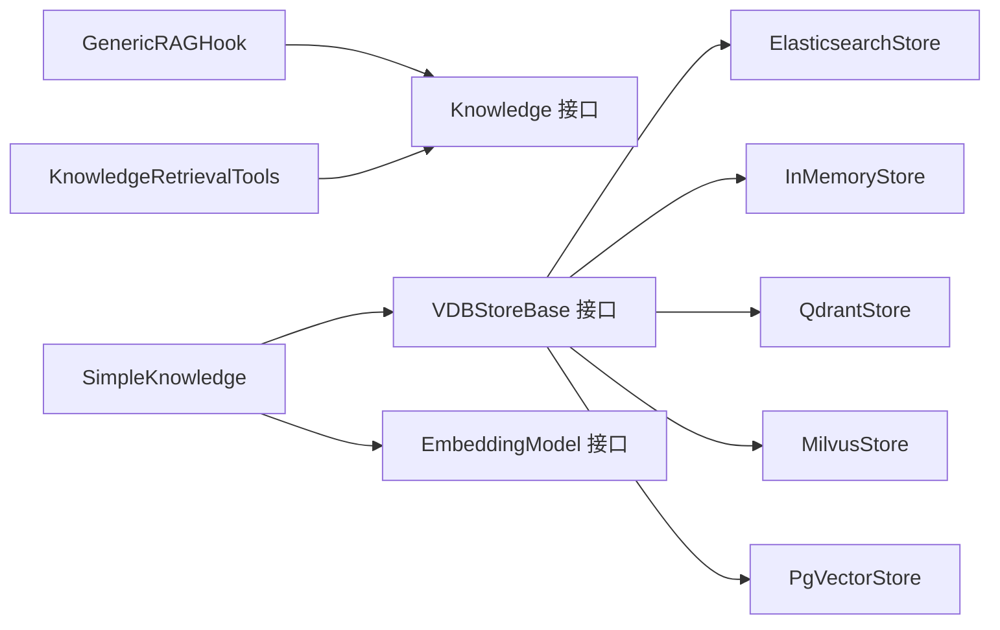

# RAG 系统

<cite>
**本文引用的文件**
- [Knowledge.java](file://agentscope-core/src/main/java/io/agentscope/core/rag/Knowledge.java)
- [RAGMode.java](file://agentscope-core/src/main/java/io/agentscope/core/rag/RAGMode.java)
- [GenericRAGHook.java](file://agentscope-core/src/main/java/io/agentscope/core/rag/GenericRAGHook.java)
- [KnowledgeRetrievalTools.java](file://agentscope-core/src/main/java/io/agentscope/core/rag/KnowledgeRetrievalTools.java)
- [Document.java](file://agentscope-core/src/main/java/io/agentscope/core/rag/model/Document.java)
- [DocumentMetadata.java](file://agentscope-core/src/main/java/io/agentscope/core/rag/model/DocumentMetadata.java)
- [RetrieveConfig.java](file://agentscope-core/src/main/java/io/agentscope/core/rag/model/RetrieveConfig.java)
- [SimpleKnowledge.java](file://agentscope-extensions/agentscope-extensions-rag-simple/src/main/java/io/agentscope/core/rag/knowledge/SimpleKnowledge.java)
- [VDBStoreBase.java](file://agentscope-extensions/agentscope-extensions-rag-simple/src/main/java/io/agentscope/core/rag/store/VDBStoreBase.java)
- [ElasticsearchRAGExample.java](file://agentscope-examples/advanced/src/main/java/io/agentscope/examples/advanced/ElasticsearchRAGExample.java)
- [RAGExample.java](file://agentscope-examples/advanced/src/main/java/io/agentscope/examples/advanced/RAGExample.java)
- [BailianRAGExample.java](file://agentscope-examples/advanced/src/main/java/io/agentscope/examples/advanced/BailianRAGExample.java)
</cite>

## 目录
1. [简介](#简介)
2. [项目结构](#项目结构)
3. [核心组件](#核心组件)
4. [架构总览](#架构总览)
5. [组件详解](#组件详解)
6. [依赖关系分析](#依赖关系分析)
7. [性能考量](#性能考量)
8. [故障排查指南](#故障排查指南)
9. [结论](#结论)
10. [附录](#附录)

## 简介
本文件面向 AgentScope Java 框架的检索增强生成（RAG）系统，系统性阐述其整体架构与工作流程，重点覆盖以下方面：
- 知识库接口与实现：统一知识库接口、嵌入与向量存储的组合、文档与元数据模型
- 检索模式：通用模式（Generic）与代理主导模式（Agentic）的差异与适用场景
- 通用 RAG 钩子：自动在推理前注入检索到的上下文
- 知识检索工具：代理主动调用的检索工具，支持对话历史上下文感知
- 检索算法与优化：嵌入生成、相似度搜索、阈值过滤与排序
- 向量数据库与搜索引擎集成：内存、Elasticsearch、以及扩展生态（如 Bailian、Dify、Haystack、RAGFlow）
- 实际应用案例：从本地示例到企业级集成

## 项目结构
RAG 相关代码主要分布在核心模块与扩展模块中：
- 核心 RAG 抽象与钩子：agentscope-core 中的 rag 包
- 数据模型：agentscope-core 的 rag.model 包
- 简单知识库与向量存储接口：agentscope-extensions-rag-simple 的 rag.knowledge 与 rag.store 包
- 示例：agentscope-examples 的 advanced 包中包含多类 RAG 示例

图表来源
- [Knowledge.java:30-54](file://agentscope-core/src/main/java/io/agentscope/core/rag/Knowledge.java#L30-L54)
- [RAGMode.java:28-52](file://agentscope-core/src/main/java/io/agentscope/core/rag/RAGMode.java#L28-L52)
- [GenericRAGHook.java:65-104](file://agentscope-core/src/main/java/io/agentscope/core/rag/GenericRAGHook.java#L65-L104)
- [KnowledgeRetrievalTools.java:52-90](file://agentscope-core/src/main/java/io/agentscope/core/rag/KnowledgeRetrievalTools.java#L52-L90)
- [Document.java:34-56](file://agentscope-core/src/main/java/io/agentscope/core/rag/model/Document.java#L34-L56)
- [DocumentMetadata.java:52-105](file://agentscope-core/src/main/java/io/agentscope/core/rag/model/DocumentMetadata.java#L52-L105)
- [RetrieveConfig.java:28-40](file://agentscope-core/src/main/java/io/agentscope/core/rag/model/RetrieveConfig.java#L28-L40)
- [SimpleKnowledge.java:71-94](file://agentscope-extensions/agentscope-extensions-rag-simple/src/main/java/io/agentscope/core/rag/knowledge/SimpleKnowledge.java#L71-L94)
- [VDBStoreBase.java:39-66](file://agentscope-extensions/agentscope-extensions-rag-simple/src/main/java/io/agentscope/core/rag/store/VDBStoreBase.java#L39-L66)
- [RAGExample.java:41-95](file://agentscope-examples/advanced/src/main/java/io/agentscope/examples/advanced/RAGExample.java#L41-L95)
- [ElasticsearchRAGExample.java:45-124](file://agentscope-examples/advanced/src/main/java/io/agentscope/examples/advanced/ElasticsearchRAGExample.java#L45-L124)
- [BailianRAGExample.java:29-71](file://agentscope-examples/advanced/src/main/java/io/agentscope/examples/advanced/BailianRAGExample.java#L29-L71)

章节来源
- [Knowledge.java:30-54](file://agentscope-core/src/main/java/io/agentscope/core/rag/Knowledge.java#L30-L54)
- [RAGMode.java:28-52](file://agentscope-core/src/main/java/io/agentscope/core/rag/RAGMode.java#L28-L52)
- [GenericRAGHook.java:65-104](file://agentscope-core/src/main/java/io/agentscope/core/rag/GenericRAGHook.java#L65-L104)
- [KnowledgeRetrievalTools.java:52-90](file://agentscope-core/src/main/java/io/agentscope/core/rag/KnowledgeRetrievalTools.java#L52-L90)
- [Document.java:34-56](file://agentscope-core/src/main/java/io/agentscope/core/rag/model/Document.java#L34-L56)
- [DocumentMetadata.java:52-105](file://agentscope-core/src/main/java/io/agentscope/core/rag/model/DocumentMetadata.java#L52-L105)
- [RetrieveConfig.java:28-40](file://agentscope-core/src/main/java/io/agentscope/core/rag/model/RetrieveConfig.java#L28-L40)
- [SimpleKnowledge.java:71-94](file://agentscope-extensions/agentscope-extensions-rag-simple/src/main/java/io/agentscope/core/rag/knowledge/SimpleKnowledge.java#L71-L94)
- [VDBStoreBase.java:39-66](file://agentscope-extensions/agentscope-extensions-rag-simple/src/main/java/io/agentscope/core/rag/store/VDBStoreBase.java#L39-L66)
- [RAGExample.java:41-95](file://agentscope-examples/advanced/src/main/java/io/agentscope/examples/advanced/RAGExample.java#L41-L95)
- [ElasticsearchRAGExample.java:45-124](file://agentscope-examples/advanced/src/main/java/io/agentscope/examples/advanced/ElasticsearchRAGExample.java#L45-L124)
- [BailianRAGExample.java:29-71](file://agentscope-examples/advanced/src/main/java/io/agentscope/examples/advanced/BailianRAGExample.java#L29-L71)

## 核心组件
- 知识库接口 Knowledge：定义添加文档与检索文档的标准能力，屏蔽底层嵌入模型与向量存储细节
- 检索模式 RAGMode：提供三种模式选择，决定何时以及如何触发检索
- 通用 RAG 钩子 GenericRAGHook：在每次推理前自动提取用户问题、检索相关文档并注入上下文
- 知识检索工具 KnowledgeRetrievalTools：以工具形式暴露检索能力，让代理自主决策何时检索
- 文档与元数据模型：Document、DocumentMetadata 描述文档内容、分片标识与自定义负载
- 检索配置 RetrieveConfig：限制返回数量、相似度阈值、向量集名称与对话历史上下文
- 简单知识库 SimpleKnowledge：整合嵌入模型与向量存储，完成“嵌入→入库→检索→过滤→排序”的完整链路
- 向量存储接口 VDBStoreBase：抽象向量数据库的统一存取能力

章节来源
- [Knowledge.java:30-54](file://agentscope-core/src/main/java/io/agentscope/core/rag/Knowledge.java#L30-L54)
- [RAGMode.java:28-52](file://agentscope-core/src/main/java/io/agentscope/core/rag/RAGMode.java#L28-L52)
- [GenericRAGHook.java:65-104](file://agentscope-core/src/main/java/io/agentscope/core/rag/GenericRAGHook.java#L65-L104)
- [KnowledgeRetrievalTools.java:52-90](file://agentscope-core/src/main/java/io/agentscope/core/rag/KnowledgeRetrievalTools.java#L52-L90)
- [Document.java:34-56](file://agentscope-core/src/main/java/io/agentscope/core/rag/model/Document.java#L34-L56)
- [DocumentMetadata.java:52-105](file://agentscope-core/src/main/java/io/agentscope/core/rag/model/DocumentMetadata.java#L52-L105)
- [RetrieveConfig.java:28-40](file://agentscope-core/src/main/java/io/agentscope/core/rag/model/RetrieveConfig.java#L28-L40)
- [SimpleKnowledge.java:71-94](file://agentscope-extensions/agentscope-extensions-rag-simple/src/main/java/io/agentscope/core/rag/knowledge/SimpleKnowledge.java#L71-L94)
- [VDBStoreBase.java:39-66](file://agentscope-extensions/agentscope-extensions-rag-simple/src/main/java/io/agentscope/core/rag/store/VDBStoreBase.java#L39-L66)

## 架构总览
下图展示 RAG 系统在框架内的协作关系：代理通过两种模式与知识库交互；知识库内部结合嵌入模型与向量存储完成检索；钩子与工具分别承担自动注入与主动检索。

图表来源
- [GenericRAGHook.java:106-162](file://agentscope-core/src/main/java/io/agentscope/core/rag/GenericRAGHook.java#L106-L162)
- [KnowledgeRetrievalTools.java:114-158](file://agentscope-core/src/main/java/io/agentscope/core/rag/KnowledgeRetrievalTools.java#L114-L158)
- [Knowledge.java:30-54](file://agentscope-core/src/main/java/io/agentscope/core/rag/Knowledge.java#L30-L54)
- [SimpleKnowledge.java:71-94](file://agentscope-extensions/agentscope-extensions-rag-simple/src/main/java/io/agentscope/core/rag/knowledge/SimpleKnowledge.java#L71-L94)
- [VDBStoreBase.java:39-66](file://agentscope-extensions/agentscope-extensions-rag-simple/src/main/java/io/agentscope/core/rag/store/VDBStoreBase.java#L39-L66)

## 组件详解

### 通用 RAG 钩子（GenericRAGHook）
- 触发时机：拦截预调用事件（PreCallEvent），在推理前执行
- 查询提取：从消息列表中回溯定位最近一次用户消息作为查询
- 检索与注入：调用知识库检索，将结果格式化为用户消息注入到输入消息末尾
- 容错处理：检索失败仅记录告警，不中断推理流程
- 默认配置：默认检索上限与阈值可定制

图表来源
- [GenericRAGHook.java:106-162](file://agentscope-core/src/main/java/io/agentscope/core/rag/GenericRAGHook.java#L106-L162)
- [SimpleKnowledge.java:134-174](file://agentscope-extensions/agentscope-extensions-rag-simple/src/main/java/io/agentscope/core/rag/knowledge/SimpleKnowledge.java#L134-L174)

章节来源
- [GenericRAGHook.java:65-104](file://agentscope-core/src/main/java/io/agentscope/core/rag/GenericRAGHook.java#L65-L104)
- [GenericRAGHook.java:106-162](file://agentscope-core/src/main/java/io/agentscope/core/rag/GenericRAGHook.java#L106-L162)
- [GenericRAGHook.java:173-229](file://agentscope-core/src/main/java/io/agentscope/core/rag/GenericRAGHook.java#L173-L229)

### 知识检索工具（KnowledgeRetrievalTools）
- 工具注册：通过工具包注册为代理可用的工具函数
- 参数与行为：支持查询词、最大返回数、自动注入对话历史（ReActAgent 内存）
- 返回格式：将检索到的文档与分数格式化为可读字符串，便于代理推理
- 错误处理：检索异常时返回错误提示，保持代理流程稳定

图表来源
- [KnowledgeRetrievalTools.java:114-158](file://agentscope-core/src/main/java/io/agentscope/core/rag/KnowledgeRetrievalTools.java#L114-L158)

章节来源
- [KnowledgeRetrievalTools.java:52-90](file://agentscope-core/src/main/java/io/agentscope/core/rag/KnowledgeRetrievalTools.java#L52-L90)
- [KnowledgeRetrievalTools.java:114-158](file://agentscope-core/src/main/java/io/agentscope/core/rag/KnowledgeRetrievalTools.java#L114-L158)
- [KnowledgeRetrievalTools.java:169-188](file://agentscope-core/src/main/java/io/agentscope/core/rag/KnowledgeRetrievalTools.java#L169-L188)

### 知识库接口与简单实现（SimpleKnowledge）
- 添加文档：从文档元数据提取内容块，生成嵌入，批量写入向量存储
- 检索流程：将查询文本嵌入，向向量存储发起相似度搜索，按阈值过滤并按分数降序排序
- 可插拔设计：通过嵌入模型与向量存储接口解耦，便于替换不同后端

图表来源
- [Knowledge.java:30-54](file://agentscope-core/src/main/java/io/agentscope/core/rag/Knowledge.java#L30-L54)
- [SimpleKnowledge.java:71-94](file://agentscope-extensions/agentscope-extensions-rag-simple/src/main/java/io/agentscope/core/rag/knowledge/SimpleKnowledge.java#L71-L94)
- [VDBStoreBase.java:39-66](file://agentscope-extensions/agentscope-extensions-rag-simple/src/main/java/io/agentscope/core/rag/store/VDBStoreBase.java#L39-L66)

章节来源
- [SimpleKnowledge.java:96-132](file://agentscope-extensions/agentscope-extensions-rag-simple/src/main/java/io/agentscope/core/rag/knowledge/SimpleKnowledge.java#L96-L132)
- [SimpleKnowledge.java:134-174](file://agentscope-extensions/agentscope-extensions-rag-simple/src/main/java/io/agentscope/core/rag/knowledge/SimpleKnowledge.java#L134-L174)

### 数据模型与检索配置
- 文档 Document：包含唯一 ID、元数据、嵌入向量、相似度分数与向量集名称
- 文档元数据 DocumentMetadata：封装内容块、文档/分片 ID 与自定义负载（键值对）
- 检索配置 RetrieveConfig：限制返回条数、相似度阈值、向量集名与对话历史

图表来源
- [Document.java:34-56](file://agentscope-core/src/main/java/io/agentscope/core/rag/model/Document.java#L34-L56)
- [DocumentMetadata.java:52-105](file://agentscope-core/src/main/java/io/agentscope/core/rag/model/DocumentMetadata.java#L52-L105)
- [RetrieveConfig.java:28-40](file://agentscope-core/src/main/java/io/agentscope/core/rag/model/RetrieveConfig.java#L28-L40)

章节来源
- [Document.java:34-56](file://agentscope-core/src/main/java/io/agentscope/core/rag/model/Document.java#L34-L56)
- [DocumentMetadata.java:52-105](file://agentscope-core/src/main/java/io/agentscope/core/rag/model/DocumentMetadata.java#L52-L105)
- [RetrieveConfig.java:28-40](file://agentscope-core/src/main/java/io/agentscope/core/rag/model/RetrieveConfig.java#L28-L40)

### 检索模式（RAGMode）
- 通用模式（GENERIC）：每次推理前自动检索并注入上下文，适合需要持续增强回答准确性的场景
- 代理主导（AGENTIC）：由代理自行决定何时检索，适合复杂任务或需要控制检索时机的场景
- 关闭（NONE）：禁用 RAG 功能

章节来源
- [RAGMode.java:28-52](file://agentscope-core/src/main/java/io/agentscope/core/rag/RAGMode.java#L28-L52)

### 实际应用案例
- 基础示例（RAGExample）：演示通用与代理主导两种模式，使用内存向量存储
- Elasticsearch 集成（ElasticsearchRAGExample）：展示如何替换向量存储为 Elasticsearch，完成文档索引与检索
- Bailian 集成（BailianRAGExample）：演示接入第三方知识库服务，结合对话历史进行检索

章节来源
- [RAGExample.java:41-95](file://agentscope-examples/advanced/src/main/java/io/agentscope/examples/advanced/RAGExample.java#L41-L95)
- [RAGExample.java:154-189](file://agentscope-examples/advanced/src/main/java/io/agentscope/examples/advanced/RAGExample.java#L154-L189)
- [RAGExample.java:197-230](file://agentscope-examples/advanced/src/main/java/io/agentscope/examples/advanced/RAGExample.java#L197-L230)
- [ElasticsearchRAGExample.java:45-124](file://agentscope-examples/advanced/src/main/java/io/agentscope/examples/advanced/ElasticsearchRAGExample.java#L45-L124)
- [ElasticsearchRAGExample.java:173-206](file://agentscope-examples/advanced/src/main/java/io/agentscope/examples/advanced/ElasticsearchRAGExample.java#L173-L206)
- [BailianRAGExample.java:29-71](file://agentscope-examples/advanced/src/main/java/io/agentscope/examples/advanced/BailianRAGExample.java#L29-L71)

## 依赖关系分析
- 组件内聚与耦合
  - SimpleKnowledge 将嵌入模型与向量存储解耦，通过 VDBStoreBase 接口实现可替换性
  - GenericRAGHook 与 Knowledge 接口耦合，确保检索逻辑与注入策略可复用
  - KnowledgeRetrievalTools 与 Knowledge 接口耦合，提供工具化的检索入口
- 外部依赖与集成点
  - 嵌入模型：可替换为 DashScope、Ollama 等
  - 向量存储：内存、Elasticsearch、Qdrant、Milvus、PgVector 等
  - 第三方知识库：Bailian、Dify、Haystack、RAGFlow 等（通过扩展模块）

图表来源
- [GenericRAGHook.java:65-104](file://agentscope-core/src/main/java/io/agentscope/core/rag/GenericRAGHook.java#L65-L104)
- [KnowledgeRetrievalTools.java:52-90](file://agentscope-core/src/main/java/io/agentscope/core/rag/KnowledgeRetrievalTools.java#L52-L90)
- [SimpleKnowledge.java:71-94](file://agentscope-extensions/agentscope-extensions-rag-simple/src/main/java/io/agentscope/core/rag/knowledge/SimpleKnowledge.java#L71-L94)
- [VDBStoreBase.java:39-66](file://agentscope-extensions/agentscope-extensions-rag-simple/src/main/java/io/agentscope/core/rag/store/VDBStoreBase.java#L39-L66)

章节来源
- [SimpleKnowledge.java:71-94](file://agentscope-extensions/agentscope-extensions-rag-simple/src/main/java/io/agentscope/core/rag/knowledge/SimpleKnowledge.java#L71-L94)
- [VDBStoreBase.java:39-66](file://agentscope-extensions/agentscope-extensions-rag-simple/src/main/java/io/agentscope/core/rag/store/VDBStoreBase.java#L39-L66)

## 性能考量
- 嵌入与检索管线
  - 批量处理：addDocuments 使用响应式流批量嵌入与入库，减少网络往返
  - 相似度搜索：优先使用向量存储的原生相似度计算，避免二次计算
  - 过滤与排序：先阈值过滤再排序，降低下游处理开销
- 配置优化
  - 限制返回条数（limit）与设置合理阈值（scoreThreshold），平衡召回与质量
  - 对支持多轮对话的后端（如 Bailian），利用对话历史提升检索相关性
- 存储与索引
  - 选择合适的向量维度与索引类型，结合业务规模评估内存与磁盘占用
  - Elasticsearch 可利用 kNN 近似搜索与分片副本提升吞吐与可用性
- 错误与可观测性
  - 钩子与工具均具备容错策略，建议在生产环境记录检索耗时与命中率指标

## 故障排查指南
- 常见问题
  - 知识库为空：确认已成功添加文档并完成嵌入与入库
  - 检索结果为空：检查阈值设置是否过高，或查询文本是否过短
  - 钩子未生效：确认代理处于通用模式且钩子优先级设置合理
  - 工具调用失败：检查知识库实例与默认配置是否正确初始化
- 排查步骤
  - 在检索前后打印查询与返回条数，验证检索链路
  - 检查嵌入模型与向量存储连接状态与认证信息
  - 对比不同阈值与返回条数下的效果，逐步收敛最优配置
- 日志与监控
  - 记录检索耗时、命中率、异常次数等指标，辅助容量规划与问题定位

章节来源
- [GenericRAGHook.java:156-161](file://agentscope-core/src/main/java/io/agentscope/core/rag/GenericRAGHook.java#L156-L161)
- [KnowledgeRetrievalTools.java:153-157](file://agentscope-core/src/main/java/io/agentscope/core/rag/KnowledgeRetrievalTools.java#L153-L157)

## 结论
AgentScope Java 的 RAG 系统通过清晰的接口与可插拔设计，实现了从文档嵌入、索引到检索与上下文注入的完整闭环。通用模式与代理主导模式满足不同业务需求，配合多样化的向量存储与第三方知识库集成，既适用于快速原型开发，也可支撑企业级应用的高可用与高性能要求。建议在生产环境中结合业务场景优化检索配置、完善监控与容错策略，并根据数据规模与延迟目标选择合适的向量存储与索引策略。

## 附录
- 检索算法与优化要点
  - 嵌入生成：选择与任务匹配的嵌入模型，确保语义空间适配
  - 相似度计算：余弦相似度或点积，结合向量归一化
  - 过滤与排序：阈值过滤 + 分数排序，控制输出规模
  - 上下文注入：将检索结果结构化注入到提示词中，避免冗长文本影响模型效率
- 企业级部署与运维建议
  - 弹性伸缩：向量存储与嵌入服务需具备水平扩展能力
  - 数据治理：规范文档元数据与负载字段，保障检索一致性
  - 安全与合规：对敏感数据进行脱敏与访问控制
  - 版本演进：通过配置与接口升级平滑迁移不同向量存储与知识库服务