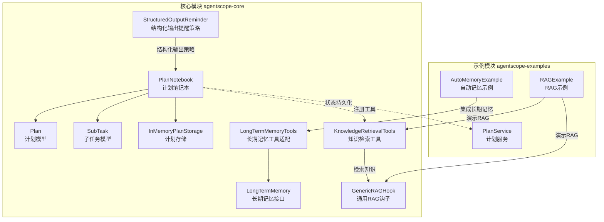
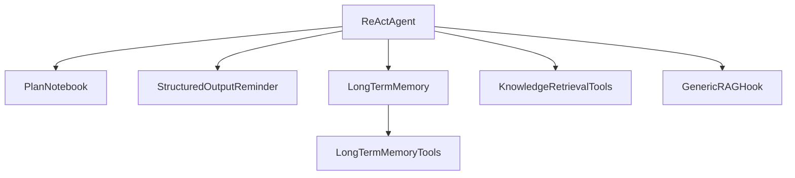
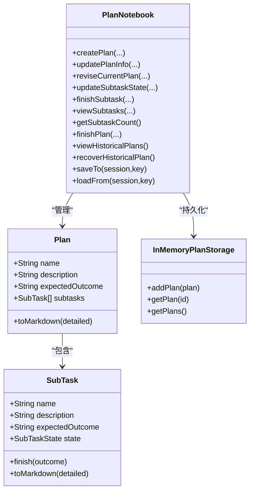
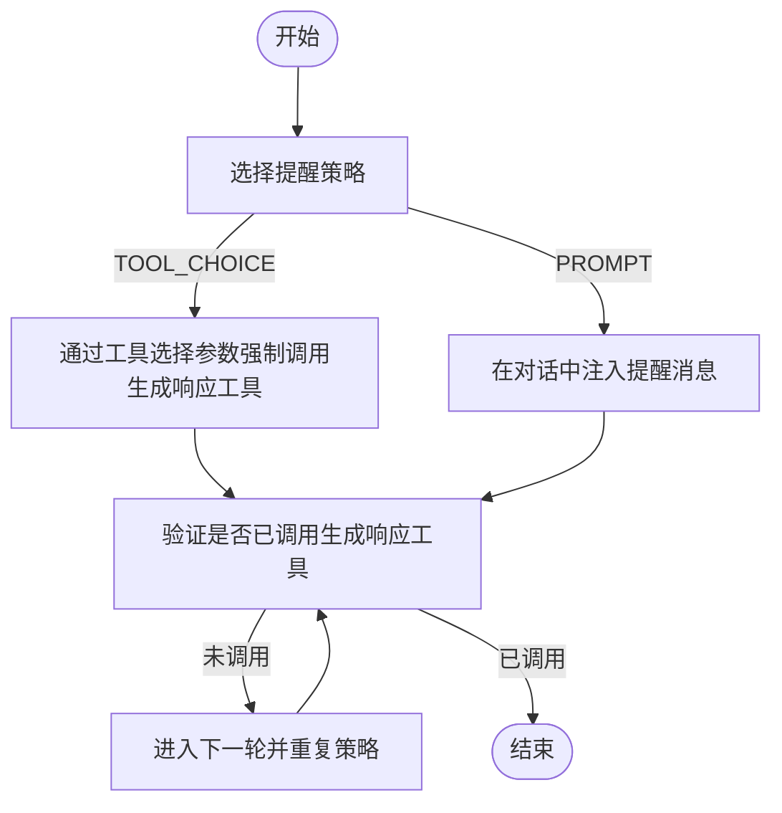
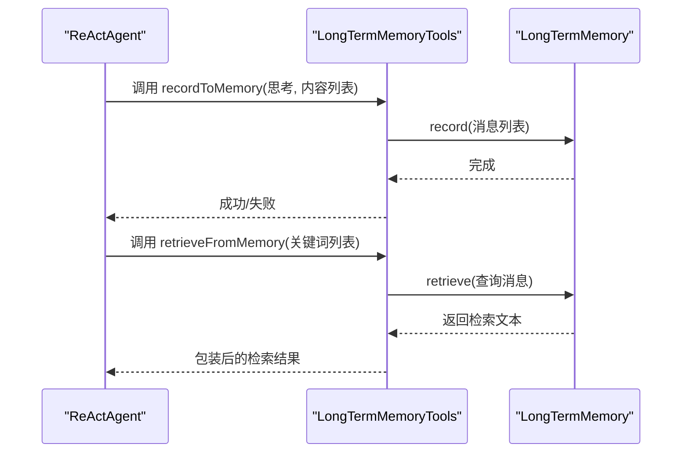
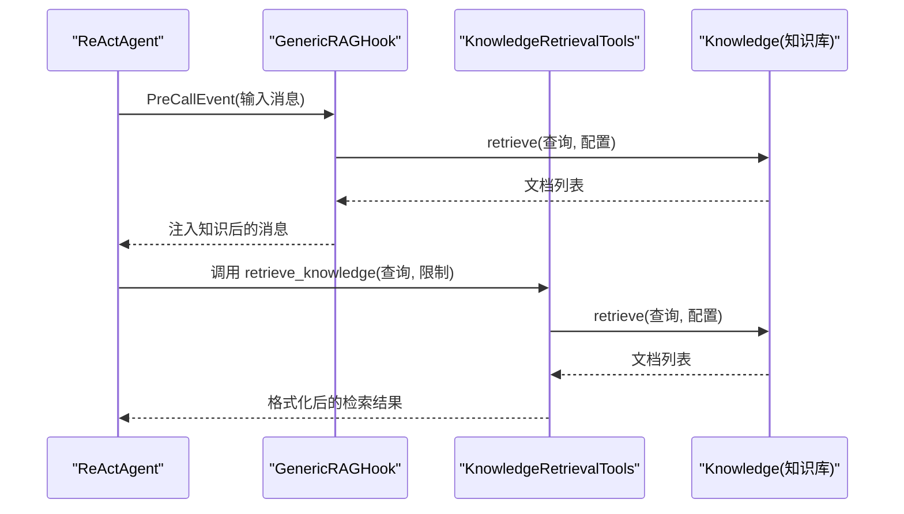
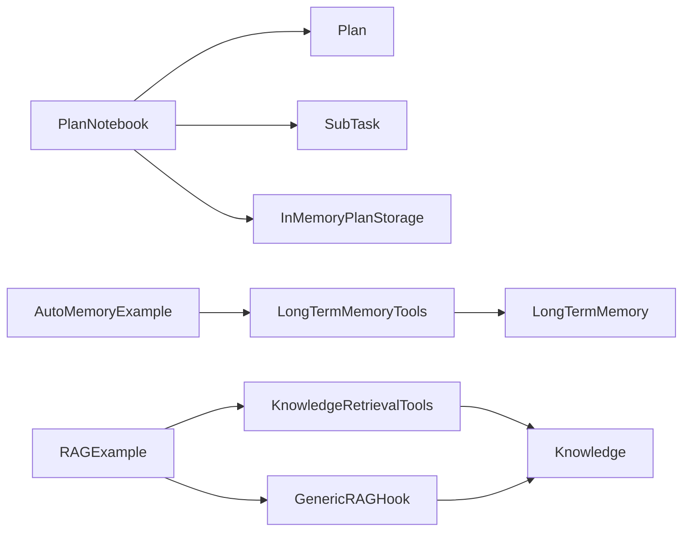

# 内置工具系统

<cite>
**本文引用的文件**
- [PlanNotebook.java](file://agentscope-core/src/main/java/io/agentscope/core/plan/PlanNotebook.java)
- [Plan.java](file://agentscope-core/src/main/java/io/agentscope/core/plan/model/Plan.java)
- [SubTask.java](file://agentscope-core/src/main/java/io/agentscope/core/plan/model/SubTask.java)
- [InMemoryPlanStorage.java](file://agentscope-core/src/main/java/io/agentscope/core/plan/storage/InMemoryPlanStorage.java)
- [StructuredOutputReminder.java](file://agentscope-core/src/main/java/io/agentscope/core/model/StructuredOutputReminder.java)
- [LongTermMemory.java](file://agentscope-core/src/main/java/io/agentscope/core/memory/LongTermMemory.java)
- [LongTermMemoryTools.java](file://agentscope-core/src/main/java/io/agentscope/core/memory/LongTermMemoryTools.java)
- [KnowledgeRetrievalTools.java](file://agentscope-core/src/main/java/io/agentscope/core/rag/KnowledgeRetrievalTools.java)
- [GenericRAGHook.java](file://agentscope-core/src/main/java/io/agentscope/core/rag/GenericRAGHook.java)
- [PlanService.java](file://agentscope-examples/plan-notebook/src/main/java/io/agentscope/examples/plannotebook/service/PlanService.java)
- [AutoMemoryExample.java](file://agentscope-examples/advanced/src/main/java/io/agentscope/examples/advanced/AutoMemoryExample.java)
- [RAGExample.java](file://agentscope-examples/advanced/src/main/java/io/agentscope/examples/advanced/RAGExample.java)
</cite>

## 目录
1. [简介](#简介)
2. [项目结构](#项目结构)
3. [核心组件](#核心组件)
4. [架构总览](#架构总览)
5. [详细组件分析](#详细组件分析)
6. [依赖分析](#依赖分析)
7. [性能考虑](#性能考虑)
8. [故障排查指南](#故障排查指南)
9. [结论](#结论)
10. [附录](#附录)

## 简介
本章节面向 AgentScope Java 框架的内置工具系统，聚焦四大核心能力：PlanNotebook（计划笔记本）、Structured Output（结构化输出）、Long-term Memory（长期记忆）、RAG（检索增强生成）。我们将从实现细节、配置选项、使用示例到协同工作机制进行系统性阐述，帮助读者快速理解并高效应用这些工具以提升代理的智能化水平。

## 项目结构
围绕四大工具，核心代码位于 agentscope-core 模块中，示例位于 agentscope-examples 模块中。下图展示与本文相关的模块与文件映射关系：

**图表来源**
- [PlanNotebook.java:104-255](file://agentscope-core/src/main/java/io/agentscope/core/plan/PlanNotebook.java#L104-L255)
- [Plan.java:45-284](file://agentscope-core/src/main/java/io/agentscope/core/plan/model/Plan.java#L45-L284)
- [SubTask.java:44-287](file://agentscope-core/src/main/java/io/agentscope/core/plan/model/SubTask.java#L44-L287)
- [InMemoryPlanStorage.java:32-70](file://agentscope-core/src/main/java/io/agentscope/core/plan/storage/InMemoryPlanStorage.java#L32-L70)
- [LongTermMemory.java:67-108](file://agentscope-core/src/main/java/io/agentscope/core/memory/LongTermMemory.java#L67-L108)
- [LongTermMemoryTools.java:65-214](file://agentscope-core/src/main/java/io/agentscope/core/memory/LongTermMemoryTools.java#L65-L214)
- [KnowledgeRetrievalTools.java:52-208](file://agentscope-core/src/main/java/io/agentscope/core/rag/KnowledgeRetrievalTools.java#L52-L208)
- [GenericRAGHook.java:65-249](file://agentscope-core/src/main/java/io/agentscope/core/rag/GenericRAGHook.java#L65-L249)
- [StructuredOutputReminder.java:25-52](file://agentscope-core/src/main/java/io/agentscope/core/model/StructuredOutputReminder.java#L25-L52)
- [PlanService.java:34-168](file://agentscope-examples/plan-notebook/src/main/java/io/agentscope/examples/plannotebook/service/PlanService.java#L34-L168)
- [AutoMemoryExample.java:43-144](file://agentscope-examples/advanced/src/main/java/io/agentscope/examples/advanced/AutoMemoryExample.java#L43-L144)
- [RAGExample.java:41-232](file://agentscope-examples/advanced/src/main/java/io/agentscope/examples/advanced/RAGExample.java#L41-L232)

**章节来源**
- [PlanNotebook.java:104-255](file://agentscope-core/src/main/java/io/agentscope/core/plan/PlanNotebook.java#L104-L255)
- [Plan.java:45-284](file://agentscope-core/src/main/java/io/agentscope/core/plan/model/Plan.java#L45-L284)
- [SubTask.java:44-287](file://agentscope-core/src/main/java/io/agentscope/core/plan/model/SubTask.java#L44-L287)
- [InMemoryPlanStorage.java:32-70](file://agentscope-core/src/main/java/io/agentscope/core/plan/storage/InMemoryPlanStorage.java#L32-L70)
- [LongTermMemory.java:67-108](file://agentscope-core/src/main/java/io/agentscope/core/memory/LongTermMemory.java#L67-L108)
- [LongTermMemoryTools.java:65-214](file://agentscope-core/src/main/java/io/agentscope/core/memory/LongTermMemoryTools.java#L65-L214)
- [KnowledgeRetrievalTools.java:52-208](file://agentscope-core/src/main/java/io/agentscope/core/rag/KnowledgeRetrievalTools.java#L52-L208)
- [GenericRAGHook.java:65-249](file://agentscope-core/src/main/java/io/agentscope/core/rag/GenericRAGHook.java#L65-L249)
- [StructuredOutputReminder.java:25-52](file://agentscope-core/src/main/java/io/agentscope/core/model/StructuredOutputReminder.java#L25-L52)
- [PlanService.java:34-168](file://agentscope-examples/plan-notebook/src/main/java/io/agentscope/examples/plannotebook/service/PlanService.java#L34-L168)
- [AutoMemoryExample.java:43-144](file://agentscope-examples/advanced/src/main/java/io/agentscope/examples/advanced/AutoMemoryExample.java#L43-L144)
- [RAGExample.java:41-232](file://agentscope-examples/advanced/src/main/java/io/agentscope/examples/advanced/RAGExample.java#L41-L232)

## 核心组件
- 计划笔记本（PlanNotebook）
  - 提供计划创建、修订、子任务状态管理、完成标记、历史计划查看与恢复等工具函数，支持提示注入、状态持久化与并发安全存储。
- 结构化输出（Structured Output）
  - 通过 StructuredOutputReminder 控制“强制调用生成响应工具”的策略，确保模型在需要时返回类型安全的结构化结果。
- 长期记忆（Long-term Memory）
  - LongTermMemory 接口定义记录与检索能力；LongTermMemoryTools 将其适配为可由代理调用的工具，便于在对话中记忆与回溯重要信息。
- 检索增强生成（RAG）
  - KnowledgeRetrievalTools 提供代理主动检索工具；GenericRAGHook 在推理前自动注入检索到的知识，形成“通用RAG模式”。

**章节来源**
- [PlanNotebook.java:44-103](file://agentscope-core/src/main/java/io/agentscope/core/plan/PlanNotebook.java#L44-L103)
- [StructuredOutputReminder.java:25-52](file://agentscope-core/src/main/java/io/agentscope/core/model/StructuredOutputReminder.java#L25-L52)
- [LongTermMemory.java:67-108](file://agentscope-core/src/main/java/io/agentscope/core/memory/LongTermMemory.java#L67-L108)
- [LongTermMemoryTools.java:65-214](file://agentscope-core/src/main/java/io/agentscope/core/memory/LongTermMemoryTools.java#L65-L214)
- [KnowledgeRetrievalTools.java:52-208](file://agentscope-core/src/main/java/io/agentscope/core/rag/KnowledgeRetrievalTools.java#L52-L208)
- [GenericRAGHook.java:65-249](file://agentscope-core/src/main/java/io/agentscope/core/rag/GenericRAGHook.java#L65-L249)

## 架构总览
四大工具在框架中的协作路径如下：PlanNotebook 负责任务分解与跟踪；Structured Output 确保响应格式可控；Long-term Memory 提供跨会话上下文；RAG 在需要时注入外部知识。它们既可独立使用，也可组合使用以提升智能体的规划、记忆与检索能力。

**图表来源**
- [PlanNotebook.java:104-255](file://agentscope-core/src/main/java/io/agentscope/core/plan/PlanNotebook.java#L104-L255)
- [StructuredOutputReminder.java:25-52](file://agentscope-core/src/main/java/io/agentscope/core/model/StructuredOutputReminder.java#L25-L52)
- [LongTermMemory.java:67-108](file://agentscope-core/src/main/java/io/agentscope/core/memory/LongTermMemory.java#L67-L108)
- [LongTermMemoryTools.java:65-214](file://agentscope-core/src/main/java/io/agentscope/core/memory/LongTermMemoryTools.java#L65-L214)
- [KnowledgeRetrievalTools.java:52-208](file://agentscope-core/src/main/java/io/agentscope/core/rag/KnowledgeRetrievalTools.java#L52-L208)
- [GenericRAGHook.java:65-249](file://agentscope-core/src/main/java/io/agentscope/core/rag/GenericRAGHook.java#L65-L249)

## 详细组件分析

### 计划笔记本（PlanNotebook）
- 功能要点
  - 工具函数：创建计划、更新计划信息、修订当前计划（增删改子任务）、更新子任务状态、完成子任务、查看子任务、统计数量、结束或放弃计划、查看历史计划、恢复历史计划。
  - 提示注入：基于 PlanToHint 将当前计划转换为系统提示，在每次推理前注入，指导执行。
  - 存储与持久化：默认使用 InMemoryPlanStorage，支持键前缀隔离多实例；状态保存于会话中。
  - 状态机：子任务状态包含 TODO、IN_PROGRESS、DONE、ABANDONED；严格的状态流转校验（如 IN_PROGRESS 前置条件与互斥）。
- 关键数据模型
  - Plan：包含名称、描述、预期结果、子任务列表及生命周期字段。
  - SubTask：包含名称、描述、预期结果、状态、时间戳与完成结果。
- 配置项
  - planToHint：计划转提示策略，默认 DefaultPlanToHint。
  - storage：计划存储实现，默认 InMemoryPlanStorage。
  - maxSubtasks：单计划最大子任务数（可空表示不限制）。
  - needUserConfirm：是否在提示中加入“等待用户确认”规则。
  - keyPrefix：状态存储键前缀，用于多实例共存。
- 使用示例
  - 通过 PlanNotebook.builder(...) 构建，再注入到 ReActAgent 中；或直接启用 enablePlan()。
  - 示例：示例工程 PlanService 展示了通过 HTTP 接口驱动 PlanNotebook 的典型流程。

**图表来源**
- [PlanNotebook.java:104-255](file://agentscope-core/src/main/java/io/agentscope/core/plan/PlanNotebook.java#L104-L255)
- [Plan.java:45-284](file://agentscope-core/src/main/java/io/agentscope/core/plan/model/Plan.java#L45-L284)
- [SubTask.java:44-287](file://agentscope-core/src/main/java/io/agentscope/core/plan/model/SubTask.java#L44-L287)
- [InMemoryPlanStorage.java:32-70](file://agentscope-core/src/main/java/io/agentscope/core/plan/storage/InMemoryPlanStorage.java#L32-L70)

**章节来源**
- [PlanNotebook.java:44-103](file://agentscope-core/src/main/java/io/agentscope/core/plan/PlanNotebook.java#L44-L103)
- [PlanNotebook.java:177-255](file://agentscope-core/src/main/java/io/agentscope/core/plan/PlanNotebook.java#L177-L255)
- [Plan.java:45-284](file://agentscope-core/src/main/java/io/agentscope/core/plan/model/Plan.java#L45-L284)
- [SubTask.java:44-287](file://agentscope-core/src/main/java/io/agentscope/core/plan/model/SubTask.java#L44-L287)
- [InMemoryPlanStorage.java:32-70](file://agentscope-core/src/main/java/io/agentscope/core/plan/storage/InMemoryPlanStorage.java#L32-L70)
- [PlanService.java:34-168](file://agentscope-examples/plan-notebook/src/main/java/io/agentscope/examples/plannotebook/service/PlanService.java#L34-L168)

### 结构化输出（Structured Output）
- 功能要点
  - 通过 StructuredOutputReminder 控制“强制调用生成响应工具”的策略，避免模型遗漏结构化输出。
  - 提供 TOOL_CHOICE 与 PROMPT 两种策略：前者更高效，后者兼容旧式实现。
- 集成方式
  - 在模型调用链路中配合工具选择参数或提示注入，确保最终响应满足结构化要求。
- 适用场景
  - 需要稳定输出 JSON、表格或其他结构化格式的任务；减少后处理与解析成本。

**图表来源**
- [StructuredOutputReminder.java:25-52](file://agentscope-core/src/main/java/io/agentscope/core/model/StructuredOutputReminder.java#L25-L52)

**章节来源**
- [StructuredOutputReminder.java:25-52](file://agentscope-core/src/main/java/io/agentscope/core/model/StructuredOutputReminder.java#L25-L52)

### 长期记忆（Long-term Memory）
- 功能要点
  - LongTermMemory 接口定义 record(List<Msg>) 与 retrieve(Msg) 两个核心方法，分别用于记录与检索。
  - LongTermMemoryTools 将其适配为代理工具：recordToMemory(...) 与 retrieveFromMemory(...)，便于在对话中记忆与回溯。
  - 可通过模式控制（如 AGENT_CONTROL、STATIC_CONTROL、BOTH）决定框架是否自动调用。
- 典型用法
  - 在 ReActAgent 中配置 longTermMemory 与模式；AutoMemoryExample 展示了与自动上下文记忆的结合使用。

**图表来源**
- [LongTermMemoryTools.java:65-214](file://agentscope-core/src/main/java/io/agentscope/core/memory/LongTermMemoryTools.java#L65-L214)
- [LongTermMemory.java:67-108](file://agentscope-core/src/main/java/io/agentscope/core/memory/LongTermMemory.java#L67-L108)
- [AutoMemoryExample.java:72-86](file://agentscope-examples/advanced/src/main/java/io/agentscope/examples/advanced/AutoMemoryExample.java#L72-L86)

**章节来源**
- [LongTermMemory.java:67-108](file://agentscope-core/src/main/java/io/agentscope/core/memory/LongTermMemory.java#L67-L108)
- [LongTermMemoryTools.java:65-214](file://agentscope-core/src/main/java/io/agentscope/core/memory/LongTermMemoryTools.java#L65-L214)
- [AutoMemoryExample.java:72-86](file://agentscope-examples/advanced/src/main/java/io/agentscope/examples/advanced/AutoMemoryExample.java#L72-L86)

### 检索增强生成（RAG）
- 功能要点
  - Agentic 模式：通过 KnowledgeRetrievalTools 提供的 retrieve_knowledge 工具，由代理自主决定何时检索。
  - 通用（Generic）模式：通过 GenericRAGHook 在每次推理前自动提取用户查询并检索知识，注入到消息流中。
- 配置与使用
  - 默认检索限制与阈值可通过 RetrieveConfig 控制；示例 RAGExample 展示了两种模式的创建与交互。
- 协作关系
  - 与 PlanNotebook 结合：在复杂任务中，先由 PlanNotebook 分解步骤，再在需要时通过 RAG 获取外部知识支撑决策。

**图表来源**
- [GenericRAGHook.java:65-249](file://agentscope-core/src/main/java/io/agentscope/core/rag/GenericRAGHook.java#L65-L249)
- [KnowledgeRetrievalTools.java:52-208](file://agentscope-core/src/main/java/io/agentscope/core/rag/KnowledgeRetrievalTools.java#L52-L208)

**章节来源**
- [KnowledgeRetrievalTools.java:52-208](file://agentscope-core/src/main/java/io/agentscope/core/rag/KnowledgeRetrievalTools.java#L52-L208)
- [GenericRAGHook.java:65-249](file://agentscope-core/src/main/java/io/agentscope/core/rag/GenericRAGHook.java#L65-L249)
- [RAGExample.java:154-230](file://agentscope-examples/advanced/src/main/java/io/agentscope/examples/advanced/RAGExample.java#L154-L230)

## 依赖分析
- 组件耦合
  - PlanNotebook 依赖 Plan/ SubTask 数据模型与存储实现；通过 StateModule 接口与会话集成，具备良好的可扩展性。
  - LongTermMemoryTools 仅依赖 LongTermMemory 接口，职责清晰，便于替换具体实现。
  - KnowledgeRetrievalTools 与 GenericRAGHook 均依赖 Knowledge 接口，支持多种知识库实现。
- 外部依赖
  - 示例工程展示了与 DashScope、Mem0、向量存储等外部系统的对接方式。

**图表来源**
- [PlanNotebook.java:104-255](file://agentscope-core/src/main/java/io/agentscope/core/plan/PlanNotebook.java#L104-L255)
- [Plan.java:45-284](file://agentscope-core/src/main/java/io/agentscope/core/plan/model/Plan.java#L45-L284)
- [SubTask.java:44-287](file://agentscope-core/src/main/java/io/agentscope/core/plan/model/SubTask.java#L44-L287)
- [InMemoryPlanStorage.java:32-70](file://agentscope-core/src/main/java/io/agentscope/core/plan/storage/InMemoryPlanStorage.java#L32-L70)
- [LongTermMemoryTools.java:65-214](file://agentscope-core/src/main/java/io/agentscope/core/memory/LongTermMemoryTools.java#L65-L214)
- [LongTermMemory.java:67-108](file://agentscope-core/src/main/java/io/agentscope/core/memory/LongTermMemory.java#L67-L108)
- [KnowledgeRetrievalTools.java:52-208](file://agentscope-core/src/main/java/io/agentscope/core/rag/KnowledgeRetrievalTools.java#L52-L208)
- [GenericRAGHook.java:65-249](file://agentscope-core/src/main/java/io/agentscope/core/rag/GenericRAGHook.java#L65-L249)
- [AutoMemoryExample.java:43-144](file://agentscope-examples/advanced/src/main/java/io/agentscope/examples/advanced/AutoMemoryExample.java#L43-L144)
- [RAGExample.java:41-232](file://agentscope-examples/advanced/src/main/java/io/agentscope/examples/advanced/RAGExample.java#L41-L232)

**章节来源**
- [PlanNotebook.java:104-255](file://agentscope-core/src/main/java/io/agentscope/core/plan/PlanNotebook.java#L104-L255)
- [LongTermMemoryTools.java:65-214](file://agentscope-core/src/main/java/io/agentscope/core/memory/LongTermMemoryTools.java#L65-L214)
- [KnowledgeRetrievalTools.java:52-208](file://agentscope-core/src/main/java/io/agentscope/core/rag/KnowledgeRetrievalTools.java#L52-L208)
- [GenericRAGHook.java:65-249](file://agentscope-core/src/main/java/io/agentscope/core/rag/GenericRAGHook.java#L65-L249)
- [AutoMemoryExample.java:43-144](file://agentscope-examples/advanced/src/main/java/io/agentscope/examples/advanced/AutoMemoryExample.java#L43-L144)
- [RAGExample.java:41-232](file://agentscope-examples/advanced/src/main/java/io/agentscope/examples/advanced/RAGExample.java#L41-L232)

## 性能考虑
- 异步非阻塞
  - 所有核心方法均采用 Reactor Mono 类型，保证与框架的非阻塞集成，降低线程阻塞风险。
- 存储与并发
  - 计划存储默认使用并发安全的 Map 实现；生产环境建议替换为持久化存储以避免重启丢失。
- 检索效率
  - RAG 检索默认限制条数与阈值，可在 RetrieveConfig 中调整；建议根据业务规模与延迟目标进行权衡。
- 状态一致性
  - PlanNotebook 的状态变更通过钩子触发，确保 UI 或下游系统能及时感知变化；注意在高并发场景下的幂等性与一致性。

[本节为通用性能建议，不直接分析具体文件]

## 故障排查指南
- 计划相关
  - 子任务状态流转错误：检查前置子任务是否已完成或被放弃；IN_PROGRESS 不允许同时存在多个子任务。
  - 子任务数量超限：当达到 maxSubtasks 限制时无法新增；请先删除或合并子任务。
  - 提示注入异常：确认 needUserConfirm 与 planToHint 配置是否符合预期。
- 长期记忆
  - 记录失败：检查消息列表是否为空或异常；关注 onErrorResume 的错误信息。
  - 检索为空：确认关键词是否合理；必要时增加检索限制或调整阈值。
- RAG
  - 通用模式未注入知识：确认 PreCallEvent 是否正确提取用户查询；检查知识库是否可用。
  - 主动检索失败：核对查询参数与 RetrieveConfig；查看工具返回的错误信息。

**章节来源**
- [PlanNotebook.java:579-736](file://agentscope-core/src/main/java/io/agentscope/core/plan/PlanNotebook.java#L579-L736)
- [LongTermMemoryTools.java:106-150](file://agentscope-core/src/main/java/io/agentscope/core/memory/LongTermMemoryTools.java#L106-L150)
- [GenericRAGHook.java:106-162](file://agentscope-core/src/main/java/io/agentscope/core/rag/GenericRAGHook.java#L106-L162)
- [KnowledgeRetrievalTools.java:120-158](file://agentscope-core/src/main/java/io/agentscope/core/rag/KnowledgeRetrievalTools.java#L120-L158)

## 结论
PlanNotebook、Structured Output、Long-term Memory、RAG 四大工具共同构成了 AgentScope Java 框架的“智能内核”。通过结构化的任务分解、稳定的结构化输出、跨会话的记忆能力以及与企业知识库的无缝检索集成，这些工具显著提升了代理在复杂任务中的可控性、一致性与知识获取能力。建议在实际项目中按需组合使用，并结合示例工程进行定制化集成。

[本节为总结性内容，不直接分析具体文件]

## 附录
- 快速上手清单
  - 计划：构建 PlanNotebook 并注入到 ReActAgent；通过工具函数管理计划与子任务。
  - 输出：设置 StructuredOutputReminder 为 TOOL_CHOICE 以获得更稳定的结构化响应。
  - 记忆：配置 LongTermMemory 与 LongTermMemoryTools；在 AGENT_CONTROL 模式下启用工具。
  - 检索：在 AGENTIC 模式下使用 retrieve_knowledge 工具；在 GENERIC 模式下使用 GenericRAGHook 自动注入知识。
- 示例参考
  - 计划示例：PlanService 展示了前端与 PlanNotebook 的交互。
  - 记忆示例：AutoMemoryExample 展示了与自动上下文记忆的结合。
  - 检索示例：RAGExample 展示了两种 RAG 模式的创建与使用。

**章节来源**
- [PlanService.java:34-168](file://agentscope-examples/plan-notebook/src/main/java/io/agentscope/examples/plannotebook/service/PlanService.java#L34-L168)
- [AutoMemoryExample.java:72-86](file://agentscope-examples/advanced/src/main/java/io/agentscope/examples/advanced/AutoMemoryExample.java#L72-L86)
- [RAGExample.java:154-230](file://agentscope-examples/advanced/src/main/java/io/agentscope/examples/advanced/RAGExample.java#L154-L230)