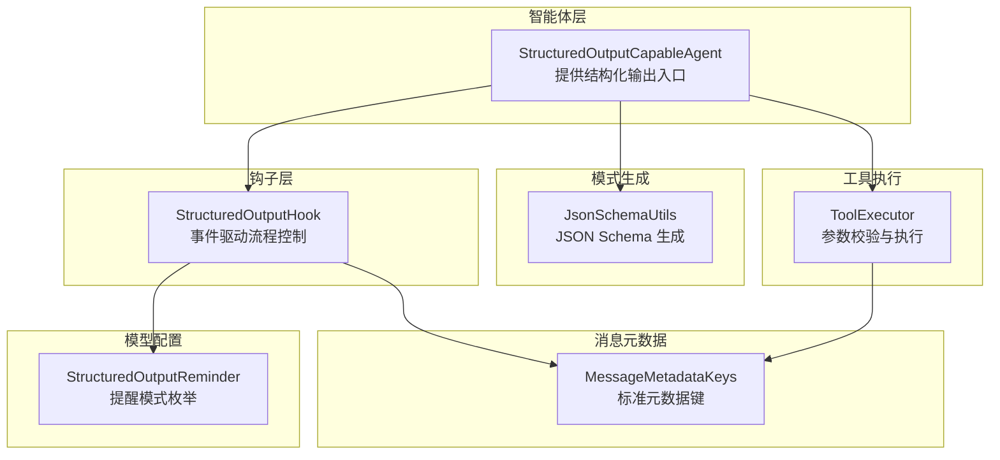
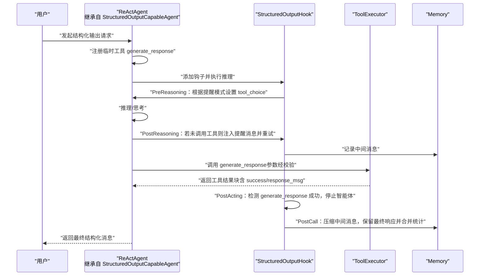
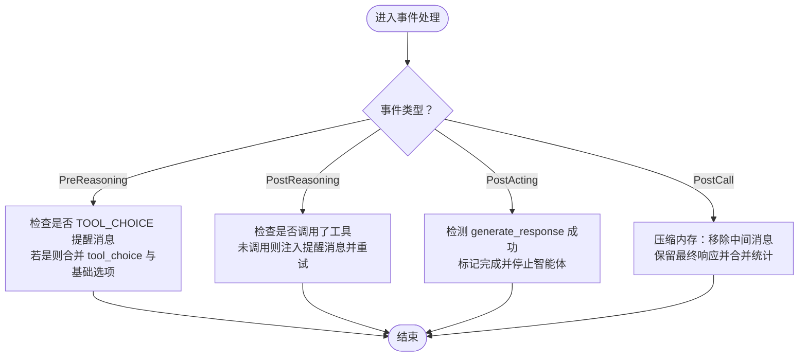
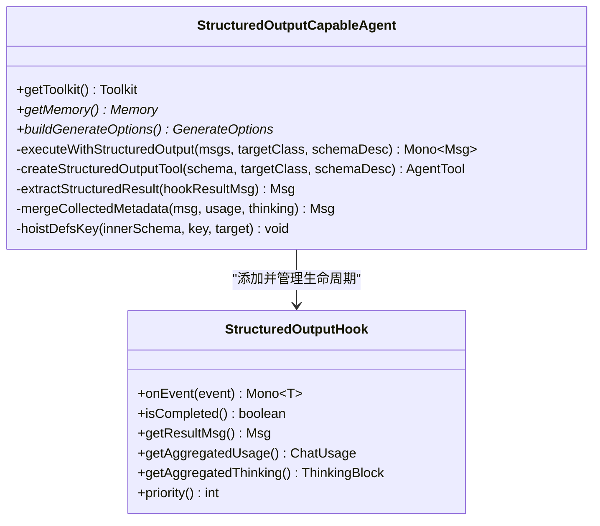
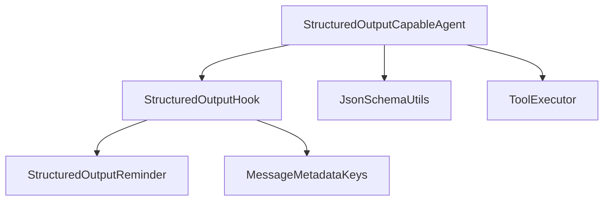
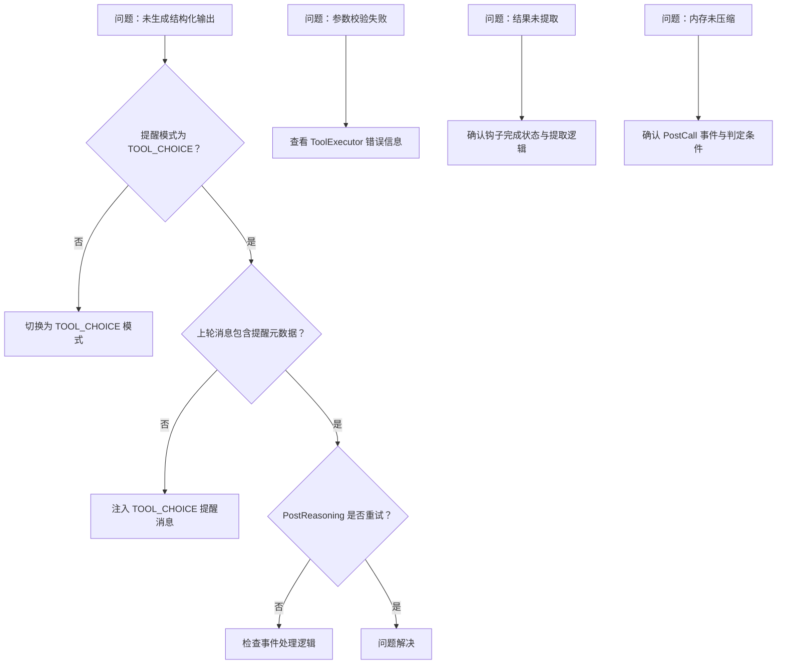

# 结构化输出

<cite>
**本文引用的文件**   
- [StructuredOutputHook.java](file://agentscope-core/src/main/java/io/agentscope/core/agent/StructuredOutputHook.java)
- [StructuredOutputCapableAgent.java](file://agentscope-core/src/main/java/io/agentscope/core/agent/StructuredOutputCapableAgent.java)
- [StructuredOutputReminder.java](file://agentscope-core/src/main/java/io/agentscope/core/model/StructuredOutputReminder.java)
- [JsonSchemaUtils.java](file://agentscope-core/src/main/java/io/agentscope/core/util/JsonSchemaUtils.java)
- [ToolExecutor.java](file://agentscope-core/src/main/java/io/agentscope/core/tool/ToolExecutor.java)
- [MessageMetadataKeys.java](file://agentscope-core/src/main/java/io/agentscope/core/message/MessageMetadataKeys.java)
- [StructuredOutputHookTest.java](file://agentscope-core/src/test/java/io/agentscope/core/agent/StructuredOutputHookTest.java)
</cite>

## 目录
1. [简介](#简介)
2. [项目结构](#项目结构)
3. [核心组件](#核心组件)
4. [架构总览](#架构总览)
5. [详细组件分析](#详细组件分析)
6. [依赖分析](#依赖分析)
7. [性能考虑](#性能考虑)
8. [故障排查指南](#故障排查指南)
9. [结论](#结论)
10. [附录](#附录)

## 简介
本章节面向希望在 AgentScope Java 框架中稳定生成结构化输出（如 JSON 对象）的开发者与架构师。我们将深入解析结构化输出钩子（StructuredOutputHook）的工作原理与实现机制，涵盖：
- 自纠正输出解析器的设计思路：通过“提醒机制”引导模型调用临时工具 generate_response，确保最终输出符合预期格式
- 类型安全的响应保证机制：基于 JSON Schema 的参数校验与结果提取，避免下游系统处理非结构化或格式错误的数据
- 在 ReAct 智能体中的集成方式、配置选项与使用场景
- JSON 模式验证、错误恢复策略、性能优化技巧与实际应用示例
- 如何通过结构化输出解决大语言模型输出格式不一致的问题，提升下游系统的数据处理效率与可靠性

## 项目结构
结构化输出能力由以下模块协同完成：
- 钩子层：StructuredOutputHook 负责事件驱动的流程控制与内存压缩
- 抽象智能体：StructuredOutputCapableAgent 提供统一的结构化输出入口与工具注册
- 模型配置：StructuredOutputReminder 定义两种提醒模式（TOOL_CHOICE 与 PROMPT）
- 工具执行：ToolExecutor 在调用前进行参数校验，保障类型安全
- 模式生成：JsonSchemaUtils 将 Java 类或 JsonNode 转换为 JSON Schema，作为工具参数约束
- 元数据键：MessageMetadataKeys 统一消息元数据键，便于追踪与合并统计信息

**图表来源**
- [StructuredOutputCapableAgent.java:65-374](file://agentscope-core/src/main/java/io/agentscope/core/agent/StructuredOutputCapableAgent.java#L65-L374)
- [StructuredOutputHook.java:61-415](file://agentscope-core/src/main/java/io/agentscope/core/agent/StructuredOutputHook.java#L61-L415)
- [StructuredOutputReminder.java:25-51](file://agentscope-core/src/main/java/io/agentscope/core/model/StructuredOutputReminder.java#L25-L51)
- [ToolExecutor.java:166-264](file://agentscope-core/src/main/java/io/agentscope/core/tool/ToolExecutor.java#L166-L264)
- [JsonSchemaUtils.java:96-123](file://agentscope-core/src/main/java/io/agentscope/core/util/JsonSchemaUtils.java#L96-L123)
- [MessageMetadataKeys.java:59-107](file://agentscope-core/src/main/java/io/agentscope/core/message/MessageMetadataKeys.java#L59-L107)

**章节来源**
- [StructuredOutputHook.java:45-61](file://agentscope-core/src/main/java/io/agentscope/core/agent/StructuredOutputHook.java#L45-L61)
- [StructuredOutputCapableAgent.java:44-64](file://agentscope-core/src/main/java/io/agentscope/core/agent/StructuredOutputCapableAgent.java#L44-L64)

## 核心组件
- StructuredOutputHook：拦截预推理、后推理、后行动与后调用事件，强制模型调用 generate_response 工具，必要时注入提醒消息，并在完成后压缩中间消息、合并统计信息
- StructuredOutputCapableAgent：抽象基类，负责注册临时工具、构建生成选项、执行带结构化输出的调用，并从钩子结果中提取最终消息
- StructuredOutputReminder：定义两种提醒模式，决定是否通过 tool_choice 参数强制调用或通过提示词注入提醒
- ToolExecutor：在工具调用前进行参数校验，失败时返回错误块；成功时返回结果块
- JsonSchemaUtils：将目标类型转换为 JSON Schema，作为 generate_response 工具的参数约束
- MessageMetadataKeys：标准化元数据键，用于标记提醒消息、存储结构化输出与统计信息

**章节来源**
- [StructuredOutputHook.java:61-106](file://agentscope-core/src/main/java/io/agentscope/core/agent/StructuredOutputHook.java#L61-L106)
- [StructuredOutputCapableAgent.java:65-124](file://agentscope-core/src/main/java/io/agentscope/core/agent/StructuredOutputCapableAgent.java#L65-L124)
- [StructuredOutputReminder.java:25-51](file://agentscope-core/src/main/java/io/agentscope/core/model/StructuredOutputReminder.java#L25-L51)
- [ToolExecutor.java:166-212](file://agentscope-core/src/main/java/io/agentscope/core/tool/ToolExecutor.java#L166-L212)
- [JsonSchemaUtils.java:96-123](file://agentscope-core/src/main/java/io/agentscope/core/util/JsonSchemaUtils.java#L96-L123)
- [MessageMetadataKeys.java:59-107](file://agentscope-core/src/main/java/io/agentscope/core/message/MessageMetadataKeys.java#L59-L107)

## 架构总览
下图展示了 ReAct 智能体在结构化输出模式下的关键交互流程：智能体通过 StructuredOutputCapableAgent 注册临时工具 generate_response，借助 StructuredOutputHook 控制模型行为，ToolExecutor 在调用前进行参数校验，最终由钩子压缩中间消息并将统计信息合并到最终消息。

**图表来源**
- [StructuredOutputCapableAgent.java:139-197](file://agentscope-core/src/main/java/io/agentscope/core/agent/StructuredOutputCapableAgent.java#L139-L197)
- [StructuredOutputHook.java:94-106](file://agentscope-core/src/main/java/io/agentscope/core/agent/StructuredOutputHook.java#L94-L106)
- [ToolExecutor.java:166-212](file://agentscope-core/src/main/java/io/agentscope/core/tool/ToolExecutor.java#L166-L212)
- [MessageMetadataKeys.java:59-107](file://agentscope-core/src/main/java/io/agentscope/core/message/MessageMetadataKeys.java#L59-L107)

## 详细组件分析

### StructuredOutputHook 分析
- 事件处理
  - PreReasoning：当提醒模式为 TOOL_CHOICE 且输入消息列表的最后一项是 TOOL_CHOICE 类型的提醒消息时，将 tool_choice 强制设为 generate_response，并与基础生成选项合并
  - PostReasoning：若模型未调用任何工具，则按最大重试次数注入提醒消息并回到推理阶段
  - PostActing：检测到 generate_response 工具调用成功后，标记完成、保存最终消息并停止智能体
  - PostCall：完成后的内存压缩，移除与结构化输出相关的中间消息，仅保留最终响应，并合并聚合的统计信息
- 提醒消息
  - 通过元数据标记提醒类型（TOOL_CHOICE 或 PROMPT），以便在后续轮次中正确处理
- 元数据聚合
  - 收集多轮推理中的 ChatUsage 与 ThinkingBlock，合并到最终消息中，便于成本与思维链追踪

**图表来源**
- [StructuredOutputHook.java:94-106](file://agentscope-core/src/main/java/io/agentscope/core/agent/StructuredOutputHook.java#L94-L106)
- [StructuredOutputHook.java:108-128](file://agentscope-core/src/main/java/io/agentscope/core/agent/StructuredOutputHook.java#L108-L128)
- [StructuredOutputHook.java:140-159](file://agentscope-core/src/main/java/io/agentscope/core/agent/StructuredOutputHook.java#L140-L159)
- [StructuredOutputHook.java:161-179](file://agentscope-core/src/main/java/io/agentscope/core/agent/StructuredOutputHook.java#L161-L179)
- [StructuredOutputHook.java:181-215](file://agentscope-core/src/main/java/io/agentscope/core/agent/StructuredOutputHook.java#L181-L215)

**章节来源**
- [StructuredOutputHook.java:94-106](file://agentscope-core/src/main/java/io/agentscope/core/agent/StructuredOutputHook.java#L94-L106)
- [StructuredOutputHook.java:108-128](file://agentscope-core/src/main/java/io/agentscope/core/agent/StructuredOutputHook.java#L108-L128)
- [StructuredOutputHook.java:140-159](file://agentscope-core/src/main/java/io/agentscope/core/agent/StructuredOutputHook.java#L140-L159)
- [StructuredOutputHook.java:161-179](file://agentscope-core/src/main/java/io/agentscope/core/agent/StructuredOutputHook.java#L161-L179)
- [StructuredOutputHook.java:181-215](file://agentscope-core/src/main/java/io/agentscope/core/agent/StructuredOutputHook.java#L181-L215)

### StructuredOutputCapableAgent 分析
- 入口方法
  - doCall(List<Msg>, Class<?>)/doCall(List<Msg>, JsonNode)：封装结构化输出执行流程
- 工具注册
  - 基于目标类型或 JSON Schema 生成工具参数，注册临时工具 generate_response
- 执行与结果提取
  - 添加钩子并执行推理，从钩子结果中提取最终消息，合并聚合的统计信息与思维块
- 生命周期管理
  - 在 finally 中移除钩子与临时工具，避免资源泄漏

**图表来源**
- [StructuredOutputCapableAgent.java:126-197](file://agentscope-core/src/main/java/io/agentscope/core/agent/StructuredOutputCapableAgent.java#L126-L197)
- [StructuredOutputHook.java:94-106](file://agentscope-core/src/main/java/io/agentscope/core/agent/StructuredOutputHook.java#L94-L106)

**章节来源**
- [StructuredOutputCapableAgent.java:126-197](file://agentscope-core/src/main/java/io/agentscope/core/agent/StructuredOutputCapableAgent.java#L126-L197)
- [StructuredOutputCapableAgent.java:202-280](file://agentscope-core/src/main/java/io/agentscope/core/agent/StructuredOutputCapableAgent.java#L202-L280)
- [StructuredOutputCapableAgent.java:285-322](file://agentscope-core/src/main/java/io/agentscope/core/agent/StructuredOutputCapableAgent.java#L285-L322)
- [StructuredOutputCapableAgent.java:327-355](file://agentscope-core/src/main/java/io/agentscope/core/agent/StructuredOutputCapableAgent.java#L327-L355)

### StructuredOutputReminder 分析
- TOOL_CHOICE：默认推荐模式。首次推理允许自由调用任意工具；若未调用 generate_response，则在下一轮通过 tool_choice 参数强制调用
- PROMPT：传统模式。若模型未调用工具，则注入提醒消息并重试，可能需要多次迭代

**章节来源**
- [StructuredOutputReminder.java:25-51](file://agentscope-core/src/main/java/io/agentscope/core/model/StructuredOutputReminder.java#L25-L51)

### ToolExecutor 参数校验与执行
- 在工具调用前，依据工具参数 Schema 进行校验，失败返回错误结果块
- 成功后返回工具结果块，支持流式回调与内部钩子回调的组合

**章节来源**
- [ToolExecutor.java:166-212](file://agentscope-core/src/main/java/io/agentscope/core/tool/ToolExecutor.java#L166-L212)
- [ToolExecutor.java:118-136](file://agentscope-core/src/main/java/io/agentscope/core/tool/ToolExecutor.java#L118-L136)

### JSON Schema 生成与类型安全
- JsonSchemaUtils 支持从 Class、JsonNode、Type 生成 JSON Schema，用于约束 generate_response 工具的参数
- 通过 hoistDefsKey 将嵌套 schema 的 $defs/definitions 提升至外层，确保引用解析正确

**章节来源**
- [JsonSchemaUtils.java:96-123](file://agentscope-core/src/main/java/io/agentscope/core/util/JsonSchemaUtils.java#L96-L123)
- [JsonSchemaUtils.java:366-372](file://agentscope-core/src/main/java/io/agentscope/core/util/JsonSchemaUtils.java#L366-L372)

### 元数据键与统计信息合并
- 使用 MessageMetadataKeys 标准化键名，包括结构化输出标记、提醒类型、聊天用量等
- 钩子在压缩内存前收集多轮 ChatUsage 与 ThinkingBlock，并合并到最终消息中

**章节来源**
- [MessageMetadataKeys.java:59-107](file://agentscope-core/src/main/java/io/agentscope/core/message/MessageMetadataKeys.java#L59-L107)
- [StructuredOutputHook.java:220-253](file://agentscope-core/src/main/java/io/agentscope/core/agent/StructuredOutputHook.java#L220-L253)
- [StructuredOutputHook.java:258-286](file://agentscope-core/src/main/java/io/agentscope/core/agent/StructuredOutputHook.java#L258-L286)

## 依赖分析
- 组件耦合
  - StructuredOutputCapableAgent 依赖 StructuredOutputHook 以控制流程；依赖 JsonSchemaUtils 生成 Schema；依赖 ToolExecutor 进行参数校验
  - StructuredOutputHook 依赖 StructuredOutputReminder 决定提醒模式；依赖 MessageMetadataKeys 标准化元数据键
- 外部依赖
  - 通过 Reactor Mono 流式处理事件与异步执行
  - 通过 Jackson 与 victools-jsonschema 生成与转换 JSON Schema

**图表来源**
- [StructuredOutputCapableAgent.java:165-167](file://agentscope-core/src/main/java/io/agentscope/core/agent/StructuredOutputCapableAgent.java#L165-L167)
- [StructuredOutputHook.java:70-72](file://agentscope-core/src/main/java/io/agentscope/core/agent/StructuredOutputHook.java#L70-L72)
- [MessageMetadataKeys.java:59-107](file://agentscope-core/src/main/java/io/agentscope/core/message/MessageMetadataKeys.java#L59-L107)

**章节来源**
- [StructuredOutputHook.java:61-92](file://agentscope-core/src/main/java/io/agentscope/core/agent/StructuredOutputHook.java#L61-L92)
- [StructuredOutputCapableAgent.java:165-167](file://agentscope-core/src/main/java/io/agentscope/core/agent/StructuredOutputCapableAgent.java#L165-L167)

## 性能考虑
- 提醒模式选择
  - TOOL_CHOICE 模式通过 tool_choice 参数减少多轮对话次数，降低 token 与延迟开销
  - PROMPT 模式可能需要多次重试，增加往返成本
- 内存压缩
  - 钩子在 PostCall 阶段压缩中间消息，减少历史长度，提高后续推理效率
- 统计信息聚合
  - 合并多轮 ChatUsage 与 ThinkingBlock，避免重复计算与跨轮传输
- 并发与调度
  - ToolExecutor 默认使用 boundedElastic 调度器，适合 I/O 密集型工具调用；可按需替换自定义线程池

**章节来源**
- [StructuredOutputHook.java:181-215](file://agentscope-core/src/main/java/io/agentscope/core/agent/StructuredOutputHook.java#L181-L215)
- [ToolExecutor.java:345-350](file://agentscope-core/src/main/java/io/agentscope/core/tool/ToolExecutor.java#L345-L350)

## 故障排查指南
- 未触发 generate_response
  - 检查提醒模式是否为 TOOL_CHOICE 且上一轮消息包含正确的提醒元数据
  - 确认 PostReasoning 是否正确注入提醒消息并重试
- 参数校验失败
  - 查看 ToolExecutor 的校验错误信息，修正输入参数或 Schema
- 结果未提取
  - 确认钩子已成功标记完成并返回最终消息；检查 extractStructuredResult 逻辑
- 内存未压缩
  - 确认 PostCall 事件已到达；检查 isStructuredOutputRelated 判定条件

**图表来源**
- [StructuredOutputHookTest.java:59-141](file://agentscope-core/src/test/java/io/agentscope/core/agent/StructuredOutputHookTest.java#L59-L141)
- [ToolExecutor.java:202-212](file://agentscope-core/src/main/java/io/agentscope/core/tool/ToolExecutor.java#L202-L212)
- [StructuredOutputHook.java:181-215](file://agentscope-core/src/main/java/io/agentscope/core/agent/StructuredOutputHook.java#L181-L215)

**章节来源**
- [StructuredOutputHookTest.java:59-141](file://agentscope-core/src/test/java/io/agentscope/core/agent/StructuredOutputHookTest.java#L59-L141)
- [ToolExecutor.java:202-212](file://agentscope-core/src/main/java/io/agentscope/core/tool/ToolExecutor.java#L202-L212)

## 结论
结构化输出系统通过“临时工具 + 钩子控制 + 参数校验”的组合，实现了对大模型输出格式的强约束与自纠正。TOOL_CHOICE 模式在保证类型安全的同时显著降低往返成本；PROMPT 模式适用于兼容旧有流程。配合内存压缩与统计信息聚合，系统在可靠性与性能之间取得平衡，为下游数据处理提供稳定、可追踪的结构化响应。

## 附录
- 配置选项
  - StructuredOutputReminder：TOOL_CHOICE（默认）、PROMPT
  - 基础生成选项：温度、最大 token 等，会在 TOOL_CHOICE 场景与 tool_choice 合并
- 使用场景
  - 需要稳定 JSON 输出的智能体（如任务规划、信息抽取、决策建议）
  - 需要成本与思维链追踪的长对话系统
- 最佳实践
  - 优先使用 TOOL_CHOICE 模式
  - 明确 JSON Schema，避免过于复杂的嵌套
  - 合理设置重试次数与超时，平衡稳定性与性能