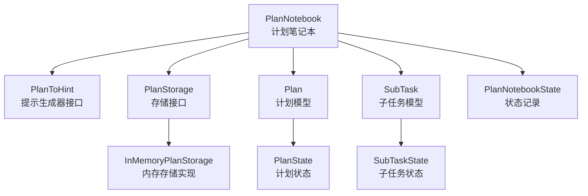
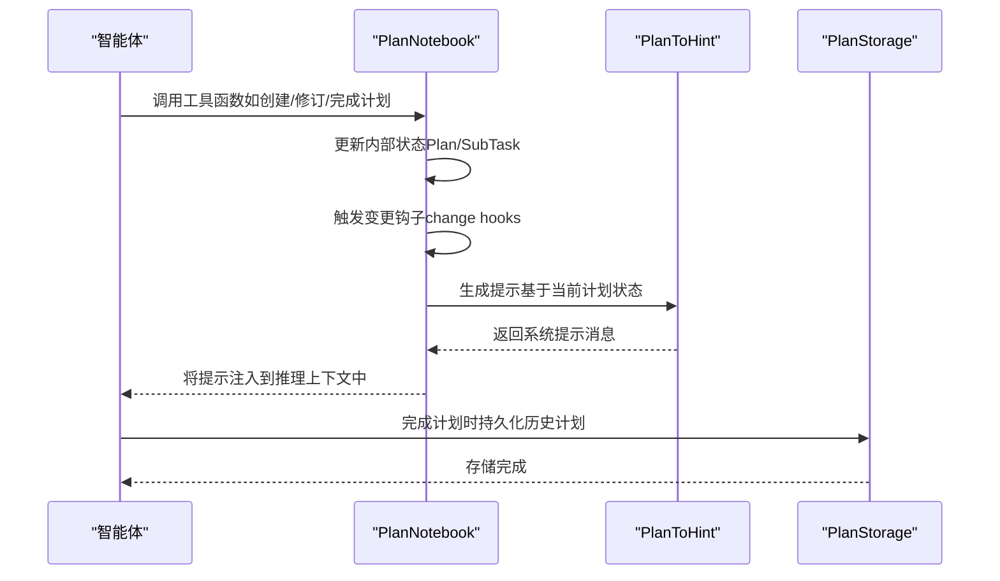
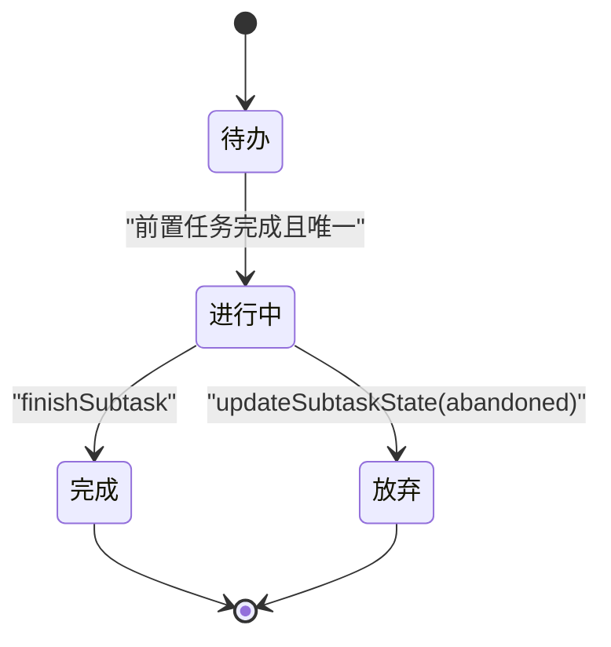
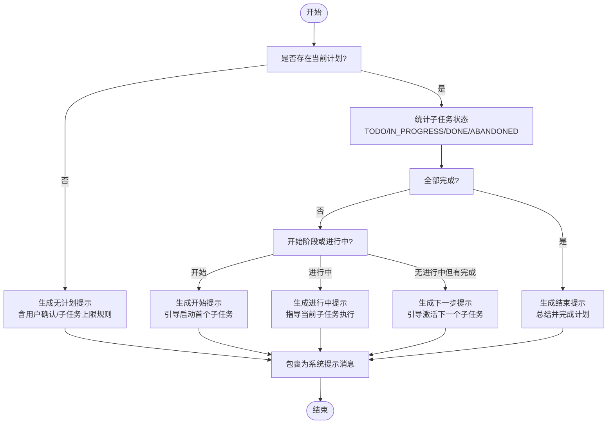
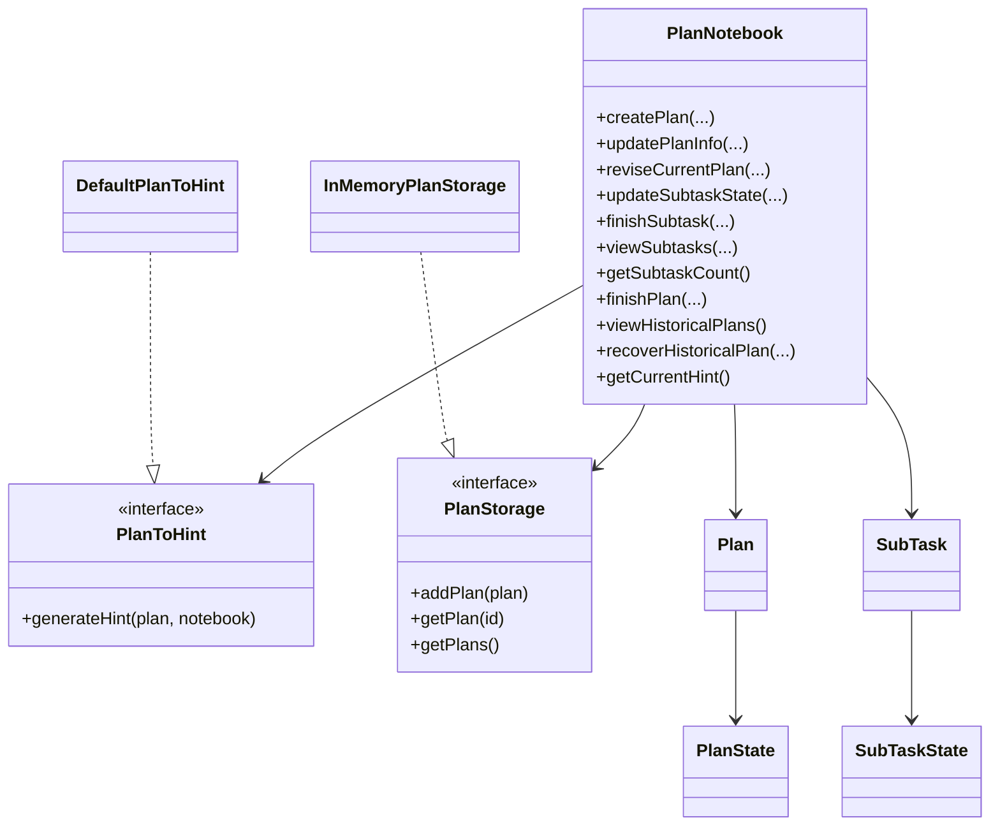

# 计划笔记本

<cite>
**本文引用的文件**
- [PlanNotebook.java](file://agentscope-core/src/main/java/io/agentscope/core/plan/PlanNotebook.java)
- [Plan.java](file://agentscope-core/src/main/java/io/agentscope/core/plan/model/Plan.java)
- [SubTask.java](file://agentscope-core/src/main/java/io/agentscope/core/plan/model/SubTask.java)
- [PlanState.java](file://agentscope-core/src/main/java/io/agentscope/core/plan/model/PlanState.java)
- [SubTaskState.java](file://agentscope-core/src/main/java/io/agentscope/core/plan/model/SubTaskState.java)
- [DefaultPlanToHint.java](file://agentscope-core/src/main/java/io/agentscope/core/plan/hint/DefaultPlanToHint.java)
- [PlanToHint.java](file://agentscope-core/src/main/java/io/agentscope/core/plan/hint/PlanToHint.java)
- [InMemoryPlanStorage.java](file://agentscope-core/src/main/java/io/agentscope/core/plan/storage/InMemoryPlanStorage.java)
- [PlanStorage.java](file://agentscope-core/src/main/java/io/agentscope/core/plan/storage/PlanStorage.java)
- [PlanNotebookState.java](file://agentscope-core/src/main/java/io/agentscope/core/state/PlanNotebookState.java)
- [PlanNotebookToolTest.java](file://agentscope-core/src/test/java/io/agentscope/core/plan/PlanNotebookToolTest.java)
- [PlanNotebookStateModuleTest.java](file://agentscope-core/src/test/java/io/agentscope/core/plan/PlanNotebookStateModuleTest.java)
- [PlanE2ETest.java](file://agentscope-core/src/test/java/io/agentscope/core/e2e/PlanE2ETest.java)
- [PlanNotebookExample.java](file://agentscope-examples/quickstart/src/main/java/io/agentscope/examples/quickstart/PlanNotebookExample.java)
</cite>

## 目录
1. [简介](#简介)
2. [项目结构](#项目结构)
3. [核心组件](#核心组件)
4. [架构总览](#架构总览)
5. [详细组件分析](#详细组件分析)
6. [依赖分析](#依赖分析)
7. [性能考虑](#性能考虑)
8. [故障排查指南](#故障排查指南)
9. [结论](#结论)
10. [附录](#附录)

## 简介
本文件系统性阐述 AgentScope Java 框架中的“计划笔记本”（PlanNotebook）能力，围绕其核心功能：结构化任务管理、自动提示注入、状态跟踪与历史计划存储展开；并逐项解析 10 个工具函数的职责、参数、行为与使用要点，同时给出配置选项、状态转换规则、错误处理机制与实际使用示例，帮助开发者在复杂任务场景中高效落地。

## 项目结构
计划笔记本位于 agentscope-core 模块的 plan 包下，核心类与配套模块如下：
- 核心类：PlanNotebook（计划笔记本）
- 数据模型：Plan（计划）、SubTask（子任务）、PlanState（计划状态枚举）、SubTaskState（子任务状态枚举）
- 提示生成：PlanToHint 接口及默认实现 DefaultPlanToHint
- 存储接口与实现：PlanStorage 接口与 InMemoryPlanStorage 内存存储
- 状态持久化：PlanNotebookState（用于会话保存/加载）
- 测试与示例：PlanNotebookToolTest、PlanNotebookStateModuleTest、PlanE2ETest、PlanNotebookExample

图表来源
- [PlanNotebook.java:104-135](file://agentscope-core/src/main/java/io/agentscope/core/plan/PlanNotebook.java#L104-L135)
- [Plan.java:45-84](file://agentscope-core/src/main/java/io/agentscope/core/plan/model/Plan.java#L45-L84)
- [SubTask.java:44-79](file://agentscope-core/src/main/java/io/agentscope/core/plan/model/SubTask.java#L44-L79)
- [PlanState.java:23-34](file://agentscope-core/src/main/java/io/agentscope/core/plan/model/PlanState.java#L23-L34)
- [SubTaskState.java:23-34](file://agentscope-core/src/main/java/io/agentscope/core/plan/model/SubTaskState.java#L23-L34)
- [PlanToHint.java:27-46](file://agentscope-core/src/main/java/io/agentscope/core/plan/hint/PlanToHint.java#L27-L46)
- [DefaultPlanToHint.java:38-254](file://agentscope-core/src/main/java/io/agentscope/core/plan/hint/DefaultPlanToHint.java#L38-L254)
- [PlanStorage.java:27-51](file://agentscope-core/src/main/java/io/agentscope/core/plan/storage/PlanStorage.java#L27-L51)
- [InMemoryPlanStorage.java:32-69](file://agentscope-core/src/main/java/io/agentscope/core/plan/storage/InMemoryPlanStorage.java#L32-L69)
- [PlanNotebookState.java](file://agentscope-core/src/main/java/io/agentscope/core/state/PlanNotebookState.java#L44)

章节来源
- [PlanNotebook.java:44-103](file://agentscope-core/src/main/java/io/agentscope/core/plan/PlanNotebook.java#L44-L103)
- [Plan.java:24-44](file://agentscope-core/src/main/java/io/agentscope/core/plan/model/Plan.java#L24-L44)
- [SubTask.java:22-43](file://agentscope-core/src/main/java/io/agentscope/core/plan/model/SubTask.java#L22-L43)
- [PlanToHint.java:21-46](file://agentscope-core/src/main/java/io/agentscope/core/plan/hint/PlanToHint.java#L21-L46)
- [PlanStorage.java:22-51](file://agentscope-core/src/main/java/io/agentscope/core/plan/storage/PlanStorage.java#L22-L51)

## 核心组件
- 计划笔记本（PlanNotebook）
  - 职责：提供 10 个工具函数以创建/修订/完成计划与子任务；自动注入上下文提示；跟踪计划与子任务状态；持久化历史计划。
  - 关键字段：当前计划、提示生成器、存储后端、最大子任务数限制、是否需要用户确认、变更钩子集合。
  - 状态模块：实现 StateModule，支持保存/加载到会话。
- 计划与子任务模型
  - Plan：名称、描述、期望结果、子任务列表、创建时间、状态、完成时间、最终结果。
  - SubTask：名称、描述、期望结果、状态、创建/完成时间、实际结果。
  - 状态枚举：PlanState、SubTaskState。
- 提示生成器（PlanToHint）
  - 默认实现 DefaultPlanToHint：根据计划状态生成不同阶段的系统提示，包含“等待用户确认”“子任务上限”等规则。
- 存储接口（PlanStorage）
  - InMemoryPlanStorage：线程安全的内存存储，适合开发/测试；生产建议自定义持久化实现。

章节来源
- [PlanNotebook.java:104-135](file://agentscope-core/src/main/java/io/agentscope/core/plan/PlanNotebook.java#L104-L135)
- [Plan.java:45-96](file://agentscope-core/src/main/java/io/agentscope/core/plan/model/Plan.java#L45-L96)
- [SubTask.java:44-106](file://agentscope-core/src/main/java/io/agentscope/core/plan/model/SubTask.java#L44-L106)
- [PlanState.java:23-34](file://agentscope-core/src/main/java/io/agentscope/core/plan/model/PlanState.java#L23-L34)
- [SubTaskState.java:23-34](file://agentscope-core/src/main/java/io/agentscope/core/plan/model/SubTaskState.java#L23-L34)
- [DefaultPlanToHint.java:38-254](file://agentscope-core/src/main/java/io/agentscope/core/plan/hint/DefaultPlanToHint.java#L38-L254)
- [PlanStorage.java:27-51](file://agentscope-core/src/main/java/io/agentscope/core/plan/storage/PlanStorage.java#L27-L51)
- [InMemoryPlanStorage.java:32-69](file://agentscope-core/src/main/java/io/agentscope/core/plan/storage/InMemoryPlanStorage.java#L32-L69)

## 架构总览
计划笔记本通过 Hook 机制在推理前自动注入系统提示，指导智能体按计划有序执行；同时提供工具函数供智能体直接调用以管理计划生命周期。

图表来源
- [PlanNotebook.java:975-986](file://agentscope-core/src/main/java/io/agentscope/core/plan/PlanNotebook.java#L975-L986)
- [DefaultPlanToHint.java:165-254](file://agentscope-core/src/main/java/io/agentscope/core/plan/hint/DefaultPlanToHint.java#L165-L254)
- [PlanStorage.java:35-50](file://agentscope-core/src/main/java/io/agentscope/core/plan/storage/PlanStorage.java#L35-L50)

## 详细组件分析

### 工具函数详解与使用指南
以下 10 个工具函数均标注为 @Tool，可被智能体通过工具调用进行计划管理。每个函数均包含参数校验、状态检查、错误返回与变更钩子触发。

- createPlan（创建计划）
  - 功能：以名称、描述、期望结果与子任务列表创建新计划；若已有当前计划则替换之。
  - 参数要点：子任务需包含 name/description/expected_outcome；受 maxSubtasks 限制。
  - 行为：校验子任务数量；设置 currentPlan；触发变更钩子。
  - 使用示例路径：[PlanNotebookToolTest.java:44-76](file://agentscope-core/src/test/java/io/agentscope/core/plan/PlanNotebookToolTest.java#L44-L76)

- updatePlanInfo（更新计划信息）
  - 功能：更新当前计划的名称、描述或期望结果；空值或空白将跳过。
  - 行为：验证当前存在计划；逐项更新；触发变更钩子。
  - 使用示例路径：[PlanNotebookToolTest.java:397-451](file://agentscope-core/src/test/java/io/agentscope/core/plan/PlanNotebookToolTest.java#L397-L451)

- reviseCurrentPlan（修订当前计划）
  - 功能：对指定索引的子任务执行 add/revise/delete 操作。
  - 参数要点：subtask_idx 必须在合法范围；add 操作受 maxSubtasks 限制。
  - 行为：校验动作与索引；执行增删改；触发变更钩子。
  - 使用示例路径：[PlanNotebookToolTest.java:550-652](file://agentscope-core/src/test/java/io/agentscope/core/plan/PlanNotebookToolTest.java#L550-L652)

- updateSubtaskState（更新子任务状态）
  - 功能：将子任务状态更新为 todo/in_progress/abandoned。
  - 行为：校验索引与状态；IN_PROGRESS 需满足前置条件（前序任务完成或放弃；同一时刻仅允许一个 IN_PROGRESS）；触发变更钩子。
  - 使用示例路径：[PlanNotebookToolTest.java:78-117](file://agentscope-core/src/test/java/io/agentscope/core/plan/PlanNotebookToolTest.java#L78-L117)

- finishSubtask（完成子任务）
  - 功能：标记子任务为完成并记录具体结果；完成后自动激活下一个子任务（若存在）。
  - 行为：校验索引；确保前序任务已完成或放弃；完成后设置 DONE 并写入 outcome；必要时激活下一任务；触发变更钩子。
  - 使用示例路径：[PlanNotebookToolTest.java:120-167](file://agentscope-core/src/test/java/io/agentscope/core/plan/PlanNotebookToolTest.java#L120-L167)

- viewSubtasks（查看子任务详情）
  - 功能：按索引查看子任务的详细信息（Markdown 格式）。
  - 行为：校验索引；拼接多条子任务详情；返回文本。
  - 使用示例路径：[PlanNotebookToolTest.java:170-195](file://agentscope-core/src/test/java/io/agentscope/core/plan/PlanNotebookToolTest.java#L170-L195)

- getSubtaskCount（获取子任务数量）
  - 功能：统计当前计划的子任务总数与各状态分布。
  - 行为：若无计划返回提示；否则统计 DONE/IN_PROGRESS/TODO/ABANDONED 数量。
  - 使用示例路径：[PlanNotebookToolTest.java:454-492](file://agentscope-core/src/test/java/io/agentscope/core/plan/PlanNotebookToolTest.java#L454-L492)

- finishPlan（完成计划）
  - 功能：将当前计划标记为 done/abandoned，并持久化到历史计划库；清空 currentPlan。
  - 行为：校验状态；设置计划完成时间与结果；写入存储；清空当前计划；触发变更钩子。
  - 使用示例路径：[PlanNotebookToolTest.java:198-236](file://agentscope-core/src/test/java/io/agentscope/core/plan/PlanNotebookToolTest.java#L198-L236)

- viewHistoricalPlans（查看历史计划）
  - 功能：列出所有已持久化的历史计划摘要。
  - 行为：从存储读取；格式化输出。
  - 使用示例路径：[PlanNotebookToolTest.java:239-257](file://agentscope-core/src/test/java/io/agentscope/core/plan/PlanNotebookToolTest.java#L239-L257)

- recoverHistoricalPlan（恢复历史计划）
  - 功能：根据计划 ID 恢复历史计划；若当前有未完成计划则先将其放弃并持久化。
  - 行为：查询历史计划；必要时持久化当前计划；替换 currentPlan；触发变更钩子。
  - 使用示例路径：[PlanNotebookToolTest.java:263-268](file://agentscope-core/src/test/java/io/agentscope/core/plan/PlanNotebookToolTest.java#L263-L268)

章节来源
- [PlanNotebook.java:268-331](file://agentscope-core/src/main/java/io/agentscope/core/plan/PlanNotebook.java#L268-L331)
- [PlanNotebook.java:342-402](file://agentscope-core/src/main/java/io/agentscope/core/plan/PlanNotebook.java#L342-L402)
- [PlanNotebook.java:467-567](file://agentscope-core/src/main/java/io/agentscope/core/plan/PlanNotebook.java#L467-L567)
- [PlanNotebook.java:579-653](file://agentscope-core/src/main/java/io/agentscope/core/plan/PlanNotebook.java#L579-L653)
- [PlanNotebook.java:662-736](file://agentscope-core/src/main/java/io/agentscope/core/plan/PlanNotebook.java#L662-L736)
- [PlanNotebook.java:744-774](file://agentscope-core/src/main/java/io/agentscope/core/plan/PlanNotebook.java#L744-L774)
- [PlanNotebook.java:781-815](file://agentscope-core/src/main/java/io/agentscope/core/plan/PlanNotebook.java#L781-L815)
- [PlanNotebook.java:824-868](file://agentscope-core/src/main/java/io/agentscope/core/plan/PlanNotebook.java#L824-L868)
- [PlanNotebook.java:870-894](file://agentscope-core/src/main/java/io/agentscope/core/plan/PlanNotebook.java#L870-L894)
- [PlanNotebook.java:896-962](file://agentscope-core/src/main/java/io/agentscope/core/plan/PlanNotebook.java#L896-L962)

### 状态转换规则
- 子任务状态转换
  - 可达状态：TODO → IN_PROGRESS → DONE 或 ABANDONED
  - 约束：
    - 将子任务置为 IN_PROGRESS 前，必须确保其之前的所有子任务均为 DONE 或 ABANDONED；
    - 同一时刻只能有一个子任务处于 IN_PROGRESS；
    - 不允许直接将子任务置为 DONE（应使用 finishSubtask）。
- 计划状态转换
  - 可达状态：TODO → IN_PROGRESS → DONE 或 ABANDONED
  - 完成时机：当所有子任务均 DONE 或 ABANDONED 时，可调用 finishPlan 结束计划。

图表来源
- [SubTaskState.java:23-34](file://agentscope-core/src/main/java/io/agentscope/core/plan/model/SubTaskState.java#L23-L34)
- [PlanState.java:23-34](file://agentscope-core/src/main/java/io/agentscope/core/plan/model/PlanState.java#L23-L34)
- [PlanNotebook.java:619-645](file://agentscope-core/src/main/java/io/agentscope/core/plan/PlanNotebook.java#L619-L645)

章节来源
- [PlanNotebook.java:619-645](file://agentscope-core/src/main/java/io/agentscope/core/plan/PlanNotebook.java#L619-L645)
- [PlanState.java:23-34](file://agentscope-core/src/main/java/io/agentscope/core/plan/model/PlanState.java#L23-L34)
- [SubTaskState.java:23-34](file://agentscope-core/src/main/java/io/agentscope/core/plan/model/SubTaskState.java#L23-L34)

### 自动提示注入机制（Hook）
- 触发点：PlanNotebook.getCurrentHint() 在每次推理前由 Hook 注入系统提示。
- 生成逻辑：DefaultPlanToHint 根据计划状态生成不同提示模板，包含“等待用户确认”“子任务上限”“通用规则”等。
- 提示内容：以 <system-hint>...</system-hint> 包裹，作为 USER 角色消息注入到上下文。

图表来源
- [DefaultPlanToHint.java:165-254](file://agentscope-core/src/main/java/io/agentscope/core/plan/hint/DefaultPlanToHint.java#L165-L254)
- [PlanNotebook.java:975-986](file://agentscope-core/src/main/java/io/agentscope/core/plan/PlanNotebook.java#L975-L986)

章节来源
- [DefaultPlanToHint.java:38-254](file://agentscope-core/src/main/java/io/agentscope/core/plan/hint/DefaultPlanToHint.java#L38-L254)
- [PlanNotebook.java:975-986](file://agentscope-core/src/main/java/io/agentscope/core/plan/PlanNotebook.java#L975-L986)

### 与 ReAct 智能体协同
- 集成方式：
  - 通过 ReActAgent.builder().planNotebook(...) 或 .enablePlan() 自动注册计划笔记本与提示注入 Hook。
  - 智能体在每次推理前接收 PlanNotebook 注入的系统提示，确保遵循计划步骤与约束。
- 协同效果：
  - 明确的任务分解与执行顺序；
  - 严格的前置条件控制（避免跳跃执行）；
  - 用户确认与规则提示降低误执行风险；
  - 历史计划可追溯与可恢复，便于回滚与审计。

章节来源
- [PlanNotebook.java:59-87](file://agentscope-core/src/main/java/io/agentscope/core/plan/PlanNotebook.java#L59-L87)
- [PlanE2ETest.java:116-132](file://agentscope-core/src/test/java/io/agentscope/core/e2e/PlanE2ETest.java#L116-L132)

### 配置选项
- planToHint：提示生成策略，默认 DefaultPlanToHint。
- storage：历史计划存储，默认 InMemoryPlanStorage。
- maxSubtasks：单计划最大子任务数（null 表示不限制）。
- needUserConfirm：是否在提示中加入“等待用户确认”规则。
- keyPrefix：状态存储键前缀，支持同一会话内多实例共存。

章节来源
- [PlanNotebook.java:177-255](file://agentscope-core/src/main/java/io/agentscope/core/plan/PlanNotebook.java#L177-L255)

### 错误处理机制
- 输入校验：
  - 索引越界、非法状态字符串、非法动作类型等均返回明确错误信息。
- 业务规则：
  - IN_PROGRESS 前置条件校验失败、子任务数量超限、状态非终端却尝试直接完成等。
- 异常抛出：
  - 当前无计划时调用部分工具函数会抛出异常，提示先创建计划。
- 变更钩子：
  - 所有计划修改均触发钩子回调，便于外部监听与扩展。

章节来源
- [PlanNotebook.java:594-617](file://agentscope-core/src/main/java/io/agentscope/core/plan/PlanNotebook.java#L594-L617)
- [PlanNotebook.java:504-531](file://agentscope-core/src/main/java/io/agentscope/core/plan/PlanNotebook.java#L504-L531)
- [PlanNotebook.java:1071-1077](file://agentscope-core/src/main/java/io/agentscope/core/plan/PlanNotebook.java#L1071-L1077)

### 实际使用示例
- 示例入口：Quickstart 示例中的 PlanNotebookExample 展示了如何创建计划笔记本、注册到智能体并调用工具函数。
- 测试覆盖：PlanNotebookToolTest 与 PlanNotebookStateModuleTest 提供了典型场景的断言与流程验证。

章节来源
- [PlanNotebookExample.java](file://agentscope-examples/quickstart/src/main/java/io/agentscope/examples/quickstart/PlanNotebookExample.java)
- [PlanNotebookToolTest.java:270-301](file://agentscope-core/src/test/java/io/agentscope/core/plan/PlanNotebookToolTest.java#L270-L301)
- [PlanNotebookStateModuleTest.java:190-224](file://agentscope-core/src/test/java/io/agentscope/core/plan/PlanNotebookStateModuleTest.java#L190-L224)

## 依赖分析
- 组件耦合
  - PlanNotebook 依赖 PlanToHint 与 PlanStorage；提示生成与存储解耦，便于替换实现。
  - 数据模型（Plan/SubTask）与状态枚举独立，便于序列化与跨模块共享。
- 外部集成
  - 通过 StateModule 接口与会话系统集成，支持跨请求/会话持久化。
  - 通过 Toolkit 注册为工具，供 ReActAgent 等智能体调用。

图表来源
- [PlanNotebook.java:104-135](file://agentscope-core/src/main/java/io/agentscope/core/plan/PlanNotebook.java#L104-L135)
- [PlanToHint.java:27-46](file://agentscope-core/src/main/java/io/agentscope/core/plan/hint/PlanToHint.java#L27-L46)
- [DefaultPlanToHint.java](file://agentscope-core/src/main/java/io/agentscope/core/plan/hint/DefaultPlanToHint.java#L38)
- [PlanStorage.java:27-51](file://agentscope-core/src/main/java/io/agentscope/core/plan/storage/PlanStorage.java#L27-L51)
- [InMemoryPlanStorage.java:32-69](file://agentscope-core/src/main/java/io/agentscope/core/plan/storage/InMemoryPlanStorage.java#L32-L69)
- [Plan.java:45-96](file://agentscope-core/src/main/java/io/agentscope/core/plan/model/Plan.java#L45-L96)
- [SubTask.java:44-106](file://agentscope-core/src/main/java/io/agentscope/core/plan/model/SubTask.java#L44-L106)
- [PlanState.java:23-34](file://agentscope-core/src/main/java/io/agentscope/core/plan/model/PlanState.java#L23-L34)
- [SubTaskState.java:23-34](file://agentscope-core/src/main/java/io/agentscope/core/plan/model/SubTaskState.java#L23-L34)

章节来源
- [PlanNotebook.java:104-135](file://agentscope-core/src/main/java/io/agentscope/core/plan/PlanNotebook.java#L104-L135)
- [PlanStorage.java:27-51](file://agentscope-core/src/main/java/io/agentscope/core/plan/storage/PlanStorage.java#L27-L51)

## 性能考虑
- 存储实现：默认 InMemoryPlanStorage 适用于开发/测试；生产环境建议实现数据库持久化以支持高并发与可靠性。
- 状态遍历：getSubtaskCount 与提示生成均会对子任务列表进行扫描，建议控制单计划子任务数量（可通过 maxSubtasks 限制）。
- 钩子回调：变更钩子为同步回调，若存在耗时操作建议异步化或在钩子内部异步执行。

## 故障排查指南
- “当前无计划”错误
  - 症状：调用子任务相关工具时报错或返回提示。
  - 处理：先调用 createPlan 创建计划。
  - 参考：[PlanNotebookToolTest.java:185-195](file://agentscope-core/src/test/java/io/agentscope/core/plan/PlanNotebookToolTest.java#L185-L195)
- “索引越界”
  - 症状：updateSubtaskState/reviseCurrentPlan/viewSubtasks 报错。
  - 处理：使用 getSubtaskCount 获取准确数量后再操作。
  - 参考：[PlanNotebookToolTest.java:110-117](file://agentscope-core/src/test/java/io/agentscope/core/plan/PlanNotebookToolTest.java#L110-L117)
- “前置任务未完成”
  - 症状：IN_PROGRESS 设置失败。
  - 处理：先完成前序任务或放弃它们。
  - 参考：[PlanNotebookToolTest.java:96-107](file://agentscope-core/src/test/java/io/agentscope/core/plan/PlanNotebookToolTest.java#L96-L107)
- “子任务数量超限”
  - 症状：创建/添加子任务失败。
  - 处理：调整 maxSubtasks 或删除部分子任务。
  - 参考：[PlanNotebookToolTest.java:497-512](file://agentscope-core/src/test/java/io/agentscope/core/plan/PlanNotebookToolTest.java#L497-L512)

章节来源
- [PlanNotebookToolTest.java:185-195](file://agentscope-core/src/test/java/io/agentscope/core/plan/PlanNotebookToolTest.java#L185-L195)
- [PlanNotebookToolTest.java:96-107](file://agentscope-core/src/test/java/io/agentscope/core/plan/PlanNotebookToolTest.java#L96-L107)
- [PlanNotebookToolTest.java:497-512](file://agentscope-core/src/test/java/io/agentscope/core/plan/PlanNotebookToolTest.java#L497-L512)

## 结论
计划笔记本通过结构化任务管理、自动提示注入与严格的状态控制，显著提升了复杂任务的可执行性与可追踪性。配合 ReAct 智能体与 Hook 机制，能够在多轮交互中保持上下文一致性与执行顺序正确性；借助历史计划存储与恢复能力，进一步增强了系统的鲁棒性与可维护性。建议在生产环境中结合业务需求选择合适的存储实现与配置策略。

## 附录
- 状态持久化
  - PlanNotebook 实现 StateModule，支持 saveTo/loadFrom；PlanNotebookState 仅封装当前 Plan 对象。
  - 参考：[PlanNotebookStateModuleTest.java:190-224](file://agentscope-core/src/test/java/io/agentscope/core/plan/PlanNotebookStateModuleTest.java#L190-L224)
- 示例参考
  - Quickstart 示例：[PlanNotebookExample.java](file://agentscope-examples/quickstart/src/main/java/io/agentscope/examples/quickstart/PlanNotebookExample.java)