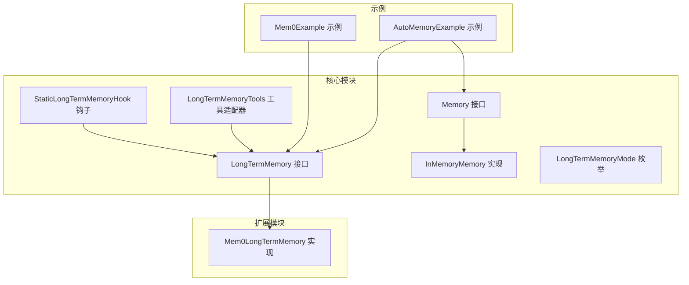
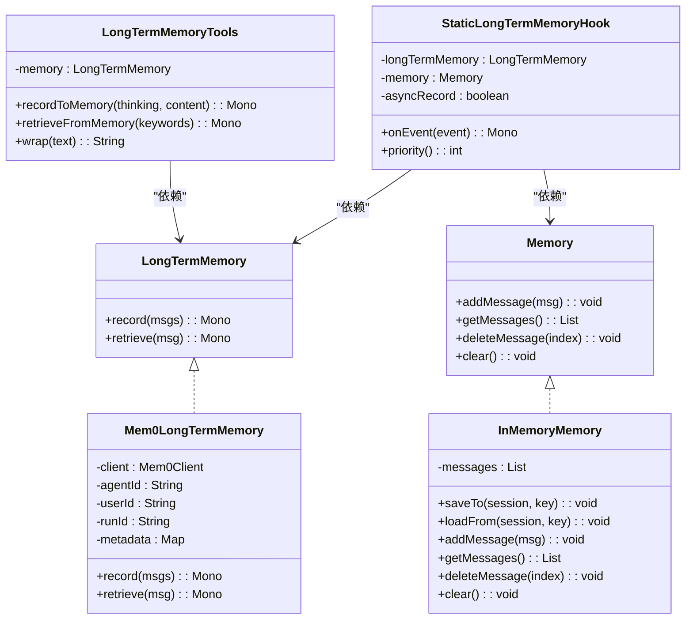
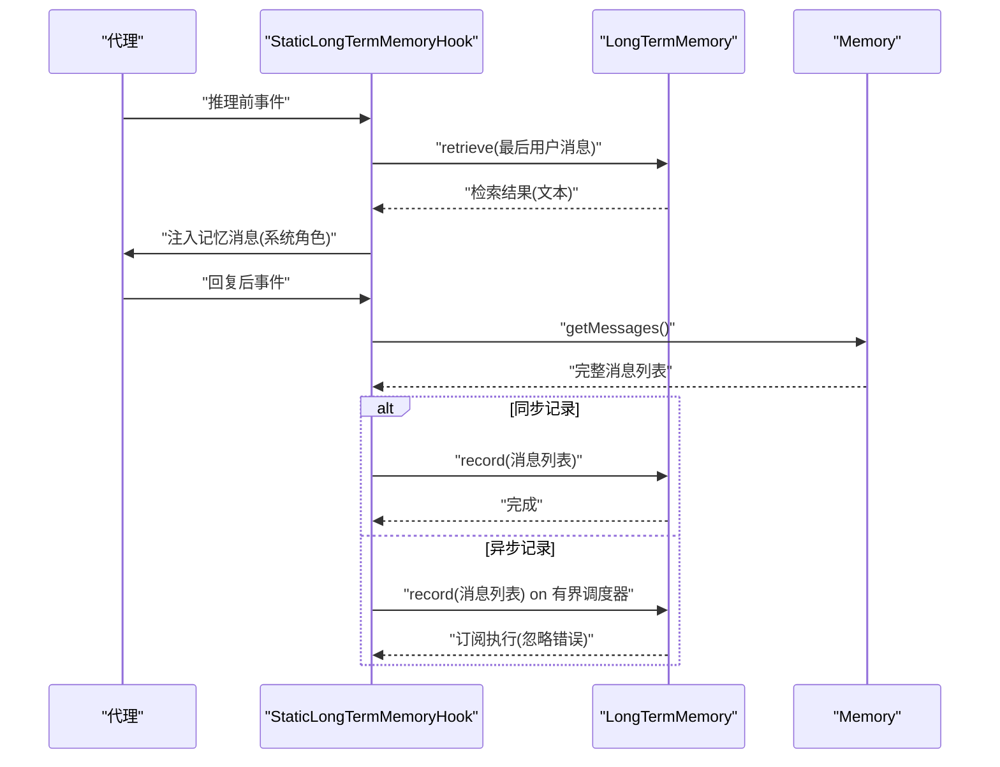
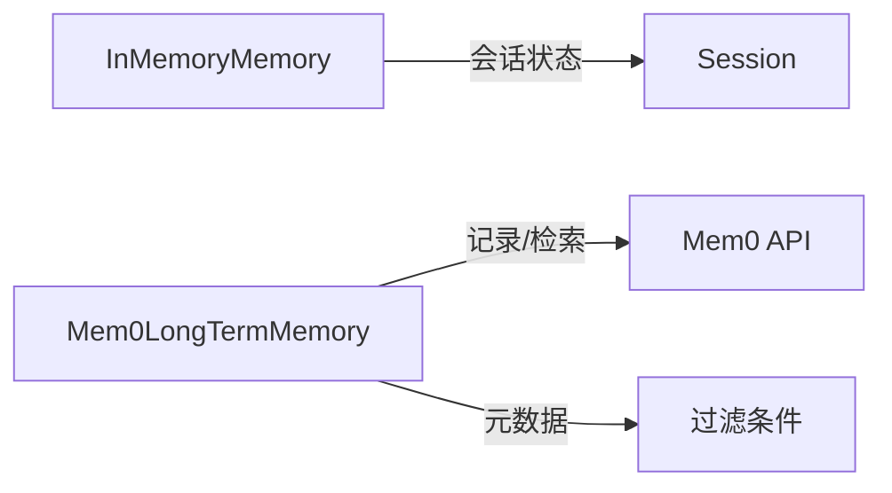
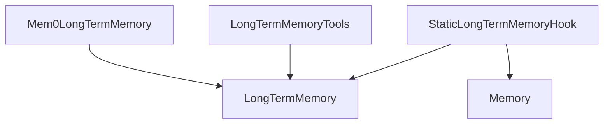

# 长期记忆

<cite>
**本文引用的文件**
- [agentscope-core/src/main/java/io/agentscope/core/memory/LongTermMemory.java](file://agentscope-core/src/main/java/io/agentscope/core/memory/LongTermMemory.java)
- [agentscope-core/src/main/java/io/agentscope/core/memory/Memory.java](file://agentscope-core/src/main/java/io/agentscope/core/memory/Memory.java)
- [agentscope-core/src/main/java/io/agentscope/core/memory/InMemoryMemory.java](file://agentscope-core/src/main/java/io/agentscope/core/memory/InMemoryMemory.java)
- [agentscope-core/src/main/java/io/agentscope/core/memory/LongTermMemoryMode.java](file://agentscope-core/src/main/java/io/agentscope/core/memory/LongTermMemoryMode.java)
- [agentscope-core/src/main/java/io/agentscope/core/memory/StaticLongTermMemoryHook.java](file://agentscope-core/src/main/java/io/agentscope/core/memory/StaticLongTermMemoryHook.java)
- [agentscope-core/src/main/java/io/agentscope/core/memory/LongTermMemoryTools.java](file://agentscope-core/src/main/java/io/agentscope/core/memory/LongTermMemoryTools.java)
- [agentscope-extensions/agentscope-extensions-mem0/src/main/java/io/agentscope/core/memory/mem0/Mem0LongTermMemory.java](file://agentscope-extensions/agentscope-extensions-mem0/src/main/java/io/agentscope/core/memory/mem0/Mem0LongTermMemory.java)
- [agentscope-examples/advanced/src/main/java/io/agentscope/examples/advanced/Mem0Example.java](file://agentscope-examples/advanced/src/main/java/io/agentscope/examples/advanced/Mem0Example.java)
- [agentscope-examples/advanced/src/main/java/io/agentscope/examples/advanced/AutoMemoryExample.java](file://agentscope-examples/advanced/src/main/java/io/agentscope/examples/advanced/AutoMemoryExample.java)
- [agentscope-core/src/test/java/io/agentscope/core/memory/LongTermMemoryToolsTest.java](file://agentscope-core/src/test/java/io/agentscope/core/memory/LongTermMemoryToolsTest.java)
- [agentscope-core/src/test/java/io/agentscope/core/memory/StaticLongTermMemoryHookTest.java](file://agentscope-core/src/test/java/io/agentscope/core/memory/StaticLongTermMemoryHookTest.java)
</cite>

## 目录
1. [简介](#简介)
2. [项目结构](#项目结构)
3. [核心组件](#核心组件)
4. [架构总览](#架构总览)
5. [详细组件分析](#详细组件分析)
6. [依赖分析](#依赖分析)
7. [性能考量](#性能考量)
8. [故障排查指南](#故障排查指南)
9. [结论](#结论)
10. [附录](#附录)

## 简介
本章节面向 AgentScope Java 框架的长期记忆系统，系统性阐述其架构设计、实现原理与最佳实践。重点覆盖：
- 内存模式（InMemoryMemory）与持久化模式（Mem0LongTermMemory）的差异与适用场景
- 静态长期记忆钩子（StaticLongTermMemoryHook）的自动控制机制
- 长期记忆工具（LongTermMemoryTools）的代理适配与工具注册
- 配置选项、存储策略、检索算法与性能优化
- 语义搜索与向量嵌入处理流程
- 与不同存储后端（如 Mem0）的集成方案
- 在实际应用中的最佳实践与性能考虑

## 项目结构
围绕长期记忆功能，核心代码位于 agentscope-core 的 memory 包中，并通过扩展模块接入外部存储后端（如 Mem0）。示例代码展示了典型用法。

**图表来源**
- [agentscope-core/src/main/java/io/agentscope/core/memory/LongTermMemory.java:67-107](file://agentscope-core/src/main/java/io/agentscope/core/memory/LongTermMemory.java#L67-L107)
- [agentscope-core/src/main/java/io/agentscope/core/memory/Memory.java:29-62](file://agentscope-core/src/main/java/io/agentscope/core/memory/Memory.java#L29-L62)
- [agentscope-core/src/main/java/io/agentscope/core/memory/InMemoryMemory.java:33-127](file://agentscope-core/src/main/java/io/agentscope/core/memory/InMemoryMemory.java#L33-L127)
- [agentscope-core/src/main/java/io/agentscope/core/memory/LongTermMemoryMode.java:52-68](file://agentscope-core/src/main/java/io/agentscope/core/memory/LongTermMemoryMode.java#L52-L68)
- [agentscope-core/src/main/java/io/agentscope/core/memory/StaticLongTermMemoryHook.java:75-297](file://agentscope-core/src/main/java/io/agentscope/core/memory/StaticLongTermMemoryHook.java#L75-L297)
- [agentscope-core/src/main/java/io/agentscope/core/memory/LongTermMemoryTools.java:65-213](file://agentscope-core/src/main/java/io/agentscope/core/memory/LongTermMemoryTools.java#L65-L213)
- [agentscope-extensions/agentscope-extensions-mem0/src/main/java/io/agentscope/core/memory/mem0/Mem0LongTermMemory.java:113-439](file://agentscope-extensions/agentscope-extensions-mem0/src/main/java/io/agentscope/core/memory/mem0/Mem0LongTermMemory.java#L113-L439)
- [agentscope-examples/advanced/src/main/java/io/agentscope/examples/advanced/Mem0Example.java:33-99](file://agentscope-examples/advanced/src/main/java/io/agentscope/examples/advanced/Mem0Example.java#L33-L99)
- [agentscope-examples/advanced/src/main/java/io/agentscope/examples/advanced/AutoMemoryExample.java:45-142](file://agentscope-examples/advanced/src/main/java/io/agentscope/examples/advanced/AutoMemoryExample.java#L45-L142)

**章节来源**
- [agentscope-core/src/main/java/io/agentscope/core/memory/LongTermMemory.java:22-107](file://agentscope-core/src/main/java/io/agentscope/core/memory/LongTermMemory.java#L22-L107)
- [agentscope-core/src/main/java/io/agentscope/core/memory/LongTermMemoryMode.java:18-68](file://agentscope-core/src/main/java/io/agentscope/core/memory/LongTermMemoryMode.java#L18-L68)
- [agentscope-extensions/agentscope-extensions-mem0/src/main/java/io/agentscope/core/memory/mem0/Mem0LongTermMemory.java:27-108](file://agentscope-extensions/agentscope-extensions-mem0/src/main/java/io/agentscope/core/memory/mem0/Mem0LongTermMemory.java#L27-L108)

## 核心组件
- 长期记忆接口（LongTermMemory）
  - 定义记录与检索两大异步操作，返回 Reactor Mono，确保非阻塞集成。
  - 记录：从对话消息中抽取“可记忆信息”并持久化。
  - 检索：基于输入消息进行相关性搜索，返回文本片段供系统提示词增强。
- 内存接口（Memory）与内存实现（InMemoryMemory）
  - Memory 提供会话级状态持久化能力（保存/加载），支持线程安全的消息列表。
  - InMemoryMemory 使用并发安全集合，提供消息增删查清与状态序列化/反序列化。
- 长期记忆模式（LongTermMemoryMode）
  - AGENT_CONTROL：由代理通过工具调用自主控制记忆。
  - STATIC_CONTROL：框架自动管理，无需代理参与。
  - BOTH：结合自动管理与代理控制。
- 静态长期记忆钩子（StaticLongTermMemoryHook）
  - 在推理前注入检索到的记忆，在回复后记录完整对话。
  - 支持同步/异步记录，异步路径采用有界调度器避免无界排队。
- 长期记忆工具适配器（LongTermMemoryTools）
  - 将核心 API 适配为代理可用的工具函数，便于在 AGENT_CONTROL 模式下使用。
  - 提供检索与记录两类工具，内部负责消息构造与错误处理。

**章节来源**
- [agentscope-core/src/main/java/io/agentscope/core/memory/LongTermMemory.java:67-107](file://agentscope-core/src/main/java/io/agentscope/core/memory/LongTermMemory.java#L67-L107)
- [agentscope-core/src/main/java/io/agentscope/core/memory/Memory.java:29-62](file://agentscope-core/src/main/java/io/agentscope/core/memory/Memory.java#L29-L62)
- [agentscope-core/src/main/java/io/agentscope/core/memory/InMemoryMemory.java:33-127](file://agentscope-core/src/main/java/io/agentscope/core/memory/InMemoryMemory.java#L33-L127)
- [agentscope-core/src/main/java/io/agentscope/core/memory/LongTermMemoryMode.java:52-68](file://agentscope-core/src/main/java/io/agentscope/core/memory/LongTermMemoryMode.java#L52-L68)
- [agentscope-core/src/main/java/io/agentscope/core/memory/StaticLongTermMemoryHook.java:75-297](file://agentscope-core/src/main/java/io/agentscope/core/memory/StaticLongTermMemoryHook.java#L75-L297)
- [agentscope-core/src/main/java/io/agentscope/core/memory/LongTermMemoryTools.java:65-213](file://agentscope-core/src/main/java/io/agentscope/core/memory/LongTermMemoryTools.java#L65-L213)

## 架构总览
长期记忆系统通过“接口 + 钩子 + 工具适配器”的分层设计，实现与代理框架的无缝集成。Mem0 等后端实现遵循统一接口，保证替换透明。

**图表来源**
- [agentscope-core/src/main/java/io/agentscope/core/memory/LongTermMemory.java:67-107](file://agentscope-core/src/main/java/io/agentscope/core/memory/LongTermMemory.java#L67-L107)
- [agentscope-core/src/main/java/io/agentscope/core/memory/Memory.java:29-62](file://agentscope-core/src/main/java/io/agentscope/core/memory/Memory.java#L29-L62)
- [agentscope-core/src/main/java/io/agentscope/core/memory/InMemoryMemory.java:33-127](file://agentscope-core/src/main/java/io/agentscope/core/memory/InMemoryMemory.java#L33-L127)
- [agentscope-core/src/main/java/io/agentscope/core/memory/StaticLongTermMemoryHook.java:75-297](file://agentscope-core/src/main/java/io/agentscope/core/memory/StaticLongTermMemoryHook.java#L75-L297)
- [agentscope-core/src/main/java/io/agentscope/core/memory/LongTermMemoryTools.java:65-213](file://agentscope-core/src/main/java/io/agentscope/core/memory/LongTermMemoryTools.java#L65-L213)
- [agentscope-extensions/agentscope-extensions-mem0/src/main/java/io/agentscope/core/memory/mem0/Mem0LongTermMemory.java:113-439](file://agentscope-extensions/agentscope-extensions-mem0/src/main/java/io/agentscope/core/memory/mem0/Mem0LongTermMemory.java#L113-L439)

## 详细组件分析

### 静态长期记忆钩子（StaticLongTermMemoryHook）
- 触发时机
  - 推理前：从长期记忆检索相关内容，注入为系统消息，增强上下文。
  - 回复后：将当前会话的完整消息历史记录到长期记忆，供后续检索。
- 自动化与容错
  - 检索失败或记录失败均被吞掉并记录日志，不中断主流程。
  - 异步记录采用有界弹性调度器，限制并发与队列长度，避免资源膨胀。
- 关键行为
  - 优先级高（50），确保在事件链早期执行。
  - 从记忆中提取最后一条用户消息作为查询，避免系统/工具消息干扰。

**图表来源**
- [agentscope-core/src/main/java/io/agentscope/core/memory/StaticLongTermMemoryHook.java:121-259](file://agentscope-core/src/main/java/io/agentscope/core/memory/StaticLongTermMemoryHook.java#L121-L259)

**章节来源**
- [agentscope-core/src/main/java/io/agentscope/core/memory/StaticLongTermMemoryHook.java:141-259](file://agentscope-core/src/main/java/io/agentscope/core/memory/StaticLongTermMemoryHook.java#L141-L259)

### 长期记忆工具适配器（LongTermMemoryTools）
- 作用
  - 将核心 LongTermMemory 的 record/retrieve 适配为代理工具函数，便于在 AGENT_CONTROL 模式下由代理主动调用。
- 行为要点
  - 记录工具：将“思考”与“事实清单”组合为消息列表，按角色区分后调用底层 record。
  - 检索工具：将关键词拼接为查询消息，调用底层 retrieve 并对结果进行包装。
  - 错误处理：捕获异常并返回友好提示，不中断代理流程。

```mermaid
flowchart TD
Start(["调用工具"]) --> Op{"操作类型？"}
Op --> |记录| BuildMsgs["构建消息列表<br/>思考(助手)+事实(用户)"]
BuildMsgs --> CallRecord["调用 LongTermMemory.record(...)"]
CallRecord --> Done1["返回成功/错误提示"]
Op --> |检索| JoinKeys["拼接关键词为查询"]
JoinKeys --> BuildQuery["构造查询消息"]
BuildQuery --> CallRetrieve["调用 LongTermMemory.retrieve(...)"]
CallRetrieve --> Wrap["包装检索结果"]
Wrap --> Done2["返回结果/空提示"]
```

**图表来源**
- [agentscope-core/src/main/java/io/agentscope/core/memory/LongTermMemoryTools.java:101-212](file://agentscope-core/src/main/java/io/agentscope/core/memory/LongTermMemoryTools.java#L101-L212)

**章节来源**
- [agentscope-core/src/main/java/io/agentscope/core/memory/LongTermMemoryTools.java:65-213](file://agentscope-core/src/main/java/io/agentscope/core/memory/LongTermMemoryTools.java#L65-L213)

### 内存模式（InMemoryMemory）与持久化模式（Mem0LongTermMemory）
- InMemoryMemory
  - 会话内内存存储，支持状态序列化/反序列化，适合短期会话与快速验证。
  - 与 Memory 接口一致，便于在代理中直接使用。
- Mem0LongTermMemory
  - 基于 Mem0 的持久化长期记忆实现，具备：
    - 多租户元数据隔离（agentId、userId、runId）
    - 自定义元数据过滤
    - 语义检索（向量嵌入 + LLM 抽取）
    - 非阻塞、可配置超时与 API 类型（平台/自托管）

**图表来源**
- [agentscope-core/src/main/java/io/agentscope/core/memory/InMemoryMemory.java:57-74](file://agentscope-core/src/main/java/io/agentscope/core/memory/InMemoryMemory.java#L57-L74)
- [agentscope-extensions/agentscope-extensions-mem0/src/main/java/io/agentscope/core/memory/mem0/Mem0LongTermMemory.java:113-439](file://agentscope-extensions/agentscope-extensions-mem0/src/main/java/io/agentscope/core/memory/mem0/Mem0LongTermMemory.java#L113-L439)

**章节来源**
- [agentscope-core/src/main/java/io/agentscope/core/memory/InMemoryMemory.java:33-127](file://agentscope-core/src/main/java/io/agentscope/core/memory/InMemoryMemory.java#L33-L127)
- [agentscope-extensions/agentscope-extensions-mem0/src/main/java/io/agentscope/core/memory/mem0/Mem0LongTermMemory.java:113-439](file://agentscope-extensions/agentscope-extensions-mem0/src/main/java/io/agentscope/core/memory/mem0/Mem0LongTermMemory.java#L113-L439)

### 配置选项、存储策略与检索算法
- 配置选项（Mem0 实现）
  - 标识符：agentName、userId、runName（至少一个必填）
  - 元数据：metadata（用于存储与检索过滤）
  - API：apiBaseUrl、apiKey、apiType（平台/自托管）、timeout
- 存储策略
  - 过滤无效消息（空文本、压缩占位等），保留对话结构（角色映射）。
  - 记录时启用“推断”抽取可记忆信息。
- 检索算法
  - 语义搜索：基于查询构建检索请求，合并自定义元数据为过滤条件，返回匹配的记忆文本拼接。
  - TopK 默认值可按需调整。

**章节来源**
- [agentscope-extensions/agentscope-extensions-mem0/src/main/java/io/agentscope/core/memory/mem0/Mem0LongTermMemory.java:156-292](file://agentscope-extensions/agentscope-extensions-mem0/src/main/java/io/agentscope/core/memory/mem0/Mem0LongTermMemory.java#L156-L292)

### 与不同存储后端的集成方案
- Mem0
  - 通过 Builder 注入标识符与元数据，自动进行角色转换与消息过滤。
  - 检索时合并元数据为过滤条件，确保多租户隔离与精准召回。
- 其他后端
  - 只需实现 LongTermMemory 接口，即可无缝替换为其他存储后端（如数据库、向量库等）。

**章节来源**
- [agentscope-extensions/agentscope-extensions-mem0/src/main/java/io/agentscope/core/memory/mem0/Mem0LongTermMemory.java:294-439](file://agentscope-extensions/agentscope-extensions-mem0/src/main/java/io/agentscope/core/memory/mem0/Mem0LongTermMemory.java#L294-L439)

### 实际应用场景与最佳实践
- Mem0 示例
  - 展示了在 STATIC_CONTROL 模式下，代理自动注入检索到的记忆并记录对话。
- AutoMemory 示例
  - 结合 AutoContextMemory 与 Mem0，演示在长上下文场景下的自动压缩与检索增强。
- 最佳实践
  - 选择模式：默认推荐 BOTH；需要代理完全自治时使用 AGENT_CONTROL；简单场景使用 STATIC_CONTROL。
  - 异步记录：在高并发场景开启异步记录，避免阻塞代理响应。
  - 元数据：合理设置 agentId、userId、runId 与自定义 metadata，提升检索精度与隔离性。
  - 错误处理：钩子与工具均对异常进行吞并与降级，生产环境建议增加可观测性与重试策略。

**章节来源**
- [agentscope-examples/advanced/src/main/java/io/agentscope/examples/advanced/Mem0Example.java:33-99](file://agentscope-examples/advanced/src/main/java/io/agentscope/examples/advanced/Mem0Example.java#L33-L99)
- [agentscope-examples/advanced/src/main/java/io/agentscope/examples/advanced/AutoMemoryExample.java:45-142](file://agentscope-examples/advanced/src/main/java/io/agentscope/examples/advanced/AutoMemoryExample.java#L45-L142)

## 依赖分析
- 组件耦合
  - StaticLongTermMemoryHook 依赖 LongTermMemory 与 Memory，形成“检索注入 + 记录归档”的闭环。
  - LongTermMemoryTools 仅依赖 LongTermMemory，保持与代理工具系统的解耦。
  - Mem0LongTermMemory 实现遵循 LongTermMemory 接口，便于替换。
- 外部依赖
  - Mem0 实现依赖 Mem0Client 与 API 请求对象，封装检索与添加逻辑。
- 循环依赖
  - 当前结构清晰，未发现循环依赖。

**图表来源**
- [agentscope-core/src/main/java/io/agentscope/core/memory/StaticLongTermMemoryHook.java:85-119](file://agentscope-core/src/main/java/io/agentscope/core/memory/StaticLongTermMemoryHook.java#L85-L119)
- [agentscope-core/src/main/java/io/agentscope/core/memory/LongTermMemoryTools.java:67-80](file://agentscope-core/src/main/java/io/agentscope/core/memory/LongTermMemoryTools.java#L67-L80)
- [agentscope-extensions/agentscope-extensions-mem0/src/main/java/io/agentscope/core/memory/mem0/Mem0LongTermMemory.java:115-147](file://agentscope-extensions/agentscope-extensions-mem0/src/main/java/io/agentscope/core/memory/mem0/Mem0LongTermMemory.java#L115-L147)

**章节来源**
- [agentscope-core/src/main/java/io/agentscope/core/memory/StaticLongTermMemoryHook.java:85-119](file://agentscope-core/src/main/java/io/agentscope/core/memory/StaticLongTermMemoryHook.java#L85-L119)
- [agentscope-core/src/main/java/io/agentscope/core/memory/LongTermMemoryTools.java:67-80](file://agentscope-core/src/main/java/io/agentscope/core/memory/LongTermMemoryTools.java#L67-L80)
- [agentscope-extensions/agentscope-extensions-mem0/src/main/java/io/agentscope/core/memory/mem0/Mem0LongTermMemory.java:115-147](file://agentscope-extensions/agentscope-extensions-mem0/src/main/java/io/agentscope/core/memory/mem0/Mem0LongTermMemory.java#L115-L147)

## 性能考量
- 异步记录
  - 采用有界弹性调度器（1 worker，队列容量 3），饱和时丢弃新任务并记录告警，避免背压无限放大。
- 检索与记录过滤
  - 记录前过滤空文本与压缩占位，减少无效写入。
  - 检索时合并元数据为过滤条件，降低无关结果噪声。
- 上下文管理
  - AutoContextMemory 在达到阈值时触发多级压缩策略，降低上下文窗口压力，提升推理效率。
- 超时与重试
  - Mem0 实现支持超时配置，建议根据网络与服务延迟调优；生产环境可结合重试与熔断策略。

[本节为通用性能指导，不直接分析具体文件]

## 故障排查指南
- 记录失败
  - 现象：异步记录被丢弃或出现告警。
  - 排查：检查调度器饱和情况、网络连通性、API 密钥与超时配置。
- 检索为空
  - 现象：检索返回空文本。
  - 排查：确认查询内容是否有效、元数据过滤是否过严、目标租户是否存在数据。
- 工具调用异常
  - 现象：工具返回错误提示。
  - 排查：查看工具参数（关键词/内容）是否为空、后端是否可达。
- 单元测试参考
  - 测试覆盖了工具与钩子的边界条件、错误处理与异步记录行为，可对照定位问题。

**章节来源**
- [agentscope-core/src/test/java/io/agentscope/core/memory/LongTermMemoryToolsTest.java:168-177](file://agentscope-core/src/test/java/io/agentscope/core/memory/LongTermMemoryToolsTest.java#L168-L177)
- [agentscope-core/src/test/java/io/agentscope/core/memory/StaticLongTermMemoryHookTest.java:245-255](file://agentscope-core/src/test/java/io/agentscope/core/memory/StaticLongTermMemoryHookTest.java#L245-L255)

## 结论
AgentScope Java 的长期记忆系统通过清晰的接口抽象、自动化的钩子机制与灵活的工具适配器，实现了从“检索增强”到“记忆持久化”的全链路能力。结合 Mem0 等后端，可在多租户、语义检索与上下文压缩等方面获得稳健表现。推荐在生产环境中采用 BOTH 模式，配合异步记录与合理的元数据策略，以平衡自动化与可控性。

[本节为总结性内容，不直接分析具体文件]

## 附录
- 示例入口
  - Mem0 示例：展示 STATIC_CONTROL 模式下的自动记忆注入与记录。
  - AutoMemory 示例：结合 AutoContextMemory 与 Mem0，演示长上下文场景下的压缩与检索。
- 相关文件
  - 接口与实现：LongTermMemory、Memory、InMemoryMemory、Mem0LongTermMemory
  - 控制与工具：StaticLongTermMemoryHook、LongTermMemoryTools
  - 配置与示例：LongTermMemoryMode、Mem0Example、AutoMemoryExample

**章节来源**
- [agentscope-examples/advanced/src/main/java/io/agentscope/examples/advanced/Mem0Example.java:33-99](file://agentscope-examples/advanced/src/main/java/io/agentscope/examples/advanced/Mem0Example.java#L33-L99)
- [agentscope-examples/advanced/src/main/java/io/agentscope/examples/advanced/AutoMemoryExample.java:45-142](file://agentscope-examples/advanced/src/main/java/io/agentscope/examples/advanced/AutoMemoryExample.java#L45-L142)