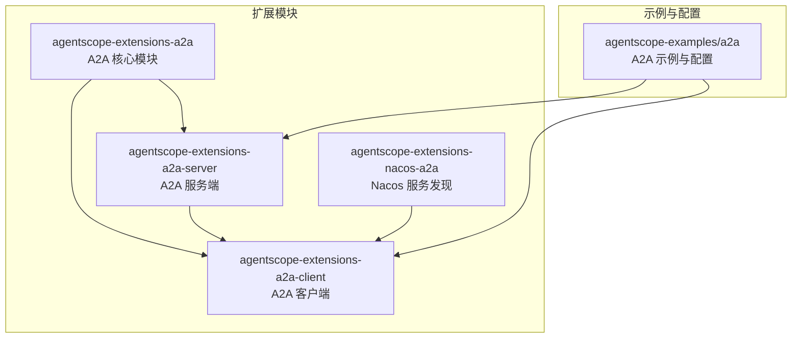
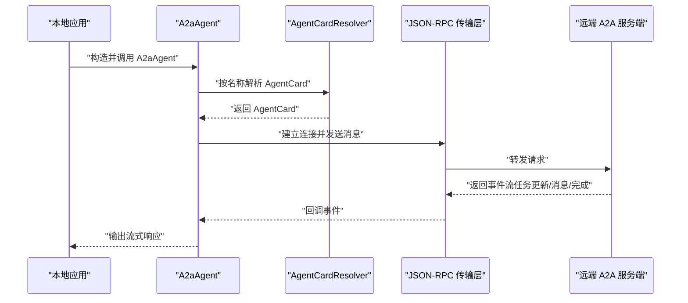
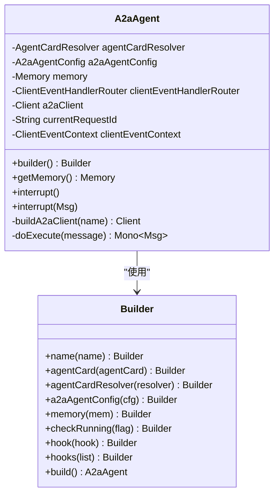
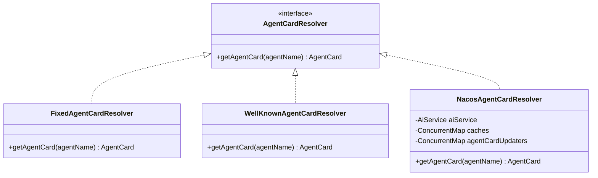
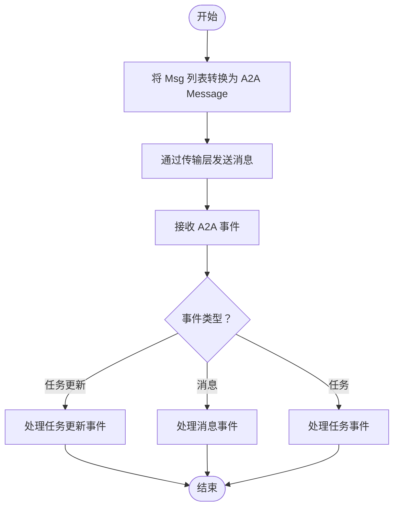
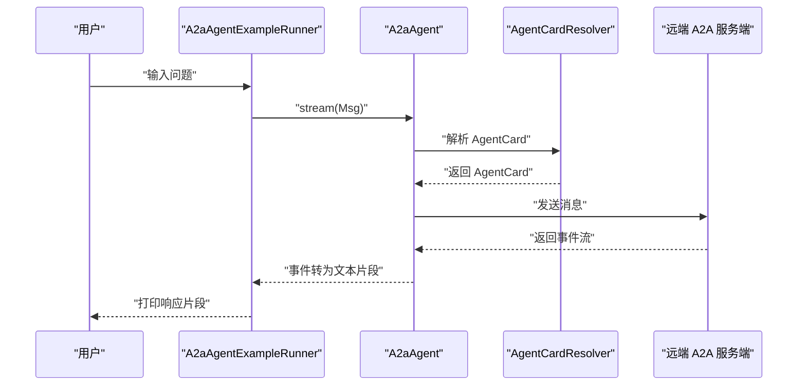
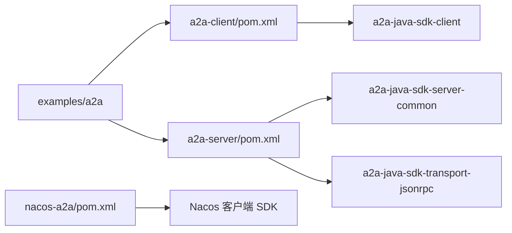

# A2A 协议集成

<cite>
**本文引用的文件**   
- [A2aAgent.java](file://agentscope-extensions/agentscope-extensions-a2a/agentscope-extensions-a2a-client/src/main/java/io/agentscope/core/a2a/agent/A2aAgent.java)
- [AgentCardResolver.java](file://agentscope-extensions/agentscope-extensions-a2a/agentscope-extensions-a2a-client/src/main/java/io/agentscope/core/a2a/agent/card/AgentCardResolver.java)
- [FixedAgentCardResolver.java](file://agentscope-extensions/agentscope-extensions-a2a/agentscope-extensions-a2a-client/src/main/java/io/agentscope/core/a2a/agent/card/FixedAgentCardResolver.java)
- [WellKnownAgentCardResolver.java](file://agentscope-extensions/agentscope-extensions-a2a/agentscope-extensions-a2a-client/src/main/java/io/agentscope/core/a2a/agent/card/WellKnownAgentCardResolver.java)
- [NacosAgentCardResolver.java](file://agentscope-extensions/agentscope-extensions-nacos/agentscope-extensions-nacos-a2a/src/main/java/io/agentscope/core/nacos/a2a/discovery/NacosAgentCardResolver.java)
- [MessageConvertUtil.java](file://agentscope-extensions/agentscope-extensions-a2a/agentscope-extensions-a2a-client/src/main/java/io/agentscope/core/a2a/agent/utils/MessageConvertUtil.java)
- [ClientEventHandlerRouter.java](file://agentscope-extensions/agentscope-extensions-a2a/agentscope-extensions-a2a-client/src/main/java/io/agentscope/core/a2a/agent/event/ClientEventHandlerRouter.java)
- [A2aAgentExampleRunner.java](file://agentscope-examples/a2a/src/main/java/io/agentscope/examples/a2a/A2aAgentExampleRunner.java)
- [SimpleA2aAgentExample.java](file://agentscope-examples/a2a/src/main/java/io/agentscope/examples/a2a/SimpleA2aAgentExample.java)
- [NacosA2aAgentExample.java](file://agentscope-examples/a2a/src/main/java/io/agentscope/examples/a2a/NacosA2aAgentExample.java)
- [application.yml](file://agentscope-examples/a2a/src/main/resources/application.yml)
- [agentscope-extensions-a2a-client/pom.xml](file://agentscope-extensions/agentscope-extensions-a2a/agentscope-extensions-a2a-client/pom.xml)
- [agentscope-extensions-a2a-server/pom.xml](file://agentscope-extensions/agentscope-extensions-a2a/agentscope-extensions-a2a-server/pom.xml)
- [agentscope-extensions-a2a/pom.xml](file://agentscope-extensions/agentscope-extensions-a2a/pom.xml)
</cite>

## 目录
1. [引言](#引言)
2. [项目结构](#项目结构)
3. [核心组件](#核心组件)
4. [架构总览](#架构总览)
5. [组件详解](#组件详解)
6. [依赖关系分析](#依赖关系分析)
7. [性能与可扩展性](#性能与可扩展性)
8. [故障排查指南](#故障排查指南)
9. [结论](#结论)
10. [附录：完整配置示例](#附录完整配置示例)

## 引言
本文件面向希望在 AgentScope Java 中集成 A2A（Agent-to-Agent）协议的开发者，系统阐述 A2A 协议的设计理念、分布式多智能体协作机制，以及在 AgentScope 中的具体实现与最佳实践。重点覆盖以下方面：
- A2aAgent 的实现原理：消息转换、事件路由、中断处理与生命周期钩子
- 服务发现与注册：AgentCard 解析器（固定、已知地址、Nacos）
- 跨网络通信：基于 a2a-java-sdk 的 JSON-RPC 传输层
- 配置示例：客户端与服务端、Nacos 服务发现、RocketMQ 传输层（如需扩展）
- 分布式系统构建：任务分发、结果聚合与故障转移策略

## 项目结构
A2A 协议在 AgentScope 中以“扩展模块”形式组织，核心代码位于扩展模块中，示例与配置位于 examples 模块。

图示来源
- [agentscope-extensions-a2a/pom.xml:33-36](file://agentscope-extensions/agentscope-extensions-a2a/pom.xml#L33-L36)
- [agentscope-extensions-a2a-client/pom.xml:32-44](file://agentscope-extensions/agentscope-extensions-a2a/agentscope-extensions-a2a-client/pom.xml#L32-L44)
- [agentscope-extensions-a2a-server/pom.xml:33-55](file://agentscope-extensions/agentscope-extensions-a2a/agentscope-extensions-a2a-server/pom.xml#L33-L55)

章节来源
- [agentscope-extensions-a2a/pom.xml:33-36](file://agentscope-extensions/agentscope-extensions-a2a/pom.xml#L33-L36)
- [agentscope-extensions-a2a-client/pom.xml:32-44](file://agentscope-extensions/agentscope-extensions-a2a/agentscope-extensions-a2a-client/pom.xml#L32-L44)
- [agentscope-extensions-a2a-server/pom.xml:33-55](file://agentscope-extensions/agentscope-extensions-a2a/agentscope-extensions-a2a-server/pom.xml#L33-L55)

## 核心组件
- A2aAgent：面向 AgentScope 的 A2A 客户端代理，负责消息封装、调用执行、事件处理与资源释放。
- AgentCardResolver 及其实现：解析远端代理的元信息（AgentCard），支持固定、已知地址与 Nacos 三种方式。
- MessageConvertUtil：在 AgentScope 的 Msg 与 A2A 的 Message/Artifact 之间进行双向转换。
- ClientEventHandlerRouter：根据事件类型分派到具体处理器，完成任务状态更新、消息流与任务生命周期事件处理。
- 示例与配置：演示如何以不同服务发现方式调用远端 A2A 代理，并提供基础应用配置模板。

章节来源
- [A2aAgent.java:71-112](file://agentscope-extensions/agentscope-extensions-a2a/agentscope-extensions-a2a-client/src/main/java/io/agentscope/core/a2a/agent/A2aAgent.java#L71-L112)
- [AgentCardResolver.java:24-33](file://agentscope-extensions/agentscope-extensions-a2a/agentscope-extensions-a2a-client/src/main/java/io/agentscope/core/a2a/agent/card/AgentCardResolver.java#L24-L33)
- [MessageConvertUtil.java:38-157](file://agentscope-extensions/agentscope-extensions-a2a/agentscope-extensions-a2a-client/src/main/java/io/agentscope/core/a2a/agent/utils/MessageConvertUtil.java#L38-L157)
- [ClientEventHandlerRouter.java:29-68](file://agentscope-extensions/agentscope-extensions-a2a/agentscope-extensions-a2a-client/src/main/java/io/agentscope/core/a2a/agent/event/ClientEventHandlerRouter.java#L29-L68)

## 架构总览
下图展示了从本地 A2aAgent 发起请求，经由 AgentCard 解析器获取远端代理信息，再通过 JSON-RPC 传输层发送消息，最终由远端服务端处理并返回事件流的整体流程。

图示来源
- [A2aAgent.java:186-196](file://agentscope-extensions/agentscope-extensions-a2a/agentscope-extensions-a2a-client/src/main/java/io/agentscope/core/a2a/agent/A2aAgent.java#L186-L196)
- [ClientEventHandlerRouter.java:56-67](file://agentscope-extensions/agentscope-extensions-a2a/agentscope-extensions-a2a-client/src/main/java/io/agentscope/core/a2a/agent/event/ClientEventHandlerRouter.java#L56-L67)

## 组件详解

### A2aAgent：代理调用与事件处理
- 生命周期与钩子：在 PreCallEvent 时初始化请求 ID、事件上下文与 A2A 客户端；在 PostCallEvent/ErrorEvent 时释放资源，避免连接泄漏。
- 请求执行：将输入消息转换为 A2A Message，通过 sendMessage 发送，并以事件回调驱动响应流。
- 中断处理：通过 cancelTask 主动取消远端任务，返回中断提示消息。
- 默认传输：若未显式配置传输层，则自动启用 JSON-RPC 传输。

图示来源
- [A2aAgent.java:71-112](file://agentscope-extensions/agentscope-extensions-a2a/agentscope-extensions-a2a-client/src/main/java/io/agentscope/core/a2a/agent/A2aAgent.java#L71-L112)
- [A2aAgent.java:186-214](file://agentscope-extensions/agentscope-extensions-a2a/agentscope-extensions-a2a-client/src/main/java/io/agentscope/core/a2a/agent/A2aAgent.java#L186-L214)
- [A2aAgent.java:216-260](file://agentscope-extensions/agentscope-extensions-a2a/agentscope-extensions-a2a-client/src/main/java/io/agentscope/core/a2a/agent/A2aAgent.java#L216-L260)
- [A2aAgent.java:262-414](file://agentscope-extensions/agentscope-extensions-a2a/agentscope-extensions-a2a-client/src/main/java/io/agentscope/core/a2a/agent/A2aAgent.java#L262-L414)

章节来源
- [A2aAgent.java:114-131](file://agentscope-extensions/agentscope-extensions-a2a/agentscope-extensions-a2a-client/src/main/java/io/agentscope/core/a2a/agent/A2aAgent.java#L114-L131)
- [A2aAgent.java:133-171](file://agentscope-extensions/agentscope-extensions-a2a/agentscope-extensions-a2a-client/src/main/java/io/agentscope/core/a2a/agent/A2aAgent.java#L133-L171)
- [A2aAgent.java:186-196](file://agentscope-extensions/agentscope-extensions-a2a/agentscope-extensions-a2a-client/src/main/java/io/agentscope/core/a2a/agent/A2aAgent.java#L186-L196)
- [A2aAgent.java:216-260](file://agentscope-extensions/agentscope-extensions-a2a/agentscope-extensions-a2a-client/src/main/java/io/agentscope/core/a2a/agent/A2aAgent.java#L216-L260)

### AgentCardResolver 体系：服务发现与注册
- 接口职责：按代理名称返回 AgentCard，用于后续连接与能力声明。
- 固定解析器：直接注入已知 AgentCard，适合静态配置场景。
- 已知地址解析器：通过标准路径获取远端代理的 AgentCard，适合标准化部署。
- Nacos 解析器：订阅 Nacos A2A 注册中心，动态拉取与更新 AgentCard，支持认证与缓存。

图示来源
- [AgentCardResolver.java:24-33](file://agentscope-extensions/agentscope-extensions-a2a/agentscope-extensions-a2a-client/src/main/java/io/agentscope/core/a2a/agent/card/AgentCardResolver.java#L24-L33)
- [FixedAgentCardResolver.java](file://agentscope-extensions/agentscope-extensions-a2a/agentscope-extensions-a2a-client/src/main/java/io/agentscope/core/a2a/agent/card/FixedAgentCardResolver.java)
- [WellKnownAgentCardResolver.java](file://agentscope-extensions/agentscope-extensions-a2a/agentscope-extensions-a2a-client/src/main/java/io/agentscope/core/a2a/agent/card/WellKnownAgentCardResolver.java)
- [NacosAgentCardResolver.java:59-122](file://agentscope-extensions/agentscope-extensions-nacos/agentscope-extensions-nacos-a2a/src/main/java/io/agentscope/core/nacos/a2a/discovery/NacosAgentCardResolver.java#L59-L122)

章节来源
- [NacosAgentCardResolver.java:90-111](file://agentscope-extensions/agentscope-extensions-nacos/agentscope-extensions-nacos-a2a/src/main/java/io/agentscope/core/nacos/a2a/discovery/NacosAgentCardResolver.java#L90-L111)

### 消息转换与事件路由
- 消息转换：将 AgentScope 的 Msg 转换为 A2A 的 Message/Artifact，保留元数据与角色映射；反向转换时恢复为 Msg。
- 事件路由：根据事件类型（任务更新、消息、任务生命周期）分派到对应处理器，统一处理响应流与状态变更。

图示来源
- [MessageConvertUtil.java:104-136](file://agentscope-extensions/agentscope-extensions-a2a/agentscope-extensions-a2a-client/src/main/java/io/agentscope/core/a2a/agent/utils/MessageConvertUtil.java#L104-L136)
- [ClientEventHandlerRouter.java:56-67](file://agentscope-extensions/agentscope-extensions-a2a/agentscope-extensions-a2a-client/src/main/java/io/agentscope/core/a2a/agent/event/ClientEventHandlerRouter.java#L56-L67)

章节来源
- [MessageConvertUtil.java:46-96](file://agentscope-extensions/agentscope-extensions-a2a/agentscope-extensions-a2a-client/src/main/java/io/agentscope/core/a2a/agent/utils/MessageConvertUtil.java#L46-L96)
- [ClientEventHandlerRouter.java:29-68](file://agentscope-extensions/agentscope-extensions-a2a/agentscope-extensions-a2a-client/src/main/java/io/agentscope/core/a2a/agent/event/ClientEventHandlerRouter.java#L29-L68)

### 示例与运行流程
- 示例 Runner：交互式读取用户输入，封装为 Msg 并通过 A2aAgent 流式输出响应。
- 简单示例：通过已知地址解析器获取 AgentCard，直接发起 A2A 调用。
- Nacos 示例：通过 Nacos 客户端创建解析器，自动订阅远端代理卡片，支持环境变量配置。

图示来源
- [A2aAgentExampleRunner.java:49-100](file://agentscope-examples/a2a/src/main/java/io/agentscope/examples/a2a/A2aAgentExampleRunner.java#L49-L100)
- [SimpleA2aAgentExample.java:31-43](file://agentscope-examples/a2a/src/main/java/io/agentscope/examples/a2a/SimpleA2aAgentExample.java#L31-L43)
- [NacosA2aAgentExample.java:40-51](file://agentscope-examples/a2a/src/main/java/io/agentscope/examples/a2a/NacosA2aAgentExample.java#L40-L51)

章节来源
- [A2aAgentExampleRunner.java:49-100](file://agentscope-examples/a2a/src/main/java/io/agentscope/examples/a2a/A2aAgentExampleRunner.java#L49-L100)
- [SimpleA2aAgentExample.java:31-43](file://agentscope-examples/a2a/src/main/java/io/agentscope/examples/a2a/SimpleA2aAgentExample.java#L31-L43)
- [NacosA2aAgentExample.java:40-51](file://agentscope-examples/a2a/src/main/java/io/agentscope/examples/a2a/NacosA2aAgentExample.java#L40-L51)

## 依赖关系分析
- A2A 客户端依赖 a2a-java-sdk-client，服务端依赖 a2a-java-sdk-server-common 与 a2a-java-sdk-transport-jsonrpc。
- Nacos 扩展依赖 Nacos 客户端 SDK，提供 A2A 代理卡片订阅与缓存。
- 示例模块依赖核心扩展模块，提供最小可用示例与配置模板。

图示来源
- [agentscope-extensions-a2a-client/pom.xml:32-44](file://agentscope-extensions/agentscope-extensions-a2a/agentscope-extensions-a2a-client/pom.xml#L32-L44)
- [agentscope-extensions-a2a-server/pom.xml:33-55](file://agentscope-extensions/agentscope-extensions-a2a/agentscope-extensions-a2a-server/pom.xml#L33-L55)

章节来源
- [agentscope-extensions-a2a-client/pom.xml:32-44](file://agentscope-extensions/agentscope-extensions-a2a/agentscope-extensions-a2a-client/pom.xml#L32-L44)
- [agentscope-extensions-a2a-server/pom.xml:33-55](file://agentscope-extensions/agentscope-extensions-a2a/agentscope-extensions-a2a-server/pom.xml#L33-L55)

## 性能与可扩展性
- 连接复用与生命周期管理：A2aAgent 在生命周期钩子中负责客户端实例的创建与释放，避免重复握手与资源泄露。
- 事件驱动的流式处理：通过事件路由器分派处理，降低耦合度，便于扩展新的事件类型与处理器。
- 缓存与订阅：Nacos 解析器对 AgentCard 做本地缓存，并通过监听器实时更新，减少网络往返与解析成本。
- 传输层扩展：默认使用 JSON-RPC 传输，可通过配置添加自定义传输层（例如基于 RocketMQ 的传输层，需参考 a2a-java-sdk 的扩展机制）。

[本节为通用指导，不直接分析具体文件]

## 故障排查指南
- 无法解析 AgentCard
  - 检查 AgentCardResolver 配置是否正确（固定、已知地址或 Nacos）。
  - 对于 Nacos：确认服务地址、认证信息与代理名称是否匹配。
- 传输层异常
  - 确认远端服务端已启用 JSON-RPC 传输层并监听相应端口。
  - 检查网络连通性与防火墙策略。
- 事件未到达或处理失败
  - 查看事件路由是否包含对应处理器。
  - 检查事件上下文与请求 ID 是否一致，确保日志可追踪。
- 中断无效
  - 确认远端服务端支持任务取消；检查任务 ID 是否正确传递。

章节来源
- [NacosAgentCardResolver.java:90-111](file://agentscope-extensions/agentscope-extensions-nacos/agentscope-extensions-nacos-a2a/src/main/java/io/agentscope/core/nacos/a2a/discovery/NacosAgentCardResolver.java#L90-L111)
- [A2aAgent.java:152-171](file://agentscope-extensions/agentscope-extensions-a2a/agentscope-extensions-a2a-client/src/main/java/io/agentscope/core/a2a/agent/A2aAgent.java#L152-L171)
- [ClientEventHandlerRouter.java:56-67](file://agentscope-extensions/agentscope-extensions-a2a/agentscope-extensions-a2a-client/src/main/java/io/agentscope/core/a2a/agent/event/ClientEventHandlerRouter.java#L56-L67)

## 结论
A2A 协议在 AgentScope 中通过清晰的组件边界与事件驱动架构实现了跨网络的智能体协作。借助 AgentCardResolver 的多种实现，系统可在静态配置、标准化地址与动态注册中心之间灵活切换；通过 JSON-RPC 传输层与事件路由，实现了低耦合、高扩展的消息与状态同步。结合示例与配置模板，开发者可以快速搭建分布式智能体系统，并在此基础上扩展 RocketMQ 等消息中间件以满足更复杂的任务分发、结果聚合与故障转移需求。

[本节为总结性内容，不直接分析具体文件]

## 附录：完整配置示例

### 应用配置（application.yml）
- 服务器端口、Agent 名称、技能清单与 Nacos 开关等基础配置。
- 通过环境变量注入 API Key 与 Nacos 认证信息。

章节来源
- [application.yml:16-65](file://agentscope-examples/a2a/src/main/resources/application.yml#L16-L65)

### 客户端示例（固定 AgentCard）
- 使用固定解析器直接注入 AgentCard，适合开发调试与内网测试。

章节来源
- [SimpleA2aAgentExample.java:31-43](file://agentscope-examples/a2a/src/main/java/io/agentscope/examples/a2a/SimpleA2aAgentExample.java#L31-L43)

### 客户端示例（Nacos 服务发现）
- 通过环境变量配置 Nacos 地址与认证，自动订阅远端代理卡片。

章节来源
- [NacosA2aAgentExample.java:40-67](file://agentscope-examples/a2a/src/main/java/io/agentscope/examples/a2a/NacosA2aAgentExample.java#L40-L67)

### 交互式运行
- 示例 Runner 循环读取用户输入，封装为 Msg 并流式输出远端响应。

章节来源
- [A2aAgentExampleRunner.java:49-100](file://agentscope-examples/a2a/src/main/java/io/agentscope/examples/a2a/A2aAgentExampleRunner.java#L49-L100)

### 传输层与服务端扩展（基于 Maven 依赖）
- 客户端依赖 a2a-java-sdk-client；服务端依赖 server-common 与 transport-jsonrpc。
- 如需引入 RocketMQ 传输层，请参考 a2a-java-sdk 的传输层扩展机制并在服务端引入对应依赖。

章节来源
- [agentscope-extensions-a2a-client/pom.xml:32-44](file://agentscope-extensions/agentscope-extensions-a2a/agentscope-extensions-a2a-client/pom.xml#L32-L44)
- [agentscope-extensions-a2a-server/pom.xml:33-55](file://agentscope-extensions/agentscope-extensions-a2a/agentscope-extensions-a2a-server/pom.xml#L33-L55)