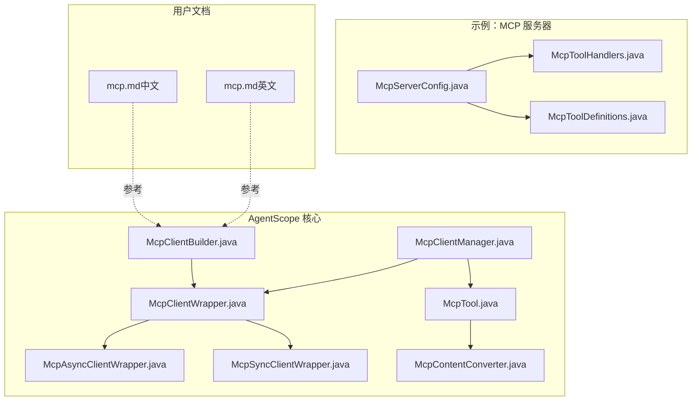
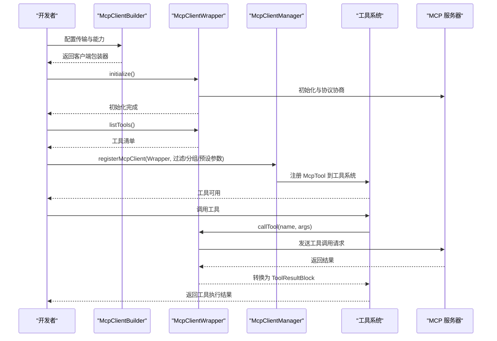
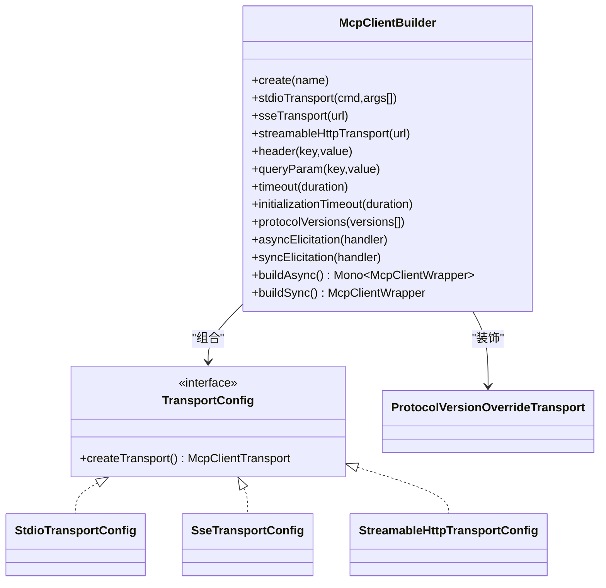
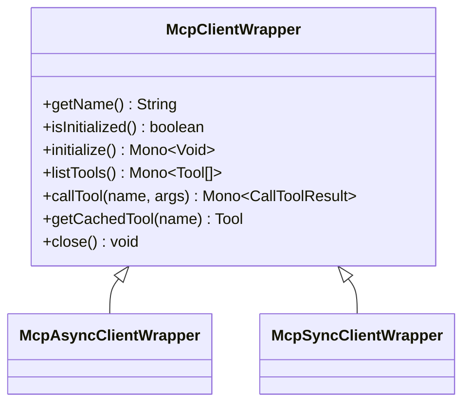
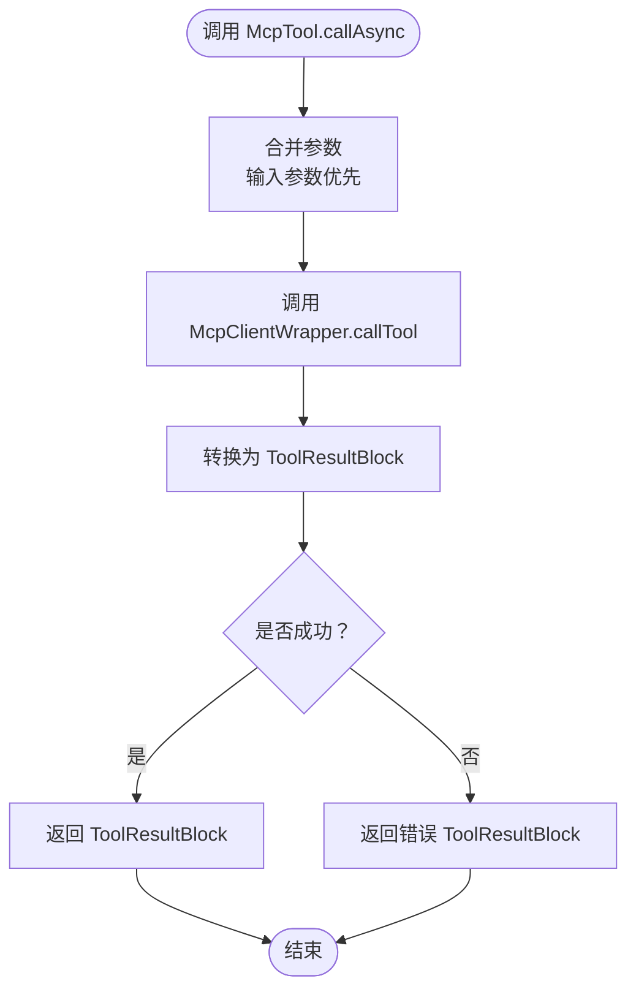
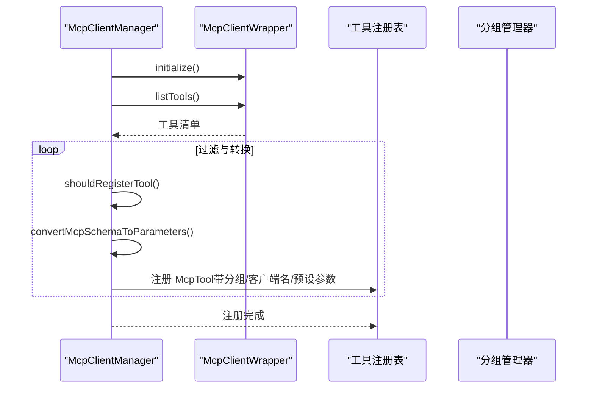
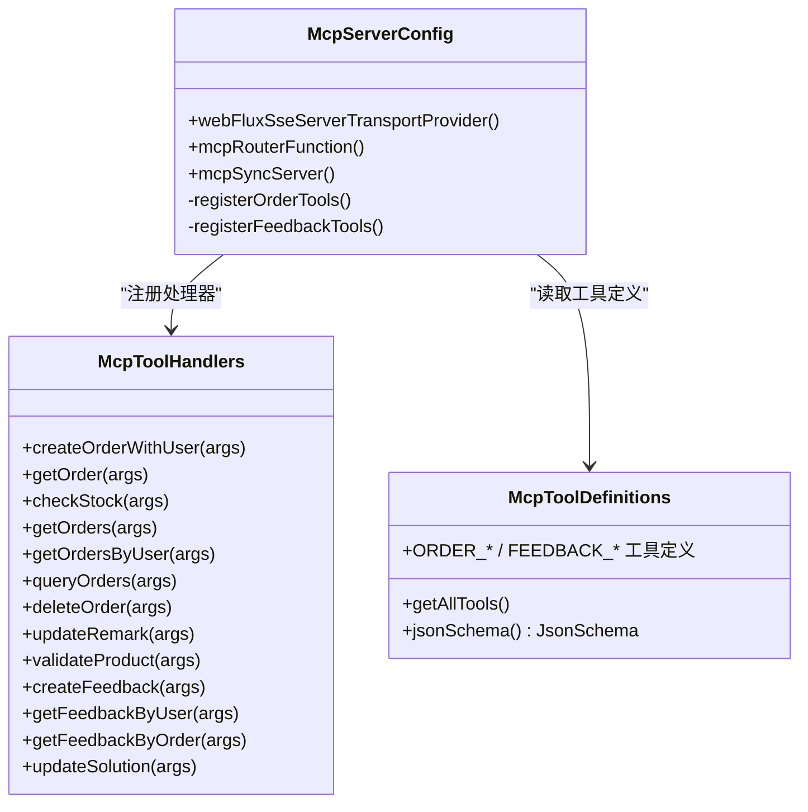
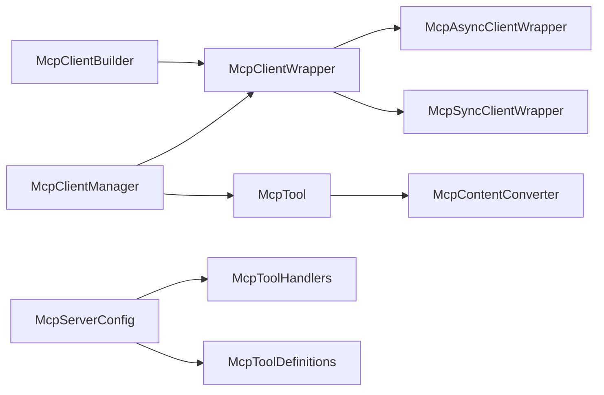

# MCP 协议集成

<cite>
**本文引用的文件**
- [McpClientManager.java](file://agentscope-core/src/main/java/io/agentscope/core/tool/McpClientManager.java)
- [McpClientWrapper.java](file://agentscope-core/src/main/java/io/agentscope/core/tool/mcp/McpClientWrapper.java)
- [McpClientBuilder.java](file://agentscope-core/src/main/java/io/agentscope/core/tool/mcp/McpClientBuilder.java)
- [McpTool.java](file://agentscope-core/src/main/java/io/agentscope/core/tool/mcp/McpTool.java)
- [McpContentConverter.java](file://agentscope-core/src/main/java/io/agentscope/core/tool/mcp/McpContentConverter.java)
- [McpAsyncClientWrapper.java](file://agentscope-core/src/main/java/io/agentscope/core/tool/mcp/McpAsyncClientWrapper.java)
- [McpSyncClientWrapper.java](file://agentscope-core/src/main/java/io/agentscope/core/tool/mcp/McpSyncClientWrapper.java)
- [mcp.md（中文文档）](file://docs/zh/task/mcp.md)
- [mcp.md（英文文档）](file://docs/en/task/mcp.md)
- [McpServerConfig.java](file://agentscope-examples/boba-tea-shop/business-mcp-server/src/main/java/io/agentscope/examples/bobatea/business/config/McpServerConfig.java)
- [McpToolHandlers.java](file://agentscope-examples/boba-tea-shop/business-mcp-server/src/main/java/io/agentscope/examples/bobatea/business/config/McpToolHandlers.java)
- [McpToolDefinitions.java](file://agentscope-examples/boba-tea-shop/business-mcp-server/src/main/java/io/agentscope/examples/bobatea/business/config/McpToolDefinitions.java)
- [McpClientWrapperTest.java](file://agentscope-core/src/test/java/io/agentscope/core/tool/mcp/McpClientWrapperTest.java)
</cite>

## 目录
1. [简介](#简介)
2. [项目结构](#项目结构)
3. [核心组件](#核心组件)
4. [架构总览](#架构总览)
5. [详细组件分析](#详细组件分析)
6. [依赖关系分析](#依赖关系分析)
7. [性能考量](#性能考量)
8. [故障排查指南](#故障排查指南)
9. [结论](#结论)
10. [附录](#附录)

## 简介
本文件面向希望在 AgentScope 中集成 MCP（Model Context Protocol）协议的开发者，系统性阐述 MCP 在 AgentScope 中的工作原理、实现方式与最佳实践。重点覆盖以下方面：
- 如何通过 McpClientBuilder 构建并连接 MCP 兼容服务器（支持 StdIO、SSE、HTTP 三种传输）
- 如何使用 McpClientManager 将 MCP 工具注册到 AgentScope 工具系统
- 如何通过 McpTool 将远程 MCP 工具桥接为 AgentScope 的工具，并进行参数合并与结果转换
- 结合 Boba Tea Shop 示例展示 MCP 服务器端定义、工具注册与处理器实现
- 解释 MCP 协议如何帮助开发者接入广泛的 MCP 生态工具与服务，实现与第三方 AI 服务的无缝集成

## 项目结构
围绕 MCP 的核心代码位于 agentscope-core 的 tool 子模块中，配套示例位于 agentscope-examples 的 boba-tea-shop 模块中。下图给出与 MCP 相关的关键文件与模块关系概览。

**图表来源**
- [McpClientBuilder.java:94-791](file://agentscope-core/src/main/java/io/agentscope/core/tool/mcp/McpClientBuilder.java#L94-L791)
- [McpClientWrapper.java:40-121](file://agentscope-core/src/main/java/io/agentscope/core/tool/mcp/McpClientWrapper.java#L40-L121)
- [McpAsyncClientWrapper.java](file://agentscope-core/src/main/java/io/agentscope/core/tool/mcp/McpAsyncClientWrapper.java)
- [McpSyncClientWrapper.java](file://agentscope-core/src/main/java/io/agentscope/core/tool/mcp/McpSyncClientWrapper.java)
- [McpTool.java:57-282](file://agentscope-core/src/main/java/io/agentscope/core/tool/mcp/McpTool.java#L57-L282)
- [McpClientManager.java:36-289](file://agentscope-core/src/main/java/io/agentscope/core/tool/McpClientManager.java#L36-L289)
- [McpContentConverter.java](file://agentscope-core/src/main/java/io/agentscope/core/tool/mcp/McpContentConverter.java)
- [McpServerConfig.java:49-132](file://agentscope-examples/boba-tea-shop/business-mcp-server/src/main/java/io/agentscope/examples/bobatea/business/config/McpServerConfig.java#L49-L132)
- [McpToolHandlers.java:40-442](file://agentscope-examples/boba-tea-shop/business-mcp-server/src/main/java/io/agentscope/examples/bobatea/business/config/McpToolHandlers.java#L40-L442)
- [McpToolDefinitions.java:31-468](file://agentscope-examples/boba-tea-shop/business-mcp-server/src/main/java/io/agentscope/examples/bobatea/business/config/McpToolDefinitions.java#L31-L468)
- [mcp.md（中文文档）:1-48](file://docs/zh/task/mcp.md#L1-L48)
- [mcp.md（英文文档）:1-119](file://docs/en/task/mcp.md#L1-L119)

**章节来源**
- [McpClientBuilder.java:94-791](file://agentscope-core/src/main/java/io/agentscope/core/tool/mcp/McpClientBuilder.java#L94-L791)
- [McpClientWrapper.java:40-121](file://agentscope-core/src/main/java/io/agentscope/core/tool/mcp/McpClientWrapper.java#L40-L121)
- [McpTool.java:57-282](file://agentscope-core/src/main/java/io/agentscope/core/tool/mcp/McpTool.java#L57-L282)
- [McpClientManager.java:36-289](file://agentscope-core/src/main/java/io/agentscope/core/tool/McpClientManager.java#L36-L289)
- [McpServerConfig.java:49-132](file://agentscope-examples/boba-tea-shop/business-mcp-server/src/main/java/io/agentscope/examples/bobatea/business/config/McpServerConfig.java#L49-L132)
- [mcp.md（中文文档）:1-48](file://docs/zh/task/mcp.md#L1-L48)
- [mcp.md（英文文档）:1-119](file://docs/en/task/mcp.md#L1-L119)

## 核心组件
- McpClientBuilder：构建 MCP 客户端包装器，支持 StdIO、SSE、HTTP 三种传输；可配置请求/初始化超时、协议版本、HTTP 头与查询参数、异步/同步唤起能力等。
- McpClientWrapper：抽象客户端包装器，统一管理生命周期、工具缓存与调用；派生出异步与同步实现。
- McpAsyncClientWrapper / McpSyncClientWrapper：具体客户端实现，负责与 MCP 服务器建立连接、初始化、列举工具、调用工具与资源释放。
- McpTool：将 MCP 工具桥接为 AgentScope 的工具，负责参数合并（输入参数优先于预设参数）、调用 MCP 并转换为 ToolResultBlock。
- McpClientManager：管理 MCP 客户端注册与生命周期，自动发现工具、过滤工具、注册到工具系统并维护客户端映射。
- McpContentConverter：负责 MCP 返回结果与 AgentScope 工具结果之间的转换。
- 示例服务器（Boba Tea Shop）：展示如何基于 MCP SDK 配置服务器、注册工具、编写处理器与工具元数据定义。

**章节来源**
- [McpClientBuilder.java:94-791](file://agentscope-core/src/main/java/io/agentscope/core/tool/mcp/McpClientBuilder.java#L94-L791)
- [McpClientWrapper.java:40-121](file://agentscope-core/src/main/java/io/agentscope/core/tool/mcp/McpClientWrapper.java#L40-L121)
- [McpTool.java:57-282](file://agentscope-core/src/main/java/io/agentscope/core/tool/mcp/McpTool.java#L57-L282)
- [McpClientManager.java:36-289](file://agentscope-core/src/main/java/io/agentscope/core/tool/McpClientManager.java#L36-L289)
- [McpContentConverter.java](file://agentscope-core/src/main/java/io/agentscope/core/tool/mcp/McpContentConverter.java)
- [McpServerConfig.java:49-132](file://agentscope-examples/boba-tea-shop/business-mcp-server/src/main/java/io/agentscope/examples/bobatea/business/config/McpServerConfig.java#L49-L132)

## 架构总览
下图展示了从客户端构建、工具发现、注册到工具调用的端到端流程。

**图表来源**
- [McpClientBuilder.java:421-496](file://agentscope-core/src/main/java/io/agentscope/core/tool/mcp/McpClientBuilder.java#L421-L496)
- [McpClientWrapper.java:85-102](file://agentscope-core/src/main/java/io/agentscope/core/tool/mcp/McpClientWrapper.java#L85-L102)
- [McpClientManager.java:111-210](file://agentscope-core/src/main/java/io/agentscope/core/tool/McpClientManager.java#L111-L210)
- [McpTool.java:172-192](file://agentscope-core/src/main/java/io/agentscope/core/tool/mcp/McpTool.java#L172-L192)
- [McpServerConfig.java:67-77](file://agentscope-examples/boba-tea-shop/business-mcp-server/src/main/java/io/agentscope/examples/bobatea/business/config/McpServerConfig.java#L67-L77)

## 详细组件分析

### 组件一：McpClientBuilder（客户端构建器）
- 功能要点
  - 支持三种传输：StdIO（本地进程）、SSE（HTTP 流）、HTTP（可流式请求/响应）
  - 可配置请求/初始化超时、协议版本覆盖、HTTP 头与查询参数、异步/同步唤起能力
  - 提供 buildAsync 与 buildSync 两种构建方式，分别返回异步/同步包装器
- 关键行为
  - 通过 TransportConfig 抽象不同传输细节，内部包含 StdioTransportConfig、SseTransportConfig、StreamableHttpTransportConfig
  - 协议版本可通过 ProtocolVersionOverrideTransport 覆盖默认值，以兼容新版本服务器
  - 对 HTTP 传输支持自定义 HttpClient（如启用 HTTP/2），并合并 URL 查询参数
- 使用建议
  - 选择传输时优先考虑服务器部署形态与网络环境
  - 对于新版本协议，务必显式声明支持的版本列表
  - SSE/HTTP 传输建议设置合理的超时与重试策略

**图表来源**
- [McpClientBuilder.java:94-791](file://agentscope-core/src/main/java/io/agentscope/core/tool/mcp/McpClientBuilder.java#L94-L791)

**章节来源**
- [McpClientBuilder.java:117-496](file://agentscope-core/src/main/java/io/agentscope/core/tool/mcp/McpClientBuilder.java#L117-L496)

### 组件二：McpClientWrapper（客户端包装器抽象）
- 功能要点
  - 统一生命周期管理：initialize、listTools、callTool、close
  - 工具缓存：cachedTools 用于缓存服务器工具定义，避免重复查询
  - 线程安全：cachedTools 使用并发容器，保证多线程访问安全
- 关键行为
  - initialize 必须在任何工具操作前调用
  - listTools 返回工具清单，通常由管理器在注册阶段调用
  - callTool 将工具调用委托给具体实现（异步/同步）
  - close 清理资源并重置初始化状态

**图表来源**
- [McpClientWrapper.java:40-121](file://agentscope-core/src/main/java/io/agentscope/core/tool/mcp/McpClientWrapper.java#L40-L121)
- [McpAsyncClientWrapper.java](file://agentscope-core/src/main/java/io/agentscope/core/tool/mcp/McpAsyncClientWrapper.java)
- [McpSyncClientWrapper.java](file://agentscope-core/src/main/java/io/agentscope/core/tool/mcp/McpSyncClientWrapper.java)

**章节来源**
- [McpClientWrapper.java:40-121](file://agentscope-core/src/main/java/io/agentscope/core/tool/mcp/McpClientWrapper.java#L40-L121)
- [McpClientWrapperTest.java:31-244](file://agentscope-core/src/test/java/io/agentscope/core/tool/mcp/McpClientWrapperTest.java#L31-L244)

### 组件三：McpTool（MCP 工具桥接）
- 功能要点
  - 实现 AgentScope 的 AgentTool 接口，将 MCP 工具无缝接入工具系统
  - 参数合并：输入参数优先于预设参数，确保灵活性与一致性
  - 结果转换：将 MCP 返回结果转换为 ToolResultBlock，便于上层消费
  - 错误处理：捕获异常并返回错误结果，避免中断主流程
- 关键行为
  - convertMcpSchemaToParameters：将 MCP 输入模式转换为 AgentScope 参数格式，支持排除预设参数字段
  - callAsync：异步执行工具调用，串联参数合并、远程调用与结果转换
- 最佳实践
  - 预设参数适合固定配置（如默认输出格式、鉴权参数），输入参数用于动态调用
  - 输出模式（outputSchema）可用于约束或增强工具输出结构

**图表来源**
- [McpTool.java:172-192](file://agentscope-core/src/main/java/io/agentscope/core/tool/mcp/McpTool.java#L172-L192)
- [McpContentConverter.java](file://agentscope-core/src/main/java/io/agentscope/core/tool/mcp/McpContentConverter.java)

**章节来源**
- [McpTool.java:57-282](file://agentscope-core/src/main/java/io/agentscope/core/tool/mcp/McpTool.java#L57-L282)

### 组件四：McpClientManager（客户端管理器）
- 功能要点
  - 注册 MCP 客户端：支持全量注册、按名称过滤（启用/禁用）、指定分组、预设参数映射
  - 自动工具发现：调用客户端 listTools 获取工具清单，按规则筛选后转换为 McpTool 并注册
  - 生命周期管理：记录已注册客户端、移除时清理工具与连接
- 关键行为
  - shouldRegisterTool：先按禁用列表过滤，再按启用列表过滤，启用列表优先级更高
  - 注册回调：通过 ToolRegistrationCallback 将 McpTool 注册到工具系统，同时携带分组名与客户端名
- 使用建议
  - 在大规模工具集场景下，优先使用启用/禁用列表进行精细化控制
  - 分组有助于在复杂工作流中组织与隔离工具

**图表来源**
- [McpClientManager.java:111-210](file://agentscope-core/src/main/java/io/agentscope/core/tool/McpClientManager.java#L111-L210)

**章节来源**
- [McpClientManager.java:36-289](file://agentscope-core/src/main/java/io/agentscope/core/tool/McpClientManager.java#L36-L289)

### 组件五：示例服务器（Boba Tea Shop）
- 功能要点
  - 基于 MCP SDK 与 Spring WebFlux 配置 SSE 传输
  - 通过 McpToolDefinitions 统一定义工具元数据（名称、描述、JSON Schema）
  - 通过 McpToolHandlers 编写工具执行逻辑，返回标准的 CallToolResult
  - 在 McpServerConfig 中注册工具与处理器，开启工具能力开关
- 价值
  - 展示如何将业务能力暴露为 MCP 工具，便于 AgentScope 等客户端统一发现与调用
  - 提供完整的工具 Schema 设计范式，便于跨系统共享与复用

**图表来源**
- [McpServerConfig.java:49-132](file://agentscope-examples/boba-tea-shop/business-mcp-server/src/main/java/io/agentscope/examples/bobatea/business/config/McpServerConfig.java#L49-L132)
- [McpToolHandlers.java:40-442](file://agentscope-examples/boba-tea-shop/business-mcp-server/src/main/java/io/agentscope/examples/bobatea/business/config/McpToolHandlers.java#L40-L442)
- [McpToolDefinitions.java:31-468](file://agentscope-examples/boba-tea-shop/business-mcp-server/src/main/java/io/agentscope/examples/bobatea/business/config/McpToolDefinitions.java#L31-L468)

**章节来源**
- [McpServerConfig.java:49-132](file://agentscope-examples/boba-tea-shop/business-mcp-server/src/main/java/io/agentscope/examples/bobatea/business/config/McpServerConfig.java#L49-L132)
- [McpToolHandlers.java:40-442](file://agentscope-examples/boba-tea-shop/business-mcp-server/src/main/java/io/agentscope/examples/bobatea/business/config/McpToolHandlers.java#L40-L442)
- [McpToolDefinitions.java:31-468](file://agentscope-examples/boba-tea-shop/business-mcp-server/src/main/java/io/agentscope/examples/bobatea/business/config/McpToolDefinitions.java#L31-L468)

## 依赖关系分析
- 组件耦合
  - McpClientBuilder 与多种 TransportConfig 实现解耦，便于扩展新传输
  - McpClientWrapper 抽象了异步/同步差异，降低上层调用复杂度
  - McpTool 依赖 McpClientWrapper 与 McpContentConverter，职责清晰
  - McpClientManager 依赖工具注册表与分组管理器，集中治理工具生命周期
- 外部依赖
  - MCP 官方 SDK（McpClient、McpServer、McpClientTransport 等）
  - Spring WebFlux（示例服务器）
  - Reactor（异步编程模型）

**图表来源**
- [McpClientBuilder.java:94-791](file://agentscope-core/src/main/java/io/agentscope/core/tool/mcp/McpClientBuilder.java#L94-L791)
- [McpClientWrapper.java:40-121](file://agentscope-core/src/main/java/io/agentscope/core/tool/mcp/McpClientWrapper.java#L40-L121)
- [McpClientManager.java:36-289](file://agentscope-core/src/main/java/io/agentscope/core/tool/McpClientManager.java#L36-L289)
- [McpTool.java:57-282](file://agentscope-core/src/main/java/io/agentscope/core/tool/mcp/McpTool.java#L57-L282)
- [McpServerConfig.java:49-132](file://agentscope-examples/boba-tea-shop/business-mcp-server/src/main/java/io/agentscope/examples/bobatea/business/config/McpServerConfig.java#L49-L132)

**章节来源**
- [McpClientBuilder.java:94-791](file://agentscope-core/src/main/java/io/agentscope/core/tool/mcp/McpClientBuilder.java#L94-L791)
- [McpClientManager.java:36-289](file://agentscope-core/src/main/java/io/agentscope/core/tool/McpClientManager.java#L36-L289)
- [McpTool.java:57-282](file://agentscope-core/src/main/java/io/agentscope/core/tool/mcp/McpTool.java#L57-L282)
- [McpServerConfig.java:49-132](file://agentscope-examples/boba-tea-shop/business-mcp-server/src/main/java/io/agentscope/examples/bobatea/business/config/McpServerConfig.java#L49-L132)

## 性能考量
- 异步优先：优先使用异步客户端（buildAsync）以提升吞吐与资源利用率
- 工具缓存：利用 McpClientWrapper 的 cachedTools 减少重复查询，提高工具发现效率
- 参数合并开销：McpTool 的参数合并为浅拷贝与覆盖操作，通常开销较小；在高频调用场景下可考虑复用参数对象
- 传输选择：SSE/HTTP 传输具备更好的连接复用能力；StdIO 适合本地进程，注意进程启动与资源占用
- 超时与重试：合理设置请求/初始化超时，结合指数退避策略提升稳定性

## 故障排查指南
- 初始化失败
  - 检查传输配置是否正确（URL、命令、参数）
  - 确认协议版本是否匹配，必要时使用 protocolVersions 显式声明支持版本
- 工具不可用
  - 确认客户端已初始化且未关闭
  - 检查工具过滤规则（启用/禁用列表）是否误删
- 调用异常
  - 查看 McpTool 的错误日志，确认异常是否被捕获并转换为错误结果
  - 核对参数合并逻辑，确保输入参数覆盖预设参数
- 服务器端问题
  - 检查示例服务器的工具处理器是否抛出异常
  - 确认工具 Schema 是否与调用参数一致

**章节来源**
- [McpClientBuilder.java:329-341](file://agentscope-core/src/main/java/io/agentscope/core/tool/mcp/McpClientBuilder.java#L329-L341)
- [McpTool.java:183-191](file://agentscope-core/src/main/java/io/agentscope/core/tool/mcp/McpTool.java#L183-L191)
- [McpClientWrapperTest.java:135-170](file://agentscope-core/src/test/java/io/agentscope/core/tool/mcp/McpClientWrapperTest.java#L135-L170)

## 结论
AgentScope 通过 McpClientBuilder、McpClientWrapper、McpTool 与 McpClientManager 等组件，提供了对 MCP 协议的完整支持。开发者可以便捷地连接 MCP 服务器、自动发现与注册工具、将远程工具无缝纳入 AgentScope 工具系统，并通过示例服务器了解如何设计与实现 MCP 工具。借助 MCP，AgentScope 能够快速接入广泛的 MCP 生态工具与服务，实现与第三方 AI 服务的高效集成。

## 附录
- 快速开始（来自官方文档）
  - 连接 MCP 服务器（StdIO/SSE/HTTP）
  - 注册 MCP 工具到工具系统
  - 在智能体中使用工具

**章节来源**
- [mcp.md（中文文档）:24-48](file://docs/zh/task/mcp.md#L24-L48)
- [mcp.md（英文文档）:24-62](file://docs/en/task/mcp.md#L24-L62)