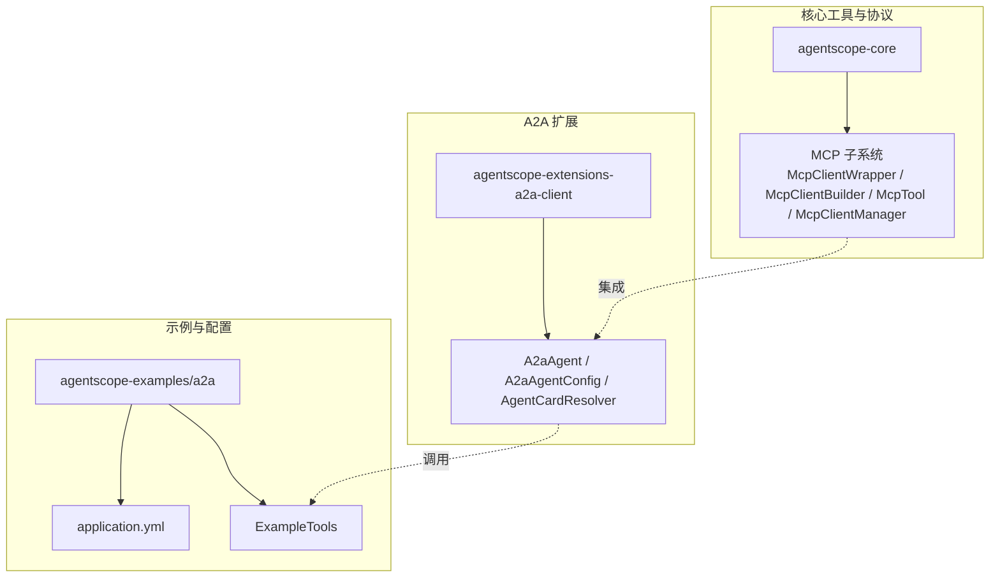
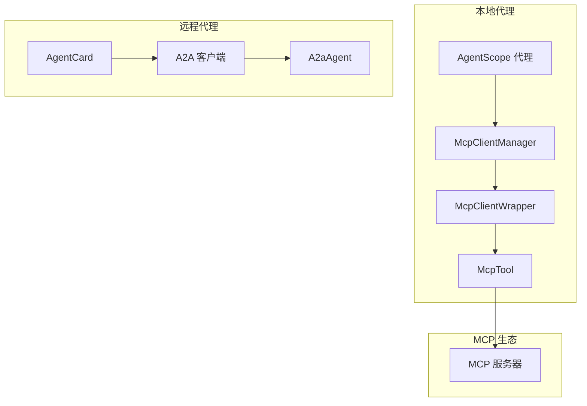
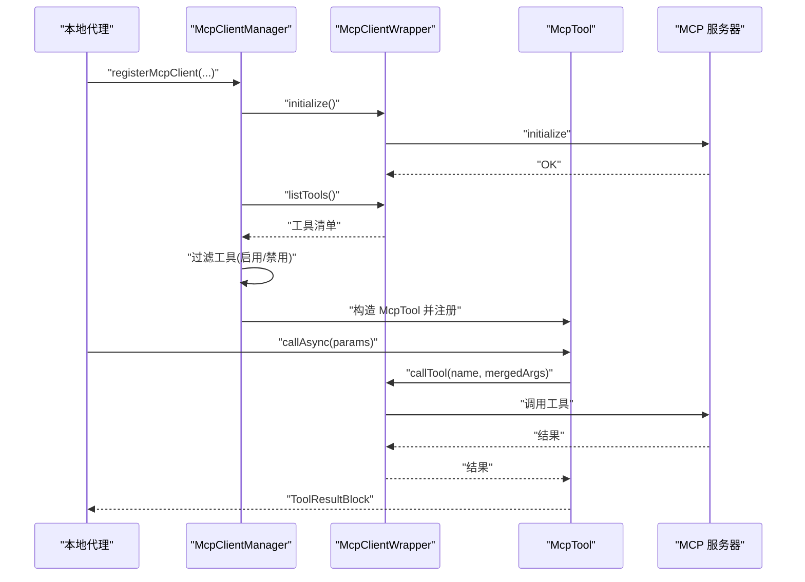
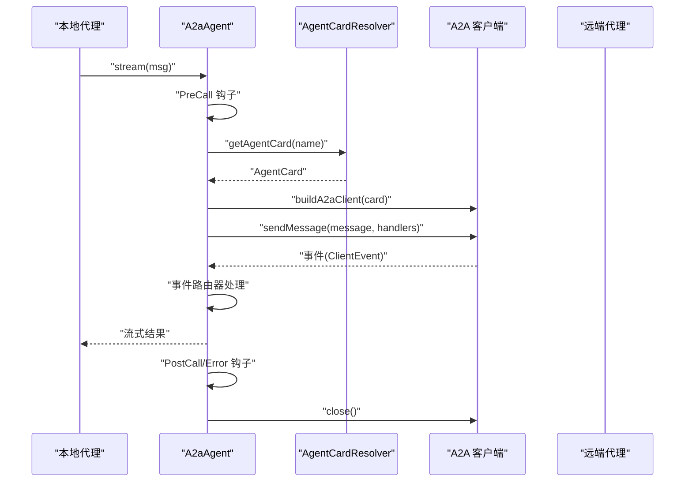
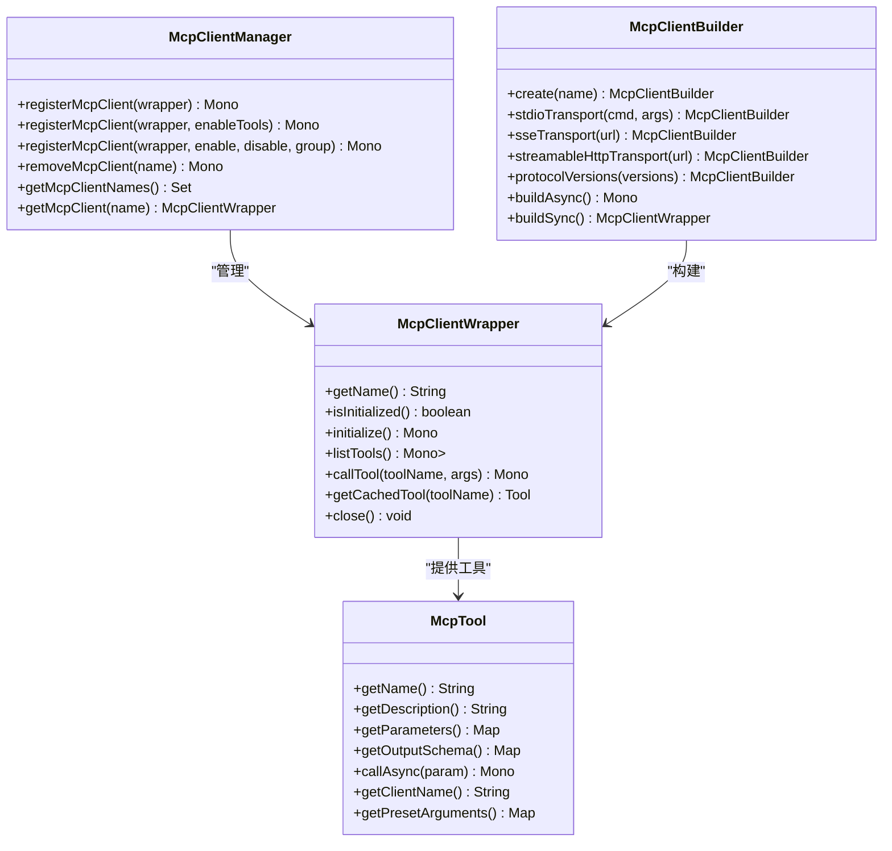
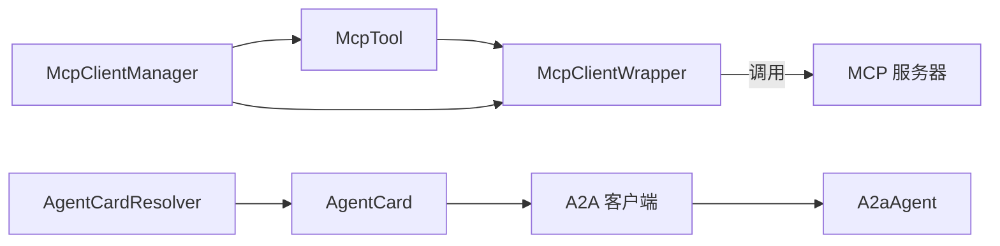

# 无缝集成能力

<cite>
**本文引用的文件**
- [McpClientManager.java](file://agentscope-core/src/main/java/io/agentscope/core/tool/McpClientManager.java)
- [McpClientWrapper.java](file://agentscope-core/src/main/java/io/agentscope/core/tool/mcp/McpClientWrapper.java)
- [McpTool.java](file://agentscope-core/src/main/java/io/agentscope/core/tool/mcp/McpTool.java)
- [McpClientBuilder.java](file://agentscope-core/src/main/java/io/agentscope/core/tool/mcp/McpClientBuilder.java)
- [A2aAgent.java](file://agentscope-extensions/agentscope-extensions-a2a/agentscope-extensions-a2a-client/src/main/java/io/agentscope/core/a2a/agent/A2aAgent.java)
- [A2aAgentConfig.java](file://agentscope-extensions/agentscope-extensions-a2a/agentscope-extensions-a2a-client/src/main/java/io/agentscope/core/a2a/agent/A2aAgentConfig.java)
- [WellKnownAgentCardResolver.java](file://agentscope-extensions/agentscope-extensions-a2a/agentscope-extensions-a2a-client/src/main/java/io/agentscope/core/a2a/agent/card/WellKnownAgentCardResolver.java)
- [A2aAgentExampleRunner.java](file://agentscope-examples/a2a/src/main/java/io/agentscope/examples/a2a/A2aAgentExampleRunner.java)
- [SimpleA2aAgentExample.java](file://agentscope-examples/a2a/src/main/java/io/agentscope/examples/a2a/SimpleA2aAgentExample.java)
- [NacosA2aAgentExample.java](file://agentscope-examples/a2a/src/main/java/io/agentscope/examples/a2a/NacosA2aAgentExample.java)
- [application.yml](file://agentscope-examples/a2a/src/main/resources/application.yml)
- [ExampleTools.java](file://agentscope-examples/a2a/src/main/java/io/agentscope/examples/a2a/tools/ExampleTools.java)
</cite>

## 目录
1. [简介](#简介)
2. [项目结构](#项目结构)
3. [核心组件](#核心组件)
4. [架构总览](#架构总览)
5. [详细组件分析](#详细组件分析)
6. [依赖分析](#依赖分析)
7. [性能考虑](#性能考虑)
8. [故障排查指南](#故障排查指南)
9. [结论](#结论)
10. [附录](#附录)

## 简介
本章节聚焦 AgentScope Java 框架的“无缝集成能力”，系统阐述两大关键特性：
- MCP Protocol（模型控制协议）：如何与任意 MCP 兼容服务器集成，接入 MCP 工具与服务生态，实现工具即插即用、按需启用/禁用与参数预设。
- A2A Protocol（Agent-to-Agent 协议）：如何通过标准服务发现机制（如 Nacos 或 Well-Known URI）实现分布式多代理协作，支持远程代理调用、事件处理与中断控制。

这些能力帮助开发者快速扩展代理功能，并与现有企业基础设施（如注册中心、消息中间件、外部 MCP 服务等）高效对接。

## 项目结构
围绕无缝集成能力，核心代码分布在以下模块：
- 核心工具与协议适配：agentscope-core/tool 与 tool/mcp
- A2A 客户端扩展：agentscope-extensions/…/a2a-client
- 示例与配置：agentscope-examples/a2a 及其资源文件
- 文档与指南：docs 下的中英文任务文档

**图表来源**
- [McpClientWrapper.java:40-121](file://agentscope-core/src/main/java/io/agentscope/core/tool/mcp/McpClientWrapper.java#L40-L121)
- [McpClientBuilder.java:94-341](file://agentscope-core/src/main/java/io/agentscope/core/tool/mcp/McpClientBuilder.java#L94-L341)
- [McpTool.java:57-282](file://agentscope-core/src/main/java/io/agentscope/core/tool/mcp/McpTool.java#L57-L282)
- [McpClientManager.java:36-289](file://agentscope-core/src/main/java/io/agentscope/core/tool/McpClientManager.java#L36-L289)
- [A2aAgent.java:71-416](file://agentscope-extensions/agentscope-extensions-a2a/agentscope-extensions-a2a-client/src/main/java/io/agentscope/core/a2a/agent/A2aAgent.java#L71-L416)
- [A2aAgentConfig.java:28-83](file://agentscope-extensions/agentscope-extensions-a2a/agentscope-extensions-a2a-client/src/main/java/io/agentscope/core/a2a/agent/A2aAgentConfig.java#L28-L83)
- [WellKnownAgentCardResolver.java:37-122](file://agentscope-extensions/agentscope-extensions-a2a/agentscope-extensions-a2a-client/src/main/java/io/agentscope/core/a2a/agent/card/WellKnownAgentCardResolver.java#L37-L122)
- [application.yml:15-65](file://agentscope-examples/a2a/src/main/resources/application.yml#L15-L65)
- [ExampleTools.java:31-181](file://agentscope-examples/a2a/src/main/java/io/agentscope/examples/a2a/tools/ExampleTools.java#L31-L181)

**章节来源**
- [McpClientWrapper.java:40-121](file://agentscope-core/src/main/java/io/agentscope/core/tool/mcp/McpClientWrapper.java#L40-L121)
- [A2aAgent.java:71-416](file://agentscope-extensions/agentscope-extensions-a2a/agentscope-extensions-a2a-client/src/main/java/io/agentscope/core/a2a/agent/A2aAgent.java#L71-L416)
- [application.yml:15-65](file://agentscope-examples/a2a/src/main/resources/application.yml#L15-L65)

## 核心组件
- MCP 子系统
  - McpClientWrapper：抽象封装 MCP 客户端生命周期、工具发现与调用，支持异步/同步两种包装器。
  - McpClientBuilder：流式构建器，支持 StdIO、SSE、StreamableHTTP 三种传输方式，可配置协议版本、超时、请求头与查询参数。
  - McpTool：将 MCP 工具桥接到 AgentScope 的 AgentTool 接口，支持参数合并、输出模式与错误兜底。
  - McpClientManager：集中管理 MCP 客户端注册、工具过滤（启用/禁用）、分组与清理。
- A2A 子系统
  - A2aAgent：基于 A2A 规范的远程代理客户端，负责 AgentCard 解析、事件路由、内存管理与中断控制。
  - A2aAgentConfig：A2A 客户端传输与配置项的聚合。
  - AgentCardResolver（含 WellKnownAgentCardResolver）：标准化服务发现，支持 Well-Known URI 与 Nacos 注册中心。

**章节来源**
- [McpClientWrapper.java:40-121](file://agentscope-core/src/main/java/io/agentscope/core/tool/mcp/McpClientWrapper.java#L40-L121)
- [McpClientBuilder.java:94-341](file://agentscope-core/src/main/java/io/agentscope/core/tool/mcp/McpClientBuilder.java#L94-L341)
- [McpTool.java:57-282](file://agentscope-core/src/main/java/io/agentscope/core/tool/mcp/McpTool.java#L57-L282)
- [McpClientManager.java:36-289](file://agentscope-core/src/main/java/io/agentscope/core/tool/McpClientManager.java#L36-L289)
- [A2aAgent.java:71-416](file://agentscope-extensions/agentscope-extensions-a2a/agentscope-extensions-a2a-client/src/main/java/io/agentscope/core/a2a/agent/A2aAgent.java#L71-L416)
- [A2aAgentConfig.java:28-83](file://agentscope-extensions/agentscope-extensions-a2a/agentscope-extensions-a2a-client/src/main/java/io/agentscope/core/a2a/agent/A2aAgentConfig.java#L28-L83)
- [WellKnownAgentCardResolver.java:37-122](file://agentscope-extensions/agentscope-extensions-a2a/agentscope-extensions-a2a-client/src/main/java/io/agentscope/core/a2a/agent/card/WellKnownAgentCardResolver.java#L37-L122)

## 架构总览
下图展示 MCP 与 A2A 的集成架构：AgentScope 通过 McpClientManager 统一注册 MCP 客户端及其工具；A2aAgent 通过 AgentCardResolver 获取远端代理描述，建立 A2A 连接并进行事件驱动的交互。

**图表来源**
- [McpClientManager.java:72-210](file://agentscope-core/src/main/java/io/agentscope/core/tool/McpClientManager.java#L72-L210)
- [McpClientWrapper.java:85-102](file://agentscope-core/src/main/java/io/agentscope/core/tool/mcp/McpClientWrapper.java#L85-L102)
- [McpTool.java:172-192](file://agentscope-core/src/main/java/io/agentscope/core/tool/mcp/McpTool.java#L172-L192)
- [A2aAgent.java:186-214](file://agentscope-extensions/agentscope-extensions-a2a/agentscope-extensions-a2a-client/src/main/java/io/agentscope/core/a2a/agent/A2aAgent.java#L186-L214)

## 详细组件分析

### MCP Protocol 集成
- 设计要点
  - 抽象统一：McpClientWrapper 提供 initialize/listTools/callTool 的统一接口，屏蔽底层传输差异。
  - 流式构建：McpClientBuilder 支持多种传输与协议版本声明，便于对接不同 MCP 服务器。
  - 工具桥接：McpTool 将 MCP 输入/输出模式转换为 AgentScope 的 ToolResultBlock，支持参数合并与错误恢复。
  - 生命周期管理：McpClientManager 负责客户端注册、工具筛选（enable/disable）、分组与清理。
- 关键流程（注册与调用）
  - 注册流程：初始化客户端 → 列举工具 → 过滤工具 → 构造 McpTool 并注册到工具注册表。
  - 调用流程：Agent 发起工具调用 → 合并参数（输入参数优先于预设）→ 通过 McpClientWrapper 调用 → 结果转换 → 返回。

**图表来源**
- [McpClientManager.java:111-210](file://agentscope-core/src/main/java/io/agentscope/core/tool/McpClientManager.java#L111-L210)
- [McpClientWrapper.java:85-102](file://agentscope-core/src/main/java/io/agentscope/core/tool/mcp/McpClientWrapper.java#L85-L102)
- [McpTool.java:172-192](file://agentscope-core/src/main/java/io/agentscope/core/tool/mcp/McpTool.java#L172-L192)

**章节来源**
- [McpClientManager.java:72-210](file://agentscope-core/src/main/java/io/agentscope/core/tool/McpClientManager.java#L72-L210)
- [McpClientWrapper.java:85-102](file://agentscope-core/src/main/java/io/agentscope/core/tool/mcp/McpClientWrapper.java#L85-L102)
- [McpTool.java:172-192](file://agentscope-core/src/main/java/io/agentscope/core/tool/mcp/McpTool.java#L172-L192)
- [McpClientBuilder.java:131-148](file://agentscope-core/src/main/java/io/agentscope/core/tool/mcp/McpClientBuilder.java#L131-L148)

### A2A Protocol 集成
- 设计要点
  - 标准化服务发现：支持 Well-Known URI 与 Nacos 注册中心，自动解析 AgentCard。
  - 事件驱动交互：A2aAgent 基于 ClientEvent 路由器处理消息、任务与更新事件，支持流式输出。
  - 生命周期与中断：在 Hook 中完成客户端构建、释放与异常处理；支持用户触发的中断。
  - 配置灵活：A2aAgentConfig 支持自定义传输与客户端配置。
- 关键流程（远程代理调用）
  - 初始化：PreCall 钩子生成 A2A 客户端，解析 AgentCard。
  - 交互：发送消息 → 事件回调 → 事件路由器处理 → 内存记录 → 输出结果。
  - 清理：PostCall/Error 钩子释放资源。

**图表来源**
- [A2aAgent.java:114-260](file://agentscope-extensions/agentscope-extensions-a2a/agentscope-extensions-a2a-client/src/main/java/io/agentscope/core/a2a/agent/A2aAgent.java#L114-L260)
- [WellKnownAgentCardResolver.java:52-55](file://agentscope-extensions/agentscope-extensions-a2a/agentscope-extensions-a2a-client/src/main/java/io/agentscope/core/a2a/agent/card/WellKnownAgentCardResolver.java#L52-L55)

**章节来源**
- [A2aAgent.java:114-260](file://agentscope-extensions/agentscope-extensions-a2a/agentscope-extensions-a2a-client/src/main/java/io/agentscope/core/a2a/agent/A2aAgent.java#L114-L260)
- [A2aAgentConfig.java:28-83](file://agentscope-extensions/agentscope-extensions-a2a/agentscope-extensions-a2a-client/src/main/java/io/agentscope/core/a2a/agent/A2aAgentConfig.java#L28-L83)
- [WellKnownAgentCardResolver.java:52-55](file://agentscope-extensions/agentscope-extensions-a2a/agentscope-extensions-a2a-client/src/main/java/io/agentscope/core/a2a/agent/card/WellKnownAgentCardResolver.java#L52-L55)

### 类关系图（代码级）

**图表来源**
- [McpClientWrapper.java:40-121](file://agentscope-core/src/main/java/io/agentscope/core/tool/mcp/McpClientWrapper.java#L40-L121)
- [McpClientBuilder.java:94-341](file://agentscope-core/src/main/java/io/agentscope/core/tool/mcp/McpClientBuilder.java#L94-L341)
- [McpTool.java:57-282](file://agentscope-core/src/main/java/io/agentscope/core/tool/mcp/McpTool.java#L57-L282)
- [McpClientManager.java:36-289](file://agentscope-core/src/main/java/io/agentscope/core/tool/McpClientManager.java#L36-L289)

## 依赖分析
- 组件耦合
  - McpClientManager 与 ToolRegistry/ToolGroupManager 通过回调接口解耦，便于在不同运行环境中注入具体实现。
  - A2aAgent 与 AgentCardResolver 通过接口隔离，既支持固定 AgentCard，也支持动态服务发现。
- 外部依赖
  - MCP 传输层依赖：StdIO、SSE、HTTP（通过 McpClientBuilder 配置）。
  - A2A 传输层依赖：JSON-RPC（默认）或其他 ClientTransport 实现（通过 A2aAgentConfig 注入）。
- 循环依赖
  - 未见循环依赖迹象；各模块职责清晰，接口边界明确。

**图表来源**
- [McpClientWrapper.java:85-102](file://agentscope-core/src/main/java/io/agentscope/core/tool/mcp/McpClientWrapper.java#L85-L102)
- [McpTool.java:172-192](file://agentscope-core/src/main/java/io/agentscope/core/tool/mcp/McpTool.java#L172-L192)
- [McpClientManager.java:111-210](file://agentscope-core/src/main/java/io/agentscope/core/tool/McpClientManager.java#L111-L210)
- [WellKnownAgentCardResolver.java:52-55](file://agentscope-extensions/agentscope-extensions-a2a/agentscope-extensions-a2a-client/src/main/java/io/agentscope/core/a2a/agent/card/WellKnownAgentCardResolver.java#L52-L55)
- [A2aAgent.java:186-214](file://agentscope-extensions/agentscope-extensions-a2a/agentscope-extensions-a2a-client/src/main/java/io/agentscope/core/a2a/agent/A2aAgent.java#L186-L214)

**章节来源**
- [McpClientManager.java:36-289](file://agentscope-core/src/main/java/io/agentscope/core/tool/McpClientManager.java#L36-L289)
- [A2aAgent.java:71-416](file://agentscope-extensions/agentscope-extensions-a2a/agentscope-extensions-a2a-client/src/main/java/io/agentscope/core/a2a/agent/A2aAgent.java#L71-L416)

## 性能考虑
- 异步执行：MCP 与 A2A 均采用响应式模型（Mono/Flux），减少阻塞，提升并发吞吐。
- 工具缓存：McpClientWrapper 缓存工具定义，避免重复查询；A2aAgent 使用内存记忆体记录上下文，降低重复传输。
- 连接复用：A2aAgent 在一次调用周期内复用客户端实例，结束或出错后及时释放。
- 传输选择：根据场景选择合适传输（StdIO 低开销、SSE/HTTP 适合跨网络），合理设置超时与协议版本以平衡兼容性与性能。

## 故障排查指南
- MCP 客户端初始化失败
  - 检查协议版本声明是否与服务器一致；确认传输配置（URL/命令、环境变量、请求头、查询参数）正确。
  - 查看日志中的初始化错误信息，定位具体步骤。
- 工具调用异常
  - 确认工具名称与参数 schema 匹配；检查预设参数与输入参数的合并逻辑（输入优先）。
  - 若服务器返回错误，查看转换后的错误消息是否包含详细原因。
- A2A 代理调用失败
  - 确认 AgentCard 解析成功且描述信息完整；检查传输配置（默认 JSON-RPC）是否满足远端要求。
  - 关注事件处理链路，确保事件路由器已正确注册并处理各类 ClientEvent。
- 中断与清理
  - 若出现长时间无响应，尝试触发中断；观察中断提示与异常栈，确认客户端已关闭。

**章节来源**
- [McpClientBuilder.java:329-341](file://agentscope-core/src/main/java/io/agentscope/core/tool/mcp/McpClientBuilder.java#L329-L341)
- [McpTool.java:172-192](file://agentscope-core/src/main/java/io/agentscope/core/tool/mcp/McpTool.java#L172-L192)
- [A2aAgent.java:133-171](file://agentscope-extensions/agentscope-extensions-a2a/agentscope-extensions-a2a-client/src/main/java/io/agentscope/core/a2a/agent/A2aAgent.java#L133-L171)

## 结论
AgentScope Java 的无缝集成能力通过 MCP 与 A2A 两大协议实现：
- MCP：以统一抽象与流式构建器对接多样化的 MCP 服务器，支持工具即插即用、灵活筛选与参数预设。
- A2A：以标准服务发现与事件驱动模型实现分布式多代理协作，具备良好的可扩展性与企业级集成能力。

这两项能力使开发者能够快速扩展代理功能，并与现有企业基础设施（注册中心、消息中间件、外部 MCP 服务等）高效对接。

## 附录

### 集成示例与配置方法

- MCP 集成示例
  - 使用 StdIO 传输启动本地 MCP 服务器进程并注册工具。
  - 使用 SSE/HTTP 传输连接远程 MCP 服务器，配置认证头与查询参数。
  - 通过 McpClientManager 注册客户端，指定启用/禁用工具列表与分组，必要时设置预设参数映射。
  - 示例参考路径：
    - [McpClientBuilder.java:131-148](file://agentscope-core/src/main/java/io/agentscope/core/tool/mcp/McpClientBuilder.java#L131-L148)
    - [McpClientBuilder.java:156-158](file://agentscope-core/src/main/java/io/agentscope/core/tool/mcp/McpClientBuilder.java#L156-L158)
    - [McpClientBuilder.java:171-173](file://agentscope-core/src/main/java/io/agentscope/core/tool/mcp/McpClientBuilder.java#L171-L173)
    - [McpClientBuilder.java:203-207](file://agentscope-core/src/main/java/io/agentscope/core/tool/mcp/McpClientBuilder.java#L203-L207)
    - [McpClientBuilder.java:211-215](file://agentscope-core/src/main/java/io/agentscope/core/tool/mcp/McpClientBuilder.java#L211-L215)
    - [McpClientBuilder.java:329-341](file://agentscope-core/src/main/java/io/agentscope/core/tool/mcp/McpClientBuilder.java#L329-L341)
    - [McpClientManager.java:111-210](file://agentscope-core/src/main/java/io/agentscope/core/tool/McpClientManager.java#L111-L210)

- A2A 集成示例
  - 使用 Well-Known URI 自动发现 AgentCard 并发起调用。
  - 使用 Nacos 注册中心解析 AgentCard，适用于企业级服务治理。
  - 通过 A2aAgentConfig 自定义传输与客户端配置，满足不同部署环境需求。
  - 示例参考路径：
    - [SimpleA2aAgentExample.java:32-40](file://agentscope-examples/a2a/src/main/java/io/agentscope/examples/a2a/SimpleA2aAgentExample.java#L32-L40)
    - [NacosA2aAgentExample.java:40-51](file://agentscope-examples/a2a/src/main/java/io/agentscope/examples/a2a/NacosA2aAgentExample.java#L40-L51)
    - [WellKnownAgentCardResolver.java:52-55](file://agentscope-extensions/agentscope-extensions-a2a/agentscope-extensions-a2a-client/src/main/java/io/agentscope/core/a2a/agent/card/WellKnownAgentCardResolver.java#L52-L55)
    - [A2aAgentConfig.java:61-76](file://agentscope-extensions/agentscope-extensions-a2a/agentscope-extensions-a2a-client/src/main/java/io/agentscope/core/a2a/agent/A2aAgentConfig.java#L61-L76)
    - [application.yml:32-65](file://agentscope-examples/a2a/src/main/resources/application.yml#L32-L65)

- 示例工具与对话交互
  - 示例工具包括天气查询、简单计算与时钟获取，演示工具函数的声明与调用。
  - 示例运行器提供交互式输入与流式输出处理，便于调试与演示。
  - 示例参考路径：
    - [ExampleTools.java:43-94](file://agentscope-examples/a2a/src/main/java/io/agentscope/examples/a2a/tools/ExampleTools.java#L43-L94)
    - [A2aAgentExampleRunner.java:78-100](file://agentscope-examples/a2a/src/main/java/io/agentscope/examples/a2a/A2aAgentExampleRunner.java#L78-L100)