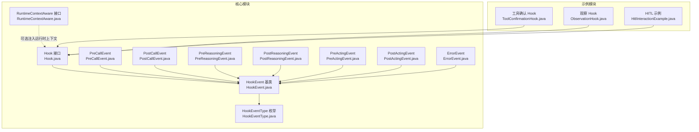
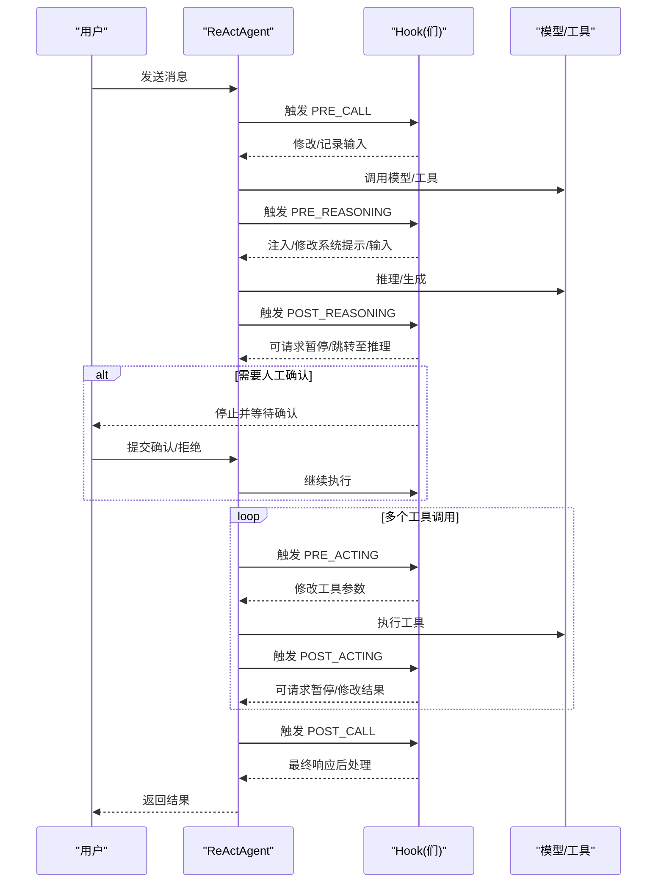
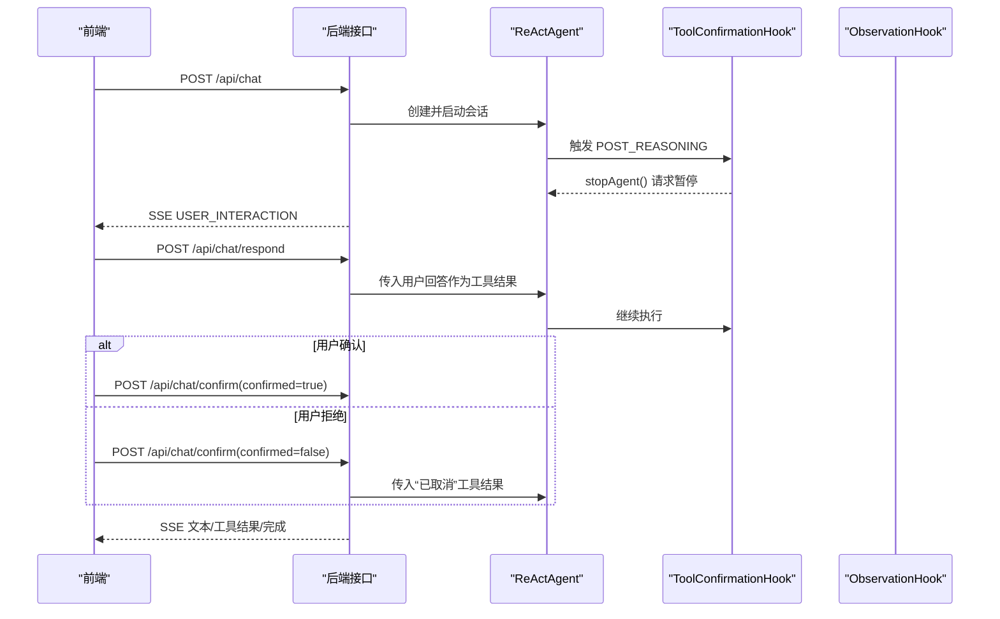
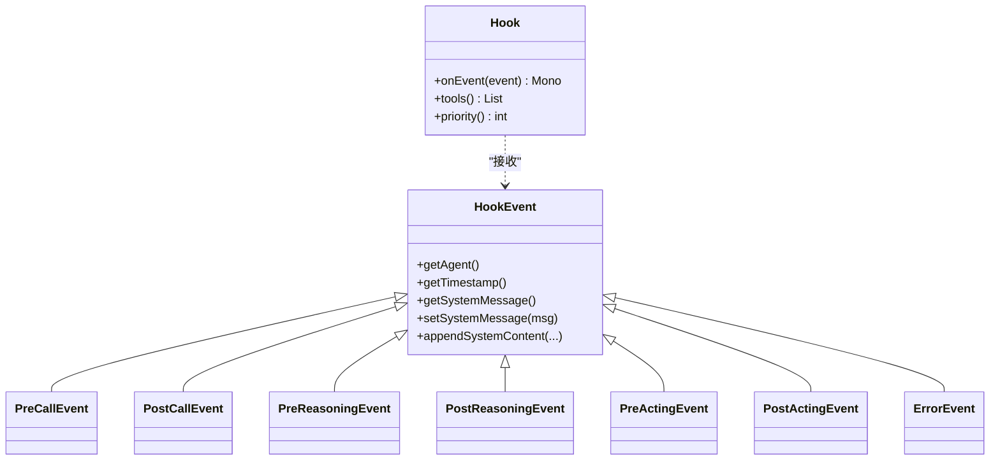

# 人机交互控制

<cite>
**本文引用的文件**   
- [Hook.java](file://agentscope-core/src/main/java/io/agentscope/core/hook/Hook.java)
- [HookEvent.java](file://agentscope-core/src/main/java/io/agentscope/core/hook/HookEvent.java)
- [HookEventType.java](file://agentscope-core/src/main/java/io/agentscope/core/hook/HookEventType.java)
- [RuntimeContextAware.java](file://agentscope-core/src/main/java/io/agentscope/core/hook/RuntimeContextAware.java)
- [PreCallEvent.java](file://agentscope-core/src/main/java/io/agentscope/core/hook/PreCallEvent.java)
- [PostCallEvent.java](file://agentscope-core/src/main/java/io/agentscope/core/hook/PostCallEvent.java)
- [PreReasoningEvent.java](file://agentscope-core/src/main/java/io/agentscope/core/hook/PreReasoningEvent.java)
- [PostReasoningEvent.java](file://agentscope-core/src/main/java/io/agentscope/core/hook/PostReasoningEvent.java)
- [PreActingEvent.java](file://agentscope-core/src/main/java/io/agentscope/core/hook/PreActingEvent.java)
- [PostActingEvent.java](file://agentscope-core/src/main/java/io/agentscope/core/hook/PostActingEvent.java)
- [ErrorEvent.java](file://agentscope-core/src/main/java/io/agentscope/core/hook/ErrorEvent.java)
- [ToolConfirmationHook.java](file://agentscope-examples/advanced/src/main/java/io/agentscope/examples/advanced/hitl/ToolConfirmationHook.java)
- [ObservationHook.java](file://agentscope-examples/advanced/src/main/java/io/agentscope/examples/advanced/hitl/ObservationHook.java)
- [HitlInteractionExample.java](file://agentscope-examples/advanced/src/main/java/io/agentscope/examples/advanced/hitl/HitlInteractionExample.java)
</cite>

## 目录
1. [简介](#简介)
2. [项目结构](#项目结构)
3. [核心组件](#核心组件)
4. [架构总览](#架构总览)
5. [详细组件分析](#详细组件分析)
6. [依赖分析](#依赖分析)
7. [性能考虑](#性能考虑)
8. [故障排查指南](#故障排查指南)
9. [结论](#结论)
10. [附录](#附录)

## 简介
本文件围绕 AgentScope Java 框架的人机交互控制机制展开，系统性阐述 Hook 系统如何在智能体的推理与行动流程中注入人工干预。文档重点覆盖以下主题：
- Hook 事件类型与生命周期：从调用前到推理、行动、总结、错误等阶段的事件序列
- 预推理 Hook、推理 Hook、后推理 Hook 的职责边界与典型用法
- 通过 Hook 实现人机交互的关键能力：用户确认、额外上下文注入、错误修正、暂停与恢复
- Hook 执行顺序与优先级策略
- 具体实战示例与最佳实践

## 项目结构
本节聚焦与“人机交互控制”直接相关的模块与文件组织：
- 核心 Hook 接口与事件模型位于 agentscope-core 的 hook 包
- 示例应用位于 agentscope-examples 的 advanced.hitl 包，演示了工具确认、观察日志与动态 UI 交互

图表来源
- [Hook.java:117-186](file://agentscope-core/src/main/java/io/agentscope/core/hook/Hook.java#L117-L186)
- [HookEvent.java:74-205](file://agentscope-core/src/main/java/io/agentscope/core/hook/HookEvent.java#L74-L205)
- [HookEventType.java:27-63](file://agentscope-core/src/main/java/io/agentscope/core/hook/HookEventType.java#L27-L63)
- [RuntimeContextAware.java:30-39](file://agentscope-core/src/main/java/io/agentscope/core/hook/RuntimeContextAware.java#L30-L39)
- [PreCallEvent.java:44-80](file://agentscope-core/src/main/java/io/agentscope/core/hook/PreCallEvent.java#L44-L80)
- [PostCallEvent.java:42-76](file://agentscope-core/src/main/java/io/agentscope/core/hook/PostCallEvent.java#L42-L76)
- [PreReasoningEvent.java:47-116](file://agentscope-core/src/main/java/io/agentscope/core/hook/PreReasoningEvent.java#L47-L116)
- [PostReasoningEvent.java:51-172](file://agentscope-core/src/main/java/io/agentscope/core/hook/PostReasoningEvent.java#L51-L172)
- [PreActingEvent.java:47-70](file://agentscope-core/src/main/java/io/agentscope/core/hook/PreActingEvent.java#L47-L70)
- [PostActingEvent.java:50-128](file://agentscope-core/src/main/java/io/agentscope/core/hook/PostActingEvent.java#L50-L128)
- [ErrorEvent.java:41-65](file://agentscope-core/src/main/java/io/agentscope/core/hook/ErrorEvent.java#L41-L65)
- [ToolConfirmationHook.java:33-56](file://agentscope-examples/advanced/src/main/java/io/agentscope/examples/advanced/hitl/ToolConfirmationHook.java#L33-L56)
- [ObservationHook.java:55-94](file://agentscope-examples/advanced/src/main/java/io/agentscope/examples/advanced/hitl/ObservationHook.java#L55-L94)
- [HitlInteractionExample.java:82-324](file://agentscope-examples/advanced/src/main/java/io/agentscope/examples/advanced/hitl/HitlInteractionExample.java#L82-L324)

章节来源
- [Hook.java:117-186](file://agentscope-core/src/main/java/io/agentscope/core/hook/Hook.java#L117-L186)
- [HookEvent.java:74-205](file://agentscope-core/src/main/java/io/agentscope/core/hook/HookEvent.java#L74-L205)
- [HookEventType.java:27-63](file://agentscope-core/src/main/java/io/agentscope/core/hook/HookEventType.java#L27-L63)
- [RuntimeContextAware.java:30-39](file://agentscope-core/src/main/java/io/agentscope/core/hook/RuntimeContextAware.java#L30-L39)
- [PreCallEvent.java:44-80](file://agentscope-core/src/main/java/io/agentscope/core/hook/PreCallEvent.java#L44-L80)
- [PostCallEvent.java:42-76](file://agentscope-core/src/main/java/io/agentscope/core/hook/PostCallEvent.java#L42-L76)
- [PreReasoningEvent.java:47-116](file://agentscope-core/src/main/java/io/agentscope/core/hook/PreReasoningEvent.java#L47-L116)
- [PostReasoningEvent.java:51-172](file://agentscope-core/src/main/java/io/agentscope/core/hook/PostReasoningEvent.java#L51-L172)
- [PreActingEvent.java:47-70](file://agentscope-core/src/main/java/io/agentscope/core/hook/PreActingEvent.java#L47-L70)
- [PostActingEvent.java:50-128](file://agentscope-core/src/main/java/io/agentscope/core/hook/PostActingEvent.java#L50-L128)
- [ErrorEvent.java:41-65](file://agentscope-core/src/main/java/io/agentscope/core/hook/ErrorEvent.java#L41-L65)
- [ToolConfirmationHook.java:33-56](file://agentscope-examples/advanced/src/main/java/io/agentscope/examples/advanced/hitl/ToolConfirmationHook.java#L33-L56)
- [ObservationHook.java:55-94](file://agentscope-examples/advanced/src/main/java/io/agentscope/examples/advanced/hitl/ObservationHook.java#L55-L94)
- [HitlInteractionExample.java:82-324](file://agentscope-examples/advanced/src/main/java/io/agentscope/examples/advanced/hitl/HitlInteractionExample.java#L82-324)

## 核心组件
- Hook 接口：统一的事件拦截入口，支持优先级与工具注册，所有 Hook 事件均通过 onEvent 分发
- HookEvent 抽象基类：定义统一的系统消息字段与辅助方法，确保每次推理迭代的系统提示一致性
- HookEventType 枚举：定义完整的事件生命周期（调用前、推理前/后、行动前/后、总结前/后、错误）
- 各具体事件类：按阶段提供可修改或只读的能力，用于注入上下文、修改消息、请求暂停/恢复
- RuntimeContextAware：可选接口，允许 Hook 在一次调用中持有共享的运行时上下文
- 示例 Hook：
  - ToolConfirmationHook：在推理后检测需要人工确认的工具调用，触发暂停以便前端展示确认界面
  - ObservationHook：低优先级日志钩子，记录关键阶段的输入输出与工具调用情况

章节来源
- [Hook.java:117-186](file://agentscope-core/src/main/java/io/agentscope/core/hook/Hook.java#L117-L186)
- [HookEvent.java:74-205](file://agentscope-core/src/main/java/io/agentscope/core/hook/HookEvent.java#L74-L205)
- [HookEventType.java:27-63](file://agentscope-core/src/main/java/io/agentscope/core/hook/HookEventType.java#L27-L63)
- [RuntimeContextAware.java:30-39](file://agentscope-core/src/main/java/io/agentscope/core/hook/RuntimeContextAware.java#L30-L39)
- [ToolConfirmationHook.java:33-56](file://agentscope-examples/advanced/src/main/java/io/agentscope/examples/advanced/hitl/ToolConfirmationHook.java#L33-L56)
- [ObservationHook.java:55-94](file://agentscope-examples/advanced/src/main/java/io/agentscope/examples/advanced/hitl/ObservationHook.java#L55-L94)

## 架构总览
下图展示了 Hook 系统在智能体生命周期中的位置与交互关系：

图表来源
- [PreCallEvent.java:44-80](file://agentscope-core/src/main/java/io/agentscope/core/hook/PreCallEvent.java#L44-L80)
- [PreReasoningEvent.java:47-116](file://agentscope-core/src/main/java/io/agentscope/core/hook/PreReasoningEvent.java#L47-L116)
- [PostReasoningEvent.java:51-172](file://agentscope-core/src/main/java/io/agentscope/core/hook/PostReasoningEvent.java#L51-L172)
- [PreActingEvent.java:47-70](file://agentscope-core/src/main/java/io/agentscope/core/hook/PreActingEvent.java#L47-L70)
- [PostActingEvent.java:50-128](file://agentscope-core/src/main/java/io/agentscope/core/hook/PostActingEvent.java#L50-L128)
- [PostCallEvent.java:42-76](file://agentscope-core/src/main/java/io/agentscope/core/hook/PostCallEvent.java#L42-L76)
- [ToolConfirmationHook.java:33-56](file://agentscope-examples/advanced/src/main/java/io/agentscope/examples/advanced/hitl/ToolConfirmationHook.java#L33-L56)

## 详细组件分析

### Hook 生命周期与事件类型
- 调用前/后：PreCallEvent、PostCallEvent，适合初始化资源、过滤输入、最终输出后处理
- 推理前/后：PreReasoningEvent、PostReasoningEvent，适合注入系统提示、修改推理输入、过滤/修改工具调用、请求暂停/跳转
- 行动前/后：PreActingEvent、PostActingEvent，适合校验/修改工具参数、后处理工具结果、请求暂停
- 错误：ErrorEvent，只读通知，适合记录与上报

章节来源
- [HookEventType.java:27-63](file://agentscope-core/src/main/java/io/agentscope/core/hook/HookEventType.java#L27-L63)
- [PreCallEvent.java:44-80](file://agentscope-core/src/main/java/io/agentscope/core/hook/PreCallEvent.java#L44-L80)
- [PostCallEvent.java:42-76](file://agentscope-core/src/main/java/io/agentscope/core/hook/PostCallEvent.java#L42-L76)
- [PreReasoningEvent.java:47-116](file://agentscope-core/src/main/java/io/agentscope/core/hook/PreReasoningEvent.java#L47-L116)
- [PostReasoningEvent.java:51-172](file://agentscope-core/src/main/java/io/agentscope/core/hook/PostReasoningEvent.java#L51-L172)
- [PreActingEvent.java:47-70](file://agentscope-core/src/main/java/io/agentscope/core/hook/PreActingEvent.java#L47-L70)
- [PostActingEvent.java:50-128](file://agentscope-core/src/main/java/io/agentscope/core/hook/PostActingEvent.java#L50-L128)
- [ErrorEvent.java:41-65](file://agentscope-core/src/main/java/io/agentscope/core/hook/ErrorEvent.java#L41-L65)

### Hook 接口与优先级
- 单一入口 onEvent：所有事件通过该方法分发，使用模式匹配区分事件类型
- 优先级：数值越小优先级越高；默认 100；建议 0-50 关键系统、51-100 高优先、101-500 正常、501-1000 低优先
- 工具注册：hooks 可自带工具，构建时自动注册到代理本地工具箱
- 运行时上下文：实现 RuntimeContextAware 可在一次调用中注入共享上下文

章节来源
- [Hook.java:117-186](file://agentscope-core/src/main/java/io/agentscope/core/hook/Hook.java#L117-L186)
- [RuntimeContextAware.java:30-39](file://agentscope-core/src/main/java/io/agentscope/core/hook/RuntimeContextAware.java#L30-L39)

### HookEvent 基类与系统消息
- 统一系统消息：每个事件携带一个系统消息字段，ReActAgent 在不同阶段冻结/注入，保证每次推理迭代的系统提示一致性
- 修改方式：仅能通过 setSystemMessage 或 appendSystemContent 进行安全修改，禁止直接向输入消息注入 SYSTEM 角色消息
- 访问便捷：提供 getMemory 快捷访问代理内存

章节来源
- [HookEvent.java:74-205](file://agentscope-core/src/main/java/io/agentscope/core/hook/HookEvent.java#L74-L205)

### 预推理 Hook（PreReasoningEvent）
- 可修改：输入消息列表、生成选项（覆盖）
- 典型用途：注入提示词、添加系统指令、过滤/增强上下文、动态调整温度等生成参数
- 注意：系统消息通过 HookEvent 的统一字段管理，避免重复注入

章节来源
- [PreReasoningEvent.java:47-116](file://agentscope-core/src/main/java/io/agentscope/core/hook/PreReasoningEvent.java#L47-L116)
- [HookEvent.java:140-204](file://agentscope-core/src/main/java/io/agentscope/core/hook/HookEvent.java#L140-L204)

### 推理 Hook（PostReasoningEvent）
- 可修改：推理消息（文本/思考/工具调用块）
- 关键能力：
  - stopAgent：请求在当前阶段停止，返回包含待执行工具的结果供人工审阅
  - gotoReasoning：回退到推理阶段，可带入工具结果或其他提示，进行二次推理
- 场景：敏感工具调用前的人工确认、复杂问题的二次思考与上下文补充

章节来源
- [PostReasoningEvent.java:51-172](file://agentscope-core/src/main/java/io/agentscope/core/hook/PostReasoningEvent.java#L51-L172)

### 后推理 Hook（PostCallEvent）
- 可修改：最终消息
- 典型用途：输出格式化、脱敏、元数据附加、最终结果归档

章节来源
- [PostCallEvent.java:42-76](file://agentscope-core/src/main/java/io/agentscope/core/hook/PostCallEvent.java#L42-L76)

### 行动前/后 Hook（PreActingEvent、PostActingEvent）
- 行动前：修改单个工具调用参数，实现细粒度授权与参数校验
- 行动后：修改工具结果、转换输出格式、处理异常、请求暂停

章节来源
- [PreActingEvent.java:47-70](file://agentscope-core/src/main/java/io/agentscope/core/hook/PreActingEvent.java#L47-L70)
- [PostActingEvent.java:50-128](file://agentscope-core/src/main/java/io/agentscope/core/hook/PostActingEvent.java#L50-L128)

### 错误 Hook（ErrorEvent）
- 只读通知，适合记录错误、发送告警、统计指标

章节来源
- [ErrorEvent.java:41-65](file://agentscope-core/src/main/java/io/agentscope/core/hook/ErrorEvent.java#L41-L65)

### 实战示例：工具确认与动态 UI 交互
- 工具确认 Hook：在推理完成后检查是否存在需要人工确认的工具调用，若存在则请求暂停，等待前端确认
- 观察 Hook：以低优先级记录关键阶段的输入输出，便于调试与审计
- HITL 示例：结合 Spring Boot 提供 SSE 流，前端渲染动态 UI（文本框、选择框、表单），实现“询问用户”的工具与人工确认流程

图表来源
- [ToolConfirmationHook.java:33-56](file://agentscope-examples/advanced/src/main/java/io/agentscope/examples/advanced/hitl/ToolConfirmationHook.java#L33-L56)
- [ObservationHook.java:55-94](file://agentscope-examples/advanced/src/main/java/io/agentscope/examples/advanced/hitl/ObservationHook.java#L55-L94)
- [HitlInteractionExample.java:159-306](file://agentscope-examples/advanced/src/main/java/io/agentscope/examples/advanced/hitl/HitlInteractionExample.java#L159-306)

章节来源
- [ToolConfirmationHook.java:33-56](file://agentscope-examples/advanced/src/main/java/io/agentscope/examples/advanced/hitl/ToolConfirmationHook.java#L33-L56)
- [ObservationHook.java:55-94](file://agentscope-examples/advanced/src/main/java/io/agentscope/examples/advanced/hitl/ObservationHook.java#L55-L94)
- [HitlInteractionExample.java:159-306](file://agentscope-examples/advanced/src/main/java/io/agentscope/examples/advanced/hitl/HitlInteractionExample.java#L159-306)

### Hook 执行顺序与控制逻辑
- 顺序规则：按优先级升序执行，同优先级按注册顺序执行
- 控制点：
  - 推理前：注入系统提示、增强上下文
  - 推理后：过滤工具调用、请求暂停/跳转
  - 行动前：参数校验/注入
  - 行动后：结果后处理、请求暂停
  - 调用前后：输入过滤、输出后处理
  - 错误：统一记录与上报

章节来源
- [Hook.java:167-185](file://agentscope-core/src/main/java/io/agentscope/core/hook/Hook.java#L167-L185)
- [PostReasoningEvent.java:99-171](file://agentscope-core/src/main/java/io/agentscope/core/hook/PostReasoningEvent.java#L99-L171)
- [PostActingEvent.java:98-127](file://agentscope-core/src/main/java/io/agentscope/core/hook/PostActingEvent.java#L98-L127)
- [PreCallEvent.java:77-79](file://agentscope-core/src/main/java/io/agentscope/core/hook/PreCallEvent.java#L77-L79)
- [PostCallEvent.java:73-75](file://agentscope-core/src/main/java/io/agentscope/core/hook/PostCallEvent.java#L73-L75)

## 依赖分析
- Hook 与事件类型：Hook 接口统一接收 HookEvent 子类；各具体事件继承自 HookEvent 或其子类
- 事件间依赖：PreReasoningEvent/PostReasoningEvent 依赖 HookEvent 的系统消息机制；PreActingEvent/PostActingEvent 依赖工具箱与工具调用块
- 示例依赖：ToolConfirmationHook 依赖 PostReasoningEvent 的暂停能力；ObservationHook 依赖各类事件进行日志输出

图表来源
- [Hook.java:117-186](file://agentscope-core/src/main/java/io/agentscope/core/hook/Hook.java#L117-L186)
- [HookEvent.java:74-205](file://agentscope-core/src/main/java/io/agentscope/core/hook/HookEvent.java#L74-L205)
- [PreCallEvent.java:44-80](file://agentscope-core/src/main/java/io/agentscope/core/hook/PreCallEvent.java#L44-L80)
- [PostCallEvent.java:42-76](file://agentscope-core/src/main/java/io/agentscope/core/hook/PostCallEvent.java#L42-L76)
- [PreReasoningEvent.java:47-116](file://agentscope-core/src/main/java/io/agentscope/core/hook/PreReasoningEvent.java#L47-L116)
- [PostReasoningEvent.java:51-172](file://agentscope-core/src/main/java/io/agentscope/core/hook/PostReasoningEvent.java#L51-L172)
- [PreActingEvent.java:47-70](file://agentscope-core/src/main/java/io/agentscope/core/hook/PreActingEvent.java#L47-L70)
- [PostActingEvent.java:50-128](file://agentscope-core/src/main/java/io/agentscope/core/hook/PostActingEvent.java#L50-L128)
- [ErrorEvent.java:41-65](file://agentscope-core/src/main/java/io/agentscope/core/hook/ErrorEvent.java#L41-L65)

章节来源
- [Hook.java:117-186](file://agentscope-core/src/main/java/io/agentscope/core/hook/Hook.java#L117-L186)
- [HookEvent.java:74-205](file://agentscope-core/src/main/java/io/agentscope/core/hook/HookEvent.java#L74-L205)

## 性能考虑
- Hook 优先级与数量：过多高优先级 Hook 会增加链路开销；建议将纯观察类 Hook 放置在较低优先级
- 事件修改成本：频繁修改消息列表与系统消息会带来对象复制与验证开销；应尽量批量处理
- 异步链路：onEvent 返回 Mono，避免阻塞主线程；注意背压与错误传播
- 工具注册：Hook 自带工具在构建时一次性注册，避免运行期重复注册

## 故障排查指南
- 系统消息注入异常：直接向输入消息注入 SYSTEM 角色消息会导致非法状态异常；请使用 HookEvent 的系统消息 API
- 工具结果不匹配：调用 gotoReasoning 时若存在待执行工具调用，必须提供匹配的工具结果消息，否则抛出非法状态异常
- Hook 未生效：确认 Hook 的优先级设置与注册顺序；必要时启用低优先级的观察 Hook 辅助定位问题
- 错误处理：ErrorEvent 为只读通知，需在上层捕获并记录；可在 Hook 中统一收集错误信息

章节来源
- [HookEvent.java:43-66](file://agentscope-core/src/main/java/io/agentscope/core/hook/HookEvent.java#L43-L66)
- [PostReasoningEvent.java:112-153](file://agentscope-core/src/main/java/io/agentscope/core/hook/PostReasoningEvent.java#L112-L153)
- [ErrorEvent.java:41-65](file://agentscope-core/src/main/java/io/agentscope/core/hook/ErrorEvent.java#L41-L65)

## 结论
AgentScope 的 Hook 系统通过统一的事件模型与严格的生命周期划分，为智能体推理与行动过程提供了强大的可插拔控制能力。借助 Hook，开发者可以轻松实现：
- 人机协作：在关键节点暂停并等待人工确认
- 上下文增强：在推理前注入系统提示与动态上下文
- 结果治理：在推理后与行动后对工具调用与结果进行过滤与修正
- 可观测性：以低优先级 Hook 记录关键路径，支撑调试与审计

通过合理设计 Hook 的优先级与职责边界，并结合示例中的工具确认与动态 UI 交互模式，可以在保证自动化效率的同时，最大化地引入人工审慎与可控性。

## 附录
- 最佳实践清单
  - 将安全与合规相关的 Hook 设置为高优先级（0-50）
  - 将业务逻辑 Hook 放置在 51-100 区间
  - 将日志与监控类 Hook 放置在 501-1000 区间
  - 使用 HookEvent 的系统消息 API 注入提示，避免直接修改输入消息
  - 在需要人工确认的工具调用上使用 PostReasoningEvent 的暂停能力
  - 对工具结果进行必要的后处理与脱敏，避免敏感信息泄露
  - 在开发阶段启用观察 Hook，生产环境可降低优先级或关闭