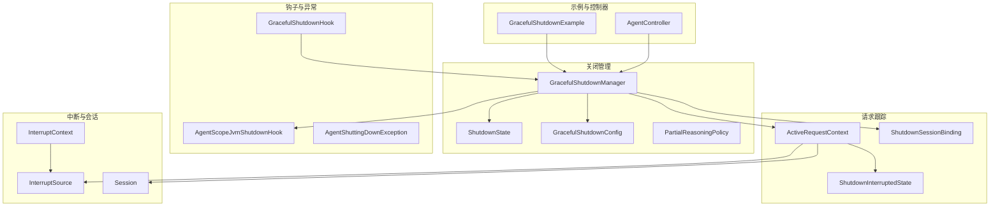
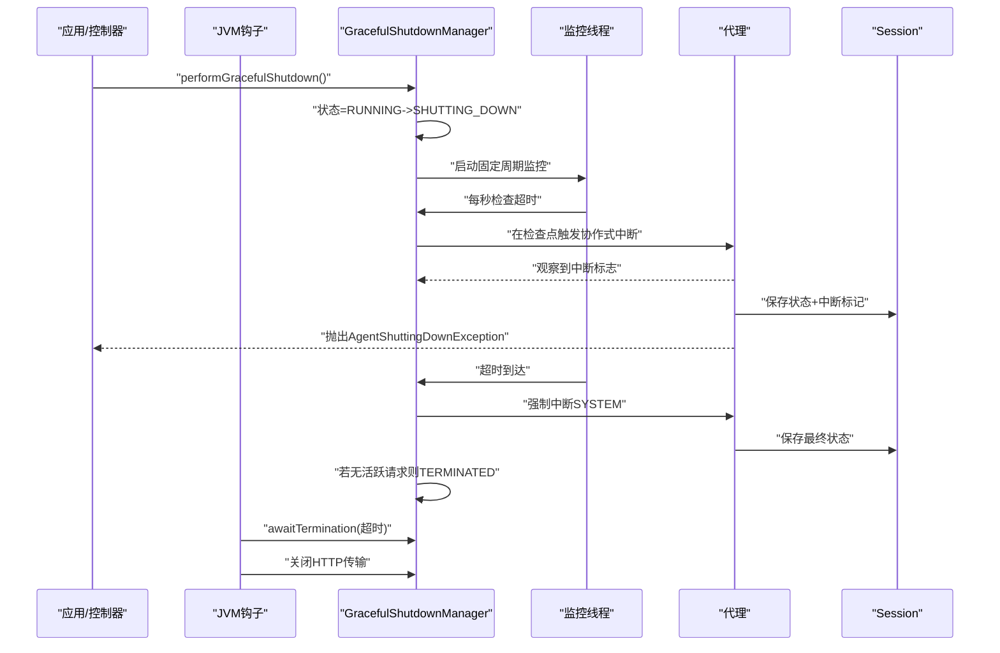
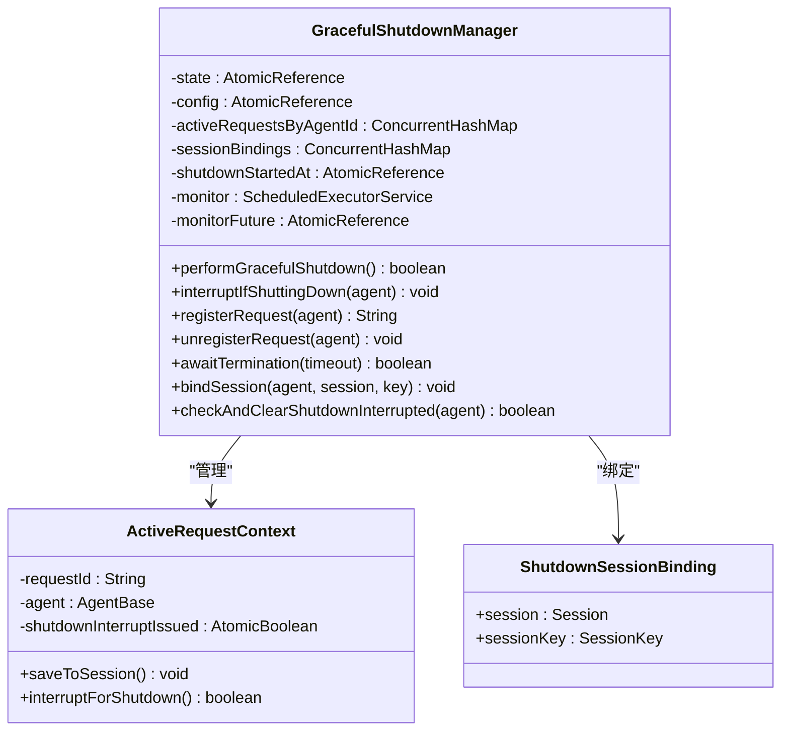
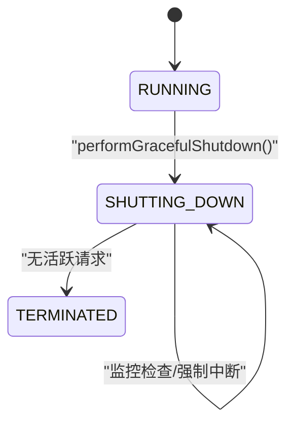
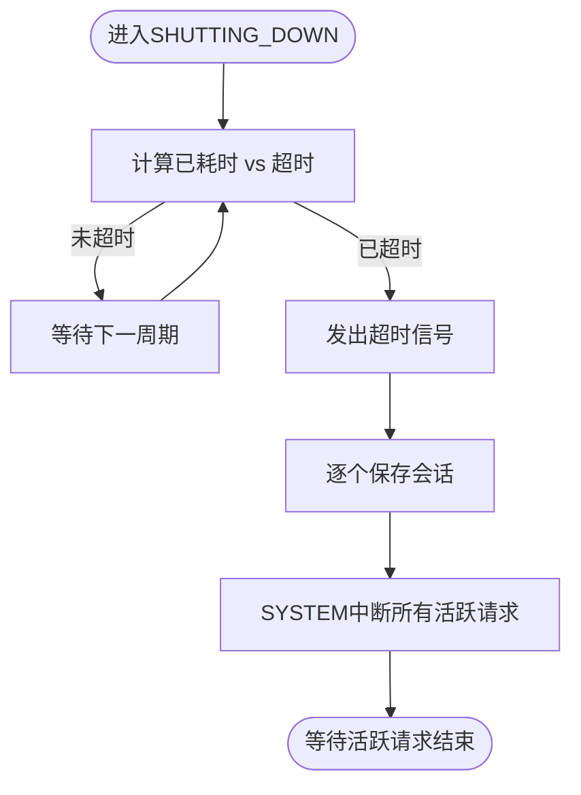
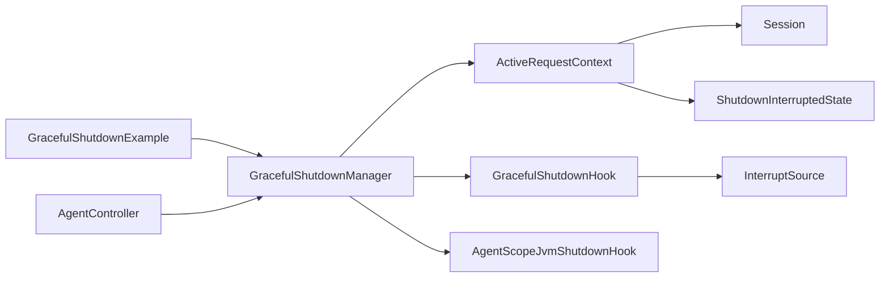

# 优雅取消机制

<cite>
**本文引用的文件**
- [GracefulShutdownManager.java](file://agentscope-core/src/main/java/io/agentscope/core/shutdown/GracefulShutdownManager.java)
- [ShutdownState.java](file://agentscope-core/src/main/java/io/agentscope/core/shutdown/ShutdownState.java)
- [GracefulShutdownConfig.java](file://agentscope-core/src/main/java/io/agentscope/core/shutdown/GracefulShutdownConfig.java)
- [PartialReasoningPolicy.java](file://agentscope-core/src/main/java/io/agentscope/core/shutdown/PartialReasoningPolicy.java)
- [ActiveRequestContext.java](file://agentscope-core/src/main/java/io/agentscope/core/shutdown/ActiveRequestContext.java)
- [ShutdownInterruptedState.java](file://agentscope-core/src/main/java/io/agentscope/core/shutdown/ShutdownInterruptedState.java)
- [ShutdownSessionBinding.java](file://agentscope-core/src/main/java/io/agentscope/core/shutdown/ShutdownSessionBinding.java)
- [AgentScopeJvmShutdownHook.java](file://agentscope-core/src/main/java/io/agentscope/core/shutdown/AgentScopeJvmShutdownHook.java)
- [GracefulShutdownHook.java](file://agentscope-core/src/main/java/io/agentscope/core/shutdown/GracefulShutdownHook.java)
- [AgentShuttingDownException.java](file://agentscope-core/src/main/java/io/agentscope/core/shutdown/AgentShuttingDownException.java)
- [InterruptContext.java](file://agentscope-core/src/main/java/io/agentscope/core/interruption/InterruptContext.java)
- [InterruptSource.java](file://agentscope-core/src/main/java/io/agentscope/core/interruption/InterruptSource.java)
- [Session.java](file://agentscope-core/src/main/java/io/agentscope/core/session/Session.java)
- [GracefulShutdownExample.java](file://agentscope-examples/graceful-shutdown/src/main/java/io/agentscope/examples/shutdown/smoke/GracefulShutdownExample.java)
- [AgentController.java](file://agentscope-examples/graceful-shutdown/src/main/java/io/agentscope/examples/shutdown/e2e/AgentController.java)
</cite>

## 目录
1. [简介](#简介)
2. [项目结构](#项目结构)
3. [核心组件](#核心组件)
4. [架构总览](#架构总览)
5. [详细组件分析](#详细组件分析)
6. [依赖分析](#依赖分析)
7. [性能考虑](#性能考虑)
8. [故障排查指南](#故障排查指南)
9. [结论](#结论)
10. [附录：配置与使用示例路径](#附录配置与使用示例路径)

## 简介
本文件系统性阐述 AgentScope Java 框架的“优雅取消”（优雅关闭）机制，重点围绕 GracefulShutdownManager 的设计与实现，解释其如何在不破坏代理状态的前提下安全终止长时间运行的操作，如何通过“部分推理策略”平衡数据完整性与可用性，并给出超时处理、资源清理与状态保存的最佳实践。文档同时提供面向开发者的配置与使用示例路径，帮助快速落地。

## 项目结构
优雅取消机制涉及以下关键模块：
- 关闭管理与状态机：GracefulShutdownManager、ShutdownState、GracefulShutdownConfig、PartialReasoningPolicy
- 请求生命周期跟踪：ActiveRequestContext、ShutdownSessionBinding、ShutdownInterruptedState
- JVM 钩子与事件钩子：AgentScopeJvmShutdownHook、GracefulShutdownHook
- 异常与中断上下文：AgentShuttingDownException、InterruptContext、InterruptSource
- 会话接口：Session（用于状态持久化）
- 示例与控制器：GracefulShutdownExample、AgentController

图表来源
- [GracefulShutdownManager.java:41-321](file://agentscope-core/src/main/java/io/agentscope/core/shutdown/GracefulShutdownManager.java#L41-L321)
- [ShutdownState.java:21-25](file://agentscope-core/src/main/java/io/agentscope/core/shutdown/ShutdownState.java#L21-L25)
- [GracefulShutdownConfig.java:36-69](file://agentscope-core/src/main/java/io/agentscope/core/shutdown/GracefulShutdownConfig.java#L36-L69)
- [PartialReasoningPolicy.java:21-24](file://agentscope-core/src/main/java/io/agentscope/core/shutdown/PartialReasoningPolicy.java#L21-L24)
- [ActiveRequestContext.java:29-77](file://agentscope-core/src/main/java/io/agentscope/core/shutdown/ActiveRequestContext.java#L29-L77)
- [ShutdownSessionBinding.java:25-31](file://agentscope-core/src/main/java/io/agentscope/core/shutdown/ShutdownSessionBinding.java#L25-L31)
- [ShutdownInterruptedState.java:27-27](file://agentscope-core/src/main/java/io/agentscope/core/shutdown/ShutdownInterruptedState.java#L27-L27)
- [AgentScopeJvmShutdownHook.java:34-70](file://agentscope-core/src/main/java/io/agentscope/core/shutdown/AgentScopeJvmShutdownHook.java#L34-L70)
- [GracefulShutdownHook.java:54-103](file://agentscope-core/src/main/java/io/agentscope/core/shutdown/GracefulShutdownHook.java#L54-L103)
- [AgentShuttingDownException.java:21-33](file://agentscope-core/src/main/java/io/agentscope/core/shutdown/AgentShuttingDownException.java#L21-L33)
- [InterruptContext.java:40-189](file://agentscope-core/src/main/java/io/agentscope/core/interruption/InterruptContext.java#L40-L189)
- [InterruptSource.java:28-37](file://agentscope-core/src/main/java/io/agentscope/core/interruption/InterruptSource.java#L28-L37)
- [Session.java:53-145](file://agentscope-core/src/main/java/io/agentscope/core/session/Session.java#L53-L145)
- [GracefulShutdownExample.java:72-106](file://agentscope-examples/graceful-shutdown/src/main/java/io/agentscope/examples/shutdown/smoke/GracefulShutdownExample.java#L72-L106)
- [AgentController.java:35-102](file://agentscope-examples/graceful-shutdown/src/main/java/io/agentscope/examples/shutdown/e2e/AgentController.java#L35-L102)

章节来源
- [GracefulShutdownManager.java:41-321](file://agentscope-core/src/main/java/io/agentscope/core/shutdown/GracefulShutdownManager.java#L41-L321)
- [GracefulShutdownConfig.java:36-69](file://agentscope-core/src/main/java/io/agentscope/core/shutdown/GracefulShutdownConfig.java#L36-L69)
- [GracefulShutdownHook.java:54-103](file://agentscope-core/src/main/java/io/agentscope/core/shutdown/GracefulShutdownHook.java#L54-L103)

## 核心组件
- GracefulShutdownManager：全局优雅关闭管理器，负责状态转换、活跃请求跟踪、超时强制中断、会话绑定与状态保存、JVM 钩子集成与终止等待。
- ShutdownState：全局关闭状态枚举（RUNNING、SHUTTING_DOWN、TERMINATED），驱动流程控制。
- GracefulShutdownConfig：关闭配置记录，包含关闭超时与部分推理策略。
- PartialReasoningPolicy：部分推理结果处理策略（SAVE、DISCARD）。
- ActiveRequestContext：单次活跃请求的上下文，封装请求 ID、代理实例、会话绑定与中断触发。
- ShutdownSessionBinding：关闭时的状态持久化绑定（Session + SessionKey）。
- ShutdownInterruptedState：标记某会话曾被关闭中断，避免重复输入。
- AgentScopeJvmShutdownHook：JVM 信号钩子，触发优雅关闭、等待终止并关闭传输层。
- GracefulShutdownHook：生命周期钩子，在关键检查点（推理后、执行后、总结后）进行中断。
- AgentShuttingDownException：关闭期间拒绝或中断时抛出的业务异常。
- InterruptContext/InterruptSource：中断来源与上下文信息。
- Session：状态持久化接口，支持保存/加载状态对象与列表。

章节来源
- [GracefulShutdownManager.java:41-321](file://agentscope-core/src/main/java/io/agentscope/core/shutdown/GracefulShutdownManager.java#L41-L321)
- [ShutdownState.java:21-25](file://agentscope-core/src/main/java/io/agentscope/core/shutdown/ShutdownState.java#L21-L25)
- [GracefulShutdownConfig.java:36-69](file://agentscope-core/src/main/java/io/agentscope/core/shutdown/GracefulShutdownConfig.java#L36-L69)
- [PartialReasoningPolicy.java:21-24](file://agentscope-core/src/main/java/io/agentscope/core/shutdown/PartialReasoningPolicy.java#L21-L24)
- [ActiveRequestContext.java:29-77](file://agentscope-core/src/main/java/io/agentscope/core/shutdown/ActiveRequestContext.java#L29-L77)
- [ShutdownSessionBinding.java:25-31](file://agentscope-core/src/main/java/io/agentscope/core/shutdown/ShutdownSessionBinding.java#L25-L31)
- [ShutdownInterruptedState.java:27-27](file://agentscope-core/src/main/java/io/agentscope/core/shutdown/ShutdownInterruptedState.java#L27-L27)
- [AgentScopeJvmShutdownHook.java:34-70](file://agentscope-core/src/main/java/io/agentscope/core/shutdown/AgentScopeJvmShutdownHook.java#L34-L70)
- [GracefulShutdownHook.java:54-103](file://agentscope-core/src/main/java/io/agentscope/core/shutdown/GracefulShutdownHook.java#L54-L103)
- [AgentShuttingDownException.java:21-33](file://agentscope-core/src/main/java/io/agentscope/core/shutdown/AgentShuttingDownException.java#L21-L33)
- [InterruptContext.java:40-189](file://agentscope-core/src/main/java/io/agentscope/core/interruption/InterruptContext.java#L40-L189)
- [InterruptSource.java:28-37](file://agentscope-core/src/main/java/io/agentscope/core/interruption/InterruptSource.java#L28-L37)
- [Session.java:53-145](file://agentscope-core/src/main/java/io/agentscope/core/session/Session.java#L53-L145)

## 架构总览
优雅取消的整体流程如下：
- 应用通过 JVM 钩子或外部 API 触发优雅关闭。
- 关闭管理器进入 SHUTTING_DOWN，启动监控线程定期检查超时。
- 在每个阶段检查点（推理完成、工具执行完成、总结完成）进行“协作式中断”，允许当前阶段完整产出后再中断，避免浪费输出。
- 超时到达后，向所有活跃请求发出强制中断信号，保存会话并通知代理。
- 所有活跃请求结束后，进入 TERMINATED 并通知等待方；随后关闭传输层。

图表来源
- [AgentScopeJvmShutdownHook.java:47-68](file://agentscope-core/src/main/java/io/agentscope/core/shutdown/AgentScopeJvmShutdownHook.java#L47-L68)
- [GracefulShutdownManager.java:198-303](file://agentscope-core/src/main/java/io/agentscope/core/shutdown/GracefulShutdownManager.java#L198-L303)
- [GracefulShutdownHook.java:64-81](file://agentscope-core/src/main/java/io/agentscope/core/shutdown/GracefulShutdownHook.java#L64-L81)
- [ActiveRequestContext.java:58-76](file://agentscope-core/src/main/java/io/agentscope/core/shutdown/ActiveRequestContext.java#L58-L76)
- [AgentShuttingDownException.java:21-33](file://agentscope-core/src/main/java/io/agentscope/core/shutdown/AgentShuttingDownException.java#L21-L33)

## 详细组件分析

### GracefulShutdownManager 设计与实现
- 全局单例与状态机
  - 使用原子引用维护 ShutdownState，确保并发安全。
  - 默认配置为无限等待（超时为 null）与保存部分推理。
- 活跃请求跟踪
  - 以代理 ID 为键，维护 ActiveRequestContext 映射，支持注册/注销与查询。
  - 支持会话绑定，便于在中断时保存状态。
- 关键检查点中断
  - 在推理后、工具执行后、总结后三个阶段触发协作式中断，避免浪费输出。
- 超时强制中断
  - 监控线程按固定周期检查已耗时是否超过配置超时，超过则发出超时信号并强制中断所有活跃请求。
- 终止等待
  - 提供 awaitTermination 方法阻塞等待所有请求结束并进入 TERMINATED。
- JVM 集成
  - 注册 JVM 关闭钩子，统一触发优雅关闭、等待与传输层关闭顺序。

图表来源
- [GracefulShutdownManager.java:46-171](file://agentscope-core/src/main/java/io/agentscope/core/shutdown/GracefulShutdownManager.java#L46-L171)
- [ActiveRequestContext.java:29-77](file://agentscope-core/src/main/java/io/agentscope/core/shutdown/ActiveRequestContext.java#L29-L77)
- [ShutdownSessionBinding.java:25-31](file://agentscope-core/src/main/java/io/agentscope/core/shutdown/ShutdownSessionBinding.java#L25-L31)

章节来源
- [GracefulShutdownManager.java:41-321](file://agentscope-core/src/main/java/io/agentscope/core/shutdown/GracefulShutdownManager.java#L41-L321)
- [ActiveRequestContext.java:29-77](file://agentscope-core/src/main/java/io/agentscope/core/shutdown/ActiveRequestContext.java#L29-L77)
- [ShutdownSessionBinding.java:25-31](file://agentscope-core/src/main/java/io/agentscope/core/shutdown/ShutdownSessionBinding.java#L25-L31)

### ShutdownState 状态管理
- RUNNING：正常接受请求。
- SHUTTING_DOWN：开始关闭，拒绝新请求，但允许现有请求在检查点完成后中断。
- TERMINATED：所有活跃请求结束，系统可安全退出。

图表来源
- [ShutdownState.java:21-25](file://agentscope-core/src/main/java/io/agentscope/core/shutdown/ShutdownState.java#L21-L25)
- [GracefulShutdownManager.java:198-276](file://agentscope-core/src/main/java/io/agentscope/core/shutdown/GracefulShutdownManager.java#L198-L276)

章节来源
- [ShutdownState.java:21-25](file://agentscope-core/src/main/java/io/agentscope/core/shutdown/ShutdownState.java#L21-L25)
- [GracefulShutdownManager.java:198-276](file://agentscope-core/src/main/java/io/agentscope/core/shutdown/GracefulShutdownManager.java#L198-L276)

### PartialReasoningPolicy 决策逻辑
- SAVE：在关闭中断时保存部分推理内容，便于恢复继续。
- DISCARD：丢弃未完成的推理，避免污染后续状态。
- 该策略由 GracefulShutdownConfig 控制，默认为 SAVE。

章节来源
- [PartialReasoningPolicy.java:21-24](file://agentscope-core/src/main/java/io/agentscope/core/shutdown/PartialReasoningPolicy.java#L21-L24)
- [GracefulShutdownConfig.java:36-69](file://agentscope-core/src/main/java/io/agentscope/core/shutdown/GracefulShutdownConfig.java#L36-L69)

### 超时处理与强制中断流程
- 启动监控线程，周期性计算从关闭开始到现在的时间。
- 若配置了超时且已超过，则：
  - 发出超时信号（Reactor Mono），工具执行可竞速此信号提前中止。
  - 保存会话并触发 SYSTEM 中断。
- 协作式中断优先于强制中断，避免浪费已完成阶段的输出。

图表来源
- [GracefulShutdownManager.java:232-266](file://agentscope-core/src/main/java/io/agentscope/core/shutdown/GracefulShutdownManager.java#L232-L266)

章节来源
- [GracefulShutdownManager.java:232-266](file://agentscope-core/src/main/java/io/agentscope/core/shutdown/GracefulShutdownManager.java#L232-L266)

### 长时间运行工具调用的处理
- 工具执行在关闭期间属于“协作式中断”范畴：若工具仍在运行，框架不会强制打断它，而是等待其自然完成。
- 当工具完成后，代理观察到中断标志并抛出 AgentShuttingDownException，上层可捕获并进行业务恢复。
- 示例中演示了“工具执行超时”场景，工具在超时后仍继续运行，直到完成再触发异常传播。

章节来源
- [GracefulShutdownExample.java:369-442](file://agentscope-examples/graceful-shutdown/src/main/java/io/agentscope/examples/shutdown/smoke/GracefulShutdownExample.java#L369-L442)
- [GracefulShutdownManager.java:256-263](file://agentscope-core/src/main/java/io/agentscope/core/shutdown/GracefulShutdownManager.java#L256-L263)

### 不破坏代理状态的终止
- 会话绑定与状态保存
  - ActiveRequestContext 在中断前/后调用 saveToSession，将代理状态写入 Session，并设置“关闭中断”标记。
  - 下次重启时，GracefulShutdownManager 可检测该标记并清理重复输入，保证幂等恢复。
- 中断来源区分
  - InterruptSource.SYSTEM 表示由系统触发的强制中断，便于代理在合适时机抛出 AgentShuttingDownException。
- 会话接口
  - Session 提供 save/get/delete 等能力，支持增量追加与完整替换，满足不同存储实现需求。

章节来源
- [ActiveRequestContext.java:58-76](file://agentscope-core/src/main/java/io/agentscope/core/shutdown/ActiveRequestContext.java#L58-L76)
- [ShutdownInterruptedState.java:27-27](file://agentscope-core/src/main/java/io/agentscope/core/shutdown/ShutdownInterruptedState.java#L27-L27)
- [Session.java:53-145](file://agentscope-core/src/main/java/io/agentscope/core/session/Session.java#L53-L145)
- [InterruptSource.java:28-37](file://agentscope-core/src/main/java/io/agentscope/core/interruption/InterruptSource.java#L28-L37)

### 部分推理策略（Partial Reasoning）
- 策略选择
  - SAVE：适合需要继续推理或人工审阅的场景，保留中间结果。
  - DISCARD：适合对中间结果敏感或不需要恢复的场景。
- 配置方式
  - 通过 GracefulShutdownConfig 设置，影响关闭时的保存行为。

章节来源
- [GracefulShutdownConfig.java:36-69](file://agentscope-core/src/main/java/io/agentscope/core/shutdown/GracefulShutdownConfig.java#L36-L69)
- [PartialReasoningPolicy.java:21-24](file://agentscope-core/src/main/java/io/agentscope/core/shutdown/PartialReasoningPolicy.java#L21-L24)

### JVM 钩子与终止顺序
- 注册顺序
  - 先触发 performGracefulShutdown，再等待关闭超时+额外宽限期，最后关闭 HTTP 传输。
- 宽限期
  - 额外增加 5 秒宽限期，确保代理在传输关闭前完成中断与清理。

章节来源
- [AgentScopeJvmShutdownHook.java:47-68](file://agentscope-core/src/main/java/io/agentscope/core/shutdown/AgentScopeJvmShutdownHook.java#L47-L68)

### 生命周期钩子（GracefulShutdownHook）
- 检查点中断
  - 在推理完成、工具执行完成、总结完成后触发协作式中断。
- 重试去重
  - 若检测到上次请求因关闭中断，PreCallEvent 会清空重复用户输入，仅从已保存状态继续。

章节来源
- [GracefulShutdownHook.java:64-97](file://agentscope-core/src/main/java/io/agentscope/core/shutdown/GracefulShutdownHook.java#L64-L97)

## 依赖分析
- 组件耦合
  - GracefulShutdownManager 与 ActiveRequestContext 强耦合，前者管理后者生命周期。
  - GracefulShutdownHook 依赖 Manager 的检查点中断能力。
  - JVM 钩子依赖 Manager 的关闭与等待能力。
- 外部依赖
  - Reactor Mono 用于超时信号传播。
  - SLF4J 日志用于关键事件记录。
- 循环依赖
  - 未发现循环依赖，各模块职责清晰。

图表来源
- [GracefulShutdownManager.java:41-321](file://agentscope-core/src/main/java/io/agentscope/core/shutdown/GracefulShutdownManager.java#L41-L321)
- [GracefulShutdownHook.java:54-103](file://agentscope-core/src/main/java/io/agentscope/core/shutdown/GracefulShutdownHook.java#L54-L103)
- [AgentScopeJvmShutdownHook.java:34-70](file://agentscope-core/src/main/java/io/agentscope/core/shutdown/AgentScopeJvmShutdownHook.java#L34-L70)
- [ActiveRequestContext.java:29-77](file://agentscope-core/src/main/java/io/agentscope/core/shutdown/ActiveRequestContext.java#L29-L77)
- [Session.java:53-145](file://agentscope-core/src/main/java/io/agentscope/core/session/Session.java#L53-L145)
- [GracefulShutdownExample.java:72-106](file://agentscope-examples/graceful-shutdown/src/main/java/io/agentscope/examples/shutdown/smoke/GracefulShutdownExample.java#L72-L106)
- [AgentController.java:35-102](file://agentscope-examples/graceful-shutdown/src/main/java/io/agentscope/examples/shutdown/e2e/AgentController.java#L35-L102)

章节来源
- [GracefulShutdownManager.java:41-321](file://agentscope-core/src/main/java/io/agentscope/core/shutdown/GracefulShutdownManager.java#L41-L321)
- [GracefulShutdownHook.java:54-103](file://agentscope-core/src/main/java/io/agentscope/core/shutdown/GracefulShutdownHook.java#L54-L103)
- [AgentScopeJvmShutdownHook.java:34-70](file://agentscope-core/src/main/java/io/agentscope/core/shutdown/AgentScopeJvmShutdownHook.java#L34-L70)
- [ActiveRequestContext.java:29-77](file://agentscope-core/src/main/java/io/agentscope/core/shutdown/ActiveRequestContext.java#L29-L77)
- [Session.java:53-145](file://agentscope-core/src/main/java/io/agentscope/core/session/Session.java#L53-L145)
- [GracefulShutdownExample.java:72-106](file://agentscope-examples/graceful-shutdown/src/main/java/io/agentscope/examples/shutdown/smoke/GracefulShutdownExample.java#L72-L106)
- [AgentController.java:35-102](file://agentscope-examples/graceful-shutdown/src/main/java/io/agentscope/examples/shutdown/e2e/AgentController.java#L35-L102)

## 性能考虑
- 监控频率
  - 固定周期（1 秒）检查超时，开销极低，适合生产环境。
- 会话保存
  - 仅在必要时保存（检查点与超时），避免频繁 IO。
- 超时设置
  - 建议根据业务复杂度与工具耗时合理设置，兼顾响应与稳定性。
- 传输关闭
  - JVM 钩子在所有代理完成后才关闭传输，减少连接抖动。

## 故障排查指南
- 常见问题
  - 关闭后仍无响应：确认是否处于 SHUTTING_DOWN 且仍有活跃请求；检查工具是否 cooperatively interruptible。
  - 重复输入导致重复执行：确认是否正确使用 GracefulShutdownHook 的去重逻辑。
  - 异常传播延迟：工具完成后才会抛出 AgentShuttingDownException，属预期行为。
- 排查步骤
  - 查看 ShutdownState 与活跃请求数量。
  - 检查会话中是否存在 ShutdownInterruptedState 标记。
  - 确认 JVM 钩子是否注册成功，awaitTermination 是否被调用。
- 相关异常
  - AgentShuttingDownException：表示关闭期间被中断，需上层捕获并进行业务恢复。

章节来源
- [AgentShuttingDownException.java:21-33](file://agentscope-core/src/main/java/io/agentscope/core/shutdown/AgentShuttingDownException.java#L21-L33)
- [GracefulShutdownManager.java:198-303](file://agentscope-core/src/main/java/io/agentscope/core/shutdown/GracefulShutdownManager.java#L198-L303)
- [GracefulShutdownHook.java:88-97](file://agentscope-core/src/main/java/io/agentscope/core/shutdown/GracefulShutdownHook.java#L88-L97)

## 结论
AgentScope 的优雅取消机制通过“协作式中断 + 超时强制中断”的双轨策略，在保障输出完整性的同时实现了可控的关闭窗口。借助会话绑定与状态保存，系统能够在不破坏代理状态的前提下安全终止长时间运行的任务，并为业务层提供恢复与兜底能力。结合合理的超时配置与部分推理策略，可在复杂场景下取得最佳的用户体验与系统稳定性。

## 附录：配置与使用示例路径
- 全局配置
  - 设置关闭超时与部分推理策略：[GracefulShutdownConfig:36-69](file://agentscope-core/src/main/java/io/agentscope/core/shutdown/GracefulShutdownConfig.java#L36-L69)
  - 设置默认配置：[DEFAULT:48-49](file://agentscope-core/src/main/java/io/agentscope/core/shutdown/GracefulShutdownConfig.java#L48-L49)
- 触发优雅关闭
  - 代码入口：[performGracefulShutdown:198-213](file://agentscope-core/src/main/java/io/agentscope/core/shutdown/GracefulShutdownManager.java#L198-L213)
  - 等待终止：[awaitTermination:284-303](file://agentscope-core/src/main/java/io/agentscope/core/shutdown/GracefulShutdownManager.java#L284-L303)
- 会话绑定与状态保存
  - 绑定会话：[bindSession:97-102](file://agentscope-core/src/main/java/io/agentscope/core/shutdown/GracefulShutdownManager.java#L97-L102)
  - 保存状态：[saveToSession:58-68](file://agentscope-core/src/main/java/io/agentscope/core/shutdown/ActiveRequestContext.java#L58-L68)
  - 检测中断标记：[checkAndClearShutdownInterrupted:113-133](file://agentscope-core/src/main/java/io/agentscope/core/shutdown/GracefulShutdownManager.java#L113-L133)
- 生命周期钩子
  - 检查点中断：[GracefulShutdownHook.onEvent:64-81](file://agentscope-core/src/main/java/io/agentscope/core/shutdown/GracefulShutdownHook.java#L64-L81)
  - 重试去重：[deduplicateIfResuming:88-97](file://agentscope-core/src/main/java/io/agentscope/core/shutdown/GracefulShutdownHook.java#L88-L97)
- JVM 钩子
  - 注册与顺序：[AgentScopeJvmShutdownHook.register:43-69](file://agentscope-core/src/main/java/io/agentscope/core/shutdown/AgentScopeJvmShutdownHook.java#L43-L69)
- 示例与控制器
  - 端到端演示：[GracefulShutdownExample:72-106](file://agentscope-examples/graceful-shutdown/src/main/java/io/agentscope/examples/shutdown/smoke/GracefulShutdownExample.java#L72-L106)
  - REST 控制器：[AgentController:71-93](file://agentscope-examples/graceful-shutdown/src/main/java/io/agentscope/examples/shutdown/e2e/AgentController.java#L71-L93)