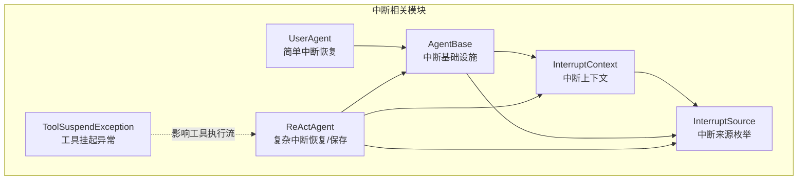
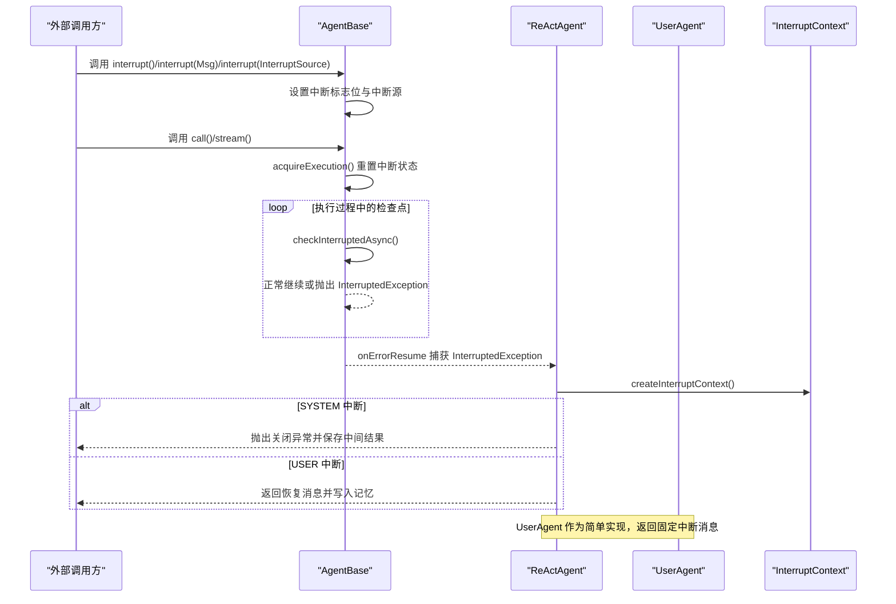
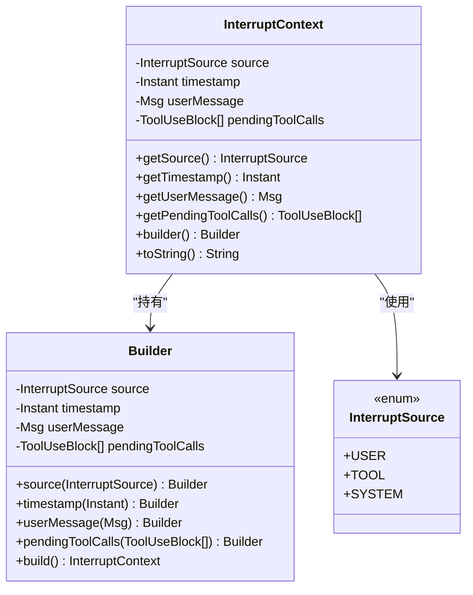
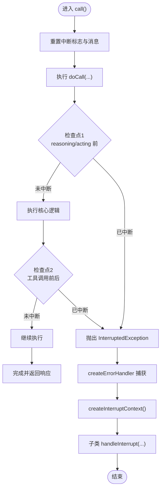
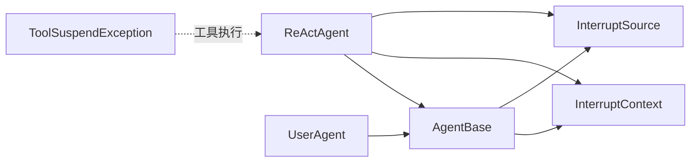

# 安全中断机制

<cite>
**本文引用的文件**
- [InterruptContext.java](file://agentscope-core/src/main/java/io/agentscope/core/interruption/InterruptContext.java)
- [InterruptSource.java](file://agentscope-core/src/main/java/io/agentscope/core/interruption/InterruptSource.java)
- [AgentBase.java](file://agentscope-core/src/main/java/io/agentscope/core/agent/AgentBase.java)
- [UserAgent.java](file://agentscope-core/src/main/java/io/agentscope/core/agent/user/UserAgent.java)
- [ReActAgent.java](file://agentscope-core/src/main/java/io/agentscope/core/ReActAgent.java)
- [ToolSuspendException.java](file://agentscope-core/src/main/java/io/agentscope/core/tool/ToolSuspendException.java)
- [AgentBaseTest.java](file://agentscope-core/src/test/java/io/agentscope/core/agent/AgentBaseTest.java)
</cite>

## 目录
1. [简介](#简介)
2. [项目结构](#项目结构)
3. [核心组件](#核心组件)
4. [架构总览](#架构总览)
5. [详细组件分析](#详细组件分析)
6. [依赖分析](#依赖分析)
7. [性能考虑](#性能考虑)
8. [故障排查指南](#故障排查指南)
9. [结论](#结论)
10. [附录](#附录)

## 简介
本文件系统性阐述 AgentScope Java 框架中的“安全中断机制”。重点围绕 InterruptContext 与 InterruptSource 的设计与使用，说明如何在智能体执行过程中捕获中断上下文（中断来源、时间戳、用户消息、待处理工具调用），如何在任意时刻暂停代理执行且不破坏当前状态，并通过 Builder 模式构建中断上下文；同时给出中断恢复流程与最佳实践建议。

## 项目结构
与中断机制直接相关的模块位于 agentscope-core 模块中：
- interruption 包：定义中断上下文与中断来源枚举
- agent 包：抽象基类 AgentBase 提供中断基础设施与错误处理
- agent.user 包：UserAgent 实现简单中断恢复
- ReActAgent：复杂智能体的中断处理与状态保存策略
- tool 包：工具执行异常（如 ToolSuspendException）与中断的关系
- test 包：单元测试验证中断行为

图表来源
- [InterruptContext.java:40-190](file://agentscope-core/src/main/java/io/agentscope/core/interruption/InterruptContext.java#L40-L190)
- [InterruptSource.java:28-37](file://agentscope-core/src/main/java/io/agentscope/core/interruption/InterruptSource.java#L28-L37)
- [AgentBase.java:93-514](file://agentscope-core/src/main/java/io/agentscope/core/agent/AgentBase.java#L93-L514)
- [UserAgent.java:68-269](file://agentscope-core/src/main/java/io/agentscope/core/agent/user/UserAgent.java#L68-L269)
- [ReActAgent.java:1135-1153](file://agentscope-core/src/main/java/io/agentscope/core/ReActAgent.java#L1135-L1153)
- [ToolSuspendException.java:40-69](file://agentscope-core/src/main/java/io/agentscope/core/tool/ToolSuspendException.java#L40-L69)

章节来源
- [InterruptContext.java:40-190](file://agentscope-core/src/main/java/io/agentscope/core/interruption/InterruptContext.java#L40-L190)
- [InterruptSource.java:28-37](file://agentscope-core/src/main/java/io/agentscope/core/interruption/InterruptSource.java#L28-L37)
- [AgentBase.java:93-514](file://agentscope-core/src/main/java/io/agentscope/core/agent/AgentBase.java#L93-L514)
- [UserAgent.java:68-269](file://agentscope-core/src/main/java/io/agentscope/core/agent/user/UserAgent.java#L68-L269)
- [ReActAgent.java:1135-1153](file://agentscope-core/src/main/java/io/agentscope/core/ReActAgent.java#L1135-L1153)
- [ToolSuspendException.java:40-69](file://agentscope-core/src/main/java/io/agentscope/core/tool/ToolSuspendException.java#L40-L69)

## 核心组件
- 中断来源（InterruptSource）
  - USER：由用户请求触发的中断
  - TOOL：由工具执行逻辑触发的中断
  - SYSTEM：由系统（超时、资源限制等）触发的中断
- 中断上下文（InterruptContext）
  - 封装中断来源、时间戳、用户消息、待处理工具调用列表
  - 提供 Builder 模式以灵活装配字段
  - 字段不可变，内部使用只读副本保证线程安全
- 中断基础设施（AgentBase）
  - 原子标志位与中断源引用，支持外部触发中断
  - reactive 式的 checkInterruptedAsync 在执行关键点检查中断
  - 统一错误处理：捕获 InterruptedException 并委派到 handleInterrupt
  - 每次 call() 调用前重置中断状态，确保幂等
- 具体实现
  - UserAgent：简单中断恢复，返回“被中断”提示消息
  - ReActAgent：区分 SYSTEM 与 USER 中断，前者触发关闭流程并保存中间结果，后者生成恢复消息并写入记忆

章节来源
- [InterruptSource.java:28-37](file://agentscope-core/src/main/java/io/agentscope/core/interruption/InterruptSource.java#L28-L37)
- [InterruptContext.java:40-190](file://agentscope-core/src/main/java/io/agentscope/core/interruption/InterruptContext.java#L40-L190)
- [AgentBase.java:316-402](file://agentscope-core/src/main/java/io/agentscope/core/agent/AgentBase.java#L316-L402)
- [UserAgent.java:259-269](file://agentscope-core/src/main/java/io/agentscope/core/agent/user/UserAgent.java#L259-L269)
- [ReActAgent.java:1135-1153](file://agentscope-core/src/main/java/io/agentscope/core/ReActAgent.java#L1135-L1153)

## 架构总览
下图展示了从外部触发中断到智能体恢复的整体流程，以及关键对象之间的交互关系。

图表来源
- [AgentBase.java:316-457](file://agentscope-core/src/main/java/io/agentscope/core/agent/AgentBase.java#L316-L457)
- [ReActAgent.java:1135-1153](file://agentscope-core/src/main/java/io/agentscope/core/ReActAgent.java#L1135-L1153)
- [UserAgent.java:259-269](file://agentscope-core/src/main/java/io/agentscope/core/agent/user/UserAgent.java#L259-L269)
- [InterruptContext.java:397-402](file://agentscope-core/src/main/java/io/agentscope/core/interruption/InterruptContext.java#L397-L402)

## 详细组件分析

### 中断上下文 InterruptContext
- 设计要点
  - 不可变数据结构：构造后字段不可变，避免竞态条件
  - Builder 模式：链式设置 source、timestamp、userMessage、pendingToolCalls
  - 默认值：source 默认 USER，timestamp 默认当前时间，pendingToolCalls 默认空列表
  - 只读副本：内部保存不可变副本，防止外部修改影响上下文一致性
- 关键方法
  - builder()：获取 Builder 实例
  - source()/timestamp()/userMessage()/pendingToolCalls()：设置对应字段
  - build()：构建不可变 InterruptContext
  - 访问器：getSource()/getTimestamp()/getUserMessage()/getPendingToolCalls()

图表来源
- [InterruptContext.java:40-190](file://agentscope-core/src/main/java/io/agentscope/core/interruption/InterruptContext.java#L40-L190)
- [InterruptSource.java:28-37](file://agentscope-core/src/main/java/io/agentscope/core/interruption/InterruptSource.java#L28-L37)

章节来源
- [InterruptContext.java:40-190](file://agentscope-core/src/main/java/io/agentscope/core/interruption/InterruptContext.java#L40-L190)

### 中断来源 InterruptSource
- 用途：标识中断发起者类型
- 适用场景：
  - USER：用户主动停止或切换
  - TOOL：工具执行逻辑需要外部干预
  - SYSTEM：系统级超时、资源限制等

章节来源
- [InterruptSource.java:28-37](file://agentscope-core/src/main/java/io/agentscope/core/interruption/InterruptSource.java#L28-L37)

### 中断基础设施 AgentBase
- 中断触发
  - interrupt()：设置中断源为 USER，置位中断标志
  - interrupt(Msg)：携带用户消息的中断
  - interrupt(InterruptSource)：显式指定中断源（为空则回退为 SYSTEM）
- 中断检查
  - checkInterruptedAsync()：在 Mono 链路的关键点检查中断，触发则抛出 InterruptedException
- 错误处理与恢复
  - createErrorHandler()：捕获 InterruptedException 并委派 handleInterrupt
  - createInterruptContext()：基于当前中断源与用户消息构建上下文
  - resetInterruptFlag()：每次 call() 开始前重置中断状态
- 抽象恢复
  - handleInterrupt(InterruptContext, Msg...)：由子类实现具体恢复逻辑

图表来源
- [AgentBase.java:316-457](file://agentscope-core/src/main/java/io/agentscope/core/agent/AgentBase.java#L316-L457)
- [AgentBase.java:397-402](file://agentscope-core/src/main/java/io/agentscope/core/agent/AgentBase.java#L397-L402)

章节来源
- [AgentBase.java:316-457](file://agentscope-core/src/main/java/io/agentscope/core/agent/AgentBase.java#L316-L457)
- [AgentBase.java:397-402](file://agentscope-core/src/main/java/io/agentscope/core/agent/AgentBase.java#L397-L402)

### 具体实现：UserAgent
- 行为特征
  - 简单中断恢复：收到中断后返回固定提示消息（用户角色）
  - 不涉及复杂状态保存，适合轻量交互场景
- 适用场景
  - 快速反馈型用户交互
  - 无需持久化中间结果的对话

章节来源
- [UserAgent.java:259-269](file://agentscope-core/src/main/java/io/agentscope/core/agent/user/UserAgent.java#L259-L269)

### 具体实现：ReActAgent
- 行为特征
  - 区分 SYSTEM 与 USER 中断：
    - SYSTEM：触发关闭流程并保存中间推理结果（受配置影响）
    - USER：生成恢复消息并写入记忆，便于后续继续
  - 在推理/行动阶段的关键检查点调用 checkInterruptedAsync，确保及时响应
- 与工具执行的关系
  - 工具可能抛出 ToolSuspendException，导致工具挂起并返回 Suspended 消息
  - 中断优先级高于工具挂起：若发生中断，框架会先处理中断再决定是否继续工具链

章节来源
- [ReActAgent.java:1135-1153](file://agentscope-core/src/main/java/io/agentscope/core/ReActAgent.java#L1135-L1153)
- [ReActAgent.java:590-649](file://agentscope-core/src/main/java/io/agentscope/core/ReActAgent.java#L590-L649)
- [ToolSuspendException.java:40-69](file://agentscope-core/src/main/java/io/agentscope/core/tool/ToolSuspendException.java#L40-L69)

## 依赖分析
- 组件耦合
  - AgentBase 对 InterruptContext/InterruptSource 有强依赖，是所有智能体中断能力的基础
  - ReActAgent/ UserAgent 通过继承 AgentBase 获得中断能力，并各自实现 handleInterrupt
  - 工具层的 ToolSuspendException 与中断机制协同工作，共同保障执行可控性
- 外部依赖
  - Reactor Mono/Flux：用于 reactive 式的中断检查与错误传播
  - 内存与状态模块：ReActAgent 在中断时写入记忆，确保状态可恢复

图表来源
- [AgentBase.java:93-514](file://agentscope-core/src/main/java/io/agentscope/core/agent/AgentBase.java#L93-L514)
- [InterruptContext.java:40-190](file://agentscope-core/src/main/java/io/agentscope/core/interruption/InterruptContext.java#L40-L190)
- [InterruptSource.java:28-37](file://agentscope-core/src/main/java/io/agentscope/core/interruption/InterruptSource.java#L28-L37)
- [ReActAgent.java:1135-1153](file://agentscope-core/src/main/java/io/agentscope/core/ReActAgent.java#L1135-L1153)
- [UserAgent.java:68-269](file://agentscope-core/src/main/java/io/agentscope/core/agent/user/UserAgent.java#L68-L269)
- [ToolSuspendException.java:40-69](file://agentscope-core/src/main/java/io/agentscope/core/tool/ToolSuspendException.java#L40-L69)

章节来源
- [AgentBase.java:93-514](file://agentscope-core/src/main/java/io/agentscope/core/agent/AgentBase.java#L93-L514)
- [InterruptContext.java:40-190](file://agentscope-core/src/main/java/io/agentscope/core/interruption/InterruptContext.java#L40-L190)
- [InterruptSource.java:28-37](file://agentscope-core/src/main/java/io/agentscope/core/interruption/InterruptSource.java#L28-L37)
- [ReActAgent.java:1135-1153](file://agentscope-core/src/main/java/io/agentscope/core/ReActAgent.java#L1135-L1153)
- [UserAgent.java:68-269](file://agentscope-core/src/main/java/io/agentscope/core/agent/user/UserAgent.java#L68-L269)
- [ToolSuspendException.java:40-69](file://agentscope-core/src/main/java/io/agentscope/core/tool/ToolSuspendException.java#L40-L69)

## 性能考虑
- 中断检查频率
  - 在推理、行动、工具调用前后等关键点进行 checkInterruptedAsync，避免阻塞式轮询
  - 流式输出场景中，每个片段后进行检查，兼顾实时性与开销
- 状态重置成本
  - resetInterruptFlag 在每次 call() 开始时调用，开销极低
- 错误路径短路
  - 中断发生时快速抛出异常并进入 handleInterrupt，减少无效计算

## 故障排查指南
- 常见问题
  - 中断未生效：确认在执行链路的关键点调用了 checkInterruptedAsync
  - 中断上下文为空：确保在 interrupt(Msg) 或内部 createInterruptContext() 时正确设置 userMessage
  - SYSTEM 中断导致结果丢失：根据配置决定是否丢弃部分推理结果
- 单元测试参考
  - 测试覆盖了 interrupt() 与 interrupt(Msg) 的基本行为，以及并发控制与响应格式校验
- 排查步骤
  - 在 handleInterrupt 中打印或记录 InterruptContext 的关键字段
  - 检查是否在每个迭代/工具调用前后都插入了检查点
  - 若出现工具挂起，确认 ToolSuspendException 的抛出与处理逻辑

章节来源
- [AgentBaseTest.java:231-259](file://agentscope-core/src/test/java/io/agentscope/core/agent/AgentBaseTest.java#L231-L259)

## 结论
AgentScope 的中断机制通过 InterruptContext 与 InterruptSource 的清晰分离，结合 AgentBase 的 reactive 式检查与统一错误处理，实现了在任意时刻安全暂停智能体执行的能力。UserAgent 与 ReActAgent 分别代表了简单与复杂场景下的恢复策略：前者强调即时反馈，后者强调状态保存与可恢复性。配合工具层的挂起机制，整体方案既保证了可控性，又维持了执行效率与用户体验。

## 附录

### 如何在智能体执行中触发与处理中断
- 触发中断
  - 外部调用：agent.interrupt() / agent.interrupt(userMsg) / agent.interrupt(InterruptSource.SYSTEM)
- 在执行链路中插入检查点
  - 在推理/行动/工具调用前后调用 checkInterruptedAsync()
- 处理中断
  - 子类实现 handleInterrupt，根据 InterruptContext 决定恢复策略
  - SYSTEM 中断通常触发关闭流程并保存中间结果
  - USER 中断返回恢复消息并写入记忆

章节来源
- [AgentBase.java:316-457](file://agentscope-core/src/main/java/io/agentscope/core/agent/AgentBase.java#L316-L457)
- [ReActAgent.java:1135-1153](file://agentscope-core/src/main/java/io/agentscope/core/ReActAgent.java#L1135-L1153)
- [UserAgent.java:259-269](file://agentscope-core/src/main/java/io/agentscope/core/agent/user/UserAgent.java#L259-L269)