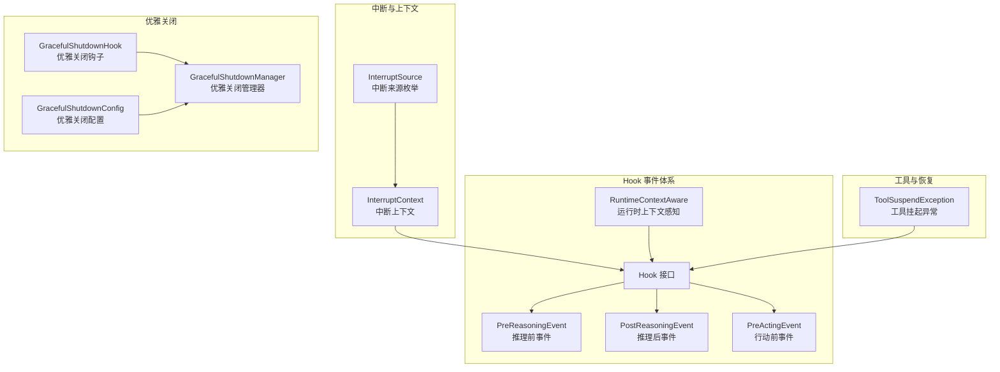
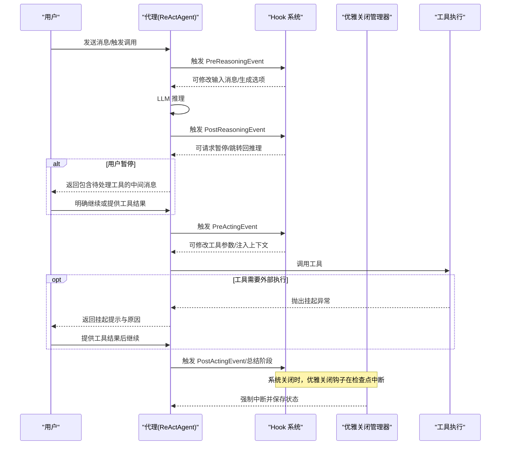
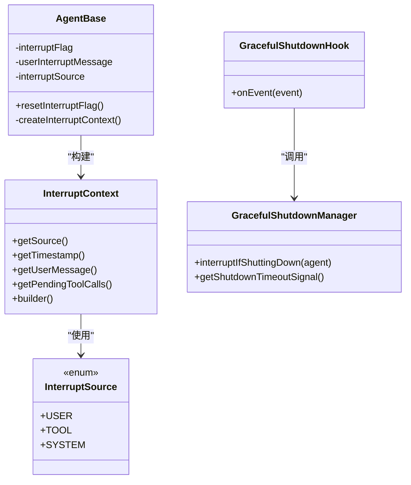
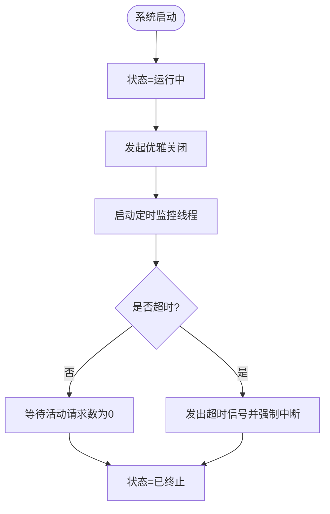
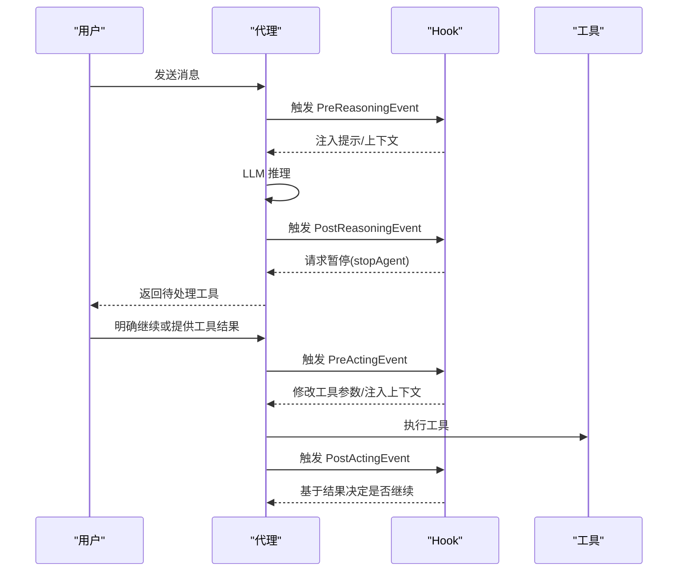
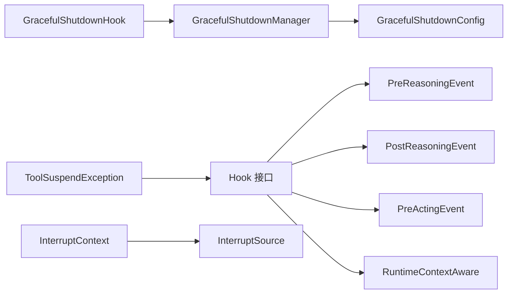

# 智能代理控制

<cite>
**本文引用的文件**
- [InterruptContext.java](file://agentscope-core/src/main/java/io/agentscope/core/interruption/InterruptContext.java)
- [InterruptSource.java](file://agentscope-core/src/main/java/io/agentscope/core/interruption/InterruptSource.java)
- [Hook.java](file://agentscope-core/src/main/java/io/agentscope/core/hook/Hook.java)
- [PreReasoningEvent.java](file://agentscope-core/src/main/java/io/agentscope/core/hook/PreReasoningEvent.java)
- [PostReasoningEvent.java](file://agentscope-core/src/main/java/io/agentscope/core/hook/PostReasoningEvent.java)
- [PreActingEvent.java](file://agentscope-core/src/main/java/io/agentscope/core/hook/PreActingEvent.java)
- [GracefulShutdownHook.java](file://agentscope-core/src/main/java/io/agentscope/core/shutdown/GracefulShutdownHook.java)
- [GracefulShutdownManager.java](file://agentscope-core/src/main/java/io/agentscope/core/shutdown/GracefulShutdownManager.java)
- [GracefulShutdownConfig.java](file://agentscope-core/src/main/java/io/agentscope/core/shutdown/GracefulShutdownConfig.java)
- [ToolSuspendException.java](file://agentscope-core/src/main/java/io/agentscope/core/tool/ToolSuspendException.java)
- [AgentBase.java](file://agentscope-core/src/main/java/io/agentscope/core/agent/AgentBase.java)
- [RuntimeContextAware.java](file://agentscope-core/src/main/java/io/agentscope/core/hook/RuntimeContextAware.java)
- [hitl.md](file://docs/zh/task/hitl.md)
- [HITLBasicE2ETest.java](file://agentscope-core/src/test/java/io/agentscope/core/e2e/HITLBasicE2ETest.java)
</cite>

## 目录
1. [简介](#简介)
2. [项目结构](#项目结构)
3. [核心组件](#核心组件)
4. [架构总览](#架构总览)
5. [详细组件分析](#详细组件分析)
6. [依赖分析](#依赖分析)
7. [性能考虑](#性能考虑)
8. [故障排查指南](#故障排查指南)
9. [结论](#结论)
10. [附录](#附录)

## 简介
本文件聚焦于 AgentScope Java 框架的“智能代理控制”能力，系统性阐述三大核心控制机制及其在生产环境中的安全可控保障：
- 安全中断（Safe Interruption）：在任意时刻暂停代理执行，并完整保留上下文，支持后续恢复。
- 优雅取消（Graceful Cancellation）：在系统关闭或超时场景下，允许推理/行动/总结阶段自然完成后再中断，避免资源浪费。
- 人机交互（Human-in-the-Loop，HITL）：通过 Hook 系统在推理与行动的任意关键点注入人工干预，实现对工具调用的暂停、修正与指导。

这些机制共同构成可审计、可恢复、可治理的代理执行闭环，确保在复杂业务场景下的稳定性与可控性。

## 项目结构
围绕智能代理控制的关键代码主要分布在以下模块：
- 中断与上下文：interruption 包提供中断来源与上下文信息。
- Hook 事件体系：hook 包定义统一的 Hook 接口与各类事件类型（推理前后、行动前后、流式块、错误等），支撑人机交互与外部扩展。
- 优雅关闭：shutdown 包提供全局的优雅关闭管理器、钩子与配置，协调系统级中断与会话保存。
- 工具挂起：tool 包提供工具挂起异常，用于外部执行与暂停恢复。
- 运行时上下文感知：RuntimeContextAware 提供跨 Hook 的运行时上下文注入能力。
- 示例与文档：docs 提供 HITL 使用说明；e2e 测试验证暂停/恢复流程。

**图表来源**
- [InterruptContext.java:40-190](file://agentscope-core/src/main/java/io/agentscope/core/interruption/InterruptContext.java#L40-L190)
- [InterruptSource.java:28-37](file://agentscope-core/src/main/java/io/agentscope/core/interruption/InterruptSource.java#L28-L37)
- [Hook.java:117-187](file://agentscope-core/src/main/java/io/agentscope/core/hook/Hook.java#L117-L187)
- [PreReasoningEvent.java:47-117](file://agentscope-core/src/main/java/io/agentscope/core/hook/PreReasoningEvent.java#L47-L117)
- [PostReasoningEvent.java:51-173](file://agentscope-core/src/main/java/io/agentscope/core/hook/PostReasoningEvent.java#L51-L173)
- [PreActingEvent.java:47-71](file://agentscope-core/src/main/java/io/agentscope/core/hook/PreActingEvent.java#L47-L71)
- [GracefulShutdownHook.java:54-81](file://agentscope-core/src/main/java/io/agentscope/core/shutdown/GracefulShutdownHook.java#L54-L81)
- [GracefulShutdownManager.java:41-321](file://agentscope-core/src/main/java/io/agentscope/core/shutdown/GracefulShutdownManager.java#L41-L321)
- [GracefulShutdownConfig.java:36-70](file://agentscope-core/src/main/java/io/agentscope/core/shutdown/GracefulShutdownConfig.java#L36-L70)
- [ToolSuspendException.java:40-70](file://agentscope-core/src/main/java/io/agentscope/core/tool/ToolSuspendException.java#L40-L70)
- [RuntimeContextAware.java:30-40](file://agentscope-core/src/main/java/io/agentscope/core/hook/RuntimeContextAware.java#L30-L40)

**章节来源**
- [InterruptContext.java:40-190](file://agentscope-core/src/main/java/io/agentscope/core/interruption/InterruptContext.java#L40-L190)
- [Hook.java:117-187](file://agentscope-core/src/main/java/io/agentscope/core/hook/Hook.java#L117-L187)
- [GracefulShutdownManager.java:41-321](file://agentscope-core/src/main/java/io/agentscope/core/shutdown/GracefulShutdownManager.java#L41-L321)

## 核心组件
- 中断上下文与来源
  - 中断上下文记录中断来源、时间戳、用户消息以及被中断时的待处理工具调用列表，便于恢复与审计。
  - 中断来源包括用户触发、工具逻辑触发、系统触发（如超时/资源限制）。
- Hook 事件体系
  - 统一的 Hook 接口与事件类型，支持在推理前/后、行动前/后、流式块、错误等节点进行读写或只读访问。
  - 通过优先级与工具注册，实现高内聚、低耦合的横切控制。
- 优雅关闭管理
  - 全局管理器跟踪活动请求、维护会话绑定、在超时后强制中断并保存状态。
  - 关键检查点（推理后、行动后、总结后）保证阶段完整性，避免令牌浪费。
- 工具挂起与恢复
  - 工具抛出挂起异常时，框架将其转换为挂起结果并返回给用户，等待外部执行与人工确认。
- 运行时上下文感知
  - Hook 可注入当前调用的运行时上下文，实现跨 Hook 的共享状态与协作。

**章节来源**
- [InterruptContext.java:40-190](file://agentscope-core/src/main/java/io/agentscope/core/interruption/InterruptContext.java#L40-L190)
- [InterruptSource.java:28-37](file://agentscope-core/src/main/java/io/agentscope/core/interruption/InterruptSource.java#L28-L37)
- [Hook.java:117-187](file://agentscope-core/src/main/java/io/agentscope/core/hook/Hook.java#L117-L187)
- [GracefulShutdownHook.java:54-81](file://agentscope-core/src/main/java/io/agentscope/core/shutdown/GracefulShutdownHook.java#L54-L81)
- [GracefulShutdownManager.java:41-321](file://agentscope-core/src/main/java/io/agentscope/core/shutdown/GracefulShutdownManager.java#L41-L321)
- [ToolSuspendException.java:40-70](file://agentscope-core/src/main/java/io/agentscope/core/tool/ToolSuspendException.java#L40-L70)
- [RuntimeContextAware.java:30-40](file://agentscope-core/src/main/java/io/agentscope/core/hook/RuntimeContextAware.java#L30-L40)

## 架构总览
下图展示了三大控制机制在代理生命周期中的协同工作方式：

**图表来源**
- [PostReasoningEvent.java:99-110](file://agentscope-core/src/main/java/io/agentscope/core/hook/PostReasoningEvent.java#L99-L110)
- [PreActingEvent.java:67-69](file://agentscope-core/src/main/java/io/agentscope/core/hook/PreActingEvent.java#L67-L69)
- [GracefulShutdownHook.java:72-78](file://agentscope-core/src/main/java/io/agentscope/core/shutdown/GracefulShutdownHook.java#L72-L78)
- [GracefulShutdownManager.java:232-266](file://agentscope-core/src/main/java/io/agentscope/core/shutdown/GracefulShutdownManager.java#L232-L266)
- [ToolSuspendException.java:30-36](file://agentscope-core/src/main/java/io/agentscope/core/tool/ToolSuspendException.java#L30-L36)

## 详细组件分析

### 安全中断（Safe Interruption）
- 设计要点
  - 中断上下文捕获中断来源、时间戳、用户消息与待处理工具调用，确保恢复时具备完整上下文。
  - 代理在每次调用开始重置中断标志与相关状态，避免历史状态污染。
  - 优雅关闭管理器在系统关闭时，仅在安全检查点中断，避免中途打断导致资源浪费。
- 实现路径
  - 中断上下文构建与字段访问：[InterruptContext.java:40-190](file://agentscope-core/src/main/java/io/agentscope/core/interruption/InterruptContext.java#L40-L190)
  - 中断来源枚举：[InterruptSource.java:28-37](file://agentscope-core/src/main/java/io/agentscope/core/interruption/InterruptSource.java#L28-L37)
  - 代理重置中断状态与构建上下文：[AgentBase.java:385-402](file://agentscope-core/src/main/java/io/agentscope/core/agent/AgentBase.java#L385-L402)
  - 优雅关闭钩子在检查点中断：[GracefulShutdownHook.java:72-78](file://agentscope-core/src/main/java/io/agentscope/core/shutdown/GracefulShutdownHook.java#L72-L78)
  - 全局优雅关闭管理器与超时强制中断：[GracefulShutdownManager.java:232-266](file://agentscope-core/src/main/java/io/agentscope/core/shutdown/GracefulShutdownManager.java#L232-L266)

**图表来源**
- [InterruptContext.java:40-190](file://agentscope-core/src/main/java/io/agentscope/core/interruption/InterruptContext.java#L40-L190)
- [InterruptSource.java:28-37](file://agentscope-core/src/main/java/io/agentscope/core/interruption/InterruptSource.java#L28-L37)
- [AgentBase.java:385-402](file://agentscope-core/src/main/java/io/agentscope/core/agent/AgentBase.java#L385-L402)
- [GracefulShutdownHook.java:54-81](file://agentscope-core/src/main/java/io/agentscope/core/shutdown/GracefulShutdownHook.java#L54-L81)
- [GracefulShutdownManager.java:180-196](file://agentscope-core/src/main/java/io/agentscope/core/shutdown/GracefulShutdownManager.java#L180-L196)

**章节来源**
- [InterruptContext.java:40-190](file://agentscope-core/src/main/java/io/agentscope/core/interruption/InterruptContext.java#L40-L190)
- [InterruptSource.java:28-37](file://agentscope-core/src/main/java/io/agentscope/core/interruption/InterruptSource.java#L28-L37)
- [AgentBase.java:385-402](file://agentscope-core/src/main/java/io/agentscope/core/agent/AgentBase.java#L385-L402)
- [GracefulShutdownHook.java:54-81](file://agentscope-core/src/main/java/io/agentscope/core/shutdown/GracefulShutdownHook.java#L54-L81)
- [GracefulShutdownManager.java:180-196](file://agentscope-core/src/main/java/io/agentscope/core/shutdown/GracefulShutdownManager.java#L180-L196)

### 优雅取消（Graceful Cancellation）
- 设计要点
  - 配置化优雅关闭：支持最大等待时长与部分推理结果策略。
  - 活动请求跟踪与会话绑定：在关闭期间保存状态，避免数据丢失。
  - 定时监控与超时强制中断：超过阈值后发出超时信号并强制中断所有活动请求。
- 实现路径
  - 配置项与默认值：[GracefulShutdownConfig.java:36-70](file://agentscope-core/src/main/java/io/agentscope/core/shutdown/GracefulShutdownConfig.java#L36-L70)
  - 全局管理器与超时强制中断逻辑：[GracefulShutdownManager.java:232-266](file://agentscope-core/src/main/java/io/agentscope/core/shutdown/GracefulShutdownManager.java#L232-L266)
  - 在关键检查点触发中断：[GracefulShutdownHook.java:72-78](file://agentscope-core/src/main/java/io/agentscope/core/shutdown/GracefulShutdownHook.java#L72-L78)

**图表来源**
- [GracefulShutdownManager.java:222-266](file://agentscope-core/src/main/java/io/agentscope/core/shutdown/GracefulShutdownManager.java#L222-L266)
- [GracefulShutdownConfig.java:36-70](file://agentscope-core/src/main/java/io/agentscope/core/shutdown/GracefulShutdownConfig.java#L36-L70)
- [GracefulShutdownHook.java:72-78](file://agentscope-core/src/main/java/io/agentscope/core/shutdown/GracefulShutdownHook.java#L72-L78)

**章节来源**
- [GracefulShutdownConfig.java:36-70](file://agentscope-core/src/main/java/io/agentscope/core/shutdown/GracefulShutdownConfig.java#L36-L70)
- [GracefulShutdownManager.java:222-266](file://agentscope-core/src/main/java/io/agentscope/core/shutdown/GracefulShutdownManager.java#L222-L266)
- [GracefulShutdownHook.java:72-78](file://agentscope-core/src/main/java/io/agentscope/core/shutdown/GracefulShutdownHook.java#L72-L78)

### 人机交互（Human-in-the-Loop，HITL）
- 设计要点
  - 在推理后与行动后两个关键点暂停，向用户展示待处理工具或执行结果，由用户决定是否继续。
  - 支持在推理后直接请求暂停，或在行动后基于结果进行二次确认。
  - 通过 Hook 事件的可修改性，注入提示、修正参数或补充上下文。
- 实现路径
  - 推理后暂停与跳转回推理的能力：[PostReasoningEvent.java:99-171](file://agentscope-core/src/main/java/io/agentscope/core/hook/PostReasoningEvent.java#L99-L171)
  - 行动前修改工具调用参数：[PreActingEvent.java:67-69](file://agentscope-core/src/main/java/io/agentscope/core/hook/PreActingEvent.java#L67-L69)
  - Hook 接口与事件类型、优先级与工具注册：[Hook.java:117-187](file://agentscope-core/src/main/java/io/agentscope/core/hook/Hook.java#L117-L187)
  - 运行时上下文注入接口：[RuntimeContextAware.java:30-40](file://agentscope-core/src/main/java/io/agentscope/core/hook/RuntimeContextAware.java#L30-L40)
  - 文档示例与端到端测试参考：
    - [hitl.md:1-47](file://docs/zh/task/hitl.md#L1-L47)
    - [HITLBasicE2ETest.java:280-300](file://agentscope-core/src/test/java/io/agentscope/core/e2e/HITLBasicE2ETest.java#L280-L300)

**图表来源**
- [PostReasoningEvent.java:99-110](file://agentscope-core/src/main/java/io/agentscope/core/hook/PostReasoningEvent.java#L99-L110)
- [PreActingEvent.java:67-69](file://agentscope-core/src/main/java/io/agentscope/core/hook/PreActingEvent.java#L67-L69)
- [Hook.java:117-187](file://agentscope-core/src/main/java/io/agentscope/core/hook/Hook.java#L117-L187)
- [RuntimeContextAware.java:30-40](file://agentscope-core/src/main/java/io/agentscope/core/hook/RuntimeContextAware.java#L30-L40)

**章节来源**
- [PostReasoningEvent.java:99-171](file://agentscope-core/src/main/java/io/agentscope/core/hook/PostReasoningEvent.java#L99-L171)
- [PreActingEvent.java:67-69](file://agentscope-core/src/main/java/io/agentscope/core/hook/PreActingEvent.java#L67-L69)
- [Hook.java:117-187](file://agentscope-core/src/main/java/io/agentscope/core/hook/Hook.java#L117-L187)
- [RuntimeContextAware.java:30-40](file://agentscope-core/src/main/java/io/agentscope/core/hook/RuntimeContextAware.java#L30-L40)
- [hitl.md:1-47](file://docs/zh/task/hitl.md#L1-L47)
- [HITLBasicE2ETest.java:280-300](file://agentscope-core/src/test/java/io/agentscope/core/e2e/HITLBasicE2ETest.java#L280-L300)

## 依赖分析
- 组件耦合与内聚
  - Hook 作为统一扩展点，与事件类型高度内聚，与代理生命周期紧密耦合但通过接口解耦。
  - 优雅关闭管理器与 Hook 协作，通过事件检查点实现系统级中断。
  - 中断上下文与来源为恢复与审计提供基础数据。
- 外部依赖与集成点
  - Hook 事件与运行时上下文感知接口，便于第三方扩展与工具注册。
  - 优雅关闭配置支持灵活的超时策略与策略选择。

**图表来源**
- [Hook.java:117-187](file://agentscope-core/src/main/java/io/agentscope/core/hook/Hook.java#L117-L187)
- [GracefulShutdownHook.java:54-81](file://agentscope-core/src/main/java/io/agentscope/core/shutdown/GracefulShutdownHook.java#L54-L81)
- [GracefulShutdownManager.java:41-321](file://agentscope-core/src/main/java/io/agentscope/core/shutdown/GracefulShutdownManager.java#L41-L321)
- [GracefulShutdownConfig.java:36-70](file://agentscope-core/src/main/java/io/agentscope/core/shutdown/GracefulShutdownConfig.java#L36-L70)
- [InterruptContext.java:40-190](file://agentscope-core/src/main/java/io/agentscope/core/interruption/InterruptContext.java#L40-L190)
- [InterruptSource.java:28-37](file://agentscope-core/src/main/java/io/agentscope/core/interruption/InterruptSource.java#L28-L37)
- [ToolSuspendException.java:40-70](file://agentscope-core/src/main/java/io/agentscope/core/tool/ToolSuspendException.java#L40-L70)
- [RuntimeContextAware.java:30-40](file://agentscope-core/src/main/java/io/agentscope/core/hook/RuntimeContextAware.java#L30-L40)

**章节来源**
- [Hook.java:117-187](file://agentscope-core/src/main/java/io/agentscope/core/hook/Hook.java#L117-L187)
- [GracefulShutdownManager.java:41-321](file://agentscope-core/src/main/java/io/agentscope/core/shutdown/GracefulShutdownManager.java#L41-L321)

## 性能考虑
- Hook 优先级与执行顺序
  - 低优先级先执行，高优先级后执行，建议将关键系统钩子（认证、安全）置于较低优先级以尽早拦截。
- 事件可修改性与最小化变更
  - 仅在必要时修改事件内容，减少不必要的消息复制与序列化开销。
- 优雅关闭的超时设置
  - 合理设置关闭超时，避免无限等待导致资源占用；同时确保关键阶段完成，降低令牌浪费风险。
- 工具挂起与外部执行
  - 将耗时或外部依赖的工具通过挂起异常交由外部执行，避免阻塞代理主线程。

## 故障排查指南
- 代理在系统关闭时未正确保存状态
  - 检查优雅关闭钩子是否在推理后/行动后/总结后触发中断：[GracefulShutdownHook.java:72-78](file://agentscope-core/src/main/java/io/agentscope/core/shutdown/GracefulShutdownHook.java#L72-L78)
  - 确认全局管理器的超时信号与强制中断逻辑是否生效：[GracefulShutdownManager.java:232-266](file://agentscope-core/src/main/java/io/agentscope/core/shutdown/GracefulShutdownManager.java#L232-L266)
- 人机交互暂停后无法恢复
  - 确认 Hook 是否在推理后请求了暂停并返回了包含待处理工具的消息：[PostReasoningEvent.java:99-110](file://agentscope-core/src/main/java/io/agentscope/core/hook/PostReasoningEvent.java#L99-L110)
  - 检查端到端测试中的恢复流程与工具结果注入：[HITLBasicE2ETest.java:280-300](file://agentscope-core/src/test/java/io/agentscope/core/e2e/HITLBasicE2ETest.java#L280-L300)
- 工具执行被意外中断
  - 若工具需要外部执行，应抛出挂起异常并等待用户提供结果：[ToolSuspendException.java:30-36](file://agentscope-core/src/main/java/io/agentscope/core/tool/ToolSuspendException.java#L30-L36)
- 中断上下文缺失或不完整
  - 核对中断上下文构建与字段填充逻辑：[InterruptContext.java:397-402](file://agentscope-core/src/main/java/io/agentscope/core/interruption/InterruptContext.java#L397-L402)

**章节来源**
- [GracefulShutdownHook.java:72-78](file://agentscope-core/src/main/java/io/agentscope/core/shutdown/GracefulShutdownHook.java#L72-L78)
- [GracefulShutdownManager.java:232-266](file://agentscope-core/src/main/java/io/agentscope/core/shutdown/GracefulShutdownManager.java#L232-L266)
- [PostReasoningEvent.java:99-110](file://agentscope-core/src/main/java/io/agentscope/core/hook/PostReasoningEvent.java#L99-L110)
- [HITLBasicE2ETest.java:280-300](file://agentscope-core/src/test/java/io/agentscope/core/e2e/HITLBasicE2ETest.java#L280-L300)
- [ToolSuspendException.java:30-36](file://agentscope-core/src/main/java/io/agentscope/core/tool/ToolSuspendException.java#L30-L36)
- [InterruptContext.java:397-402](file://agentscope-core/src/main/java/io/agentscope/core/interruption/InterruptContext.java#L397-L402)

## 结论
AgentScope Java 框架通过“安全中断、优雅取消、人机交互”三大机制，实现了对智能代理执行过程的全面控制：
- 安全中断确保在任意时刻都能暂停并保留上下文，支持恢复与审计；
- 优雅取消在系统关闭时最大化保留输出与状态，避免资源浪费；
- 人机交互通过 Hook 在关键节点注入人工干预，提升安全性与可控性。

这些机制相互配合，形成生产级的代理控制闭环，满足复杂业务场景下的稳定性与合规要求。

## 附录
- 相关文档与示例
  - [hitl.md:1-47](file://docs/zh/task/hitl.md#L1-L47)
  - [HITLBasicE2ETest.java:280-300](file://agentscope-core/src/test/java/io/agentscope/core/e2e/HITLBasicE2ETest.java#L280-L300)